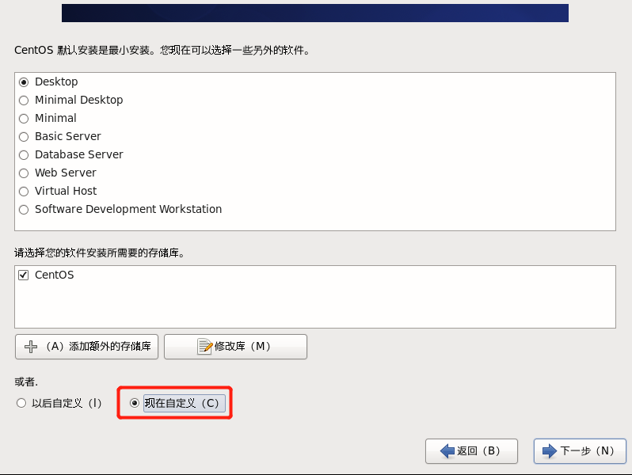

## 安装虚拟机VM12

- 不勾选增强型键盘驱动程序
- 不勾选启动时检查产品更新
- 不勾选用户体验
- 秘钥

```text
5A02H-AU243-TZJ49-GTC7K-3C61N
```


## 安装Xshell

- 秘钥

```text
150105-116578-999990
```


### 使用xshell进行连接登陆操作

打开文件，新建，添加名称和端口号，点击确定，选择刚添加的连接，点击连接，输入用户名root，输入密码，连接虚拟机。


## 检查BIOS虚拟化支持

- Win10：点击任务管理器->性能->右下角，虚拟化可以查看是否开启

 

- 一般主板
  - 在BIOS Security 选择Virtualization Technology
- 在华硕主板中
  - 高级->cpu设置->intel(VX) Virtualization Technology 开启


## 新建虚拟机

- 点击创建虚拟机+
  - 自定义(高级)
  - 安装程序光盘镜像iso，先选择一个镜像文件，这里是centos-6.8
  - 选择稍后安装操作系统
  - 客户机操作系统：选择Linux，版本：CentOS64位
  - 选择处理器数量4，每个核心数量2，总核心数量8
  - 内存2048
  - 设置网络NAT
    - 表示本台虚拟机对外网不可见，通过windows访问，如果是桥接，则等价于2台独立的电脑访问，虚拟机对外网可见
    - 在完全装完后，点击网络电脑图标选择System eth0 即可上网
  - 选择LSI
  - 选择SCSI
  - 选择磁盘大小50G，将虚拟机拆分多个文件
  - 全部完成之后，点击虚拟机
  - 选择CD/DVD，查找到对应的ISO文件
  - 开启虚拟机进行安装CentOS，默认第一个安装
    - 选择skip


## 在CentOS欢迎页面

- next

- 选择中文

- 选择键盘语言：美国英语

- 选择存储设备：基本存储设备

- 选择忽略所有数据

- 给计算机起名字

- 网络环境等安装完成后再配置

- 选择时区：亚洲/上海

- 必要设置root密码

  - 此处设置root/123456

- 硬盘分区

  - 创建自定义布局

- 新建根分区

  - 点击创建->标准分区->创建->挂载点：/;文件系统类型：ext4；大小：48950，固定大小

- 创建Boot分区

  - 点击空闲->标准分区->创建->挂载点：/boot;文件系统类型：ext4；大小：200,固定大小

- 创建swap分区

  - 当内存超过设定值时，使用硬盘分配的swap分区大小作为内存使用，防止宕机
  - 点击空闲->标准分区->创建->挂载点：不适用；文件系统类型：swap；大小：2048，固定大小

- 下一步->格式化->将修改写入磁盘

- 程序引导

  - 直接下一步

  - 定制系统软件

    - 现在自定义，下一步

     

  - Web服务环境

    - 不选择

  - 可扩展文件系统支持

    - 不选择

  - 基本系统

    - 兼容程序库，基本

  - 应用程序

    - 互联网浏览器

  - 其他可以都不勾选，使用时再安装

  - 桌面

    - 去除KDE桌面，其他都选

  - 语言支持

    - 中文支持

  - 系统管理，虚拟化，负载均衡，高可用都可以不选

  - 开始安装CentOs，安装完成，点击重新引导

  - 欢迎引导页面->前进

  - 许可证->同意->前进

  - 创建用户

    - 可以不创建

  - 时间日期

    - 当前时间日期
    - 非网络更新

  - Kdump去除，不启用

  - 重启后登陆


## 安装VMTools

- VM的一组工具，用于虚拟化显示和调整，便于和主机交互，如创建共享文件夹，可以直接拖文件到虚拟机中，显示分辨率调整
- 安装：选择虚拟机菜单栏->安装VMwareTools
  		将.tar.gz文件拖拽到桌面
    		右键解压到此处
    		找到vmware-install.pl文件、
    		在终端中打开命令窗口，在解压的文件目录下执行./vmware-install.pl命令运行，依次回车


