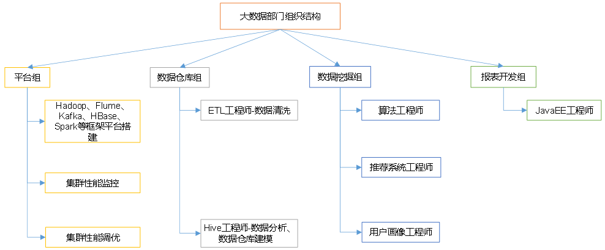

# 大数据概论

> big data 指**无法再一定时间范围**内用常规软件工具进行捕捉，管理和处理的数据集合，需要新处理模式才能具有更强的决策力，洞察发现力，流程优化能力的**海量，高增长率和多样化的信息资产**。

主要解决：海量数据的==存储==，海量数据的==分析计算==问题

存储单位：bit，Byte，KB，MB，GB，**TB**，**PB**，**EB**，ZB

- 1 TB = 1024GB
- 1 PB = 1024TB

## 大数据特点 4V

- Volume 大量，目前人类的所有印刷的数据量是200PB，历史上人类的总共说过的话的数据量大约是5EB，典型的个人计算机银盘的容量为TB量级，企业已接近EB

- Velocity 高速，大数据区别于传统数据的显著特征，从海量数据中快速获取期望的数据，数据处理的高效。

- Variety 多样

  - 结构化数据：数据库，文本
  - 非结构化数据：网络日志，音频，视频，图片，地理位置等

- Value 低价值密度，价值密度大小与数据总量大小成反比，最有价值的数据比较小，如何对有价值的数据提纯是当前大数据急需要解决的问题。

  

## 应用场景

- 物流仓储：大数据分析系统助力商家精细化运营，提升销量，节约成本

- 零售：分析用户消费习惯，给用户购买商品提供方便，提升商品销量

  - 典型案例：纸尿布+啤酒，在纸尿布的销量和啤酒的销量成正比，原因是有孩子的家庭买纸尿布的人是男性，从而一般会购买啤酒，那么将纸尿布和啤酒摆放的位置接近，可提升销量。

- 旅游：深度结合大数据能力和旅游业的需求，共建旅游产业的智慧管理，智慧服务，智慧营销的未来

- 商品广告推荐：给用户推荐可能喜欢的商品

- 保险：海量数据挖掘以及风险预测，助力保险行业精准营销，提升精细化定价能力

- 金融：多维度体现用户特征，帮助金融机构推荐优质客户，防范欺诈风险

- 房产：大数据全面助力房地产行业，打造精准营销，选择合适的地，建造合适楼，卖给合适的人

- 人工智能

  

## 大数据部门业务流程

- 产品人员提出需求（统计总用户数，日活跃用户数，回流用户数等）

- 数据部门搭建数据平台，分析数据指标

- 数据可视化（报表展示，邮件发送，大屏幕显示）

  

## 大数据部门组织结构

