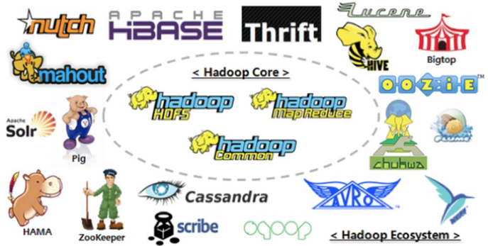
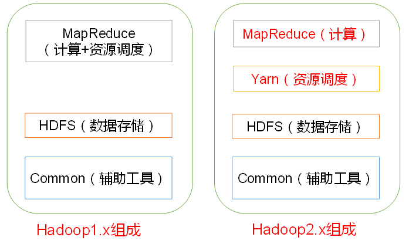
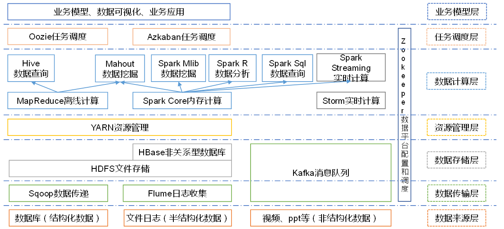
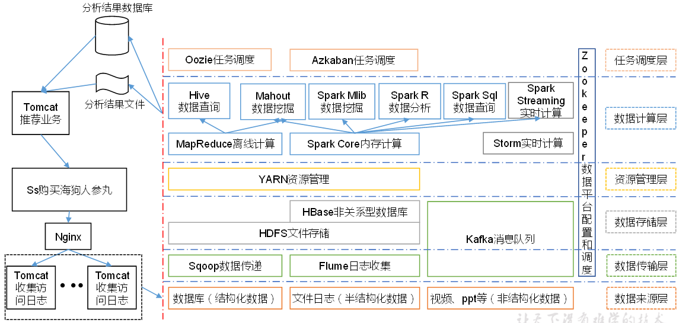

# Hadoop框架

- 一个由Apache基金会所开发的分布式系统基础架构
- 处理海量数据的==存储==，海量数据的==分析计算==问题
- 广义上而言，Hadoop通常是指一个更广泛的概念---Hadoop生态圈

## Hadoop发展历史

- Lucene框架是Doug Cutting使用java开发的开源软件，实现与Google类似的全文搜索功能，提供了全文检索引擎架构，包括完整的查询引擎和索引引擎

- 2001年底Lucene成为Apache基金会的子项目

- 对于海量数据，Lucene面对与Google同样的困难，数据**存储困难**，**检索速度慢**

- 学习和模仿谷歌解决这些问题：微型版Nutch

- Google是Hadoop的思想之源，Google的三篇大数据论文

  - GFS —>HDFS
  - Map-Reduce —> MR
  - BigTable —>HBase

- 2003-2004，Google公开了部分GFS和MapReduce的思想细节，以此为基础Doug Cutting用业余时间完成了DFS以及MapReduce机制，使得Nutch性能飙升

- 2005年，Hadoop作为Lucene的子项目Nutch的一部分引入Apache基金会

- 2006年，Map-Reduce和Nutch Distributed File System （NDFS）分别被纳入到Hadoop中

- Hadoop来源是Doug Cutting儿子的玩具大象

  

## Hadoop三大发行版本

- Apache 版本：最基础，最原始的版本，入门学习使用
  - Apache Hadoop
  - 官网：http://hadoop.apache.org/releases.html
  - 下载：https://archive.apache.org/dist/hadoop/common/
- Cloudera 在中大型互联网企业中用的较多-**CDH**
  - 2008年成立的Cloudera是最早将Hadoop商用的公司，为合作伙伴提供Hadoop的商用解决方案，主要包括支持，咨询服务，培训
  - 2009年，Hadoop创始人Doug Cutting加盟Cloudera公司
  - Cloudera公司产品主要为**CDH**，Cloudera Manager，Cloudera Support
  - CDH 是 Cloudera公司的Hadoop发行版本，完全开源，比Apache Hadoop在兼容性，安全性，稳定性上有所增强
  - Cloudera Manager是集群的软件分发以及管理监控平台，可以在几个小时部署好一个Hadoop集群，并对集群节点以及服务进行实时监控
  - Cloudera Support 是对Hadoop的技术支持
  - Cloudera 开发并贡献了可实时处理大数据的Impala项目
  - 官网：https://www.cloudera.com/downloads/cdh/5-10-0.html
  - 下载：http://archive-primary.cloudera.com/cdh5/cdh/5/
- Hortonworks 文档较好-**HDP**
  - 2011年成立，是雅虎和谷歌风投公司Benchmark Capital合资组建
  - **公司成立之初就吸纳了大约25名至30名专门研究Hadoop的雅虎工程师，上述工程师均在2005年开始协助雅虎开发Hadoop，贡献了Hadoop80%的代码**
  - Hortonworks的主打产品是Hortonworks Data Platform（HDP），也同样是100%开源的产品，HDP除常见的项目外还包括了Ambari，一款开源的安装和管理系统
  - HCatalog，一个元数据管理系统，HCatalog现已集成到Facebook开源的Hive中。Hortonworks的Stinger开创性的极大的优化了Hive项目。Hortonworks为入门提供了一个非常好的，易于使用的沙盒
  - Hortonworks开发了很多增强特性并提交至核心主干，这使得Apache Hadoop能够在包括Window Server和Windows Azure在内的Microsoft Windows平台上本地运行。定价以集群为基础，每10个节点每年为12500美元
  - 官网：https://hortonworks.com/products/data-center/hdp/
  - 下载：https://hortonworks.com/downloads/#data-platform

## Hadoop优势

- 高可靠性：Hadoop底层维护多个数据副本，即使Hadoop某个计算单元出现故障，也不会导致数据丢失
- 高扩展性：在集群间分配任务数据，可以方便的扩展节点
- 高效性：在MapReduce的思想下，Hadoop是并行工作的，以加快任务处理速度
- 高容错性：可以自动将失败的任务重新分配

# Hadoop组成

Hadoop1.x 和Hadoop 2.x的区别

在Hadoop1.x的时候

- MapReduce同时处理业务逻辑运算和资源调度
- 耦合性比较大

在Hadoop2.x的时候

- 增加了Yarn负责资源调度
- MapReduce只负责运算

## HDFS 架构

> Hadoop Distributed File System 分布式文件系统

- NameNode：nn 

  - 存储文件的元数据，如文件名，文件目录结构，文件属性（生成时间，副本数，文件权限）
  - 存储每个文件块列表，块所在的DataNode等
  - 类似索引

- DataNode：dn

  - 在本地文件系统存储文件块数据，以及块数据的校验和

- Secondary NameNode：2nn

  - 监控HDFS状态的辅助后台程序

  - 每隔一段时间获取HDFS元数据的快照

  - 等于是NameNode的备份节点

    

## Yarn 架构

## MapReduce架构

> 将计算过程分为2个阶段：map阶段，reduce阶段

- map阶段：并行处理输入数据

- reduce阶段：对map的结果进行汇总

  

# 大数据技术生态体系

## Sqoop 数据传递

- 开源工具
- 在Hadoop，Hive与传统的数据库（Mysql）间进行数据传输
- 将一个关系型数据库中的数据导入到Hadoop的HDFS中，
- 将HDFS的数据导入到关系型数据库中

## Flume 日志收集

- Cloudera提供的一个高可用，高可靠的分布式**海量日志**采集，集合，传输的系统
- 支持在日志系统中定制各种数据发送方，用于收集数据
- 提供堆数据进行简单处理，并写入到各种数据接收方（可定制）的能力

## Kafka 消息队列

- 一种高吞吐量的分布式发布订阅消息系统
- 通过O(1)的磁盘数据结构提供消息的持久化
- 对于数据在TB的消息存储也可以有长时间的稳定性
- 高吞吐量：即使非常普通的硬件，Kafka也可以支持每秒百万的消息
- 支持通过Kafka服务器和消费机集群来区分消息
- 支持Hadoop**并行数据**加载

## Storm 流式计算

- 用于连续计算，对数据流进行连续查询，在计算时就将结果以流的形式输出给用户

## Spark 内存计算

- 当前最流行的开源大数据**内存计算**框架，就Hadoop上存储的大数据进行计算

## Oozie 定时调度

- 一个管理Hadoop作业（job）的工作流程调度管理系统

## Hbase 非结构化列式数据库

- 面向列的开源分布式数据库
- 适合于非结构化数据存储的数据库

## Hive 数据仓库工具

- 基于Hadoop的一个**数据仓库工具**
- 将结构化的数据映射为一张数据库表，提供简单的SQL查询功能
- 将SQL语句转换为MapReduce任务进行运行
- 不用开发专门的MapReduce应用
- 适合数据仓库的统计分析

## R语言

- 用于统计分析，绘图的语言，统计计算和统计制图的优秀工具
- 属于GNU系统的一个自由，免费，源代码开放的软件

## Mahout 机器学习

- Apache Mahout 是一个可扩展的机器学习和数据挖掘库

## Zookeeper 分布式管理

- Google的Chubby一个开源的实现

- 针对大型分布式系统的可靠性协调系统

- 功能：配置维护，名字服务，分布式同步，组服务等

- 封装好复杂易出错的关键服务，将简单易用的接口和性能高效，功能稳定的系统提供给用户。

  

# 推荐系统架构

