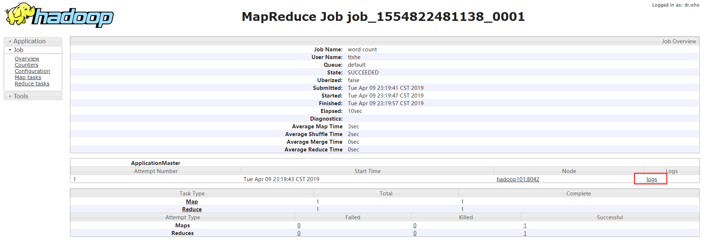

# 配置历史服务器

- 配置mapred-site.xml

  - 在原先的配置中增加历史的配置

  ```xml
  [ttshe@hadoop101 hadoop]$ pwd
  /opt/module/hadoop-2.7.2/etc/hadoop
  [ttshe@hadoop101 hadoop]$ vim mapred-site.xml
  # 增加如下配置参数
  <!-- 历史服务器端地址 -->
  <property>
      <name>mapreduce.jobhistory.address</name>
      <value>hadoop101:10020</value>
  </property>
  <!-- 历史服务器web端地址 -->
  <property>
      <name>mapreduce.jobhistory.webapp.address</name>
      <value>hadoop101:19888</value>
  </property>
  ```

- 启动历史服务器

  ```shell
  [ttshe@hadoop101 hadoop-2.7.2]$ sbin/mr-jobhistory-daemon.sh start historyserver
  starting historyserver, logging to /opt/module/hadoop-2.7.2/logs/mapred-ttshe-historyserver-hadoop101.out
  [ttshe@hadoop101 hadoop-2.7.2]$ jps
  12208 Jps
  8680 NameNode
  8812 DataNode
  12158 JobHistoryServer
  ```

- 查看Web页面：http://hadoop101:19888/jobhistory

  

  点击页面中的counters，查看MapReduce的运行情况

  

  点击configuration，可以看到该job运行的配置信息

  

  这里的logs需要开启配置日志信息