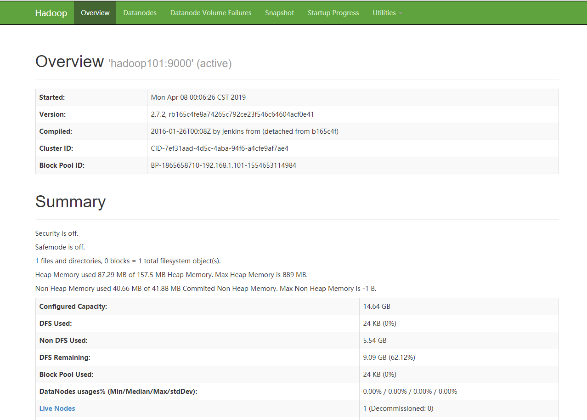
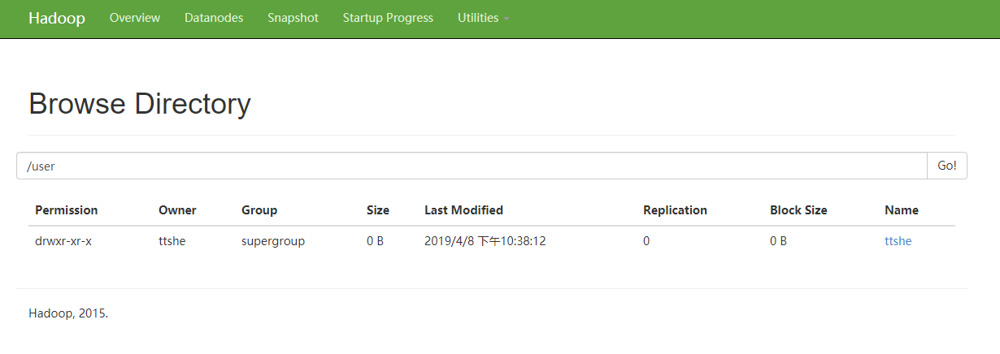
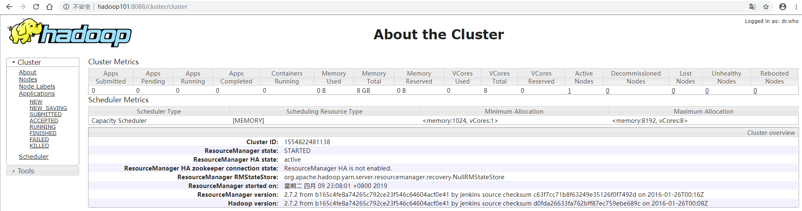

## 启动HDFS-运行MapReduce 程序

> **Pseudo-Distributed Operation**
> Hadoop can also be run on a single-node in a pseudo-distributed mode where each Hadoop daemon runs in a separate Java process.


### 配置集群

- 配置 hadoop-env.sh

  - 这里env.sh可以看到注释上说明，只需要修改JAVA_HOME，其他都是可选的，在分布式配置的时候，需要修改JAVA_HOME

  ```shell
  [ttshe@hadoop101 hadoop]$ pwd
  /opt/module/hadoop-2.7.2/etc/hadoop
  [ttshe@hadoop101 hadoop]$ echo $JAVA_HOME
  /opt/module/jdk1.8.0_144
  [ttshe@hadoop101 hadoop]$ vi hadoop-env.sh 
  # Set Hadoop-specific environment variables here.
  # The only required environment variable is JAVA_HOME.  All others are
  # optional.  When running a distributed configuration it is best to
  # set JAVA_HOME in this file, so that it is correctly defined on
  # remote nodes.
  # The java implementation to use.
  export JAVA_HOME=/opt/module/jdk1.8.0_144
  ```

- 配置core-site.xml

  - 关于配置项介绍，在官网配置页面的左下角可见：http://hadoop.apache.org/docs/stable/hadoop-project-dist/hadoop-common/core-default.xml

  | 参数           | 默认值                                     | 描述                                                         |
  | -------------- | ------------------------------------------ | ------------------------------------------------------------ |
  | fs.defaultFS   | file:/// 表示本地                          | The name of the default file system. A URI whose scheme and authority determine the FileSystem implementation. The uri's scheme determines the config property (fs.SCHEME.impl) naming the FileSystem implementation class. The uri's authority is used to determine the host, port, etc. for a filesystem.<br />指定HDFS中的**NameNode**的地址 |
  | hadoop.tmp.dir | /tmp/hadoop-${user.name} 表示在tmp文件夹下 | A base for other temporary directories.<br />指定Hadoop运行时产生的文件存储目录，一般需要磁盘比较大，否则文件会很多，需要搬移 |

  ```xml
  [ttshe@hadoop101 hadoop]$ vi core-site.xml 
  <configuration>
    <property>
        <name>fs.defaultFS</name>
        # 注意配置该项目后，本地模式不生效，如果还要使用本地模式，则需要去除该配置或者配置file:///
        <value>hdfs://hadoop101:9000</value>
    </property>
    <property>
        <name>hadoop.tmp.dir</name>
        <value>/opt/module/hadoop-2.7.2/data/tmp</value>
    </property>
  </configuration>
  ```

- 配置hdfs-site.xml

  - 官网配置 http://hadoop.apache.org/docs/stable/hadoop-project-dist/hadoop-hdfs/hdfs-default.xml 可查看

  | 参数            | 默认值 | 描述                                                         |
  | --------------- | ------ | ------------------------------------------------------------ |
  | dfs.replication | 3      | Default block replication. The actual number of replications can be specified when the file is created. The default is used if replication is not specified in create time.<br />指定HDFS的副本数量，只在集群中的副本的个数，因为是伪分布式配置，就一台机器，复制多余1个没有意义。 |

  ```xml
  [ttshe@hadoop101 hadoop]$ vi hdfs-site.xml
  <configuration>
    <property>
        <name>dfs.replication</name>
        <value>1</value>
    </property>
  </configuration>
  ```


### 启动集群


#### 格式化NameNode

> 第一次启动时格式化，以后不要总格式化

```shell
[ttshe@hadoop101 hadoop-2.7.2]$ bin/hdfs namenode -format
```


#### 启动NameNode

> 关闭使用stop

```shell
[ttshe@hadoop101 hadoop-2.7.2]$ sbin/hadoop-daemon.sh start namenode
starting namenode, logging to /opt/module/hadoop-2.7.2/logs/hadoop-ttshe-namenode-hadoop101.out
```


#### 启动DataNode

```shell
[ttshe@hadoop101 hadoop-2.7.2]$ sbin/hadoop-daemon.sh start datanode
starting datanode, logging to /opt/module/hadoop-2.7.2/logs/hadoop-ttshe-datanode-hadoop101.out
```


#### 查看是否启动成功

```shell
# 查看进程是否存在，存在则表示启动成功
[ttshe@hadoop101 hadoop-2.7.2]$ jps -l
8903 sun.tools.jps.Jps
8680 org.apache.hadoop.hdfs.server.namenode.NameNode
8812 org.apache.hadoop.hdfs.server.datanode.DataNode
```


#### 通过Web查看HDFS文件系统

访问：http://192.168.1.101:50070/dfshealth.html#tab-datanode

推荐配置host（C:/Windows/System32/drivers/etc/hosts）

```shell
192.168.1.100 hadoop100
192.168.1.101 hadoop101
192.168.1.102 hadoop102
192.168.1.103 hadoop103
192.168.1.104 hadoop104
192.168.1.105 hadoop105
192.168.1.106 hadoop106
```

可以指定名称访问如http://hadoop101:50070/dfshealth.html#tab-datanode



重点关注Utilities中的Browse the file system，完全仿照Linux的目录树结构搜索数据。


#### 查看日志

```shell
[root@hadoop101 logs]# ll
总用量 64
-rw-r--r--. 1 ttshe root 24121 4月   8 00:08 hadoop-ttshe-datanode-hadoop101.log
-rw-r--r--. 1 ttshe root   716 4月   8 00:08 hadoop-ttshe-datanode-hadoop101.out
-rw-r--r--. 1 ttshe root 27765 4月   8 00:08 hadoop-ttshe-namenode-hadoop101.log
-rw-r--r--. 1 ttshe root  5007 4月   8 22:24 hadoop-ttshe-namenode-hadoop101.out
-rw-r--r--. 1 ttshe root     0 4月   8 00:06 SecurityAuth-ttshe.audit
[root@hadoop101 logs]# pwd
/opt/module/hadoop-2.7.2/logs

```


### 操作集群

> 在HDFS系统上操作目录，和Linux上的命令一致

- 创建一个input文件夹

  ```shell
  [ttshe@hadoop101 hadoop-2.7.2]$ bin/hdfs dfs -mkdir -p /user/ttshe/input
  
  ```

  在HDFS系统页面上可以查询得到相应的结果

  

  注意Owner 和Group与Linux的区别

- 上传测试文件到HDFS中，将wcinput中的wc.input文件上传

  ```shell
  [ttshe@hadoop101 hadoop-2.7.2]$ bin/hdfs dfs -put wcinput/wc.input /user/ttshe/input/
  ```

- 查看是否上传成功

  ```shell
  [ttshe@hadoop101 hadoop-2.7.2]$ bin/hdfs dfs -ls /user/ttshe/input
  Found 1 items
  -rw-r--r--   1 ttshe supergroup         66 2019-04-08 22:57 /user/ttshe/input/wc.input
  [ttshe@hadoop101 hadoop-2.7.2]$ bin/hdfs dfs -cat /user/ttshe/input/wc.input
  hadoop yarn
  hadoop mapreduce
  study
  deep-learning
  ttshe
  dd
  atguigu
  ```

- 运行MapReduce程序

  ```shell
  [ttshe@hadoop101 hadoop-2.7.2]$ bin/hadoop jar share/hadoop/mapreduce/hadoop-mapreduce-examples-2.7.2.jar wordcount /user/ttshe/input /user/ttshe/output
  ```

- 查看结果

  ```shell
  [ttshe@hadoop101 hadoop-2.7.2]$ bin/hdfs dfs -cat /user/ttshe/output/*
  atguigu	1
  dd	1
  deep-learning	1
  hadoop	2
  mapreduce	1
  study	1
  ttshe	1
  yarn	1
  ```

  通过浏览器可以查看

  


### 注意事项

- 不能一直格式化NameNode，格式化NameNode需要注意的事项

  ```shell
  # 查看当前name节点版本
  [root@hadoop101 current]# pwd
  /opt/module/hadoop-2.7.2/data/tmp/dfs/name/current # 在core-site.xml中配置的路径
  [root@hadoop101 current]# cat VERSION
  #Mon Apr 08 00:05:15 CST 2019
  namespaceID=392562494
  clusterID=CID-7ef31aad-4d5c-4aba-94f6-a4cfe9af7ae4
  cTime=0
  storageType=NAME_NODE
  blockpoolID=BP-1865658710-192.168.1.101-1554653114984
  layoutVersion=-63
  
  ```

  格式化NameNode，会产生新的集群ID，导致NameNode和DataNode的CID不一致（都在各自的current下存储），集群找不到以往数据，所以在格式化NameNode的时候，需要先删除data数据和log日志（rm -rf data/ logs/），然后再格式化NameNode

  


## 启动YARN-运行MapReduce程序

- 配置集群在YARN上运行MR
- 启动，测试集群增删改
- 在YARN上执行WordCount案例


### 配置集群

- 配置yarn-env.sh

  - 配置参数说明：http://hadoop.apache.org/docs/stable/hadoop-yarn/hadoop-yarn-common/yarn-default.xml
  - 配置JAVA_HOME

  ```shell
  [root@hadoop101 hadoop]# pwd
  /opt/module/hadoop-2.7.2/etc/hadoop
  [root@hadoop101 hadoop]# vim yarn-env.sh
  # 在23行的位置进行配置当前的JAVA_HOME
   22 # some Java parameters
   23 export JAVA_HOME=/opt/module/jdk1.8.0_144
  ```
  
- 配置yarn-site.xml

  - 配置nodemanager
  - 配置resourcemanager

  ```xml
  <configuration>
      <!--reducer获取数据的方式 shuffle是mapreduce的核心，需要重点掌握的知识点 -->
      <property>
          <name>yarn.nodemanager.aux-services</name>
          <value>mapreduce_shuffle</value>
      </property>
      <!-- 指定YARN的ResourceManager的地址,当前resourcemanager放在那台主机上运行 -->
      <property>
          <name>yarn.resourcemanager.hostname</name>
          <value>hadoop101</value>
      </property>
  <!-- Site specific YARN configuration properties -->
  </configuration>
  ```
  
- 配置mapred-env.sh

  - 配置JAVA_HOME

  ```shell
  [root@hadoop101 hadoop]# vim mapred-env.sh
  # 可以在第16行找到注释掉的配置
  16 export JAVA_HOME=/opt/module/jdk1.8.0_144
  ```
  
- 配置mapred-site.xml

  - 配置参数说明：http://hadoop.apache.org/docs/stable/hadoop-mapreduce-client/hadoop-mapreduce-client-core/mapred-default.xml
  - 对mapred-site.xml.template 重命名为mapred-site.xml

  | 参数名                   | 默认值 | 说明                                                         |
  | ------------------------ | ------ | ------------------------------------------------------------ |
  | mapreduce.framework.name | local  | The runtime framework for executing MapReduce jobs. Can be one of local, classic or yarn.<br />说明默认的mapreduce是运行在本地的，这里要配置运行在yarn上 |

  ```xml
  [root@hadoop101 hadoop]# mv mapred-site.xml.template mapred-site.xml
  [root@hadoop101 hadoop]# vim mapred-site.xml 
  # 配置如下参数
  <configuration>
      <!-- 指定MR运行在YARN上 -->
      <property>
          <name>mapreduce.framework.name</name>           
          <value>yarn</value>
      </property>
  </configuration>
  ```


### 启动集群

- 启动前必须保证NameNode和DataNode已经启动

- 启动ResourceManager

  ```shell
  [root@hadoop101 hadoop-2.7.2]# sbin/yarn-daemon.sh start resourcemanager
  starting resourcemanager, logging to /opt/module/hadoop-2.7.2/logs/yarn-root-resourcemanager-hadoop101.out
  ```
  
- 启动NodeManager

  ```shell
  [root@hadoop101 hadoop-2.7.2]# sbin/yarn-daemon.sh start nodemanager
  starting nodemanager, logging to /opt/module/hadoop-2.7.2/logs/yarn-root-nodemanager-hadoop101.out
  ```
  
- 查看是否启动成功

  ```shell
  [root@hadoop101 hadoop-2.7.2]# jps
  11314 Jps
  8680 NameNode
  11178 NodeManager
  8812 DataNode
  10908 ResourceManager
  ```


### 操作集群

- 通过Web访问YARN
  - http://hadoop101:8088/cluster



- 删除系统上的output文件（之前启动HDFS运行MapReduce程序时，输出的文件，需要删除，由于下面操作MapReduce要重新生成一个output文件）

  ```shell
  [ttshe@hadoop101 hadoop-2.7.2]$ bin/hdfs dfs -rm -R /user/ttshe/output
  19/04/09 23:17:04 INFO fs.TrashPolicyDefault: Namenode trash configuration: Deletion interval = 0 minutes, Emptier interval = 0 minutes.
  Deleted /user/ttshe/output
  ```
  
- 注意用户要是创建output的用户，如ttshe，否则没有权限删除
  
- 执行MapReduce程序

  ```shell
  [ttshe@hadoop101 hadoop-2.7.2]$ bin/hadoop jar share/hadoop/mapreduce/hadoop-mapreduce-examples-2.7.2.jar wordcount /user/ttshe/input /user/ttshe/output
  ```
  
- 查看结果

  ```shell
  [ttshe@hadoop101 hadoop-2.7.2]$ bin/hdfs dfs -cat /user/ttshe/output/*
  atguigu	1
  dd	1
  deep-learning	1
  hadoop	2
  mapreduce	1
  study	1
  ttshe	1
  yarn	1
  ```
  


运行的过程可以在页面中观察，而History需要接下来配置就可以看到运行的记录。


