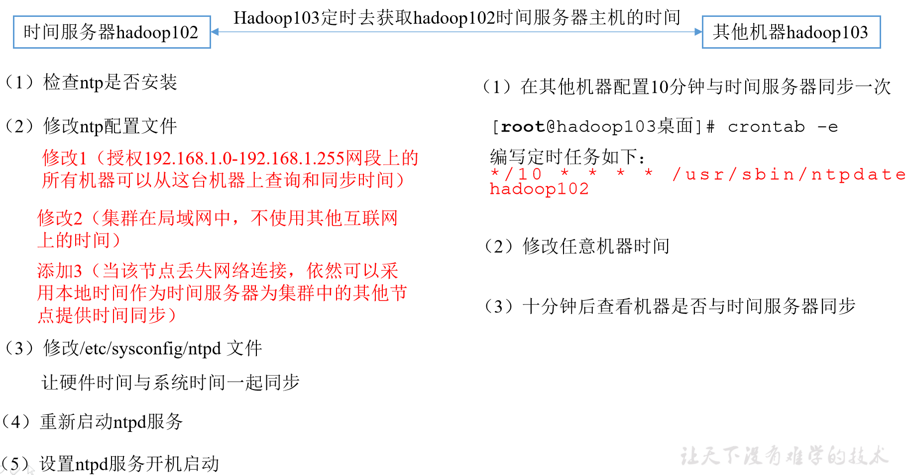

#  流程

- <a href="#虚拟机环境准备">准备3台虚拟机（关闭防火墙，静态ip，配置主机名称）</a>

- <a href="# 安装JDK">安装JDK，配置环境变量</a>

- <a href="# 安装Hadoop">安装Hadoop，配置环境变量</a>

- 配置集群

- 单点启动

- 配置ssh

- 群起并测试集群


# 规划

|      | hadoop102              | hadoop103                        | hadoop104                       |
| ---- | ---------------------- | -------------------------------- | ------------------------------- |
| HDFS | NameNode<br />DataNode | DataNode                         | SecondaryNameNode<br />DataNode |
| YARN | NodeManager            | NodeManager<br />ResourceManager | NodeManager                     |

- NameNode和SecondaryNameNode配置的内存是一样的
- NameNode是HDFS的索引节点，需要有充足的内存
- ResourceManager也需要有充足的内存
- NameNode和SecondaryNameNode，ResourceManager需要部署在不同的机器上，分配足够的内存


# 集群配置


## core-site.xml

> 核心文件，在 core-site.xml下配置如下参数

```shell
# 配置nameNode的服务的后台访问地址，由于nameNode是在hadoop102上部署，因此需要指定
[ttshe@hadoop102 hadoop]$ pwd
/opt/module/hadoop-2.7.2/etc/hadoop
[ttshe@hadoop102 hadoop]$ vi core-site.xml 

<configuration>
    <property>
        <name>fs.defaultFS</name>
        # 配置的是hadoop102服务
        <value>hdfs://hadoop102:9000</value>
    </property>
    <property>
        <name>hadoop.tmp.dir</name>
        <value>/opt/module/hadoop-2.7.2/data/tmp</value>
    </property>
</configuration>
```


## hadoop-env.sh

> HDFS文件，主要是配置JAVA_HOME

```shell
[ttshe@hadoop102 hadoop]$ vi hadoop-env.sh

 24 # The java implementation to use.
 25 export JAVA_HOME=/opt/module/jdk1.8.0_144
```


## hdfs-site.xml

- 配置副本集是3，如果不配置也是可以，默认值就是3
- 配置SecondaryNameNode的访问地址
- 此处指定在Hadoop104上配置

```xml
[ttshe@hadoop102 hadoop]$ vi hdfs-site.xml 
# 配置内容如下
<configuration>
    <property>
        <name>dfs.replication</name>
        <value>3</value>
    </property>
    <!-- #指定Hadoop辅助名称节点主机配置 -->
    <property>
         <name>dfs.namenode.secondary.http-address</name>       
         <value>hadoop104:50090</value>
    </property>
</configuration>
```


## yarn-env.sh

> YARN 文件，配置JAVA_HOME

```shell
[ttshe@hadoop102 hadoop]$ vi yarn-env.sh 
 22 # some Java parameters
 23 export JAVA_HOME=/opt/module/jdk1.8.0_144
```


## yarn-site.xml

```xml
[ttshe@hadoop102 hadoop]$ vi yarn-site.xml 

<configuration>
    <!--reducer获取数据的方式 shuffle是mapreduce的核心，需要重点掌握的知识点 -->
    <property>
        <name>yarn.nodemanager.aux-services</name>
        <value>mapreduce_shuffle</value>
    </property>
    <!-- 指定YARN的ResourceManager的地址,当前resourcemanager放在那台主机上运行 -->
    <property>
        <name>yarn.resourcemanager.hostname</name>
        <value>hadoop103</value>
    </property>
    <!-- 日志聚集功能使能 -->
    <property>
        <name>yarn.log-aggregation-enable</name>
        <value>true</value>
    </property>
    <!-- 日志保留时间设置7天 -->
    <property>
        <name>yarn.log-aggregation.retain-seconds</name>
        <value>604800</value>
    </property>
</configuration>
```


## mapred-env.sh

> 配置JAVA_HOME位置

```shell
[ttshe@hadoop102 hadoop]$ vi mapred-env.sh
 16 export JAVA_HOME=/opt/module/jdk1.8.0_144
```


## mapred-site.xml

```xml
# 先备份
[ttshe@hadoop102 hadoop]$ cp mapred-site.xml mapred-site.xml.template

# 进行设置
<!-- 指定MR运行在YARN上 -->
<property>
	<name>mapreduce.framework.name</name>
	<value>yarn</value>
</property>
```


## slaves

> 比较简单，配置相应的hostname即可，但是要注意slaves是作为shell脚本的入参，不能在hostname后有空格以及换行，否则会将空格和换行作为hostname为入参的。

```shell
[ttshe@hadoop102 ~]$ cd /opt/module/hadoop-2.7.2/etc/hadoop
[ttshe@hadoop102 hadoop]$ vi slaves
[ttshe@hadoop102 hadoop]$ cat slaves 
hadoop102
hadoop103
hadoop104
```

注意：该文件中添加的内容结尾不能有空格，文件中不能有空行

同步所有节点的配置文件，同步完成后检查一下

```shell
[ttshe@hadoop102 hadoop]$ xsync slaves
```


- 分发配置文件

> 通过脚本分发配置好的文件

```shell
[ttshe@hadoop102 hadoop]$ xsync /opt/module/hadoop-2.7.2/
```

然后查看文件的分配情况


# 集群单点启动


## `rm -rf data logs`

> 如果有data文件夹和logs文件夹，需要清除
> 注意由于是集群，其他机器都要清除

```shell
[ttshe@hadoop102 hadoop-2.7.2]$ rm -rf data
[ttshe@hadoop102 hadoop-2.7.2]$ rm -rf logs
```


## `hadoop namenode -format`

> 第一次启动，需要格式化NameNode，格式化要部署nameNode的机器

```shell
[ttshe@hadoop102 hadoop-2.7.2]$ hadoop namenode -format
# 也可以输入命令bin/hdfs namenode -format
```


## `hadoop-daemon.sh start namenode`

> 在hadoop102上启动NameNode

```shell
[ttshe@hadoop102 hadoop-2.7.2]$ sbin/hadoop-daemon.sh start namenode
[ttshe@hadoop102 hadoop-2.7.2]$ jps
3541 NameNode
```


## `hadoop-daemon.sh start datanode`

- 在hadoop102，hadoop103，hadoop104上启动DataNode

```shell
[ttshe@hadoop102 hadoop-2.7.2]$ sbin/hadoop-daemon.sh start datanode
[ttshe@hadoop102 hadoop-2.7.2]$ jps
3762 Jps
3541 NameNode
3673 DataNode
```


## web访问NameNode

- 访问NameNode后台服务hadoop102:50070，查看集群是否启动完成

  


# 群起集群


## 启动集群

> 如果是第一次启动，需要格式化NameNode
>
> hadoop namenode -format

- 注意格式化之前需要先停止活动所有的NameNode和DataNode进程
- 删除data和log数据


## 启动HDFS `start-dfs.sh`

在NameNode节点上启动其他从机的dataNode 以及 secondaryNameNode

```shell
[ttshe@hadoop102 hadoop-2.7.2]$ sbin/start-dfs.sh 
Starting namenodes on [hadoop102]
hadoop102: starting namenode, logging to /opt/module/hadoop-2.7.2/logs/hadoop-ttshe-namenode-hadoop102.out
hadoop104: starting datanode, logging to /opt/module/hadoop-2.7.2/logs/hadoop-ttshe-datanode-hadoop104.out
hadoop102: starting datanode, logging to /opt/module/hadoop-2.7.2/logs/hadoop-ttshe-datanode-hadoop102.out
hadoop103: starting datanode, logging to /opt/module/hadoop-2.7.2/logs/hadoop-ttshe-datanode-hadoop103.out
Starting secondary namenodes [hadoop104]
hadoop104: starting secondarynamenode, logging to /opt/module/hadoop-2.7.2/logs/hadoop-ttshe-secondarynamenode-hadoop104.out
```

然后使用jps查看各个服务器节点是否启动成功，如

```shell
[ttshe@hadoop104 hadoop-2.7.2]$ jps
9592 SecondaryNameNode
9482 DataNode
9645 Jps
```


## 启动YARN `start-yarn.sh`

> 注意NameNode和ResourceManager不是在同一台机器上，不能在NameNode上启动YARN，应该在ResourceManager所在的机器上启动

- ==注意在hadoop103上启动==

```shell
[ttshe@hadoop103 hadoop-2.7.2]$ sbin/start-yarn.sh
```


## web查看SNameNode

- 在浏览器中：http://hadoop104:50090/status.html

 


## 基本测试

- 上传文件到集群

```shell
# 上传小文件
[ttshe@hadoop102 hadoop-2.7.2]$ hdfs dfs -mkdir -p /user/ttshe/input
[ttshe@hadoop102 hadoop-2.7.2]$ hdfs dfs -put wcinput/wc.input /user/ttshe/input
# 上传大文件
[ttshe@hadoop102 hadoop-2.7.2]$ bin/hadoop fs -put /opt/software/hadoop-2.7.2.tar.gz /user/ttshe/input
```

可以在http://hadoop102:50070/explorer.html#/user/ttshe/input上看到相应的记录

- 查看上传完成的文件所在的位置
  - 查看HDFS文件存储路径
  - 查看HDFS在磁盘中存储的内容

```shell
[ttshe@hadoop102 subdir0]$ pwd
/opt/module/hadoop-2.7.2/data/tmp/dfs/data/current/BP-1602399591-192.168.1.102-1555816186845/current/finalized/subdir0/subdir0
# 查看内容
[ttshe@hadoop102 subdir0]$ ll
总用量 208712
-rw-rw-r--. 1 ttshe ttshe        66 4月  21 14:52 blk_1073741825
-rw-rw-r--. 1 ttshe ttshe        11 4月  21 14:52 blk_1073741825_1001.meta
-rw-rw-r--. 1 ttshe ttshe 134217728 4月  21 14:54 blk_1073741826
-rw-rw-r--. 1 ttshe ttshe   1048583 4月  21 14:54 blk_1073741826_1002.meta
-rw-rw-r--. 1 ttshe ttshe  77829046 4月  21 14:54 blk_1073741827
-rw-rw-r--. 1 ttshe ttshe    608047 4月  21 14:54 blk_1073741827_1003.meta
[ttshe@hadoop102 subdir0]$ cat blk_1073741825
hadoop yarn
hadoop mapreduce
study
deep-learning
ttshe
dd
atguigu
```

执行计算单词数目

```shell
[ttshe@hadoop102 hadoop-2.7.2]$ hadoop jar share/hadoop/mapreduce/hadoop-mapreduce-examples-2.7.2.jar wordcount /user/ttshe/input /user/ttshe/output
[ttshe@hadoop102 hadoop-2.7.2]$ bin/hdfs dfs -cat /user/ttshe/output/*
```


# 集群启动/停止总结

- 各个服务组件依次逐一启动/停止
  - 分别启动/停止 HDFS 组件
    hadoop-daemon.sh start/stop namenode/datanode/secondarynamenode
  - 启动/停止 YARN
    yarn-daemon.sh start/stop resourcemanager/nodemanager
- 各个模块分开启动/停止（配置ssh为前提）常用
  - 整体启动/停止 HDFS
    start-dfs.sh / stop-dfs.sh
  - 整体启动/停止 YARN
    start-yarn.sh / stop-yarn.sh


# 集群时间同步

> 不同的机器在规定的时间点上进行时间的校对工作，以一台机器为标准，使用crontab设置定时，使用ntp服务进行时间的校对





## 配置时间服务器

> 注意：要是root用户才可以进行操作

- 检查ntp是否安装

```shell
[ttshe@hadoop102 hadoop-2.7.2]$ rpm -qa | grep ntp
ntp-4.2.6p5-15.el6.centos.x86_64
fontpackages-filesystem-1.41-1.1.el6.noarch
ntpdate-4.2.6p5-15.el6.centos.x86_64
```

- 修改ntp配置文件

```shell
[root@hadoop102 ~]$ vi /etc/ntp.conf 
:set nu
# 修改的地方有3个
# 第一个，修改指定的网段的服务可以获取时间服务
 17 # Hosts on local network are less restricted. 
 18 restrict 192.168.1.0 mask 255.255.255.0 nomodify notrap

# 第二个，集群在局域网中，不使用互联网上的时间，注释掉配置
 22 #server 0.centos.pool.ntp.org iburst
 23 #server 1.centos.pool.ntp.org iburst
 24 #server 2.centos.pool.ntp.org iburst
 25 #server 3.centos.pool.ntp.org iburst

# 第三个，当该网络节点丢失网络连接，依然可以采用本地的时间作为时间服务器为集群中的其他节点提供时间同步服务，添加如下配置，stratum表示准确度，15个等级。可以查询扩展的参考资料
 55 server 127.127.1.0
 56 fudge 127.127.1.0 stratum 10 
```

- 修改/etc/sysconfig/ntpd 文件

```shell
[root@hadoop102 ~]# vim /etc/sysconfig/ntpd
# 增加如下内容，让硬件时间和系统时间一起同步
SYNC_HWCLOCK=yes
```

- 重新启动ntpd服务，并设置开机启动

```shell
[root@hadoop102 hadoop-2.7.2]# service ntpd status
ntpd 已停
[root@hadoop102 hadoop-2.7.2]# service ntpd start
正在启动 ntpd：                                            [确定]
[root@hadoop102 hadoop-2.7.2]# chkconfig ntpd on
```


## 其他服务器配置

> 其他服务器要配置10分钟与时间服务器同步一次
> 注意要在root用户下进行配置

```shell
[root@hadoop103 hadoop-2.7.2]$ crontab -e
# 添加配置
*/10 * * * * /usr/sbin/ntpdate hadoop102
```

测试：修改任意时间，等待验证是否更新

```shell
[root@hadoop103 hadoop-2.7.2]# date -s "2017-9-11 11:11:11"
2017年 09月 11日 星期一 11:11:11 CST
[root@hadoop103 hadoop-2.7.2]# date
2017年 09月 11日 星期一 11:11:13 CST
```


# 访问页面


## NameNode

http://hadoop102:50070/dfshealth.html#tab-overview


## SecondaryNameNode

http://hadoop104:50090/status.html


## ResourceManager

http://hadoop103:8088/cluster


## 历史服务器

http://hadoop101:19888/jobhistory


# [训练]

按照如下配置hadoop集群

|      | hadoop105         | hadoop106   | hadoop107       |
| ---- | ----------------- | ----------- | --------------- |
| HDFS | SecondaryNameNode | NameNode    |                 |
|      | DataNode          | DataNode    | DataNode        |
| YARN |                   |             | ResourceManager |
|      | NodeManager       | NodeManager | NodeManager     |