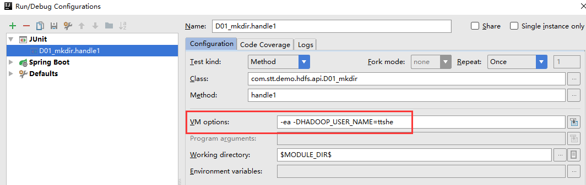
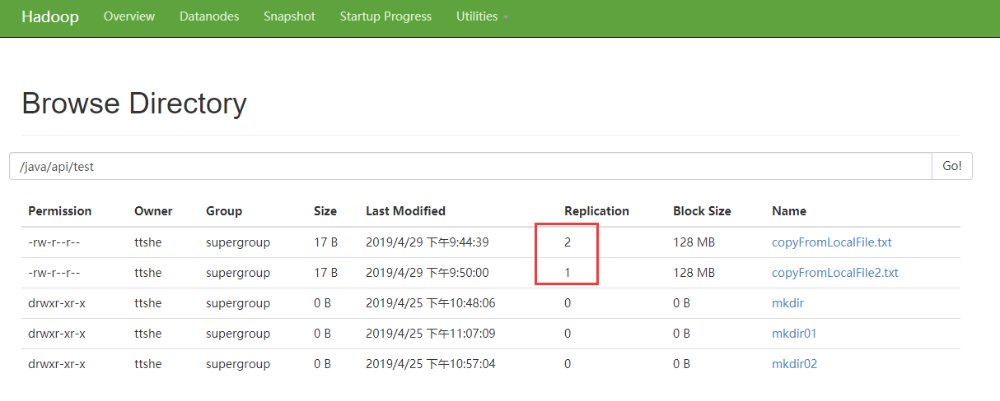

# 环境准备

- 依据电脑环境，将对应编译后的hadoop.jar包解压在非中文路径下，并且配置HADOOP_HOME的环境变量。这里使用的是win10环境编译的hadoop.jar包

- 配置环境变量HADOOP_HOME=D:\dev-tools\hadoop-2.7.2，配置%HADOOP_HOME%\bin

- 创建一个maven工程（这里使用springboot创建一个含pom的项目）
- 添加依赖

```xml
<dependencies>
		<dependency>
			<groupId>junit</groupId>
			<artifactId>junit</artifactId>
			<version>RELEASE</version>
		</dependency>
		<dependency>
			<groupId>org.apache.hadoop</groupId>
			<artifactId>hadoop-common</artifactId>
			<version>2.7.2</version>
		</dependency>
		<dependency>
			<groupId>org.apache.hadoop</groupId>
			<artifactId>hadoop-client</artifactId>
			<version>2.7.2</version>
		</dependency>
		<dependency>
			<groupId>org.apache.hadoop</groupId>
			<artifactId>hadoop-hdfs</artifactId>
			<version>2.7.2</version>
		</dependency>
	<!--	<dependency>
			<groupId>jdk.tools</groupId>
			<artifactId>jdk.tools</artifactId>
			<version>1.8</version>
			<scope>system</scope>
			<systemPath>${JAVA_HOME}/lib/tools.jar</systemPath>
		</dependency> -->
</dependencies>
```


# HDFS的API操作


## 创建文件夹

- 方式1：在运行的VM上配置用户名，在代码中不指定用户名，需要额外的配置，如下



- 方式2：在代码中添加用户名（推荐）

```java
package com.stt.demo.hdfs.api;

import org.apache.hadoop.conf.Configuration;
import org.apache.hadoop.fs.FileSystem;
import org.apache.hadoop.fs.Path;
import org.junit.Test;

import java.io.IOException;
import java.net.URI;
import java.net.URISyntaxException;

/**
 * 使用api的方式在hdfs上创建目录
 * Created by Administrator on 2019/4/25.
 */
public class D01_mkdir {
	/**
	 * 运行方式1，需要在VM options添加配置-DHADOOP_USER_NAME=ttshe
	 * @throws IOException
	 */
	@Test
	public void handle1() throws IOException {
		// 获取文件系统
		Configuration configuration = new Configuration();
		// 配置在集群上运行，注意这里配置的信息是core-site.xml上的NameNode的信息
		configuration.set("fs.defaultFS","hdfs://hadoop102:9000");
		// 设置文件系统用户
		FileSystem fs = FileSystem.get(configuration);
		// 创建目录
		fs.mkdirs(new Path("/java/api/test/mkdir01"));
		// 关闭资源
		fs.close();
	}
	/**
	 * 运行方式2
	 * @throws URISyntaxException
	 * @throws IOException
	 * @throws InterruptedException
	 */
	@Test
	public void handle2() throws URISyntaxException, IOException, InterruptedException {
		// 获取文件系统
		Configuration configuration = new Configuration();
		// 设置文件系统用户
		FileSystem fs = FileSystem.get(new URI("hdfs://hadoop102:9000"), configuration, "ttshe");
		// 创建目录
		fs.mkdirs(new Path("/java/api/test/mkdir02"));
		// 关闭资源
		fs.close();
	}
}
```

运行完成在http://hadoop102:50070/explorer.html#/java/api/test 可以看到结果如下


## 文件上传

- 从本地拷贝到hdfs

```java
package com.stt.demo.hdfs.api;

import org.apache.hadoop.conf.Configuration;
import org.apache.hadoop.fs.FileSystem;
import org.apache.hadoop.fs.Path;
import org.junit.Test;

import java.io.IOException;
import java.net.URI;
import java.net.URISyntaxException;

/**
 * 从本地拷贝文件上传
 * Created by Administrator on 2019/4/29.
 */
public class Ch2_copyFromLocalFile {

	@Test
	public void handle1() throws Exception{
		// 配置
		Configuration configuration = new Configuration();
		// 设置副本个数
		configuration.set("dfs.replication","2");
		FileSystem fileSystem = 
            FileSystem.get(new URI("hdfs://hadoop102:9000"),configuration,"ttshe");
		// 上传文件
		fileSystem.copyFromLocalFile(
            new Path("d:/d.txt"),new Path("/java/api/test/copyFromLocalFile.txt"));
		// 关闭资源
		fileSystem.close();
	}

	/**
	 * 使用resource中的副本配置
	 */
	@Test
	public void handle2() throws Exception {
		FileSystem fileSystem = FileSystem.get(
            new URI("hdfs://hadoop102:9000"),new Configuration(),"ttshe");
		// 上传文件
		fileSystem.copyFromLocalFile(
            new Path("d:/d.txt"),new Path("/java/api/test/copyFromLocalFile2.txt"));
		// 关闭资源
		fileSystem.close();
	}
}
```

- 使用第二种方式上传时需要在resources文件夹下放置hdfs-site.xml文件，配置副本集个数

```xml
<?xml version="1.0" encoding="UTF-8"?>
<?xml-stylesheet type="text/xsl" href="configuration.xsl"?>
<configuration>
    <property>
        <name>dfs.replication</name>
        <value>1</value>
    </property>
</configuration>
```

上传完成的结果



### 参数优先级

客户端代码中的设置 > ClassPath下用户自定义配置文件 > 服务器默认配置


## 文件下载

- 从hdfs拷贝到本地

```java
package com.stt.demo.hdfs.api;
import org.apache.hadoop.conf.Configuration;
import org.apache.hadoop.fs.FileSystem;
import org.apache.hadoop.fs.Path;
import org.junit.Test;
import java.net.URI;

public class Ch03_copyToLocalFile {
	@Test
	public void handle() throws Exception {
		FileSystem fs = FileSystem.get(
            new URI("hdfs://hadoop102:9000"),new Configuration(),"ttshe");
		// 执行下载操作
		fs.copyToLocalFile(
			false, // boolean delSrc 是否删除原文件
			new Path("/java/api/test/copyFromLocalFile.txt"), //Path src要下载的文件路径
			new Path("d:/d2.txt"), // Path dst 文件下载的路径
			true);// boolean useRawLocalFileSystem 使用本地文件系统，则没有文件校验CRC，否则会生成CRC文件
		fs.close();
	}
}
```


## 文件夹删除

```java
package com.stt.demo.hdfs.api;
import org.apache.hadoop.conf.Configuration;
import org.apache.hadoop.fs.FileSystem;
import org.apache.hadoop.fs.Path;
import org.junit.Test;
import java.net.URI;

public class Ch04_delete {
	@Test
	public void handle() throws Exception {
		FileSystem fs = FileSystem.get(
				new URI("hdfs://hadoop102:9000"),new Configuration(),"ttshe");
        
        // true 表示递归删除该文件夹下所有文件
		fs.delete(new Path("/dir01/"),true);
		fs.close();
	}
}
```


## 文件名更改

```java
package com.stt.demo.hdfs.api;

import org.apache.hadoop.conf.Configuration;
import org.apache.hadoop.fs.FileSystem;
import org.apache.hadoop.fs.Path;
import org.junit.Test;
import java.net.URI;

public class Ch05_rename {
	@Test
	public void handle() throws Exception{
		FileSystem fs = FileSystem.get(new URI("hdfs://hadoop102:9000"),
				new Configuration(),"ttshe");
		fs.rename(new Path("/java/api/test/mkdir"),
				new Path("/java/api/test/rename"));
		fs.close();
	}
}
```


## 文件详情查看

```java
package com.stt.demo.hdfs.api;
import org.apache.hadoop.conf.Configuration;
import org.apache.hadoop.fs.*;
import org.junit.Test;
import java.net.URI;

public class Ch06_listFiles {

	@Test
	public void handle() throws Exception{

		FileSystem fs = FileSystem.get(new URI("hdfs://hadoop102:9000"),
				new Configuration(),"ttshe");
		// 获取文件详细情况
		RemoteIterator<LocatedFileStatus> iter = fs.listFiles(new Path("/"), true);
		while(iter.hasNext()){
			LocatedFileStatus status = iter.next();
			System.out.println("文件名："+status.getPath().getName());
			System.out.println("路径："+status.getPath().getParent());
			System.out.println("长度："+status.getLen());
			System.out.println("权限："+status.getPermission());
			System.out.println("分组："+status.getGroup());
			// 获取存储的块信息
			BlockLocation[] blockLocations = status.getBlockLocations();
			for (BlockLocation blockLocation : blockLocations) {
				// 获取块存储的主机节点
				String[] hosts = blockLocation.getHosts();
				for(String host:hosts){
					System.out.println("所在主机："+host);
				}
			}
			System.out.println("------------------------------------");
		}
		fs.close();
	}
}
```

结果：

```java
文件名：copyFromLocalFile.txt
路径：hdfs://hadoop102:9000/java/api/test
长度：17
权限：rw-r--r--
分组：supergroup
所在主机：hadoop103
所在主机：hadoop102
------------------------------------
文件名：copyFromLocalFile2.txt
路径：hdfs://hadoop102:9000/java/api/test
长度：17
权限：rw-r--r--
分组：supergroup
所在主机：hadoop103
------------------------------------
```


## 文件和文件夹判断

```java
package com.stt.demo.hdfs.api;
import org.apache.hadoop.conf.Configuration;
import org.apache.hadoop.fs.FileStatus;
import org.apache.hadoop.fs.FileSystem;
import org.apache.hadoop.fs.Path;
import org.junit.Test;
import java.net.URI;

public class Ch07_listStatus {
	@Test
	public void handle() throws Exception{
		FileSystem fs = FileSystem.get(
            new URI("hdfs://hadoop102:9000"),new Configuration(),"ttshe");
		FileStatus[] fileStatuses = fs.listStatus(new Path("/"));
		for (FileStatus fileStatus : fileStatuses) {
			if(fileStatus.isDirectory()){
				System.out.println("d:"+fileStatus.getPath().getName());
			}
			if(fileStatus.isFile()){
				System.out.println("f:"+fileStatus.getPath().getName());
			}
		}
	}
}
```


# HDFS的IO操作

> 之前使用的api操作HDFS都是框架封装好的，可以使用如下的方式自定义处理文件
> 使用IO流进行上传和下载处理


## 文件上传

```java
package com.stt.demo.hdfs.api;
import org.apache.hadoop.conf.Configuration;
import org.apache.hadoop.fs.FSDataOutputStream;
import org.apache.hadoop.fs.FileSystem;
import org.apache.hadoop.fs.Path;
import org.apache.hadoop.io.IOUtils;
import org.junit.Test;

import java.io.File;
import java.io.FileInputStream;
import java.net.URI;

public class Ch08_putFileToHDFS {

	@Test
	public void handle() throws Exception{
		Configuration conf = new Configuration();
		FileSystem fs = FileSystem.get(
				new URI("hdfs://hadoop102:9000"),conf,"ttshe");
		// 创建输入流
		FileInputStream fis = new FileInputStream(new File("d:/d.txt"));
		// 获取输出流
		FSDataOutputStream fos = fs.create(new Path("/java/api/test/putToHDFS.txt"));
		// 拷贝流
		IOUtils.copyBytes(fis,fos,conf);
		// 关闭流
		IOUtils.closeStream(fos);
		IOUtils.closeStream(fis);
		fs.close();
	}
}
```


## 文件下载

```java
package com.stt.demo.hdfs.api;

import org.apache.hadoop.conf.Configuration;
import org.apache.hadoop.fs.FSDataInputStream;
import org.apache.hadoop.fs.FileSystem;
import org.apache.hadoop.fs.Path;
import org.apache.hadoop.io.IOUtils;
import org.junit.Test;
import java.io.File;
import java.io.FileOutputStream;
import java.net.URI;

public class Ch09_getFileFromHDFS {

	@Test
	public void handle() throws Exception{
		Configuration conf = new Configuration();
		FileSystem fs = FileSystem.get(
            new URI("hdfs://hadoop102:9000"),conf,"ttshe");
		// 获取输入流
		FSDataInputStream fis = fs.open(new Path("/java/api/test/putToHDFS.txt"));
		// 获取输出流
		FileOutputStream fos = new FileOutputStream(new File("d:/d3.txt"));
		IOUtils.copyBytes(fis,fos,conf);
		IOUtils.closeStream(fos);
		IOUtils.closeStream(fis);
		fs.close();
	}
}
```


## 定位文件读取

将大文件（大于128Mb）上传到HDFS中，文件被分割为2个block，分2次下载

```java
package com.stt.demo.hdfs.api;

import org.apache.hadoop.conf.Configuration;
import org.apache.hadoop.fs.FSDataInputStream;
import org.apache.hadoop.fs.FileSystem;
import org.apache.hadoop.fs.Path;
import org.apache.hadoop.io.IOUtils;
import org.junit.Test;

import java.io.File;
import java.io.FileOutputStream;
import java.net.URI;

public class Ch10_readFileSeek {

	// 下载第一个块
	@Test
	public void handle1() throws Exception{
		Configuration conf = new Configuration();
		FileSystem fs = FileSystem.get(
				new URI("hdfs://hadoop102:9000"),conf,"ttshe");
		// 获取输入流
		FSDataInputStream fis = fs.open(new Path("/hadoop-2.7.2.tar.gz"));
		// 创建输出流
		FileOutputStream fos = new FileOutputStream(new File("d:/h.part1"));
		// 流的拷贝
		byte[] buffer = new byte[1024];
		// 读取128Mb = 128*1024*1024
		for(int i=0;i<1024*128;i++){
			fis.read(buffer);
			fos.write(buffer);
		}
		IOUtils.closeStream(fos);
		IOUtils.closeStream(fis);
		fs.close();
	}
	// 下载第二个块
	@Test
	public void handle2() throws Exception{
		Configuration conf = new Configuration();
		FileSystem fs = FileSystem.get(
				new URI("hdfs://hadoop102:9000"),conf,"ttshe");
		// 获取输入流
		FSDataInputStream fis = fs.open(new Path("/hadoop-2.7.2.tar.gz"));
		// 创建输出流
		FileOutputStream fos = new FileOutputStream(new File("d:/h.part2"));

		//重点： 定位输入数据的位置
		fis.seek(1024*1024*128);

		IOUtils.copyBytes(fis,fos,conf);
		IOUtils.closeStream(fos);
		IOUtils.closeStream(fis);
		fs.close();
	}
}
```

合并文件

在windows下进行合并，在对应的目录下输入cmd，然后执行如下命令

```shell
D:\>type h.part2 >> h.part1
# 注意：是从part2附加到part1后面
```

合并完成后，将h.part1重命名为hadoop-2.7.2.tar.gz，然后可以进行解压操作
