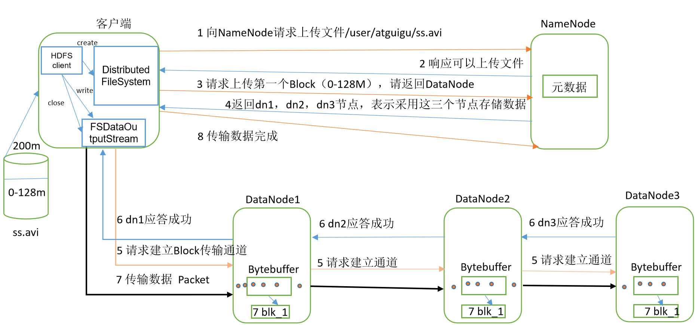
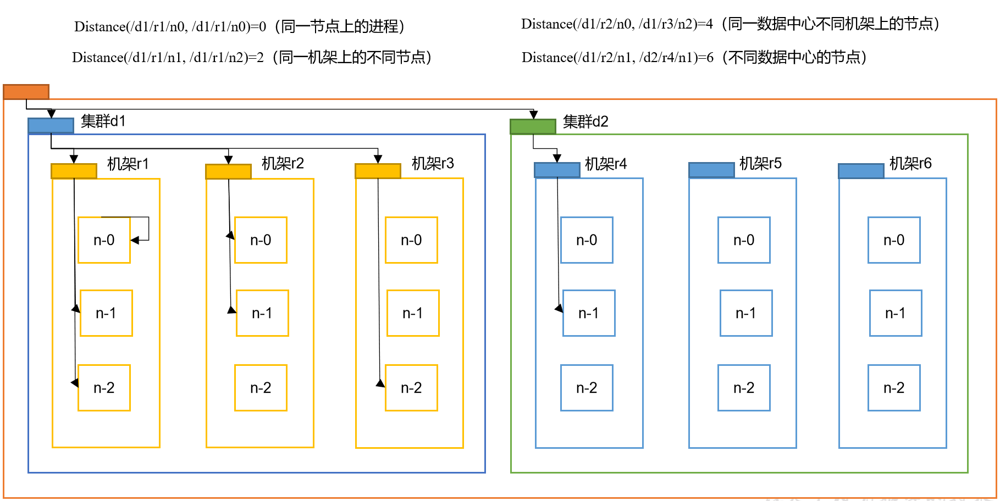
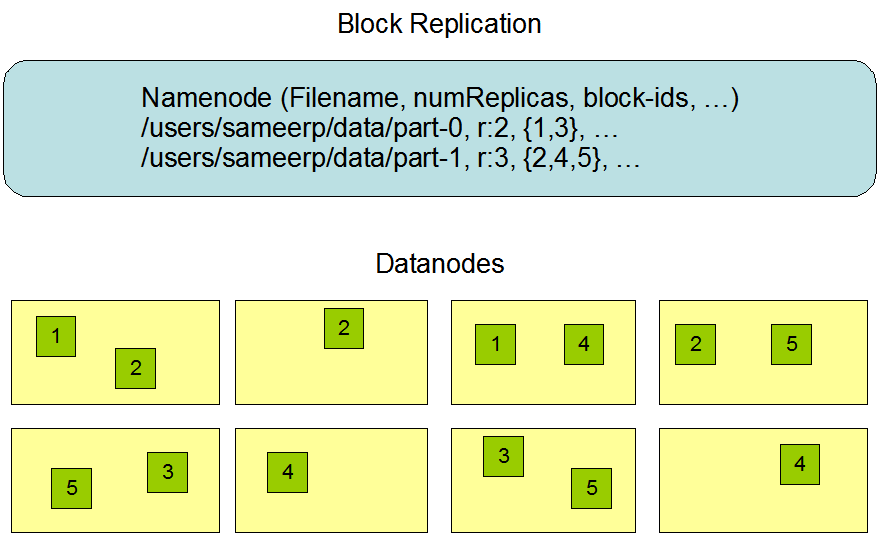

# 写数据流程


- 客户端通过Distributed File System 模块向NameNode 请求上传文件，NameNode检查文件是否存在，父目录是否存在
  - NameNode返回是否可以上传
  - 客户端请求第一个Block上传到哪几个DataNode服务器上
  - NameNode返回3个DataNode节点，分别是dn1，dn2，dn3（通过计算距离和负载情况，返回合适的dn）
- 客户端通过FSDataOutputStream模块请求dn1上传数据，dn1收到数据会继续调用dn2，然后dn2调用dn3，将==通信管道==建立完成




- dn1，dn2，dn3逐级应答客户端，打通流的通道
- 客户端开始往dn1上传第一个Block，先从磁盘读取数据存储在本地缓存
  - 以Packet为单位（64byte）
  - dn1收到一个Packet就会传给dn2，dn2传给dn3
  - ==dn1每传一个Packet就会放一个应答队列等待应答==
  - Packet存储在每个dn的内存中（byteBuffer）然后将内存中的数据序列化到磁盘上（7 blk_1）
  - bytebuffer中的数据传递给下一个dn，下一个dn继续序列化到本地磁盘
  - 最后一个dn序列化Packet到本地之后，逐级发送返回结果报文，上一个节点删除byteBuffer内的Packet，然后再发送返回结果报文给上一个dn，从而逐级删除byteBuffer中的该Packet
- 当一个Block传输完成后，客户端再次请求NameNode上传第二个Block的DataNode服务器，重复上面3~7的步骤


## 网络拓扑-节点距离计算

在HDFS写数据过程中，NameNode会选择距离待上传数据最近距离的DataNode接收数据，如何计算最近距离？

- 节点距离：2个节点到达最近的==共同祖先==的距离总和




## 机架感知-副本节点的选择

- 如果数据有3个副本，那这3个副本存储在哪几个节点合适

- 参考
  - http://hadoop.apache.org/docs/r2.7.2/hadoop-project-dist/hadoop-hdfs/HdfsDesign.html#Data_Replication

 

```html
The placement of replicas is critical to HDFS reliability and performance. Optimizing replica placement distinguishes HDFS from most other distributed file systems. This is a feature that needs lots of tuning and experience. The purpose of a rack-aware replica placement policy is to improve data reliability, availability, and network bandwidth utilization. The current implementation for the replica placement policy is a first effort in this direction. The short-term goals of implementing this policy are to validate it on production systems, learn more about its behavior, and build a foundation to test and research more sophisticated policies.

Large HDFS instances run on a cluster of computers that commonly spread across many racks. Communication between two nodes in different racks has to go through switches. In most cases, network bandwidth between machines in the same rack is greater than network bandwidth between machines in different racks.

The NameNode determines the rack id each DataNode belongs to via the process outlined in Hadoop Rack Awareness. A simple but non-optimal policy is to place replicas on unique racks. This prevents losing data when an entire rack fails and allows use of bandwidth from multiple racks when reading data. This policy evenly distributes replicas in the cluster which makes it easy to balance load on component failure. However, this policy increases the cost of writes because a write needs to transfer blocks to multiple racks.

For the common case, when the replication factor is three, HDFS’s placement policy is to put one replica on one node in the local rack, another on a different node in the local rack, and the last on a different node in a different rack. This policy cuts the inter-rack write traffic which generally improves write performance. The chance of rack failure is far less than that of node failure; this policy does not impact data reliability and availability guarantees. However, it does reduce the aggregate network bandwidth used when reading data since a block is placed in only two unique racks rather than three. With this policy, the replicas of a file do not evenly distribute across the racks. One third of replicas are on one node, two thirds of replicas are on one rack, and the other third are evenly distributed across the remaining racks. This policy improves write performance without compromising data reliability or read performance.

The current, default replica placement policy described here is a work in progress.
```

 

- 第一个副本在Client所处于的节点上，如果在集群外，则随机选择一个
- 第二个副本和第一个副本位于相同机架，随机节点
- 第三个副本位于不同机架，不同节点

好处：

- 在同一个机架上上传第二个副本，由于在一个机架上，IO可靠性提升
- 机架的故障率小于节点的故障率，减少传输失败的几率
- 由于副本在不同的机架上的不同节点，提高了数据的可靠性，同时在可靠性不变的情况下，先进行同机架的拷贝，提升了写入性能。

其他：

- 原先版本在第二个副本上有差异，先在不同的机架的不同节点上传副本，然后在该机架上的不同节点上上传第三个副本，写入性能没有新版本的高。


# 读数据流程

​	

- 客户端通过Distributed File System 向 NameNode请求下载文件
- NameNode通过查询元数据找到文件所在的DataNode地址
- 挑选一台DataNode服务器读取数据（就近原则，然后随机）
- DataNode开始传输数据给客户端，从磁盘里面读取数据输入流，以Packet为单位进行校验
  - 读取数据不是并行读取，而是串行读取所有block
- ==客户端以Packet为单位接收==，先本地缓存，然后写入目标文件
