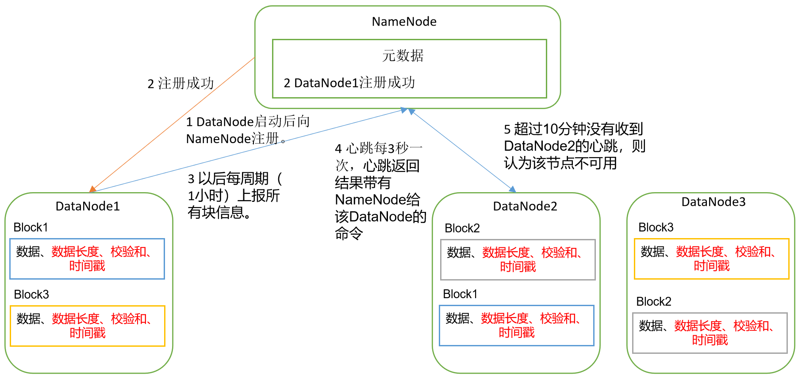
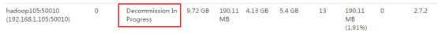
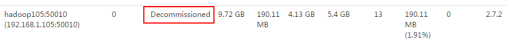

# 工作机制




- DataNode的数据块
  - 文件形式存储在磁盘上
  - 数据本身
  - 元数据
    - 数据块的长度
    - 块数据的校验和
    - 时间戳
- 定期上报信息
  - ==默认值1小时==
  - DataNode 启动后向NameNode注册通过后开始通知
  - 上报所有块信息
- 心跳
  - ==每3秒一次==
  - 返回结果带有NameNode给该DataNode的命令
    - 如复制块数据到另一个节点，或删除摸个数据块
  - 如果==10分钟==没有收到某个DataNode的心跳，则认为该节点不可用
- 集群运行中可以安全加入或退出一些机器


# 数据完整性

> 对数据进行校验，判断数据是否发生更改，常用的有CRC校验

- 奇偶校验
  - 在数据最后添加奇偶校验位
  - 传输数据bit中1的个数位偶数的，校验位为0
  - 传输数据bit中1的个数位奇数的，校验位为1
  - 有误差，不能完全检验数据的完整性
- CRC校验
  - 有32位，64位
  - 位数越多检验的性能消耗越多


DataNode检验数据完整性：

- 当DataNode读取Block的时候，计算CheckSum
- 若计算后的CheckSum与Block创建时的值不一致，说明Block已经损坏
- Client读取其他DataNode上的Block
- DataNode在其文件创建后**周期验证**CheckSum


# 掉线时限参数设置

- DataNode 进程死亡或者网络故障造成DataNode无法与NameNode进行通信
- NameNode不会立刻把该节点判断为死亡，需要经过一段时间，这段时间成为超时时长
  - 默认10分钟+30秒
- 如果定义超时时间为TimeOut
  - 公式$TimeOut = 2*dfs.name.enode.heartbeat.recheck.interval + 10*dfs.heartbeat.interval$ 
  - dfs.name.enode.heartbeat.recheck.interval 默认值5分钟
  - dfs.heartbeat.interval 默认是3秒

在hdfs-site.xml中进行配置

```xml
<property>
    <name>dfs.namenode.heartbeat.recheck-interval</name>
    <value>300000</value> <!--单位ms--> 
</property>
<property>
    <name>dfs.heartbeat.interval</name>
    <value>3</value> <!--单位s--> 
</property>
```


# 服役新数据节点

> 随着公司业务的增长，数据量增加，原有的数据节点容量已经不满足存储数据的需求，需要在原有的集群基础上动态的添加新的数据节点

- 准备换机
  - 在hadoop104上克隆一台hadoop105
  - 修改主机IP和名称
  - ==删除原先的HDFS文件上系统保留的文件 data 与 logs==
    - 由于是从hadoop104上克隆而来，需要去除hadoop105上的104的旧数据
  - source 一下配置文件 etc/profile
- 直接启动DataNode 即可关联到集群

```shell
[ttshe@hadoop105 hadoop-2.7.2]$ sbin/hadoop-daemon.sh start datanode
[ttshe@hadoop105 hadoop-2.7.2]$ sbin/yarn-daemon.sh start nodemanager
```

 

- 在hadoop105上上传文件

```shell
[ttshe@hadoop105 hadoop-2.7.2]$ hadoop fs -put /opt/module/hadoop-2.7.2/LICENSE.txt /
```


## 数据再平衡

- 如果数据不均衡，使用如下命令实现集群==再平衡==

```shell
[ttshe@hadoop102 sbin]$ ./start-balancer.sh
starting balancer, logging to /opt/module/hadoop-2.7.2/logs/hadoop-atguigu-balancer-hadoop102.out
Time Stamp               Iteration#  Bytes Already Moved  Bytes Left To Move  Bytes Being Moved
```


# 退役旧数据节点

注意：**不允许白名单和黑名单同时出现同一个主机的名称**


## 设置白名单

> 可以添加DataNode到白名单，NameNode只从白名单中关联登记的DataNode，不在白名单中的主机节点，会被退出

- 在NameNode的/opt/module/hadoop-2.7.2/etc/hadoop目录下创建dfs.hosts文件

```shell
[ttshe@hadoop102 hadoop]$ pwd
/opt/module/hadoop-2.7.2/etc/hadoop
[ttshe@hadoop102 hadoop]$ touch dfs.hosts
[ttshe@hadoop102 hadoop]$ vi dfs.hosts
# 添加DataNode的hostname，注意：不能有空格和换行
hadoop102
hadoop103
hadoop104
```

此时这里没有hadoop105

- 在NameNode的hdfs-site.xml配置文件中增加dfs.hosts属性

```xml
<property>
	<name>dfs.hosts</name>
	<value>/opt/module/hadoop-2.7.2/etc/hadoop/dfs.hosts</value>
</property>
```

- 分发配置

```shell
[ttshe@hadoop102 hadoop]$ xsync hdfs-site.xml
```

- 刷新NameNode

```shell
[ttshe@hadoop102 hadoop-2.7.2]$ hdfs dfsadmin -refreshNodes
Refresh nodes successful
```

- 更新ResourceManager节点

```shell
[ttshe@hadoop102 hadoop-2.7.2]$ yarn rmadmin -refreshNodes
17/06/24 14:17:11 INFO client.RMProxy: Connecting to ResourceManager at hadoop103/192.168.1.103:8033
```

- 在web上查看，hadoop105已经消失
- 如果数据不均衡，可以使用命令集群再均衡


## 设置黑名单

> 在黑名单上的主机会被强制退出

- 在NameNode的/opt/module/hadoop-2.7.2/etc/hadoop目录下创建dfs.hosts.exclude文件

```shell
[ttshe@hadoop102 hadoop]$ pwd
/opt/module/hadoop-2.7.2/etc/hadoop
[ttshe@hadoop102 hadoop]$ touch dfs.hosts.exclude
[ttshe@hadoop102 hadoop]$ vi dfs.hosts.exclude
# 设置不能访问的节点hadoop105，注意：也不能有空格和换行
hadoop105
```

- 在NameNode的hdfs-site.xml配置文件中增加dfs.hosts.exclude属性

```xml
<property>
	<name>dfs.hosts.exclude</name>
    <value>
        /opt/module/hadoop-2.7.2/etc/hadoop/dfs.hosts.exclude
    </value>
</property>
```

- 刷新NameNode和ResourceManager

```shell
[ttshe@hadoop102 hadoop-2.7.2]$ hdfs dfsadmin -refreshNodes
Refresh nodes successful

[ttshe@hadoop102 hadoop-2.7.2]$ yarn rmadmin -refreshNodes
17/06/24 14:55:56 INFO client.RMProxy: Connecting to ResourceManager at hadoop103/192.168.1.103:8033
```

- 检查Web浏览器，退役节点的状态为==decommission in progress（退役中）==，说明数据节点正在复制块到其他节点

 

- 等待退役节点状态为==decommissioned（所有块已经复制完成==），停止该节点及节点资源管理器。注意：如果副本数是3，服役的节点小于等于3，是不能退役成功的，需要修改副本数后才能退役

   

```shell
# 此时关闭hadoop105的dataNode
[ttshe@hadoop105 hadoop-2.7.2]$ sbin/hadoop-daemon.sh stop datanode
stopping datanode
[ttshe@hadoop105 hadoop-2.7.2]$ sbin/yarn-daemon.sh stop nodemanager
```

- 如果数据不均衡，可以使用命令再均衡


# 多目录配置

> DataNode的多目录配置与NameNode的多目录配置不一样
> NameNode多目录配置：多个副本，内容一样
> DataNode多目录配置：每个目录存储的数据不一样，数据不是副本

在hdfs-site.xml中进行配置

- 推荐设置多个目录，在后期扩展磁盘可以直接只用，而不需要重启集群

```xml
<property>
    <name>dfs.datanode.data.dir</name>
	<value>
    	file:///${hadoop.tmp.dir}/dfs/data1,
    	file:///${hadoop.tmp.dir}/dfs/data2
    </value>
</property>
```

