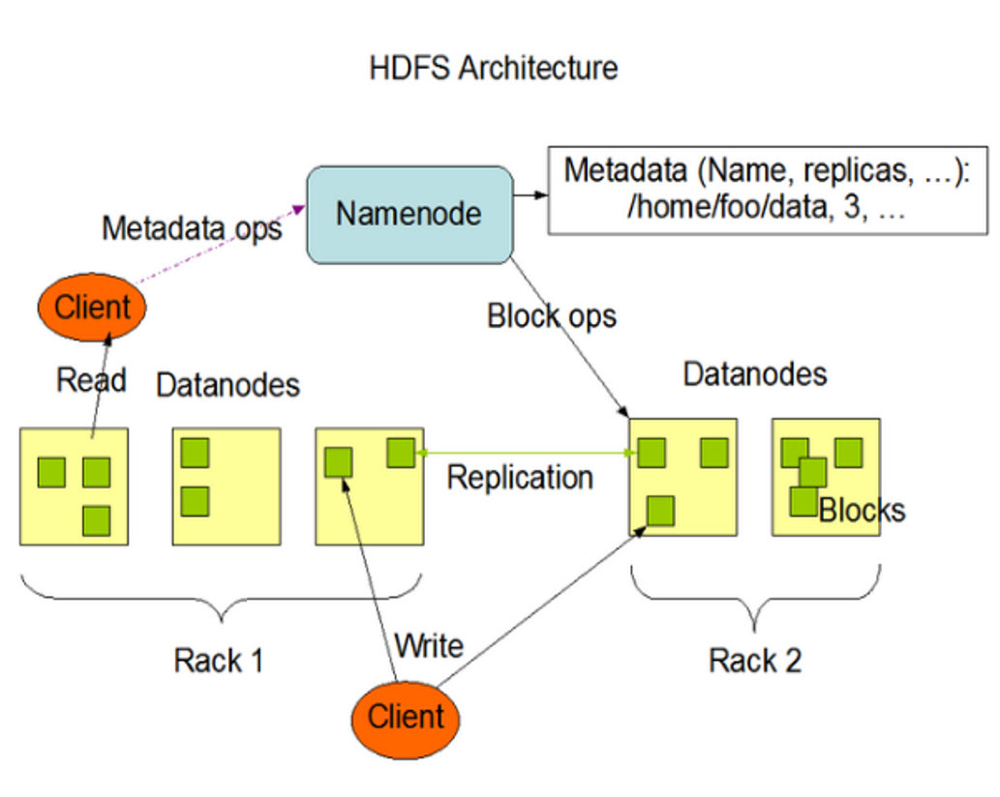

> 数据量增大，数据分配到不同的系统中进行存储，那么就需要一个系统来管理多个机器上的文件，这就是分布式文件系统，HDFS是分布式文件系统的一种。

# 定义

HDFS Hadoop Distributed File System 是一个文件系统，用于存储文件，通过==目录树==来定位文件，也是一个分布式的系统，由多台服务器组合实现。

# 使用场景

==一次写入，多次读取==的场景，不支持文件修改，适合作为数据分析，不适合做网盘应用

# 优点

- 高容错性

  - 数据自动保存多个副本，通过增加副本的方式提高容错性

  - 某一个副本丢失后，可以自动恢复，当某个副本丢失，重新搭建副本时，可以再次恢复

- 适合处理大数据

  - 数据规模：可以处理数据规模达到GB，TB，PB的数据

  - 文件规模：可以处理==百万==规模以上的文件数量

- 可构建在==廉价==的机器上，通过多副本机制，提高可靠性

# 缺点

- ==不适合低延时==的数据访问，比如毫秒级别的存储数据
- 无法高效的对大量的==小文件==进行存储
  - 如果存储大量小文件，会占用NameNode大量内存来存储文件信息和块信息
  - NameNode本身是有存储限制的。
  - 小文件存储的寻址时间会超过读取时间，违反了HDFS的设计目标
- ==不支持并发写入==，不支持文件随机修改
  - 一个文件只能有一个写入操作，不允许有多个线程同时写同一个文件
  - ==仅支持数据append(追加)==，不支持文件随机修改

# 组成架构

## NameNode

> nn 作为master，是一个主管，管理者

- 管理HDFS的名称空间
- 配置副本策略
- 管理数据块（Block）映射信息
- 处理客户端读写请求

## DataNode

> slave，NameNode下发命令，DataNode执行实际的操作

- 存储实际的数据块
- 执行数据块的读写操作

## SecondaryNameNode

> 不是NameNode的热备份，当NameNode挂掉的时候，并不能马上替换NameNode并提供服务，当恢复成NameNode的时候，会有数据丢失的情况

- 辅助NameNode，分担工作量，定期合并Fsimage和Edits，并推送给NameNode
- 在紧急情况下，可辅助恢复NameNode

## Client

> 客户端，shell，api调用的客户端命令

- 文件切分，文件上传到HDFS的时候，==Client将文件切分成一个个的Block==，然后上传
- 与NameNode交互，获取文件位置信息
- 与DataNode交互，读取或者写入数据
- 提供一些命令管理HDFS
  - 如NameNode的格式化
- 提供一些命令访问HDFS
  - 如对HDFS增删改查操作

# 关于Block大小定义

HDFS 中文件在物理上是分块存储的（Block），块的大小是通过配置参数（dfs.blocksize）进行配置

- 默认大小在Hadoop2.x版本中是128Mb
- 在Hadoop1.x版本中的大小是64Mb

## 定义背景

- 如果寻址的时间约为10ms，即查找到目标的block的时间是10ms
- ==寻址的时间为网络访问传输时间的1%，则为最佳状态==，那么网络访问时间长为1s（10ms/0.01=1s）
- 磁盘的传输速率普通速率为100Mb/s
- 那么在1s内可以访问的数据量大小是100Mb左右，因此一个Block大小定义为128Mb
- 如果固态硬盘，传输速率可以达到300Mb/s，那么Block就大小就可以设定为256Mb

## 为什么块大小不能设置太小或者太大

- HDFS的块设置太小，==会增加寻址块的时间==，程序可能会一直在查找块的位置

- HDFS的块设置太大，从==磁盘传输数据的时间==会明显==大于定位这个块开始位置的时间==，导致程序在处理这个块的数据时会变慢

- HDFS块的大小设置主要取决于==磁盘的传输速率==
