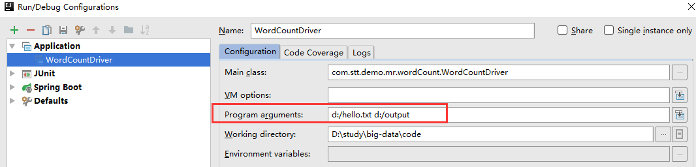

# 官方WordCount源码反编译

- 01_jar包\02_win7下编译过的hadoop jar包\hadoop-2.7.2\share\hadoop\mapreduce\hadoop-mapreduce-examples-2.7.2.jar
- 对官方的Demo进行反编译，发现WordCount案例有Map类，Reduce类和驱动类
- 且数据类型是Hadoop自身封装的序列化类型


# 常用数据序列化类型

一个包装类，用于Hadoop进行序列化操作

| **Java类型** | **Hadoop Writable类型** |
| ------------ | ----------------------- |
| boolean      | BooleanWritable         |
| byte         | ByteWritable            |
| int          | IntWritable             |
| float        | FloatWritable           |
| long         | LongWritable            |
| double       | DoubleWritable          |
| String       | Text                    |
| map          | MapWritable             |
| array        | ArrayWritable           |


## 编程规范


### Mapper阶段

- 用户定义的Mapper需要继承自己的父类
- 输入数据是K1V1对的形式
- K和V类型可以自定义
- 业务逻辑写在map()中
- 输出数据是K2V2对的形式
- map方法（MapTask进程）对每一个<K,V>调用一次


### Reducer阶段

- 用户自定义Reducer要继承自己的父类
- Reducer的输入数据类型对应Mapper的输出数据类型，也是KV类型
- 业务逻辑写在reduce()中
- ReduceTask进程对每一组相同k的<K,V>组调用一次reduce()方法


### Driver阶段

- 相当于YARN集群的客户端，用于提交整个程序到YARN集群，提交的是封装了MapReduce程序相关运行参数的job对象


# 编写WordCount

- 需求：给定的文本中统计输出每一个单词出现的总次数
- 输入数据：hello.txt

```shell
atguigu atguigu
ss ss
cls cls
jiao
banzhang
xue
hadoop
```

- 期望输出：

```shell
atguigu	2
banzhang	1
cls	2
hadoop	1
jiao	1
ss	2
xue	1
```

- 分析
  - Mapper阶段
    - 将MapTask传给我们的文本内容先转换为String
    - 根据空格将这一行切分成单词
    - 将单词输出<单词，1>
  - Reducer阶段
    - 汇总各个key的个数
    - 输出该key的总次数
  - Driver
    - 获取配置信息，获取job对象实例
    - 指定本程序的jar包所在的本地路径
    - 关联Mapper/Reducer业务类
    - 指定Mapper输出数据的KV类型
    - 指定最终输出的数据的KV类型
    - 指定job的输入原始文件所在的目录
    - 指定job的输出结果所在的目录
    - 提交作业


## 创建项目

创建一个maven项目，添加如下pom，如果是springboot项目，可以不用添加log4j

```xml
<dependencies>
		<dependency>
			<groupId>junit</groupId>
			<artifactId>junit</artifactId>
			<version>RELEASE</version>
		</dependency>
		<dependency>
			<groupId>org.apache.logging.log4j</groupId>
			<artifactId>log4j-core</artifactId>
			<version>2.8.2</version>
		</dependency>
		<dependency>
			<groupId>org.apache.hadoop</groupId>
			<artifactId>hadoop-common</artifactId>
			<version>2.7.2</version>
		</dependency>
		<dependency>
			<groupId>org.apache.hadoop</groupId>
			<artifactId>hadoop-client</artifactId>
			<version>2.7.2</version>
		</dependency>
		<dependency>
			<groupId>org.apache.hadoop</groupId>
			<artifactId>hadoop-hdfs</artifactId>
			<version>2.7.2</version>
		</dependency>
</dependencies>
```

如果是springBoot项目下，不用添加如下日志配置(在项目的src/main/resources目录下，新建一个文件，命名为log4j.properties)

```properties
log4j.rootLogger=INFO, stdout
log4j.appender.stdout=org.apache.log4j.ConsoleAppender
log4j.appender.stdout.layout=org.apache.log4j.PatternLayout
log4j.appender.stdout.layout.ConversionPattern=%d %p [%c] - %m%n
log4j.appender.logfile=org.apache.log4j.FileAppender
log4j.appender.logfile.File=target/spring.log
log4j.appender.logfile.layout=org.apache.log4j.PatternLayout
log4j.appender.logfile.layout.ConversionPattern=%d %p [%c] - %m%n
```


## 编写程序


### Mapper

```java
package com.stt.demo.mr.wordCount;

import org.apache.hadoop.io.IntWritable;
import org.apache.hadoop.io.LongWritable;
import org.apache.hadoop.io.Text;
import org.apache.hadoop.mapreduce.Mapper;

import java.io.IOException;

/**
 * KEYIN:输入数据Key
 * VALUEIN:输入数据value
 * KEYOUT:输出数据key
 * VALUEOUT：输出数据value
 * Created by Administrator on 2019/5/5.
 */
public class WordCountMapper extends Mapper<LongWritable,Text,Text,IntWritable>{

	// 这里使用属性变量的意义在于节省内存
	// 定义输出的key对象
	Text k = new Text();
	// 定义输出的值,值都是1,匹配到一个单词就放入context中
	IntWritable v = new IntWritable(1);

	@Override
	protected void map(LongWritable key, Text value, Context context) throws IOException, InterruptedException {
		// 读取一行数据
		String line = value.toString();
		// 对这一行进行空格分隔
		String[] words = line.split("\\s+");
		// 输出
		for(String word : words){
			k.set(word);
			context.write(k,v);
		}
	}
}
```


### Reducer

```java
package com.stt.demo.mr.wordCount;

import org.apache.hadoop.io.IntWritable;
import org.apache.hadoop.io.Text;
import org.apache.hadoop.mapreduce.Reducer;

import java.io.IOException;

/**
 * 输入的是单词text和1
 * 输出的是单词text和具体的个数
 * Created by Administrator on 2019/5/5.
 */
public class WordCountReducer extends Reducer<Text,IntWritable,Text,IntWritable> {


	int sum = 0;
	IntWritable v = new IntWritable();

	// 每次会获取一个key，value的list作为输入
	@Override
	protected void reduce(Text key, Iterable<IntWritable> values, Context context) throws IOException, InterruptedException {
		sum = 0;
		for(IntWritable count : values){
			sum += count.get();
		}
		// 输出
		v.set(sum);
		context.write(key,v);
	}
}
```


### Driver

```java
package com.stt.demo.mr.wordCount;

import org.apache.hadoop.conf.Configuration;
import org.apache.hadoop.fs.Path;
import org.apache.hadoop.io.IntWritable;
import org.apache.hadoop.io.Text;
import org.apache.hadoop.mapreduce.Job;
import org.apache.hadoop.mapreduce.lib.input.FileInputFormat;
import org.apache.hadoop.mapreduce.lib.output.FileOutputFormat;

import java.io.IOException;

/**
 * 驱动类
 * Created by Administrator on 2019/5/5.
 */
public class WordCountDriver {

	public static void main(String[] args) throws Exception {

		// 获取相应的配置服务
		Configuration conf = new Configuration();
		Job job = Job.getInstance(conf);
		// 设置jar加载路径
		job.setJarByClass(WordCountDriver.class);
		// 设置map和reduce类
		job.setMapperClass(WordCountMapper.class);
		job.setReducerClass(WordCountReducer.class);
		// 设置map输出
		job.setMapOutputKeyClass(Text.class);
		job.setMapOutputValueClass(IntWritable.class);
		// 设置最终输出的类型
		job.setOutputKeyClass(Text.class);
		job.setOutputValueClass(IntWritable.class);
		// 设置输入和输出路径
		FileInputFormat.setInputPaths(job,new Path(args[0]));
		FileOutputFormat.setOutputPath(job,new Path(args[1]));
		// 提交:查看源码，true表示监控job的运行情况，并打印
		boolean result = job.waitForCompletion(true);
		System.exit(result ? 0 : 1);
	}
}
```


## 测试

- 环境准备

  如果电脑系统是win7的就将win7的hadoop jar包解压到非中文路径，并在Windows环境上配置HADOOP_HOME环境变量。如果是电脑win10操作系统，就解压win10的hadoop jar包，并配置HADOOP_HOME环境变量

  注意：win8电脑和win10家庭版操作系统可能有问题，需要重新编译源码或者更改操作系统

- 在idea上测试

  需要配置参数后运行
   

- 在集群上测试

  - 使用maven进行打包，需要配置插件，注意刷新reimport

  ```xml
  <build>
      <plugins>
          <plugin>
              <artifactId>maven-compiler-plugin</artifactId>
              <version>2.3.2</version>
              <configuration>
                  <source>1.8</source>
                  <target>1.8</target>
              </configuration>
          </plugin>
          <plugin>
              <artifactId>maven-assembly-plugin </artifactId>
              <configuration>
                  <descriptorRefs>
                      <descriptorRef>jar-with-dependencies</descriptorRef>
                  </descriptorRefs>
                  <archive>
                      <manifest>
                          <!--这里需要替换为入口类-->
                          <mainClass>
                              com.stt.demo.mr.wordCount.WordCountDriver
                          </mainClass>
                      </manifest>
                  </archive>
              </configuration>
              <executions>
                  <execution>
                      <id>make-assembly</id>
                      <phase>package</phase>
                      <goals>
                          <goal>single</goal>
                      </goals>
                  </execution>
              </executions>
          </plugin>
      </plugins>
  </build>
  ```

  - 将项目打包成jar，run as -> maven install 

    等待编译完成就会在项目的target文件夹中生成jar包。如果看不到。在项目上右键 -> Refresh，即可看到。修改不带依赖的jar包名称（不含jar-with-dependencies）为wc.jar，并拷贝该jar包到Hadoop集群

  - 启动集群，执行wordCount

    - 注意读取的文件不能太多，太大，否则执行会空间不足而失败

  ```shell
  [atguigu@hadoop102 software]$ hadoop jar wc.jar
  com.stt.demo.mr.wordCount.WordCountDriver /user/ttshe/input/wc.input /user/ttshe/output
  ```

