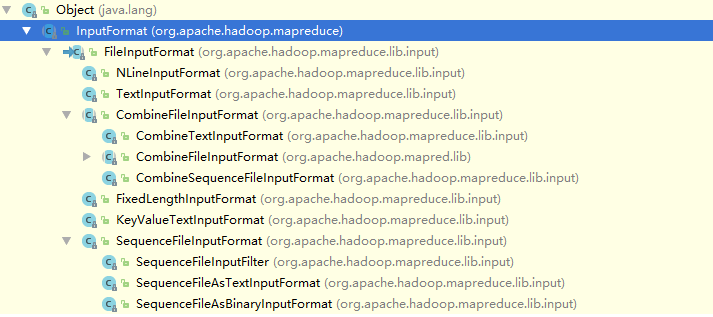
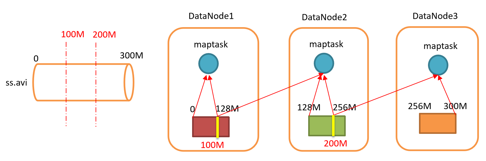
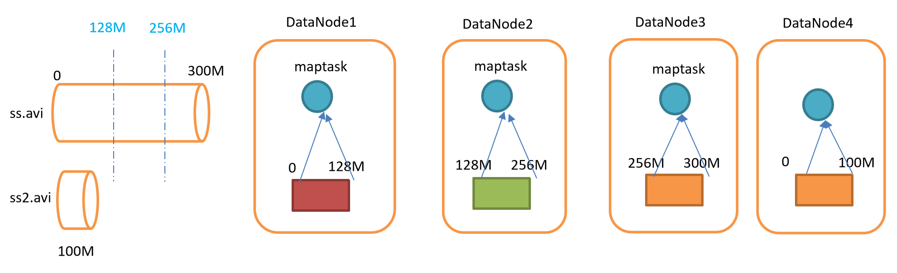

# InputFormat 实现类

- 继承结构
  


- 在InputFormat阶段的数据格式

  - 基于行的日志文件

  - 二进制文件

  - 数据库表

    

- 通过InputFormat接口的不同的实现类来实现

  - TextInputFormat 默认使用
  - KeyValueTextInputFormat 
  - NLineInputFormat
  - CombineTextInputFormat
  - 自定义InputFormat


# 切片与MapTask并行度

> MapTask的并行度决定Map阶段的任务处理并发度，进而影响到整个Job的处理速度

- 思考
  - 1G的数据
    - 启动8个MapTask
    - 可以提高集群的并发处理能力
  - 1k的数据
    - 启动8个MapTask，会提高集群性能么？
    - MapTask并行任务是否越多越好呢？
    - 那些因素影响了MapTask的并行度？


## 并行度决定机制

- 数据块

  - Block是HDFS物理上把数据分成一块一块

- 数据切片

  - 只是在==逻辑上==对输入进行分片

  - ==并不会在磁盘上将其切分成片进行存储==

    

- 假设情况1

  - 300M的数据，按照100M进行切片
  - 数据块的大小是128M
  - 每个DataNode在收到MapTask的数据调用请求时，会有跨DataNode的情况出现
    - DataNode之间的数据IO交互，降低了Job在Map阶段的性能
    - 对DataNode上数据的访问需要进行计算起始位置，然后访问数据
    - 逻辑复杂，出现问题不利于排查。

 


- 假设情况2
  - 300M的数据，按照128M进行切片处理
  - 每个分片分配到一个MapTask进行处理，MapTask读取到一个DataNode，刚好是一个分片
  - 没有多余的判断分片大小是否等于设定的大小，直接读取处理即可，简单安全
  - 如果再来一个数据，数据大小是100M
    - 最后一个DataNode存储的是100MBlock
    - 最后2个分别是44M和100M的Block
      - 不会合并再划分Block

 


## 小结

- 一个Job的Map阶段并行读有客户端在提交Job时的==切片数决定==
- 每一个Split切片分配一个MapTask并行实例处理
- 在默认情况下，==切片大小=BlockSize==
- 切片时不考虑数据集整体，而是逐个针对每个文件单独切片


# Job提交流程源码分析

从`job.waitForCompletion`打上断点，进行分析

```java
// 0.提交执行 Job.java 1307行
submit();
	// setUseNewApi() 为了旧版本的兼容处理，将旧的Api转换为新的Api
	// 1.建立连接
	connect();
	// (1) 创建提交Job的代理
		return new Cluster(getConfiguration());
		// 判断协议：是使用local,yarn,还是远程
			initialize(jobTrackAddr, conf);
	// 2.提交job
	return submitter.submitJobInternal(Job.this, cluster);
	// 验证输出的job的路径是否已经有文件，有文件表示结果已经生成退出
		checkSpecs(job);
	// (1) 创建给集群提交数据的Stag路径，这里的路径是file:/tmp/hadoop-Administrator/mapred/staging/Administrator186995491/.staging
		Path jobStagingArea = JobSubmissionFiles.getStagingDir(cluster, conf)
	// (2) 获取jobId，创建job路径
    	JobID jobId = submitClient.getNewJobID()
    // (3) 拷贝jar包到集群
    	copyAndConfigureFiles(job, submitJobDir);
			// 上传配置文件和要执行的jar到tmp对应的job文件夹下（本地运行时没有jar包上传）
        	rUploader.uploadFiles(job, jobSubmitDir);
	// (4) 计算切片信息，生成切片规划文件到tmp文件夹
	// 切片文件job.split内部信息：SPL /org.apache.hadoop.mapreduce.lib.input.FileSplitfile:/d:/hello.txt  
		 int maps = writeSplits(job, submitJobDir);
			 	maps = writeNewSplits(job, jobSubmitDir);
					List<InputSplit> splits = input.getSplits(job); //*******
	// (5) 生成job.xml配置信息，包含当前job运行的所有hadoop的配置信息（这里修改的原因是：代码中可能会对hadoop的一些配置进行修改，那么每个不同的job使用的配置是不同的，那么就需要给每个job一个配置，代码的配置优先级最高，其次是自定义配置，最后是系统默认配置，这些配置合在一起就是该job的配置信息）
		writeConf(conf, submitJobFile);
	// (6) 提交job，返回提交状态（执行Map阶段，执行Reduce阶段返回结果）
		status = submitClient.submitJob(jobId, submitJobDir.toString(), job.getCredentials());
	// 提交完成后，会删除tmp的staging内的job的临时文件
```


## 分析图


# FileInputFormat


## 切片源码分析

> 在提交过程中首先会生成切片信息，在input.getSplites(job)中获取，该流程如下
>
> 注意：集群模式Block大小是128M，1.x版本的集群模式是64M，本地模式是32M
>
> 切片的大小是逻辑划分
> 数据块的大小是物理划分

- 程序先找到存储数据的目录
- 开始遍历处理，规划切片目录下的每一个文件
- 遍历第一个文件ss.txt
  - 获取文件大小
    - `fs.sizeOf(ss.txt)`
  - 计算切片大小
    - `computeSplitSize(Math.max(minSize,Math.min(maxSize,blockSize))) = blockSize = 128M`
  - ==默认情况下，切片大小=blockSize==
  - 开始切
    - 第一个切片ss.txt--0:128M
    - 第二个切片ss.txt--128M:256M
    - 第三个切片ss.txt--256M:300M
    - ==每次切片，都要判断切完剩下的部分是否大于块的1.1倍，不大于1.1倍就划分为一块切片==
  - 将切片信息写到一个切片规划中
  - 整个切片的核心过程在getSplit()方法中完成
  - **==InputSplit记录了切片的元数据信息==**
    - 如起始位置
    - 长度
    - 所在节点的列表等
- ==提交切片规划文件到YARN上的MrAppMaster可以依据切片规划文件计算开始MapTask个数==


## 切片机制

> 简单的按照文件的内容长度进行切片
> 切片大小默认等于Block大小
> 切片时不考虑数据集整体，而是逐个针对每个文件单独切片（所以不能有大量的小文件）

- 案例分析
  - 输入数据2个文件
    - file1.txt--320M
    - file2.txt--10M
  - 经过FileInputFormat的切片机制运算后，形成如下切片信息
    - file1.txt.split1-- 0:128
    - file1.txt.split2-- 128:256
    - file1.txt.split3-- 256:320
    - file2.txt.split1-- 0:10  


## 切片参数配置

- 源码中计算切片大小的公式

  - `Math.max(minSize,Math.min(maxSize,blockSize));`
    - `mapreduce.input.fileinputformat.split.minsize `
      - 默认值为==1==
    - `mapreduce.input.fileinputformat.split.maxsize`
      - 默认值`Long.MAXValue`
    - 默认切片大小` blockSize`

- 切片大小设置

  - maxsize：若设置比blockSize小，会让切片变小，等于配置的这个参数的值
  - minsize：若设置比blockSize大，则可以让切片比blockSize大

- 获取切片信息API

  - 获取切片的文件名称

    ```java
    String name = inputSplit.getPath().getName();
    ```

  - 根据文件类型获取切片信息

    ```java
    FileSplit fileSplit = (FileSplit)context.getInputSplit();
    ```

    

# CombineTextInputFormat

> 框架默认的TextFileInputFormat切片机制是对任务按文件规划切片，==无论文件多小，都是一个单独的切片==，都会生成一个MapTask进行处理，这样如果有大量文件，就会产生大量的MapTask，效率极其低下

源码参考F:\大数据-尚硅谷\归档\01.hadoop\resource\04_扩展资料\合并小文件切片逻辑&测试数据.zip


## 应用场景

- 用于小文件过多的场景
- 将多个小文件从==逻辑上==规划到一个切片中
  - 交给一个MapTask进行处理
  - 逻辑上一个切片，一个MapTask


## 参数设置

- 虚拟存储切片的最大值最好和实际的小文件大小情况来设置
- 设置虚拟存储切片的最大值
  - `CombineTextInputFormat.setmaxInputSplitSize(job,4194304);`
    - 4MB大小
    - 默认128MB


## 切片机制

生成切片过程

- 虚拟存储

- 切片

  


- 存储过程
  - 将输入目录下所有文件的大小，每个和设置的setMaxInputSplitSize比较，定为s
    - 如果>2s，以s切割一块
    - ==当剩余数据t，s<=t<2s，将t/2进行切分(防止出现切片太小)==
    - 如：t=8.02，s=4，那么切分结果t1=4,t2=2.01,t3=2.01
      - 先逻辑上切分一个4，剩下4.02依然>4，继续切分
- 切片过程
  - 判断虚拟存储文件的大小，设为k，如果k >= s，则单独作为一个切片
  - 如果k<s，那么k与下一个切片k1合并形成一个切片


## 操作实例

准备4个文件，大小一次为1.7M，5.1M，3.4M，6.5M

在原先的 wordCount代码中的Driver中添加如下代码

```java
// 默认使用TextFileInputFormat
job.setInputFormatClass(CombineTextInputFormat.class);
// 大小设置为4M
CombineTextInputFormat.setMaxInputSplitSize(job,4194304);
```

在控制台中显示3个切片执行

```java
15:27:37.147 [main] INFO org.apache.hadoop.mapreduce.JobSubmitter - number of splits:3
```

- 如果设置为20M，则结果是1个切片

```java
CombineTextInputFormat.setMaxInputSplitSize(job,20971520);
```


# TextInputFormat

默认的FileInputFormat实现类，按行读取每条记录

- 说明切片规则与FileInputFormat一致

- key是存储该行在整个文件中的==起始字节的偏移量==
- key是LongWritable类型
- value是这行的内容，不包括任何行终止字符（换行和回车）
- value是Text类型


# KeyValueTextInputFormat

- FileInputFormat子类

- 每一行是一条记录，被分隔符分隔为key，value
- 在驱动类中设置分隔符，分隔key，value
- 默认分隔符是\t


示例

- 输入数据

```shell
banzhang ni hao
xihuan hadoop banzhang
banzhang ni hao
xihuan hadoop banzhang
```

- 期望结果
  - banzhang是key，ni hao是value

```shell
banzhang	2
xihuan	2
```

- 分析

  - 使用KeyValueTextInputFormat
  - 分隔符为空格
  - Map阶段，设置key为匹配的值，value是1
  - Reduce阶段进行value汇总，写出
  - Driver设置分隔符，设置输入格式

  

实现

- mapper

```java
package com.stt.demo.mr.Ch04_KeyValueTextInputFormat;

import org.apache.hadoop.io.LongWritable;
import org.apache.hadoop.io.Text;
import org.apache.hadoop.mapreduce.Mapper;

import java.io.IOException;

public class KVTextMapper extends Mapper<Text,Text,Text,LongWritable> {

	LongWritable v = new LongWritable(1);

	@Override
	protected void map(Text key, Text value, Context context) throws IOException, InterruptedException {
		context.write(key,v);
	}
}
```

- reducer

```java
package com.stt.demo.mr.Ch04_KeyValueTextInputFormat;

import org.apache.hadoop.io.LongWritable;
import org.apache.hadoop.io.Text;
import org.apache.hadoop.mapreduce.Reducer;

import java.io.IOException;

public class KVTextReducer extends Reducer<Text,LongWritable,Text,LongWritable> {

    LongWritable v = new LongWritable();

    @Override
    protected void reduce(Text key, Iterable<LongWritable> values, Context context) throws IOException, InterruptedException {
        long sum = 0;
        for (LongWritable value : values) {
            sum += value.get();
        }
        v.set(sum);
        context.write(key,v);
    }
}
```

- driver

```java
package com.stt.demo.mr.Ch04_KeyValueTextInputFormat;

import org.apache.hadoop.conf.Configuration;
import org.apache.hadoop.fs.Path;
import org.apache.hadoop.io.LongWritable;
import org.apache.hadoop.io.Text;
import org.apache.hadoop.mapreduce.Job;
import org.apache.hadoop.mapreduce.lib.input.FileInputFormat;
import org.apache.hadoop.mapreduce.lib.input.KeyValueLineRecordReader;
import org.apache.hadoop.mapreduce.lib.input.KeyValueTextInputFormat;
import org.apache.hadoop.mapreduce.lib.output.FileOutputFormat;

import java.io.IOException;

public class KVTextDriver {

	public static void main(String[] args) throws IOException, ClassNotFoundException, InterruptedException {

		args = new String[]{"d:/study/big-data/code/data/hadoop/mr/ch04/input.txt",
		"d:/study/big-data/code/data/hadoop/mr/ch04/output.txt"};

		Configuration config = new Configuration();
		// 设置分隔符
		config.set(KeyValueLineRecordReader.KEY_VALUE_SEPERATOR," ");
		// 设置job
		Job job = Job.getInstance(config);
		job.setJarByClass(KVTextDriver.class);
		job.setMapperClass(KVTextMapper.class);
		job.setReducerClass(KVTextReducer.class);
		job.setMapOutputKeyClass(Text.class);
		job.setMapOutputValueClass(LongWritable.class);
		job.setOutputKeyClass(Text.class);
		job.setOutputValueClass(LongWritable.class);
		// 设置输入格式
		job.setInputFormatClass(KeyValueTextInputFormat.class);

		FileInputFormat.setInputPaths(job,new Path(args[0]));
		FileOutputFormat.setOutputPath(job,new Path(args[1]));
		job.waitForCompletion(true);
	}
}
```


# NLineInputFormat

每个map进程处理的InputSplit==不再按照Block块划分处理==，而是按照NLineInputFormat的行数N进行处理

- 输入文件的总行数/N = 切片数
- 如果没有整除，切片数 = 商 + 1
- map进程中的key和value与TextInputFormat保存一致

案例

​	对每个单词进行个数统计，按照行数进行划分切片，3行一个切片

- 输入数据

```shell
banzhang ni hao
xihuan hadoop banzhang
banzhang ni hao
xihuan hadoop banzhang
banzhang ni hao
xihuan hadoop banzhang
banzhang ni hao
xihuan hadoop banzhang
banzhang ni hao
xihuan hadoop banzhang banzhang ni hao
xihuan hadoop banzhang
```


实现

- mapper

```java
package com.stt.demo.mr.Ch05_NLineInputFormat;

import org.apache.hadoop.io.LongWritable;
import org.apache.hadoop.io.Text;
import org.apache.hadoop.mapreduce.Mapper;

import java.io.IOException;

public class NLineMapper extends Mapper<LongWritable,Text,Text,LongWritable>{
	Text k = new Text();
	LongWritable v = new LongWritable(1);
	
	@Override
	protected void map(LongWritable key, Text value, Context context) throws IOException, InterruptedException {
		String[] words = value.toString().split(" ");
		for (String word : words) {
			k.set(word);
			context.write(k,v);
		}
	}
}
```

- reducer

```java
package com.stt.demo.mr.Ch05_NLineInputFormat;

import org.apache.hadoop.io.LongWritable;
import org.apache.hadoop.io.Text;
import org.apache.hadoop.mapreduce.Reducer;

import java.io.IOException;

public class NLineReducer extends Reducer<Text,LongWritable,Text,LongWritable> {

	LongWritable v = new LongWritable();

	@Override
	protected void reduce(Text key, Iterable<LongWritable> values, Context context) throws IOException, InterruptedException {
		long sum = 0L;
		for (LongWritable value : values) {
			sum += value.get();
		}
		v.set(sum);
		context.write(key,v);
	}
}
```

- driver

```java
package com.stt.demo.mr.Ch05_NLineInputFormat;

import org.apache.hadoop.conf.Configuration;
import org.apache.hadoop.fs.Path;
import org.apache.hadoop.io.LongWritable;
import org.apache.hadoop.io.Text;
import org.apache.hadoop.mapreduce.Job;
import org.apache.hadoop.mapreduce.lib.input.FileInputFormat;
import org.apache.hadoop.mapreduce.lib.input.NLineInputFormat;
import org.apache.hadoop.mapreduce.lib.output.FileOutputFormat;

import java.io.IOException;

public class NLineDriver {

	public static void main(String[] args) throws IOException, ClassNotFoundException, InterruptedException {
		args = new String[]{"d:/study/big-data/code/data/hadoop/mr/ch05/input.txt",
				"d:/study/big-data/code/data/hadoop/mr/ch05/output.txt"};
		Configuration config = new Configuration();

		Job job = Job.getInstance(config);

		// 设置3行一个切片
		NLineInputFormat.setNumLinesPerSplit(job,3);
        // 设置实行的InputFormat
		job.setInputFormatClass(NLineInputFormat.class);

		job.setJarByClass(NLineDriver.class);
		job.setMapperClass(NLineMapper.class);
		job.setReducerClass(NLineReducer.class);
		job.setMapOutputKeyClass(Text.class);
		job.setMapOutputValueClass(LongWritable.class);
		job.setOutputKeyClass(Text.class);
		job.setOutputValueClass(LongWritable.class);

		FileInputFormat.setInputPaths(job,new Path(args[0]));
		FileOutputFormat.setOutputPath(job,new Path(args[1]));

		job.waitForCompletion(true);
	}
}
```

- 在控制台上有输出

```shell
16:12:24.446 [main] INFO org.apache.hadoop.mapreduce.JobSubmitter - number of splits:4
```


# 自定义InputFormat

背景

- hadoop自带的InputFormat不能满足所有应用场景，需要使用自定义InputFormat来实现
- 针对大量小数据方案
  - Har，将大量小数据在上传hdfs时打包成一个har包
  - CombineTextInputFormat，针对多个小文件，生成一个切片分配一个mapTask进行处理
  - 自定义InputFormat


## 步骤

- 继承FileInputFormat
- 改写RecordReader，实现一次读取一个完整文件封装为KV
- 在输出时使用SequenceFileOutPutFormat输出合并文件


案例

- 需求
  - 处理大量小文件
  - 将多个小文件合并成一个SequenceFile文件
    - hadoop用于存储二进制形式的KV对形式的文件
    - 存储多个文件，存储形式：文件路径+名称为key，内容为value
- 分析
  - 自定义一个类继承FileInputFormat
    - 重写isSplitable方法，返回false表示不可分割
    - 重写createRecordReader()，创建自定义的RecordReader对象，并初始化
  - 改写RecordReader，实现一次读取一个完整的文件封装为KV
    - 采用IO流一次读取一个文件输出到value中，由于设置了不可切片，最终将所有文件都封装到了value中
    - 获取文件路径信息+名称，并设置key
  - 设置Driver
    - 设置输入的inputFormat，设置输出的outputFormat


## 实现


### 自定义InputFormat

```java
package com.stt.demo.mr.Ch06_CustomizedInputFormat;

import org.apache.hadoop.fs.Path;
import org.apache.hadoop.io.BytesWritable;
import org.apache.hadoop.io.Text;
import org.apache.hadoop.mapreduce.InputSplit;
import org.apache.hadoop.mapreduce.JobContext;
import org.apache.hadoop.mapreduce.RecordReader;
import org.apache.hadoop.mapreduce.TaskAttemptContext;
import org.apache.hadoop.mapreduce.lib.input.FileInputFormat;

import java.io.IOException;

public class WholeFileInputFormat extends FileInputFormat<Text,BytesWritable> {

	@Override
	protected boolean isSplitable(JobContext context, Path filename) {
		// 不进行分片操作
		return false;
	}

	@Override
	public RecordReader<Text, BytesWritable> createRecordReader(InputSplit split, TaskAttemptContext context) throws IOException, InterruptedException {
		// 使用自定义的RecordReader
		WholeRecordReader recordReader = new WholeRecordReader();
		recordReader.initialize(split,context);
		return recordReader;
	}
}
```


### 自定义RecordReader类

```java
package com.stt.demo.mr.Ch06_CustomizedInputFormat;

import org.apache.hadoop.conf.Configuration;
import org.apache.hadoop.fs.FSDataInputStream;
import org.apache.hadoop.fs.FileSystem;
import org.apache.hadoop.io.BytesWritable;
import org.apache.hadoop.io.IOUtils;
import org.apache.hadoop.io.Text;
import org.apache.hadoop.mapreduce.InputSplit;
import org.apache.hadoop.mapreduce.RecordReader;
import org.apache.hadoop.mapreduce.TaskAttemptContext;
import org.apache.hadoop.mapreduce.lib.input.FileSplit;

import java.io.IOException;

public class WholeRecordReader extends RecordReader<Text,BytesWritable> {

	private Configuration configuration;
	private FileSplit fileSplit;

	private boolean isProgress = true;

	private BytesWritable v = new BytesWritable();
	private Text k = new Text();

	@Override
	public void initialize(InputSplit split, TaskAttemptContext context) throws IOException, InterruptedException {
		this.fileSplit = (FileSplit) split;
		configuration = context.getConfiguration();
	}

	@Override
	public boolean nextKeyValue() throws IOException, InterruptedException {
		// 标记位，表示是否读取完成，注意查看Mapper中的run方法的while
		if(isProgress){

			// 获取文件系统
			FileSystem fs = FileSystem.get(configuration);
			// 获取切片的输入流
			FSDataInputStream fsDataInputStream = fs.open(fileSplit.getPath());
			// 定义缓存区
			byte[] buf = new byte[(int) fileSplit.getLength()];
			// 拷贝数据切片的所有数据到buf
	IOUtils.readFully(fsDataInputStream,buf,0,buf.length);
			// 封装value
			v.set(buf,0,buf.length);
			// 封装key，获取文件的路径和名称
			k.set(fileSplit.getPath().toString());

			IOUtils.closeStream(fsDataInputStream);
			isProgress = false;
			return true;
		}
		return false;
	}

	@Override
	public Text getCurrentKey() throws IOException, InterruptedException {
		return k;
	}

	@Override
	public BytesWritable getCurrentValue() throws IOException, InterruptedException {
		return v;
	}

	@Override
	public float getProgress() throws IOException, InterruptedException {
		return 0;
	}

	@Override
	public void close() throws IOException {
		// 关闭一些资源
	}
}
```

​	

### 实现mapper,reducer,driver

```java
package com.stt.demo.mr.Ch06_CustomizedInputFormat;

import org.apache.hadoop.io.BytesWritable;
import org.apache.hadoop.io.Text;
import org.apache.hadoop.mapreduce.Mapper;

import java.io.IOException;

public class SequenceFileMapper extends Mapper<Text,BytesWritable,Text,BytesWritable> {

	@Override
	protected void map(Text key, BytesWritable value, Context context) throws IOException, InterruptedException {
		context.write(key,value);
	}
}
```

```java
package com.stt.demo.mr.Ch06_CustomizedInputFormat;

import org.apache.hadoop.io.BytesWritable;
import org.apache.hadoop.io.Text;
import org.apache.hadoop.mapreduce.Reducer;

import java.io.IOException;

public class SequenceFileReducer extends Reducer<Text,BytesWritable,Text,BytesWritable> {

	@Override
	protected void reduce(Text key, Iterable<BytesWritable> values, Context context) throws IOException, InterruptedException {
		// values的值只有一个
		context.write(key,values.iterator().next());
	}
}
```

```java
package com.stt.demo.mr.Ch06_CustomizedInputFormat;

import org.apache.hadoop.conf.Configuration;
import org.apache.hadoop.fs.Path;
import org.apache.hadoop.io.BytesWritable;
import org.apache.hadoop.io.Text;
import org.apache.hadoop.mapreduce.Job;
import org.apache.hadoop.mapreduce.lib.input.FileInputFormat;
import org.apache.hadoop.mapreduce.lib.output.FileOutputFormat;
import org.apache.hadoop.mapreduce.lib.output.SequenceFileOutputFormat;

public class SequenceFileDriver {

	public static void main(String[] args) throws Exception {
		args = new String[]{"d:/study/big-data/code/data/hadoop/mr/ch06",
				"d:/study/big-data/code/data/hadoop/mr/ch06/output"};

		Configuration conf = new Configuration();
		Job job = Job.getInstance(conf);

		job.setJarByClass(SequenceFileDriver.class);
		job.setMapperClass(SequenceFileMapper.class);
		job.setReducerClass(SequenceFileReducer.class);

		// 定义输入的InputFormat
		job.setInputFormatClass(WholeFileInputFormat.class);
		// 定义输出的OutputFormat
		job.setOutputFormatClass(SequenceFileOutputFormat.class);

		job.setMapOutputKeyClass(Text.class);
		job.setMapOutputValueClass(BytesWritable.class);

		job.setOutputKeyClass(Text.class);
		job.setOutputValueClass(BytesWritable.class);

		FileInputFormat.setInputPaths(job,new Path(args[0]));
		FileOutputFormat.setOutputPath(job,new Path(args[1]));

		boolean re = job.waitForCompletion(true);
		System.exit(re ? 0:1);
	}
}
```


- 结果：key是路径，value是该文本的值，将多个文件存储在一个文件中，减少了namenode的内存压力
  - number of splits:3

```shell
SEQorg.apache.hadoop.io.Text"org.apache.hadoop.io.BytesWritable      � w��h���	����I�   n   98file:/d:/study/big-data/code/data/hadoop/mr/ch06/one.txt   1yongpeng weidong weinan
sanfeng luozong xiaoming   p   ;:file:/d:/study/big-data/code/data/hadoop/mr/ch06/three.txt   1shuaige changmo zhenqiang 
dongli lingu xuanxuan   �   98....
```


## 源码分析

- 注意，本地调试MapTask是串行执行
- 注意，没有改变切片个数，切片个数以输入文件个数为准

```java
// 0
boolean re = job.waitForCompletion(true);
// 1
WholeFileInputFormat
	RecordReader
// 2
MapTask
// 3
WholeRecordReader
	// 读取第一个文件
    nextKeyValue
// 4
Mapper
	run
// 5
SequenceFileMapper
	map
	// nextKeyValue == false 结束map
// 读取下一个切片 ，从1开始到5重复
// 6 依据切片个数重复执行
SequenceFileReducer
	reduce
```


