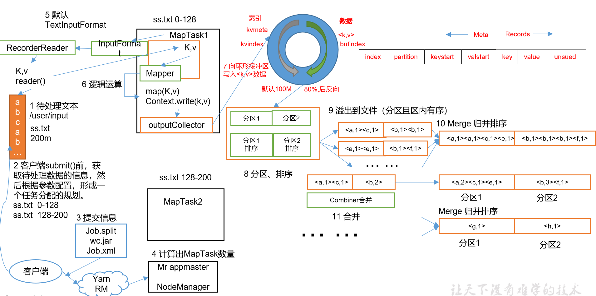
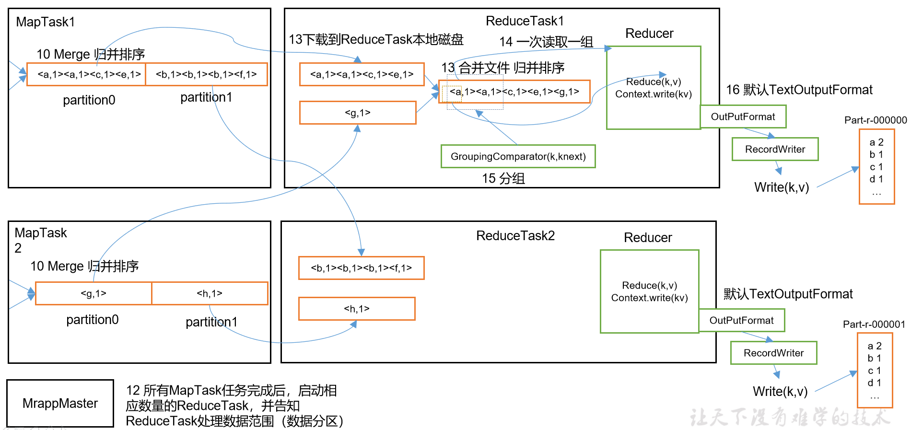

# Map 流程



- 重点
  - 提交信息给yarn
    - job.split 切片信息
    - wc.jar 执行业务程序jar包
    - job.xml 所有的job的配置
  - yarn将信息给Mr appmaster节点
    - 计算MapTask 的数量
    - 开始执行MapTask任务
  - MapTask中
    - `content.write(k,v)`会将数据切片信息，将kv读取放入==内存环形缓存区==
      - 当环形缓存区到80%时，会存储到本地磁盘形成一个==分区==
      - 缓存区默认大小100M
      - 缓存区分隔2块
        - 左边存储元数据
          - index
          - partition，分区
          - keystart
          - valstart
        - 右边存储数据
          - key
          - value
  - combiner 合并
    - 等价于在MapTask阶段执行一次Reduce操作


# Reduce 流程




- 重点
  - GroupingComparator
    - 在reduce之前进行分组处理


# 流程详解

上面的流程是整个MapReduce最全工作流程，但是Shuffle过程只是从第7步开始到第16步结束，具体Shuffle过程详解，如下：

- MapTask收集我们的map()方法输出的kv对，放到内存缓冲区中
- 从内存缓冲区不断溢出本地磁盘文件，==可能会溢出多个文件==
- 多个溢出文件会被合并成大的溢出文件
- ==在溢出过程及合并的过程中，都要调用Partitioner进行分区和针对key进行排序==
- ReduceTask根据自己的==分区号==，去各个MapTask机器上取相应的结果分区数据
- ReduceTask会取到同一个分区的来自不同MapTask的结果文件，ReduceTask会将这些文件再进行合并（归并排序）
- 合并成大文件后，Shuffle的过程也就结束了，后面进入ReduceTask的逻辑运算过程（从文件中取出一个一个的键值对Group，调用用户自定义的reduce()方法）


# 注意

- Shuffle中的缓冲区大小会影响到MapReduce程序的执行效率
- 原则上：缓冲区越大，磁盘io的次数越少，执行速度就越快
- 缓冲区的大小可以通过参数调整
  - 参数 io.sort.mb
  - 默认100M
- 归并排序（猜测）
  - 考虑到内存，如果多个文件的数据都放在内存中进行归并，肯定存储不下
  - 那么归并的可能只能是索引的归并
    - 2个文件，一个原始数据文件，一个索引文件
    - 通过索引文件可以访问原始文件的数据，通过索引，IO流可以读取一段数据，那么就是该索引对应的值
    - 通过该值进行归并算法的排序，而排序移动的是索引文件


# 源码解析流程

- MapTask

```java
context.write(k, NullWritable.get());
	output.write(key, value);
		collector.collect(key, value,partitioner.getPartition(key, value, partitions));
			HashPartitioner();
		collect()
			close()
				collect.flush()
				sortAndSpill() // 排序和溢写
					sort()   QuickSort // 进行快排，注意：排序时操作顺序的是环形缓存区的左侧索引的位置，而存储数据的右侧位置不变，每次比较时，从元数据获取右侧数据的值比较，然后更改元数据索引的位置，最终输出按照左侧索引的位置，依次从右侧取出数据。减少队列中数据的顺序更换的空间，提升效率
           				 
				mergeParts(); // 合并分区，生成file.out文件给ReduceTask使用
				// file.out  所有的分区数据存储在out中
				// file.out.index 分区的索引，通过索引在file.out中获取相应的分区数据
		collector.close();
```

