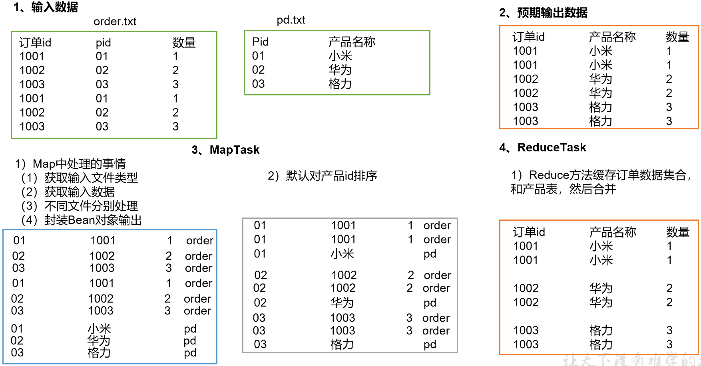

# 需求

- order 订单表

| **id**   | **pid** | **amount** |
| -------- | ------- | ---------- |
| **1001** | **01**  | **1**      |
| **1002** | **02**  | **2**      |
| **1003** | **03**  | **3**      |
| **1004** | **01**  | **4**      |
| **1005** | **02**  | **5**      |
| **1006** | **03**  | **6**      |

- product 商品表

| pid  | pname |
| ---- | ----- |
| 01   | 小米  |
| 02   | 华为  |
| 03   | 格力  |

- 将order表中的pid替换为pname进行输出


# ReduceJoin

- 在reduce阶段进行join处理
- 原理
  - 将2个文件的公共部分（连接字段）作为key
  - Map端
    - 来自不同表或者文件的key/value
    - **打上标签区别不同的记录**
      - 比如来源，文件名称等，用于区分
    - 连接字段使用key
    - 其余部分使用value
    - 最后输出
  - Reduce端
    - 对每个分组记录进行过滤，得到不同标签的数据
    - 对不同标签的数据进行合并

## 示例


**分析**

- 通过将关联条件作为Map输出的key
- 将2表满足join条件的数据发送到同一个ReduceTask处理
- 在Reduce中进行数据的串联




**代码**

- bean

```java
package com.stt.demo.mr.Ch12_ReduceJoin;

import lombok.Data;
import lombok.NoArgsConstructor;
import org.apache.hadoop.io.Writable;

import java.io.DataInput;
import java.io.DataOutput;
import java.io.IOException;

@Data
@NoArgsConstructor
public class TableBean implements Writable {

    private String orderId; // 订单id
    private String pId;      // 产品id
    private int amount;       // 产品数量
    private String pName;     // 产品名称
    private String flag;      // 表的标记

    @Override
    public void write(DataOutput out) throws IOException {

        out.writeUTF(orderId);
        out.writeUTF(pId);
        out.writeInt(amount);
        out.writeUTF(pName);
        out.writeUTF(flag);
    }

    @Override
    public void readFields(DataInput in) throws IOException {

        this.orderId = in.readUTF();
        this.pId = in.readUTF();
        this.amount = in.readInt();
        this.pName = in.readUTF();
        this.flag = in.readUTF();
    }

    public String toString(){
        return orderId + "\t" + pName + "\t" + amount;
    }
}
```

- mapper

```java
package com.stt.demo.mr.Ch12_ReduceJoin;

import org.apache.hadoop.io.LongWritable;
import org.apache.hadoop.io.Text;
import org.apache.hadoop.mapreduce.Mapper;
import org.apache.hadoop.mapreduce.lib.input.FileSplit;

import java.io.IOException;

public class TableMapper extends Mapper<LongWritable,Text,Text,TableBean> {

    private String fileName;

    TableBean v = new TableBean();
    Text k = new Text();

    @Override
    protected void setup(Context context) throws IOException, InterruptedException {
        // 获取切片的名称
        fileName = ((FileSplit)context.getInputSplit()).getPath().getName();
    }

    @Override
    protected void map(LongWritable key, Text value, Context context) throws IOException, InterruptedException {
        String[] fields = value.toString().split("\\s+");

        if(fileName.startsWith("order")){
            // 1001	01	1
            v.setOrderId(fields[0]);
            v.setPId(fields[1]);
            v.setAmount(Integer.parseInt(fields[2]));
            v.setFlag("order");
            v.setPName("");
        }else if(fileName.startsWith("pd")){
            // 01	小米
            v.setPId(fields[0]);
            v.setPName(fields[1]);
            v.setFlag("pd");
            v.setAmount(0);
            v.setOrderId("");
        }
        k.set(v.getPId());
        context.write(k,v);
    }
}
```

- reducer
  - 重点关注迭代器源码，此处是Hadoop重写了迭代器

```java
package com.stt.demo.mr.Ch12_ReduceJoin;

import org.apache.commons.beanutils.BeanUtils;
import org.apache.hadoop.io.NullWritable;
import org.apache.hadoop.io.Text;
import org.apache.hadoop.mapreduce.Reducer;

import java.io.IOException;
import java.lang.reflect.InvocationTargetException;
import java.util.ArrayList;
import java.util.List;

public class TableReducer extends Reducer<Text,TableBean,TableBean,NullWritable> {

    @Override
    protected void reduce(Text key, Iterable<TableBean> values, Context context) throws IOException, InterruptedException {

        List<TableBean> orders = new ArrayList<>();
        TableBean pdBean = null;

        // 需要注意此处迭代器源码
        // 这里使用深拷贝的原因
        //      由于此处values的迭代器是Hadoop改写的，每次val都是最新的值，而非不同的引用，为了节省内存空间
        //      因此如果直接orders.add(val); 那么会导致orders里面的所有bean都是同一个对象（最后一个对象）
        for(TableBean val : values){
            if("order".equals(val.getFlag())){
                orders.add(copy(val));
            }else if("pd".equals(val.getFlag())){
                pdBean = copy(val);
            }
        }
        for(TableBean val : orders){
            if(pdBean != null){
                val.setPName(pdBean.getPName());
            }
            context.write(val,NullWritable.get());
        }
    }

    private TableBean copy(TableBean source){
        TableBean tmp = new TableBean();
        try {
            // 最好不要使用spring框架的提供的方法
            // 因为会打包普通的jar，而hadoop里面可能没有spring的类库
            // 深度拷贝
            BeanUtils.copyProperties(tmp,source);
        } catch (IllegalAccessException e) {
            e.printStackTrace();
        } catch (InvocationTargetException e) {
            e.printStackTrace();
        }
        return tmp;
    }
}
```

- driver

```java
public static void main(String[] args) throws IOException, ClassNotFoundException, InterruptedException {

    args = new String[]{INPUT_PATH_PREFIX+"ch12/input", OUTPUT_PATH_PREFIX+"ch12/output"};

    Job job = Job.getInstance(new Configuration());

    job.setJarByClass(TableDriver.class);

    job.setMapperClass(TableMapper.class);
    job.setReducerClass(TableReducer.class);

    job.setMapOutputKeyClass(Text.class);
    job.setMapOutputValueClass(TableBean.class);
    job.setOutputKeyClass(TableBean.class);
    job.setOutputValueClass(NullWritable.class);

    FileInputFormat.setInputPaths(job,new Path(args[0]));
    FileOutputFormat.setOutputPath(job,new Path(args[1]));

    boolean result = job.waitForCompletion(true);
    System.exit(result ? 0 : 1);
}
}
```


## 缺点

- 都放在reduce处理，大量相同的pid数据在到一个reduce中执行
- reduce端处理压力大
- 会导致数据倾斜
- map节点的运算负载很低，资源利用率不高
- 为了解决这个问题一般使用mapJoin的方式


# MapJoin（推荐）

- 在map阶段进行join处理
- 适用于一张小表，一张大表的场景
- 在map端缓存多张表，提前处理业务逻辑
  - 增加map端的业务，减少reduce端数据压力，减少数据倾斜
- 具体实现
  - 采用**DistributedCache**
  - 在mapper的setup阶段，将文件读取到缓存集合中
  - 在驱动函数中加载缓存


## 示例

需求和ReduceJoin保持一致


**代码**

- driver 中添加缓存路径

```java
package com.stt.demo.mr.Ch13_MapJoin;

import org.apache.hadoop.conf.Configuration;
import org.apache.hadoop.fs.Path;
import org.apache.hadoop.io.NullWritable;
import org.apache.hadoop.io.Text;
import org.apache.hadoop.mapreduce.Job;
import org.apache.hadoop.mapreduce.lib.input.FileInputFormat;
import org.apache.hadoop.mapreduce.lib.output.FileOutputFormat;

import java.io.IOException;
import java.net.URI;
import java.net.URISyntaxException;

import static com.stt.demo.mr.Constant.*;

public class DistributedCacheDriver  {

	public static void main(String[] args) throws Exception {

		args = new String[]{INPUT+"ch13/order.txt", OUTPUT+"ch13/output"};

		Job job = Job.getInstance(new Configuration());
		job.setJarByClass(DistributedCacheDriver .class);
		job.setMapperClass(DistributedCacheMapper.class);

		// 设置为0，没有Reducer阶段处理
		job.setNumReduceTasks(0);
		// 增加缓存文件路径，map阶段从setup读取
		job.addCacheFile(new URI("file://"+INPUT+"ch13/pd.txt"));

		job.setOutputKeyClass(Text.class);
		job.setOutputValueClass(NullWritable.class);

		FileInputFormat.setInputPaths(job,new Path(args[0]));
		FileOutputFormat.setOutputPath(job,new Path(args[1]));

		boolean result = job.waitForCompletion(true);
		System.exit(result ? 0 : 1);
	}
}
```

- mapper

```java
package com.stt.demo.mr.Ch13_MapJoin;

import org.apache.commons.io.Charsets;
import org.apache.hadoop.io.LongWritable;
import org.apache.hadoop.io.NullWritable;
import org.apache.hadoop.io.Text;
import org.apache.hadoop.mapreduce.Mapper;

import java.io.IOException;
import java.nio.file.Files;
import java.nio.file.Paths;
import java.util.HashMap;
import java.util.List;
import java.util.Map;

public class DistributedCacheMapper extends 			 			   Mapper<LongWritable,Text,Text,NullWritable> {

	Map<String,String> pdMap = new HashMap<>();
	Text k = new Text();

	@Override
	protected void setup(Context context) throws IOException, InterruptedException {
		// 从缓存中读取pd表信息
		List<String> lines = Files.readAllLines(Paths.get(context.getCacheFiles()[0]), Charsets.UTF_8);
		for(String line : lines){
			// 01	小米
			String[] fields = line.split("\\s+");
			pdMap.put(fields[0],fields[1]);
		}
	}

	@Override
	protected void map(LongWritable key, Text value, Context context) throws IOException, InterruptedException {
        // 1001	01	1
		String[] fields = value.toString().split("\\s+");
		k.set(fields[0] + "\t" + pdMap.get(fields[1]) + "\t" + fields[2]);
		context.write(k, NullWritable.get());
	}
}
```

