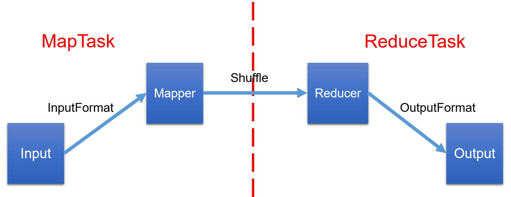

# MapReduce 框架原理

- InputFormat阶段

- Shuffle（拖拽？，改组）阶段

- OutputFormat阶段

  

注意：需要理解逻辑切片和实际存储Block的关系

# 总结

- InputFormat 输入数据接口
  - 默认使用实现类 TextInputFormat
    - 一次读取一行文本
    - 将改行的起始偏移量作为key，行内容作为value返回
  - KeyValueTextInputFormat
    - 一行为一条记录
    - 被分隔符分隔为key，value
    - 默认分隔符为tab -- \t
  - NlineInputFormat
    - 按照指定的行数N进行分片
  - CombineTextInputFormat
    - 将多个小文件合并为一个切片进行处理
    - 提高小文件效率
  - 自定义InputFormat
- Mapper 逻辑处理接口
  - 依据业务实现3个方法
    - setup
    - map
    - cleanup
- Partitioner 分区
  - hashPartitioner 默认实现
    - 依据key的hashCode和numReduces返回一个分区号
  - 自定义分区
- Comparable 排序
  - 自定义对象作为key，需要实现WritableComparable接口
    - 重写compareTo方法
  - 部分排序，对最终的每个输出文件内部排序
  - 全排序，对所有数据进行排序，通常只有一个Reduce
  - 二次排序，排序条件多个
- Combiner 合并
  - 提高效率，在mapTask生成分区文件进行一次简单的reduce操作
- GroupingComparator 分组
  - Reduce端进行key分组
  - 接收key为bean对象时，让多个字段相同的key进入到同一个reduce方法
  - 可以实现分组排序功能
- Reducer 逻辑处理接口
  - 实现3个方法
    - setup
    - reduce
    - cleanup
- OutputFormat 输出数据接口
  - 默认实现 TextOutputFormat
    - 将每一个KV对，向目标文件输出一行
  - SequenceFileOutputFormat
    - 输出后作为后续MapReduce任务的输入
    - 格式紧凑，易于压缩
  - 自定义OutputFormat