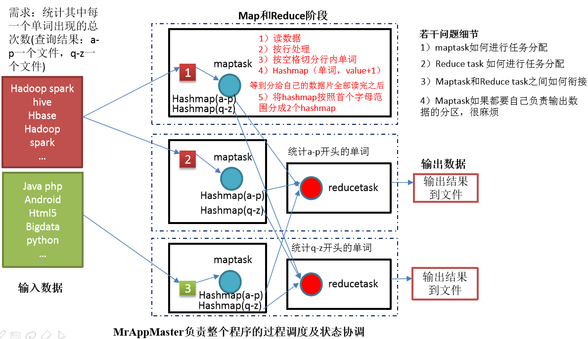

# 介绍

- MapReduce是==一个分布式运算程序的编程框架==
- 用于基于Hadoop的数据分析引用的核心框架
- 将==用户编写的业务代码==和==自带默认组件==整合成一个完整的分布式运算程序，并发运行在一个Hadoop集群上

# 优点

- 易于编程
  - 简单的实现一些接口，完成一个分布式程序
  - 分布式程序可以部署到大量廉价的机器上
  - 编写的程序形式和一个串行的程序一致
- 良好的扩展性
  - 计算资源不满足，可以通过简单的增加机器来扩展计算能力
- 高容错性
  - 如果其中一台机器宕机，可以将上面的==计算任务转移==到另一个节点上运行，整个过程不需要人工参与，系统自动完成
- 适合PB级以上的海量数据的离线处理
  - 上千台服务器集群并发工作，提供数据处理能力

# 缺点

- 不擅长实时计算
  - MapReduce无法像MySql一样，在ms内返回结果
- 不擅长流式计算
  - 流式计算的输入数据是动态的
  - MapReduce的==输入数据集是静态的==，不能动态变化
  - 数据源必须是静态的
- 不擅长有向图计算
  - 有向图DAG
    - 多个应用程序存在依赖关系，后一个程序的输入是前一个程序的输出
  - MapReduce可以使用DAG计算，但是==每个MapReduce的作业结果都会输出到磁盘，会造成大量的IO，性能非常低下==

# 核心思想

- 分布式的运算程序至少分为2个阶段
  - 第一个阶段：mapTask并发实例，完全并行运行，互不相干
  - 第二个阶段：reduceTask并发实例，互不相干，但数据依赖于上一个阶段的所有mapTask并发实例的输出
- MapReduce模型只能包含一个map阶段和一个reduce阶段，如果用户的逻辑非常复杂，只能多个MapReduce程序串行运行

# MapReduce进程

一个完整的MapReduce程序在分布式运行时有3个进程

- MrAppMaster：负责整个程序的过程调度和状态协调
- MapTask：负责Map阶段的整个数据处理流程
- ReduceTask：负责Reduce阶段的整个数据处理流程
