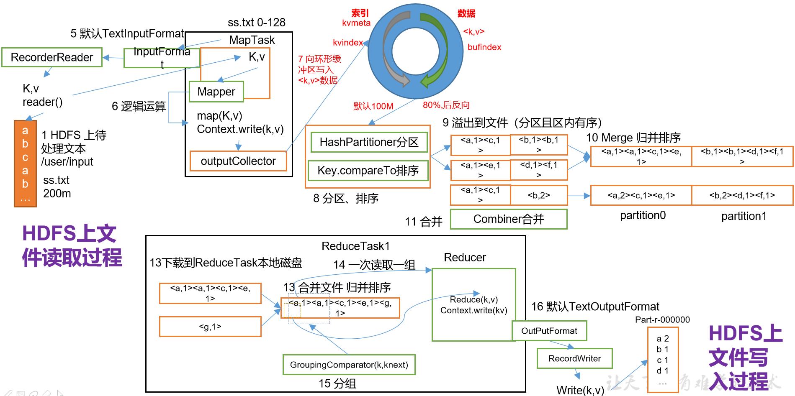
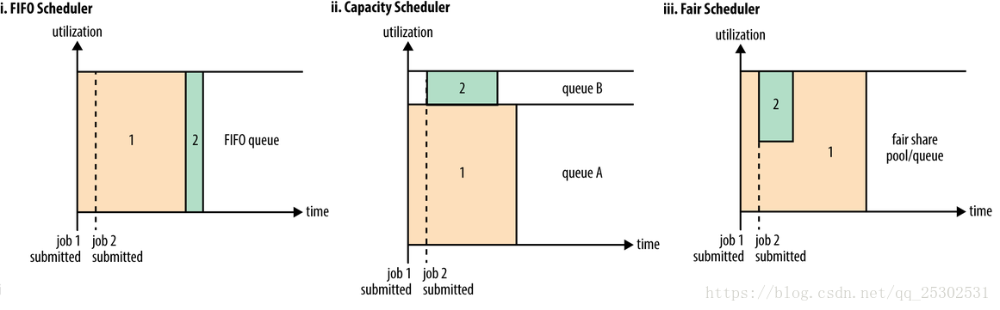
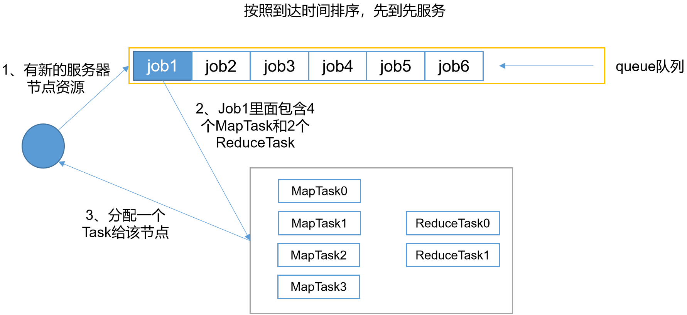
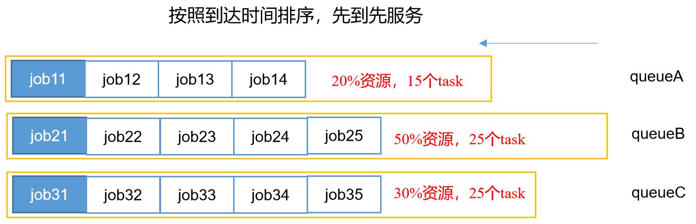

# 介绍

Yarn 是一个==资源调度平台==

- 负责为运算程序提供服务器运算资源
- 类似于一个==分布式操作系统平台==
- MapReduce 等运算程序 相当于操作系统之上的==应用程序==


# 基本架构

- ResourceManager

  - RM

  - 处理客户端请求

  - 监控NodeManager

  - 启动或监控ApplicationMaster

  - 资源的分配与调度

    

- NodeManager

  - NM

  - 管理单个节点上的资源

  - 处理来自ResourceManager的命令

  - 处理来自ApplicationMaster的命令

    

- ApplicationMaster

  - AM
  - 负责数据的切分
  - 为应用程序申请资源并分配给内部任务
  - 任务的监控和容错

  

- Container

  - Yarn资源的抽象
  - 封装了某个节点上的多维资源，如
    - 内存
    - CPU
    - 磁盘
    - 网络


- 图中有2个client，因此有了2个AppMaster

  

# 工作机制


- 图中的0和1表示分区


## 详解

- MR程序提交到客户端所在的节点

- YarnRunner向ResourceManager申请一个Application

- RM将该应用程序的资源路径返回给YarnRunner

- ==该程序将运行所需资源提交到HDFS上==

- 程序资源提交完毕后，申请运行mrAppMaster

- RM将用户的请求初始化成一个Task

- 其中一个NodeManager领取到Task任务

- 该NodeManager创建容器Container，并产生**MRAppmaster**

- Container从HDFS上拷贝资源到本地

- MRAppmaster向RM 申请运行MapTask资源

- RM将运行MapTask任务分配给另外两个NodeManager，另两个NodeManager分别领取任务并创建容器

- MR向两个接收到任务的NodeManager发送程序启动脚本，这两个NodeManager分别启动MapTask，MapTask对数据分区排序

- MrAppMaster==等待所有MapTask运行完毕后==，向RM申请容器，运行ReduceTask

- ReduceTask向MapTask获取相应分区的数据

- 程序运行完毕后，MR会向RM申请注销自己


## Job提交全过程


### Yarn 处理过程


（1）作业提交

第1步：Client调用job.waitForCompletion方法，向整个集群提交MapReduce作业。

第2步：Client向RM申请一个作业id。

第3步：RM给Client返回该job资源的提交路径和作业id。

第4步：Client提交jar包、切片信息和配置文件到指定的资源提交路径。

第5步：Client提交完资源后，向RM申请运行MrAppMaster。

（2）作业初始化

第6步：当RM收到Client的请求后，将该job添加到容量调度器中。

第7步：某一个空闲的NM领取到该Job

第8步：该NM创建Container，并产生MRAppmaster。

第9步：下载Client提交的资源到本地。

（3）任务分配

第10步：MrAppMaster向RM申请运行多个MapTask任务资源。

第11步：RM将运行MapTask任务分配给另外两个NodeManager，另两个NodeManager分别领取任务并创建容器。

（4）任务运行

第12步：MR向两个接收到任务的NodeManager发送程序启动脚本，这两个NodeManager分别启动MapTask，MapTask对数据分区排序。

第13步：MrAppMaster等待所有MapTask运行完毕后，向RM申请容器，运行ReduceTask。

第14步：ReduceTask向MapTask获取相应分区的数据。

第15步：程序运行完毕后，MR会向RM申请注销自己。

（5）进度和状态更新

YARN中的任务将其进度和状态(包括counter)返回给应用管理器, 客户端每秒(通过mapreduce.client.progressmonitor.pollinterval设置)向应用管理器请求进度更新, 展示给用户。

（6）作业完成

除了向应用管理器请求作业进度外, 客户端每5秒都会通过调用waitForCompletion()来检查作业是否完成。时间间隔可以通过mapreduce.client.completion.pollinterval来设置。作业完成之后, 应用管理器和Container会清理工作状态。作业的信息会被作业历史服务器存储以备之后用户核查。


### MapReduce 处理过程





# 资源调度器

- 目前，Hadoop作业调度器主要有三种
  - FIFO
  - Capacity Scheduler 容量调度器
  - Fair Scheduler 公平调度器
  - Hadoop2.7.2默认的资源调度器是Capacity Scheduler

- 具体设置详见：yarn-default.xml文件

```xml
<property>
    <description>The class to use as the resource scheduler.</description>
    <name>yarn.resourcemanager.scheduler.class</name>
<value>org.apache.hadoop.yarn.server.resourcemanager.scheduler.capacity.CapacityScheduler</value>
</property>
```





## FIFO

- 先进先出调度器
  - ==一个队列==
  - job中包含要执行的MapTask和ReduceTask信息
  - 一个NodeManager可以执行一个或多个 MapTask




## Capacity Scheduler （默认）

- 容量调度器



- ==支持多个队列==
  - 每个队列配置一定资源
  - 每个队列采用FIFO调度策略
- 为了防止同一个用户的job独占队列资源
  - 对**同一用户提交的job所占的资源量进行限定**
- 选择策略
  - ==计算每个队列中正在运行的任务数和应该分配的计算资源的比值，选择一个比值最小的队列==
  - 按照job优先级和提交的时间顺序，并考虑用户资源量限制和内存限制，对==队列任务进行排序==
  - 三个队列==同时==按照任务的先后顺序依次执行，并发执行job

- 简单理解就是会额外空出一部分资源，专门用于完成一些小的job，但是若没有相关任务，则这个资源就会一直占用，容易造成资源浪费

## Fair Scheduler

- 公平调度器


- 支持多队列多用户
  - 每个队列中的资源量可以配置
  - 同一队列的job==公平共享==队列的所有资源
- 如3个队列：queueA，queueB, queueC 
  - ==每个队列中的job按照优先级分配资源==
  - 优先级越高分配的资源越多
  - 每个job都会分配到资源，以确保公平
- **缺额**
  - 在资源有限的情况下，每个job理想情况下获取的计算资源和实际获取的资源的差为缺额
  - 同一队列中，==job缺额越大，越先获取资源优先执行==
- 同一队列中的job是按照缺额的高低依次执行，==多个job并发执行==

- 一般情况下，调度器选择这种调度方式，简单理解就是我一个job占用全部资源工作，若有小job来，就释放一定的资源去完成小job，小job完成后，大job继续占用，一般不会产生资源浪费。PS：小job提交后需要等待一定时间，等大job释放资源。


# 任务的推测执行

- 作业完成时间
  - 取决于**最慢的任务**完成时间
  - 一个作业由若干个Map任务和Reduce任务构成
    - 因硬件老化、软件Bug等，某些任务可能运行非常慢。

- 思考

  - 系统中有99%的Map任务都完成了，只有少数几个Map老是进度很慢，完不成，怎么办？

- 推测执行机制

  - 启动备份任务

    - 如某个任务运行速度远慢于任务平均速度

    - 为拖后腿任务启动一个备份任务同时运行

      - 谁先运行完，则采用谁的结果

        

- 执行推测任务的前提条件

  - 每个Task只能有**一个备份**任务

  - 当前Job已完成的Task必须不小于5%

  - 开启推测执行参数设置

    - mapred-site.xml文件中默认是打开的。


```xml
<property>
  	<name>mapreduce.map.speculative</name>
  	<value>true</value>
  	<description>If true, then multiple instances of some map tasks may be executed in parallel.</description>
</property>
<property>
  	<name>mapreduce.reduce.speculative</name>
  	<value>true</value>
  	<description>If true, then multiple instances of some reduce tasks may be executed in parallel.</description>
</property>
```

- 不能启用推测执行机制情况
     - 任务间存在**严重的负载倾斜**
          - 本身有些task会执行很慢
     - 特殊任务，比如任务向数据库中写数据
          - 会有重复数据


### 计算公式

- 假设某一时刻，任务T的执行进度为`progress`

- 推测运行时间`estimatedRunTime`

```text
estimatedRunTime = (currentTimestamp - taskStartTime) / progress
推测运行时间（60s）=（当前时刻（6）- 任务启动时刻（0））/ 任务运行比例（10%）
```

- 最终完成时刻`estimateEndTime`

```text
estimateEndTime = estimatedRunTime + taskStartTime
推测执行完时刻(60s) = 推测运行时间(60s) + 任务启动时刻(0)
```

- 如果此刻为该任务启动一个备份任务，推断出可能的完成时刻`estimateEndTime2`

```text
estimateEndTime2 = currentTimestamp + averageRunTime
备份任务推测完成时刻（16）= 当前时刻（6）+ 运行完成任务的平均时间（10s）
```

- MR总是选择`estimateEndTime - estimateEndTime2`差值最大的任务，并为之==启动备份任务==
- MR为每个作业设置了同时启动的备份任务数目上限
  - 为防止大量任务同时启动备份任务造成的资源浪费
- 推测执行机制实际上采用了经典的优化算法
  - 以空间换时间，它同时启动多个相同任务处理相同的数据，并让这些任务竞争以缩短数据处理时间
  - 需要占用更多的计算资源
  - 在集群资源紧缺的情况下，应合理使用该机制，争取在少量资源的情况下，减少作业的计算时间