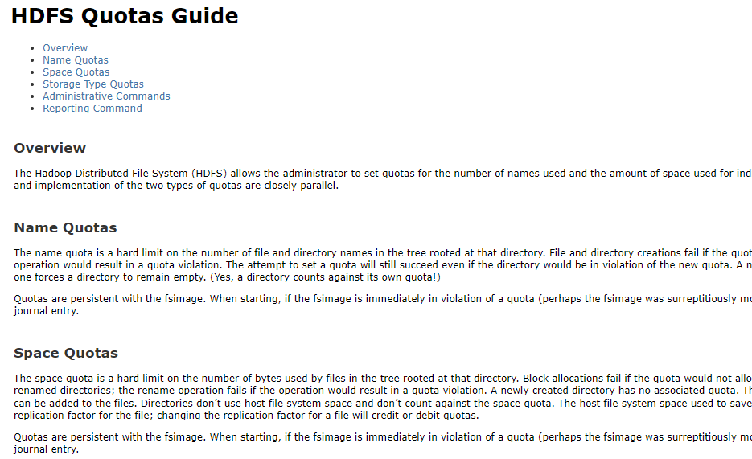

## hdfs 配额

- 为什么做限额，有人产生了大量临时表，或者做了笛卡尔积，集群崩溃，因此对目录进行容量的限额

### Administrative Commands

Quotas are managed by a set of commands available only to the administrator.

- `hdfs dfsadmin -setQuota <N> <directory>...<directory>`

  Set the name quota to be N for each directory. Best effort for each directory, with faults reported if N is not a positive long integer, the directory does not exist or it is a file, or the directory would immediately exceed the new quota.

- `hdfs dfsadmin -clrQuota <directory>...<directory>`

  Remove any name quota for each directory. Best effort for each directory, with faults reported if the directory does not exist or it is a file. It is not a fault if the directory has no quota.

- `hdfs dfsadmin -setSpaceQuota <N> <directory>...<directory>`

  - 对文件目录下的所有文件的总大小做限制，包括副本在内总额度大小
  - 可以传递多个目录
  - 副本也算作限额中

  Set the space quota to be N bytes for each directory. This is a hard limit on total size of all the files under the directory tree. The space quota takes replication also into account, i.e. one GB of data with replication of 3 consumes 3GB of quota. N can also be specified with a binary prefix for convenience, for e.g. 50g for 50 gigabytes and 2t for 2 terabytes etc. Best effort for each directory, with faults reported if N is neither zero nor a positive integer, the directory does not exist or it is a file, or the directory would immediately exceed the new quota.

- `hdfs dfsadmin -clrSpaceQuota <directory>...<directory>`

  Remove any space quota for each directory. Best effort for each directory, with faults reported if the directory does not exist or it is a file. It is not a fault if the directory has no quota.

- `hdfs dfsadmin -setSpaceQuota <N> -storageType <storagetype> <directory>...<directory>`

  Set the storage type quota to be N bytes of storage type specified for each directory. This is a hard limit on total storage type usage for all the files under the directory tree. The storage type quota usage reflects the intended usage based on storage policy. For example, one GB of data with replication of 3 and ALL_SSD storage policy consumes 3GB of SSD quota. N can also be specified with a binary prefix for convenience, for e.g. 50g for 50 gigabytes and 2t for 2 terabytes etc. Best effort for each directory, with faults reported if N is neither zero nor a positive integer, the directory does not exist or it is a file, or the directory would immediately exceed the new quota. The storage type specific quota is set when -storageType option is specified. Available storageTypes are RAM_DISK,DISK,SSD,ARCHIVE.

- `hdfs dfsadmin -clrSpaceQuota -storageType <storagetype> <directory>...<directory>`

  Remove storage type quota specified for each directory. Best effort for each directory, with faults reported if the directory does not exist or it is a file. It is not a fault if the directory has no storage type quota on for storage type specified. The storage type specific quota is cleared when -storageType option is specified. Available storageTypes are RAM_DISK,DISK,SSD,ARCHIVE.