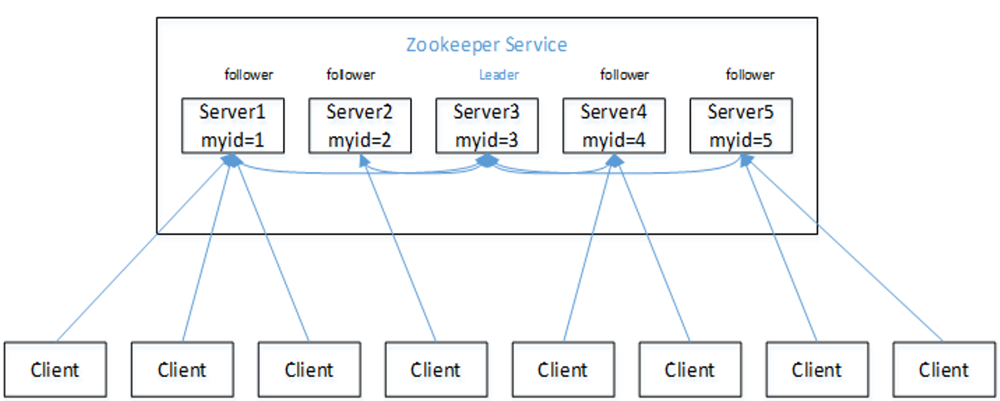
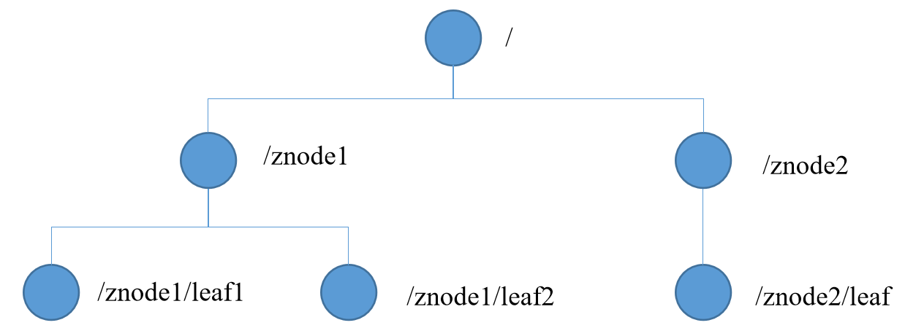

# 概述

> Zookeeper是一个开源的分布式的，为分布式应用提供协调服务的Apache项目


## 特点



- 集群
- 一个领导者Leader节点
- 多个跟随者Follower节点
- ==集群中只要有半数以上的节点存活，ZK集群就能正常服务==

- 全局数据一致性
  - 每个Server保存一份==相同的数据副本==
  - Client无论连接到那个Server，数据都是一致的
- 更新请求顺序进行
  - 来自同一个Client的更新请求按其发送的顺序依次执行
- 数据更新原子性
  - 数据的更新要么成功，要么失败
- 实时性
  - 在一定的时间范围内，Client端读取到最新的数据


## 数据结构

- ZK的数据模型结构与Unix文件系统相似
- 整体上看成一棵树
  - 每个节点称作一个ZNode
  - 每个ZNode默认存储==1MB==的数据
  - 每个ZNode都可以==通过其路径唯一标识==




Observer

- 横向扩展集群
- 扩展集群的读取的性能，而不降低写的性能
- 不参与选举，那么就不会有因为过多节点的选举而造成的写数据的性能损失
- 在跨数据中心场景可以使用
  - 如数据中心1，有3个节点，Leader，2个Follower，其他数据中心都是Observer
  - 那么数据中心1中的节点有挂进行选举会很快选举处Leader，而对Observer的写数据造成的影响较小。


# shell客户端操作


| 命令基本语法     | 功能描述                                             |
| ---------------- | ---------------------------------------------------- |
| help             | 显示所有操作命令                                     |
| ls path [watch]  | 使用 ls 命令来查看当前znode中所包含的内容            |
| ls2 path [watch] | 查看当前节点数据并能看到更新次数等数据               |
| create           | 普通创建  -s  含有序列  -e  临时（重启或者超时消失） |
| get path [watch] | 获得节点的值                                         |
| set              | 设置节点的具体值                                     |
| stat             | 查看节点状态                                         |
| delete           | 删除节点                                             |
| rmr              | 递归删除节点                                         |


# stat结构体

1）czxid-创建节点的事务zxid

每次修改ZooKeeper状态都会收到一个zxid形式的时间戳，也就是ZooKeeper事务ID。

事务ID是ZooKeeper中所有修改总的次序。每个修改都有唯一的zxid，如果zxid1小于zxid2，那么zxid1在zxid2之前发生。

2）ctime - znode被创建的毫秒数(从1970年开始)

3）mzxid - znode最后更新的事务zxid

4）mtime - znode最后修改的毫秒数(从1970年开始)

5）pZxid-znode最后更新的子节点zxid

6）cversion - znode子节点变化号，znode子节点修改次数

7）dataversion - znode数据变化号

8）aclVersion - znode访问控制列表的变化号

9）ephemeralOwner- 如果是临时节点，这个是znode拥有者的session id。如果不是临时节点则是0。

10）dataLength- znode的数据长度

11）numChildren - znode子节点数量


# 操作

```bash
[zk: localhost:2181(CONNECTED) 1] create -e /test "stt" 
Created /test
[zk: localhost:2181(CONNECTED) 2] get /test
"stt"
cZxid = 0x100000004
ctime = Thu Aug 29 22:33:24 CST 2019
mZxid = 0x100000004
mtime = Thu Aug 29 22:33:24 CST 2019
pZxid = 0x100000004
cversion = 0
dataVersion = 0
aclVersion = 0
ephemeralOwner = 0x46cddc566400001
dataLength = 5
numChildren = 0
```

