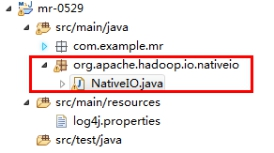

# Hadoop

- 不能通过网页查看HDFS文件系统

  解决方式：http://www.cnblogs.com/zlslch/p/6604189.html

  

- 执行hdfs命令报错：WARN util.NativeCodeLoader: Unable to load native-hadoop library

  ```shell
  [ttshe@hadoop101 hadoop-2.7.2]$ bin/hdfs dfs -mkdir -p /user/ttshe/input
  19/04/08 22:38:11 WARN util.NativeCodeLoader: Unable to load native-hadoop library for your platform... using builtin-java classes where applicable
  # 原因是Linux的(GNU libc) 2.12 版本和Hadoop要求的`GLIBC_2.14' 版本不一致
  # 查看 Hadoop 异常信息
  [ttshe@hadoop101 native]$ pwd
  /opt/module/hadoop-2.7.2/lib/native
  [ttshe@hadoop101 native]$ ldd libhadoop.so.1.0.0 
  ./libhadoop.so.1.0.0: /lib64/libc.so.6: version `GLIBC_2.14' not found (required by ./libhadoop.so.1.0.0)
  	linux-vdso.so.1 =>  (0x00007fff42ffc000)
  	libdl.so.2 => /lib64/libdl.so.2 (0x00007ffab97ee000)
  	libc.so.6 => /lib64/libc.so.6 (0x00007ffab9459000)
  	/lib64/ld-linux-x86-64.so.2 (0x000055f554143000)
  # 查看本地版本
  [ttshe@hadoop101 native]$ ldd --version
  ldd (GNU libc) 2.12
  # 可以在日志中配置忽略该错误
  [ttshe@hadoop101 hadoop]$ pwd
  /opt/module/hadoop-2.7.2/etc/hadoop
  [ttshe@hadoop101 hadoop]$ vim log4j.properties 
  log4j.logger.org.apache.hadoop.util.NativeCodeLoader=ERROR
  ```

  https://blog.csdn.net/u010003835/article/details/81127984

- 伪分布式

  - 在不同的用户下开启不同的服务，如在root下开启了NodeManager，那么在ttshe用户下使用jps就看不到该节点，而在ttshe下开启的节点服务，在root使用jps可以看到

  

- 关于权限：在本示例中，所有hadoop的操作都要在一个非root的==普通账户==下进行，否则会有权限不一致导致程序出错的问题。所属组和所属主都要普通用户


- 防火墙没关闭、或者没有启动YARN

  - INFO client.RMProxy: Connecting to ResourceManager at hadoop108/192.168.10.108:8032

- 主机名称配置错误

- IP地址配置错误

- ssh没有配置好

- root用户和ttshe==两个用户==启动集群不统一

- 配置文件修改不细心

- 未编译源码

  - Unable to load native-hadoop library for your platform... using builtin-java classes where applicable 17/05/22 15:38:58 INFO client.RMProxy: Connecting to ResourceManager at hadoop108/192.168.10.108:8032

- 不识别主机名称

  java.net.UnknownHostException: hadoop102: hadoop102

  ​        at java.net.InetAddress.getLocalHost(InetAddress.java:1475)

  ​        at org.apache.hadoop.mapreduce.JobSubmitter.submitJobInternal(JobSubmitter.java:146)

  ​        at org.apache.hadoop.mapreduce.Job$10.run(Job.java:1290)

  ​        at org.apache.hadoop.mapreduce.Job$10.run(Job.java:1287)

  ​        at java.security.AccessController.doPrivileged(Native Method)

  ​	at javax.security.auth.Subject.doAs(Subject.java:415)

  - 解决办法：
    - 在/etc/hosts文件中添加192.168.1.102 hadoop102
    - 主机名称不要起hadoop  hadoop000等特殊名称	

- DataNode和NameNode进程同时只能工作一个。

- 执行命令不生效，粘贴word中命令时，遇到-和长–没区分开。导致命令失效

  - 解决办法：尽量不要粘贴word中代码。

- jps发现进程已经没有，但是重新启动集群，提示进程已经开启。原因是在linux的根目录下/tmp目录中存在启动的进程临时文件，将集群相关进程删除掉，再重新启动集群。

- jps不生效。原因：全局变量hadoop java没有生效。

  - 解决办法：需要source /etc/profile文件。

- 8088端口连接不上

  - [ttshe@hadoop102 桌面]$ cat /etc/hosts
  - 注释掉如下代码
    - #127.0.0.1   localhost localhost.localdomain localhost4 localhost4.localdomain4
    - #::1         hadoop102


导包容易出错。尤其Text和CombineTextInputFormat。

2）Mapper中第一个输入的参数必须是LongWritable或者NullWritable，不可以是IntWritable.  报的错误是类型转换异常。

3）java.lang.Exception: java.io.IOException: Illegal partition for 13926435656 (4)，说明Partition和ReduceTask个数没对上，调整ReduceTask个数。

4）如果分区数不是1，但是reducetask为1，是否执行分区过程。答案是：不执行分区过程。因为在MapTask的源码中，执行分区的前提是先判断ReduceNum个数是否大于1。不大于1肯定不执行。

5）在Windows环境编译的jar包导入到Linux环境中运行，

hadoop jar wc.jar com.atguigu.mapreduce.wordcount.WordCountDriver /user/atguigu/ /user/atguigu/output

报如下错误：

Exception in thread "main" java.lang.UnsupportedClassVersionError: com/atguigu/mapreduce/wordcount/WordCountDriver : Unsupported major.minor version 52.0

原因是Windows环境用的jdk1.7，Linux环境用的jdk1.8。

解决方案：统一jdk版本。

6）缓存pd.txt小文件案例中，报找不到pd.txt文件

原因：大部分为路径书写错误。还有就是要检查pd.txt.txt的问题。还有个别电脑写相对路径找不到pd.txt，可以修改为绝对路径。

7）报类型转换异常。

通常都是在驱动函数中设置Map输出和最终输出时编写错误。

Map输出的key如果没有排序，也会报类型转换异常。

8）集群中运行wc.jar时出现了无法获得输入文件。

原因：WordCount案例的输入文件不能放用HDFS集群的根目录。

9）出现了如下相关异常

```java
Exception in thread "main" java.lang.UnsatisfiedLinkError: org.apache.hadoop.io.nativeio.NativeIO$Windows.access0(Ljava/lang/String;I)Z
	at org.apache.hadoop.io.nativeio.NativeIO$Windows.access0(Native Method)
	at org.apache.hadoop.io.nativeio.NativeIO$Windows.access(NativeIO.java:609)
	at org.apache.hadoop.fs.FileUtil.canRead(FileUtil.java:977)
java.io.IOException: Could not locate executable null\bin\winutils.exe in the Hadoop binaries.
	at org.apache.hadoop.util.Shell.getQualifiedBinPath(Shell.java:356)
	at org.apache.hadoop.util.Shell.getWinUtilsPath(Shell.java:371)
	at org.apache.hadoop.util.Shell.<clinit>(Shell.java:364)
```

解决方案：拷贝hadoop.dll文件到Windows目录C:\Windows\System32。个别同学电脑还需要修改Hadoop源码。

方案二：创建如下包名，并将NativeIO.java拷贝到该包名下

 

10）自定义Outputformat时，注意在RecordWirter中的close方法必须关闭流资源。否则输出的文件内容中数据为空。

```java
@Override
public void close(TaskAttemptContext context) throws IOException, InterruptedException {
		if (atguigufos != null) {
			atguigufos.close();
		}
		if (otherfos != null) {
			otherfos.close();
	}

}
```


# 解决关闭Hadoop时no namenode to stop异常


### 问题描述

部门的Hadoop集群运行有一个多月了，今天需要做点调整，但是突然发现Hadoop不能正常关闭！

Hadoop版本：2.6.0

具体情况如下：

```
[root@master ~]# stop-dfs.sh

Stopping namenodes on [master]
master: no namenode to stop
slave2: no datanode to stop
slave1: no datanode to stop
...
```


### 问题原因

执行jps，发现namenode,datanode等进程都正常运行着。纳了闷！

谁报的错就找谁吧，于是就开始阅读hadoop-daemon.sh脚本文件，结果找出问题原因了。

首先找到报错的位置，在文件的最后几行：

```
 if [ -f $pid ]; then
      TARGET_PID=`cat $pid`
      if kill -0 $TARGET_PID > /dev/null 2>&1; then
        echo stopping $command
        kill $TARGET_PID
        sleep $HADOOP_STOP_TIMEOUT
        if kill -0 $TARGET_PID > /dev/null 2>&1; then
          echo "$command did not stop gracefully after $HADOOP_STOP_TIMEOUT seconds: killing with kill -9"
          kill -9 $TARGET_PID
        fi
      else
        echo no $command to stop
      fi
      rm -f $pid
    else
      echo no $command to stop
    fi
```

代码很多，我们只看我们关心的部分：

```
if [ -f $pid ]; then
     ....#省略n多行
    else
      echo no $command to stop
 fi
```

这样就很明显了，如果pid文件不存在就会打印:no xxx to stop

那么pid是什么文件，为什么会不存在，找到pid变量的声明语句，在脚本文件的第107行：

```
pid=$HADOOP_PID_DIR/hadoop-$HADOOP_IDENT_STRING-$command.pid #第107行
```

接着再找HADOOP_PID_DIR变量的声明部分：

首先在脚本注释部分找了很关键的一句话：

```
#   HADOOP_PID_DIR   The pid files are stored. /tmp by default.
```

我们知道了，HADOOP_PID_DIR 变量保存的是pid文件的存储路径。默认存储在/tmp目录中，代码如下：

```
if [ "$HADOOP_PID_DIR" = "" ]; then   //97~99行
  HADOOP_PID_DIR=/tmp
fi
```

那么这个pid文件是啥呢。Hadoop启动后，会把进程的PID号存储在一个文件中，这样执行stop-dfs脚本时就可以按照进程PID去关闭进程了。

现在问题原因很明确了，就是/tmp目录下的hadoop-*.pid的文件找不到了。


### 解决问题

那就看看/tmp目录下还有啥：

```
[root@slave1 ~]# ll /tmp/
srwxr-x--- 1 root root    0 Mar 26 13:39 Aegis-<Guid(5A2C30A2-A87D-490A-9281-6765EDAD7CBA)>
drwxr-xr-x 2 root root 4096 Apr 10 13:55 hsperfdata_root
srwxr-x--- 1 root root    0 Mar 26 13:39 qtsingleapp-aegisG-46d2-0
srwxrwxrwx 1 root root    0 Mar 26 13:39 qtsingleapp-aegiss-a5d2-0
```

额，除了我们需要的，其他啥都有！

我们知道/tmp是临时目录，系统会定时清理该目录中的文件。显然把pid文件放在这里是不靠谱的，pid文件长时间不被访问，早被清理了!

既然Hadoop不知道需要关闭哪些进程了，那我们只能手动关闭了！

先用ps -ef查看namenode\datanode等进程的PID，然后用kill -9干掉即可！

重启Hadoop后再看看/tmp目录的变化，多出了下面几个文件：

```
[root@master ~]# ll /tmp
-rw-r--r-- 1 root root    6 Apr 10 13:39 hadoop-root-namenode.pid
-rw-r--r-- 1 root root    6 Apr 10 13:39 hadoop-root-secondarynamenode.pid
-rw-r--r-- 1 root root    6 Apr 10 13:55 yarn-root-resourcemanager.pid

drwxr-xr-x 4 root root 4096 Apr 10 14:52 Jetty_0_0_0_0_50070_hdfs____w2cu08
drwxr-xr-x 4 root root 4096 Apr 10 14:52 Jetty_0_0_0_0_50090_secondary____y6aanv
drwxr-xr-x 5 root root 4096 Apr 10 15:02 Jetty_master_8088_cluster____i4ls4w
```

前三个文件是存放PID的文件，后三个Jetty_xxx格式的目录是Hadoop的web应用的临时目录，不是我们关心的。

打开一个pid文件看看：

```
[root@master tmp]# cat hadoop-root-namenode.pid
32169
```

很简单，就保存了namenode进程的PID，再关闭namenode进程时就要从这个文件中读取PID。

到这里问题已经愉快的解决了！

但是，明知道pid文件放这里不安全，还不修改一下就显得我太懒了！

修改pid文件存放目录，只需要在hadoop-daemon.sh脚本中添加一行声明即可：

```
HADOOP_PID_DIR=/root/hadoop/pid  #第25行
```

记住要先关闭Hadoop再修改，不然你修改完又无法关闭了！同样的道理，你还需要修改yarn-daemon.sh

```
YARN_PID_DIR=/root/hadoop/pid
```

然后执行start-dfs.sh \ start-yarn.sh 启动Hadoop。再去/root/hadoop/pid目录下看看：

```
[root@master pid]# ll


-rw-r--r-- 1 root root 5 Apr 10 14:52 hadoop-root-namenode.pid


-rw-r--r-- 1 root root 5 Apr 10 14:52 hadoop-root-secondarynamenode.pid


-rw-r--r-- 1 root root 5 Apr 10 15:02 yarn-root-resourcemanager.pid
```

好了，从此再也不用担心出现no xxx to stop的警告了！

### /tmp目录的清理策略 

除了更换pid文件的保存路径外，我不由会想起另外一种解决思路，不让操作系统删除保存在/tmp目录下的pid文件不就可以了嘛！好的，那我们就来看看操作系统是怎么清理/tmp目录的。

遇到这个问题之前，我也没关系过/tmp目录，度娘一下，得到答案。

我们先来看一个重要的命令：

**tmpwatch**

tmpwatch指令可删除不必要的暂存文件，你可以设置文件超期时间，单位以小时计算。

```
常用参数：
-m 或–mtime 根据文件被更改时间
-c 或–ctime 根据文件更改状态时间
-M 或–dirtime 根据文件夹被更改时间
-x 或–exclude=path 排除某路径
-X 或–exclude-pattern=pattern 排除某规则下的路径
```

/tmp作为临时文件夹，系统默认每天清理一次该目录。系统通过定时任务每天会执行一次/etc/cron.daily/tmpwatch这个脚本。其原理就是利用tmpwatch指令，设置清理策略。我们来看一下这个脚本内容：

```
/etc/cron.daily/tmpwatch
#! /bin/sh
flags=-umc
/usr/sbin/tmpwatch "$flags" -x /tmp/.X11-unix -x /tmp/.XIM-unix \
        -x /tmp/.font-unix -x /tmp/.ICE-unix -x /tmp/.Test-unix \
        -X '/tmp/hsperfdata_*' 10d /tmp
/usr/sbin/tmpwatch "$flags" 30d /var/tmp
for d in /var/{cache/man,catman}/{cat?,X11R6/cat?,local/cat?}; do
    if [ -d "$d" ]; then
        /usr/sbin/tmpwatch "$flags" -f 30d "$d"
    fi
done
```

代码的4~6行是一条语句，设置/tmp目录的清理策略. -x或-X是用来排除不清理的文件或目录，10d表示会删除最近10天没有被访问的文件(有的系统可能是240 ，表示240小时，也是10天)。

好吧 ，10天不用就给删除了，Hadoop集群运行几十天了，当然也就找不到pid文件了。

你有注意第6行代码中，被排除的文件吗 ？/tmp/hsperfdata_*，我们在上面解决问题时，第一次查看/tmp目录就有一个匹配此模式的文件：hsperfdata_root 。

那么，想不让系统删除pid文件，比着榴莲画个瓢就行了。在tmpwatch脚本中增加一个排除条件即可：

```
-X '/tmp/*.pid'
```

不过，既然是临时目录，重要的文件就不要放这了，还是推荐第一种解决方式！