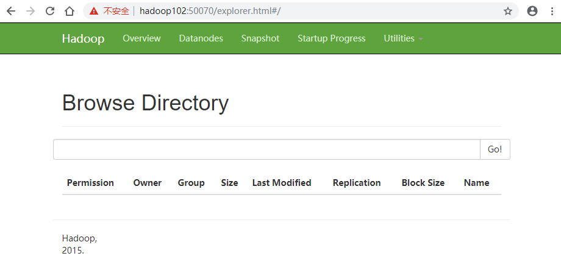
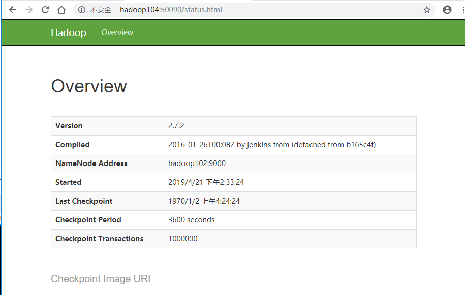

# Hadoop 学习


## 大数据概论

> big data 指**无法再一定时间范围**内用常规软件工具进行捕捉，管理和处理的数据集合，需要新处理模式才能具有更强的决策力，洞察发现力，流程优化能力的**海量，高增长率和多样化的信息资产**。

主要解决：海量数据的==存储==，海量数据的==分析计算==问题

存储单位：bit，Byte，KB，MB，GB，**TB**，**PB**，**EB**，ZB

- 1 TB = 1024GB

- 1 PB = 1024TB


### 大数据特点 4V

- Volume 大量，目前，人类的所有印刷的数据量是200PB，历史上人类的总共说过的话的数据量大约是5EB，典型的个人计算机银盘的容量为TB量级，企业已接近EB

- Velocity 高速，大数据区别于传统数据的显著特征，从海量数据中快速获取期望的数据，数据处理的高效。

- Variety 多样

  - 结构化数据：数据库，文本
  - 非结构化数据：网络日志，音频，视频，图片，地理位置等

- Value 低价值密度，价值密度大小与数据总量大小成反比，最有价值的数据比较小，如何对有价值的数据提纯是当前大数据急需要解决的问题。

  
### 应用场景

- 物流仓储：大数据分析系统助力商家精细化运营，提升销量，节约成本

- 零售：分析用户消费习惯，给用户购买商品提供方便，提升商品销量

  - 典型案例：纸尿布+啤酒，在纸尿布的销量和啤酒的销量成正比，原因是有孩子的家庭买纸尿布的人是男性，从而一般会购买啤酒，那么将纸尿布和啤酒摆放的位置接近，可以提升销量。

- 旅游：深度结合大数据能力和旅游业的需求，共建旅游产业的智慧管理，智慧服务，智慧营销的未来

- 商品广告推荐：给用户推荐可能喜欢的商品

- 保险：海量数据挖掘以及风险预测，助力保险行业精准营销，提升精细化定价能力

- 金融：多维度体现用户特征，帮助金融机构推荐优质客户，防范欺诈风险

- 房产：大数据全面助力房地产行业，打造精准营销，选择合适的地，建造合适楼，卖给合适的人

- 人工智能

  


### 大数据部门业务流程

- 产品人员提出需求（统计总用户数，日活跃用户数，回流用户数等）

- 数据部门搭建数据平台，分析数据指标

- 数据可视化（报表展示，邮件发送，大屏幕显示）

  


### 大数据部门组织结构


## 大数据生态 （Hadoop生态圈）

### Hadoop框架

- 一个由Apache基金会所开发的分布式系统基础架构

- 处理海量数据的==存储==，海量数据的==分析计算==问题

- 广义上而言，Hadoop通常是指一个更广泛的概念---Hadoop生态圈


### Hadoop发展历史

- Lucene框架是Doug Cutting使用java开发的开源软件，实现与Google类似的全文搜索功能，提供了全文检索引擎架构，包括完整的查询引擎和索引引擎

- 2001年底Lucene成为Apache基金会的子项目

- 对于海量数据，Lucene面对与Google同样的困难，数据**存储困难**，**检索速度慢**

- 学习和模仿谷歌解决这些问题：微型版Nutch

- Google是Hadoop的思想之源，Google的三篇大数据论文

  - GFS —>HDFS
  - Map-Reduce —> MR
  - BigTable —>HBase

- 2003-2004，Google公开了部分GFS和MapReduce的思想细节，以此为基础Doug Cutting用业余时间完成了DFS以及MapReduce机制，使得Nutch性能飙升

- 2005年，Hadoop作为Lucene的子项目Nutch的一部分引入Apache基金会

- 2006年，Map-Reduce和Nutch Distributed File System （NDFS）分别被纳入到Hadoop中

- Hadoop来源是Doug Cutting儿子的玩具大象

  

### Hadoop三大发行版本

- Apache 版本：最基础，最原始的版本，入门学习使用
  - Apache Hadoop
  - 官网：http://hadoop.apache.org/releases.html
  - 下载：https://archive.apache.org/dist/hadoop/common/
- Cloudera 在中大型互联网企业中用的较多
  - 2008年成立的Cloudera是最早将Hadoop商用的公司，为合作伙伴提供Hadoop的商用解决方案，主要包括支持，咨询服务，培训
  - 2009年，Hadoop创始人Doug Cutting加盟Cloudera公司
  - Cloudera公司产品主要为**CDH**，Cloudera Manager，Cloudera Support
  - CDH 是 Cloudera公司的Hadoop发行版本，完全开源，比Apache Hadoop在兼容性，安全性，稳定性上有所增强
  - Cloudera Manager是集群的软件分发以及管理监控平台，可以在几个小时部署好一个Hadoop集群，并对集群节点以及服务进行实时监控
  - Cloudera Support 是对Hadoop的技术支持
  - Cloudera 开发并贡献了可实时处理大数据的Impala项目
  - 官网：https://www.cloudera.com/downloads/cdh/5-10-0.html
  - 下载：http://archive-primary.cloudera.com/cdh5/cdh/5/
- Hortonworks 文档较好
  - 2011年成立，是雅虎和谷歌风投公司Benchmark Capital合资组建
  - **公司成立之初就吸纳了大约25名至30名专门研究Hadoop的雅虎工程师，上述工程师均在2005年开始协助雅虎开发Hadoop，贡献了Hadoop80%的代码**
  - Hortonworks的主打产品是Hortonworks Data Platform（HDP），也同样是100%开源的产品，HDP除常见的项目外还包括了Ambari，一款开源的安装和管理系统
  - HCatalog，一个元数据管理系统，HCatalog现已集成到Facebook开源的Hive中。Hortonworks的Stinger开创性的极大的优化了Hive项目。Hortonworks为入门提供了一个非常好的，易于使用的沙盒
  - Hortonworks开发了很多增强特性并提交至核心主干，这使得Apache Hadoop能够在包括Window Server和Windows Azure在内的Microsoft Windows平台上本地运行。定价以集群为基础，每10个节点每年为12500美元
  - 官网：https://hortonworks.com/products/data-center/hdp/
  - 下载：https://hortonworks.com/downloads/#data-platform


### Hadoop优势

- 高可靠性：Hadoop底层维护多个数据副本，即使Hadoop某个计算单元出现故障，也不会导致数据丢失
- 高扩展性：在集群间分配任务数据，可以方便的扩展节点
- 高效性：在MapReduce的思想下，Hadoop是并行工作的，以加快任务处理速度
- 高容错性：可以自动将失败的任务重新分配


### Hadoop组成

Hadoop1.x 和Hadoop 2.x的区别


在Hadoop1.x的时候，MapReduce同时处理业务逻辑运算和资源调度，耦合性比较大，在Hadoop2.x的时候，增加了Yarn负责资源调度，而MapReduce只负责运算。


#### HDFS 架构

> Hadoop Distributed File System 分布式文件系统

- NameNode：nn 
  - 存储文件的元数据，如文件名，文件目录结构，文件属性（生成时间，副本数，文件权限）
  - 存储每个文件块列表，块所在的DataNode等
  - 类似索引
- DataNode：dn

  - 在本地文件系统存储文件块数据，以及块数据的校验和
- Secondary NameNode：2nn
  - 监控HDFS状态的辅助后台程序

  - 每隔一段时间获取HDFS元数据的快照

  - 等于是NameNode的备份节点

    

#### Yarn 架构


#### MapReduce架构

> 将计算过程分为2个阶段：map阶段，reduce阶段

- map阶段：并行处理输入数据

- reduce阶段：对map的结果进行汇总

  

### 大数据技术生态体系


- Sqoop

  - 开源工具，主要在Hadoop，Hive与传统的数据库（Mysql）间进行数据传输，可以将一个关系型数据库中的数据导入到Hadoop的HDFS中，也可以将HDFS的数据导入到关系型数据库中
- Flume
  - Cloudera提供的一个高可用，高可靠的分布式**海量日志**采集，集合，传输的系统，支持在日志系统中定制各种数据发送方，用于收集数据
  - 提供堆数据进行简单处理，并写入到各种数据接收方（可定制）的能力
- Kafka
  - 一种高吞吐量的分布式发布订阅消息系统
  - 通过O(1)的磁盘数据结构提供消息的持久化，这种结构对于刚数据在TB的消息存储也可以有长时间的稳定性
  - 高吞吐量：即使非常普通的硬件，Kafka也可以支持每秒百万的消息
  - 支持通过Kafka服务器和消费机集群来区分消息
  - 支持Hadoop**并行数据**加载
- Storm

  - 用于连续计算，对数据流进行连续查询，在计算时就将结果以流的形式输出给用户
- Spark

  - 当前最流行的开源大数据**内存计算**框架，就Hadoop上存储的大数据进行计算
- Oozie

  - 一个管理Hadoop作业（job）的工作流程调度管理系统
- Hbase
  - 分布式，面向列的开源数据库
  - 不同一般的关系型数据库，它适合于非结构化数据存储的数据库
- Hive
  - 基于Hadoop的一个**数据仓库工具**
  - 将结构化的数据映射为一张数据库表，提供简单的SQL查询功能，将SQL语句转换为MapReduce任务进行运行
  - 学习成本低，可以通过SQL快速实现简单的MapReduce统计，不用开发专门的MapReduce应用，适合数据仓库的统计分析
- R语言
  - 用于统计分析，绘图的语言，统计计算和统计制图的优秀工具
  - 属于GNU系统的一个自由，免费，源代码开放的软件
- Mahout

  - Apache Mahout 是一个可扩展的机器学习和数据挖掘库
- Zookeeper
  - Google的Chubby一个开源的实现

  - 针对大型分布式系统的可靠性协调系统

  - 功能：配置维护，名字服务，分布式同步，组服务等

  - 封装好复杂易出错的关键服务，将简单易用的接口和性能高效，功能稳定的系统提供给用户。

    

### 推荐系统架构图


## Hadoop 运行环境搭建（重点）


### 虚拟机环境准备

- 克隆虚拟机

  - 选中VM左侧边框栏中要克隆的虚拟机：鼠标右键-> 管理 -> 克隆
  - 弹出对话框-下一步 -> 下一步 - 克隆类型：创建完整克隆，下一步- 填写虚拟机名称与路径，点击完成。

- 修改克隆虚拟机静态IP

  - 使用root登录后，输入命令 vim /etc/udev/rules.d/70-persistent-net.rules 对ip进行修改

    ```shell
    # PCI device 0x8086:0x100f (e1000)
    SUBSYSTEM=="net", ACTION=="add", DRIVERS=="?*", ATTR{address}=="00:0c:29:d1:82:07", ATTR{type}=="1", KERNEL=="eth*", NAME="eth0"
    
    # PCI device 0x8086:0x100f (e1000)
    SUBSYSTEM=="net", ACTION=="add", DRIVERS=="?*", ATTR{address}=="00:0c:29:06:23:4e", ATTR{type}=="1", KERNEL=="eth*", NAME="eth1"
    ```

  - 删除 eth0 配置项，并将eth1的配置项的NAME改为eth0，并复制修改后该记录的ATTR的值(00:0c:29:06:23:4e)，修改后如下

    ```shell
    # PCI device 0x8086:0x100f (e1000)
    SUBSYSTEM=="net", ACTION=="add", DRIVERS=="?*", ATTR{address}=="00:0c:29:06:23:4e", ATTR{type}=="1", KERNEL=="eth*", NAME="eth0"
    ```

  - 命令修改IP和MAC地址，输入命令：vim /etc/sysconfig/network-scripts/ifcfg-eth0

    ```shell
    DEVICE=eth0
    HWADDR=00:0C:29:D1:82:07
    TYPE=Ethernet
    UUID=fa28742b-9453-4009-8074-1f2c21a83305
    ONBOOT=yes
    NM_CONTROLLED=yes
    BOOTPROTO=static
    IPADDR=192.168.1.100
    GATEWAY=192.168.1.2
    DNS1=114.114.114.114
    DNS2=8.8.8.8
    ```

    - 修改MAC地址，将HWADDR的值替换为复制的ATTR的值
    - 修改IP地址，这里将IPADDR修改为192.168.1.101

- 修改主机名

  - 输入命令：vim /etc/sysconfig/network

    ```shell
    NETWORKING=yes
    HOSTNAME=hadoop100
    ```

    - 这里将主机名称修改为hadoop101

  - 配置hosts，输入命令：vim /etc/hosts

    ```shell
    127.0.0.1   localhost localhost.localdomain localhost4 localhost4.localdomain4
    ::1         localhost localhost.localdomain localhost6 localhost6.localdomain6
    192.168.1.100 hadoop100
    192.168.1.101 hadoop101
    192.168.1.102 hadoop102
    192.168.1.103 hadoop103
    192.168.1.104 hadoop104
    192.168.1.105 hadoop105
    192.168.1.106 hadoop106
    192.168.1.107 hadoop107
    192.168.1.108 hadoop108
    ```

    - 这里额外配置了其他主机和ip，以后会用到的映射

- 关闭防火墙

- 创建一个测试用户，如ttshe，配置用户具有root权限

- 在/opt目录下创建文件夹module，software，修改文件夹所有者为ttshe，注意所属组也需要是ttshe

  ```shell
  [ttshe@hadoop101 opt]$ mkdir module
  mkdir: 无法创建目录"module": 权限不够
  [ttshe@hadoop101 opt]$ sudo mkdir module software
  [sudo] password for ttshe: 
  [ttshe@hadoop101 opt]$ ll
  总用量 12
  drwxr-xr-x. 2 root root 4096 4月   7 11:44 module
  drwxr-xr-x. 2 root rootre 4096 10月  4 2017 rh
  drwxr-xr-x. 2 root root 4096 4月   7 11:44 software
  # 此时创建成功，但是所属主仍然是root，需要修改这2个文件的权限
  [ttshe@hadoop101 opt]$ sudo chown ttshe:ttshe -R、 module/ software/
  [ttshe@hadoop101 opt]$ ll
  总用量 12
  drwxr-xr-x. 2 ttshe ttshe 4096 4月   7 11:44 module
  drwxr-xr-x. 2 root  root  4096 10月  4 2017 rh
  drwxr-xr-x. 2 ttshe ttshe 4096 4月   7 11:44 software
  ```

- 重启服务：reboot

  - 输入ifconfig查看ip和mac是否修改成功
  - 使用主机和虚拟机相互ping一下，查看是否连通

- 删除克隆

  - 选中VM左侧边框栏中要删除的虚拟机，鼠标右键-> 管理 -> 从磁盘中删除

    

### 安装JDK

- 卸载现有JDK

  - 查询是否安装了Java，输入命令：rpm -qa | grep java
  ```shell
  [ttshe@hadoop101 opt]$ rpm -qa | grep java
  tzdata-java-2018i-1.el6.noarch
  java-1.6.0-openjdk-1.6.0.41-1.13.13.1.el6_8.x86_64
  java-1.7.0-openjdk-1.7.0.211-2.6.17.1.el6_10.x86_64
  ```

  - 如果JDK低于1.8版本，则卸载：sudo rpm -e 软件包

- 安装JDK，使用rz命令将JDK包传入opt的software目录下

  ```shell
  [ttshe@hadoop101 software]$ ll
  总用量 388252
  -rw-r--r--. 1 ttshe root 212046774 5月  23 2017 hadoop-2.7.2.tar.gz
  -rw-r--r--. 1 ttshe root 185515842 8月  19 2017 jdk-8u144-linux-x64.tar.gz
  ```

  - 解压缩JDK到module文件夹下

  ```shell
  [ttshe@hadoop101 software]$ tar -zxvf jdk-8u144-linux-x64.tar.gz -C /opt/module/
  ```

- 配置环境变量

  - 获取JDK路径

  ```shell
  [ttshe@hadoop101 module]$ cd jdk1.8.0_144/
  [ttshe@hadoop101 jdk1.8.0_144]$ pwd
  /opt/module/jdk1.8.0_144
  ```

  - 打开/etc/profile文件

  ```shell
  [ttshe@hadoop101 jdk1.8.0_144]$ sudo vi /etc/profile
  # 在profile文件底部添加
  #JAVA_HOME
  export JAVA_HOME=/opt/module/jdk1.8.0_144
  export PATH=$PATH:$JAVA_HOME/bin
  ```

  - 保存后退出，并执行：source  /etc/profile
  - 测试JDK是否安装成功，如果没有生效，尝试重启一下

  ```shell
  [ttshe@hadoop101 jdk1.8.0_144]$ source /etc/profile
  [ttshe@hadoop101 jdk1.8.0_144]$ java -version
  java version "1.8.0_144"
  Java(TM) SE Runtime Environment (build 1.8.0_144-b01)
  Java HotSpot(TM) 64-Bit Server VM (build 25.144-b01, mixed mode)
  ```


### 安装Hadoop

- 下载地址：https://archive.apache.org/dist/hadoop/common/hadoop-2.7.2/

- 使用rz命令，将tar包放入到opt/software下

- 解压到opt/module下

  ```shell
  [ttshe@hadoop101 software]$ tar -zvxf hadoop-2.7.2.tar.gz -C /opt/module/
  ```

- 配置环境变量

  ```shell
  [ttshe@hadoop101 hadoop-2.7.2]$ pwd
  /opt/module/hadoop-2.7.2
  [ttshe@hadoop101 hadoop-2.7.2]$ sudo vi /etc/profile
  # 在profile文件最后添加
  # HADOOP_HOME
  export HADOOP_HOME=/opt/module/hadoop-2.7.2
  export PATH=$PATH:$HADOOP_HOME/bin
  export PATH=$PATH:$HADOOP_HOME/sbin
  # 保存后退出
  [ttshe@hadoop101 hadoop-2.7.2]$ source /etc/profile
  ```

- 测试是否安装成功

  ```shell
  [ttshe@hadoop101 hadoop-2.7.2]$ hadoop version
  Hadoop 2.7.2
  Subversion https://git-wip-us.apache.org/repos/asf/hadoop.git -r b165c4fe8a74265c792ce23f546c64604acf0e41
  ```


### Hadoop 目录结构

- 查看Hadoop目录结构

  ```shell
  [ttshe@hadoop101 hadoop-2.7.2]$ ll
  总用量 52
  # bin目录：存放Hadoop相关服务（HDFS，YARN）进行操作的脚本
  drwxr-xr-x. 2 ttshe root  4096 1月  26 2016 bin
  # etc目录：Hadoop的配置文件目录
  drwxr-xr-x. 3 ttshe root  4096 1月  26 2016 etc
  # include 目录：包含外部调用的文件，如C的.h文件
  drwxr-xr-x. 2 ttshe root  4096 1月  26 2016 include
  # lib目录：存放Hadoop的本地库（对数据进行压缩解压功能）
  # hadoop有些压缩解压的功能没有支持，使用自己编译的动态编译库来支持
  drwxr-xr-x. 3 ttshe root  4096 1月  26 2016 lib
  drwxr-xr-x. 2 ttshe root  4096 1月  26 2016 libexec
  -rw-r--r--. 1 ttshe root 15429 1月  26 2016 LICENSE.txt
  -rw-r--r--. 1 ttshe root   101 1月  26 2016 NOTICE.txt
  -rw-r--r--. 1 ttshe root  1366 1月  26 2016 README.txt
  # sbin目录：存放启动或停止Hadoop相关服务的脚本
  drwxr-xr-x. 2 ttshe root  4096 1月  26 2016 sbin
  # share目录：存放hadoop的依赖jar包，文档，官方案例
  drwxr-xr-x. 4 ttshe root  4096 1月  26 2016 share
  ```

- 查看bin目录

  ```shell
  [ttshe@hadoop101 bin]$ ll
  总用量 452
  -rwxr-xr-x. 1 ttshe root 160351 1月  26 2016 container-executor
  -rwxr-xr-x. 1 ttshe root   6488 1月  26 2016 hadoop # 
  -rwxr-xr-x. 1 ttshe root   8786 1月  26 2016 hadoop.cmd
  -rwxr-xr-x. 1 ttshe root  12223 1月  26 2016 hdfs # 
  -rwxr-xr-x. 1 ttshe root   7478 1月  26 2016 hdfs.cmd
  -rwxr-xr-x. 1 ttshe root   5953 1月  26 2016 mapred
  -rwxr-xr-x. 1 ttshe root   6310 1月  26 2016 mapred.cmd
  -rwxr-xr-x. 1 ttshe root   1776 1月  26 2016 rcc
  -rwxr-xr-x. 1 ttshe root 205195 1月  26 2016 test-container-executor
  -rwxr-xr-x. 1 ttshe root  13352 1月  26 2016 yarn #
  -rwxr-xr-x. 1 ttshe root  11386 1月  26 2016 yarn.cmd
  ```

- 查看sbin目录

  ```shell
  [ttshe@hadoop101 hadoop-2.7.2]$ cd sbin/
  [ttshe@hadoop101 sbin]$ ll
  总用量 120
  -rwxr-xr-x. 1 ttshe root 2752 1月  26 2016 distribute-exclude.sh
  -rwxr-xr-x. 1 ttshe root 6452 1月  26 2016 hadoop-daemon.sh # 
  -rwxr-xr-x. 1 ttshe root 1360 1月  26 2016 hadoop-daemons.sh
  -rwxr-xr-x. 1 ttshe root 1640 1月  26 2016 hdfs-config.cmd
  -rwxr-xr-x. 1 ttshe root 1427 1月  26 2016 hdfs-config.sh
  -rwxr-xr-x. 1 ttshe root 2291 1月  26 2016 httpfs.sh
  -rwxr-xr-x. 1 ttshe root 3128 1月  26 2016 kms.sh
  -rwxr-xr-x. 1 ttshe root 4080 1月  26 2016 mr-jobhistory-daemon.sh
  -rwxr-xr-x. 1 ttshe root 1648 1月  26 2016 refresh-namenodes.sh
  -rwxr-xr-x. 1 ttshe root 2145 1月  26 2016 slaves.sh
  -rwxr-xr-x. 1 ttshe root 1779 1月  26 2016 start-all.cmd
  -rwxr-xr-x. 1 ttshe root 1471 1月  26 2016 start-all.sh #
  -rwxr-xr-x. 1 ttshe root 1128 1月  26 2016 start-balancer.sh
  -rwxr-xr-x. 1 ttshe root 1401 1月  26 2016 start-dfs.cmd
  -rwxr-xr-x. 1 ttshe root 3734 1月  26 2016 start-dfs.sh #
  -rwxr-xr-x. 1 ttshe root 1357 1月  26 2016 start-secure-dns.sh
  -rwxr-xr-x. 1 ttshe root 1571 1月  26 2016 start-yarn.cmd
  -rwxr-xr-x. 1 ttshe root 1347 1月  26 2016 start-yarn.sh #
  -rwxr-xr-x. 1 ttshe root 1770 1月  26 2016 stop-all.cmd
  -rwxr-xr-x. 1 ttshe root 1462 1月  26 2016 stop-all.sh
  -rwxr-xr-x. 1 ttshe root 1179 1月  26 2016 stop-balancer.sh
  -rwxr-xr-x. 1 ttshe root 1455 1月  26 2016 stop-dfs.cmd
  -rwxr-xr-x. 1 ttshe root 3206 1月  26 2016 stop-dfs.sh #
  -rwxr-xr-x. 1 ttshe root 1340 1月  26 2016 stop-secure-dns.sh
  -rwxr-xr-x. 1 ttshe root 1642 1月  26 2016 stop-yarn.cmd
  -rwxr-xr-x. 1 ttshe root 1340 1月  26 2016 stop-yarn.sh #
  -rwxr-xr-x. 1 ttshe root 4295 1月  26 2016 yarn-daemon.sh #
  -rwxr-xr-x. 1 ttshe root 1353 1月  26 2016 yarn-daemons.sh #
  ```


## Hadoop运行模式

> 浏览官网 http://hadoop.apache.org/ 
> http://hadoop.apache.org/docs/stable/hadoop-project-dist/hadoop-common/SingleCluster.html


### 本地运行模式


#### 官方grep案例

> 查阅官方案例
>
> By default, Hadoop is configured to run in a non-distributed mode, as a single Java process. This is useful for debugging.
>
> The following example copies the unpacked conf directory to use as input and then finds and displays every match of the given regular expression. Output is written to the given output directory.
>
> ```
>   $ mkdir input
>   $ cp etc/hadoop/*.xml input
>   $ bin/hadoop jar share/hadoop/mapreduce/hadoop-mapreduce-examples-2.9.2.jar grep input output 'dfs[a-z.]+'
>   $ cat output/*
> ```

- 在hadoop目录下创建input文件夹，用于存放要分析的数据

```shell
[ttshe@hadoop101 hadoop-2.7.2]$ mkdir input
```

- 将要分析的文件拷贝到input文件夹下

```shell
[ttshe@hadoop101 hadoop-2.7.2]$ cp etc/hadoop/*.xml input
```

- 运行hadoop命令，解析所有dfs开头的数据，同时将结果输出到output文件夹

```shell
[ttshe@hadoop101 hadoop-2.7.2]$ bin/hadoop jar share/hadoop/mapreduce/hadoop-mapreduce-examples-2.7.2.jar grep input output 'dfs[a-z.]+'
```

- 查看输出

```shell
[ttshe@hadoop101 hadoop-2.7.2]$ cd output/
[ttshe@hadoop101 output]$ ll
总用量 4
-rw-r--r--. 1 ttshe root 11 4月   7 13:21 part-r-00000
-rw-r--r--. 1 ttshe root  0 4月   7 13:21 _SUCCESS
[ttshe@hadoop101 hadoop-2.7.2]$ cat output/*
1	dfsadmin
```


#### 官方wordCount案例

- 创建一个wcinput文件夹，并添加一个文件，在该文件中添加要使用的数据素材

```shell
[ttshe@hadoop101 hadoop-2.7.2]$ mkdir wcinput
[ttshe@hadoop101 hadoop-2.7.2]$ cd wcinput/
[ttshe@hadoop101 wcinput]$ touch wc.input
[ttshe@hadoop101 wcinput]$ cat wc.input 
hadoop yarn
hadoop mapreduce
study
deep-learning
ttshe
dd
atguigu
```

- 执行命令

```shell
[ttshe@hadoop101 hadoop-2.7.2]$ hadoop jar share/hadoop/mapreduce/hadoop-mapreduce-examples-2.7.2.jar wordcount wcinput wcoutput
```

- 查看结果

```shell
[ttshe@hadoop101 hadoop-2.7.2]$ cat wcoutput/*
atguigu	1
dd	1
deep-learning	1
hadoop	2
mapreduce	1
study	1
ttshe	1
yarn	1
```


### 伪分布式模式


#### 启动HDFS并运行MapReduce 程序

>  **Pseudo-Distributed Operation**
>  Hadoop can also be run on a single-node in a pseudo-distributed mode where each Hadoop daemon runs in a separate Java process.


##### 配置集群

- 配置 hadoop-env.sh
  - 这里env.sh可以看到注释上说明，只需要修改JAVA_HOME，其他都是可选的，在分布式配置的时候，需要修改JAVA_HOME
  ```shell
  [ttshe@hadoop101 hadoop]$ pwd
  /opt/module/hadoop-2.7.2/etc/hadoop
  [ttshe@hadoop101 hadoop]$ echo $JAVA_HOME
  /opt/module/jdk1.8.0_144
  [ttshe@hadoop101 hadoop]$ vi hadoop-env.sh 
  # Set Hadoop-specific environment variables here.
  # The only required environment variable is JAVA_HOME.  All others are
  # optional.  When running a distributed configuration it is best to
  # set JAVA_HOME in this file, so that it is correctly defined on
  # remote nodes.
  # The java implementation to use.
  export JAVA_HOME=/opt/module/jdk1.8.0_144
  ```

- 配置core-site.xml

  - 关于配置项介绍，在官网配置页面的左下角可见：http://hadoop.apache.org/docs/stable/hadoop-project-dist/hadoop-common/core-default.xml

  | 参数           | 默认值                                     | 描述                                                         |
  | -------------- | ------------------------------------------ | ------------------------------------------------------------ |
  | fs.defaultFS   | file:/// 表示本地                          | The name of the default file system. A URI whose scheme and authority determine the FileSystem implementation. The uri's scheme determines the config property (fs.SCHEME.impl) naming the FileSystem implementation class. The uri's authority is used to determine the host, port, etc. for a filesystem.<br />指定HDFS中的**NameNode**的地址 |
  | hadoop.tmp.dir | /tmp/hadoop-${user.name} 表示在tmp文件夹下 | A base for other temporary directories.<br />指定Hadoop运行时产生的文件存储目录，一般需要磁盘比较大，否则文件会很多，需要搬移 |

  ```xml
  [ttshe@hadoop101 hadoop]$ vi core-site.xml 
  <configuration>
    <property>
        <name>fs.defaultFS</name>
        # 注意配置该项目后，本地模式不生效，如果还要使用本地模式，则需要去除该配置或者配置file:///
        <value>hdfs://hadoop101:9000</value>
    </property>
    <property>
        <name>hadoop.tmp.dir</name>
        <value>/opt/module/hadoop-2.7.2/data/tmp</value>
    </property>
  </configuration>
  ```

- 配置hdfs-site.xml
  - 在官网配置 http://hadoop.apache.org/docs/stable/hadoop-project-dist/hadoop-hdfs/hdfs-default.xml 可以查看

  | 参数            | 默认值 | 描述                                                         |
| --------------- | ------ | ------------------------------------------------------------ |
| dfs.replication | 3      | Default block replication. The actual number of replications can be specified when the file is created. The default is used if replication is not specified in create time.<br />指定HDFS的副本数量，只在集群中的副本的个数，因为是伪分布式配置，就一台机器，复制多余1个没有意义。 |

  ```xml
[ttshe@hadoop101 hadoop]$ vi hdfs-site.xml
<configuration>
    <property>
        <name>dfs.replication</name>
        <value>1</value>
    </property>
</configuration>
  ```


##### 启动集群


###### 格式化NameNode

> 第一次启动时格式化，以后不要总格式化

```shell
[ttshe@hadoop101 hadoop-2.7.2]$ bin/hdfs namenode -format
```


###### 启动NameNode

> 关闭使用stop

```shell
[ttshe@hadoop101 hadoop-2.7.2]$ sbin/hadoop-daemon.sh start namenode
starting namenode, logging to /opt/module/hadoop-2.7.2/logs/hadoop-ttshe-namenode-hadoop101.out
```


###### 启动DataNode

```shell
[ttshe@hadoop101 hadoop-2.7.2]$ sbin/hadoop-daemon.sh start datanode
starting datanode, logging to /opt/module/hadoop-2.7.2/logs/hadoop-ttshe-datanode-hadoop101.out
```


###### 查看是否启动成功

```shell
# 查看进程是否存在，存在则表示启动成功
[ttshe@hadoop101 hadoop-2.7.2]$ jps -l
8903 sun.tools.jps.Jps
8680 org.apache.hadoop.hdfs.server.namenode.NameNode
8812 org.apache.hadoop.hdfs.server.datanode.DataNode
```


###### 通过Web查看HDFS文件系统

访问：http://192.168.1.101:50070/dfshealth.html#tab-datanode

推荐配置host（C:/Windows/System32/drivers/etc/hosts）

```shell
192.168.1.100 hadoop100
192.168.1.101 hadoop101
192.168.1.102 hadoop102
192.168.1.103 hadoop103
192.168.1.104 hadoop104
192.168.1.105 hadoop105
192.168.1.106 hadoop106
```

可以指定名称访问如http://hadoop101:50070/dfshealth.html#tab-datanode


重点关注Utilities中的Browse the file system，完全仿照Linux的目录树结构搜索数据。


###### 查看日志

```shell
[root@hadoop101 logs]# ll
总用量 64
-rw-r--r--. 1 ttshe root 24121 4月   8 00:08 hadoop-ttshe-datanode-hadoop101.log
-rw-r--r--. 1 ttshe root   716 4月   8 00:08 hadoop-ttshe-datanode-hadoop101.out
-rw-r--r--. 1 ttshe root 27765 4月   8 00:08 hadoop-ttshe-namenode-hadoop101.log
-rw-r--r--. 1 ttshe root  5007 4月   8 22:24 hadoop-ttshe-namenode-hadoop101.out
-rw-r--r--. 1 ttshe root     0 4月   8 00:06 SecurityAuth-ttshe.audit
[root@hadoop101 logs]# pwd
/opt/module/hadoop-2.7.2/logs
```

##### 操作集群

> 在HDFS系统上操作目录，和Linux上的命令一致

- 创建一个input文件夹

  ```shell
  [ttshe@hadoop101 hadoop-2.7.2]$ bin/hdfs dfs -mkdir -p /user/ttshe/input
  ```

  在HDFS系统页面上可以查询得到相应的结果

  

  注意Owner 和Group与Linux的区别

- 上传测试文件到HDFS中，将wcinput中的wc.input文件上传

  ```shell
  [ttshe@hadoop101 hadoop-2.7.2]$ bin/hdfs dfs -put wcinput/wc.input /user/ttshe/input/
  ```

- 查看是否上传成功

  ```shell
  [ttshe@hadoop101 hadoop-2.7.2]$ bin/hdfs dfs -ls /user/ttshe/input
  Found 1 items
  -rw-r--r--   1 ttshe supergroup         66 2019-04-08 22:57 /user/ttshe/input/wc.input
  [ttshe@hadoop101 hadoop-2.7.2]$ bin/hdfs dfs -cat /user/ttshe/input/wc.input
  hadoop yarn
  hadoop mapreduce
  study
  deep-learning
  ttshe
  dd
  atguigu
  ```

- 运行MapReduce程序

  ```shell
  [ttshe@hadoop101 hadoop-2.7.2]$ bin/hadoop jar share/hadoop/mapreduce/hadoop-mapreduce-examples-2.7.2.jar wordcount /user/ttshe/input /user/ttshe/output
  ```

- 查看结果

  ```shell
  [ttshe@hadoop101 hadoop-2.7.2]$ bin/hdfs dfs -cat /user/ttshe/output/*
  atguigu	1
  dd	1
  deep-learning	1
  hadoop	2
  mapreduce	1
  study	1
  ttshe	1
  yarn	1
  ```

  通过浏览器可以查看

  

##### 注意事项

- 不能一直格式化NameNode，格式化NameNode需要注意的事项

  ```shell
  # 查看当前name节点版本
  [root@hadoop101 current]# pwd
  /opt/module/hadoop-2.7.2/data/tmp/dfs/name/current # 在core-site.xml中配置的路径
  [root@hadoop101 current]# cat VERSION
  #Mon Apr 08 00:05:15 CST 2019
  namespaceID=392562494
  clusterID=CID-7ef31aad-4d5c-4aba-94f6-a4cfe9af7ae4
  cTime=0
  storageType=NAME_NODE
  blockpoolID=BP-1865658710-192.168.1.101-1554653114984
  layoutVersion=-63
  ```

  格式化NameNode，会产生新的集群ID，导致NameNode和DataNode的CID不一致（都在各自的current下存储），集群找不到以往数据，所以在格式化NameNode的时候，需要先删除data数据和log日志（rm -rf data/ logs/），然后再格式化NameNode

  


#### 启动YARN并运行MapReduce程序

- 配置集群在YARN上运行MR
- 启动，测试集群增删改
- 在YARN上执行WordCount案例

##### 配置集群

- 配置yarn-env.sh

  - 配置参数说明：http://hadoop.apache.org/docs/stable/hadoop-yarn/hadoop-yarn-common/yarn-default.xml
  - 配置JAVA_HOME

  ```shell
  [root@hadoop101 hadoop]# pwd
  /opt/module/hadoop-2.7.2/etc/hadoop
  [root@hadoop101 hadoop]# vim yarn-env.sh
  # 在23行的位置进行配置当前的JAVA_HOME
   22 # some Java parameters
   23 export JAVA_HOME=/opt/module/jdk1.8.0_144
   24 if [ "$JAVA_HOME" != "" ]; then
  ```

- 配置yarn-site.xml

  - 配置nodemanager
  - 配置resourcemanager

  ```xml
  <configuration>
      <!--reducer获取数据的方式 shuffle是mapreduce的核心，需要重点掌握的知识点 -->
      <property>
          <name>yarn.nodemanager.aux-services</name>
          <value>mapreduce_shuffle</value>
      </property>
      <!-- 指定YARN的ResourceManager的地址,当前resourcemanager放在那台主机上运行 -->
      <property>
          <name>yarn.resourcemanager.hostname</name>
          <value>hadoop101</value>
      </property>
  <!-- Site specific YARN configuration properties -->
  </configuration>
  ```

- 配置mapred-env.sh

  - 配置JAVA_HOME

  ```shell
  [root@hadoop101 hadoop]# vim mapred-env.sh
  # 可以在第16行找到注释掉的配置
  16 export JAVA_HOME=/opt/module/jdk1.8.0_144
  ```

- 配置mapred-site.xml

  - 配置参数说明：http://hadoop.apache.org/docs/stable/hadoop-mapreduce-client/hadoop-mapreduce-client-core/mapred-default.xml
  - 对mapred-site.xml.template 重命名为mapred-site.xml

  | 参数名                   | 默认值 | 说明                                                         |
  | ------------------------ | ------ | ------------------------------------------------------------ |
  | mapreduce.framework.name | local  | The runtime framework for executing MapReduce jobs. Can be one of local, classic or yarn.<br />说明默认的mapreduce是运行在本地的，这里要配置运行在yarn上 |

  ```xml
  [root@hadoop101 hadoop]# mv mapred-site.xml.template mapred-site.xml
  [root@hadoop101 hadoop]# vim mapred-site.xml 
  # 配置如下参数
  <configuration>
      <!-- 指定MR运行在YARN上 -->
      <property>
          <name>mapreduce.framework.name</name>           
          <value>yarn</value>
      </property>
  </configuration>
  ```


##### 启动集群

- 启动前必须保证NameNode和DataNode已经启动

- 启动ResourceManager

  ```shell
  [root@hadoop101 hadoop-2.7.2]# sbin/yarn-daemon.sh start resourcemanager
  starting resourcemanager, logging to /opt/module/hadoop-2.7.2/logs/yarn-root-resourcemanager-hadoop101.out
  ```

- 启动NodeManager

  ```shell
  [root@hadoop101 hadoop-2.7.2]# sbin/yarn-daemon.sh start nodemanager
  starting nodemanager, logging to /opt/module/hadoop-2.7.2/logs/yarn-root-nodemanager-hadoop101.out
  ```

- 查看是否启动成功

  ```shell
  [root@hadoop101 hadoop-2.7.2]# jps
  11314 Jps
  8680 NameNode
  11178 NodeManager
  8812 DataNode
  10908 ResourceManager
  ```


##### 操作集群

- 通过Web访问YARN

  - http://hadoop101:8088/cluster


- 删除系统上的output文件（之前启动HDFS运行MapReduce程序时，输出的文件，需要删除，由于下面操作MapReduce要重新生成一个output文件）

  ```shell
  [ttshe@hadoop101 hadoop-2.7.2]$ bin/hdfs dfs -rm -R /user/ttshe/output
  19/04/09 23:17:04 INFO fs.TrashPolicyDefault: Namenode trash configuration: Deletion interval = 0 minutes, Emptier interval = 0 minutes.
  Deleted /user/ttshe/output
  ```

  - 注意用户要是创建output的用户，如ttshe，否则没有权限删除

- 执行MapReduce程序

  ```shell
  [ttshe@hadoop101 hadoop-2.7.2]$ bin/hadoop jar share/hadoop/mapreduce/hadoop-mapreduce-examples-2.7.2.jar wordcount /user/ttshe/input /user/ttshe/output
  ```

- 查看结果

  ```shell
  [ttshe@hadoop101 hadoop-2.7.2]$ bin/hdfs dfs -cat /user/ttshe/output/*
  atguigu	1
  dd	1
  deep-learning	1
  hadoop	2
  mapreduce	1
  study	1
  ttshe	1
  yarn	1
  ```

  

  运行的过程可以在页面中观察，而History需要接下来配置就可以看到运行的记录。


##### 配置历史服务器

- 配置mapred-site.xml

  - 在原先的配置中增加历史的配置

  ```xml
  [ttshe@hadoop101 hadoop]$ pwd
  /opt/module/hadoop-2.7.2/etc/hadoop
  [ttshe@hadoop101 hadoop]$ vim mapred-site.xml
  # 增加如下配置参数
  <!-- 历史服务器端地址 -->
  <property>
      <name>mapreduce.jobhistory.address</name>
      <value>hadoop101:10020</value>
  </property>
  <!-- 历史服务器web端地址 -->
  <property>
      <name>mapreduce.jobhistory.webapp.address</name>
      <value>hadoop101:19888</value>
  </property>
  ```

- 启动历史服务器

  ```shell
  [ttshe@hadoop101 hadoop-2.7.2]$ sbin/mr-jobhistory-daemon.sh start historyserver
  starting historyserver, logging to /opt/module/hadoop-2.7.2/logs/mapred-ttshe-historyserver-hadoop101.out
  [ttshe@hadoop101 hadoop-2.7.2]$ jps
  12208 Jps
  8680 NameNode
  8812 DataNode
  12158 JobHistoryServer
  ```

- 查看Web页面：http://hadoop101:19888/jobhistory

  

  点击页面中的counters，查看MapReduce的运行情况

  

  点击configuration，可以看到该job运行的配置信息

  

  这里的logs需要开启配置日志信息

  

##### 配置日志的聚集	

- 概念：应用运行完成后，将程序运行日志信息上传到HDFS系统上
- 好处：用于查看程序的运行情况，方便开发调试
- 注意：==开启日志收集，需要重启NodeManager和ResourceManager以及HistoryManager==

- 配置yarn-site.xml，添加配置

  ```shell
  [root@hadoop101 hadoop]# pwd
  /opt/module/hadoop-2.7.2/etc/hadoop
  [root@hadoop101 hadoop]# vim yarn-site.xml 
  # 增加如下配置
  <!-- 日志聚集功能使能 -->
  <property>
  	<name>yarn.log-aggregation-enable</name>
  	<value>true</value>
  </property>
  <!-- 日志保留时间设置7天 -->
  <property>
  	<name>yarn.log-aggregation.retain-seconds</name>
  	<value>604800</value>
  </property>
  ```

- 关闭已经开启的NodeManager,ResourceManager,HistoryServer

  ```shell
  [root@hadoop101 hadoop-2.7.2]# sbin/yarn-daemon.sh stop resourcemanager
  stopping resourcemanager
  [root@hadoop101 hadoop-2.7.2]# sbin/yarn-daemon.sh stop nodemanager
  stopping nodemanager
  [root@hadoop101 hadoop-2.7.2]# sbin/mr-jobhistory-daemon.sh stop historyserver
  ```

- 启动NodeManger,ResourceManager,HistoryServer

  ```shell
  [ttshe@hadoop101 hadoop-2.7.2]$ sbin/yarn-daemon.sh start resourcemanager
  starting resourcemanager, logging to /opt/module/hadoop-2.7.2/logs/yarn-ttshe-resourcemanager-hadoop101.out
  [ttshe@hadoop101 hadoop-2.7.2]$ sbin/yarn-daemon.sh start nodemanager
  starting nodemanager, logging to /opt/module/hadoop-2.7.2/logs/yarn-ttshe-nodemanager-hadoop101.out
  [ttshe@hadoop101 hadoop-2.7.2]$ sbin/mr-jobhistory-daemon.sh start historyserver
  starting historyserver, logging to /opt/module/hadoop-2.7.2/logs/mapred-ttshe-historyserver-hadoop101.out
  ```

- 删除已经存在的output文件

  ```shell
  [ttshe@hadoop101 hadoop-2.7.2]$ bin/hdfs dfs -rm -R /user/ttshe/output
  ```

- 执行wordCount程序

  ```shell
  [ttshe@hadoop101 hadoop-2.7.2]$ hadoop jar share/hadoop/mapreduce/hadoop-mapreduce-examples-2.7.2.jar wordcount /user/ttshe/input /user/ttshe/output
  ```

- 查看日志：http://hadoop101:19888/jobhistory


##### 配置文件说明

- 默认配置文件：系统默认值都写在这些文件中

  | 要获取的默认文件     | 文件存放在Hadoop的jar包中的位置                            |
  | -------------------- | ---------------------------------------------------------- |
  | [core-default.xml]   | hadoop-common-2.7.2.jar/ core-default.xml                  |
  | [hdfs-default.xml]   | hadoop-hdfs-2.7.2.jar/ hdfs-default.xml                    |
  | [yarn-default.xml]   | hadoop-yarn-common-2.7.2.jar/ yarn-default.xml             |
  | [mapred-default.xml] | hadoop-mapreduce-client-core-2.7.2.jar/ mapred-default.xml |

- 自定义配置文件：需要修改值的时候在如下的配置文件中配置，覆盖默认配置

  - 路径：$HADOOP_HOME/etc/hadoop

  core-site.xml

  hdfs-site.xml

  yarn-site.xml

  mapred-site.xml

  

### 完全分布式模式（重点）

流程：

-  <a href="#虚拟机环境准备">准备3台虚拟机（关闭防火墙，静态ip，配置主机名称）</a>

-  <a href="# 安装JDK">安装JDK，配置环境变量</a>

-  <a href="# 安装Hadoop">安装Hadoop，配置环境变量</a>

- 配置集群

- 单点启动

- 配置ssh

- 群起并测试集群

  

#### 集群分发脚本 xsync

> 用于批量安装jdk和hadoop等

##### scp secure copy

> 安全拷贝，实现服务器与服务器之间的数据拷贝

基本语法
```shell
scp -r sourceDir/fileName username@hostname:targetDir/fileName
-r 表示递归
```

操作：推送

```shell
# 在hadoop101上将 /opt/module目录下的软件进行拷贝到hadoop102下的/opt/modules
[root@hadoop101 opt]# scp -r module root@hadoop102:/opt/module

# 注意:需要修改拷贝之后的权限 注意-R命令表示文件夹中所有的文件都是该用户组和用户
[ttshe@hadoop101 opt]$ sudo chown ttshe:ttshe -R module/
[ttshe@hadoop101 opt]$ cd module/
[ttshe@hadoop101 module]$ ll
总用量 8
drwxr-xr-x. 15 ttshe ttshe 4096 4月  20 18:59 hadoop-2.7.2
drwxr-xr-x.  8 ttshe ttshe 4096 4月  20 18:59 jdk1.8.0_144
```

操作：拉取

```shell
# 在hadoop103上从hadoop101上拉取数据
[ttshe@hadoop103 opt]$ sudo scp -r ttshe@hadoop101:/opt/module root@hadoop103:/opt/module

# 注意修改权限
[ttshe@hadoop103 opt]$ sudo chown ttshe:ttshe -R module
```

操作：第三方客户端操作另外2个客户端拷贝操作

```shell
# 在hadoop103上将hadoop101的内容拷贝到hadoop104上
[ttshe@hadoop103 tmp]$ scp -r ttshe@hadoop101:/opt/module root@hadoop104:/opt/module
# 设置权限
[ttshe@hadoop104 opt]$ sudo chown ttshe:ttshe -R module
```

操作：将hadoop101上的配置文件/etc/profile 拷贝到hadoop102-hadoop104上

```shell
[root@hadoop101 module] scp /etc/profile root@hadoop102:/etc/profile
[ttshe@hadoop101 module]$ sudo scp /etc/profile root@hadoop103:/etc/profile
[root@hadoop101 module] scp /etc/profile root@hadoop104:/etc/profile
# 都执行完之后，需要source /etc/profile
```

##### rsync 

> 远程同步工具，用于备份和镜像，速度快，避免复制重复内容，支持符号连接的优点
> 与scp的区别：rsync比scp快，只做差异文件更新，而scp则是直接拷贝

基本语法

```shell
rsync -rvl sourceDir/fileName username@hostname:targetDir/fileName
参数说明：
-r	递归
-v	显示复制过程 view
-l	拷贝符号连接
```

操作：把hadoop101上的/opt/software目录同步到hadoop102服务器的root用户目录下

```shell
[ttshe@hadoop101 module]$ rsync -rvl /opt/software/ root@hadoop102:/opt/software
# 注意要修改一下权限为ttshe
```

##### xsync 脚本实现

> 集群分发脚本，功能：可以循环复制文件到所有节点的相同目录下，基本思路是调用rsync语句

实现思路：

```shell
# 使用rsync 命令拷贝编写脚本，原始拷贝命令
rsync -rvl /opt/module root@hadoop103:/opt/
# 期望脚本：xsync 要同步的文件名称
# 说明：在/home/ttshe/bin下放置该脚本，ttshe可以在系统的任意地方运行
```

脚本实现

```shell
#!/bin/bash
#1 获取输入参数个数，如果没有参数，直接退出
pcount=$#
if((pcount==0)); then
echo no args;
exit;
fi

#2 获取文件名称
p1=$1
fname=`basename $p1`
echo fname=$fname

#3 获取上级目录到绝对路径 注意这里使用-P
pdir=`cd -P $(dirname $p1); pwd`
echo pdir=$pdir

#4 获取当前用户名称
user=`whoami`

#5 循环
for((host=102; host<105; host++)); do
        echo ------------------- hadoop$host --------------
        rsync -rvl $pdir/$fname $user@hadoop$host:$pdir
done
```

修改脚本权限

```shell
[ttshe@hadoop101 module]$ cd /home/ttshe/bin
[ttshe@hadoop101 bin]$ chmod 777 xsync 
```

执行脚本

```shell
[ttshe@hadoop101 ~]$ sh bin/xsync bin/
fname=bin
pdir=/home/ttshe
# 注意执行完成后，在其他的机器上对xsync文件添加权限
```

注意：如果将xsync放到/home/atguigu/bin目录下仍然不能实现全局使用，可以将xsync移动到/usr/local/bin目录下，或者查看路径echo $PATH 看当前路径/home/ttshe/bin是否在PATH中，添加。


#### 集群配置

##### 规划

|      | hadoop102              | hadoop103                        | hadoop104                       |
| ---- | ---------------------- | -------------------------------- | ------------------------------- |
| HDFS | NameNode<br />DataNode | DataNode                         | SecondaryNameNode<br />DataNode |
| YARN | NodeManager            | NodeManager<br />ResourceManager | NodeManager                     |

NameNode和SecondaryNameNode配置的内存是一样的，NameNode是HDFS的索引节点，需要有充足的内存

ResourceManager也需要有充足的内存，所以NameNode和SecondaryNameNode，ResourceManager需要部署在不同的机器上，分配足够的内存。


##### 配置


###### 核心文件

在 core-site.xml下配置如下参数

```shell
# 配置nameNode的服务的后台访问地址，由于nameNode是在hadoop102上部署，因此需要指定
[ttshe@hadoop102 hadoop]$ pwd
/opt/module/hadoop-2.7.2/etc/hadoop
[ttshe@hadoop102 hadoop]$ vi core-site.xml 

<configuration>
    <property>
        <name>fs.defaultFS</name>
        # 这里配置的是hadoop102服务
        <value>hdfs://hadoop102:9000</value>
    </property>
    <property>
        <name>hadoop.tmp.dir</name>
        <value>/opt/module/hadoop-2.7.2/data/tmp</value>
    </property>
</configuration>
```


###### HDFS文件

- 配置hadoop-env.sh，主要是配置JAVA_HOME

```shell
[ttshe@hadoop102 hadoop]$ vi hadoop-env.sh

 24 # The java implementation to use.
 25 export JAVA_HOME=/opt/module/jdk1.8.0_144
```

- 配置hdfs-site.xml
  - 配置副本集是3，如果不配置也是可以，默认值就是3
  - 配置SecondaryNameNode的访问地址，由于是在Hadoop104上配置，因此需要指定

```shell
[ttshe@hadoop102 hadoop]$ vi hdfs-site.xml 
# 配置内容如下
<configuration>
    <property>
        <name>dfs.replication</name>
        <value>3</value>
    </property>
    <!-- 指定Hadoop辅助名称节点主机配置 -->
    <property>
         <name>dfs.namenode.secondary.http-address</name>       
         <value>hadoop104:50090</value>
    </property>
</configuration>
```


###### YARN 文件

- 配置yarn-env.sh
  - 配置JAVA_HOME

```shell
[ttshe@hadoop102 hadoop]$ vi yarn-env.sh 
 22 # some Java parameters
 23 export JAVA_HOME=/opt/module/jdk1.8.0_144
```

- 配置yarn-site.xml

```shell
[ttshe@hadoop102 hadoop]$ vi yarn-site.xml 

<configuration>
    <!--reducer获取数据的方式 -->
    <property>
        <name>yarn.nodemanager.aux-services</name>
        <value>mapreduce_shuffle</value>
    </property>
    <!-- 指定YARN的ResourceManager的地址 -->
    <property>
        <name>yarn.resourcemanager.hostname</name>
        # 注意配置resourcemanager的后端访问主机
        <value>hadoop103</value>
    </property>
    <!-- 日志聚集功能使能 -->
    <property>
        <name>yarn.log-aggregation-enable</name>
        <value>true</value>
    </property>
    <!-- 日志保留时间设置7天 -->
    <property>
        <name>yarn.log-aggregation.retain-seconds</name>
        <value>604800</value>
    </property>
</configuration>
```


###### MapReduce文件

- 配置mapred-env.sh，配置JAVA_HOME位置

```shell
[ttshe@hadoop102 hadoop]$ vi mapred-env.sh
 16 export JAVA_HOME=/opt/module/jdk1.8.0_144
```

- 配置mapred-site.xml

```shell
# 先备份
[ttshe@hadoop102 hadoop]$ cp mapred-site.xml mapred-site.xml.template
# 进行设置
<!-- 指定MR运行在YARN上 -->
<property>
	<name>mapreduce.framework.name</name>
	<value>yarn</value>
</property>
```


#### 分发配置文件

> 通过脚本分发配置好的文件

```shell
[ttshe@hadoop102 hadoop]$ xsync /opt/module/hadoop-2.7.2/
```

然后查看文件的分配情况


#### 集群单点启动

- 如果有data文件夹和logs文件夹，需要清除，注意由于是集群，其他机器都要清除

```shell
[ttshe@hadoop102 hadoop-2.7.2]$ rm -rf data
[ttshe@hadoop102 hadoop-2.7.2]$ rm -rf logs
```

- 第一次启动，需要格式化NameNode，格式化要部署nameNode的机器

```shell
[ttshe@hadoop102 hadoop-2.7.2]$ hadoop namenode -format
# 也可以输入命令bin/hdfs namenode -format
```

- 在hadoop102上启动NameNode

```shell
[ttshe@hadoop102 hadoop-2.7.2]$ sbin/hadoop-daemon.sh start namenode
[ttshe@hadoop102 hadoop-2.7.2]$ jps
3541 NameNode
```

- 在hadoop102，hadoop103，hadoop104上启动DataNode

```shell
[ttshe@hadoop102 hadoop-2.7.2]$ sbin/hadoop-daemon.sh start datanode
[ttshe@hadoop102 hadoop-2.7.2]$ jps
3762 Jps
3541 NameNode
3673 DataNode
```

- 访问NameNode后台服务hadoop102:50070，查看集群是否启动完成




#### SSH 无密登录配置

> 通过配置ssh，分发证书后，不需要输入密码就可以远程登录其他主机，便于以后编写脚本进行集群启动关闭控制操作

##### 配置ssh

基本语法

```shell
[ttshe@hadoop102 hadoop-2.7.2]$ ssh hadoop103
ttshe@hadoop103's password: 
Last login: Sat Apr 20 18:11:17 2019 from 192.168.1.1
[ttshe@hadoop103 ~]$ 
```

注意，不光是可以连接不同的机器，也可以远程连接当前的机器，这样也便于将脚本统一规划编写


##### 无秘钥配置

原理如下


- 生成公钥私钥

```shell
[ttshe@hadoop102 hadoop-2.7.2]$ ssh-keygen -t rsa
Generating public/private rsa key pair.
Enter file in which to save the key (/home/ttshe/.ssh/id_rsa):
```

​	键入三个回车，生成的公钥和私钥存放在.ssh文件夹下，id_rsa.pub的表示公钥，id_rsa表示私钥

```shell
[ttshe@hadoop102 .ssh]$ pwd
/home/ttshe/.ssh
[ttshe@hadoop102 .ssh]$ ll
总用量 12
-rw-------. 1 ttshe ttshe 1679 4月  21 11:39 id_rsa
-rw-r--r--. 1 ttshe ttshe  397 4月  21 11:39 id_rsa.pub
-rw-r--r--. 1 ttshe ttshe 1215 4月  20 21:01 known_hosts
```

- .ssh 文件夹下的文件说明

| 名称            | 描述                                    |
| --------------- | --------------------------------------- |
| known_hosts     | 记录ssh访问过计算机的公钥（public key） |
| id_rsa          | 生成的私钥                              |
| id_rsa.pub      | 生成的公钥                              |
| authorized_keys | 存放授权过的无密登录服务器的公钥        |

- 将公钥分发到目标机器上

```shell
[ttshe@hadoop102 .ssh]$ ssh-copy-id hadoop104
[ttshe@hadoop102 .ssh]$ ssh-copy-id hadoop103
[ttshe@hadoop102 .ssh]$ ssh-copy-id hadoop102
[ttshe@hadoop102 .ssh]$ ll
总用量 16
-rw-------. 1 ttshe ttshe  397 4月  21 11:44 authorized_keys
-rw-------. 1 ttshe ttshe 1679 4月  21 11:39 id_rsa
-rw-r--r--. 1 ttshe ttshe  397 4月  21 11:39 id_rsa.pub
-rw-r--r--. 1 ttshe ttshe 1215 4月  20 21:01 known_hosts
[ttshe@hadoop102 .ssh]$ cat authorized_keys 
ssh-rsa AAAAB3NzaC1yc2EAAAABIwAAAQEA0j5vpr8DffvTkzBKcQXlvDwqCpj0Tt2z8moo1Yl6U+CHNhbg82nHJNbhBeN1b35+I37Y74UktGHM66MffS3I1GbKd3uF5aN9PCPWLLt9DcGrtsuQC94DvTpOfE0YptmBn6H8sjLrMtW1lxwTFHeoGBt/+depT2HAGvqQ44hUtrYSWivUr8CB1Mh2mrqwdWidZbqcDdJOy0plinmAhbjnoqThNsmTMYo8f1E20i7GtE4MY2btbNp7RW9ywtHQyDbVKWUU5QdTUCNfLxWgMMo0Eik5BcytfLBYizmsqYtLlTmI7t5JEzmPJKt+jO2I2y7WNFsZWekcRySKVAd/aYV4bw== ttshe@hadoop102
```

​	分发完成会看到公钥存储在对应的机器上

- 配置root的免密登录

  对于root用户而言，是没有认证信息的，说root用户不能通过免密登录其他主机，需要再次配置一遍

```shell
[root@hadoop103 home]# cd ~
[root@hadoop103 ~]# pwd
/root
[root@hadoop103 ~]# cd .ssh
[root@hadoop103 .ssh]# ll
总用量 4
-rw-r--r--. 1 root root 405 4月  20 19:04 known_hosts
[root@hadoop103 .ssh]# pwd
/root/.ssh
```

​	具体命令

```shell
[root@hadoop103 .ssh]# ssh-keygen -t rsa
[root@hadoop103 .ssh]# ssh-copy-id hadoop104
[root@hadoop103 .ssh]# ssh-copy-id hadoop103
[root@hadoop103 .ssh]# ssh-copy-id hadoop102
```


#### 群起集群

##### 配置slaves

> 比较简单，配置相应的hostname即可，但是要注意slaves是作为shell脚本的入参，不能在hostname后有空格以及换行，否则会将空格和换行作为hostname为入参的。

```shell
[ttshe@hadoop102 ~]$ cd /opt/module/hadoop-2.7.2/etc/hadoop
[ttshe@hadoop102 hadoop]$ vi slaves
[ttshe@hadoop102 hadoop]$ cat slaves 
hadoop102
hadoop103
hadoop104
```

注意：该文件中添加的内容结尾不能有空格，文件中不能有空行

同步所有节点的配置文件，同步完成后检查一下

```shell
[ttshe@hadoop102 hadoop]$ xsync slaves 
```


##### 启动集群

> 如果是第一次启动，需要格式化NameNode，注意格式化之前需要先停止活动所有的NameNode和DataNode进程，然后再删除data和log数据


###### 启动HDFS

在NameNode节点上启动

```shell
[ttshe@hadoop102 hadoop-2.7.2]$ sbin/start-dfs.sh 
Starting namenodes on [hadoop102]
hadoop102: starting namenode, logging to /opt/module/hadoop-2.7.2/logs/hadoop-ttshe-namenode-hadoop102.out
hadoop104: starting datanode, logging to /opt/module/hadoop-2.7.2/logs/hadoop-ttshe-datanode-hadoop104.out
hadoop102: starting datanode, logging to /opt/module/hadoop-2.7.2/logs/hadoop-ttshe-datanode-hadoop102.out
hadoop103: starting datanode, logging to /opt/module/hadoop-2.7.2/logs/hadoop-ttshe-datanode-hadoop103.out
Starting secondary namenodes [hadoop104]
hadoop104: starting secondarynamenode, logging to /opt/module/hadoop-2.7.2/logs/hadoop-ttshe-secondarynamenode-hadoop104.out
```

然后使用jps查看各个服务器节点是否启动成功，如

```shell
[ttshe@hadoop104 hadoop-2.7.2]$ jps
9592 SecondaryNameNode
9482 DataNode
9645 Jps
```


###### 启动YARN

> 注意NameNode和ResourceManager不是在同一台机器上，不能在NameNode上启动YARN，应该在ResourceManager所在的机器上启动

```shell
[ttshe@hadoop103 hadoop-2.7.2]$ sbin/start-yarn.sh
```


###### web查看SecondaryNameNode

- 在浏览器中：http://hadoop104:50090/status.html




##### 基本测试

- 上传文件到集群

```shell
# 上传小文件
[ttshe@hadoop102 hadoop-2.7.2]$ hdfs dfs -mkdir -p /user/ttshe/input
[ttshe@hadoop102 hadoop-2.7.2]$ hdfs dfs -put wcinput/wc.input /user/ttshe/input
# 上传大文件
[ttshe@hadoop102 hadoop-2.7.2]$ bin/hadoop fs -put /opt/software/hadoop-2.7.2.tar.gz /user/ttshe/input
```

可以在http://hadoop102:50070/explorer.html#/user/ttshe/input上看到相应的记录

- 查看上传完成的文件所在的位置
  - 查看HDFS文件存储路径
  - 查看HDFS在磁盘中存储的内容

```shell
[ttshe@hadoop102 subdir0]$ pwd
/opt/module/hadoop-2.7.2/data/tmp/dfs/data/current/BP-1602399591-192.168.1.102-1555816186845/current/finalized/subdir0/subdir0
# 查看内容
[ttshe@hadoop102 subdir0]$ ll
总用量 208712
-rw-rw-r--. 1 ttshe ttshe        66 4月  21 14:52 blk_1073741825
-rw-rw-r--. 1 ttshe ttshe        11 4月  21 14:52 blk_1073741825_1001.meta
-rw-rw-r--. 1 ttshe ttshe 134217728 4月  21 14:54 blk_1073741826
-rw-rw-r--. 1 ttshe ttshe   1048583 4月  21 14:54 blk_1073741826_1002.meta
-rw-rw-r--. 1 ttshe ttshe  77829046 4月  21 14:54 blk_1073741827
-rw-rw-r--. 1 ttshe ttshe    608047 4月  21 14:54 blk_1073741827_1003.meta
[ttshe@hadoop102 subdir0]$ cat blk_1073741825
hadoop yarn
hadoop mapreduce
study
deep-learning
ttshe
dd
atguigu
```

执行计算单词数目

```shell
[ttshe@hadoop102 hadoop-2.7.2]$ hadoop jar share/hadoop/mapreduce/hadoop-mapreduce-examples-2.7.2.jar wordcount /user/ttshe/input /user/ttshe/output
[ttshe@hadoop102 hadoop-2.7.2]$ bin/hdfs dfs -cat /user/ttshe/output/*
```


#### 集群启动/停止总结

- 各个服务组件依次逐一启动/停止
  - 分别启动/停止 HDFS 组件
    hadoop-daemon.sh start/stop namenode/datanode/secondarynamenode
  - 启动/停止 YARN
    yarn-daemon.sh start/stop resourcemanager/nodemanager
- 各个模块分开启动/停止（配置ssh为前提）常用
  - 整体启动/停止 HDFS
    start-dfs.sh / stop-dfs.sh
  - 整体启动/停止 YARN
    start-yarn.sh / stop-yarn.sh


#### 集群时间同步

> 不同的机器在规定的时间点上进行时间的校对工作，以一台机器为标准，使用crontab设置定时，使用ntp服务进行时间的校对


##### 配置时间服务器

> 注意：要是root用户才可以进行操作

- 检查ntp是否安装

```shell
[ttshe@hadoop102 hadoop-2.7.2]$ rpm -qa | grep ntp
ntp-4.2.6p5-15.el6.centos.x86_64
fontpackages-filesystem-1.41-1.1.el6.noarch
ntpdate-4.2.6p5-15.el6.centos.x86_64
```

- 修改ntp配置文件

```shell
[root@hadoop102 hadoop-2.7.2]$ vi /etc/ntp.conf 
# 修改的地方有3个
# 第一个，修改指定的网段的服务可以获取时间服务
 17 # Hosts on local network are less restricted. 
 18 restrict 192.168.1.0 mask 255.255.255.0 nomodify notrap

# 第二个，集群在局域网中，不使用互联网上的时间，注释掉配置
 22 #server 0.centos.pool.ntp.org iburst
 23 #server 1.centos.pool.ntp.org iburst
 24 #server 2.centos.pool.ntp.org iburst
 25 #server 3.centos.pool.ntp.org iburst

# 第三个，当该网络节点丢失网络连接，依然可以采用本地的时间作为时间服务器为集群中的其他节点提供时间同步服务，添加如下配置，stratum表示准确度，15个等级。可以查询扩展的参考资料
 55 server 127.127.1.0
 56 fudge 127.127.1.0 stratum 10 
```

- 修改/etc/sysconfig/ntpd 文件

```shell
[root@hadoop102 hadoop-2.7.2]# vim /etc/sysconfig/ntpd
# 增加如下内容，让硬件时间和系统时间一起同步
SYNC_HWCLOCK=yes
```

- 重新启动ntpd服务，并设置开机启动

```shell
[root@hadoop102 hadoop-2.7.2]# service ntpd status
ntpd 已停
[root@hadoop102 hadoop-2.7.2]# service ntpd start
正在启动 ntpd：                                            [确定]
[root@hadoop102 hadoop-2.7.2]# chkconfig ntpd on
```


##### 其他服务器配置

> 其他服务器要配置10分钟与时间服务器同步一次
> 注意要在root用户下进行配置

```shell
[root@hadoop103 hadoop-2.7.2]$ crontab -e
# 添加配置
*/10 * * * * /usr/sbin/ntpdate hadoop102
```

测试：修改任意时间，等待验证是否更新

```shell
[root@hadoop103 hadoop-2.7.2]# date -s "2017-9-11 11:11:11"
2017年 09月 11日 星期一 11:11:11 CST
[root@hadoop103 hadoop-2.7.2]# date
2017年 09月 11日 星期一 11:11:13 CST
```


## Hadoop 编译源码（面试重点）

> 由于apache官方的jar包是32位的，运行在64位的主机上有问题，因此需要在本地编译，同时在序列化方面引入其他jar包也需要再次编译一下

### 准备工作

- 新准备一台虚拟机，用于编译源码，一般编译时间需要半个小时

- CentOS联网，需要连接外网，ping一下百度测试一下

- 采用==root用户==，避免出现其他意外

- 准备jar包

  - hadoop-2.7.2-src.tar.gz （注意这里是源码的压缩包）

  - jdk-8u144-linux-x64.tar.gz

  - apache-ant-1.9.9-bin.tar.gz（build工具，打包用的）

  - apache-maven-3.0.5-bin.tar.gz

  - protobuf-2.5.0.tar.gz（序列化的框架）


### jar包安装

#### <a href="#安装JDK">JDK安装，环境配置</a>

#### Maven安装与配置

```shell
# 进行解压
[ttshe@hadoop108 software]$ tar -zvxf apache-maven-3.0.5-bin.tar.gz -C /opt/module/
# 更改镜像地址，加快下载jar包速度
[ttshe@hadoop108 apache-maven-3.0.5]$ vim conf/settings.xml 

# 配置镜像
<mirrors>
	<mirror>
		<id>nexus-aliyun</id>
		<mirrorOf>central</mirrorOf>
		<name>Nexus aliyun</name>     
   		<url>
   			http://maven.aliyun.com/nexus/content/groups/public
   		</url>
   </mirror>        
</mirrors>

# 配置环境变量 
[root@hadoop108 ttshe]# vi /etc/profile
#MAVEN_HOME
export MAVEN_HOME=/opt/module/apache-maven-3.0.5
export PATH=$PATH:$MAVEN_HOME/bin

# 使配置生效 并验证
[root@hadoop108 ttshe]# source /etc/profile
[root@hadoop108 ttshe]# mvn -version
```


#### Ant安装与配置

```shell
[root@hadoop108 software]# tar -zvxf apache-ant-1.9.9-bin.tar.gz -C /opt/module/
# 修改环境变量，添加配置
[root@hadoop108 software]# vim /etc/profile
#ANT_HOME
export ANT_HOME=/opt/module/apache-ant-1.9.9
export PATH=$PATH:$ANT_HOME/bin
# 使配置生效
[root@hadoop108 software]# source /etc/profile
[root@hadoop108 software]# ant -version
Apache Ant(TM) version 1.9.9 compiled on February 2 2017
```


#### glibc-headers安装

```shell
[root@hadoop108 software]# yum install glibc-headers
```


#### g++安装

```shell
[root@hadoop108 software]# yum install gcc-c++
```


#### make安装

```shell
[root@hadoop108 software]# yum install make
```


#### cmake安装

```shell
[root@hadoop108 software]# yum install cmake
```


#### protobuf安装

```shell
[root@hadoop108 software]# tar -zvxf protobuf-2.5.0.tar.gz -C /opt/module/
# 进入protobuf的主目录，然后执行如下命令
[root@hadoop108 software]# cd /opt/module/protobuf-2.5.0/
[root@hadoop108 protobuf-2.5.0]# ./configure 
[root@hadoop108 protobuf-2.5.0]# make
[root@hadoop108 protobuf-2.5.0]# make check
[root@hadoop108 protobuf-2.5.0]# make install
[root@hadoop108 protobuf-2.5.0]# ldconfig
# 修改环境变量
[root@hadoop108 protobuf-2.5.0]# vi /etc/profile
#LD_LIBRARY_PATH
export LD_LIBRARY_PATH=/opt/module/protobuf-2.5.0
export PATH=$PATH:$LD_LIBRARY_PATH
[root@hadoop108 protobuf-2.5.0]# source /etc/profile
[root@hadoop108 protobuf-2.5.0]# protoc --version
libprotoc 2.5.0
```


#### openssl安装

```shell
[root@hadoop108 protobuf-2.5.0]# yum install openssl-devel
```


#### ncurses-devel 安装

```shell
[root@hadoop108 protobuf-2.5.0]# yum install ncurses-devel
```


### 编译源码

#### 执行命令

```shell
# 解压源码文件到/opt/目录
[root@hadoop108 software]# tar -zvxf hadoop-2.7.2-src.tar.gz -C /opt/
# 在解压后的文件夹下进行编译工作
[root@hadoop108 hadoop-2.7.2-src]# pwd
/opt/hadoop-2.7.2-src
[root@hadoop108 hadoop-2.7.2-src]# mvn package -Pdist,native -DskipTests -Dtar
```

等待30分钟左右，全部成功都是SUCCESS表示完成，否则需要重新执行该mvn命令

成功后64位的hadoop的包在/opt/hadoop-2.7.2-src/hadoop-dist/target下


#### 编码过程中常见的问题

- Maven install的时候JVM内存溢出

  - 处理方式：在环境配置文件和maven的执行文件均可调整MAVEN_OPT的heap大小。（详情查阅MAVEN 编译 JVM调优问题，如：http://outofmemory.cn/code-snippet/12652/maven-outofmemoryerror-method）

- 编译期间maven报错

  - 能网络阻塞问题导致依赖库下载不完整导致，多次执行命令（一次通过比较难）：[root@hadoop101 hadoop-2.7.2-src]#mvn package -Pdist,nativeN -DskipTests -Dtar

- 报ant，protobuf错误

  - 插件下载未完整或者插件版本问题，最开始连接有较多特殊情况，同时推荐2.7.0版本的问题汇总帖子 http://www.tuicool.com/articles/IBn63qf

    

  

## 问题处理

- 不能通过网页查看HDFS文件系统

  解决方式：http://www.cnblogs.com/zlslch/p/6604189.html

  

- 执行hdfs命令报错：WARN util.NativeCodeLoader: Unable to load native-hadoop library

  ```shell
  [ttshe@hadoop101 hadoop-2.7.2]$ bin/hdfs dfs -mkdir -p /user/ttshe/input
  19/04/08 22:38:11 WARN util.NativeCodeLoader: Unable to load native-hadoop library for your platform... using builtin-java classes where applicable
  # 原因是Linux的(GNU libc) 2.12 版本和Hadoop要求的`GLIBC_2.14' 版本不一致
  # 查看 Hadoop 异常信息
  [ttshe@hadoop101 native]$ pwd
  /opt/module/hadoop-2.7.2/lib/native
  [ttshe@hadoop101 native]$ ldd libhadoop.so.1.0.0 
  ./libhadoop.so.1.0.0: /lib64/libc.so.6: version `GLIBC_2.14' not found (required by ./libhadoop.so.1.0.0)
  	linux-vdso.so.1 =>  (0x00007fff42ffc000)
  	libdl.so.2 => /lib64/libdl.so.2 (0x00007ffab97ee000)
  	libc.so.6 => /lib64/libc.so.6 (0x00007ffab9459000)
  	/lib64/ld-linux-x86-64.so.2 (0x000055f554143000)
  # 查看本地版本
  [ttshe@hadoop101 native]$ ldd --version
  ldd (GNU libc) 2.12
  # 可以在日志中配置忽略该错误
  [ttshe@hadoop101 hadoop]$ pwd
  /opt/module/hadoop-2.7.2/etc/hadoop
  [ttshe@hadoop101 hadoop]$ vim log4j.properties 
  log4j.logger.org.apache.hadoop.util.NativeCodeLoader=ERROR
  ```

  https://blog.csdn.net/u010003835/article/details/81127984

- 伪分布式

  - 在不同的用户下开启不同的服务，如在root下开启了NodeManager，那么在ttshe用户下使用jps就看不到该节点，而在ttshe下开启的节点服务，在root使用jps可以看到

- 关于权限：在本示例中，所有hadoop的操作都要在一个非root的==普通账户==下进行，否则会有权限不一致导致程序出错的问题。所属组和所属主都要普通用户


- 防火墙没关闭、或者没有启动YARN

  - INFO client.RMProxy: Connecting to ResourceManager at hadoop108/192.168.10.108:8032

- 主机名称配置错误

- IP地址配置错误
- ssh没有配置好
- root用户和ttshe==两个用户==启动集群不统一

- 配置文件修改不细心

- 未编译源码

  - Unable to load native-hadoop library for your platform... using builtin-java classes where applicable 17/05/22 15:38:58 INFO client.RMProxy: Connecting to ResourceManager at hadoop108/192.168.10.108:8032

- 不识别主机名称

  java.net.UnknownHostException: hadoop102: hadoop102

  ​        at java.net.InetAddress.getLocalHost(InetAddress.java:1475)

  ​        at org.apache.hadoop.mapreduce.JobSubmitter.submitJobInternal(JobSubmitter.java:146)

  ​        at org.apache.hadoop.mapreduce.Job$10.run(Job.java:1290)

  ​        at org.apache.hadoop.mapreduce.Job$10.run(Job.java:1287)

  ​        at java.security.AccessController.doPrivileged(Native Method)

  ​	at javax.security.auth.Subject.doAs(Subject.java:415)

  - 解决办法：
    - 在/etc/hosts文件中添加192.168.1.102 hadoop102
    - 主机名称不要起hadoop  hadoop000等特殊名称	

- DataNode和NameNode进程同时只能工作一个。

- 执行命令不生效，粘贴word中命令时，遇到-和长–没区分开。导致命令失效

  - 解决办法：尽量不要粘贴word中代码。

- jps发现进程已经没有，但是重新启动集群，提示进程已经开启。原因是在linux的根目录下/tmp目录中存在启动的进程临时文件，将集群相关进程删除掉，再重新启动集群。

- jps不生效。原因：全局变量hadoop java没有生效。

  - 解决办法：需要source /etc/profile文件。

- 8088端口连接不上
  - [ttshe@hadoop102 桌面]$ cat /etc/hosts
  - 注释掉如下代码
    - #127.0.0.1   localhost localhost.localdomain localhost4 localhost4.localdomain4
    - #::1         hadoop102


## 训练

按照如下配置hadoop集群

|      | hadoop105         | hadoop106   | hadoop107       |
| ---- | ----------------- | ----------- | --------------- |
| HDFS | SecondaryNameNode | NameNode    |                 |
|      | DataNode          | DataNode    | DataNode        |
| YARN |                   |             | ResourceManager |
|      | NodeManager       | NodeManager | NodeManager     |


