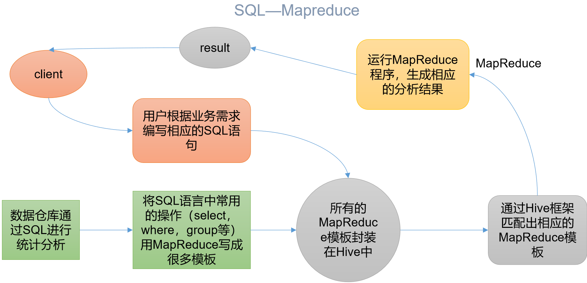
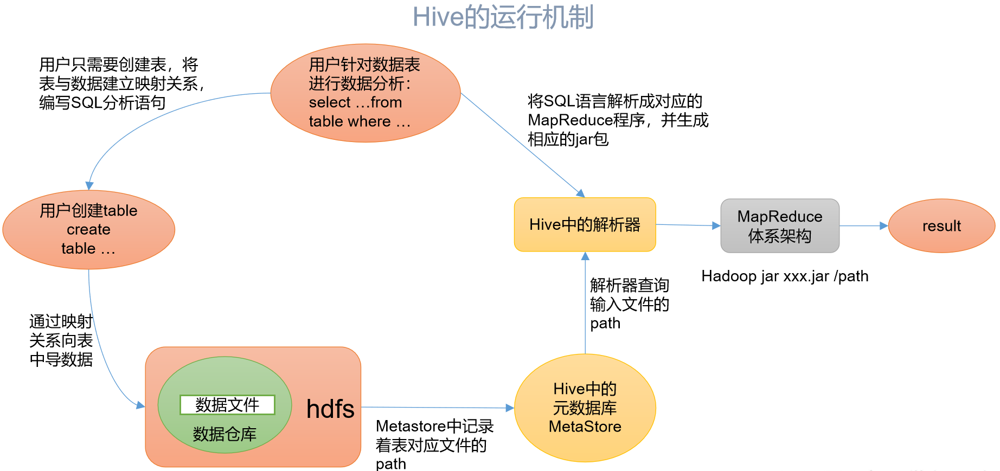

# 概念

- Facebook开源
- 用于解决海量结构化日志的数据统计
- 基于Hadoop的一个**数据仓库工具**
- 将结构化的数据文件==映射==为一张表
- 提供==类SQL查询==功能
- 将HQL转化为MapReduce程序

- Hive处理的数据存储在HDFS
- Hive分析数据底层的实现是MapReduce
- 执行程序运行在Yarn上

# 优点

- 操作接口采用类SQL语法，提供快速开发的能力
  - 简单、容易上手
- 避免了写MapReduce，减少开发人员的学习成本
- Hive支持用户自定义函数
  - 可根据自己的需求来实现自己的函数

# 缺点

- 执行延迟比较高
  - 常用于数据分析，对实时性要求不高的场合
- Hive优势在于处理大数据，对于处理小数据没有优势
  - Hive的执行延迟比较高
- HQL表达能力有限
  - 迭代式算法无法表达
    - 多job串联
  - 数据挖掘方面不擅长
    - 由于MapReduce数据处理流程的限制，效率更高的算法却无法实现
- 效率比较低
  - 自动生成的MapReduce作业，通常情况下不够智能化
  - 调优比较困难，粒度较粗

# 架构原理

 

## 用户接口

> Client

- CLI

  - command-line interface
  - 命令行

- JDBC/ODBC 

  - jdbc访问

- WEBUI

  - 浏览器访问

    

## 元数据

> Metastore

- 元数据包括
  - 表名
  - 表所属的数据库
    - 默认是default
  - 表的拥有者
  - 列/分区字段
  - 表的类型
    - 是否是外部表
  - 表的数据所在目录等
- ==默认存储在derby数据库==
  - 推荐使用**MySQL**存储

## Hadoop

- 使用HDFS进行存储
- 使用MapReduce进行计算

## 驱动器

> Driver

- 解析器
  - SQL Parser
  - 将SQL字符串转换成抽象语法树AST
    - 一般都用第三方工具库完成
    - 如antlr
  - 对AST进行语法分析
    - 表是否存在
    - 字段是否存在
    - SQL语义是否有误
- 编译器
  - Physical Plan
  - 将AST编译生成逻辑执行计划
- 优化器
  - Query Optimizer
  - 对逻辑执行计划进行优化
- 执行器
  - Execution
  - 把逻辑执行计划转换成可以运行的物理计划
    - 对于Hive来说，就是MR/Spark。

# 运行机制

- Hive通过给用户提供的一系列交互接口
- 接收到用户的指令(SQL)
- 使用自己的Driver，结合元数据(MetaStore)，将这些指令翻译成MapReduce，提交到Hadoop中执行
- 最后，将执行返回的结果输出到用户交互接口

# Hive与数据库比较

- Hive 采用了类似SQL 的查询语言 HQL(Hive Query Language)
  - 很容易将 Hive 理解为数据库
  - 从结构上来看，Hive 和数据库除了拥有类似的查询语言，再无类似之处
- 数据库可以用在 Online 的应用中
- 是Hive 是为数据仓库而设计的
  - 清楚这一点，有助于从应用角度理解 Hive 的特性
- Hive用于==离线处理==应用

## 查询语言

- 针对Hive的特性设计了类SQL的查询语言HQL
- 熟悉SQL开发的开发者可以很方便的使用Hive进行开发

## 数据存储位置

- Hive 是建立在 Hadoop 之上
- Hive 的数据都是存储在 HDFS 中
- 数据库将数据保存在块设备或者本地文件系统中

## 数据更新

- Hive是针对数据仓库应用设计
  - 数据仓库的内容是读多写少
  - Hive中==不建议对数据的改写==，所有的数据都是在加载的时候确定好的
- 数据库中的数据通常是需要经常进行修改
  - 使用 INSERT INTO …  VALUES 添加数据
  - 使用 UPDATE … SET修改数据

## 执行

- Hive中大多数查询的执行是通过 Hadoop 提供的 MapReduce 来实现的
- 数据库通常有自己的执行引擎
  - MySQL 的 InnoDB

## 执行延迟

- Hive 在查询数据没有索引
  - 扫描整个表
  - 延迟较高
- Hive基于MapReduce框架
  - 由于MapReduce 本身具有较高的延迟
  - 执行Hive查询时会有较高的延迟
- 数据库的执行延迟较低
  - 即数据规模较小
  - 当数据规模大到超过数据库的处理能力的时候，Hive的并行计算显然能体现出优势

## 可扩展性

- Hive的可扩展性是和Hadoop的可扩展性是一致的
  - 世界上最大的Hadoop 集群在 Yahoo!，2009年的规模在4000 台节点左右
  - 可扩展性高
- 数据库由于 ACID 语义的严格限制
  - 扩展行非常有限
  - 最先进的并行数据库 [Oracle](http://lib.csdn.net/base/oracle) 在理论上的扩展能力也只有100台左右

## 数据规模

- Hive建立在集群上并可以利用MapReduce进行并行计算
  - 支持大规模的数据
- 数据库可以支持的数据规模较小

