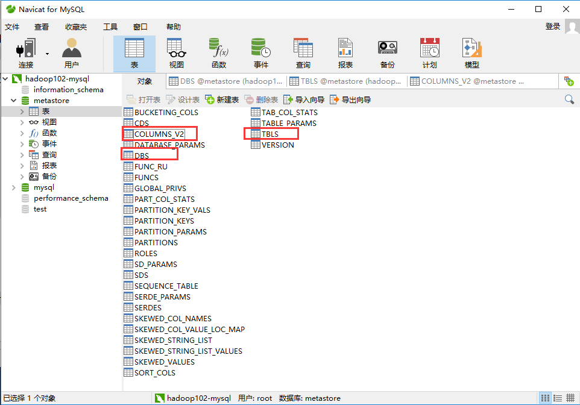

# 地址

- Hive官网地址

http://hive.apache.org/

- 文档查看地址

https://cwiki.apache.org/confluence/display/Hive/GettingStarted

- 下载地址

http://archive.apache.org/dist/hive/

- github地址

https://github.com/apache/hive


# 安装Hive

- 把apache-hive-1.2.1-bin.tar.gz上传到linux的/opt/software目录下解压后改名hive

```bash
[ttshe@hadoop102 software]$ tar -zvxf apache-hive-1.2.1-bin.tar.gz -C /opt/module/
[ttshe@hadoop102 module]$ mv apache-hive-1.2.1-bin/ hive
```

- 修改/opt/module/hive/conf目录下的hive-env.sh.template名称为hive-env.sh

```bash
[ttshe@hadoop102 conf]$ cp hive-env.sh.template hive-env.sh
```


## 配置hive-env.sh文件


### HADOOP_HOME

```bash
export HADOOP_HOME=/opt/module/hadoop-2.7.2
```


### HIVE_CONF_DIR

```bash
export HIVE_CONF_DIR=/opt/module/hive/conf
```


## Hadoop 集群配置

- 启动hdfs和yarn

```bash
[stt@hadoop102 hadoop-2.7.2]$ sbin/start-dfs.sh
[stt@hadoop103 hadoop-2.7.2]$ sbin/start-yarn.sh
```

- 在HDFS上创建/tmp和/user/hive/warehouse两个目录
  - warehouse 是hive的默认表default的仓库
- 修改他们的同组权限可写

```bash
[stt@hadoop102 hadoop-2.7.2]$ bin/hadoop fs -mkdir /tmp
[stt@hadoop102 hadoop-2.7.2]$ bin/hadoop fs -mkdir -p /user/hive/warehouse
[stt@hadoop102 hadoop-2.7.2]$ bin/hadoop fs -chmod g+w /tmp
[stt@hadoop102 hadoop-2.7.2]$ bin/hadoop fs -chmod g+w /user/hive/warehouse
```


# 安装MySQL

- 安装MySQL的原因

  - Hive默认存储MetaStore的数据库是Derby

    - 缺点，不支持并发访问 ，同时只能有一个客户端访问
    - 再打开一个客户端窗口启动hive，会产生java.sql.SQLException异常

```java
Exception in thread "main" java.lang.RuntimeException: java.lang.RuntimeException:
Unable to instantiate
     org.apache.hadoop.hive.ql.metadata.SessionHiveMetaStoreClient
            at org.apache.hadoop.hive.ql.session.SessionState.start(SessionState.java:522)
    at org.apache.hadoop.hive.cli.CliDriver.run(CliDriver.java:677)
    at org.apache.hadoop.hive.cli.CliDriver.main(CliDriver.java:621)
    at sun.reflect.NativeMethodAccessorImpl.invoke0(Native Method)
    at sun.reflect.NativeMethodAccessorImpl.invoke(NativeMethodAccessorImpl.java:57)
    at sun.reflect.DelegatingMethodAccessorImpl.invoke(DelegatingMethodAccessorImpl.java:43)
    at java.lang.reflect.Method.invoke(Method.java:606)
    at org.apache.hadoop.util.RunJar.run(RunJar.java:221)
    at org.apache.hadoop.util.RunJar.main(RunJar.java:136)
    Caused by: java.lang.RuntimeException: Unable to instantiate org.apache.hadoop.hive.ql.metadata.SessionHiveMetaStoreClient
            at org.apache.hadoop.hive.metastore.MetaStoreUtils.newInstance(MetaStoreUtils.java:1523)
        at org.apache.hadoop.hive.metastore.RetryingMetaStoreClient.<init>(RetryingMetaStoreClient.java:86)
        at org.apache.hadoop.hive.metastore.RetryingMetaStoreClient.getProxy(RetryingMetaStoreClient.java:132)
        at org.apache.hadoop.hive.metastore.RetryingMetaStoreClient.getProxy(RetryingMetaStoreClient.java:104)
        at org.apache.hadoop.hive.ql.metadata.Hive.createMetaStoreClient(Hive.java:3005)
        at org.apache.hadoop.hive.ql.metadata.Hive.getMSC(Hive.java:3024)
        at org.apache.hadoop.hive.ql.session.SessionState.start(SessionState.java:503)
        ... 8 more
```

​    

## 准备

- 查看mysql是否安装，如果安装了，卸载mysql
  - 卸载和安装时==注意权限==，需要在root下进行卸载安装

```bash
[ttshe@hadoop102 hive]$ rpm -qa | grep mysql
mysql-libs-5.1.73-7.el6.x86_64
[ttshe@hadoop102 hive]$ sudo rpm -e --nodeps mysql-libs-5.1.73-7.el6.x86_64
```

- 解压mysql-libs.zip文件到目录

```bash
[root@hadoop102 software]# unzip mysql-libs.zip
```


## 安装MySQL服务器

```bash
[ttshe@hadoop102 mysql-libs]$ sudo rpm -ivh MySQL-server-5.6.24-1.el6.x86_64.rpm 

...
A RANDOM PASSWORD HAS BEEN SET FOR THE MySQL root USER !
You will find that password in '/root/.mysql_secret'.

You must change that password on your first connect,
no other statement but 'SET PASSWORD' will be accepted.
See the manual for the semantics of the 'password expired' flag.
...
```

- 安装完成后，生成一个初始密码，通过这个初始密码登录设置用户密码
- 查看生成的随机密码

```bash
[ttshe@hadoop102 mysql-libs]$ sudo cat /root/.mysql_secret
# The random password set for the root user at Fri Aug 30 22:29:53 2019 (local time): XKcGsTTXp7dkQxNT
```

- 查看MySQL状态

```bash
[ttshe@hadoop102 mysql-libs]$ service mysql status
MySQL is not running                                       [失败]
```

- 启动MySQL服务端
  - 注意普通用户必须添加sudo执行启动命令

```bash
[ttshe@hadoop102 opt]$ sudo service mysql start
[sudo] password for ttshe: 
Starting MySQL.                                            [确定]

[ttshe@hadoop102 opt]$ sudo service mysql status
MySQL running (90953)                                      [确定]
```


## 安装MySQL客户端

```bash
[ttshe@hadoop102 mysql-libs]$ sudo rpm -ivh MySQL-client-5.6.24-1.el6.x86_64.rpm
```

- 连接MySQL

```bash
[ttshe@hadoop102 mysql-libs]$ mysql -u root -pXKcGsTTXp7dkQxNT
```

- 设置密码为123456

```bash
mysql> set password = password('123456');
```

- 退出客户端，`quit`


## 配置MySQL访问权限

- 默认只能本机服务器端访问，需要配置访问权限

- 进入MySQL，显示数据库，使用`mysql` 数据库

```bash
[ttshe@hadoop102 mysql-libs]$ mysql -u root -p123456
mysql> show databases;
mysql> use mysql;
mysql> show tables;
```

- 显示`user`表结构

```bash
mysql> desc user;
```

- 查询

```bash
mysql> select User, Host, Password from user;
+------+-----------+-------------------------------------------+
| User | Host      | Password                                  |
+------+-----------+-------------------------------------------+
| root | localhost | *6BB4837EB74329105EE4568DDA7DC67ED2CA2AD9 |
| root | hadoop102 | *B7795C1FA0769BA3C757E577A1C4FE6779A02BCB |
| root | 127.0.0.1 | *B7795C1FA0769BA3C757E577A1C4FE6779A02BCB |
| root | ::1       | *B7795C1FA0769BA3C757E577A1C4FE6779A02BCB |
+------+-----------+-------------------------------------------+
4 rows in set (0.00 sec)
```

- 将第一条记录Host修改为`%` ，任何IP都可以访问
- 删除root用户的其他host

```bash
mysql> update user set Host='%' where Host='localhost';
mysql> delete from user where Host='hadoop102';
mysql> delete from user where Host='127.0.0.1';
mysql> delete from user where Host='::1';
```

- 刷新

```bash
mysql> flush privileges;
```


## MetaStore配置到MySQL

> Hive元数据配置到MySql


### 拷贝驱动

- 在/opt/software/mysql-libs目录下解压mysql-connector-java-5.1.27.tar.gz驱动包

```bash
[ttshe@hadoop102 mysql-libs]$ tar -zvxf mysql-connector-java-5.1.27.tar.gz 
```

- 拷贝/opt/software/mysql-libs/mysql-connector-java-5.1.27目录下的mysql-connector-java-5.1.27-bin.jar到/opt/module/hive/lib/

```bash
[ttshe@hadoop102 mysql-libs]$ cd mysql-connector-java-5.1.27
[ttshe@hadoop102 mysql-connector-java-5.1.27]$ cp mysql-connector-java-5.1.27-bin.jar /opt/module/hive/lib/
```


### hive-site.xml

> 在xml中的配置会替换hive-default.xml中的配置

- 在hive-default.xml.template中可以看到提示信息，对hive-site.xml的说明

```xml
  <!-- WARNING!!! This file is auto generated for documentation purposes ONLY! -->
  <!-- WARNING!!! Any changes you make to this file will be ignored by Hive.   -->
  <!-- WARNING!!! You must make your changes in hive-site.xml instead.         -->
  <!-- Hive Execution Parameters -->
```

- 在/opt/module/hive/conf下创建hive-site.xml 

  - 根据官方文档配置参数，拷贝数据到hive-site.xml文件中

  https://cwiki.apache.org/confluence/display/Hive/AdminManual+MetastoreAdmin

```xml
<?xml version="1.0"?>
<?xml-stylesheet type="text/xsl" href="configuration.xsl"?>
<configuration>
	<property>
	  <name>javax.jdo.option.ConnectionURL</name>
	  <value>jdbc:mysql://hadoop102:3306/metastore?createDatabaseIfNotExist=true</value>
	  <description>JDBC connect string for a JDBC metastore</description>
	</property>

	<property>
	  <name>javax.jdo.option.ConnectionDriverName</name>
	  <value>com.mysql.jdbc.Driver</value>
	  <description>Driver class name for a JDBC metastore</description>
	</property>

	<property>
	  <name>javax.jdo.option.ConnectionUserName</name>
	  <value>root</value>
	  <description>username to use against metastore database</description>
	</property>

	<property>
	  <name>javax.jdo.option.ConnectionPassword</name>
	  <value>123456</value>
	  <description>password to use against metastore database</description>
	</property>
</configuration>
```

- 配置完毕后，如果启动hive异常，可以重新启动虚拟机。（重启后，别忘了启动hadoop集群）
  - 启动
  - 此时可以有多个客户端访问hive

```bash
[ttshe@hadoop102 hive]$ bin/hive
```

- 观察数据库
  - 此时在MySQL中创建了metastore数据库
  - 存储元数据信息的有DBS，TBLS，COLUMNS_V2



