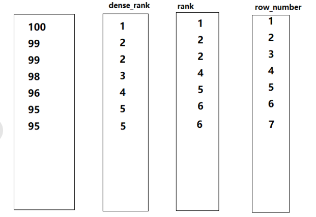

> # hive 的内置函数

# 查看内置函数

```sql
hive> show functions;
```


# 查看函数用法

```sql
desc function nvl;

nvl(value,default_value) - Returns default value if value is null else returns value
```

- 查看详细用法

```sql
desc function extended nvl;

| nvl(value,default_value) - Returns default value if value is null else returns value  |
| Example:                                                                              |
|   > SELECT nvl(null,'bla') FROM src LIMIT 1;                                          |
|   bla       
```


# 空字段赋值 [NVL]

- NVL
  - 给值为NULL的数据赋值
  - 格式
    - NVL( value，default_value)
  - 功能
    - 如果value 为NULL，则NVL函数返回default_value的值
    - 如果value 不为 NULL，则返回value的值
    - 如果两个参数都为NULL ，则返回NULL

示例

- 如果员工的comm为NULL，则用-1代替

```sql
select ename, comm, nvl(comm,-1) from emp;

ename	comm	_c2
SMITH	NULL	-1.0
ALLEN	300.0	300.0
WARD	500.0	500.0
JONES	NULL	-1.0
MARTIN	1400.0	1400.0
BLAKE	NULL	-1.0
CLARK	NULL	-1.0
SCOTT	NULL	-1.0
KING	NULL	-1.0
...
```

- 如果员工的comm为NULL，则用领导id代替

```sql
select comm, nvl(comm,mgr) from emp;
```


# 流程控制 [CASE WHEN]

```sql
desc function extended  case;

CASE a WHEN b THEN c [WHEN d THEN e]* [ELSE f] END - When a = b, returns c; when a = d, return e; else return f  

|  SELECT                                                                                 
|  CASE deptno                                                                           
|    WHEN 1 THEN Engineering                                                             
|    WHEN 2 THEN Finance
|    ELSE admin                                                                           
|  END,                                                                                   
|  CASE zone                                                                             
|    WHEN 7 THEN Americas                                                                 
|    ELSE Asia-Pac                                                                       
|  END                                                                                   
|  FROM emp_details                                                                       
```

示例

- 创建数据

```text
悟空	A	男
大海	A	男
宋宋	B	男
凤姐	A	女
婷姐	B	女
婷婷	B	女
```

- 创建表，导入数据

```sql
create table emp_sex(name string, dept_id string, sex string) 
row format delimited fields terminated by "\t";
load data local inpath '/opt/module/datas/emp_sex.txt' into table emp_sex;
```

- 求出不同部门男女各多少人

```sql
select 
  dept_id,
  sum(case sex when '男' then 1 else 0 end) male_count,
  sum(case sex when '女' then 1 else 0 end) female_count
from 
  emp_sex
group by
  dept_id;
```

- 写法2
  - when 中必须是boolean类型

```sql
select 
  dept_id,
  sum(case when sex='男' then 1 else 0 end) male_count,
  sum(case when sex='女' then 1 else 0 end) female_count
from 
  emp_sex
group by
  dept_id;
```


# 行转列 [concat|concat_ws|concat_set]

> 将多行转成一列


## CONCAT

- 连接输入多个字符串
- 支持任意个输入字符串
- 语法

```sql
CONCAT(string A/col, string B/col…)
```

- 示例

```sql
select concat('hello','hive');

hellohive
```


## CONCAT_WS

- 语法

```sql
CONCAT_WS(separator, str1, str2,...)
```

- 特殊形式的 CONCAT
- 使用`desc function extended concat_ws` 查看详细使用
- 第一个参数是字符串连接符
  - 如果连接符是 NULL，返回值也将为 NULL
- 连接时，如果被连接字符串有 NULL 或 空字符串，连接符将被加到被连接的字符串之间
- 示例

```sql
select concat_ws('.','www',array('baidu','com'));

www.baidu.com
```


## COLLECT_SET

- 对某个字段查询的结果去重后汇总，生成一个array类型字段
- 语法
  - col 表示查询的字段

```sql
COLLECT_SET(col)
```


### 示例

- 数据准备，创建 c.txt

```sql
孙悟空	白羊座	A
大海	射手座	A
宋宋	白羊座	B
猪八戒	白羊座	A
凤姐	射手座	A
```

- 创建表，导入数据

```sql
create table person_info(
name string, 
constellation string, 
blood_type string) 
row format delimited fields terminated by "\t";

load data local inpath "/opt/module/datas/c.txt" into table person_info;
```

- 需求：把星座和血型一样的人归类到一起，结果如下

```text
射手座,A            大海|凤姐
白羊座,A            孙悟空|猪八戒
白羊座,B            宋宋
```

- 实现
  - 先实现子查询

```sql
select cb, concat_ws('|',collect_set(name)) from (
    select concat(constellation,',',blood_type) cb,name from person_info
) t 
group by cb;
```


# 列转行[explode|lateral]

> 将一列转换成多行数据


## EXPLODE（爆炸函数，一列转多行）

- 翻译：爆炸; 爆破
- UDTF 函数，一进多出
- 将hive一列中复杂的array或者map结构拆分成多行
- 语法

```sql
EXPLODE(col)
```

- 示例

```sql
select explode(array(1,2,3));

col
1
2
3
```

```sql
hive (select_test)> select explode(map(1,2,3,4));

key	value
1	2
3	4
```

- 注意

```sql
hive (select_test)> select 1,explode(array(1,2,3));
FAILED: SemanticException [Error 10081]: UDTF's are not supported outside the SELECT clause, nor nested in expressions
```


## LATERAL（侧切函数）

- 翻译：侧面的; 横向的
- 语法
  - 必须要起表别名 `tableAlias`

```sql
LATERAL VIEW udtf_function(expression) tableAlias AS columnAlias
```

- 用于和split, explode等UDTF一起使用，将一列数据拆成多行数据，在此基础上对拆分后的数据进行聚合

示例

- 数据准备，m.txt

```text
《疑犯追踪》	悬疑,动作,科幻,剧情
《Lie to me》	悬疑,警匪,动作,心理,剧情
《战狼2》	战争,动作,灾难
```

- 创建表，导入数据

```sql
create table movie_info(
    movie string, 
    category array<string>) 
row format delimited fields terminated by "\t"
collection items terminated by ",";

load data local inpath "/opt/module/datas/m.txt" into table movie_info;
```

- 查询

```sql
hive (select_test)> select * from movie_info;

movie_info.movie	movie_info.category
《疑犯追踪》	["悬疑","动作","科幻","剧情"]
《Lie to me》	["悬疑","警匪","动作","心理","剧情"]
《战狼2》	["战争","动作","灾难"]
```

- 需求：将电影分类中的数组数据展开，结果如下

```text
《疑犯追踪》      悬疑
《疑犯追踪》      动作
《疑犯追踪》      科幻
《疑犯追踪》      剧情
《Lie to me》   悬疑
《Lie to me》   警匪
《Lie to me》   动作
《Lie to me》   心理
《Lie to me》   剧情
《战狼2》        战争
《战狼2》        动作
《战狼2》        灾难
```

- 实现
  - 使用侧视图 生成临时表的字段

```sql
select movie,category_info
from movie_info
lateral view explode(category) tmp_lv as category_info;
```


# 开窗函数（重点）


- 什么时候使用
  - 开窗函数常结合聚合函数使用
  - 要显示聚集前的数据和聚集后的数据
    - 一般来讲聚合后的行数要少于聚合前的行数
    - 此时使用开窗函数
- 语法

```sql
UDAF() over (PARTITION By col1，col2 order by col3 窗口子句（rows between .. and ..）) AS 列别名
```


## 相关函数


### OVER

- over()

- 和聚合函数使用

- 指定分析函数工作的数据窗口大小，这个数据窗口大小可能会随着行的变而变化。

- 定义聚合函数的范围

  - select 的每一行都对==聚合函数的结果==执行一次窗口聚合操作

- partition by .. order by 可替换为distribute by .. sort by ..

- **参数顺序**

  - PARTITION BY > ORDER BY > ROWS BETWEEN ... AND

  

#### PARTITION BY

- 在over中使用，对窗口操作中进行分区，类似于GROUP BY
- 将聚合按照要求进行分区
- ==后面可跟多个字段==


#### ORDER BY

- 对分区中的数据进行排序
- 确定聚合哪些行
  - ==默认从起点到当前行的聚合==
  - `order by xx` 等价于 `order by xx between UNBOUNDED PRECEDING and current row `
- ==后面只跟一个字段==


#### ROWS BETWEEN ... AND...

- 聚合范围调整级别，以行为单位动态调整

- 使用固定的行数来限制分区中的数据行数量

  

##### CURRENT ROW

- 当前行

##### UNBOUNDED

- 起点

##### PRECEDING

- n PRECEDING
  - 往前n行数据
- UNBOUNDED PRECEDING
  - 从前面的起点

##### FOLLOWING

- n FOLLOWING
  - 往后n行数据
- UNBOUNDED FOLLOWING
  - 到后面的终点


## 聚合函数


### LAG

- LAG(col,n,default_val)
  - 往col列的前第n行数据
  - default_val 类似于NVL中的default，用于为Null时替换


### LEAD

- LEAD(col,n, default_val)
  - 往col列后第n行数据


### NTILE

- NTILE(n)
  - **将数据按照n进行等分处理**
  - 把有序分区中的行分发到指定数据的组中
    - 各个组有编号，编号从1开始
  - 对于每一行，NTILE 返回此行所属的组的编号
  - ==n必须为int类型==
- 一般用于求比例范围的值


## 示例

- 数据准备，b.txt
  - name，orderdate，cost

```text
jack,2017-01-01,10
tony,2017-01-02,15
jack,2017-02-03,23
tony,2017-01-04,29
jack,2017-01-05,46
jack,2017-04-06,42
tony,2017-01-07,50
jack,2017-01-08,55
mart,2017-04-08,62
mart,2017-04-09,68
neil,2017-05-10,12
mart,2017-04-11,75
neil,2017-06-12,80
mart,2017-04-13,94
```

- 创建表，导入数据

```sql
create table business(
name string, 
orderdate string,
cost int
) ROW FORMAT DELIMITED FIELDS TERMINATED BY ',';

load data local inpath "/opt/module/datas/b.txt" into table business;
```


### 案例1

- 查询在2017年4月份购买过的顾客及总人数
  - 4月有2个人购买

```sql
select name,count(1) over()
from business 
where orderdate like '2017-04%'
group by name;

name	count_window_0
mart	2
jack	2
```


分析

- 如果没有窗口函数
  - 会统计出4月份每个人购买次数

```sql
select name,count(1) from business where orderdate like '2017-04%' group by name;

name	_c1
jack	1
mart	4
```

- 使用了窗口函数
  - 使用over等价于在count的结果上再次调用了count
    - select 语句内的循环执行操作时，每次都调用

```sql
select count(1) from (
    select name from business where orderdate like '2017-04%' group by name
) t;

2
```


### 案例2

- 查询顾客的购买明细及月购买总额
  - 在开窗函数操作使用分区操作

```sql
select name, orderdate, cost, sum(cost) over(partition by month(orderdate))
from business;

name	orderdate	cost	sum_window_0
jack	2017-01-01	10	205
jack	2017-01-08	55	205
tony	2017-01-07	50	205
jack	2017-01-05	46	205
tony	2017-01-04	29	205
tony	2017-01-02	15	205
jack	2017-02-03	23	23
mart	2017-04-13	94	341
jack	2017-04-06	42	341
mart	2017-04-11	75	341
mart	2017-04-09	68	341
mart	2017-04-08	62	341
neil	2017-05-10	12	12
neil	2017-06-12	80	80
```

分析

- 关于month
  - 指定格式`yyyy-MM-dd` 返回月份数值
  - 如果格式错误，返回NULL

```sql
hive (select_test)> select month('2019-07-08');

7

select month('2019-07');

NULL
```

- 拆分sum操作
  - 每次sum操作等价于如下操作
  - 分区操作等价于判断当前月

```sql
select sum(cost)
from business
where month(orderdate) = 4;
```


### 案例3

- 将每个顾客的cost按照日期进行累加输出

```sql
select name, orderdate, cost, sum(cost) over(partition by name order by orderdate)
from business;

+-------+-------------+-------+---------------+--+
| name  |  orderdate  | cost  | sum_window_0  |
+-------+-------------+-------+---------------+--+
| jack  | 2017-01-01  | 10    | 10            |
| jack  | 2017-01-05  | 46    | 56            |
| jack  | 2017-01-08  | 55    | 111           |
| jack  | 2017-02-03  | 23    | 134           |
| jack  | 2017-04-06  | 42    | 176           |
| mart  | 2017-04-08  | 62    | 62            |
| mart  | 2017-04-09  | 68    | 130           |
| mart  | 2017-04-11  | 75    | 205           |
| mart  | 2017-04-13  | 94    | 299           |
| neil  | 2017-05-10  | 12    | 12            |
| neil  | 2017-06-12  | 80    | 92            |
| tony  | 2017-01-02  | 15    | 15            |
| tony  | 2017-01-04  | 29    | 44            |
| tony  | 2017-01-07  | 50    | 94            |
+-------+-------------+-------+---------------+--+
```

分析

- 拆分sum等价于
  - partition by 用于过滤当前值的条件，如当前select执行到了'jack'
  - order by 用于比较当前值，如当前的是日期是'2017-04-06'，那么最终求小于当前日期的sum

```sql
select sum(cost)
from business
where name = 'jack' and orderdate <= '2017-04-06';
```


### 案例4

- 将每个顾客的cost按照日期进行前2次消费的累加输出

```sql
select name, orderdate, cost, 
sum(cost) over(partition by name order by orderdate rows between 2 preceding and current row)
from business;

+-------+-------------+-------+---------------+
| name  |  orderdate  | cost  | sum_window_0  |
+-------+-------------+-------+---------------+
| jack  | 2017-01-01  | 10    | 10            |
| jack  | 2017-01-05  | 46    | 56            |
| jack  | 2017-01-08  | 55    | 111           |
| jack  | 2017-02-03  | 23    | 124           |
| jack  | 2017-04-06  | 42    | 120           |
| mart  | 2017-04-08  | 62    | 62            |
| mart  | 2017-04-09  | 68    | 130           |
| mart  | 2017-04-11  | 75    | 205           |
| mart  | 2017-04-13  | 94    | 237           |
| neil  | 2017-05-10  | 12    | 12            |
| neil  | 2017-06-12  | 80    | 92            |
| tony  | 2017-01-02  | 15    | 15            |
| tony  | 2017-01-04  | 29    | 44            |
| tony  | 2017-01-07  | 50    | 94            |
+-------+-------------+-------+---------------+
```

分析

- 拆分sum等价于

```sql
select sum(cost)
from business
where name = 'jack' and orderdate <= '2017-04-06' and rows <= 当前行 and rows >= 当前行-2 ;
```

- 扩展

```sql
select name,orderdate,cost, 
sum(cost) over() as sample1,--所有行相加 
sum(cost) over(partition by name) as sample2,--按name分组，组内数据相加 
sum(cost) over(partition by name order by orderdate) as sample3,--按name分组，组内数据累加 
sum(cost) over(partition by name order by orderdate rows between UNBOUNDED PRECEDING and current row ) as sample4 ,--和sample3一样,由起点到当前行的聚合 
sum(cost) over(partition by name order by orderdate rows between 1 PRECEDING and current row) as sample5, --当前行和前面一行做聚合 
sum(cost) over(partition by name order by orderdate rows between 1 PRECEDING AND 1 FOLLOWING ) as sample6,--当前行和前边一行及后面一行 
sum(cost) over(partition by name order by orderdate rows between current row and UNBOUNDED FOLLOWING ) as sample7 --当前行及后面所有行 
from business;
```


### 案例5

- 查看每个顾客上次的购买时间
  - lag获取前第n行某列的数值，如果数值不存在则返回设置默认值

```sql
select name,orderdate,cost, lag(orderdate,1,'No Record') over(partition by name order by orderdate)
from business;

+-------+-------------+-------+---------------+
| name  |  orderdate  | cost  | lag_window_0  |
+-------+-------------+-------+---------------+
| jack  | 2017-01-01  | 10    | No Record     |
| jack  | 2017-01-05  | 46    | 2017-01-01    |
| jack  | 2017-01-08  | 55    | 2017-01-05    |
| jack  | 2017-02-03  | 23    | 2017-01-08    |
| jack  | 2017-04-06  | 42    | 2017-02-03    |
| mart  | 2017-04-08  | 62    | No Record     |
| mart  | 2017-04-09  | 68    | 2017-04-08    |
| mart  | 2017-04-11  | 75    | 2017-04-09    |
| mart  | 2017-04-13  | 94    | 2017-04-11    |
| neil  | 2017-05-10  | 12    | No Record     |
| neil  | 2017-06-12  | 80    | 2017-05-10    |
| tony  | 2017-01-02  | 15    | No Record     |
| tony  | 2017-01-04  | 29    | 2017-01-02    |
| tony  | 2017-01-07  | 50    | 2017-01-04    |
+-------+-------------+-------+---------------+
```


### 案例6

- 查询前20%时间的订单信息
  - 使用ntile将数据等分

```sql
select name,orderdate,cost
from(
	select name,orderdate,cost,ntile(5) over(order by orderdate) num
    from business
) t
where num = 1;
```


# 排名 [dense_rank|rank|row_number]



- 聚合函数


## RANK

- 排序相同时会重复
- 最后一个数 <=ROW_NUMBER的最后一个数
- 累加计数


## DENSE_RANK

- 排序相同时会重复
- 最后一个数 <=ROW_NUMBER的最后一个数
- 自然计数


## ROW_NUMBER

- 根据顺序计算


## 示例

- 数据准备：姓名，科目，分数

```text
孙悟空	语文	87
孙悟空	数学	95
孙悟空	英语	68
大海	语文	94
大海	数学	56
大海	英语	84
宋宋	语文	64
宋宋	数学	86
宋宋	英语	84
婷婷	语文	65
婷婷	数学	85
婷婷	英语	78
```

- 创建表并导入数据

```sql
create table score(
    name string,
    subject string, 
    score int
)
row format delimited fields terminated by "\t";
load data local inpath '/opt/module/datas/score.txt' into table score;
```

- 计算每门学科成绩排名
  - 需要使用开窗函数

```sql
select 
    name,
    subject,
    score,
    rank() over(partition by subject order by score desc) r,
    dense_rank() over(partition by subject order by score desc) dr,
    row_number() over(partition by subject order by score desc) rn
from score;
```

- 结果

```text
name	subject	score	r	dr	rn
孙悟空	数学	95	1	1	1
宋宋	数学	86	2	2	2
婷婷	数学	85	3	3	3
大海	数学	56	4	4	4
宋宋	英语	84	1	1	1
大海	英语	84	1	1	2
婷婷	英语	78	3	2	3
孙悟空	英语	68	4	3	4
大海	语文	94	1	1	1
孙悟空	语文	87	2	2	2
婷婷	语文	65	3	3	3
宋宋	语文	64	4	4	4
```

- 计算每门学科前三名的学生
  - 使用嵌套子查询实现

```sql
select name,subject,score,r
from ( 
    select 
    name,
    subject,
    score,
    rank() over(partition by subject order by score desc) r
    from score
) t1
where t1.r < 4;
```


# 列转集合 [collect_set]

- 创建原数据表

```sql
hive (gmall)>
drop table if exists stud;
create table stud (name string, area string, course string, score int);
```

- 向原数据表中插入数据

```sql
hive (gmall)>
insert into table stud values('zhang3','bj','math',88);
insert into table stud values('li4','bj','math',99);
insert into table stud values('wang5','sh','chinese',92);
insert into table stud values('zhao6','sh','chinese',54);
insert into table stud values('tian7','bj','chinese',91);
```

- 查询表中数据

```sql
hive (gmall)> select * from stud;
stud.name       stud.area       stud.course     stud.score
zhang3  bj      math    88
li4     bj      math    99
wang5   sh      chinese 92
zhao6   sh      chinese 54
tian7   bj      chinese 91
```

- 把同一分组的不同行的数据聚合成一个集合

```sql
hive (gmall)> select course, collect_set(area), avg(score) from stud group by course;
chinese ["sh","bj"]     79.0
math    ["bj"]  93.5
```

- 用下标可以取某一个

```sql
hive (gmall)> select course, collect_set(area)[0], avg(score) from stud group by course;
chinese sh      79.0
math    bj      93.5
```


# 日期处理函数


### date_format

- date_format函数（根据格式整理日期）

```sql
hive (gmall)> select date_format('2019-02-10','yyyy-MM');
2019-02
```


### date_add

- date_add函数（加减日期）

```sql
hive (gmall)> select date_add('2019-02-10',-1);
2019-02-09
hive (gmall)> select date_add('2019-02-10',1);
2019-02-11
```


### next_day

- 取当前天的下一个周一
- 说明：星期一到星期日的英文（Monday，Tuesday、Wednesday、Thursday、Friday、Saturday、Sunday）
- 大小写忽略

```sql
hive (gmall)> select next_day('2019-02-12','MO');
2019-02-18
```

- 取当前周的周一

```sql
hive (gmall)> select date_add(next_day('2019-02-12','MO'),-7);
2019-02-11
```


### last_day

- last_day函数（求当月最后一天日期）

```sql
hive (gmall)> select last_day('2019-02-10');
2019-02-28
```


