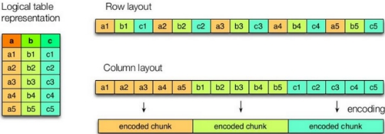
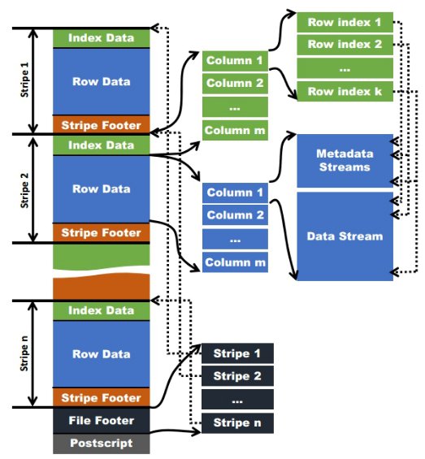
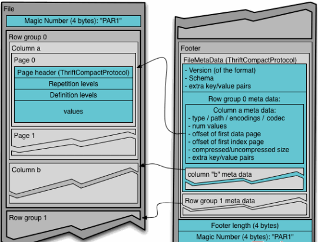

# Snappy压缩


## 查看Hadoop原生支持压缩方式

```bash
[ttshe@hadoop102 datas]$ hadoop
Usage: hadoop [--config confdir] [COMMAND | CLASSNAME]
  CLASSNAME            run the class named CLASSNAME
 or
  where COMMAND is one of:
  fs                   run a generic filesystem user client
  version              print the version
  jar <jar>            run a jar file
                       note: please use "yarn jar" to launch
                             YARN applications, not this command.
  checknative [-a|-h]  check native hadoop and compression libraries availability
  distcp <srcurl> <desturl> copy file or directories recursively
  archive -archiveName NAME -p <parent path> <src>* <dest> create a hadoop archive
  classpath            prints the class path needed to get the
  credential           interact with credential providers
                       Hadoop jar and the required libraries
  daemonlog            get/set the log level for each daemon
  trace                view and modify Hadoop tracing settings
```

- `checknative`
  - check native hadoop and compression libraries availability

```bash
[ttshe@hadoop102 datas]$ hadoop checknative
Native library checking:
hadoop:  false 
zlib:    false 
snappy:  false 
lz4:     false 
bzip2:   false 
openssl: false 
```


## 编译Hadoop源码支持Snappy压缩


### 资源准备

- CentOS联网 
  - 配置CentOS能连接外网。Linux虚拟机ping [www.baidu.com](http://www.baidu.com) 是畅通的
  - 注意：==采用root角色编译==，减少文件夹权限出现问题

- jar包准备(hadoop源码、JDK8 、maven、protobuf)
  - hadoop-2.7.2-src.tar.gz
  - jdk-8u144-linux-x64.tar.gz
  - snappy-1.1.3.tar.gz
  - apache-maven-3.0.5-bin.tar.gz
  - protobuf-2.5.0.tar.gz


### jar包安装

- 注意：==所有操作必须在root用户下完成==

- JDK解压、配置环境变量JAVA_HOME和PATH
  - 如下都需要验证是否配置成功
  - 验证命令：java -version

```bash
[root@hadoop101 software] # tar -zxf jdk-8u144-linux-x64.tar.gz -C /opt/module/
[root@hadoop101 software]# vi /etc/profile
#JAVA_HOME
export JAVA_HOME=/opt/module/jdk1.8.0_144
export PATH=$PATH:$JAVA_HOME/bin
[root@hadoop101 software]#source /etc/profile
```

- Maven解压、配置  MAVEN_HOME和PATH
  - 验证命令：mvn -version

```bash
[root@hadoop101 software]# tar -zxvf apache-maven-3.0.5-bin.tar.gz -C /opt/module/
[root@hadoop101 apache-maven-3.0.5]# vi /etc/profile
#MAVEN_HOME
export MAVEN_HOME=/opt/module/apache-maven-3.0.5
export PATH=$PATH:$MAVEN_HOME/bin
[root@hadoop101 software]#source /etc/profile
```


### 编译源码

- 准备编译环境

```bash
[root@hadoop101 software]# yum install svn
[root@hadoop101 software]# yum install autoconf automake libtool cmake
[root@hadoop101 software]# yum install ncurses-devel
[root@hadoop101 software]# yum install openssl-devel
[root@hadoop101 software]# yum install gcc*
```

- 编译安装snappy

```bash
[root@hadoop101 software]# tar -zxvf snappy-1.1.3.tar.gz -C /opt/module/
[root@hadoop101 module]# cd snappy-1.1.3/
[root@hadoop101 snappy-1.1.3]# ./configure
[root@hadoop101 snappy-1.1.3]# make
[root@hadoop101 snappy-1.1.3]# make install
# 查看snappy库文件
[root@hadoop101 snappy-1.1.3]# ls -lh /usr/local/lib |grep snappy
```

- 编译安装protobuf

```bash
[root@hadoop101 software]# tar -zxvf protobuf-2.5.0.tar.gz -C /opt/module/
[root@hadoop101 module]# cd protobuf-2.5.0/
[root@hadoop101 protobuf-2.5.0]# ./configure 
[root@hadoop101 protobuf-2.5.0]#  make 
[root@hadoop101 protobuf-2.5.0]#  make install
# 查看protobuf版本以测试是否安装成功
[root@hadoop101 protobuf-2.5.0]# protoc --version
```

- 编译hadoop native

```bash
[root@hadoop101 software]# tar -zxvf hadoop-2.7.2-src.tar.gz
[root@hadoop101 software]# cd hadoop-2.7.2-src/
[root@hadoop101 software]# mvn clean package -DskipTests -Pdist,native -Dtar -Dsnappy.lib=/usr/local/lib -Dbundle.snappy
```

- 执行成功后/opt/software/hadoop-2.7.2-src/hadoop-dist/target/[hadoop](http://lib.csdn.net/base/hadoop)-2.7.2.tar.gz即为新生成的支持snappy压缩的二进制安装包


## 替换Hadoop的lib/native支持Snappy压缩（常用）

- 查看Hadoop的lib/native文件

```bash
[ttshe@hadoop102 native]$ ll
总用量 5992
-rw-r--r--. 1 ttshe ttshe 1382764 4月  20 18:59 libhadoop.a
-rw-r--r--. 1 ttshe ttshe 1632184 4月  20 18:59 libhadooppipes.a
-rwxr-xr-x. 1 ttshe ttshe  807878 4月  20 18:59 libhadoop.so
-rwxr-xr-x. 1 ttshe ttshe  807878 4月  20 18:59 libhadoop.so.1.0.0
-rw-r--r--. 1 ttshe ttshe  476682 4月  20 18:59 libhadooputils.a
-rw-r--r--. 1 ttshe ttshe  447412 4月  20 18:59 libhdfs.a
-rwxr-xr-x. 1 ttshe ttshe  282396 4月  20 18:59 libhdfs.so
-rwxr-xr-x. 1 ttshe ttshe  282396 4月  20 18:59 libhdfs.so.0.0.0
```


### 关闭Hadoop

```bash
# 先关闭hive连接
[ttshe@hadoop102 hadoop-2.7.2]$ stop-dfs.sh
[ttshe@hadoop103 opt]$ stop-yarn.sh
```


### 替换native

- 找到文件上传到linux解压，替换native部分
  - F:\大数据-尚硅谷\归档\02.hive\resources\01_jar\支持snappy压缩的hadoop\hadoop-2.7.2.tar

- 解压

```bash
[ttshe@hadoop102 snappy]$ tar -zvxf hadoop-2.7.2.tar.gz 
```

- 查看native

```bash
[ttshe@hadoop102 native]$ ll
总用量 5188
-rw-r--r--. 1 ttshe ttshe 1210260 9月   1 2017 libhadoop.a
-rw-r--r--. 1 ttshe ttshe 1487268 9月   1 2017 libhadooppipes.a
lrwxrwxrwx. 1 ttshe ttshe      18 9月   3 17:21 libhadoop.so -> libhadoop.so.1.0.0
-rwxr-xr-x. 1 ttshe ttshe  716316 9月   1 2017 libhadoop.so.1.0.0
-rw-r--r--. 1 ttshe ttshe  582048 9月   1 2017 libhadooputils.a
-rw-r--r--. 1 ttshe ttshe  364860 9月   1 2017 libhdfs.a
lrwxrwxrwx. 1 ttshe ttshe      16 9月   3 17:21 libhdfs.so -> libhdfs.so.0.0.0
-rwxr-xr-x. 1 ttshe ttshe  229113 9月   1 2017 libhdfs.so.0.0.0
-rw-r--r--. 1 ttshe ttshe  472950 9月   1 2017 libsnappy.a
-rwxr-xr-x. 1 ttshe ttshe     955 9月   1 2017 libsnappy.la
lrwxrwxrwx. 1 ttshe ttshe      18 9月   3 17:21 libsnappy.so -> libsnappy.so.1.3.0
lrwxrwxrwx. 1 ttshe ttshe      18 9月   3 17:21 libsnappy.so.1 -> libsnappy.so.1.3.0
-rwxr-xr-x. 1 ttshe ttshe  228177 9月   1 2017 libsnappy.so.1.3.0
[ttshe@hadoop102 native]$ pwd
/opt/software/snappy/hadoop-2.7.2/lib/native
```

- 替换native

```bash
[ttshe@hadoop102 lib]$ pwd
/opt/software/snappy/hadoop-2.7.2/lib
[ttshe@hadoop102 lib]$ cp -r native/ /opt/module/hadoop-2.7.2/lib
```

- 查看压缩方式

```bash
[ttshe@hadoop102 native]$ hadoop checknative
19/09/03 17:26:03 WARN bzip2.Bzip2Factory: Failed to load/initialize native-bzip2 library system-native, will use pure-Java version
19/09/03 17:26:03 INFO zlib.ZlibFactory: Successfully loaded & initialized native-zlib library
Native library checking:
hadoop:  true /opt/module/hadoop-2.7.2/lib/native/libhadoop.so.1.0.0
zlib:    true /lib64/libz.so.1
snappy:  true /opt/module/hadoop-2.7.2/lib/native/libsnappy.so.1
lz4:     true revision:99
bzip2:   false 
openssl: false Cannot load libcrypto.so (libcrypto.so: 无法打开共享对象文件: 没有那个文件或目录)!
```

- 同步到其他节点

```bash
[ttshe@hadoop102 lib]$ xsync native/
```


### 重启Hadoop

```bash
[ttshe@hadoop102 native]$ start-dfs.sh
[ttshe@hadoop103 opt]$ start-yarn.sh
```


## 压缩配置


### 压缩编码

| 压缩格式 | 工具  | 算法    | 文件扩展名 | 是否可切分 |
| -------- | ----- | ------- | ---------- | ---------- |
| DEFLATE  | 无    | DEFLATE | .deflate   | 否         |
| Gzip     | gzip  | DEFLATE | .gz        | 否         |
| bzip2    | bzip2 | bzip2   | .bz2       | 是         |
| LZO      | lzop  | LZO     | .lzo       | 是         |
| Snappy   | 无    | Snappy  | .snappy    | 否         |

- 为了支持多种压缩/解压缩算法，Hadoop引入了编码/解码器，如下表所示

| 压缩格式 | 对应的编码/解码器                          |
| -------- | ------------------------------------------ |
| DEFLATE  | org.apache.hadoop.io.compress.DefaultCodec |
| gzip     | org.apache.hadoop.io.compress.GzipCodec    |
| bzip2    | org.apache.hadoop.io.compress.BZip2Codec   |
| LZO      | com.hadoop.compression.lzo.LzopCodec       |
| Snappy   | org.apache.hadoop.io.compress.SnappyCodec  |

- 压缩性能的比较
  - bzip是由java编写的，因此压缩和解压速度慢

| 压缩算法 | 原始文件大小 | 压缩文件大小 | 压缩速度 | 解压速度 |
| -------- | ------------ | ------------ | -------- | -------- |
| gzip     | 8.3GB        | 1.8GB        | 17.5MB/s | 58MB/s   |
| bzip2    | 8.3GB        | 1.1GB        | 2.4MB/s  | 9.5MB/s  |
| LZO      | 8.3GB        | 2.9GB        | 49.3MB/s | 74.6MB/s |
|          |              |              | 250MB/s  | 500MB/s  |

http://google.github.io/snappy/


### 参数配置

- 要在Hadoop中启用压缩，可以配置如下参数（mapred-site.xml文件中）

| 参数| 默认值                                                       | 阶段        | 建议                                         |
| ------------------------------------------------- | ------------------------------------------------------------ | ----------- | -------------------------------------------- |
| io.compression.codecs（在core-site.xml中配置） | org.apache.hadoop.io.compress.DefaultCodec, org.apache.hadoop.io.compress.GzipCodec, org.apache.hadoop.io.compress.BZip2Codec,org.apache.hadoop.io.compress.Lz4Codec | 输入压缩    | Hadoop使用文件扩展名判断是否支持某种编解码器 |
| mapreduce.map.output.compress                     | false                                                        | mapper输出  | 这个参数设为true启用压缩                     |
| mapreduce.map.output.compress.codec               | org.apache.hadoop.io.compress.DefaultCodec                   | mapper输出  | 使用LZO、LZ4或snappy编解码器在此阶段压缩数据 |
| mapreduce.output.fileoutputformat.compress        | false                                                        | reducer输出 | 这个参数设为true启用压缩                     |
| mapreduce.output.fileoutputformat.compress.codec  | org.apache.hadoop.io.compress. DefaultCodec                  | reducer输出 | 使用标准工具或者编解码器，如gzip和bzip2      |
| mapreduce.output.fileoutputformat.compress.type   | RECORD                                                       | reducer输出 | SequenceFile输出使用的压缩类型：NONE和BLOCK  |


## 开启Map输出阶段压缩

- 开启map输出阶段压缩可以减少job中map和Reduce task间数据传输量

- 开启hive中间传输数据压缩功能

```sql
hive (default)> set hive.exec.compress.intermediate=true;
```

- 开启mapreduce中map输出压缩功能

```sql
hive (default)>set mapreduce.map.output.compress=true;
```

- 设置mapreduce中map输出数据的压缩方式

```sql
hive (default)> set mapreduce.map.output.compress.codec;
mapreduce.map.output.compress.codec=org.apache.hadoop.io.compress.DefaultCodec
hive (default)>set mapreduce.map.output.compress.codec=org.apache.hadoop.io.compress.SnappyCodec;
```

- 执行查询语句

```sql
hive (select_test)> select count(ename) name from emp;
```


## 开启Reduce输出阶段压缩

- 当Hive将输出写入到表中时，输出内容同样可以进行压缩
- 属性hive.exec.compress.output控制着这个功能
  - 需要保持默认设置文件中的默认值false
    - 默认的输出就是非压缩的纯文本文件
  - 通过在查询语句或执行脚本中设置这个值为true，来开启输出结果压缩功能。

- 开启hive最终输出数据压缩功能

```sql
hive (default)>set hive.exec.compress.output=true;
```

- 开启mapreduce最终输出数据压缩

```sql
hive (default)>set mapreduce.output.fileoutputformat.compress=true;
```

- 设置mapreduce最终数据输出压缩方式

```sql
hive (default)> set mapreduce.output.fileoutputformat.compress.codec=org.apache.hadoop.io.compress.SnappyCodec;
```

- 设置mapreduce最终数据输出压缩为块压缩

```sql
hive (default)> set mapreduce.output.fileoutputformat.compress.type=BLOCK;
```

- 测试一下输出结果是否是压缩文件

```sql
hive (select_test)> insert overwrite local directory '/opt/module/datas/distribute-result' 
select * from emp distribute by deptno sort by empno desc;
```

- 查看文件

```bash
[ttshe@hadoop102 distribute-result]$ ll
总用量 4
-rw-r--r--. 1 ttshe ttshe 446 9月   3 18:24 000000_0.snappy
```


# 存储

- 存储类型
  - 行式存储
  - 列式存储
  - 左边为逻辑表，右边第一个为行式存储，第二个为列式存储

   


- Hive支持的存储数据的格式主要有
  - 基于行存储
    - TEXTFILE 
    - SEQUENCEFILE
  - 基于列存储
    - ORC
    - PARQUET


## 列式存储

- 大数据处理上，一般读取某几列的场景较多

- 因为每个字段的数据聚集存储，在查询只需要少数几个字段的时候，能大大减少读取的数据量
  - 如select 某个字段，如果是列存储的，可以连续读取数据
  - 读取某列数据，快
- 每个字段的数据类型一定是相同的
- 列式存储可以针对性的设计更好的压缩算法


## 行式存储

- 查询满足条件的一整行数据时
  - 列存储需要去每个聚集的字段找到对应的每个列的值
  - 行存储只需要找到其中一个值，其余的值都在相邻地方
  - 此时行存储查询的速度更快
- 读取某行的数据快


## TextFile格式

- 默认格式
- 数据不做压缩
- 磁盘开销大，数据解析开销大
- 可结合Gzip、Bzip2使用
  - 使用Gzip这种方式，hive不会对数据进行切分，从而无法对数据进行并行操作


## Orc 格式

- Orc (Optimized Row Columnar)

- Hive 0.11版里引入的新的存储格式

- 每个Orc文件由1个或多个stripe组成
  - 每个stripe一般为HDFS的块大小
  - 每个stripe含多条记录
    - 按照列进行独立存储
    - 对应到Parquet中的row group的概念
  - 每个Stripe里有三部分组成
    - Index Data
    - Row Data
    - Stripe Footer

 


- Index Data
  - 轻量级的index
  - 默认是每隔1W行做一个索引
    - 应该只是记录某行的各字段在Row Data中的offset

- Row Data
  - 存具体的数据
    - 先取部分行，然后对这些行按列进行存储
  - 对每个列进行了编码，分成多个Stream来存储

- Stripe Footer
  - 存各个Stream的类型，长度等信息

- 每个文件有一个File Footer
  - 存的是每个Stripe的行数，每个Column的数据类型信息等
  - 每个文件的尾部是一个PostScript
    - 整个文件的压缩类型
    - FileFooter的长度信息
    - 在读取文件时，会seek到文件尾部读PostScript，从里面解析到File Footer长度，再读FileFooter，从里面解析到各个Stripe信息，再读各个Stripe，即从后往前读


## Parquet格式

- 以二进制方式存储
  - 不可以直接读取
- 文件中包括该文件的数据和元数据
- ==文件是自解析的==

- 行组
  - Row Group
  - 每一个行组包含一定的行数
  - 在一个HDFS文件中至少存储一个行组
  - 类似于orc的stripe的概念

- 列块
  - Column Chunk
  - 在一个行组中每一列保存在一个列块中
  - 行组中的所有列连续的存储在这个行组文件中
  - 一个列块中的值都是相同类型的
  - 不同的列块可能使用不同的算法进行压缩

- 页
  - Page
  - 每一个列块划分为多个页
  - 一个页是最小的编码的单位
  - 在同一个列块的不同页可能使用不同的编码方式

- 通常情况下，在存储Parquet数据的时候会按照Block大小设置行组的大小
- 由于一般情况下每一个Mapper任务处理数据的最小单位是一个Block，
- 可以把每一个行组由一个Mapper任务处理，增大任务执行并行度

 

- 一个文件中可以存储多个行组
- 文件的首位都是该文件的Magic Code
  - 用于校验它是否是一个Parquet文件
- Footer length记录了文件元数据的大小
  - 通过该值和文件长度可以计算出元数据的偏移量
- 文件的元数据中包括每一个行组的元数据信息和该文件存储数据的Schema信息
- 除了文件中每一个行组的元数据，每一页的开始都会存储该页的元数据
- 在Parquet中有三种类型的页
  - 数据页
    - 数据页用于存储当前行组中该列的值
  - 字典页
    - 字典页存储该列值的编码字典，每一个列块中最多包含一个字典页
  - 索引页
    - 索引页用来存储当前行组下该列的索引
    - 目前Parquet中还不支持索引页。


## 对比

> 从存储文件的压缩比和查询速度两个角度对比


### 存储大小


#### TextFile测试

```sql
create table log_text (
track_time string,
url string,
session_id string,
referer string,
ip string,
end_user_id string,
city_id string
)
row format delimited fields terminated by '\t'
stored as textfile ;
```

- stored 格式采用textfile
- 导入数据

```sql
hive (default)> load data local inpath '/opt/module/datas/log.data' into table log_text;
```

- 查看表中数据大小
  - -h 表示人类阅读习惯

```sql
hive (select_test)> dfs -du -h /user/hive/warehouse/select_test.db/log_text;
18.1 M  /user/hive/warehouse/select_test.db/log_text/log.data
```


#### Orc测试

- 创建表

```sql
create table log_orc(
track_time string,
url string,
session_id string,
referer string,
ip string,
end_user_id string,
city_id string
)
row format delimited fields terminated by '\t'
stored as orc ;
```

- 加载数据
  - 注意使用insert into 加载数据
  - 需要经过MR程序，将行存储转换为列存储
  - 如果直接load，在查询时会失败

```sql
hive (default)> insert into table log_orc select * from log_text ;
```

- 查看表中数据大小

```sql
hive (select_test)> dfs -du -h /user/hive/warehouse/select_test.db/log_orc;
2.8 M  /user/hive/warehouse/select_test.db/log_orc/000000_0
```


#### Parquet测试

- 创建表

```sql
create table log_parquet(
track_time string,
url string,
session_id string,
referer string,
ip string,
end_user_id string,
city_id string
)
row format delimited fields terminated by '\t'
stored as parquet ;	
```

- 导入数据

```sql
hive (select_test)> insert into table log_parquet select * from log_text;
```

- 查看数据大小

```sql
hive (select_test)> dfs -du -h /user/hive/warehouse/select_test.db/log_parquet;
13.1 M  /user/hive/warehouse/select_test.db/log_parquet/000000_0
```


#### 结果

压缩比大小：ORC >  Parquet >  textFile


### 查询速度


#### TextFile测试

```sql
hive (select_test)> select count(1) from log_text;
Time taken: 18.949 seconds, Fetched: 1 row(s)
```

#### Orc测试

```sql
hive (select_test)> select count(1) from log_orc;
Time taken: 13.894 seconds, Fetched: 1 row(s)
```

#### Parquet测试

```sql
hive (select_test)> select count(1) from log_parquet;
Time taken: 14.773 seconds, Fetched: 1 row(s)
```


#### 结果

查询速度相近


# 压缩与存储结合

- 使用Snappy压缩以及使用Orc存储

- 官网：https://cwiki.apache.org/confluence/display/Hive/LanguageManual+ORC
- ORC存储方式的压缩
  - 以下是参数配置

| Key                      | Default     | Notes                                                        |
| ------------------------ | ----------- | ------------------------------------------------------------ |
| orc.compress             | ZLIB        | high level compression (one of NONE, ZLIB, SNAPPY)           |
| orc.compress.size        | 262,144     | number of bytes in each compression chunk                    |
| orc.stripe.size          | 268,435,456 | number of bytes in each stripe                               |
| orc.row.index.stride     | 10,000      | number of rows between index entries (must be >= 1000)       |
| orc.create.index         | true        | whether to create row indexes                                |
| orc.bloom.filter.columns | ""          | comma separated list of column names for which bloom filter should be created |
| orc.bloom.filter.fpp     | 0.05        | false positive probability for bloom filter (must >0.0 and <1.0) |

- 注意：所有关于ORCFile的参数都是在HQL语句的TBLPROPERTIES字段里面体现


## 非压缩Orc存储测试

- 建表

```sql
create table log_orc_none(
track_time string,
url string,
session_id string,
referer string,
ip string,
end_user_id string,
city_id string
)
row format delimited fields terminated by '\t'
stored as orc tblproperties ("orc.compress"="NONE");
```

- 插入数据

```sql
hive (select_test)> insert into table log_orc_none select * from log_text;
```

- 查看插入的数据

```sql
hive (select_test)> dfs -du -h /user/hive/warehouse/select_test.db/log_orc_none;
7.7 M  /user/hive/warehouse/select_test.db/log_orc_none/000000_0

hive (select_test)> select count(1) from log_orc_none;
Time taken: 14.672 seconds, Fetched: 1 row(s)
```


## Snappy 压缩Orc存储测试

- 建表

```sql
create table log_orc_snappy(
track_time string,
url string,
session_id string,
referer string,
ip string,
end_user_id string,
city_id string
)
row format delimited fields terminated by '\t'
stored as orc tblproperties ("orc.compress"="SNAPPY");
```

- 插入数据

```sql
hive (select_test)> insert into table log_orc_snappy select * from log_text;
```

- 查询大小

```sql
hive (select_test)> dfs -du -h /user/hive/warehouse/select_test.db/log_orc_snappy;
3.8 M  /user/hive/warehouse/select_test.db/log_orc_snappy/000000_0

hive (select_test)> select count(1) from log_orc_snappy;
Time taken: 13.648 seconds, Fetched: 1 row(s)
```

- 上一节中默认创建的ORC存储方式，导入数据后的大小为 2.8M
  - orc存储文件默认采用ZLIB压缩
    - ZLIB采用的是deflate压缩算法
    - 比snappy压缩大


## 存储方式和压缩总结

- 在实际的项目开发当中
  - hive表的数据存储格式一般选择
    - **orc或parquet**
  - 压缩方式一般选择
    - **snappy或lzo**


