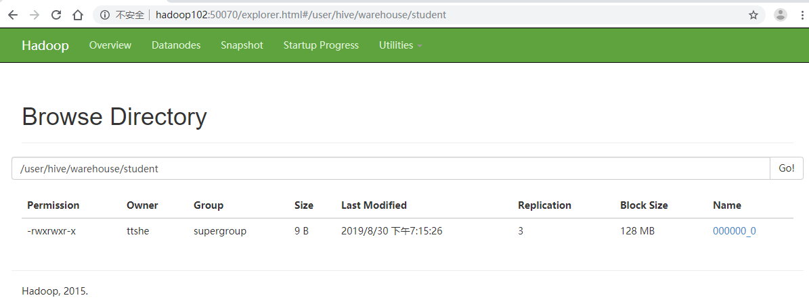
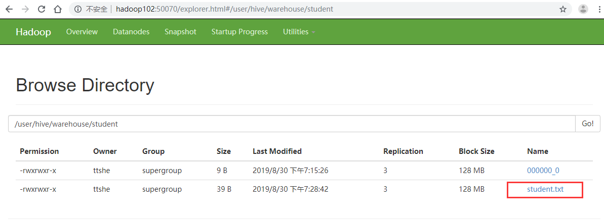

# 地址

- Hive官网地址

http://hive.apache.org/

- 文档查看地址

https://cwiki.apache.org/confluence/display/Hive/GettingStarted

- 下载地址

http://archive.apache.org/dist/hive/

- github地址

https://github.com/apache/hive


# 安装Hive

- 把apache-hive-1.2.1-bin.tar.gz上传到linux的/opt/software目录下
- 解压apache-hive-1.2.1-bin.tar.gz到/opt/module/目录下面

```bash
[ttshe@hadoop102 software]$ tar -zvxf apache-hive-1.2.1-bin.tar.gz -C /opt/module/
```

- 修改apache-hive-1.2.1-bin.tar.gz的名称为hive

```bash
[ttshe@hadoop102 module]$ mv apache-hive-1.2.1-bin/ hive
```

- 修改/opt/module/hive/conf目录下的hive-env.sh.template名称为hive-env.sh

```bash
[ttshe@hadoop102 conf]$ cp hive-env.sh.template hive-env.sh
```


## 配置hive-env.sh文件


### HADOOP_HOME

```bash
export HADOOP_HOME=/opt/module/hadoop-2.7.2
```


### HIVE_CONF_DIR

```bash
export HIVE_CONF_DIR=/opt/module/hive/conf
```


## Hadoop 集群配置

- 启动hdfs和yarn

```bash
[stt@hadoop102 hadoop-2.7.2]$ sbin/start-dfs.sh
[stt@hadoop103 hadoop-2.7.2]$ sbin/start-yarn.sh
```

- 在HDFS上创建/tmp和/user/hive/warehouse两个目录
  - warehouse 是hive的默认表default的仓库
- 修改他们的同组权限可写

```bash
[stt@hadoop102 hadoop-2.7.2]$ bin/hadoop fs -mkdir /tmp
[stt@hadoop102 hadoop-2.7.2]$ bin/hadoop fs -mkdir -p /user/hive/warehouse
[stt@hadoop102 hadoop-2.7.2]$ bin/hadoop fs -chmod g+w /tmp
[stt@hadoop102 hadoop-2.7.2]$ bin/hadoop fs -chmod g+w /user/hive/warehouse
```


# 基本操作


## 启动 `hive`

```bash
[ttshe@hadoop102 hive]$ bin/hive

Logging initialized using configuration in jar:file:/opt/module/hive/lib/hive-common-1.2.1.jar!/hive-log4j.properties
hive> 
```


## 查看数据库 `show databases;`

```sql
hive> show databases;
OK
default
Time taken: 0.18 seconds, Fetched: 1 row(s)
```


## 打开数据库 `use xxx;`

```sql
hive> use default;
OK
Time taken: 0.022 seconds
```


## 显示数据库的表 `show tables;`

```sql
hive> show tables;
OK
Time taken: 0.029 seconds
```


## 创建表 `create table ...`

```sql
hive> create table student(
    > id int,
    > name string
    > );
OK
Time taken: 0.246 seconds

hive> show tables;
OK
student
Time taken: 0.019 seconds, Fetched: 1 row(s)
```


## 查看表结构 `desc xxx;`

```sql
hive> desc student;
OK
id                  	int                 	                    
name                	string              	                    
Time taken: 0.184 seconds, Fetched: 2 row(s)
```


## 插入数据 `insert into ...`

```sql
hive> insert into student values(1000,"stt");
Query ID = ttshe_20190830191515_6a853ec5-d83b-48cf-9e2e-869ddd7ae9fa
Total jobs = 3
Launching Job 1 out of 3
...
```

- 插入数据就是对HDFS进行操作
- 执行了相应的job
- 文件夹的名称就是表名




## 查询表中的数据 `select ...`

```sql
hive> select * from student;
OK
1000	stt
Time taken: 0.058 seconds, Fetched: 1 row(s)
```


## 删除表 `drop table xxx;`

```sql
drop table student;
```


## 退出

```bash
hive> quit;
```


## 将本地文件导入Hive

- 将本地/opt/module/datas/student.txt目录下的数据导入到hive的student(id int, name string)表中

- 创建数据
  - 注意使用 tab `\t` 进行分割

```bash
1001	zhangshan
1002	lishi
1003	zhaoliu
```

- 执行导入

```sql
[ttshe@hadoop102 hive]$ bin/hive
hive> use default;

hive> load data local inpath '/opt/module/datas/student.txt' into table student;
Loading data to table default.student
Table default.student stats: [numFiles=2, numRows=0, totalSize=48, rawDataSize=0]
OK
Time taken: 0.545 seconds
```



- 查询
  - 由于建表的时候没有定义分割符，因此查询是null

```sql
hive> select * from student;
OK
1000	stt
NULL	NULL
NULL	NULL
NULL	NULL
Time taken: 0.291 seconds, Fetched: 4 row(s)
```


### 正确操作

- 删除表，重新建表导入

```sql
hive> drop table student;
OK
Time taken: 0.471 seconds
hive> create table student(
    > id int,
    > name string
    > )
    > row format delimited fields terminated by '\t';
OK
Time taken: 0.079 seconds
```

```sql
hive> load data local inpath '/opt/module/datas/student.txt' into table student;

Loading data to table default.student
Table default.student stats: [numFiles=1, totalSize=39]
OK
Time taken: 0.115 seconds
```

```sql
hive> select * from student;
OK
1001	zhangshan
1002	lishi
1003	zhaoliu
Time taken: 0.032 seconds, Fetched: 3 row(s)
```


# 安装MySQL

- 安装MySQL的原因

  - Hive默认存储MetaStore的数据库是Derby

    - 缺点，不支持并发访问 ，同时只能有一个客户端访问
    - 再打开一个客户端窗口启动hive，会产生java.sql.SQLException异常

    ```java
    Exception in thread "main" java.lang.RuntimeException: java.lang.RuntimeException:
     Unable to instantiate
     org.apache.hadoop.hive.ql.metadata.SessionHiveMetaStoreClient
            at org.apache.hadoop.hive.ql.session.SessionState.start(SessionState.java:522)
            at org.apache.hadoop.hive.cli.CliDriver.run(CliDriver.java:677)
            at org.apache.hadoop.hive.cli.CliDriver.main(CliDriver.java:621)
            at sun.reflect.NativeMethodAccessorImpl.invoke0(Native Method)
            at sun.reflect.NativeMethodAccessorImpl.invoke(NativeMethodAccessorImpl.java:57)
            at sun.reflect.DelegatingMethodAccessorImpl.invoke(DelegatingMethodAccessorImpl.java:43)
            at java.lang.reflect.Method.invoke(Method.java:606)
            at org.apache.hadoop.util.RunJar.run(RunJar.java:221)
            at org.apache.hadoop.util.RunJar.main(RunJar.java:136)
    Caused by: java.lang.RuntimeException: Unable to instantiate org.apache.hadoop.hive.ql.metadata.SessionHiveMetaStoreClient
            at org.apache.hadoop.hive.metastore.MetaStoreUtils.newInstance(MetaStoreUtils.java:1523)
            at org.apache.hadoop.hive.metastore.RetryingMetaStoreClient.<init>(RetryingMetaStoreClient.java:86)
            at org.apache.hadoop.hive.metastore.RetryingMetaStoreClient.getProxy(RetryingMetaStoreClient.java:132)
            at org.apache.hadoop.hive.metastore.RetryingMetaStoreClient.getProxy(RetryingMetaStoreClient.java:104)
            at org.apache.hadoop.hive.ql.metadata.Hive.createMetaStoreClient(Hive.java:3005)
            at org.apache.hadoop.hive.ql.metadata.Hive.getMSC(Hive.java:3024)
            at org.apache.hadoop.hive.ql.session.SessionState.start(SessionState.java:503)
    ... 8 more
    ```

    

## 准备

- 查看mysql是否安装，如果安装了，卸载mysql
  - 卸载和安装时==注意权限==，需要在root下进行卸载安装

```bash
[ttshe@hadoop102 hive]$ rpm -qa | grep mysql
mysql-libs-5.1.73-8.el6_8.x86_64
[ttshe@hadoop102 hive]$ sudo rpm -e --nodeps mysql-libs-5.1.73-8.el6_8.x86_64
```

- 解压mysql-libs.zip文件到目录

```bash
[root@hadoop102 software]# unzip mysql-libs.zip
```


## 安装MySQL服务器

```bash
[ttshe@hadoop102 mysql-libs]$ sudo rpm -ivh MySQL-server-5.6.24-1.el6.x86_64.rpm 

...
A RANDOM PASSWORD HAS BEEN SET FOR THE MySQL root USER !
You will find that password in '/root/.mysql_secret'.

You must change that password on your first connect,
no other statement but 'SET PASSWORD' will be accepted.
See the manual for the semantics of the 'password expired' flag.
...
```

- 安装完成后，生成一个初始密码，通过这个初始密码登录设置用户密码
- 查看生成的随机密码

```bash
[ttshe@hadoop102 mysql-libs]$ sudo cat /root/.mysql_secret
# The random password set for the root user at Fri Aug 30 22:29:53 2019 (local time): XKcGsTTXp7dkQxNT
```

- 查看MySQL状态

```bash
[ttshe@hadoop102 mysql-libs]$ service mysql status
MySQL is not running                                       [失败]
```

- 启动MySQL服务端
  - 注意普通用户必须添加sudo执行启动命令

```bash
[ttshe@hadoop102 opt]$ sudo service mysql start
[sudo] password for ttshe: 
Starting MySQL.                                            [确定]

[ttshe@hadoop102 opt]$ sudo service mysql status
MySQL running (90953)                                      [确定]
```


## 安装MySQL客户端

```bash
[ttshe@hadoop102 mysql-libs]$ sudo rpm -ivh MySQL-client-5.6.24-1.el6.x86_64.rpm
```

- 连接MySQL

```bash
[ttshe@hadoop102 mysql-libs]$ mysql -u root -pXKcGsTTXp7dkQxNT
```

- 设置密码为123456

```bash
mysql> set password = password('123456');
```

- 退出客户端，`quit`


## 配置MySQL访问权限

- 默认只能本机服务器端访问，需要配置访问权限

- 进入MySQL，显示数据库，使用`mysql` 数据库

```bash
[ttshe@hadoop102 mysql-libs]$ mysql -u root -p123456
mysql> show databases;
mysql> use mysql;
mysql> show tables;
```

- 显示`user`表结构

```bash
mysql> desc user;
```

- 查询

```bash
mysql> select User, Host, Password from user;
+------+-----------+-------------------------------------------+
| User | Host      | Password                                  |
+------+-----------+-------------------------------------------+
| root | localhost | *6BB4837EB74329105EE4568DDA7DC67ED2CA2AD9 |
| root | hadoop102 | *B7795C1FA0769BA3C757E577A1C4FE6779A02BCB |
| root | 127.0.0.1 | *B7795C1FA0769BA3C757E577A1C4FE6779A02BCB |
| root | ::1       | *B7795C1FA0769BA3C757E577A1C4FE6779A02BCB |
+------+-----------+-------------------------------------------+
4 rows in set (0.00 sec)
```

- 将第一条记录Host修改为`%` ，任何IP都可以访问
- 删除root用户的其他host

```bash
mysql> update user set Host='%' where Host='localhost';
mysql> delete from user where Host='hadoop102';
mysql> delete from user where Host='127.0.0.1';
mysql> delete from user where Host='::1';
```

- 刷新

```bash
mysql> flush privileges;
```


## MetaStore配置到MySQL

> Hive元数据配置到MySql


### 拷贝驱动

- 在/opt/software/mysql-libs目录下解压mysql-connector-java-5.1.27.tar.gz驱动包

```bash
[ttshe@hadoop102 mysql-libs]$ tar -zvxf mysql-connector-java-5.1.27.tar.gz 
```

- 拷贝/opt/software/mysql-libs/mysql-connector-java-5.1.27目录下的mysql-connector-java-5.1.27-bin.jar到/opt/module/hive/lib/

```bash
[ttshe@hadoop102 mysql-libs]$ cd mysql-connector-java-5.1.27
[ttshe@hadoop102 mysql-connector-java-5.1.27]$ cp mysql-connector-java-5.1.27-bin.jar /opt/module/hive/lib/
```


### hive-site.xml

> 在xml中的配置会替换hive-default.xml中的配置

- 在hive-default.xml.template中可以看到提示信息，对hive-site.xml的说明

```xml
  <!-- WARNING!!! This file is auto generated for documentation purposes ONLY! -->
  <!-- WARNING!!! Any changes you make to this file will be ignored by Hive.   -->
  <!-- WARNING!!! You must make your changes in hive-site.xml instead.         -->
  <!-- Hive Execution Parameters -->
```

- 创建hive-site.xml 

  - 根据官方文档配置参数，拷贝数据到hive-site.xml文件中

  https://cwiki.apache.org/confluence/display/Hive/AdminManual+MetastoreAdmin

```xml
<?xml version="1.0"?>
<?xml-stylesheet type="text/xsl" href="configuration.xsl"?>
<configuration>
	<property>
	  <name>javax.jdo.option.ConnectionURL</name>
	  <value>jdbc:mysql://hadoop102:3306/metastore?createDatabaseIfNotExist=true</value>
	  <description>JDBC connect string for a JDBC metastore</description>
	</property>

	<property>
	  <name>javax.jdo.option.ConnectionDriverName</name>
	  <value>com.mysql.jdbc.Driver</value>
	  <description>Driver class name for a JDBC metastore</description>
	</property>

	<property>
	  <name>javax.jdo.option.ConnectionUserName</name>
	  <value>root</value>
	  <description>username to use against metastore database</description>
	</property>

	<property>
	  <name>javax.jdo.option.ConnectionPassword</name>
	  <value>123456</value>
	  <description>password to use against metastore database</description>
	</property>
</configuration>
```

- 配置完毕后，如果启动hive异常，可以重新启动虚拟机。（重启后，别忘了启动hadoop集群）
  - 启动
  - 此时可以有多个客户端访问hive

```bash
[ttshe@hadoop102 hive]$ bin/hive
```

- 观察数据库
  - 此时在MySQL中创建了metastore数据库
  - 存储元数据信息的有DBS，TBLS，COLUMNS_V2


# HiveJDBC访问

> 使用基于JDBC的客户端执行操作
> 等价于使用JDBC实现了CLI的功能操作


关于连接方式


## 启动 hiveserver2服务

- 启动后占用控制台
  - 服务端口10000
  - 可以看到操作日志
  - 如果想在后台运行，添加 `&`

```bash
[ttshe@hadoop102 hive]$ bin/hiveserver2
# 此时
```


## 启动 beeline 客户端

```bash
[ttshe@hadoop102 hive]$ bin/beeline
Beeline version 1.2.1 by Apache Hive
beeline> 
```


## 连接 hiveserver2

- `!connect`
  - 注意用户名是当前系统登录用户

```bash
beeline> !connect jdbc:hive2://hadoop102:10000
Connecting to jdbc:hive2://hadoop102:10000
Enter username for jdbc:hive2://hadoop102:10000: ttshe # 回车
Enter password for jdbc:hive2://hadoop102:10000: # 直接回车
Connected to: Apache Hive (version 1.2.1)
Driver: Hive JDBC (version 1.2.1)
Transaction isolation: TRANSACTION_REPEATABLE_READ
0: jdbc:hive2://hadoop102:10000> 
```


## 查看帮助

- `!help` 打印所有命令

```bash
0: jdbc:hive2://hadoop102:10000> !help
!addlocaldriverjar  Add driver jar file in the beeline client side.
!addlocaldrivername Add driver name that needs to be supported in the beeline
                    client side.
!all                Execute the specified SQL against all the current connections
!autocommit         Set autocommit mode on or off
!batch              Start or execute a batch of statements
!brief              Set verbose mode off
!call               Execute a callable statement
!close              Close the current connection to the database
!closeall           Close all current open connections
!columns            List all the columns for the specified table
!commit             Commit the current transaction (if autocommit is off)
!connect            Open a new connection to the database.
!dbinfo             Give metadata information about the database
!describe           Describe a table
!dropall            Drop all tables in the current database
!exportedkeys       List all the exported keys for the specified table
!go                 Select the current connection
!help               Print a summary of command usage
!history            Display the command history
!importedkeys       List all the imported keys for the specified table
!indexes            List all the indexes for the specified table
!isolation          Set the transaction isolation for this connection
!list               List the current connections
!manual             Display the BeeLine manual
!metadata           Obtain metadata information
!nativesql          Show the native SQL for the specified statement
!nullemptystring    Set to true to get historic behavior of printing null as
                    empty string. Default is false.
!outputformat       Set the output format for displaying results
                    (table,vertical,csv2,dsv,tsv2,xmlattrs,xmlelements, and
                    deprecated formats(csv, tsv))
!primarykeys        List all the primary keys for the specified table
!procedures         List all the procedures
!properties         Connect to the database specified in the properties file(s)
!quit               Exits the program
!reconnect          Reconnect to the database
!record             Record all output to the specified file
!rehash             Fetch table and column names for command completion
!rollback           Roll back the current transaction (if autocommit is off)
!run                Run a script from the specified file
!save               Save the current variabes and aliases
!scan               Scan for installed JDBC drivers
!script             Start saving a script to a file
!set                Set a beeline variable
!sh                 Execute a shell command
!sql                Execute a SQL command
!tables             List all the tables in the database
!typeinfo           Display the type map for the current connection
!verbose            Set verbose mode on
```


## 查看数据库

- 查看当前hive中的数据库

```bash
0: jdbc:hive2://hadoop102:10000> show databases;
+----------------+--+
| database_name  |
+----------------+--+
| default        |
+----------------+--+
1 row selected (0.906 seconds)
```


## 执行linux命令

- 使用`!sh` 可以执行linux的命令

```bash
0: jdbc:hive2://hadoop102:10000> !sh ls -al /
总用量 110
dr-xr-xr-x.  25 root root  4096 4月  21 09:55 .
dr-xr-xr-x.  25 root root  4096 4月  21 09:55 ..
-rw-r--r--.   1 root root     0 4月  21 09:55 .autofsck
dr-xr-xr-x.   2 root root  4096 3月  30 10:25 bin
...
```


# 常用交互命令


## 查看帮助

- `-help` 命令

```bash
[ttshe@hadoop102 hive]$ bin/hive -help
usage: hive
 -d,--define <key=value>          Variable subsitution to apply to hive
                                  commands. e.g. -d A=B or --define A=B
    --database <databasename>     Specify the database to use
 -e <quoted-query-string>         SQL from command line
 -f <filename>                    SQL from files
 -H,--help                        Print help information
    --hiveconf <property=value>   Use value for given property
    --hivevar <key=value>         Variable subsitution to apply to hive
                                  commands. e.g. --hivevar A=B
 -i <filename>                    Initialization SQL file
 -S,--silent                      Silent mode in interactive shell
 -v,--verbose                     Verbose mode (echo executed SQL to the
                                  console)
```


## 执行sql语句

- 不进入hive的交互窗口执行sql语句
- `-e`
- ==默认是default库，如果有其他库，则使用xxx.yyy的方式访问==

```bash
[ttshe@hadoop102 hive]$ bin/hive -e "select * from student;"

Logging initialized using configuration in jar:file:/opt/module/hive/lib/hive-common-1.2.1.jar!/hive-log4j.properties
OK
1001	zhangshan
1002	lishi
1003	zhaoliu
1001	zhangshan
1002	lishi
1003	zhaoliu
Time taken: 1.098 seconds, Fetched: 6 row(s)
```


## 执行sql脚本

- 执行脚本中sql语句

- `-f`  命令

  - 在/opt/module/datas目录下创建hive.sql文件

  ```sql
  select *from student;
  ```

  - 执行文件中的sql语句

  ```bash
  [ttshe@hadoop102 hive]$ bin/hive -f /opt/module/datas/hive.sql 
  ```

  - 执行文件中的sql语句并将结果写入文件中

  ```bash
  [ttshe@hadoop102 hive]$ bin/hive -f /opt/module/datas/hive.sql > /opt/module/datas/hive_result.txt
  ```


## 关于退出

```bash
hive(default)>exit;
hive(default)>quit;
```

- 新版的hive中没区别
- 旧版本版本中
  - exit
    - 先隐性提交数据，再退出
  - quit
    - 不提交数据，退出


## 执行HDFS命令

```bash
hive (default)> dfs -ls /user;
Found 1 items
drwxr-xr-x   - ttshe supergroup          0 2019-08-30 19:02 /user/hive
```


## 执行Linux命令

- 添加 `!` 执行
  - 注意与HiveJDBC的执行的区别，这里要添加 `;`

```bash
hive (default)> ! cat /etc/profile;
```


## 查看操作历史

- 进入到当前用户的根目录/root或/home/atguigu

- 查看`. hivehistory`文件

```bash
[ttshe@hadoop102 ~]$ cat /home/ttshe/.hivehistory
```


# 常见属性配置


## 数据仓库位置配置

- `default`数据仓库的最原始位置是在hdfs上
  - `/user/hive/warehouse`

- 在仓库目录下
  - 没有对默认的数据库default创建文件夹
  - ==若某张表属于`default`数据库，直接在数据仓库目录`warehouse`下创建一个文件夹==

- 修改`default`数据仓库原始位置
  - 将hive-default.xml.template 如下配置信息拷贝到hive-site.xml文件中进行覆盖

```xml
<property>
    <name>hive.metastore.warehouse.dir</name>
    <value>/user/hive/warehouse</value>
    <description>location of default database for the warehouse</description>
</property>
```

- 注意配置同组用户有执行权限

```bash
bin/hdfs dfs -chmod g+w /user/hive/warehouse
```


## 查询信息显示配置

- 在hive-site.xml文件中添加配置信息
  - 实现显示当前数据库
  - 查询表的头信息配置

```xml
<property>
	<name>hive.cli.print.header</name>
	<value>true</value>
</property>

<property>
	<name>hive.cli.print.current.db</name>
	<value>true</value>
</property>
```

- 重新启动hive，对比配置前后差异
  - 显示了当前的数据库
  - 显示了表的列名称

```bash
hive (default)> select * from student;
OK
student.id	student.name
1001	zhangshan
1002	lishi
1003	zhaoliu
1001	zhangshan
1002	lishi
1003	zhaoliu
Time taken: 0.867 seconds, Fetched: 6 row(s)
```


## 日志位置配置

- Hive的log默认存放在/tmp/ttshe/hive.log目录下
  - 当前用户名下

- 修改hive的log存放日志到/opt/module/hive/logs

  - 修改/opt/module/hive/conf/hive-log4j.properties.template文件名称为

    hive-log4j.properties

  ```bash
  [ttshe@hadoop102 conf]$ pwd
  /opt/module/hive/conf
  [ttshe@hadoop102 conf]$ cp hive-log4j.properties.template hive-log4j.properties
  ```

  - 在hive-log4j.properties文件中修改log存放位置

  ```bash
  hive.log.dir=/opt/module/hive/logs
  ```


## 参数配置方式

- 查看当前所有的配置信息

```bash
hive (default)> set;
```


### 配置文件方式

- 默认配置文件：hive-default.xml 

- 用户自定义配置文件：hive-site.xml

- 用户自定义配置会覆盖默认配置
- Hive也会读入Hadoop的配置
  - Hive是作为Hadoop的客户端启动的
  - Hive的配置会覆盖Hadoop的配置
- 配置文件的设定对本机启动的所有Hive进程都有效


### 命令行参数方式

- 启动Hive时在命令行添加`-hiveconf param=value`来设定参数
  - 仅对本次hive启动有效

```bash
[ttshe@hadoop102 hive]$ bin/hive -hiveconf mapred.reduce.tasks=10;
```

- 查看参数设置

```bash
hive (default)> set mapred.reduce.tasks;
mapred.reduce.tasks=10
```

- 关于`mapred.reduce.tasks`
  - 默认值-1
    - 表示按照实际任务自动生成的MR执行模板中reduce的个数


### 参数声明方式

- 在HQL中使用`set`关键字设定参数
  - 仅对本次hive启动有效

```bash
hive (default)> set mapred.reduce.tasks = 100;
hive (default)> set mapred.reduce.tasks;
mapred.reduce.tasks=100
```


### 优先级

- 上述三种设定方式的优先级依次递增
- 配置文件<命令行参数<参数声明
- 注意某些系统级的参数，必须用前两种方式设定
  - 如log4j相关的设定
  - 那些参数的读取在会话建立以前已经完成