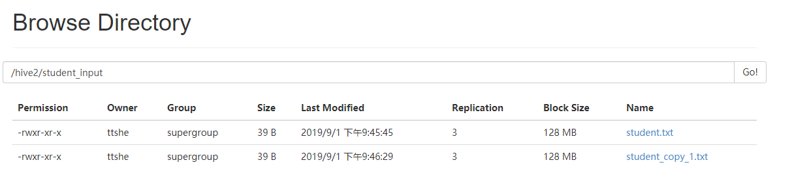

# 数据导入


## 向表中导入数据 `LOAD`


### 语法

```sql
hive> load data [local] inpath '/opt/module/datas/student.txt' [overwrite] into table xxx [partition (partcol1=val1,…)];
```

- **load data**
  
- 加载数据
  
- **local**
  - 从本地加载数据到hive表
  - 否则从HDFS加载数据到hive表

- **inpath**
  
- 加载数据的路径
  
- **overwrite**
  - 覆盖表中已有数据
  - 否则表示追加

- **into table**
  
- 加载到哪张表
  
- xxx
  
- 具体的表
  
- partition

  - 上传到指定分区

    
### 本地导入 `LOCAL`

- 创建表

```sql
create table student_input(id int,name string)
row format delimited fields terminated by '\t';
```

- 加载本地文件到hive

```sql
load data local inpath '/opt/module/datas/student.txt' into table hive2.student_input;
select * from student_input;
```

- 再次执行相同的语句
  - 有重复数据被追加导入

```sql
hive (hive2)> load data local inpath '/opt/module/datas/student.txt' into table hive2.student_input;
hive (hive2)> select * from student_input;
OK
student_input.id	student_input.name
1001	zhangshan
1002	lishi
1003	zhaoliu
1001	zhangshan
1002	lishi
1003	zhaoliu
Time taken: 0.032 seconds, Fetched: 6 row(s)
```




### hdfs导入

- hdfs上执行导入操作

- 先上传文件到hdfs，路径`/student/student.txt`

```sql
hive (default)> dfs -put /opt/module/datas/student.txt /student/;
```

- 导入
  - **注意从hdfs上导入数据是源目录文件的剪切操作过程**

```sql
hive (hive2)> load data inpath '/student/student.txt' into table hive2.student_input; 
```


### 覆盖导入 `OVERWRITE`

- 将hive中目标文件全部覆盖

```sql
load data local inpath '/opt/module/datas/student.txt' overwrite into table hive2.student_input;
```


## 通过查询向表中插入数据 `INSERT`

- 创建一个分区表

```sql
create table student_insert(id int,name string) 
partitioned by (month string)
row format delimited fields terminated by '\t';
```

- 插入基本的数据
  - 使用insert语句插入数据
  - 此时会执行MR程序

```sql
insert into table student_insert partition(month='09')
values(1,'zhangsan'),(2,'lisi');
```

- 查询插入后的效果

```sql
0: jdbc:hive2://hadoop102:10000> select * from student_insert;
+--------------------+----------------------+-----------------------+--+
| student_insert.id  | student_insert.name  | student_insert.month  |
+--------------------+----------------------+-----------------------+--+
| 1                  | zhangsan             | 09                    |
| 2                  | lisi                 | 09                    |
+--------------------+----------------------+-----------------------+--+
2 rows selected (1.528 seconds)
```


### 基本插入模式

- 依据单表查询结果
  - `insert into`
    - 以追加数据的方式插入到表或分区
    - 原有数据不会删除
  - `insert overwrite`
    - 会覆盖表或**分区**中已存在的数据
    - 如果查询的分区和插入的分区相同，那么会覆盖
  - 会执行MR程序

```sql
insert overwrite table student_insert partition(month='10')
select id,name from student_insert where month = '09';
```

- 查询插入的结果

```sql
0: jdbc:hive2://hadoop102:10000> select * from student_insert;
+--------------------+----------------------+-----------------------+--+
| student_insert.id  | student_insert.name  | student_insert.month  |
+--------------------+----------------------+-----------------------+--+
| 1                  | zhangsan             | 09                    |
| 2                  | lisi                 | 09                    |
| 1                  | zhangsan             | 10                    |
| 2                  | lisi                 | 10                    |
+--------------------+----------------------+-----------------------+--+
```

- ==insert不支持插入部分字段==

```sql
insert overwrite table student_insert partition(month='11')
select id from student_insert where month = '09';

Error: Error while compiling statement: FAILED: SemanticException [Error 10044]: Line 1:23 Cannot insert into target table because column number/types are different ''11'': Table insclause-0 has 2 columns, but query has 1 columns. (state=42000,code=10044)
```

- ==查询的比插入的字段多不支持==
  - 查询全部，额外会有虚列信息

```sql
insert overwrite table student_insert partition(month='04')
select * from student_insert where month = '09';

Error: Error while compiling statement: FAILED: SemanticException [Error 10044]: Line 1:23 Cannot insert into target table because column number/types are different ''04'': Table insclause-0 has 2 columns, but query has 3 columns. (state=42000,code=10044)
```


### 多表多分区插入模式

- 根据多张表查询结果

```sql
from student_insert
insert overwrite table student_insert partition(month='01')
select id,name where month='09'
insert overwrite table student_insert partition(month='02')
select id,name where month='09';
```


## 依据查询结果创建表导入数据 `As Select`

- 根据查询结果创建表
- 查询的结果会添加到新创建的表中
- 查看创建表md

```sql
create table if not exists student3
as select id, name from student;
```


## 建表时通过路径加载数据 `LOCATION`

- 上传数据到hdfs上

```sql
hive (default)> dfs -mkdir /student;
hive (default)> dfs -put /opt/module/datas/student.txt /student;
```

- 创建表，并指定在hdfs上的位置

```sql
create external table if not exists student5(id int, name string)
row format delimited fields terminated by '\t'
location '/student;
```

- 查询数据

```sql
hive (default)> select * from student5;
```


## import 数据到指定Hive表

- ==先用export导出后，再将数据导入==
  - 创建一个新表，并将数据迁移过来

```sql
import table student_insert2 partition(month='201709') from '/export_result2';
```

- 查询

```sql
hive (hive2)> select * from student_insert2;
OK
student_insert2.id	student_insert2.name	student_insert2.month
1	zhangsan	01
2	lisi	01
1	zhangsan	02
2	lisi	02
1	zhangsan	09
2	lisi	09
1	zhangsan	10
2	lisi	10
Time taken: 0.041 seconds, Fetched: 8 row(s)
```


# 数据导出


## insert 导出


### 导出到本地

- 将查询结果导出到本地
  - 注意，一般insert与overwrite一起使用

```sql
insert overwrite local directory '/opt/module/datas/export_result'
select * from student_insert;
```

- 查看本地路径下的结果

```bash
[ttshe@hadoop102 ~]$ cd /opt/module/datas/export_result
[ttshe@hadoop102 export_result]$ ll
总用量 4
-rw-r--r--. 1 ttshe ttshe 96 9月   1 22:37 000000_0
[ttshe@hadoop102 export_result]$ cat 000000_0 
1zhangsan01
2lisi01
1zhangsan02
2lisi02
1zhangsan09
2lisi09
1zhangsan10
2lisi10
```

- 指定输出格式

```sql
insert overwrite local directory '/opt/module/datas/export_result2'
row format delimited fields terminated by '\t'
select * from student_insert;
```

```bash
[ttshe@hadoop102 export_result2]$ cat 000000_0 
1	zhangsan	01
2	lisi	01
1	zhangsan	02
2	lisi	02
1	zhangsan	09
2	lisi	09
1	zhangsan	10
2	lisi	10
```


### 导出到hdfs

```sql
insert overwrite directory '/export_result'
row format delimited fields terminated by '\t'
select * from student_insert;
```

- 查看hdfs结果

```sql
hive (hive2)> dfs -cat /export_result/* ;
1	zhangsan	01
2	lisi	01
1	zhangsan	02
2	lisi	02
1	zhangsan	09
2	lisi	09
1	zhangsan	10
2	lisi	10
```


## export  导出

- export和import主要用于两个Hadoop平台集群之间Hive表迁移

- 只能导出到hdfs上

```sql
export table student_insert to '/export_result2';
```

- 导出后，会将表的元数据也导出
  - 使用import命令可以将导出的结果导入到一个指定表中


## hdfs 命令导出

- 使用hdfs的get命令

```bash
hive (default)> dfs -get /user/hive/warehouse/student/month=201709/000000_0
/opt/module/datas/export/student3.txt;
```


## hive shell导出

- 基本语法
  - hive -e 执行语句 > file
  - hive -f 执行脚本 > file

```bash
[ttshe@hadoop102 hive]$ bin/hive -e 'select * from default.student;' > /opt/module/datas/export/student4.txt;
```


## Sqoop导出

待补充


# 清除表中数据

- 注意：Truncate只能删除管理表，不能删除外部表中数据

```sql
hive (default)> truncate table student;
```

