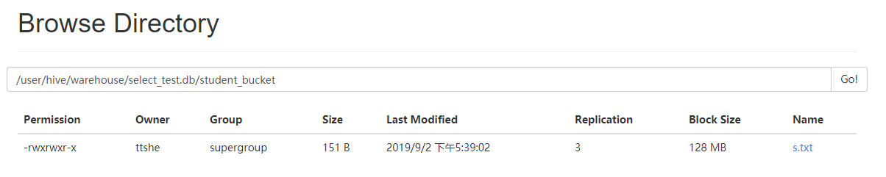
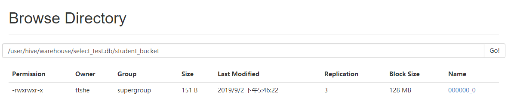
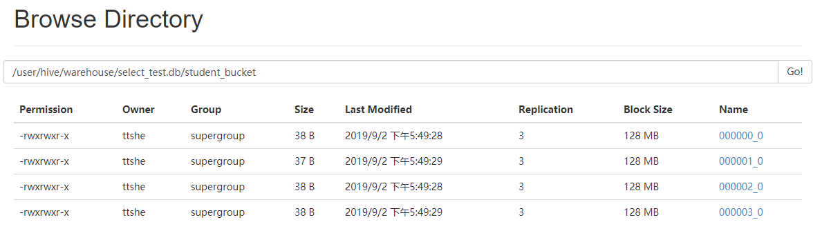
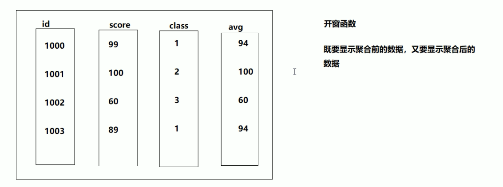

# 查询语法

https://cwiki.apache.org/confluence/display/Hive/LanguageManual+Select

```sql
[WITH CommonTableExpression (, CommonTableExpression)*]
(Note: Only available starting with Hive 0.13.0)

SELECT [ALL | DISTINCT] select_expr, select_expr, ...
FROM table_reference
[WHERE where_condition]
[GROUP BY col_list]
[ORDER BY col_list]
[CLUSTER BY col_list 
 	| [DISTRIBUTE BY col_list] [SORT BY col_list]]
[LIMIT number]
```


# 准备

- 部门表

```sql
create table if not exists dept(
deptno int,
dname string,
loc int
)
row format delimited fields terminated by '\t';
```

- 员工表

```sql
create table if not exists emp(
empno int,
ename string,
job string,
mgr int,
hiredate string, 
sal double, 
comm double,
deptno int)
row format delimited fields terminated by '\t';
```

- 地点表

```sql
create table if not exists location(
loc int,
loc_name string
)
row format delimited fields terminated by '\t';
```

- 导入数据

```sql
load data local inpath '/opt/module/datas/dept.txt' into table dept;
load data local inpath '/opt/module/datas/emp.txt' into table emp;
load data local inpath '/opt/module/datas/location.txt' into table location;
```

- dept

```text
10      ACCOUNTING      1700
20      RESEARCH        1800
30      SALES   1900
40      OPERATIONS      1700
```

- emp

```text
7369    SMITH   CLERK   7902    1980-12-17      800.00          20
7499    ALLEN   SALESMAN        7698    1981-2-20       1600.00 300.00  30
7521    WARD    SALESMAN        7698    1981-2-22       1250.00 500.00  30
7566    JONES   MANAGER 7839    1981-4-2        2975.00         20
7654    MARTIN  SALESMAN        7698    1981-9-28       1250.00 1400.00 30
7698    BLAKE   MANAGER 7839    1981-5-1        2850.00         30
7782    CLARK   MANAGER 7839    1981-6-9        2450.00         10
7788    SCOTT   ANALYST 7566    1987-4-19       3000.00         20
7839    KING    PRESIDENT               1981-11-17      5000.00         10
7844    TURNER  SALESMAN        7698    1981-9-8        1500.00 0.00    30
7876    ADAMS   CLERK   7788    1987-5-23       1100.00         20
7900    JAMES   CLERK   7698    1981-12-3       950.00          30
7902    FORD    ANALYST 7566    1981-12-3       3000.00         20
7934    MILLER  CLERK   7782    1982-1-23       1300.00         10
```

- location

```text
1700	Beijing
1800	London
1900	Tokyo
```


# 基本查询

- SQL 语言==大小写不敏感==。 

- SQL 可以写在一行或者多行

- ==关键字不能被缩写也不能分行==

- 各子句一般要分行写。

- 使用缩进提高语句的可读性


## 全表查询

```sql
select * from emp;
```


## 特定列查询

```sql
select empno,ename from emp;
```


## 列别名

- 重命名一个列

- 便于计算

- 紧跟列名
  - 可在列名和别名之间加入关键字‘AS’ 

```sql
select ename AS name, deptno dn from emp;
```


## 算术运算符

| 运算符 | 描述           |
| ------ | -------------- |
| A+B    | A和B 相加      |
| A-B    | A减去B         |
| A*B    | A和B 相乘      |
| A/B    | A除以B         |
| A%B    | A对B取余       |
| A&B    | A和B按位取与   |
| A\|B   | A和B按位取或   |
| A^B    | A和B按位取异或 |
| ~A     | A按位取反      |

```sql
select sal + 1 sal from emp;
```


## 常用函数

### count

- 需要执行MR

```sql
select count(*) cnt from emp;
```


### max

```sql
select max(sal) max_sal from emp;
```


### min

```sql
select min(sal) min_sal from emp;
```


### sum

```sql
select sum(sal) sum_sal from emp;
```


### avg

```sql
select avg(sal) avg_sal from emp;
```


## Limit语句

- 典型的查询会返回多行数据。LIMIT子句用于限制返回的行数

```sql
select * from emp limit 5;
```


# Where 语句

- 使用 WHERE 子句，将不满足条件的行过滤

- WHERE 子句紧跟 FROM 子句
- ==WHERE 子句中不能使用字段别名==
  - 由于执行顺序 WHERE 比 SELECT 早

```sql
select * from emp where sal > 1000;
```


## 比较运算符 `Between/In/Is Null`

- 操作符可用于JOIN…ON和HAVING语句中

| 操作符                  | 支持的数据类型 | 描述                                                         |
| :---------------------- | -------------- | :----------------------------------------------------------- |
| A=B                     | 基本           | 如果A等于B则返回TRUE，反之返回FALSE                          |
| ==A<=>B==               | 基本           | 如果A和B都为NULL，则返回TRUE，其他的和等号`=`操作符的结果一致，如果任一为NULL则结果为NULL |
| A<>B,  A!=B             | 基本           | A或B为NULL则返回NULL；如果A不等于B，则返回TRUE，反之返回FALSE |
| A<B                     | 基本           | A或B为NULL则返回NULL；如果A小于B，则返回TRUE，反之返回FALSE  |
| A<=B                    | 基本           | A或B为NULL则返回NULL；如果A小于等于B，则返回TRUE，反之返回FALSE |
| A>B                     | 基本           | A或B为NULL则返回NULL；如果A大于B，则返回TRUE，反之返回FALSE  |
| A>=B                    | 基本           | A或B为NULL则返回NULL；如果A大于等于B，则返回TRUE，反之返回FALSE |
| A [NOT] BETWEEN B AND C | 基本           | 如果A，B或C任一为NULL，则结果为NULL；如果A的值在[B,C]之间则结果为TRUE，反之为FALSE。如果使用NOT关键字则可达到相反的效果。 |
| A IS NULL               | 所有           | 如果A等于NULL则返回TRUE，反之返回FALSE                       |
| A IS NOT NULL           | 所有           | 如果A不等于NULL则返回TRUE，反之返回FALSE                     |
| IN(数值1, 数值2)        | 所有           | 使用 IN 运算显示列表中的值                                   |
| A [NOT] LIKE B          | STRING         | B是一个SQL下的简单正则表达式，也叫通配符模式，如果A与其匹配的话，则返回TRUE；反之返回FALSE<br />B的表达式说明如下：‘x%’表示A必须以字母‘x’开头，‘%x’表示A必须以字母’x’结尾，而‘%x%’表示A包含有字母’x’,可以位于开头，结尾或者字符串中间。如果使用NOT关键字则可达到相反的效果。 |
| A RLIKE B, A REGEXP B   | STRING         | B是基于java的正则表达式，如果A与其匹配，则返回TRUE；反之返回FALSE。匹配使用的是JDK中的正则表达式接口实现的，因为正则也依据其中的规则。例如，正则表达式必须和整个字符串A相匹配，而不是只需与其字符串匹配。 |

- 查询出薪水等于5000的所有员工

```sql
select * from emp where sal = 5000;
```

- 查询工资在500到1000的员工信息

```sql
select * from emp where sal between 500 and 1000;
```

- 查询comm为空的所有员工信息

```sql
select * from emp where comm is null;
```

- 查询工资是1500或5000的员工信息

```sql
select * from emp where sal in (1500,5000);
```


## Like

- LIKE运算选择类似的值
- 选择条件可以包含字符或数字
  - % 代表零个或多个字符
    - 任意个字符
  - _ 代表一个字符


- 查找以2开头薪水的员工信息

```sql
select * from emp where sal like '2%';
```

- 查找第二个数值为2的薪水的员工信息

```sql
select * from emp where sal like '_2%';
```


## RLike

- RLIKE子句是Hive中这个功能的一个扩展
- 通过Java的正则表达式来指定匹配条件


- 查找薪水中含有2的员工信息
  - 2的位置没有限定

```sql
select * from emp where sal rlike '[2]';
```


## 逻辑运算符 `And/Or/Not`

| 操作符 | 含义   |
| ------ | ------ |
| AND    | 逻辑并 |
| OR     | 逻辑或 |
| NOT    | 逻辑否 |

- 查询薪水大于1000，部门是30

```sql
select * from emp where sal > 1000 and deptno = 30;
```

- 查询薪水大于1000，或者部门是30

```sql
select * from emp where sal > 1000 or deptno = 30;
```

- 查询除了20部门和30部门以外的员工信息

```sql
select * from emp where deptno not in (20,30);
select * from emp where deptno != 20 and deptno != 30;
```


# 分组


## Group by 子句

- GROUP BY语句通常会和聚合函数一起使用
  - SELECT 中出现聚合函数
- GROUP BY的字段必须在SELECT中存在
  - 由于是先SELECT执行之后，再进行GROUP BY操作
- 按照一个或者多个列队结果进行分组，然后对每个组执行聚合操作

示例

- 计算emp表每个部门的平均工资

```sql
select avg(t.sal) avg_sal, t.deptno from emp t group by t.deptno;
```

- 计算emp每个部门中每个岗位的最高薪水

```sql
select max(t.sal) max_sal, t.job, t.deptno from emp t group by t.deptno, t.job;
```

- 错误示例
  - select 中出现的字段，需要在group by中
    - 如果没有则直接报错
    - 在MySQL中会给一个随机值，不会报错

```sql
select avg(t.sal) avg_sal, t.deptno ,t.ename name from emp t group by t.deptno;

Error: Error while compiling statement: FAILED: SemanticException [Error 10002]: Line 1:39 Invalid column reference 'ename' (state=42000,code=10002)
```


## Having 子句

- having与where不同点
  - where后面不能写分组函数
  - having后面可以使用分组函数
  - having只用于group by 结果进行过滤

示例

- 求每个部门的平均薪水大于2000的部门
  - having可以可以使用别名，因为having是在group by 分组的结果之后进行过滤

```sql
select avg(t.sal) avg_sal , t.deptno from emp t group by t.deptno having avg_sal > 2000; 
```


# Join 语句


## 等值连接特性


- Hive支持通常的SQL JOIN语句
- ==只支持等值连接==
- ==不支持非等值连接==


示例

- 根据员工表和部门表中的部门编号相等，查询员工编号、员工名称和部门名称

```sql
select e.empno,e.ename,d.deptno,d.dname from emp e join dept d on e.deptno = d.deptno;
```


## 表的别名

- 好处
  - 使用别名可以简化查询
  - 使用表名前缀可以提高执行效率

示例

- 合并员工表和部门表

```sql
select e.empno, e.ename, d.deptno from emp e join dept d on e.deptno = d.deptno;
```


## 内连接 `join`

- 只有进行连接的两个表中都存在与连接条件相匹配的数据才会被保留下来

```sql
select e.empno,e.ename,d.deptno,d.dname from emp e join dept d on e.deptno = d.deptno;
```


## 左外连接 `left join`

- JOIN操作符**左边表**中符合WHERE子句的所有记录将会被返回
- 如果**左边表**的指定字段没有符合条件的值使用NULL值替代

```sql
select e.empno,e.ename,d.deptno,d.dname from emp e left join dept d on e.deptno = d.deptno;
```


## 右外连接 `right join`

- JOIN操作符**右边表**中符合WHERE子句的所有记录将会被返回
- 如果**右边表**的指定字段没有符合条件的值使用NULL值替代

```sql
select e.empno,e.ename,d.deptno,d.dname from emp e right join dept d on e.deptno = d.deptno;
```


## 满外连接 `full join`

- MySQL不支持
- Hive支持
- 将会返回**所有表**中符合WHERE语句条件的所有记录
- 如果任一表的指定字段没有符合条件的值使用NULL值替代

```sql
select e.empno,e.ename,d.deptno,d.dname from emp e full join dept d on e.deptno = d.deptno;

+----------+----------+-----------+-------------+
| e.empno  | e.ename  | d.deptno  |   d.dname   |
+----------+----------+-----------+-------------+
| 7934     | MILLER   | 10        | ACCOUNTING  |
| 7839     | KING     | 10        | ACCOUNTING  |
| 7782     | CLARK    | 10        | ACCOUNTING  |
| 7876     | ADAMS    | 20        | RESEARCH    |
| 7788     | SCOTT    | 20        | RESEARCH    |
| 7369     | SMITH    | 20        | RESEARCH    |
| 7566     | JONES    | 20        | RESEARCH    |
| 7902     | FORD     | 20        | RESEARCH    |
| 7844     | TURNER   | 30        | SALES       |
| 7499     | ALLEN    | 30        | SALES       |
| 7698     | BLAKE    | 30        | SALES       |
| 7654     | MARTIN   | 30        | SALES       |
| 7521     | WARD     | 30        | SALES       |
| 7900     | JAMES    | 30        | SALES       |
| NULL     | NULL     | 40        | OPERATIONS  |
+----------+----------+-----------+-------------+
```


## 多表连接

- 连接 n个表，**至少需要n-1个连接条件**
- 如连接三个表，至少需要两个连接条件
- 大多数情况下，Hive会对每对JOIN连接对象启动一个MapReduce任务
- **Hive按照从左到右的顺序执行JOIN**
- 示例
  - 首先启动一个MapReduce job对表e和表d进行连接操作
  - 然后会再启动一个MapReduce job将第一个MapReduce job的输出和表 l 进行连接操作

```sql
select e.ename, d.dname, l.loc_name
from   emp e 
join   dept d
on     e.deptno = d.deptno 
join   location l
on     d.loc = l.loc;

+----------+-------------+-------------+
| e.ename  |   d.dname   | l.loc_name  |
+----------+-------------+-------------+
| SMITH    | RESEARCH    | London      |
| ALLEN    | SALES       | Tokyo       |
| WARD     | SALES       | Tokyo       |
| JONES    | RESEARCH    | London      |
| MARTIN   | SALES       | Tokyo       |
| BLAKE    | SALES       | Tokyo       |
| CLARK    | ACCOUNTING  | Beijing     |
| SCOTT    | RESEARCH    | London      |
| KING     | ACCOUNTING  | Beijing     |
| TURNER   | SALES       | Tokyo       |
| ADAMS    | RESEARCH    | London      |
| JAMES    | SALES       | Tokyo       |
| FORD     | RESEARCH    | London      |
| MILLER   | ACCOUNTING  | Beijing     |
+----------+-------------+-------------+
```

- 优化

  - 当对3个或者更多表进行join连接时，如果每个on子句都==使用相同的连接键==的话，那只产生一个MapReduce job

  - Hadoop 默认使用 MapJoin ，可以减少Job个数

    - 参数

    ```bash
    set hive.auto.convert.join = true; 默认为true
    ```

    - 将该参数设置为false，执行示例sql，可以看到有2个job

    ```sql
    Query ID = ttshe_20190902154557_654d394f-2204-4e5f-88cc-7799bf1eb27d
    Total jobs = 2
    Launching Job 1 out of 2
    Number of reduce tasks not specified. Estimated from input data size: 1
    In order to change the average load for a reducer (in bytes):
      set hive.exec.reducers.bytes.per.reducer=<number>
    In order to limit the maximum number of reducers:
      set hive.exec.reducers.max=<number>
    In order to set a constant number of reducers:
      set mapreduce.job.reduces=<number>
    Starting Job = job_1567162357920_0027, Tracking URL = http://hadoop103:8088/proxy/application_1567162357920_0027/
    Kill Command = /opt/module/hadoop-2.7.2/bin/hadoop job  -kill job_1567162357920_0027
    Hadoop job information for Stage-1: number of mappers: 2; number of reducers: 1
    2019-09-02 15:46:02,487 Stage-1 map = 0%,  reduce = 0%
    2019-09-02 15:46:07,807 Stage-1 map = 100%,  reduce = 0%, Cumulative CPU 5.62 sec
    2019-09-02 15:46:13,001 Stage-1 map = 100%,  reduce = 100%, Cumulative CPU 6.87 sec
    MapReduce Total cumulative CPU time: 6 seconds 870 msec
    Ended Job = job_1567162357920_0027
    Launching Job 2 out of 2
    Number of reduce tasks not specified. Estimated from input data size: 1
    In order to change the average load for a reducer (in bytes):
      set hive.exec.reducers.bytes.per.reducer=<number>
    In order to limit the maximum number of reducers:
      set hive.exec.reducers.max=<number>
    In order to set a constant number of reducers:
      set mapreduce.job.reduces=<number>
    Starting Job = job_1567162357920_0028, Tracking URL = http://hadoop103:8088/proxy/application_1567162357920_0028/
    Kill Command = /opt/module/hadoop-2.7.2/bin/hadoop job  -kill job_1567162357920_0028
    Hadoop job information for Stage-2: number of mappers: 2; number of reducers: 1
    2019-09-02 15:46:22,560 Stage-2 map = 0%,  reduce = 0%
    2019-09-02 15:46:28,748 Stage-2 map = 100%,  reduce = 0%, Cumulative CPU 4.9 sec
    2019-09-02 15:46:32,840 Stage-2 map = 100%,  reduce = 100%, Cumulative CPU 6.33 sec
    MapReduce Total cumulative CPU time: 6 seconds 330 msec
    Ended Job = job_1567162357920_0028
    MapReduce Jobs Launched: 
    Stage-Stage-1: Map: 2  Reduce: 1   Cumulative CPU: 6.87 sec   HDFS Read: 14765 HDFS Write: 574 SUCCESS
    Stage-Stage-2: Map: 2  Reduce: 1   Cumulative CPU: 6.33 sec   HDFS Read: 12810 HDFS Write: 293 SUCCESS
    Total MapReduce CPU Time Spent: 13 seconds 200 msec
    OK
    e.ename	d.dname	l.loc_name
    MILLER	ACCOUNTING	Beijing
    KING	ACCOUNTING	Beijing
    CLARK	ACCOUNTING	Beijing
    JONES	RESEARCH	London
    FORD	RESEARCH	London
    SMITH	RESEARCH	London
    SCOTT	RESEARCH	London
    ADAMS	RESEARCH	London
    MARTIN	SALES	Tokyo
    WARD	SALES	Tokyo
    ALLEN	SALES	Tokyo
    TURNER	SALES	Tokyo
    JAMES	SALES	Tokyo
    BLAKE	SALES	Tokyo
    Time taken: 36.32 seconds, Fetched: 14 row(s)
    ```

    

## 笛卡尔积

- 要避免笛卡尔积出现

- 产生条件
  - 省略连接条件
  - 连接条件无效
  - 所有表中的所有行互相连接

```sql
select empno, dname from emp, dept;
```


## 连接谓词中不支持 `or`

- hive join目前不支持在on子句中使用谓词or

```sql
select e.empno, e.ename, d.deptno 
from emp e 
join dept d 
on e.deptno = d.deptno or e.ename=d.ename;

FAILED: SemanticException [Error 10019]: Line 4:3 OR not supported in JOIN currently 'ename'
```


# 排序


## 全局排序 `order by`

- 全局排序，**只有一个Reducer**
  - 如果使用了`order by` ，会忽视设置的reducer的个数，只有一个Reducer进行处理
- ASC
  - ascend
  - 升序
  - 默认
- DESC
  - descend
  - 降序

- ORDER BY 子句在 SELECT 语句的结尾
  - 可以使用别名进行排序，在 SELECT 执行之后执行


示例

- 查询员工信息按工资升序排列

```sql
select * from emp order by sal;
```

- 查询员工信息按工资降序排列

```sql
select * from emp order by sal desc;
```

- 设置reducer个数，查看使用排序情况

```sql
set mapreduce.job.reduces=3;
select * from emp order by sal;
```


### 按别名排序

- 按照员工薪水的2倍排序

```sql
select ename,sal,sal*2 two_sal from emp order by two_sal;
```


### 多列排序

- 按照部门和工资升序排序

```sql
select * from emp order by deptno, sal;
```


## 每个MapReduce内部排序 `sort by`

- 对于大规模的数据集order by的效率非常低
- 在很多情况下，并不需要全局排序

- `sort by`
  - 为每个Reducer产生一个排序文件
  - ==每个Reducer内部进行排序==
  - 对全局结果集来说不是排序
  - ==Hadoop中的区内排序==
    - 每个分区生成一个Reducer
    - ==注意这里的分区是随机的==

示例

- 设置reduce个数

```sql
set mapreduce.job.reduces=3;
```

- 查看设置reduce个数

```sql
set mapreduce.job.reduces;
```

- 根据部门编号降序查看员工信息

```sql
select * from emp sort by deptno desc;
```

- 将查询结果导入到文件中
  - 按照部门编号降序排序
  - 设置了3个分区，会生成3个结果文件，在结果文件中查看排序效果

```sql
insert overwrite local directory '/opt/module/datas/sortby_result2'
row format delimited fields terminated by '\t'
select * from emp sort by deptno desc;
```


## 分区排序 `distribute by`

- 在有些情况下，需要控制某个特定行应该到哪个reducer
- 通常是为了进行后续的聚集操作
- **distribute by** 
  - 类似MR中partition（自定义分区）进行分区
  - 指定MR分区的字段
  - 结合`sort by`使用

- 分区规则
  - 是据分区字段的hash码与reduce的个数进行模除后，余数相同的分到一个区

- ==DISTRIBUTE BY 语句要写在 SORT BY 语句之前==


示例

- 对于distribute by进行测试，要分配多reduce进行处理
  - 否则无法看到distribute by的效果

```sql
set mapreduce.job.reduces=3;
```

- 先按照部门编号分区，再按照员工编号降序排序
  - 全局排序方式

```sql
select * from emp order by deptno asc,empno desc;
```
- 指定部门分区，然后对分区内的数据按照编号排序

```sql
insert overwrite local directory '/opt/module/datas/distribute-result'
row format delimited fields terminated by '\t'
select * from emp distribute by deptno sort by empno desc;
```


## `cluster by`

- 同时有`distribute by` 和 `sort by`
- 排序只能是升序排序
  - 不能指定排序规则为ASC或DESC
- 当distribute by和sorts by字段相同时可使用cluster by方式

示例

- 以下两种写法等价

- 注意：按照部门编号分区，不一定就是固定死的数值，可以是20号和30号部门分到一个分区里面去
  - reducer的个数提前设定，通过hash判断deptno放置在那个分区，分区内排序是有意义的

```sql
select * from emp cluster by deptno;
select * from emp distribute by deptno sort by deptno;
```


# 分桶表

- 分区提供一个隔离数据和优化查询的便利方式
- 并非所有的数据集都可形成合理的分区
  - 对一张表或分区，Hive 可以进一步组织成桶
  - 分桶
    - 更为细粒度的数据范围划分

- 分桶是将数据集分解成更容易管理的若干部分的技术
- 分区分桶区别
  - ==分区针对的是数据的存储路径==
  - ==分桶针对的是数据文件==


- 准备

```text
1001	ss1
1002	ss2
1003	ss3
1004	ss4
1005	ss5
1006	ss6
1007	ss7
1008	ss8
1009	ss9
1010	ss10
1011	ss11
1012	ss12
1013	ss13
1014	ss14
1015	ss15
1016	ss16
```


## 创建

```sql
create table student_bucket(id int,name string)
clustered by(id) into 4 buckets
row format delimited fields terminated by '\t';
```

- 查看表结构信息

```sql
desc formatted student_bucket;

Num Buckets:                  | 4                                                         
Bucket Columns:               | [id]
```


### load 导入数据

```sql
load data local inpath '/opt/module/datas/s.txt' into table student_bucket;
```

- 查看hdfs
  - 没有分桶
  - 没有经过MR程序，因此没有分桶操作




### 通过子查询导入数据

- 先创建一个stu表

```sql
create table stu(id int, name string)
row format delimited fields terminated by '\t';
```

- 通过load导入数据

```sql
load data local inpath '/opt/module/datas/s.txt' into table stu;
```

- 清空student_bucket表中数据

```sql
truncate table student_bucket;
select * from student_bucket;
```

- 导入分桶表，通过子查询的方式
  - 使用insert into 的方式会通过MR程序

```sql
insert into table student_bucket
select id, name from stu;
```

- 查看hdfs
  - 依然还是一个分桶



- ==设置属性==

```sql
set hive.enforce.bucketing=true;
set mapreduce.job.reduces=-1;
```

- 清空student_bucket表再次导入

- 查看hdfs
  - 此时成功



- 查询

```sql
hive (select_test)> select * from student_bucket;
OK
student_bucket.id	student_bucket.name
1016	ss16
1012	ss12
1008	ss8
1004	ss4
1009	ss9
1005	ss5
1001	ss1
1013	ss13
1010	ss10
1002	ss2
1006	ss6
1014	ss14
1003	ss3
1011	ss11
1007	ss7
1015	ss15
Time taken: 0.027 seconds, Fetched: 16 row(s)
```


## 分桶规则

- Hive的分桶采用对分桶字段的值进行Hash
- 除以桶的个数**求余**的方式决定该条记录存放在哪个桶当中


# 抽样查询

> 基于分桶表的抽样查询
>
> 对于非常大的数据集，有时用户需要使用的是一个具有代表性的查询结果而不是全部结果
> Hive可以通过对表进行抽样来满足这个需求。


## 语法

```sql
TABLESAMPLE(BUCKET x OUT OF y) 
```

- y 
  
  - table总bucket数的倍数或因子
- hive 根据y的大小，决定抽样的比例
  - 如 table **总共**分了4份
    - 当y=2时，抽取(4/2=)2个bucket的数据
    - 当y=8时，抽取(4/8=)1/2个bucket的数据

- x
  - ==从哪个bucket开始抽取==
  - 如果需要取多个分区，以后的分区号为当前分区号加上y
  - 如table总bucket数为4
    - tablesample(bucket 1 out of 2)
      - 总共抽取（4/2=）2个bucket的数据
      - 抽取第1(x)个和第3(x+y)个bucket的数据

- ==注意 x的值必须小于等于y的值==

  - 否则

  ```sql
  FAILED: SemanticException [Error 10061]: Numerator should not be bigger than denominator in sample clause for table stu_buck
  ```


## 示例

- 抽取1个bucket数据，从第1个bucket开始

```sql
select * from student_bucket tablesample(bucket 1 out of 4 on id);
```

- 抽取1/2个bucket，从第一个bucket开始

```sql
select * from student_bucket tablesample(bucket 1 out of 8 on id);
```


# 常用查询函数

> hive 的内置函数

## 查看内置函数

```sql
show functions;
```


## 查看函数用法

```sql
desc function nvl;

nvl(value,default_value) - Returns default value if value is null else returns value
```

- 查看详细用法

```sql
desc function extended nvl;

| nvl(value,default_value) - Returns default value if value is null else returns value  |
| Example:                                                                              |
|   > SELECT nvl(null,'bla') FROM src LIMIT 1;                                          |
|   bla       
```


## 空字段赋值 `NVL`

- NVL
  - 给值为NULL的数据赋值
  - 格式
    - NVL( value，default_value)
  - 功能
    - 如果value 为NULL，则NVL函数返回default_value的值
    - 如果value 不为 NULL，则返回value的值
    - 如果两个参数都为NULL ，则返回NULL

示例

- 如果员工的comm为NULL，则用-1代替

```sql
select ename, comm, nvl(comm,-1) from emp;

ename	comm	_c2
SMITH	NULL	-1.0
ALLEN	300.0	300.0
WARD	500.0	500.0
JONES	NULL	-1.0
MARTIN	1400.0	1400.0
BLAKE	NULL	-1.0
CLARK	NULL	-1.0
SCOTT	NULL	-1.0
KING	NULL	-1.0
...
```

- 如果员工的comm为NULL，则用领导id代替

```sql
select comm, nvl(comm,mgr) from emp;
```


## CASE WHEN

```sql
desc function extended  case;

CASE a WHEN b THEN c [WHEN d THEN e]* [ELSE f] END - When a = b, returns c; when a = d, return e; else return f  

|  SELECT                                                                                 
|  CASE deptno                                                                           
|    WHEN 1 THEN Engineering                                                             
|    WHEN 2 THEN Finance
|    ELSE admin                                                                           
|  END,                                                                                   
|  CASE zone                                                                             
|    WHEN 7 THEN Americas                                                                 
|    ELSE Asia-Pac                                                                       
|  END                                                                                   
|  FROM emp_details                                                                       
```

示例

- 创建数据

```text
悟空	A	男
大海	A	男
宋宋	B	男
凤姐	A	女
婷姐	B	女
婷婷	B	女
```

- 创建表，导入数据

```sql
create table emp_sex(name string, dept_id string, sex string) 
row format delimited fields terminated by "\t";
load data local inpath '/opt/module/datas/emp_sex.txt' into table emp_sex;
```

- 求出不同部门男女各多少人

```sql
select 
  dept_id,
  sum(case sex when '男' then 1 else 0 end) male_count,
  sum(case sex when '女' then 1 else 0 end) female_count
from 
  emp_sex
group by
  dept_id;
```

- 写法2
  - when 中必须是boolean类型

```sql
select 
  dept_id,
  sum(case when sex='男' then 1 else 0 end) male_count,
  sum(case when sex='女' then 1 else 0 end) female_count
from 
  emp_sex
group by
  dept_id;
```


## 行转列

> 将多行转成一列

### CONCAT

- 连接输入多个字符串
- 支持任意个输入字符串

- 语法

```sql
CONCAT(string A/col, string B/col…)
```

- 示例

```sql
select concat('hello','hive');

hellohive
```


### CONCAT_WS

- 语法

```sql
CONCAT_WS(separator, str1, str2,...)
```

- 特殊形式的 CONCAT
- 使用`desc function extended concat_ws` 查看详细使用
- 第一个参数是字符串连接符
  - 如果连接符是 NULL，返回值也将为 NULL
- 连接时，如果被连接字符串有 NULL 或 空字符串，连接符将被加到被连接的字符串之间

- 示例

```sql
select concat_ws('.','www',array('baidu','com'));

www.baidu.com
```


### COLLECT_SET

- 对某个字段查询的结果去重后汇总，生成一个array类型字段

- 语法
  - col 表示查询的字段

```sql
COLLECT_SET(col)
```


### 示例

- 数据准备，创建 c.txt

```sql
孙悟空	白羊座	A
大海	射手座	A
宋宋	白羊座	B
猪八戒	白羊座	A
凤姐	射手座	A
```

- 创建表，导入数据

```sql
create table person_info(
name string, 
constellation string, 
blood_type string) 
row format delimited fields terminated by "\t";

load data local inpath "/opt/module/datas/c.txt" into table person_info;
```

- 需求：把星座和血型一样的人归类到一起，结果如下

```text
射手座,A            大海|凤姐
白羊座,A            孙悟空|猪八戒
白羊座,B            宋宋
```

- 实现
  - 先实现子查询

```sql
select cb, concat_ws('|',collect_set(name)) from (
    select concat(constellation,',',blood_type) cb,name from person_info
) t 
group by cb;
```


## 列转行

> 将一列转换成多行数据

### EXPLODE

- 翻译：爆炸; 爆破
- UDTF 函数，一进多出

- 将hive一列中复杂的array或者map结构拆分成多行

- 语法

```sql
EXPLODE(col)
```

- 示例

```sql
select explode(array(1,2,3));

col
1
2
3
```

```sql
hive (select_test)> select explode(map(1,2,3,4));

key	value
1	2
3	4
```

- 注意

```sql
hive (select_test)> select 1,explode(array(1,2,3));
FAILED: SemanticException [Error 10081]: UDTF's are not supported outside the SELECT clause, nor nested in expressions
```


### LATERAL

-  翻译：侧面的; 横向的
- 语法
  - 必须要起表别名 `tableAlias`

```sql
LATERAL VIEW udtf_function(expression) tableAlias AS columnAlias
```

- 用于和split, explode等UDTF一起使用，将一列数据拆成多行数据，在此基础上对拆分后的数据进行聚合


### 示例

- 数据准备，m.txt

```text
《疑犯追踪》	悬疑,动作,科幻,剧情
《Lie to me》	悬疑,警匪,动作,心理,剧情
《战狼2》	战争,动作,灾难
```

- 创建表，导入数据

```sql
create table movie_info(
    movie string, 
    category array<string>) 
row format delimited fields terminated by "\t"
collection items terminated by ",";

load data local inpath "/opt/module/datas/m.txt" into table movie_info;
```

- 查询

```sql
hive (select_test)> select * from movie_info;

movie_info.movie	movie_info.category
《疑犯追踪》	["悬疑","动作","科幻","剧情"]
《Lie to me》	["悬疑","警匪","动作","心理","剧情"]
《战狼2》	["战争","动作","灾难"]
```

- 需求：将电影分类中的数组数据展开，结果如下

```text
《疑犯追踪》      悬疑
《疑犯追踪》      动作
《疑犯追踪》      科幻
《疑犯追踪》      剧情
《Lie to me》   悬疑
《Lie to me》   警匪
《Lie to me》   动作
《Lie to me》   心理
《Lie to me》   剧情
《战狼2》        战争
《战狼2》        动作
《战狼2》        灾难
```

- 实现
  - 使用侧视图 生成临时表的字段

```sql
select movie,category_info
from movie_info
lateral view explode(category) tmp_lv as category_info;
```


## 窗口函数(开窗函数) *




- 什么时候使用
  - 开窗函数常结合聚合函数使用
  - 要显示聚集前的数据和聚集后的数据
    - 一般来讲聚合后的行数要少于聚合前的行数
    - 此时使用开窗函数
- 语法

```sql
UDAF() over (PARTITION By col1，col2 order by col3 窗口子句（rows between .. and ..）) AS 列别名
```


### 相关函数

#### OVER

- over()

- 和聚合函数使用

- 指定分析函数工作的数据窗口大小，这个数据窗口大小可能会随着行的变而变化。

- 定义聚合函数的范围

  - select 的每一行都对==聚合函数的结果==执行一次窗口聚合操作

- partition by .. order by 可替换为distribute by .. sort by ..

- **参数顺序**

  - PARTITION BY > ORDER BY > ROWS BETWEEN ... AND

  

##### PARTITION BY

- 在over中使用，对窗口操作中进行分区，类似于GROUP BY
- 将聚合按照要求进行分区

- ==后面可跟多个字段==

##### ORDER BY

- 对分区中的数据进行排序
- 确定聚合哪些行
  - ==默认从起点到当前行的聚合==
- ==后面只跟一个字段==


##### ROWS BETWEEN ... AND

- 聚合范围调整级别，以行为单位动态调整

- 使用固定的行数来限制分区中的数据行数量

  

###### CURRENT ROW

- 当前行

###### UNBOUNDED

- 起点

###### PRECEDING

- n PRECEDING
  - 往前n行数据

- UNBOUNDED PRECEDING
  - 从前面的起点

###### FOLLOWING

- n FOLLOWING
  - 往后n行数据

- UNBOUNDED FOLLOWING
  - 到后面的终点


### 聚合函数

#### LAG

- LAG(col,n,default_val)
  - 往col列的前第n行数据
  - default_val 类似于NVL中的default，用于为Null时替换

#### LEAD

- LEAD(col,n, default_val)
  - 往col列后第n行数据

#### NTILE

- NTILE(n)
  - **将数据按照n进行等分处理**
  - 把有序分区中的行分发到指定数据的组中
    - 各个组有编号，编号从1开始
  - 对于每一行，NTILE 返回此行所属的组的编号
  - ==n必须为int类型==


### 示例

- 数据准备，b.txt
  - name，orderdate，cost

```text
jack,2017-01-01,10
tony,2017-01-02,15
jack,2017-02-03,23
tony,2017-01-04,29
jack,2017-01-05,46
jack,2017-04-06,42
tony,2017-01-07,50
jack,2017-01-08,55
mart,2017-04-08,62
mart,2017-04-09,68
neil,2017-05-10,12
mart,2017-04-11,75
neil,2017-06-12,80
mart,2017-04-13,94
```

- 创建表，导入数据

```sql
create table business(
name string, 
orderdate string,
cost int
) ROW FORMAT DELIMITED FIELDS TERMINATED BY ',';

load data local inpath "/opt/module/datas/b.txt" into table business;
```

#### 案例1

- 查询在2017年4月份购买过的顾客及总人数
  - 4月2个人购买

```sql
select name,count(1) over()
from business 
where orderdate like '2017-04%'
group by name;

name	count_window_0
mart	2
jack	2
```


##### 分析

- 如果没有窗口函数
  - 会统计出4月份每个人购买次数

```sql
select name,count(1) from business where orderdate like '2017-04%' group by name;

name	_c1
jack	1
mart	4
```

- 使用了窗口函数
  - 使用over等价于在count的结果上再次调用了count
    - select 语句内的循环执行操作时，每次都调用

```sql
select count(1) from (
    select name from business where orderdate like '2017-04%' group by name
) t;

2
```


#### 案例2

- 查询顾客的购买明细及月购买总额
  - 在开窗函数操作使用分区操作

```sql
select name, orderdate, cost, sum(cost) over(partition by month(orderdate))
from business;

name	orderdate	cost	sum_window_0
jack	2017-01-01	10	205
jack	2017-01-08	55	205
tony	2017-01-07	50	205
jack	2017-01-05	46	205
tony	2017-01-04	29	205
tony	2017-01-02	15	205
jack	2017-02-03	23	23
mart	2017-04-13	94	341
jack	2017-04-06	42	341
mart	2017-04-11	75	341
mart	2017-04-09	68	341
mart	2017-04-08	62	341
neil	2017-05-10	12	12
neil	2017-06-12	80	80
```


##### 分析

- 关于month
  - 指定格式`yyyy-MM-dd` 返回月份数值
  - 如果格式错误，返回NULL

```sql
hive (select_test)> select month('2019-07-08');

7

select month('2019-07');

NULL
```

- 拆分sum操作
  - 每次sum操作等价于如下操作
  - 分区操作等价于判断当前月

```sql
select sum(cost)
from business
where month(orderdate) = 4;
```


#### 案例3

- 将每个顾客的cost按照日期进行累加输出

```sql
select name, orderdate, cost, sum(cost) over(partition by name order by orderdate)
from business;

+-------+-------------+-------+---------------+--+
| name  |  orderdate  | cost  | sum_window_0  |
+-------+-------------+-------+---------------+--+
| jack  | 2017-01-01  | 10    | 10            |
| jack  | 2017-01-05  | 46    | 56            |
| jack  | 2017-01-08  | 55    | 111           |
| jack  | 2017-02-03  | 23    | 134           |
| jack  | 2017-04-06  | 42    | 176           |
| mart  | 2017-04-08  | 62    | 62            |
| mart  | 2017-04-09  | 68    | 130           |
| mart  | 2017-04-11  | 75    | 205           |
| mart  | 2017-04-13  | 94    | 299           |
| neil  | 2017-05-10  | 12    | 12            |
| neil  | 2017-06-12  | 80    | 92            |
| tony  | 2017-01-02  | 15    | 15            |
| tony  | 2017-01-04  | 29    | 44            |
| tony  | 2017-01-07  | 50    | 94            |
+-------+-------------+-------+---------------+--+
```


##### 分析

- 拆分sum等价于
  - partition by 用于过滤当前值的条件，如当前select执行到了'jack'
  - order by 用于比较当前值，如当前的是日期是'2017-04-06'，那么最终求小于当前日期的sum

```sql
select sum(cost)
from business
where name = 'jack' and orderdate <= '2017-04-06';
```


#### 案例4

- 将每个顾客的cost按照日期进行前2次消费的累加输出

```sql
select name, orderdate, cost, 
sum(cost) over(partition by name order by orderdate rows between 2 preceding and current row)
from business;

+-------+-------------+-------+---------------+
| name  |  orderdate  | cost  | sum_window_0  |
+-------+-------------+-------+---------------+
| jack  | 2017-01-01  | 10    | 10            |
| jack  | 2017-01-05  | 46    | 56            |
| jack  | 2017-01-08  | 55    | 111           |
| jack  | 2017-02-03  | 23    | 124           |
| jack  | 2017-04-06  | 42    | 120           |
| mart  | 2017-04-08  | 62    | 62            |
| mart  | 2017-04-09  | 68    | 130           |
| mart  | 2017-04-11  | 75    | 205           |
| mart  | 2017-04-13  | 94    | 237           |
| neil  | 2017-05-10  | 12    | 12            |
| neil  | 2017-06-12  | 80    | 92            |
| tony  | 2017-01-02  | 15    | 15            |
| tony  | 2017-01-04  | 29    | 44            |
| tony  | 2017-01-07  | 50    | 94            |
+-------+-------------+-------+---------------+
```


##### 分析

- 拆分sum等价于

```sql
select sum(cost)
from business
where name = 'jack' and orderdate <= '2017-04-06' and rows <= 当前行 and rows >= 当前行-2 ;
```

- 扩展

```sql
select name,orderdate,cost, 
sum(cost) over() as sample1,--所有行相加 
sum(cost) over(partition by name) as sample2,--按name分组，组内数据相加 
sum(cost) over(partition by name order by orderdate) as sample3,--按name分组，组内数据累加 
sum(cost) over(partition by name order by orderdate rows between UNBOUNDED PRECEDING and current row ) as sample4 ,--和sample3一样,由起点到当前行的聚合 
sum(cost) over(partition by name order by orderdate rows between 1 PRECEDING and current row) as sample5, --当前行和前面一行做聚合 
sum(cost) over(partition by name order by orderdate rows between 1 PRECEDING AND 1 FOLLOWING ) as sample6,--当前行和前边一行及后面一行 
sum(cost) over(partition by name order by orderdate rows between current row and UNBOUNDED FOLLOWING ) as sample7 --当前行及后面所有行 
from business;
```


#### 案例5

- 查看每个顾客上次的购买时间
  - lag获取前第n行某列的数值，如果数值不存在则返回设置默认值

```sql
select name,orderdate,cost, lag(orderdate,1,'No Record') over(partition by name order by orderdate)
from business;

+-------+-------------+-------+---------------+
| name  |  orderdate  | cost  | lag_window_0  |
+-------+-------------+-------+---------------+
| jack  | 2017-01-01  | 10    | No Record     |
| jack  | 2017-01-05  | 46    | 2017-01-01    |
| jack  | 2017-01-08  | 55    | 2017-01-05    |
| jack  | 2017-02-03  | 23    | 2017-01-08    |
| jack  | 2017-04-06  | 42    | 2017-02-03    |
| mart  | 2017-04-08  | 62    | No Record     |
| mart  | 2017-04-09  | 68    | 2017-04-08    |
| mart  | 2017-04-11  | 75    | 2017-04-09    |
| mart  | 2017-04-13  | 94    | 2017-04-11    |
| neil  | 2017-05-10  | 12    | No Record     |
| neil  | 2017-06-12  | 80    | 2017-05-10    |
| tony  | 2017-01-02  | 15    | No Record     |
| tony  | 2017-01-04  | 29    | 2017-01-02    |
| tony  | 2017-01-07  | 50    | 2017-01-04    |
+-------+-------------+-------+---------------+
```


#### 案例6

- 查询前20%时间的订单信息
  - 使用ntile将数据等分

```sql
select name,orderdate,cost
from(
select name,orderdate,cost,ntile(5) over(order by orderdate) num
from business
) t
where num = 1;
```


## 排名 `rank`


- 是聚合函数
- RANK
  - 排序相同时会重复
  - 最后一个数 <=ROW_NUMBER的最后一个数
- 累加计数
- DENSE_RANK
  - 排序相同时会重复
  - 最后一个数 <=ROW_NUMBER的最后一个数
- 自然计数
- ROW_NUMBER
  - 会根据顺序计算


示例

- 数据准备
  - 姓名，科目，分数

```text
孙悟空	语文	87
孙悟空	数学	95
孙悟空	英语	68
大海	语文	94
大海	数学	56
大海	英语	84
宋宋	语文	64
宋宋	数学	86
宋宋	英语	84
婷婷	语文	65
婷婷	数学	85
婷婷	英语	78
```

- 创建表并导入数据

```sql
create table score(
    name string,
    subject string, 
    score int
)
row format delimited fields terminated by "\t";
load data local inpath '/opt/module/datas/score.txt' into table score;
```

- 计算每门学科成绩排名
  - 需要使用开窗函数

```sql
select 
name,
subject,
score,
rank() over(partition by subject order by score desc) r,
dense_rank() over(partition by subject order by score desc) dr,
row_number() over(partition by subject order by score desc) rn
from score;
```

- 结果

```text
name	subject	score	r	dr	rn
孙悟空	数学	95	1	1	1
宋宋	数学	86	2	2	2
婷婷	数学	85	3	3	3
大海	数学	56	4	4	4
宋宋	英语	84	1	1	1
大海	英语	84	1	1	2
婷婷	英语	78	3	2	3
孙悟空	英语	68	4	3	4
大海	语文	94	1	1	1
孙悟空	语文	87	2	2	2
婷婷	语文	65	3	3	3
宋宋	语文	64	4	4	4
```

- 计算每门学科前三名的学生
  - 使用嵌套子查询实现

```sql
select name,subject,score,r
from ( 
select 
name,
subject,
score,
rank() over(partition by subject order by score desc) r
from score
) t1
where t1.r < 4;
```


## collect_set

- 创建原数据表

```sql
hive (gmall)>
drop table if exists stud;
create table stud (name string, area string, course string, score int);
```

- 向原数据表中插入数据

```sql
hive (gmall)>
insert into table stud values('zhang3','bj','math',88);
insert into table stud values('li4','bj','math',99);
insert into table stud values('wang5','sh','chinese',92);
insert into table stud values('zhao6','sh','chinese',54);
insert into table stud values('tian7','bj','chinese',91);
```

- 查询表中数据

```sql
hive (gmall)> select * from stud;
stud.name       stud.area       stud.course     stud.score
zhang3  bj      math    88
li4     bj      math    99
wang5   sh      chinese 92
zhao6   sh      chinese 54
tian7   bj      chinese 91
```

- 把同一分组的不同行的数据聚合成一个集合

```sql
hive (gmall)> select course, collect_set(area), avg(score) from stud group by course;
chinese ["sh","bj"]     79.0
math    ["bj"]  93.5
```

- 用下标可以取某一个

```sql
hive (gmall)> select course, collect_set(area)[0], avg(score) from stud group by course;
chinese sh      79.0
math    bj      93.5
```


## 日期处理函数


### date_format

- date_format函数（根据格式整理日期）

```sql
hive (gmall)> select date_format('2019-02-10','yyyy-MM');
2019-02
```


### date_add

- date_add函数（加减日期）

```sql
hive (gmall)> select date_add('2019-02-10',-1);
2019-02-09
hive (gmall)> select date_add('2019-02-10',1);
2019-02-11
```


### next_day

- 取当前天的下一个周一
- 说明：星期一到星期日的英文（Monday，Tuesday、Wednesday、Thursday、Friday、Saturday、Sunday）
- 大小写忽略

```sql
hive (gmall)> select next_day('2019-02-12','MO');
2019-02-18
```

- 取当前周的周一

```sql
hive (gmall)> select date_add(next_day('2019-02-12','MO'),-7);
2019-02-11
```


### last_day

- last_day函数（求当月最后一天日期）

```sql
hive (gmall)> select last_day('2019-02-10');
2019-02-28
```


# 函数


## 系统内置函数

- 查看系统自带的函数

```sql
show functions;
```

- 显示自带的函数的用法

```sql
desc function upper;
```

- 详细显示自带的函数的用法

```sql
desc function extended upper;
```


## 自定义函数

- Hive 自带了一些函数
  - 如max/min等，但是数量有限
  - 可以通过自定义UDF来方便的扩展

- 官方文档地址 https://cwiki.apache.org/confluence/display/Hive/HivePlugins


### 类别

- ==UDF==
  - User-Defined-Function
  - 一进一出
- UDAF
  - User-Defined Aggregation Function
  - 聚集函数，多进一出
  - 类似于count/max/min
- UDTF
  - User-Defined Table-Generating Functions
  - 一进多出
  - 如 lateral view / explore()


### 实现步骤

- ==继承org.apache.hadoop.hive.ql.UDF==

- ==实现evaluate函数==
  
- evaluate函数支持重载
  
- 在hive的命令行窗口创建函数
  - ==添加jar==，加入到classPath下

    ```bash
    add jar linux_jar_path
    ```

  - ==创建function==

    - temporary 临时的，当前session有效

    ```bash
    create [temporary] function [dbname.]function_name AS class_name;
    ```

- 在hive的命令行窗口删除函数

  ```bash
  Drop [temporary] function [if exists] [dbname.]function_name;
  ```

- 注意事项
  - UDF必须要有返回类型
    - 可返回null
    - 返回类型不能为void


## 自定义 UDF 函数

- 创建一个maven工程

### pom

- 添加依赖

```xml
<dependencies>
    <!-- https://mvnrepository.com/artifact/org.apache.hive/hive-exec -->
    <dependency>
        <groupId>org.apache.hive</groupId>
        <artifactId>hive-exec</artifactId>
        <version>1.2.1</version>
    </dependency>
</dependencies>
```


### java

```java
package com.stt.demo.hive.Ch01_udf;
import org.apache.hadoop.hive.ql.exec.UDF;
import java.util.Objects;
public class Lower extends UDF {
    
	public String evaluate (final String s) {
		return Objects.isNull(s) ? null : s.toLowerCase();
	}
}
```


### 上传jar包

- 打成jar包上传到服务器/opt/module/jars/udf.jar
- 将jar包添加到hive的classpath

```bash
hive (default)> add jar /opt/module/datas/udf.jar;
```


### 关联函数

- 创建临时函数与开发好的java class关联

```bash
hive (default)> create temporary function mylower as "com.stt.demo.hive.Ch01_udf.Lower";
```

- 即可在hql中使用自定义的函数strip

```bash
hive (default)> select ename, mylower(ename) lowername from emp;
```

