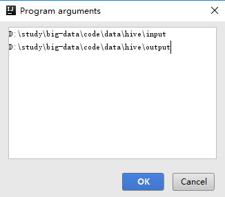
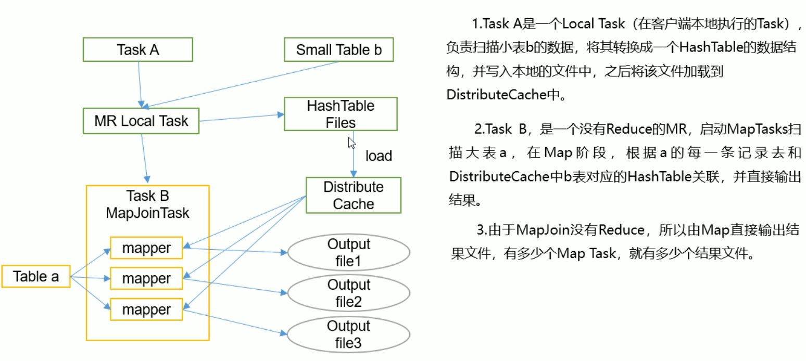

# 实例扩展


## 需求

- 统计硅谷影音视频网站的常规指标，各种TopN指标
  - 统计视频观看数Top10
  - 统计视频类别热度Top10
  - 统计视频观看数Top20所属类别
  - 统计视频观看数Top50所关联视频的所属类别Rank
  - 统计每个类别中的视频热度Top10
  - 统计每个类别中视频流量Top10
  - 统计上传视频最多的用户Top10以及他们上传的视频
  - 统计每个类别视频观看数Top10


## 项目


### 数据结构


#### 视频表

| 字段        | 备注       | 详细描述                                   |
| ----------- | ---------- | ------------------------------------------ |
| video id    | 视频唯一id | 11位字符串                                 |
| uploader    | 视频上传者 | 上传视频的用户名String                     |
| age         | 视频年龄   | 视频在平台上的整数天                       |
| category    | 视频类别   | 上传视频指定的视频分类，数组类型           |
| length      | 视频长度   | 整形数字标识的视频长度                     |
| views       | 观看次数   | 视频被浏览的次数                           |
| rate        | 视频评分   | 满分5分                                    |
| Ratings     | 流量       | 视频的流量，整型数字                       |
| conments    | 评论数     | 一个视频的整数评论数                       |
| related ids | 相关视频id | 相关视频的id，最多20个，类似视频，数组类型 |

数据：data/video

```text
LKh7zAJ4nwo	TheReceptionist	653	Entertainment	424	13021	4.34	1305	744	DjdA-5oKYFQ	NxTDlnOuybo	c-8VuICzXtU	DH56yrIO5nI	W1Uo5DQTtzc	E-3zXq_r4w0	1TCeoRPg5dE	yAr26YhuYNY	2ZgXx72XmoE	-7ClGo-YgZ0	vmdPOOd6cxI	KRHfMQqSHpk	pIMpORZthYw	1tUDzOp10pk	heqocRij5P0	_XIuvoH6rUg	LGVU5DsezE0	uO2kj6_D8B4	xiDqywcDQRM	uX81lMev6_o
7D0Mf4Kn4Xk	periurban	583	Music	201	6508	4.19	687	312	e2k0h6tPvGc	yuO6yjlvXe8
```


#### 用户表

| 字段     | 备注         | 字段类型 |
| -------- | ------------ | -------- |
| uploader | 上传者用户名 | string   |
| videos   | 上传视频数   | int      |
| friends  | 朋友数量     | int      |

数据：data/user

```text
barelypolitical	151	5106
bonk65	89	144
camelcars	26	674
```


#### 分析

- 视频表
  - 分隔都是\t
  - 数组中的字段也是\t分隔
    - 需要进行区分
  - 对于可能为空的字段进行处理
    - related ids 可以为空
    - 其他字段不能为空
    - 不满足的作为异常数据进行清洗掉
  - 视频类别使用` & ` 进行分割复杂
    - 需要进行简化
- 需要进行数据清洗
  - 一般使用MR进行数据清洗
  - 记录使用`\t` 进行分割，个数是9 ，小于9说明是异常数据
  - category字段，使用 ` & ` 分割，需要将&前后的空格去除
  - related ids 的分隔符是\t ,需要修改为 `&`


### ETL原始数据

- 通过观察原始数据形式
  - 视频可以有多个所属分类，每个所属分类用&符号分割，分割的两边有空格字符
  - 相关视频也是可以有多个元素，多个相关视频又用“\t”进行分割
- 为了分析数据时方便对存在多个子元素的数据进行操作
  - 进行数据重组清洗操作
    - 将所有的类别用“&”分割
    - 去掉两边空格
    - 多个相关视频id也使用“&”进行分割


#### Mapper

```java
package com.stt.demo.hive.Ch02_ETL;

import org.apache.commons.lang.StringUtils;
import org.apache.hadoop.io.LongWritable;
import org.apache.hadoop.io.NullWritable;
import org.apache.hadoop.io.Text;
import org.apache.hadoop.mapreduce.Mapper;

import java.io.IOException;

public class ETLMapper extends Mapper<LongWritable,Text,Text,NullWritable> {
	
	Text k = new Text();

	@Override
	protected void map(LongWritable key, Text value, Context context) throws IOException, InterruptedException {
		String etlStr = oriStr2ETLStr(value.toString());
		if(StringUtils.isBlank(etlStr)){
			return;
		}
		k.set(etlStr);
		context.write(k,NullWritable.get());
	}

	public static String oriStr2ETLStr(String s) {
		StringBuilder sb = new StringBuilder();
		String[] fields = s.split("\t");
		int len = fields.length;
		// 清洗不满足的数据
		if(len < 9){
			return null;
		}
		// 对第4个字段中的 & 两边的空格进行处理
		fields[3] = fields[3].replace(" ","");
		// 拼接操作
		for(int i=0;i<len;i++){
			if(i<9){
				sb.append(fields[i]);
				// related id可以为空，最后一个拼接不能有\t
				if(i != len-1){
					sb.append("\t");
				}
			}else{
				// related id 不为空，需要用&进行连接
				sb.append(fields[i]);
				if(i!=len-1){
					sb.append("&");
				}
			}
		}
		return sb.toString();
	}
}
```


#### Driver

- 实际生产中使用的写法

```java
package com.stt.demo.hive.Ch02_ETL;

import org.apache.hadoop.conf.Configuration;
import org.apache.hadoop.fs.FileSystem;
import org.apache.hadoop.fs.Path;
import org.apache.hadoop.io.NullWritable;
import org.apache.hadoop.io.Text;
import org.apache.hadoop.mapreduce.Job;
import org.apache.hadoop.mapreduce.lib.input.FileInputFormat;
import org.apache.hadoop.mapreduce.lib.output.FileOutputFormat;
import org.apache.hadoop.util.Tool;
import org.apache.hadoop.util.ToolRunner;

import java.io.IOException;

public class ETLDriver implements Tool {

	private Configuration conf = null;

	@Override
	public void setConf(Configuration conf) {
		this.conf = conf;
	}

	@Override
	public Configuration getConf() {
		return this.conf;
	}

	@Override
	public int run(String[] args) throws Exception {
		conf.set("inputpath",args[0]);
		conf.set("outputpath",args[1]);

		Job job = Job.getInstance(conf);

		job.setJarByClass(ETLDriver.class);

		job.setMapperClass(ETLMapper.class);
		job.setMapOutputKeyClass(Text.class);
		job.setMapOutputValueClass(NullWritable.class);
		// 没有reduceTask
		job.setNumReduceTasks(0);

		initJobInputPath(job);
		initJobOutputPath(job);

		return job.waitForCompletion(true) ? 0 : 1;
	}

	private void initJobInputPath(Job job) throws IOException {

		Configuration conf = job.getConfiguration();

		// 对输入路径进行判断是否存在，不存在抛出异常
		FileSystem fs = FileSystem.get(conf);
		String inputPathStr = conf.get("inputpath");
		Path in = new Path(inputPathStr);
		if(!fs.exists(in)){
			throw new RuntimeException(inputPathStr + " is not exists");
		}
		FileInputFormat.addInputPath(job,in);
	}

	private void initJobOutputPath(Job job) throws IOException {

		Configuration conf = job.getConfiguration();

		String outputStr = conf.get("outputpath");
		Path out = new Path(outputStr);
		FileSystem fs = FileSystem.get(conf);
		// 如果存在则删除结果
		if(fs.exists(out)){
			fs.delete(out,true);
		}
		FileOutputFormat.setOutputPath(job,out);

	}

	public static void main(String[] args) throws Exception {
		System.exit(ToolRunner.run(new ETLDriver(), args));
	}
}
```


#### 测试

- 在运行配置中配置路径



#### 执行ETL

- 上传数据

```bash
[ttshe@hadoop102 guli]$ hadoop fs -mkdir -p /guli
[ttshe@hadoop102 guli]$ hadoop fs -put video/ /guli
[ttshe@hadoop102 guli]$ hadoop fs -put user/ /guli
```

- 将写的ETL功能打成jar包在hadoop集群上运行

```bash
[ttshe@hadoop102 ~]$ hadoop jar /opt/module/datas/big-data-0.0.1.jar "com.stt.demo.hive.Ch02_ETL.ETLDriver" /guli/video /guli/video_etl
```

- 删除SUCCESS文件

```bash
[ttshe@hadoop102 ~]$ hadoop fs -rm -r /guli/video_etl/_SUCCESS
```


## 准备工作


### 创建表

- 创建user表
- 创建video表
- 注意user和video各是2张表
  - 一个是textfile存储
    - guli-video-ori
    - guli-user-ori
  - 一个是orc格式存储
    - guli-video-orc
    - guli-user-orc

```sql
create table guli_video_ori(
    videoId string, 
    uploader string, 
    age int, 
    category array<string>, 
    length int, 
    views int, 
    rate float, 
    ratings int, 
    comments int,
    relatedId array<string>)
row format delimited 
fields terminated by "\t"
collection items terminated by "&"
stored as textfile;
```

```sql
create table guli_user_ori(
    uploader string,
    videos int,
    friends int)
row format delimited 
fields terminated by "\t" 
stored as textfile;
```

```sql
create table guli_video_orc(
    videoId string, 
    uploader string, 
    age int, 
    category array<string>, 
    length int, 
    views int, 
    rate float, 
    ratings int, 
    comments int,
    relatedId array<string>)
row format delimited fields terminated by "\t" 
collection items terminated by "&" 
stored as orc;
```

```sql
create table guli_user_orc(
    uploader string,
    videos int,
    friends int)
row format delimited 
fields terminated by "\t" 
stored as orc;
```

- 创建数据库

```sql
hive (default)> create database guli;
Time taken: 0.102 seconds
hive (default)> use guli;
Time taken: 0.015 seconds
```


### 导入ETL后的数据

```sql
hive (guli)> load data inpath '/guli/video_etl' into table guli_video_ori;
hive (guli)> load data inpath '/guli/user' into table guli_user_ori;
```

- 检查

```sql
0: jdbc:hive2://hadoop102:10000> select * from guli_user_ori limit 3;
0: jdbc:hive2://hadoop102:10000> select * from guli_video_ori limit 3;
```


### 向ORC表插入数据

```sql
insert overwrite table guli_user_orc 
select * from guli_user_ori;
insert overwrite table guli_video_orc 
select * from guli_video_ori;
```


## 业务分析


### 统计视频观看数Top10

```sql
select videoId,views 
from guli_video_orc 
order by views desc
limit 10;
```


### 统计视频类别热度Top10

- 即统计每个类别有多少个视频，显示出包含视频最多的前10个类别

- 按照类别group by聚合，然后count组内的videoId个数

- 当前表结构为：一个视频对应一个或多个类别
  - 如果要group by类别，需要先将类别进**列转行(展开)**，explode
  - 然后再进行count即可

- 最后按照热度排序，显示前10条。

```sql
select count(1) hot,category_info 
from (
select explode(category) category_info
from guli_video_orc
) t
group by category_info
order by hot desc 
limit 10;
```


### 统计视频观看数Top20所属类别以及每个类别包含Top20视频的个数

- 先找到观看数最高的20个视频所属条目的所有信息，降序排列

- 把这20条信息中的category分裂出来(列转行)

- 最后查询视频分类名称和该分类下有多少个Top20的视频

- 统计视频观看数最高20个视频的所属类别

```sql
select videoId,category,views
from guli_video_orc
order by views desc
limit 20;
```

- 类别包含Top20视频的个数

```sql
select count(1) num, category_info
from (
    select explode(category) category_info
    from(
        select videoId,category,views
        from guli_video_orc
        order by views desc
        limit 20
    )t1
) t2
group by category_info
order by num desc;
```


### 统计视频观看数Top50所关联视频的所属类别排序(最难)

- 查询得到观看数top50关联视频信息，t1

```sql
select videoId,views,relatedId
from guli_video_orc
order by views desc
limit 50
```

- 查询得到关联信息视频列转行信息，t2
  - 要进行去id重

```sql
select explode(relatedId) reVideoId
from t1

/*去重操作*/
select distinct reVideoId
from t1
lateral view explode(relatedId) tmp as reVideoId
```

- 得到关联视频所属类别，t3

```sql
select v.category,v.videoId
from guli_video_orc v
join t2
on v.videoId = t2.reVideoId
```

- 得到关联视频类别的列转行信息，t4

```sql
select explode(category) category_info
from t3
```

- 安装类别分组聚合排序

```sql
select category_info,count(1) hot
from t4
group by category_info
order by hot desc;
```

- 最终代码

```sql
select
    category_info, count(1) hot
from(
    select explode(category) category_info
    from(
        select v.category, v.videoId
        from guli_video_orc v
        join (
            select distinct reVideoId
            from(
                select videoId, views, relatedId
                from guli_video_orc
                order by views desc
                limit 50
            ) t1 lateral view explode (relatedId) tmp as reVideoId
        ) t2 on v.videoId = t2.reVideoId
    ) t3
) t4
group by category_info
order by hot desc;
```


### 考虑优化

- 由于每次使用category，进行列转行操作

- 可以进行优化
  - 创建中间表存储转换后的结果
- 创建类别表

```sql
create table guli_video_category(
    videoId string, 
    uploader string, 
    age int, 
    categoryId string, 
    length int, 
    views int, 
    rate float, 
    ratings int, 
    comments int, 
    relatedId array<string>)
row format delimited 
fields terminated by "\t" 
collection items terminated by "&" 
stored as orc;
```

- 插入数据
  - 注意插入字段的**位置要保持一致**

```sql
insert overwrite table guli_video_category
select
    videoId, 
    uploader, 
    age, 
    categoryId, 
    length, 
    views, 
    rate, 
    ratings, 
    comments, 
    relatedId
from guli_video_orc
lateral view explode (category) tmp as categoryId;
```


### 统计每个类别中的视频热度Top10，以Music为例

```sql
select categoryId, videoId , views
from guli_video_category
where categoryId='Music'
order by views desc
limit 10;
```


### 统计每个类别中视频流量Top10，以Music为例

```sql
select categoryId, videoId , ratings
from guli_video_category
where categoryId='Music'
order by ratings desc
limit 10;
```


### 统计上传视频最多的用户Top10以及他们上传的观看次数在前20的视频

- 统计上传视频最多的用户Top10，t1

```sql
select videos,uploader
from guli_user_orc
order by videos desc
limit 10;
```

- 上传视频的观看次数在前20的视频
  - 小表在前

```sql
select v.views,v.videoId,v.uploader
from t1
join guli_video_orc v
on t1.uploader = v.uploader
order by views desc
limit 20;
```

- 最终sql

```sql
select v.views,v.videoId,v.uploader
from (
    select videos,uploader
    from guli_user_orc
    order by videos desc
    limit 10
)t1
join guli_video_orc v
on t1.uploader = v.uploader
order by views desc
limit 20;
```


### 统计每个类别视频观看数Top10

- 使用开窗函数

```sql
select categoryId, videoId , views
from(
    select categoryId, videoId , views,row_number() over(partition by categoryId order by     views desc) rank
    from guli_video_category
) t
where t.rank <=10;
```


# 面试题


## hive的理解和优化策略

- hive的概念
  - 数据仓库工具
  - 数据存储在hdfs
  - 元数据存储在metastore里面
  - 把结构化的文件映射到一张表中
- hive的本质
  - 将HQL语句转换为MR程序
  - MR程序的解析器
  - 基于Hadoop
    - 把HQL转换为MR
    - 调用HDFS上数据
    - 调用Yarn

- 优化策略

  - 表的优化
    - 大表join大表
      - 空key的过滤
      - 空key的转换，随机
  - MapJoin
    - 大表join小表 
      - 小表存储在内存中
    - 只有Map
    - 没有reduce阶段
    - 少了IO
    - 没有数据倾斜
  - GroupBy的优化
    - 设置数据参数，解决数据倾斜
    - 生成2个MR
  - 列过滤
    - 尽量不用select * 
    - 尽量用分区过滤，分目录，指定分区字段
      - 提高查询效率
  - 行过滤
    - 先过滤，再join
  - JVM重用
    - 重点
  - 本地模式
  - 并行执行
  - 压缩

  

## Hive中，建的表为压缩表，输入文件为非压缩格式，会有什么现象和结果

- 如果表为压缩表
  - 要求表中的数据为压缩格式
  - 导入的数据为非压缩格式

- load data方式导入数据
  - 查询表中的数据，无法解析
  - 查询不到表中的数据
- insert  select 方式导入
  - 执行MR程序
  - 将数据压缩后导入表中
  - 可以查询到数据


## mapjoin原理和实际应用




## 开窗函数


- 需求

  - 分组TOPN ，选出2016年每个学校，每个年级，分数前三的科目
    - 每个学校，每个年级，每个科目的前三
  - 考虑到开窗函数
    - rank
    - dense_rank
    - row_number

  ```sql
  select time,shool,grade,name,subject,score,rank
  from(
      select time,school,grade,name,subject,score,
      row_number() over(
          partition by school, grade ,subject
          order by score desc ) rank
      from tb_score
      where time = 2016
  ) t
  where t.rank <=3;
  ```

  