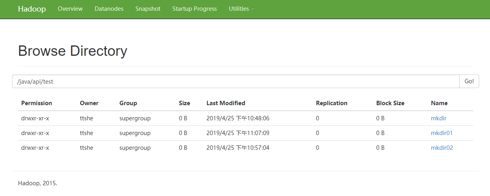
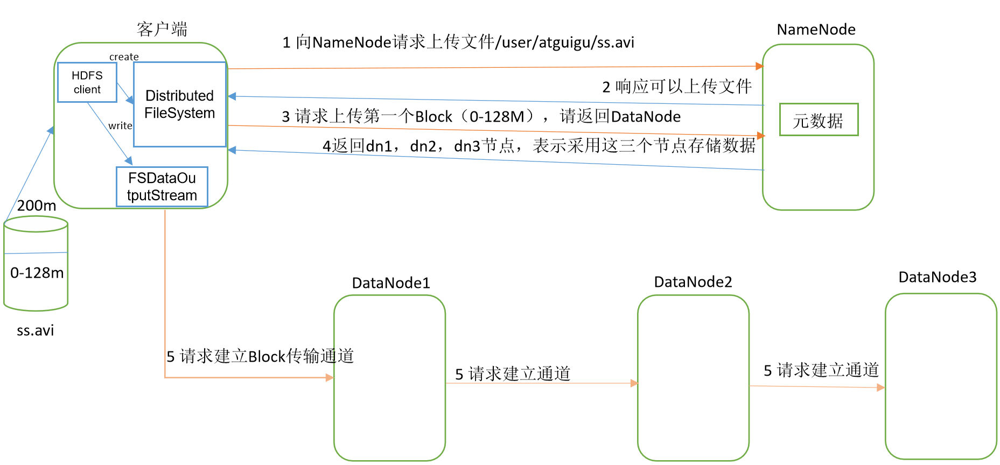
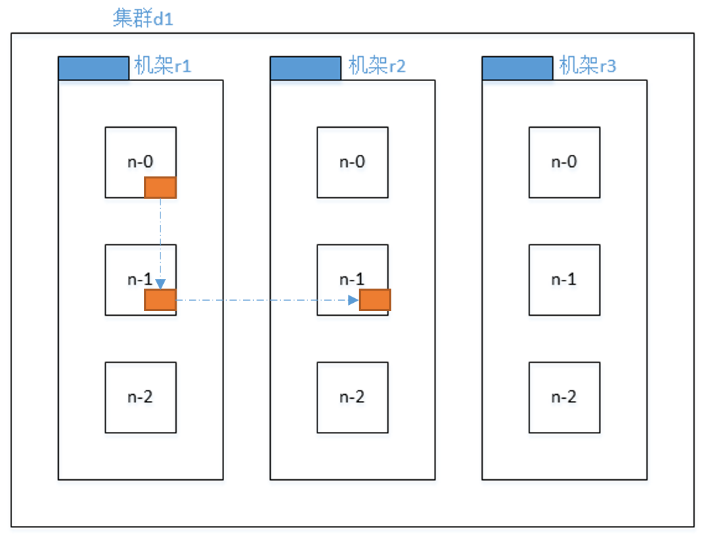
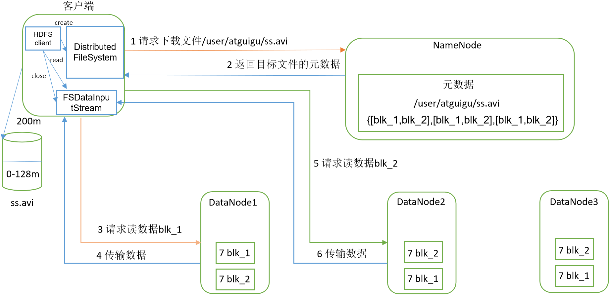
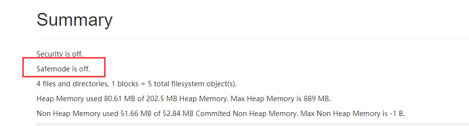
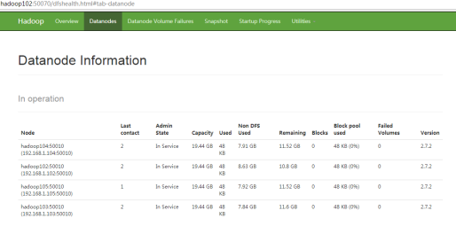
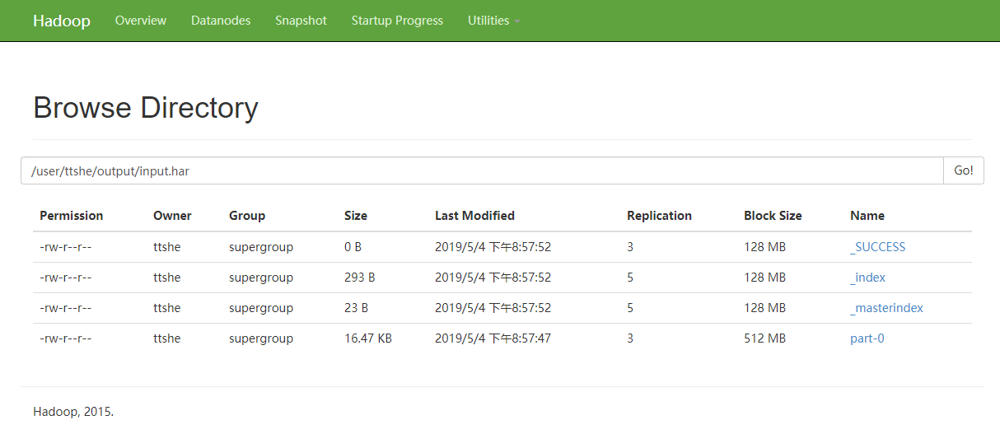
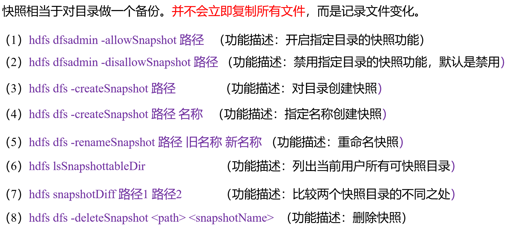

# HDFS学习

> 数据量增大，数据分配到不同的系统中进行存储，那么就需要一个系统来管理多个机器上的文件，这就是分布式文件系统，HDFS是分布式文件系统的一种。


## 概述


### 定义

HDFS Hadoop Distributed File System 是一个文件系统，用于存储文件，通过==目录树==来定位文件，也是一个分布式的系统，由多台服务器组合实现。


### 使用场景

==一次写入，多次读取==的场景，不支持文件修改，适合作为数据分析，不适合做网盘应用


### 优点

- 高容错性

  - 数据自动保存多个副本，通过增加副本的方式提高容错性

  - 某一个副本丢失后，可以自动恢复，当某个副本丢失，重新搭建副本时，可以再次恢复

- 适合处理大数据

  - 数据规模：可以处理数据规模达到GB，TB，PB的数据

  - 文件规模：可以处理==百万==规模以上的文件数量

- 可构建在==廉价==的机器上，通过多副本机制，提高可靠性


### 缺点

- ==不适合低延时==的数据访问，比如毫秒级别的存储数据
- 无法高效的对大量的==小文件==进行存储
  - 原因
    - 如果存储大量小文件，会占用NameNode大量内存来存储文件信息和块信息，但是NameNode本身是有存储限制的。
    - 小文件存储的寻址时间会超过读取时间，违反了HDFS的设计目标
- ==不支持并发写入==，不支持文件随机修改
  - 一个文件只能有一个写入操作，不允许有多个线程同时写同一个文件
  - ==仅支持数据append(追加)==，不支持文件随机修改


### 组成架构


#### NameNode

> nn 作为master，是一个主管，管理者

- 管理HDFS的名称空间
- 配置副本策略
- 管理数据块（Block）映射信息
- 处理客户端读写请求


#### DataNode

> slave，NameNode下发命令，DataNode执行实际的操作

- 存储实际的数据块
- 执行数据块的读写操作


#### SecondaryNameNode

> 不是NameNode的热备份，当NameNode挂掉的时候，并不能马上替换NameNode并提供服务，当恢复成NameNode的时候，会有数据丢失的情况

- 辅助NameNode，分担工作量，定期合并Fsimage和Edits，并推送给NameNode
- 在紧急情况下，可辅助恢复NameNode


#### Client

> 客户端，shell，api调用的客户端命令

- 文件切分，文件上传到HDFS的时候，Client将文件切分成一个个的Block，然后上传
- 与NameNode交互，获取文件位置信息
- 与DataNode交互，读取或者写入数据
- 提供一些命令管理HDFS，如NameNode的格式化
- 提供一些命令访问HDFS，如对HDFS增删改查操作


### 关于Block大小定义

HDFS 中文件在物理上是分块存储的（Block），块的大小是通过配置参数（dfs.blocksize）进行配置

- 默认大小在Hadoop2.x版本中是128Mb
- 在Hadoop1.x版本中的大小是64Mb


#### 定义背景

- 如果寻址的时间约为10ms，即查找到目标的block的时间是10ms
- ==寻址的时间为网络访问传输时间的1%，则为最佳状态==，那么网络访问时间长为1s（10ms/0.01=1s）
- 磁盘的传输速率普通速率为100Mb/s
- 那么在1s内可以访问的数据量大小是100Mb左右，因此一个Block大小定义为128Mb
- 如果固态硬盘，传输速率可以达到300Mb/s，那么Block就大小就可以设定为256Mb


#### 为什么块大小不能设置太小或者太大

- HDFS的块设置太小，==会增加寻址块的时间==，程序可能会一直在查找块的位置

- HDFS的块设置太大，从==磁盘传输数据的时间==会明显==大于定位这个块开始位置的时间==，导致程序在处理这个块的数据的时候，会变慢。

- HDFS块的大小设置主要取决于==磁盘的传输速率==


## shell操作


### 基本语法

```shell
# 写法1
bin/hadoop fs <具体命令>
# 写法2
bin/hdfs dfs <具体命令>
```


### 命令大全

```shell
[root@hadoop102 hadoop-2.7.2]# bin/hadoop fs
Usage: hadoop fs [generic options]
	[-appendToFile <localsrc> ... <dst>]
	[-cat [-ignoreCrc] <src> ...]
	[-checksum <src> ...]
	[-chgrp [-R] GROUP PATH...]
	[-chmod [-R] <MODE[,MODE]... | OCTALMODE> PATH...]
	[-chown [-R] [OWNER][:[GROUP]] PATH...]
	[-copyFromLocal [-f] [-p] [-l] <localsrc> ... <dst>]
	[-copyToLocal [-p] [-ignoreCrc] [-crc] <src> ... <localdst>]
	[-count [-q] [-h] <path> ...]
	[-cp [-f] [-p | -p[topax]] <src> ... <dst>]
	[-createSnapshot <snapshotDir> [<snapshotName>]]
	[-deleteSnapshot <snapshotDir> <snapshotName>]
	[-df [-h] [<path> ...]]
	[-du [-s] [-h] <path> ...]
	[-expunge]
	[-find <path> ... <expression> ...]
	[-get [-p] [-ignoreCrc] [-crc] <src> ... <localdst>]
	[-getfacl [-R] <path>]
	[-getfattr [-R] {-n name | -d} [-e en] <path>]
	[-getmerge [-nl] <src> <localdst>]
	[-help [cmd ...]]
	[-ls [-d] [-h] [-R] [<path> ...]]
	[-mkdir [-p] <path> ...]
	[-moveFromLocal <localsrc> ... <dst>]
	[-moveToLocal <src> <localdst>]
	[-mv <src> ... <dst>]
	[-put [-f] [-p] [-l] <localsrc> ... <dst>]
	[-renameSnapshot <snapshotDir> <oldName> <newName>]
	[-rm [-f] [-r|-R] [-skipTrash] <src> ...]
	[-rmdir [--ignore-fail-on-non-empty] <dir> ...]
	[-setfacl [-R] [{-b|-k} {-m|-x <acl_spec>} <path>]|[--set <acl_spec> <path>]]
	[-setfattr {-n name [-v value] | -x name} <path>]
	[-setrep [-R] [-w] <rep> <path> ...]
	[-stat [format] <path> ...]
	[-tail [-f] <file>]
	[-test -[defsz] <path>]
	[-text [-ignoreCrc] <src> ...]
	[-touchz <path> ...]
	[-truncate [-w] <length> <path> ...]
	[-usage [cmd ...]]

Generic options supported are
-conf <configuration file>     specify an application configuration file
-D <property=value>            use value for given property
-fs <local|namenode:port>      specify a namenode
-jt <local|resourcemanager:port>    specify a ResourceManager
-files <comma separated list of files>    specify comma separated files to be copied to the map reduce cluster
-libjars <comma separated list of jars>    specify comma separated jar files to include in the classpath.
-archives <comma separated list of archives>    specify comma separated archives to be unarchived on the compute machines.

The general command line syntax is
bin/hadoop command [genericOptions] [commandOptions]
```


### 常用命令

> 先启动Hadoop集群
> sbin/start-dfs.sh
> sbin/start-yarn.sh


#### -help

```shell
# 输出这个命令参数
[ttshe@hadoop102 hadoop-2.7.2]# hadoop fs -help rm
-rm [-f] [-r|-R] [-skipTrash] <src> ... :
  Delete all files that match the specified file pattern. Equivalent to the Unix
  command "rm <src>"
                                                                                 
  -skipTrash  option bypasses trash, if enabled, and immediately deletes <src>   
  -f          If the file does not exist, do not display a diagnostic message or 
              modify the exit status to reflect an error.                        
  -[rR]       Recursively deletes directories
```


#### -ls

```shell
# 显示目录信息
[ttshe@hadoop102 hadoop-2.7.2]# hadoop fs -ls /
Found 2 items
drwx------   - ttshe supergroup          0 2019-04-21 15:17 /tmp
drwxr-xr-x   - ttshe supergroup          0 2019-04-21 14:51 /user
[ttshe@hadoop102 hadoop-2.7.2]# hadoop fs -ls /user
Found 1 items
drwxr-xr-x   - ttshe supergroup          0 2019-04-21 15:17 /user/ttshe
```


#### -mkdir

```shell
# 在HDFS 上创建目录
[ttshe@hadoop102 hadoop-2.7.2]$ hadoop fs -mkdir -p /dir01/dir02
# -p 表示如果文件已经存在则忽略创建，不报错
```


#### -moveFromLocal

```shell
# 从本地剪切到HDFS
# 创建一个文件
[ttshe@hadoop102 hadoop-2.7.2]$ touch test.txt
# 将该文件从本地放入HDFS中
[ttshe@hadoop102 hadoop-2.7.2]$ hadoop fs -moveFromLocal ./test.txt /dir01/dir02
[ttshe@hadoop102 hadoop-2.7.2]$ hadoop fs -ls /dir01/dir02
Found 1 items
-rw-r--r--   3 ttshe supergroup          0 2019-04-22 22:11 /dir01/dir02/test.txt
```


#### -appendToFile

```shell
# 追加一个文件到已经存在的文件末尾
# 创建一个文件，并填写内容，再追加到test.txt中
[ttshe@hadoop102 hadoop-2.7.2]$ touch test02.txt
[ttshe@hadoop102 hadoop-2.7.2]$ vi test02.txt
[ttshe@hadoop102 hadoop-2.7.2]$ cat test02.txt 
hello hadoop hdfs
[ttshe@hadoop102 hadoop-2.7.2]$ hadoop fs -appendToFile test02.txt /dir01/dir02/test.txt
[ttshe@hadoop102 hadoop-2.7.2]$ hadoop fs -cat /dir01/dir02/test.txt
hello hadoop hdfs
```


#### -cat

```shell
# 显示文件内容
[ttshe@hadoop102 hadoop-2.7.2]$ hadoop fs -cat /dir01/dir02/test.txt
hello hadoop hdfs
```


#### -chgrp，-chmod，-chown

```shell
# 修改文件所属权限
[ttshe@hadoop102 hadoop-2.7.2]$ hadoop fs -ls /dir01/dir02
Found 1 items
-rw-r--r--   3 ttshe supergroup         18 2019-04-22 22:13 /dir01/dir02/test.txt
[ttshe@hadoop102 hadoop-2.7.2]$ hadoop fs -chmod 666 /dir01/dir02/test.txt
[ttshe@hadoop102 hadoop-2.7.2]$ hadoop fs -chown ttshe:ttshe /dir01/dir02/test.txt
[ttshe@hadoop102 hadoop-2.7.2]$ hadoop fs -ls /dir01/dir02
Found 1 items
-rw-rw-rw-   3 ttshe ttshe         18 2019-04-22 22:13 /dir01/dir02/test.txt
```


#### -copyFromLocal

```shell
# 从本地文件系统拷贝到HDFS路径中
[ttshe@hadoop102 hadoop-2.7.2]$ hadoop fs -copyFromLocal README.txt /user/ttshe/
```


#### -copyToLocal

```shell
# 从HDFS 拷贝到本地
[ttshe@hadoop102 hadoop-2.7.2]$ hadoop fs -copyToLocal /dir01/dir02/test.txt /opt/software/
```


#### -cp

```shell
# 从HDFS的一个路径拷贝到HDFS的另一个路径
[ttshe@hadoop102 hadoop-2.7.2]$ hadoop fs -cp /user/ttshe/README.txt /user/
```


#### -mv

```shell
# 在HDFS中移动文件
[ttshe@hadoop102 hadoop-2.7.2]$ hadoop fs -mv /user/README.txt /dir01/dir02/
[ttshe@hadoop102 hadoop-2.7.2]$ hadoop fs -ls /user
Found 1 items
drwxr-xr-x   - ttshe supergroup          0 2019-04-22 22:56 /user/ttshe
[ttshe@hadoop102 hadoop-2.7.2]$ hadoop fs -ls /dir01/dir02
Found 2 items
-rw-r--r--   3 ttshe supergroup       1366 2019-04-22 22:57 /dir01/dir02/README.txt
-rw-rw-rw-   3 ttshe ttshe              18 2019-04-22 22:13 /dir01/dir02/test.txt
```


#### -get = copyToLocal

```shell
# 等同于copyToLocal，从HDFS的文件下载到本地
[ttshe@hadoop102 hadoop-2.7.2]$ hadoop fs -get /dir01/dir02/README.txt /opt/software/
```


#### -getmerge

```shell
# 合并下载多个文件，如HDFS目录/dir01/dir02/下有多个文件，合并成一个文件输出
[ttshe@hadoop102 hadoop-2.7.2]$ hadoop fs -getmerge /dir01/dir02/* /opt/software/merge.txt
```


#### -put = copyFromLocal

```shell
[ttshe@hadoop102 hadoop-2.7.2]$ hadoop fs -put /opt/software/merge.txt /dir01/dir02/
[ttshe@hadoop102 hadoop-2.7.2]$ hadoop fs -ls /dir01/dir02
Found 3 items
-rw-r--r--   3 ttshe supergroup       1366 2019-04-22 22:57 /dir01/dir02/README.txt
-rw-r--r--   3 ttshe supergroup       1384 2019-04-22 23:11 /dir01/dir02/merge.txt
-rw-rw-rw-   3 ttshe ttshe              18 2019-04-22 22:13 /dir01/dir02/test.txt
```


#### -tail

```shell
# 显示一个文件的末尾1kb的信息
[ttshe@hadoop102 hadoop-2.7.2]$ hadoop fs -tail -f /dir01/dir02/merge.txt
# -f 表示也显示增长的信息
```


#### -rm

```shell
# 删除文件或文件夹
[ttshe@hadoop102 hadoop-2.7.2]$ hadoop fs -rm /dir01/dir02/merge.txt
19/04/22 23:14:59 INFO fs.TrashPolicyDefault: Namenode trash configuration: Deletion interval = 0 minutes, Emptier interval = 0 minutes.
Deleted /dir01/dir02/merge.txt
```


#### -rmdir

```shell
# 删除空目录，注意非空目录
[ttshe@hadoop102 hadoop-2.7.2]$ hadoop fs -rmdir /dir01/dir02
rmdir: `/dir01/dir02': Directory is not empty
[ttshe@hadoop102 hadoop-2.7.2]$ hadoop fs -mkdir /test
[ttshe@hadoop102 hadoop-2.7.2]$ hadoop fs -rmdir /test
# -p  Do not fail if the directory already exists 
```


#### -du

```shell
# 统计文件夹的大小信息
[ttshe@hadoop102 hadoop-2.7.2]$ hadoop fs -du -s -h /dir01/dir02/
1.4 K  /dir01/dir02
[ttshe@hadoop102 hadoop-2.7.2]$ hadoop fs -du -h /dir01/dir02/
1.3 K  /dir01/dir02/README.txt
18     /dir01/dir02/test.txt
```

参数描述

```shell
  -s  Rather than showing the size of each individual file that matches the      
      pattern, shows the total (summary) size.                                   
  -h  Formats the sizes of files in a human-readable fashion rather than a number
      of bytes.                                                                  
  Note that, even without the -s option, this only shows size summaries one level
  deep into a directory.
```


#### -setrep

> 这里设置的副本只是记录在NameNode的元数据中，真实的副本集的个数要以DataNode为准，DataNode的个数是3个，那么副本最多是3个，增加DataNode个数才会增加副本个数。

```shell
# 设置HDFS 中文件的副本数量
[ttshe@hadoop102 hadoop-2.7.2]$ hadoop fs -setrep 10 /dir01/dir02/test.txt
Replication 10 set: /dir01/dir02/test.txt
```


## 客户端操作（重点）

### 环境准备

- 依据电脑环境，将对应编译后的hadoop.jar包解压在非中文路径下，并且配置HADOOP_HOME的环境变量。这里使用的是win10环境编译的hadoop.jar包

- 配置环境变量HADOOP_HOME=D:\dev-tools\hadoop-2.7.2，配置%HADOOP_HOME%\bin

- 创建一个maven工程（这里使用springboot创建一个含pom的项目）
- 添加依赖

```xml
<dependencies>
		<dependency>
			<groupId>junit</groupId>
			<artifactId>junit</artifactId>
			<version>RELEASE</version>
		</dependency>
		<dependency>
			<groupId>org.apache.hadoop</groupId>
			<artifactId>hadoop-common</artifactId>
			<version>2.7.2</version>
		</dependency>
		<dependency>
			<groupId>org.apache.hadoop</groupId>
			<artifactId>hadoop-client</artifactId>
			<version>2.7.2</version>
		</dependency>
		<dependency>
			<groupId>org.apache.hadoop</groupId>
			<artifactId>hadoop-hdfs</artifactId>
			<version>2.7.2</version>
		</dependency>
		<dependency>
			<groupId>jdk.tools</groupId>
			<artifactId>jdk.tools</artifactId>
			<version>1.8</version>
			<scope>system</scope>
			<systemPath>${JAVA_HOME}/lib/tools.jar</systemPath>
		</dependency>
</dependencies>
```


### HDFS的API操作

#### 创建文件夹

- 方式1：在运行的VM上配置用户名，在代码中不指定用户名，需要额外的配置，如下


- 方式2：在代码中添加用户名（推荐）

```java
package com.stt.demo.hdfs.api;

import org.apache.hadoop.conf.Configuration;
import org.apache.hadoop.fs.FileSystem;
import org.apache.hadoop.fs.Path;
import org.junit.Test;

import java.io.IOException;
import java.net.URI;
import java.net.URISyntaxException;

/**
 * 使用api的方式在hdfs上创建目录
 * Created by Administrator on 2019/4/25.
 */
public class D01_mkdir {
	/**
	 * 运行方式1，需要在VM options添加配置-DHADOOP_USER_NAME=ttshe
	 * @throws IOException
	 */
	@Test
	public void handle1() throws IOException {
		// 获取文件系统
		Configuration configuration = new Configuration();
		// 配置在集群上运行，注意这里配置的信息是core-site.xml上的NameNode的信息
		configuration.set("fs.defaultFS","hdfs://hadoop102:9000");
		// 设置文件系统用户
		FileSystem fs = FileSystem.get(configuration);
		// 创建目录
		fs.mkdirs(new Path("/java/api/test/mkdir01"));
		// 关闭资源
		fs.close();
	}
	/**
	 * 运行方式2
	 * @throws URISyntaxException
	 * @throws IOException
	 * @throws InterruptedException
	 */
	@Test
	public void handle2() throws URISyntaxException, IOException, InterruptedException {
		// 获取文件系统
		Configuration configuration = new Configuration();
		// 设置文件系统用户
		FileSystem fs = FileSystem.get(new URI("hdfs://hadoop102:9000"), configuration, "ttshe");
		// 创建目录
		fs.mkdirs(new Path("/java/api/test/mkdir02"));
		// 关闭资源
		fs.close();
	}
}
```

运行完成在http://hadoop102:50070/explorer.html#/java/api/test 可以看到结果如下




#### 文件上传（含优先级测试）

从本地拷贝到hdfs

```java
package com.stt.demo.hdfs.api;

import org.apache.hadoop.conf.Configuration;
import org.apache.hadoop.fs.FileSystem;
import org.apache.hadoop.fs.Path;
import org.junit.Test;

import java.io.IOException;
import java.net.URI;
import java.net.URISyntaxException;

/**
 * 从本地拷贝文件上传
 * Created by Administrator on 2019/4/29.
 */
public class Ch2_copyFromLocalFile {

	@Test
	public void handle1() throws Exception{
		// 配置
		Configuration configuration = new Configuration();
		// 设置副本个数
		configuration.set("dfs.replication","2");
		FileSystem fileSystem = 
            FileSystem.get(new URI("hdfs://hadoop102:9000"),configuration,"ttshe");
		// 上传文件
		fileSystem.copyFromLocalFile(
            new Path("d:/d.txt"),new Path("/java/api/test/copyFromLocalFile.txt"));
		// 关闭资源
		fileSystem.close();
	}

	/**
	 * 使用resource中的副本配置
	 */
	@Test
	public void handle2() throws Exception {
		FileSystem fileSystem = FileSystem.get(
            new URI("hdfs://hadoop102:9000"),new Configuration(),"ttshe");
		// 上传文件
		fileSystem.copyFromLocalFile(
            new Path("d:/d.txt"),new Path("/java/api/test/copyFromLocalFile2.txt"));
		// 关闭资源
		fileSystem.close();
	}
}
```

在使用第二种方式上传的时候，需要在resources文件夹下放置hdfs-site.xml文件，配置副本集个数

```xml
<?xml version="1.0" encoding="UTF-8"?>
<?xml-stylesheet type="text/xsl" href="configuration.xsl"?>
<configuration>
    <property>
        <name>dfs.replication</name>
        <value>1</value>
    </property>
</configuration>
```

上传完成的结果


##### 参数优先级

客户端代码中的设置 > ClassPath下用户自定义配置文件 > 服务器默认配置


#### 文件下载

从hdfs拷贝到本地

```java
package com.stt.demo.hdfs.api;
import org.apache.hadoop.conf.Configuration;
import org.apache.hadoop.fs.FileSystem;
import org.apache.hadoop.fs.Path;
import org.junit.Test;
import java.net.URI;

public class Ch03_copyToLocalFile {
	@Test
	public void handle() throws Exception {
		FileSystem fs = FileSystem.get(
            new URI("hdfs://hadoop102:9000"),new Configuration(),"ttshe");
		// 执行下载操作
		// boolean delSrc 是否删除原文件
		// Path src 要下载的文件路径
		// Path dst 文件下载到的炉具
		// boolean useRawLocalFileSystem 
        // 使用本地文件系统，则没有文件校验CRC，否则会生成CRC文件
		fs.copyToLocalFile(
				false,
				new Path("/java/api/test/copyFromLocalFile.txt"),
				new Path("d:/d2.txt"),
				true);
		fs.close();
	}
}
```


#### 文件夹删除

```java
package com.stt.demo.hdfs.api;
import org.apache.hadoop.conf.Configuration;
import org.apache.hadoop.fs.FileSystem;
import org.apache.hadoop.fs.Path;
import org.junit.Test;
import java.net.URI;

public class Ch04_delete {
	@Test
	public void handle() throws Exception {
		FileSystem fs = FileSystem.get(
				new URI("hdfs://hadoop102:9000"),new Configuration(),"ttshe");
        // true 表示递归删除该文件夹下所有文件
		fs.delete(new Path("/dir01/"),true);
		fs.close();
	}
}
```


#### 文件名更改

```java
package com.stt.demo.hdfs.api;

import org.apache.hadoop.conf.Configuration;
import org.apache.hadoop.fs.FileSystem;
import org.apache.hadoop.fs.Path;
import org.junit.Test;
import java.net.URI;

public class Ch05_rename {
	@Test
	public void handle() throws Exception{
		FileSystem fs = FileSystem.get(new URI("hdfs://hadoop102:9000"),
				new Configuration(),"ttshe");
		fs.rename(new Path("/java/api/test/mkdir"),
				new Path("/java/api/test/rename"));
		fs.close();
	}
}
```


#### 文件详情查看

```java
package com.stt.demo.hdfs.api;
import org.apache.hadoop.conf.Configuration;
import org.apache.hadoop.fs.*;
import org.junit.Test;
import java.net.URI;

public class Ch06_listFiles {

	@Test
	public void handle() throws Exception{

		FileSystem fs = FileSystem.get(new URI("hdfs://hadoop102:9000"),
				new Configuration(),"ttshe");
		// 获取文件详细情况
		RemoteIterator<LocatedFileStatus> iter = fs.listFiles(new Path("/"), true);
		while(iter.hasNext()){
			LocatedFileStatus status = iter.next();
			System.out.println("文件名："+status.getPath().getName());
			System.out.println("路径："+status.getPath().getParent());
			System.out.println("长度："+status.getLen());
			System.out.println("权限："+status.getPermission());
			System.out.println("分组："+status.getGroup());
			// 获取存储的块信息
			BlockLocation[] blockLocations = status.getBlockLocations();
			for (BlockLocation blockLocation : blockLocations) {
				// 获取块存储的主机节点
				String[] hosts = blockLocation.getHosts();
				for(String host:hosts){
					System.out.println("所在主机："+host);
				}
			}
			System.out.println("------------------------------------");
		}
		fs.close();
	}
}
```

结果：

```java
文件名：copyFromLocalFile.txt
路径：hdfs://hadoop102:9000/java/api/test
长度：17
权限：rw-r--r--
分组：supergroup
所在主机：hadoop103
所在主机：hadoop102
------------------------------------
文件名：copyFromLocalFile2.txt
路径：hdfs://hadoop102:9000/java/api/test
长度：17
权限：rw-r--r--
分组：supergroup
所在主机：hadoop103
------------------------------------
```


#### 文件和文件夹判断

```java
package com.stt.demo.hdfs.api;
import org.apache.hadoop.conf.Configuration;
import org.apache.hadoop.fs.FileStatus;
import org.apache.hadoop.fs.FileSystem;
import org.apache.hadoop.fs.Path;
import org.junit.Test;
import java.net.URI;

public class Ch07_listStatus {
	@Test
	public void handle() throws Exception{
		FileSystem fs = FileSystem.get(
            new URI("hdfs://hadoop102:9000"),new Configuration(),"ttshe");
		FileStatus[] fileStatuses = fs.listStatus(new Path("/"));
		for (FileStatus fileStatus : fileStatuses) {
			if(fileStatus.isDirectory()){
				System.out.println("d:"+fileStatus.getPath().getName());
			}
			if(fileStatus.isFile()){
				System.out.println("f:"+fileStatus.getPath().getName());
			}
		}
	}
}
```


### HDFS的IO操作

> 之前使用的api操作HDFS都是框架封装好的，可以使用如下的方式自定义处理文件
> 使用IO流进行上传和下载处理


#### 文件上传

```java
package com.stt.demo.hdfs.api;
import org.apache.hadoop.conf.Configuration;
import org.apache.hadoop.fs.FSDataOutputStream;
import org.apache.hadoop.fs.FileSystem;
import org.apache.hadoop.fs.Path;
import org.apache.hadoop.io.IOUtils;
import org.junit.Test;

import java.io.File;
import java.io.FileInputStream;
import java.net.URI;

public class Ch08_putFileToHDFS {

	@Test
	public void handle() throws Exception{
		Configuration conf = new Configuration();
		FileSystem fs = FileSystem.get(
				new URI("hdfs://hadoop102:9000"),conf,"ttshe");
		// 创建输入流
		FileInputStream fis = new FileInputStream(new File("d:/d.txt"));
		// 获取输出流
		FSDataOutputStream fos = fs.create(new Path("/java/api/test/putToHDFS.txt"));
		// 拷贝流
		IOUtils.copyBytes(fis,fos,conf);
		// 关闭流
		IOUtils.closeStream(fos);
		IOUtils.closeStream(fis);
		fs.close();
	}
}
```


#### 文件下载

```java
package com.stt.demo.hdfs.api;

import org.apache.hadoop.conf.Configuration;
import org.apache.hadoop.fs.FSDataInputStream;
import org.apache.hadoop.fs.FileSystem;
import org.apache.hadoop.fs.Path;
import org.apache.hadoop.io.IOUtils;
import org.junit.Test;
import java.io.File;
import java.io.FileOutputStream;
import java.net.URI;

public class Ch09_getFileFromHDFS {

	@Test
	public void handle() throws Exception{
		Configuration conf = new Configuration();
		FileSystem fs = FileSystem.get(
            new URI("hdfs://hadoop102:9000"),conf,"ttshe");
		// 获取输入流
		FSDataInputStream fis = fs.open(new Path("/java/api/test/putToHDFS.txt"));
		// 获取输出流
		FileOutputStream fos = new FileOutputStream(new File("d:/d3.txt"));
		IOUtils.copyBytes(fis,fos,conf);
		IOUtils.closeStream(fos);
		IOUtils.closeStream(fis);
		fs.close();
	}
}
```


#### 定位文件读取

首先要有个大文件，将	文件上传到HDFS中，该文件大于128Mb，被分割为2个block，我们分2次下载

```java
package com.stt.demo.hdfs.api;

import org.apache.hadoop.conf.Configuration;
import org.apache.hadoop.fs.FSDataInputStream;
import org.apache.hadoop.fs.FileSystem;
import org.apache.hadoop.fs.Path;
import org.apache.hadoop.io.IOUtils;
import org.junit.Test;

import java.io.File;
import java.io.FileOutputStream;
import java.net.URI;

public class Ch10_readFileSeek {

	// 下载第一个块
	@Test
	public void handle1() throws Exception{
		Configuration conf = new Configuration();
		FileSystem fs = FileSystem.get(
				new URI("hdfs://hadoop102:9000"),conf,"ttshe");
		// 获取输入流
		FSDataInputStream fis = fs.open(new Path("/hadoop-2.7.2.tar.gz"));
		// 创建输出流
		FileOutputStream fos = new FileOutputStream(new File("d:/h.part1"));
		// 流的拷贝
		byte[] buffer = new byte[1024];
		// 读取128Mb = 128*1024*1024
		for(int i=0;i<1024*128;i++){
			fis.read(buffer);
			fos.write(buffer);
		}
		IOUtils.closeStream(fos);
		IOUtils.closeStream(fis);
		fs.close();
	}
	// 下载第二个块
	@Test
	public void handle2() throws Exception{
		Configuration conf = new Configuration();
		FileSystem fs = FileSystem.get(
				new URI("hdfs://hadoop102:9000"),conf,"ttshe");
		// 获取输入流
		FSDataInputStream fis = fs.open(new Path("/hadoop-2.7.2.tar.gz"));
		// 创建输出流
		FileOutputStream fos = new FileOutputStream(new File("d:/h.part2"));

		//重点： 定位输入数据的位置
		fis.seek(1024*1024*128);

		IOUtils.copyBytes(fis,fos,conf);
		IOUtils.closeStream(fos);
		IOUtils.closeStream(fis);
		fs.close();
	}
}
```

合并文件

在windows下进行合并，在对应的目录下输入cmd，然后执行如下命令

```shell
D:\>type h.part2 >> h.part1
# 注意：是从part2附加到part1后面
```

合并完成后，将h.part1重命名为hadoop-2.7.2.tar.gz，然后可以进行解压操作


## 数据流（重点）


### 写数据流程

#### 写入流程描述



- 客户端通过Distributed File System 模块向NameNode 请求上传文件，NameNode检查文件是否存在，父目录是否存在
- NameNode返回是否可以上传
- 客户端请求第一个Block上传到哪几个DataNode服务器上
- NameNode返回3个DataNode节点，分别是dn1，dn2，dn3（通过计算距离和负载情况，返回合适的dn）
- 客户端通过FSDataOutputStream模块请求dn1上传数据，dn1收到数据会继续调用dn2，然后dn2调用dn3，将==通信管道==建立完成


- dn1，dn2，dn3逐级应答客户端，打通流的通道
- 客户端开始往dn1上传第一个Block（先存内存，从磁盘读取数据放到一个本地内存缓存），以Packet为单位（64byte），dn1收到一个Packet就会传给dn2，dn2传给dn3；==dn1每传一个Packet就会放一个应答队列等待应答==
  - Packet存储在每个dn的内存中（byteBuffer）然后将内存中的数据序列化到磁盘上（7 blk_1）
  - bytebuffer中的数据传递给下一个dn，下一个dn继续序列化到本地磁盘
  - 最后一个dn序列化Packet到本地之后，逐级发送返回结果报文，上一个节点删除byteBuffer内的Packet，然后再发送返回结果报文给上一个dn，从而逐级删除byteBuffer中的该Packet

- 当一个Block传输完成后，客户端再次请求NameNode上传第二个Block的DataNode服务器，重复上面3~7的步骤


#### 网络拓扑-节点距离计算

在HDFS写数据过程中，NameNode会选择距离待上传数据最近距离的DataNode接收数据，如何计算最近距离？

- 节点距离：2个节点到达最近的==共同祖先==的距离总和


#### 机架感知-副本节点的选择

如果数据有3个副本，那这3个副本存储在哪几个节点合适

参考：http://hadoop.apache.org/docs/r2.7.2/hadoop-project-dist/hadoop-hdfs/HdfsDesign.html#Data_Replication


```html
The placement of replicas is critical to HDFS reliability and performance. Optimizing replica placement distinguishes HDFS from most other distributed file systems. This is a feature that needs lots of tuning and experience. The purpose of a rack-aware replica placement policy is to improve data reliability, availability, and network bandwidth utilization. The current implementation for the replica placement policy is a first effort in this direction. The short-term goals of implementing this policy are to validate it on production systems, learn more about its behavior, and build a foundation to test and research more sophisticated policies.

Large HDFS instances run on a cluster of computers that commonly spread across many racks. Communication between two nodes in different racks has to go through switches. In most cases, network bandwidth between machines in the same rack is greater than network bandwidth between machines in different racks.

The NameNode determines the rack id each DataNode belongs to via the process outlined in Hadoop Rack Awareness. A simple but non-optimal policy is to place replicas on unique racks. This prevents losing data when an entire rack fails and allows use of bandwidth from multiple racks when reading data. This policy evenly distributes replicas in the cluster which makes it easy to balance load on component failure. However, this policy increases the cost of writes because a write needs to transfer blocks to multiple racks.

For the common case, when the replication factor is three, HDFS’s placement policy is to put one replica on one node in the local rack, another on a different node in the local rack, and the last on a different node in a different rack. This policy cuts the inter-rack write traffic which generally improves write performance. The chance of rack failure is far less than that of node failure; this policy does not impact data reliability and availability guarantees. However, it does reduce the aggregate network bandwidth used when reading data since a block is placed in only two unique racks rather than three. With this policy, the replicas of a file do not evenly distribute across the racks. One third of replicas are on one node, two thirds of replicas are on one rack, and the other third are evenly distributed across the remaining racks. This policy improves write performance without compromising data reliability or read performance.

The current, default replica placement policy described here is a work in progress.
```



- 第一个副本在Client所处于的节点上，如果在集群外，则随机选择一个
- 第二个副本和第一个副本位于相同机架，随机节点
- 第三个副本位于不同机架，不同节点

好处：

- 在同一个机架上上传第二个副本，由于在一个机架上，IO可靠性提升
- 机架的故障率小于节点的故障率，减少传输失败的几率
- 由于副本在不同的机架上的不同节点，提高了数据的可靠性，同时在可靠性不变的情况下，先进行同机架的拷贝，提升了写入性能。

其他：

- 原先版本在第二个副本上有差异，先在不同的机架的不同节点上传副本，然后在该机架上的不同节点上上传第三个副本，写入性能没有新版本的高。


### 读数据流程

​	

- 客户端通过Distributed File System 向 NameNode请求下载文件
- NameNode通过查询元数据找到文件所在的DataNode地址
- 挑选一台DataNode服务器读取数据（就近原则，然后随机）

- DataNode开始传输数据给客户端，从磁盘里面读取数据输入流，以Packet为单位进行校验
  - 读取数据不是并行读取，而是串行读取所有block
- 客户端以Packet为单位接收，先本地缓存，然后写入目标文件


## NameNode 与 SecondaryNameNode（重点）


### NN与2NN的工作机制

思考：NameNode中的元数据是存储在哪里的？

首先，我们做个假设，如果存储在NameNode节点的磁盘中，因为经常需要进行随机访问，还有响应客户请求，必然是效率过低。因此，元数据需要存放在内存中。但如果只存在内存中，一旦断电，元数据丢失，整个集群就无法工作了。==因此**产生在磁盘中备份元数据的FsImage**==。

这样又会带来新的问题，当在内存中的元数据更新时，如果同时更新FsImage，就会导致效率过低，但如果不更新，就会发生一致性问题，一旦NameNode节点断电，就会产生数据丢失。==因此，引入Edits文件(只进行追加操作，效率很高)。**每当元数据有更新或者添加元数据时，修改内存中的元数据并追加到Edits中**==。这样，一旦NameNode节点断电，可以通过FsImage和Edits的合并，合成元数据。

但是，如果长时间添加数据到Edits中，会导致该文件数据过大，效率降低，而且一旦断电，恢复元数据需要的时间过长。因此，需要定期进行FsImage和Edits的合并，如果这个操作由NameNode节点完成，又会效率过低。==因此，引入一个新的节点SecondaryNamenode，**专门用于FsImage和Edits的合并**==


#### 第一阶段：NameNode启动

- 第一次启动NameNode格式化之后，创建FsImage和Edits文件，如果不是第一次启动，直接加载编辑日志和镜像文件到内存
- 客户端对元数据发送增删改的请求
- NameNode记录操作日志，更新滚动日志
- NameNode在内存中对元数据进行增删改
  - 注意：先在编辑日志（edits）中添加数据，然后再写入到内存中


#### 第二阶段：Secondary NameNode工作

- Secondary NameNode询问NameNode是否需要CheckPoint，NameNode直接在回复报文中返回是否检查结果
- 如果到了检查点，Secondary NameNode请求执行CheckPoint
- NameNode滚动正在写的Edits日志，并将滚动前的日志和镜像文件拷贝到Secondary NameNode
- Secondary NameNode加载镜像文件和编辑日志到内存，并合并
- 生成新的镜像文件fsimage.chkpoint
- 拷贝fsimage.chkpoint到NameNode
- NameNode将fsimage.chkpoint重新命名为fsimage


#### 详细描述

- FsImage：NameNode内存中元数据序列化后形成的文件
- Edits：记录客户端更新元数据信息的每一步操作（通过Edits运算得出元数据）
- NameNode启动时，先滚动Edits并生成一个空的edits.inprogress,然后加载Edits和FsImage到内存中，此时NameNode内存持有最新的元数据信息，Client开始对NameNode发送元数据的增删改的请求，请求记录会先被记录到edits.inprogress中，（注意：查询操作不会记录在Edits中，查询操作不会更改元数据信息），如果此时NameNode挂掉，==重启后会从Edits中读取元数据信息==，然后NameNode会在内存中执行元数据的增删改操作
- 当Edits中记录的操作越来越多，Edits文件会越来越大，导致NameNode在加载Edits会很慢，所以要对Edits和FsImage进行合并（将Edits和FsImage加载到内存，安装Edits记录的操作执行，并生成一个新的FsImage）
- 2NN就是帮助NameNode进行合并FsImage，首先会询问NameNode是否需要CheckPoint（2个条件，一定的时间，Edits中的数据写满了-100万条记录），直接带回NameNode是否检查结果，2NN执行执行checkPoint操作，首先会让NameNode滚动Edits并生成一个空的edits.inprogress，滚动Edits的目的是给Edits打个标记，以后所有的操作都写入edits.inprogress，其他未合并的Edits和FsImage会拷贝到2NN本地，然后2NN进行合并操作生成FsImage.chkpoint，将该FsImage.chkpoint拷贝给NameNode，重命名FsImage后替换原来的FsImage
- NN启动时只需要加载之前未合并的Edits和FsImage即可。


### Fsimage和Edits

查看NameNode中存储的Fsimage和Edits信息

```shell
# 查看NameNode的存储情况
[ttshe@hadoop102 current]$ pwd
/opt/module/hadoop-2.7.2/data/tmp/dfs/name/current
# 查看该文件夹下的信息
[ttshe@hadoop102 current]$ ls
...
edits_0000000000000000575-0000000000000000576 # 编辑日志的历史信息
edits_0000000000000000577-0000000000000000578
edits_0000000000000000579-0000000000000000592
edits_0000000000000000593-0000000000000000608
edits_inprogress_0000000000000000609 # 当前的edits，当前的增删改的操作存储在这里
fsimage_0000000000000000592 # 上一个fsimage，用于回滚
fsimage_0000000000000000592.md5
fsimage_0000000000000000608 # 当前最新的fsimage
fsimage_0000000000000000608.md5
seen_txid # 指示当前的edits编号
VERSION
[ttshe@hadoop102 current]$ cat seen_txid 
609

# 查看Secondary NameNode存储情况
[ttshe@hadoop104 current]$ pwd
/opt/module/hadoop-2.7.2/data/tmp/dfs/namesecondary/current
[ttshe@hadoop104 current]$ ls
...
edits_0000000000000000575-0000000000000000576
edits_0000000000000000577-0000000000000000578
edits_0000000000000000579-0000000000000000592
edits_0000000000000000593-0000000000000000608
fsimage_0000000000000000592
fsimage_0000000000000000592.md5
fsimage_0000000000000000608
fsimage_0000000000000000608.md5
VERSION
# 可见是与NameNode相同，唯一不同的是NameNode有edits_inprogress_0000000000000000609
```

NameNode在格式化之后，启动hdfs，会在/opt/module/hadoop-2.7.2/data/tmp/dfs/name/current 目录中产生如下文件

```shell
fsimage_0000000000000000000
fsimage_0000000000000000000.md5
seen_txid
VERSION
```

- Fsimage文件：HDFS系统元数据的一个==永久性的检查点==，包含HDFS文件系统的所有目录和文件inode的序列化信息
- Edits文件：存放HDFS文件系统的所有更新操作的路径，文件系统客户端执行的所有写操作首先会被记录到Edits文件中
- seen_txid文件：保存一个数字，表示最新的edits的版本

- 每次NameNode==启动的时候==都会将Fsimage文件写入到内存，加载Edits里面的更新操作，保证内存中的元数据信息是最新的，同步的，可以看出NameNode启动的时候就将Fsimage和Edits进行了一次合并。

 

先进行预先操作，清空data ,log信息，然后格式化NameNode，重启HDFS，在HDFS中放入如下信息后，为接下来的例子做准备

```shell
[ttshe@hadoop102 hadoop-2.7.2]$ hadoop fs -mkdir -p /user/ttshe/
[ttshe@hadoop102 hadoop-2.7.2]$ hadoop fs -put /opt/module/hadoop-2.7.2/wcinput/wc.input /user/ttshe/wc.input
```


#### oiv查看Fsimage文件

Fsimage文件是序列化后的文件，需要使用特定的命令进行查看

基本语法

```shell
hdfs oiv -p 文件类型 -i镜像文件 -o 转换后文件输出路径
```

将指定的Fsimge输出到本地，并查看生成的XML文件

```xml
[ttshe@hadoop102 current]$ hdfs oiv -p XML -i fsimage_0000000000000000000 -o ./fsimage.xml
[ttshe@hadoop102 current]$ cat fsimage.xml 
<?xml version="1.0"?>
<fsimage>
    <NameSection>
        <genstampV1>1000</genstampV1>
        <genstampV2>1000</genstampV2>
        <genstampV1Limit>0</genstampV1Limit>
        <lastAllocatedBlockId>1073741824</lastAllocatedBlockId>
        <txid>0</txid>
    </NameSection>
    <INodeSection>
        <lastInodeId>16385</lastInodeId>
        <inode>
            <id>16385</id>
            <type>DIRECTORY</type>
            <name></name>
            <mtime>0</mtime>
            <permission>ttshe:supergroup:rwxr-xr-x</permission>
            <nsquota>9223372036854775807</nsquota>
            <dsquota>-1</dsquota>
        </inode>
    </INodeSection>
    <INodeReferenceSection></INodeReferenceSection>
    <SnapshotSection>
        <snapshotCounter>0</snapshotCounter>
    </SnapshotSection>
    <INodeDirectorySection></INodeDirectorySection>
    <FileUnderConstructionSection></FileUnderConstructionSection>
    <SnapshotDiffSection>
        <diff>
            <inodeid>16385</inodeid>
        </diff>
    </SnapshotDiffSection>
    <SecretManagerSection>
        <currentId>0</currentId>
        <tokenSequenceNumber>0</tokenSequenceNumber>
    </SecretManagerSection>
    <CacheManagerSection>
        <nextDirectiveId>1</nextDirectiveId>
    </CacheManagerSection>
</fsimage>
```

注意：Fsimage中没有记录块所对应的DataNode，原因是集群启动后，DataNode会上报数据块信息，并每隔一段时间再次上报。


#### oev查看Edits文件

基本语法

```shell
hdfs oev -p 文件类型 -i编辑日志 -o 转换后文件输出路径
```

将指定的Edits文件转换为XML进行输出

```xml
[ttshe@hadoop102 current]$ hdfs oev -p XML -i edits_inprogress_0000000000000000003 -o ./edits.xml
[ttshe@hadoop102 current]$ cat edits.xml 
<?xml version="1.0" encoding="UTF-8"?>
<EDITS>
  <EDITS_VERSION>-63</EDITS_VERSION>
  <RECORD>
    <OPCODE>OP_START_LOG_SEGMENT</OPCODE>
    <DATA>
      <TXID>3</TXID>
    </DATA>
  </RECORD>
  <RECORD>
    <OPCODE>OP_MKDIR</OPCODE> // 创建文件夹操作
    <DATA>
      <TXID>4</TXID>
      <LENGTH>0</LENGTH>
      <INODEID>16386</INODEID>
      <PATH>/user</PATH>
      <TIMESTAMP>1556849338353</TIMESTAMP>
      <PERMISSION_STATUS>
        <USERNAME>ttshe</USERNAME>
        <GROUPNAME>supergroup</GROUPNAME>
        <MODE>493</MODE>
      </PERMISSION_STATUS>
    </DATA>
  </RECORD>
  <RECORD>
    <OPCODE>OP_MKDIR</OPCODE>
    <DATA>
      <TXID>5</TXID>
      <LENGTH>0</LENGTH>
      <INODEID>16387</INODEID>
      <PATH>/user/ttshe</PATH>
      <TIMESTAMP>1556849338365</TIMESTAMP>
      <PERMISSION_STATUS>
        <USERNAME>ttshe</USERNAME>
        <GROUPNAME>supergroup</GROUPNAME>
        <MODE>493</MODE>
      </PERMISSION_STATUS>
    </DATA>
  </RECORD>
  <RECORD>
    <OPCODE>OP_ADD</OPCODE>
    <DATA>
      <TXID>6</TXID>
      <LENGTH>0</LENGTH>
      <INODEID>16388</INODEID>
        // 上传文件操作，不是直接上传，而是重命名一个文件，上传成功后再改名称
        <PATH>/user/ttshe/wc.input._COPYING_</PATH> 
      
        <REPLICATION>3</REPLICATION>
      <MTIME>1556849342139</MTIME>
      <ATIME>1556849342139</ATIME>
      <BLOCKSIZE>134217728</BLOCKSIZE> // 块的大小
      <CLIENT_NAME>DFSClient_NONMAPREDUCE_1805037964_1</CLIENT_NAME>
      <CLIENT_MACHINE>192.168.1.102</CLIENT_MACHINE>
      <OVERWRITE>true</OVERWRITE>
      <PERMISSION_STATUS>
        <USERNAME>ttshe</USERNAME>
        <GROUPNAME>supergroup</GROUPNAME>
        <MODE>420</MODE>
      </PERMISSION_STATUS>
      <RPC_CLIENTID>5e5cffd0-882c-4d25-8f8e-ec67532dd0cb</RPC_CLIENTID>
      <RPC_CALLID>3</RPC_CALLID>
    </DATA>
  </RECORD>
  <RECORD>
    <OPCODE>OP_ALLOCATE_BLOCK_ID</OPCODE>
    <DATA>
      <TXID>7</TXID>
      <BLOCK_ID>1073741825</BLOCK_ID>
    </DATA>
  </RECORD>
  <RECORD>
    <OPCODE>OP_SET_GENSTAMP_V2</OPCODE>
    <DATA>
      <TXID>8</TXID>
      <GENSTAMPV2>1001</GENSTAMPV2>
    </DATA>
  </RECORD>
  <RECORD>
    <OPCODE>OP_ADD_BLOCK</OPCODE>
    <DATA>
      <TXID>9</TXID>
      <PATH>/user/ttshe/wc.input._COPYING_</PATH>
      <BLOCK>
        <BLOCK_ID>1073741825</BLOCK_ID>
        <NUM_BYTES>0</NUM_BYTES>
        <GENSTAMP>1001</GENSTAMP>
      </BLOCK>
      <RPC_CLIENTID></RPC_CLIENTID>
      <RPC_CALLID>-2</RPC_CALLID>
    </DATA>
  </RECORD>
  <RECORD>
    <OPCODE>OP_CLOSE</OPCODE>
    <DATA>
      <TXID>10</TXID>
      <LENGTH>0</LENGTH>
      <INODEID>0</INODEID>
      <PATH>/user/ttshe/wc.input._COPYING_</PATH>
      <REPLICATION>3</REPLICATION>
      <MTIME>1556849342931</MTIME>
      <ATIME>1556849342139</ATIME>
      <BLOCKSIZE>134217728</BLOCKSIZE>
      <CLIENT_NAME></CLIENT_NAME>
      <CLIENT_MACHINE></CLIENT_MACHINE>
      <OVERWRITE>false</OVERWRITE>
      <BLOCK>
        <BLOCK_ID>1073741825</BLOCK_ID>
        <NUM_BYTES>66</NUM_BYTES>
        <GENSTAMP>1001</GENSTAMP>
      </BLOCK>
      <PERMISSION_STATUS>
        <USERNAME>ttshe</USERNAME>
        <GROUPNAME>supergroup</GROUPNAME>
        <MODE>420</MODE>
      </PERMISSION_STATUS>
    </DATA>
  </RECORD>
  <RECORD>
    <OPCODE>OP_RENAME_OLD</OPCODE>
    <DATA>
      <TXID>11</TXID>
      <LENGTH>0</LENGTH>
      <SRC>/user/ttshe/wc.input._COPYING_</SRC> // 上传完毕后，进行重命名操作
      <DST>/user/ttshe/wc.input</DST>
      <TIMESTAMP>1556849342940</TIMESTAMP>
      <RPC_CLIENTID>5e5cffd0-882c-4d25-8f8e-ec67532dd0cb</RPC_CLIENTID>
      <RPC_CALLID>9</RPC_CALLID>
    </DATA>
  </RECORD>
</EDITS>
```

整个操作划分为多个操作日志记录


### CheckPoint 设置

- 通常情况下SecondaryNameNode每隔1小时执行一次，在[hdfs-default.xml]文件中可以看到

```shell
<property>
  <name>dfs.namenode.checkpoint.period</name>
  <value>3600</value> # 单位s
</property>
```

- 每100万记录执行一次，这里的次数是记录在NN上的，2NN要获取次数需要每次调用查询次数，查询的间隔是1分钟

```shell
<property>
  <name>dfs.namenode.checkpoint.txns</name>
  <value>1000000</value>
<description>操作动作次数</description>
</property>

<property>
  <name>dfs.namenode.checkpoint.check.period</name>
  <value>60</value>
<description> 1分钟检查一次操作次数</description>
</property >
```


### NameNode故障处理

- 方式1：将SecondaryNameNode中的数据拷贝到NameNode存储的数据目录中

```shell
# kill -9 NameNode进程
[ttshe@hadoop102 current]$ kill -9 55189
# 删除NameNode存储的数据，注意是name中的数据
[ttshe@hadoop102 hadoop-2.7.2]$ rm -rf /opt/module/hadoop-2.7.2/data/tmp/dfs/name/
# 拷贝SecondaryNameNode中的数据到原NameNode存储的数据目录下
[ttshe@hadoop102 dfs]$ scp -r ttshe@hadoop104:/opt/module/hadoop-2.7.2/data/tmp/dfs/namesecondary/* ./name/
# 注意./name后的/不要漏了
# 重新启动NameNode
[ttshe@hadoop102 hadoop-2.7.2]$ sbin/hadoop-daemon.sh start namenode
```
注意：该方式会丢失edits_inprogress_xxx的操作数据，除非拷贝出来重新合并


- 方式2：使用-importCheckpoint选项启动NameNode守护进程，从而将SecondaryNameNode中的数据拷贝到NameNode目录中

  - 与上个例子类似，不过是HDFS自动拷贝

  - 在hdfs-site.xml进行相应的配置

```shell
[ttshe@hadoop102 hadoop]$ pwd
/opt/module/hadoop-2.7.2/etc/hadoop
# 原先是1小时执行一次，现在测试120s执行一次
<property>
	<name>dfs.namenode.checkpoint.period</name>
	<value>120</value>
</property>
# 设置name拷贝的路径
<property>
	<name>dfs.namenode.name.dir</name>
	<value>/opt/module/hadoop-2.7.2/data/tmp/dfs/name</value>
</property>	
# 同步到其他服务器
[ttshe@hadoop102 hadoop]$ xsync hdfs-site.xml 
```

​	操作

```shell
# kill -9 NameNode进程
[ttshe@hadoop102 hadoop]$ jps
57056 NameNode
55328 DataNode
59410 Jps
5420 NodeManager
[ttshe@hadoop102 hadoop]$ kill -9 57056
# 删除 NameNode存储的数据
[ttshe@hadoop102 name]$ rm -rf /opt/module/hadoop-2.7.2/data/tmp/dfs/name/
# 如果SecondaryNameNode不和NameNode在一个主机节点上，需要将SecondaryNameNode存储数据的目录拷贝到NameNode存储数据的平级目录，并删除in_use.lock文件
[ttshe@hadoop102 dfs]$ scp -r ttshe@hadoop104:/opt/module/hadoop-2.7.2/data/tmp/dfs/namesecondary ./
[ttshe@hadoop102 namesecondary]$ rm -rf in_use.lock
[ttshe@hadoop102 dfs]$ ls
data  name  namesecondary
# 导入检查点数据
[ttshe@hadoop102 dfs]$ hdfs namenode -importCheckpoint
# 等待一会Ctrl+C结束
# 启动NameNode
[ttshe@hadoop102 dfs]$ hadoop-daemon.sh start namenode
```


### 集群安全模式

#### 概述

- NameNode启动时，首先将Fsimage载入内存，并执行编辑日志Edits中的各项操作，一旦在内存中成功建立文件系统元数据映像，则创建一个新的Fsimage文件和一个空的Edits文件，此时NameNode开始监听DataNode的请求，==在该过程期间，NameNode一直处于安全模式，NameNode的文件系统对于客户端是只读的==

- DataNode启动，==系统中的数据块的位置不是由NameNode进行维护，而是以块列表的形式存储在DataNode中==，在系统的正常操作期间，NameNode会在内存中保留所有块位置的映射信息，在安全模式下，各个DataNode会向NameNode发送最新==块列表==信息，NameNode了解到足够多的块位置信息之后，可以高效的运行文件系统。


#### 安全模式退出判断

- 满足==最小副本条件==时，NameNode会在30s之后退出安全模式

- 最小副本条件：在整个文件系统中99.9%的块满足最小副本级别（默认值是dfs.replication.min=1）,就是指，绝大部分的块都至少有一个副本。
- 在启动一个刚刚格式化的HDFS集群时候，系统还没有任何块，NameNode不会进入安全模式


#### 基本语法

> HDFS处于安全模式，不能执行写操作，集群启动完成后，自动退出安全模式



在http://hadoop102:50070/dfshealth.html#tab-overview 可以看到是否开启

```shell
# 查看安全模式状态
bin/hdfs dfsadmin -safemode get
# 进入安全模式
bin/hdfs dfsadmin -safemode enter
# 离开完全模式
bin/hdfs dfsadmin -safemode leave
# 等待安全模式结束，执行后在此阻塞，可以编写脚本并用于安全模式结束，需要立刻执行的任务
bin/hdfs dfsadmin -safemode wait
```

示例

- 查看当前模式

```shell
[ttshe@hadoop102 hadoop-2.7.2]$ hdfs dfsadmin -safemode get
Safe mode is OFF
```

- 进入安全模式

```shell
[ttshe@hadoop102 hadoop-2.7.2]$ hdfs dfsadmin -safemode enter
Safe mode is ON
```

- 测试等待安全模式，指的是安全模式一旦接触，立刻执行一个操作

  - 先创建一个脚本

  ```shell
  [ttshe@hadoop102 hadoop-2.7.2]$ touch safemode-demo.sh
  [ttshe@hadoop102 hadoop-2.7.2]$ vim safemode-demo.sh 
  
  # !/bin/bash
  hdfs dfsadmin -safemode wait
  hdfs dfs -put /opt/module/hadoop-2.7.2/README.txt /
  
  [ttshe@hadoop102 hadoop-2.7.2]$ chmod 777 safemode-demo.sh 
  [ttshe@hadoop102 hadoop-2.7.2]$ ./safemode-demo.sh 
  # 开始阻塞
  ```

  - 再打开一个窗口.执行离开安全模式，查看是否立刻出发上传文件操作

  ```shell
  [ttshe@hadoop102 hadoop-2.7.2]$ bin/hdfs dfsadmin -safemode leave
  Safe mode is OFF
  ```

  - 观察上一个窗口，有输出，同时文件上传成功

  ```shell
  ...
  [ttshe@hadoop102 hadoop-2.7.2]$ ./safemode-demo.sh 
  # 阻塞结束
  Safe mode is OFF
  ```


### NameNode多目录配置

> NameNode 的本地可以配置多个目录，每个目录放置的内容相同，增加了可靠性
> 多个文件夹备份
> 在建立集群的时候就需要考虑目录的个数，因为配置需要重置集群

先关闭集群 sbin/stop-dfs.sh

配置如下

- 在hdfs-site.xml文件中增加如下内容

```shell
[ttshe@hadoop102 hadoop]$ pwd
/opt/module/hadoop-2.7.2/etc/hadoop
[ttshe@hadoop102 hadoop]$ vim hdfs-site.xml 

# 增加或修改的内容
    <property>
        <name>dfs.namenode.name.dir</name>
        <value>
        	file:///${hadoop.tmp.dir}/dfs/name1,
        	file:///${hadoop.tmp.dir}/dfs/name2
        </value>
    </property>

# 分发更新配置
[ttshe@hadoop102 hadoop]$ xsync hdfs-site.xml
```

- 删除data和logs数据
- 格式化集群并启动

```shell
[ttshe@hadoop102 hadoop-2.7.2]$ rm -rf data/ logs/
# 在格式化的时候，就会生成name1和name2文件夹
[ttshe@hadoop102 hadoop-2.7.2]$ bin/hdfs namenode -format 
[ttshe@hadoop102 hadoop-2.7.2]$ sbin/start-dfs.sh
# 查看结果
[ttshe@hadoop102 dfs]$ ll
总用量 12
drwx------. 3 ttshe ttshe 4096 5月   3 22:57 data
drwxrwxr-x. 3 ttshe ttshe 4096 5月   3 22:57 name1
drwxrwxr-x. 3 ttshe ttshe 4096 5月   3 22:57 name2
```


## DataNode

### 工作机制


- 一个数据块在DataNode上以文件形式存储在磁盘上，包含
  - 数据本身
  - 元数据：数据块的长度，块数据的校验和，时间戳
- DataNode 启动后向NameNode注册，通过后，周期性（默认值1小时）向NameNode上报所有块信息
- 心跳：每3秒一次，心跳返回结果带有NameNode给该DataNode的命令（如复制块数据到另一个节点，或删除摸个数据块）
  - 如果10分钟没有收到某个DataNode的心跳，则认为该节点不可用

- 集群运行中可以安全加入或退出一些机器


### 数据完整性

> 对数据进行校验，判断数据是否发生更改，常用的有CRC校验

- 奇偶校验：在数据最后添加奇偶校验位
  - 传输数据bit中1的个数位偶数的，校验位为0
  - 传输数据bit中1的个数位奇数的，校验位为1
  - 有误差，不能完全检验数据的完整性
- CRC校验：有32位，64位，位数越多检验的性能消耗越多


DataNode检验数据完整性：

- 当DataNode读取Block的时候，计算CheckSum
- 若计算后的CheckSum与Block创建时的值不一致，说明Block已经损坏
- Client读取其他DataNode上的Block
- DataNode在其文件创建后周期验证CheckSum


### 掉线时限参数设置

- DataNode 进程死亡或者网络故障造成DataNode无法与NameNode进行通信

- NameNode不会立刻把该节点判断为死亡，需要经过一段时间，这段时间成为超时时长（默认10分钟+30秒）

- 如果定义超时时间为TimeOut，超时时长计算公式为

  $TimeOut = 2*dfs.name.enode.heartbeat.recheck.interval + 10*dfs.heartbeat.interval$ 默认的dfs.name.enode.heartbeat.recheck.interval 大小是5分钟，dfs.heartbeat.interval 默认是3秒

在hdfs-site.xml中进行配置

```xml
<property>
    <name>dfs.namenode.heartbeat.recheck-interval</name>
    <value>300000</value> <!--单位ms--> 
</property>
<property>
    <name>dfs.heartbeat.interval</name>
    <value>3</value> <!--单位s--> 
</property>
```


### 服役新数据节点

> 随着公司业务的增长，数据量增加，原有的数据节点容量已经不满足存储数据的需求，需要在原有的集群基础上动态的添加新的数据节点

- 准备换机
  - 在hadoop104上克隆一台hadoop105
  - 修改主机IP和名称
  - ==删除原先的HDFS文件上系统保留的文件 data 与 logs==
  - source 一下配置文件 etc/profile

- 直接启动DataNode 即可关联到集群

```shell
[ttshe@hadoop105 hadoop-2.7.2]$ sbin/hadoop-daemon.sh start datanode
[ttshe@hadoop105 hadoop-2.7.2]$ sbin/yarn-daemon.sh start nodemanager
```



- 在hadoop105上上传文件

```shell
[ttshe@hadoop105 hadoop-2.7.2]$ hadoop fs -put /opt/module/hadoop-2.7.2/LICENSE.txt /
```

- 如果数据不均衡，使用如下命令实现集群==再平衡==

```shell
[ttshe@hadoop102 sbin]$ ./start-balancer.sh
starting balancer, logging to /opt/module/hadoop-2.7.2/logs/hadoop-atguigu-balancer-hadoop102.out
Time Stamp               Iteration#  Bytes Already Moved  Bytes Left To Move  Bytes Being Moved
```


### 退役旧数据节点

注意：**不允许白名单和黑名单同时出现同一个主机的名称**

#### 设置白名单

> 可以添加DataNode到白名单，NameNode只从白名单中关联登记的DataNode，不在白名单中的主机节点，会被退出

- 在NameNode的/opt/module/hadoop-2.7.2/etc/hadoop目录下创建dfs.hosts文件

```shell
[ttshe@hadoop102 hadoop]$ pwd
/opt/module/hadoop-2.7.2/etc/hadoop
[ttshe@hadoop102 hadoop]$ touch dfs.hosts
[ttshe@hadoop102 hadoop]$ vi dfs.hosts
# 添加DataNode的hostname，注意：不能有空格和换行
hadoop102
hadoop103
hadoop104
```

此时这里没有hadoop105

- 在NameNode的hdfs-site.xml配置文件中增加dfs.hosts属性

```xml
<property>
	<name>dfs.hosts</name>
	<value>/opt/module/hadoop-2.7.2/etc/hadoop/dfs.hosts</value>
</property>
```

- 分发配置

```shell
[ttshe@hadoop102 hadoop]$ xsync hdfs-site.xml
```

- 刷新NameNode

```shell
[ttshe@hadoop102 hadoop-2.7.2]$ hdfs dfsadmin -refreshNodes
Refresh nodes successful
```

- 更新ResourceManager节点

```shell
[ttshe@hadoop102 hadoop-2.7.2]$ yarn rmadmin -refreshNodes
17/06/24 14:17:11 INFO client.RMProxy: Connecting to ResourceManager at hadoop103/192.168.1.103:8033
```

- 在web上查看，hadoop105已经消失

- 如果数据不均衡，可以使用命令集群再均衡


#### 设置黑名单

> 在黑名单上的主机会被强制退出

- 在NameNode的/opt/module/hadoop-2.7.2/etc/hadoop目录下创建dfs.hosts.exclude文件

```shell
[ttshe@hadoop102 hadoop]$ pwd
/opt/module/hadoop-2.7.2/etc/hadoop
[ttshe@hadoop102 hadoop]$ touch dfs.hosts.exclude
[ttshe@hadoop102 hadoop]$ vi dfs.hosts.exclude
# 设置不能访问的节点hadoop105，注意：也不能有空格和换行
hadoop105
```

- 在NameNode的hdfs-site.xml配置文件中增加dfs.hosts.exclude属性

```xml
<property>
	<name>dfs.hosts.exclude</name>
    <value>
        /opt/module/hadoop-2.7.2/etc/hadoop/dfs.hosts.exclude
    </value>
</property>
```

- 刷新NameNode和ResourceManager

```shell
[ttshe@hadoop102 hadoop-2.7.2]$ hdfs dfsadmin -refreshNodes
Refresh nodes successful

[ttshe@hadoop102 hadoop-2.7.2]$ yarn rmadmin -refreshNodes
17/06/24 14:55:56 INFO client.RMProxy: Connecting to ResourceManager at hadoop103/192.168.1.103:8033
```

- 检查Web浏览器，退役节点的状态为==decommission in progress（退役中）==，说明数据节点正在复制块到其他节点


- 等待退役节点状态为==decommissioned（所有块已经复制完成==），停止该节点及节点资源管理器。注意：如果副本数是3，服役的节点小于等于3，是不能退役成功的，需要修改副本数后才能退役

  

```shell
# 此时关闭hadoop105的dataNode
[ttshe@hadoop105 hadoop-2.7.2]$ sbin/hadoop-daemon.sh stop datanode
stopping datanode
[ttshe@hadoop105 hadoop-2.7.2]$ sbin/yarn-daemon.sh stop nodemanager
```

- 如果数据不均衡，可以使用命令再均衡


### DataNode多目录配置

> DataNode的多目录配置与NameNode的多目录配置不一样
> NameNode多目录配置：多个副本，内容一样
> DataNode多目录配置：每个目录存储的数据不一样，数据不是副本

在hdfs-site.xml中进行配置

```xml
<property>
    <name>dfs.datanode.data.dir</name>
	<value>
    	file:///${hadoop.tmp.dir}/dfs/data1,
    	file:///${hadoop.tmp.dir}/dfs/data2
    </value>
</property>
```


## HDFS2.x新特性


### 集群间数据拷贝

> 中小型企业会使用，前期使用小集群，后期数据量增加需要进行迁移

- 方式1：使用scp实现两个远程主机之间的文件复制

```shell
# 推 push
scp -r hello.txt root@hadoop103:/user/ttshe/hello.txt		
# 拉 pull
scp -r root@hadoop103:/user/ttshe/hello.txt  hello.txt
# 通过本地主机中转实现两个远程主机的文件复制；如果在两个远程主机之间ssh没有配置的情况下可以使用该方式
scp -r root@hadoop103:/user/ttshe/hello.txt root@hadoop104:/user/ttshe   
```


- 方式2：采用distcp命令实现2个Hadoop集群间的递归数据复制

```shell
[ttshe@hadoop102 hadoop-2.7.2]$  bin/hadoop distcp
hdfs://haoop102:9000/user/ttshe/hello.txt hdfs://hadoop103:9000/user/ttshe/hello.txt
```


### 小文件存档

#### 解决的问题

- HDFS中每个文件按块存储，每个块的元数据存储在NameNode的内存中，因此HDFS存储小文件会非常低效，==大量的小文件会耗尽NameNode中的大部分内存==

- 注意：==存储小文件的DataNode开辟的磁盘空间与数据块大小无关==，一个1MB的文件设置为128MB的块存储，实际使用的是1MB的磁盘空间


#### 使用HAR文件

使用HAR将HDFS中多个小文件打包成一个HAR文件，HDFS存档HAR文件对内还是一个个的小文件，但是对NameNode而言却是一个整体，减少了NameNode的内存

示例：先启动YARN进程，上传一些小文件

```shell
[ttshe@hadoop102 hadoop-2.7.2]$ hadoop fs -put wcinput/wc.input /user/ttshe/input
[ttshe@hadoop102 hadoop-2.7.2]$ hadoop fs -put README.txt /user/ttshe/input
[ttshe@hadoop102 hadoop-2.7.2]$ hadoop fs -put LICENSE.txt /user/ttshe/input
```

- 归档文件

```shell
# 命令
archive -archiveName NAME -p <parent path> <src>* <dest> create a hadoop archive
# 本质上进行了MapReduce操作了
[ttshe@hadoop102 hadoop-2.7.2]$ hadoop archive -archiveName input.har -p /user/ttshe/input /user/ttshe/output
```



- 查看归档

```shell
[ttshe@hadoop102 hadoop-2.7.2]$ hadoop fs -ls -R har:///user/ttshe/output/input.har
-rw-r--r--   3 ttshe supergroup      15429 2019-05-04 20:55 har:///user/ttshe/output/input.har/LICENSE.txt
-rw-r--r--   3 ttshe supergroup       1366 2019-05-04 20:55 har:///user/ttshe/output/input.har/README.txt
-rw-r--r--   3 ttshe supergroup         66 2019-05-04 20:54 har:///user/ttshe/output/input.har/wc.input
```

- 解归档文件

```shell
[ttshe@hadoop102 hadoop-2.7.2]$ hadoop fs -cp har:/// user/ttshe/output/input.har/*    /user/ttshe
```


### 回收站

> 默认关闭，开启回收站功能，可以将删除的文件在不超时的情况下，恢复原数据，防止误删除
> 一般企业很少使用，数据都是单独备份

#### 设置

在core-site.xml中进行设置

- fs.trash.interval
  - 默认值：0, 表示禁用回收站
  - 其他值表示设置文件的存活时间
- fs.trash.checkpoint.interval
  - 默认值：0
  - 检查回收站的间隔时间，每次扫描，判断回收站内的哪些文件需要删除
  - 如果设置为0，表示和fs.trash.interval含义相同
- 要求：fs.trash.checkpoint.interval <= fs.trash.interval


示例：

- 启用回收站

```shell
# 修改core-site.xml 配置垃圾回收时间为1min
<property>
   <name>fs.trash.interval</name>
	<value>1</value>
 </property>
```

注意：配置完成后分发给其他节点xsync core-site.xml

```shell
# 删除一个数据
[ttshe@hadoop102 hadoop-2.7.2]$ hadoop fs -rm /user/wc.input
# 删除之后会生成一个新的路径/user/ttshe/.Trash/….
```

- 修改访问垃圾回收站用户名称

进入垃圾回收站用户名称，默认是dr.who，修改为ttshe用户，修改core-site.xml文件，修改用户

```xml
<property>
  <name>hadoop.http.staticuser.user</name>
  <value>ttshe</value>
</property>
```

- 修改完成后需要重启集群

```shell
sbin/stop-yarn.sh
sbin/stop-dfs.sh
# 然后再开启
sbin/start-dfs.sh
sbin/start-yarn.sh
```

- 通过程序删除的文件不会经过回收站，需要调用moveToTrash()才进入回收站

```java
Trash trash = new Trash(conf);
trash.moveToTrash(path);
```

- 恢复回收站数据

```shell
[ttshe@hadoop102 hadoop-2.7.2]$ hadoop fs -mv
/user/ttshe/.Trash/Current/user/ttshe/input    /user/ttshe/input
```

- 清空回收站，会封装成一个时间戳文件夹，过一会系统再删除

```shell
[ttshe@hadoop102 hadoop-2.7.2]$ hadoop fs -expunge
```


### 快照管理



案例实操

```shell
（1）开启/禁用指定目录的快照功能
[atguigu@hadoop102 hadoop-2.7.2]$ hdfs dfsadmin -allowSnapshot /user/atguigu/input
[atguigu@hadoop102 hadoop-2.7.2]$ hdfs dfsadmin -disallowSnapshot /user/atguigu/input
（2）对目录创建快照
[atguigu@hadoop102 hadoop-2.7.2]$ hdfs dfs -createSnapshot /user/atguigu/input\
通过web访问hdfs://hadoop102:50070/user/atguigu/input/.snapshot/s…..// 快照和源文件使用相同数据
[atguigu@hadoop102 hadoop-2.7.2]$ hdfs dfs -lsr /user/atguigu/input/.snapshot/
（3）指定名称创建快照
[atguigu@hadoop102 hadoop-2.7.2]$ hdfs dfs -createSnapshot /user/atguigu/input  miao170508
（4）重命名快照
[atguigu@hadoop102 hadoop-2.7.2]$ hdfs dfs -renameSnapshot /user/atguigu/input/  miao170508 atguigu170508
（5）列出当前用户所有可快照目录
[atguigu@hadoop102 hadoop-2.7.2]$ hdfs lsSnapshottableDir
（6）比较两个快照目录的不同之处
[atguigu@hadoop102 hadoop-2.7.2]$ hdfs snapshotDiff
 /user/atguigu/input/  .  .snapshot/atguigu170508	
（7）恢复快照
[atguigu@hadoop102 hadoop-2.7.2]$ hdfs dfs -cp
/user/atguigu/input/.snapshot/s20170708-134303.027 /user
```