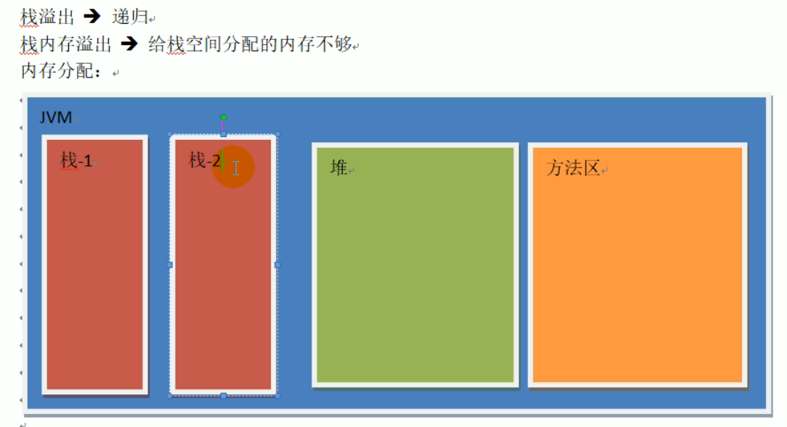

# Web知识

- 多个栈
  - 当有多线程时，会分配多个栈
  - 线程过多，栈内存不够用，容易溢出

- tomcat
  - 80个线程，多了性能低
  - 支持接受1000个请求
    - 如果有5000个请求，性能有瓶颈
  - 解决请求过多的问题
    - 增加服务器
    - 需要增加负载均衡服务器
- 负载均衡服务器
  - 当请求过多，==内网大量服务调用==同一类服务，使用负载均衡器有瓶颈
  - 注册中心的出现
- 注册中心
  - 服务消费方请求注册中心，获取服务提供方的地址，然后消费方自己去访问提供方的服务
  - 负载均衡的功能在服务提供方处理
    - 客户端的负载均衡
  - 当有服务提供方宕机
    - 通知注册中心

