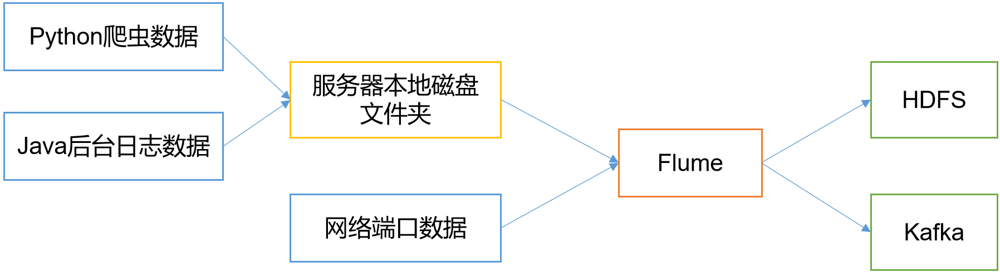
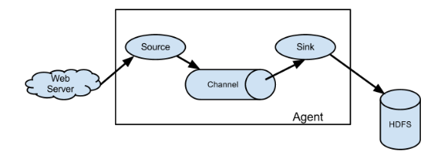
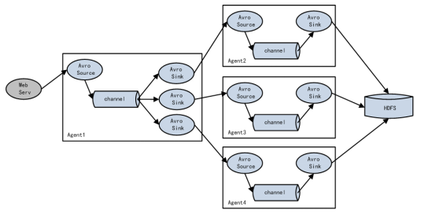
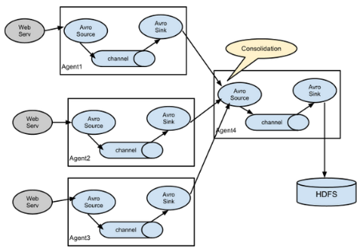

# 定义

- Flume
  - Cloudera提供
  - 高可用
  - 高可靠
  - ==分布式的海量日志采集、聚合和传输的系统==
  - 基于流式架构，灵活简单
  - 主要作用
    - 实时读取服务本地磁盘数据，写入HDFS

# 优点

- 与任意存储进程集成
- 输入的的数据速率大于写入目的存储的速率，flume会进行缓冲，减小hdfs的压力
- flume中的事务基于channel，使用了两个事务模型（sender + receiver）
  - 确保消息被可靠发送
- Flume使用**两个独立的事务**
  - 从soucrce到channel事件传递
    - 一旦事务中所有的数据全部成功提交到channel，那么source才认为该数据读取完成
  - 从channel到sink的事件传递
    - 只有成功被sink写出去的数据，才会从channel中移除

# 架构

## Agent

- 是一个JVM进程

- 以事件的形式将数据从源头送至目的

- 主要有3个部分组成

  - Source

  - Channel

  - Sink

    

## Source

- 负责接收数据到Flume Agent的组件
- 处理各种类型和格式的日志数据
  - avro
  - thrift
  - ==exec==
  - jms
  - ==spooling directory==
  - netcat
  - sequence generator
  - ==syslog==
  - http
  - legacy

## Put 事务

- doPut
  - 将批数据线写入临时缓冲区putList
- doCommit
  - 检查channel内存队列是否足够合并
- doRollback
  - channel 内存空间不足，回滚数据

## Channel

- ==位于Source和Sink之间的缓冲区==

- 允许Source和Sink运作在不同的速率上

- 线程安全的

- 可同时处理几个Source的写入操作和几个Sink的读取操作

- 自带两种Channel

  - Memory Channel

    - 是内存中的队列
    - ==在不需要关心数据丢失的情景下适用==

  - File Channel

    - ==将所有事件写到磁盘==

    - 在程序关闭或机器宕机的情况下不会丢失数据

      

## Sink

- ==不断地轮询Channel中的事件且批量地移除它们==
- ==将事件批量写入到存储或索引系统、或者被发送到另一个Flume Agent==
- ==具有完全事务性==
  - 在从Channel批量删除数据之前，每个Sink用Channel启动一个事务
  - 批量事件一旦成功写出到存储系统或下一个Flume Agent，Sink就利用Channel提交事务
  - 事务一旦被提交，该Channel从自己的内部缓冲区删除事件
- 目的地
  - ==hdfs==
  - ==kafka==
  - logger
  - avro
  - thrift
  - ipc
  - file
  - null
  - HBase
  - solr
  - 自定义

## Take 事务

- doTake
  - 先将数据取到临时缓冲区 takeList
- doCommit
  - 如果数据全部发送成功，清除临时缓冲区taskList
- doRollback
  - 数据发送过程中如果出现异常，rollback将临时缓冲区taskList中的数据归还给channel内存队列

## Event

- Flume数据传输的基本单元
- 以事件的形式将数据从源头送至目的地。 
- 由可选的header和载有数据的一个byte array 构成
- Header是容纳了key-value 字符串对的HashMap

# 拓扑结构

## Agent连接

- 将多个flume给顺序连接起来

- 从最初的source开始到最终sink传送的目的存储系统

- 此模式不建议桥接过多的flume数量

  - flume数量过多会影响传输速率

  - 一旦传输过程中某个节点flume宕机，会影响整个传输系统

    

## 复制（单source，多channel、sink）

- 支持将事件流向一个或者多个目的地
- 这种模式将数据源复制到多个channel中
- ==每个channel都有相同的数据==，复制
- sink可以选择传送的不同的目的地

## 负载均衡

- 支持使用将多个sink逻辑上分到一个sink组，flume将数据发送到不同的sink
- 主要解决负载均衡和故障转移问题

## Agent聚合（常用）

- 该模式最常见，非常实用
- 日常web应用通常分布在上百个服务器，大者甚至上千个、上万个服务器产生的日志，处理起来也非常麻烦
- 用flume的这种组合方式能很好的解决这一问题
  - ==每台服务器部署一个flume采集日志==
  - 传送到一个集中收集日志的flume，再由此flume上传到hdfs、hive、hbase、jms等，进行日志分析 
