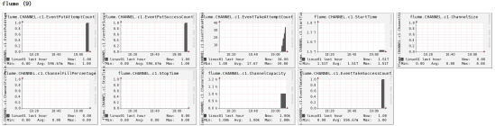

# 部署

- 安装httpd服务与php

```bash
[ttshe@hadoop102 flume]$ sudo yum -y install httpd php
```

- 安装其他依赖

```bash
[ttshe@hadoop102 flume]$ sudo yum -y install rrdtool perl-rrdtool rrdtool-devel
[ttshe@hadoop102 flume]$ sudo yum -y install apr-devel
```

- 安装ganglia

```bash
[ttshe@hadoop102 flume]$ sudo rpm -Uvh http://dl.fedoraproject.org/pub/epel/6/x86_64/epel-release-6-8.noarch.rpm
[ttshe@hadoop102 flume]$ sudo yum -y install ganglia-gmetad 
[ttshe@hadoop102 flume]$ sudo yum -y install ganglia-web
[ttshe@hadoop102 flume]$ sudo yum install -y ganglia-gmond
```


# 说明

- Ganglia
  - gmond
    - Ganglia Monitoring Daemon
    - 是一种轻量级服务，安装在每台需要收集指标数据的节点主机上
    - 可以很容易收集很多系统指标数据
      - 如CPU
      - 内存
      - 磁盘
      - 网络和活跃进程的数据等
  - gmetad
    - Ganglia Meta Daemon
    - 整合所有信息
    - 以RRD格式存储至磁盘的服务
  - gweb
    - Ganglia Web
    - Ganglia可视化工具
    - 利用浏览器显示gmetad所存储数据的PHP前端
    - 在Web界面中以图表方式展现集群的运行状态下收集的多种不同指标数据


# 配置

- 修改`/etc/httpd/conf.d/ganglia.conf`

```bash
[ttshe@hadoop102 flume]$ sudo vim /etc/httpd/conf.d/ganglia.conf
```

```bash
# Ganglia monitoring system php web frontend
Alias /ganglia /usr/share/ganglia
<Location /ganglia>
  Order deny,allow
  #Deny from all
  Allow from all
  # Allow from 127.0.0.1
  # Allow from ::1
  # Allow from .example.com
</Location>
```

- 修改`/etc/ganglia/gmetad.conf`

```bash
[ttshe@hadoop102 flume]$ sudo vim /etc/ganglia/gmetad.conf
data_source "hadoop102" 192.168.1.102
```

- 修改`/etc/ganglia/gmond.conf `

```bash
[ttshe@hadoop102 flume]$ sudo vim /etc/ganglia/gmond.conf
```

```bash
cluster {
  name = "hadoop102" #***
  owner = "unspecified"
  latlong = "unspecified"
  url = "unspecified"
}
udp_send_channel {
  #bind_hostname = yes # Highly recommended, soon to be default.
                       # This option tells gmond to use a source address
                       # that resolves to the machine's hostname.  Without
                       # this, the metrics may appear to come from any
                       # interface and the DNS names associated with
                       # those IPs will be used to create the RRDs.
  # mcast_join = 239.2.11.71
  host = 192.168.1.102 #***
  port = 8649
  ttl = 1
}
udp_recv_channel {
  # mcast_join = 239.2.11.71 #***
  port = 8649
  bind = 192.168.1.102 #***
  retry_bind = true
  # Size of the UDP buffer. If you are handling lots of metrics you really
  # should bump it up to e.g. 10MB or even higher.
  # buffer = 10485760
}
```

- 修改 `/etc/selinux/config`

```bash
[ttshe@hadoop102 flume]$ sudo vim /etc/selinux/config
```

```bash
# This file controls the state of SELinux on the system.
# SELINUX= can take one of these three values:
#     enforcing - SELinux security policy is enforced.
#     permissive - SELinux prints warnings instead of enforcing.
#     disabled - No SELinux policy is loaded.
SELINUX=disabled #***
# SELINUXTYPE= can take one of these two values:
#     targeted - Targeted processes are protected,
#     mls - Multi Level Security protection.
SELINUXTYPE=targeted
```

- 注意
  - selinux本次生效关闭必须重启，如果此时不想重启，可以临时生效之

```bash
[ttshe@hadoop102 flume]$ sudo setenforce 0
```


# 启动

```bash
[ttshe@hadoop102 flume]$ sudo service httpd start
[ttshe@hadoop102 flume]$ sudo service gmetad start
[ttshe@hadoop102 flume]$ sudo service gmond start
```


# 测试

- 访问页面http://192.168.1.102/ganglia

  - 如果完成以上操作依然出现权限不足错误，请修改/var/lib/ganglia目录的权限

  ```bash
  [ttshe@hadoop102 flume]$ sudo chmod -R 777 /var/lib/ganglia
  ```

- 操作Flume测试监控

- 修改`/opt/module/flume/conf`目录下的flume-env.sh配置

```bash
EXPORT JAVA_OPTS="-Dflume.monitoring.type=ganglia
-Dflume.monitoring.hosts=192.168.1.102:8649
-Xms100m
-Xmx200m"
```

- 启动 Flume任务

```bash
[ttshe@hadoop102 flume]$ bin/flume-ng agent \
--conf conf/ \
--name a1 \
--conf-file job/flume-netcat-logger.conf \
-Dflume.root.logger==INFO,console \
-Dflume.monitoring.type=ganglia \
-Dflume.monitoring.hosts=192.168.1.102:8649
```

- 观察发送的数据

```bash
[ttshe@hadoop102 flume]$ nc localhost 44444
```




# 参数说明

| 字段（图表名称）      | 字段含义                                                     |
| --------------------- | ------------------------------------------------------------ |
| EventPutAttemptCount  | source尝试写入channel的事件总数量                            |
| EventPutSuccessCount  | 成功写入channel且提交的事件总数量                            |
| EventTakeAttemptCount | sink尝试从channel拉取事件的总数量。这不意味着每次事件都被返回，因为sink拉取的时候channel可能没有任何数据。 |
| EventTakeSuccessCount | sink成功读取的事件的总数量                                   |
| StartTime             | channel启动的时间（毫秒）                                    |
| StopTime              | channel停止的时间（毫秒）                                    |
| ChannelSize           | 目前channel中事件的总数量                                    |
| ChannelFillPercentage | channel占用百分比                                            |
| ChannelCapacity       | channel的容量                                                |

