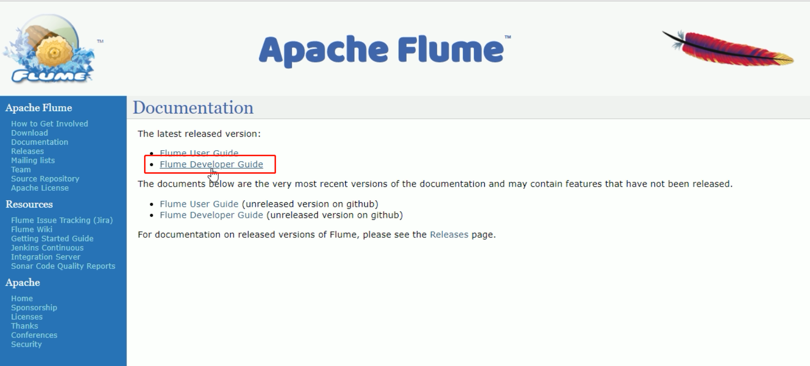

# 自定义Source

- 自定义的消息有两种类型的Source

  - PollableSource
    - ==轮训拉取==
    - 通过线程不断去调用process方法，主动拉取消息
  - EventDrivenSource
    - ==事件驱动==
    - 需要触发一个调用机制，即被动等待

- 实现Configurable接口

  - 可通过配置的方式读取配置参数
  - 包含配置上下文

  




- 官方提供了自定义source的接口
  - https://flume.apache.org/FlumeDeveloperGuide.html#source
  - 自定义MySource
    - 继承AbstractSource类
    - 实现Configurable接口
    - 实现PollableSource接口
- 实现方法
  - getBackOffSleepIncrement()//暂不用
  - getMaxBackOffSleepInterval()//暂不用
  - configure(Context context)
    - 初始化context
    - 读取配置文件内容
  - process()
    - 获取数据封装成event并写入channel
    - ==这个方法将被循环调用==
- 使用场景
  - 读取MySQL数据或者其他文件系统。


- 需求
  - 使用flume接收数据，并给每条数据添加前缀，输出到控制台
  - 前缀从flume配置文件中配置


## pom

```xml
<dependency>
    <groupId>org.apache.flume</groupId>
    <artifactId>flume-ng-core</artifactId>
    <version>1.7.0</version>
</dependency>
```


## java

```java
package com.stt.demo.flume.Ch01_mySource;

import org.apache.flume.Context;
import org.apache.flume.EventDeliveryException;
import org.apache.flume.PollableSource;
import org.apache.flume.conf.Configurable;
import org.apache.flume.event.SimpleEvent;
import org.apache.flume.source.AbstractSource;

import java.util.HashMap;

// 使用Configurable 表示是可配置的

public class MySource extends AbstractSource implements Configurable, PollableSource {
    //定义配置文件将来要读取的字段
    private Long delay;
    private String field;
    //初始化配置信息
    @Override
    public void configure(Context context) {
        delay = context.getLong("delay");
        field = context.getString("field", "Hello!");
    }

    @Override
    public Status process() throws EventDeliveryException {
        try {
            //创建事件头信息
            HashMap<String, String> hearderMap = new HashMap<>();
            //创建事件
            SimpleEvent event = new SimpleEvent();
            //循环封装事件
            for (int i = 0; i < 5; i++) {
                //给事件设置头信息
                event.setHeaders(hearderMap);
                //给事件设置内容
                event.setBody((field + i).getBytes());
                //将事件写入channel
                getChannelProcessor().processEvent(event);
                Thread.sleep(delay);
            }
        } catch (Exception e) {
            e.printStackTrace();
            return Status.BACKOFF;
        }
        return Status.READY;
    }

    @Override
    public long getBackOffSleepIncrement() {
        return 0;
    }
    @Override
    public long getMaxBackOffSleepInterval() {
        return 0;
    }
}
```


## 打包

- 将写好的代码打包，并放到flume的lib目录（/opt/module/flume）下

  

## 配置

```bash
# Name the components on this agent
a1.sources = r1
a1.sinks = k1
a1.channels = c1

# Describe/configure the source
a1.sources.r1.type = com.stt.demo.flume.Ch01_mySource.MySource
a1.sources.r1.delay = 1000
a1.sources.r1.field = mySource-

# Describe the sink
a1.sinks.k1.type = logger

# Use a channel which buffers events in memory
a1.channels.c1.type = memory
a1.channels.c1.capacity = 1000
a1.channels.c1.transactionCapacity = 100

# Bind the source and sink to the channel
a1.sources.r1.channels = c1
a1.sinks.k1.channel = c1
```


## 启动

```bash
[ttshe@hadoop102 flume]$ bin/flume-ng agent -c conf/ -f job/mysource.conf -n a1 -Dflume.root.logger=INFO,console
```


# 自定义MySQLSource

- 实时监控MySQL，从MySQL中获取数据传输到HDFS或者其他存储框架
  - 需要自己实现MySQLSource
- 官方提供了自定义source的接口
- 官网说明：[https://flume.apache.org/FlumeDeveloperGuide.html#source](#source)


### 实现步骤

- 根据官方说明自定义mysqlsource
  - 继承AbstractSource类
  - 实现Configurable和PollableSource接口
- 实现相应方法
  - getBackOffSleepIncrement()
    - 暂不用
  - getMaxBackOffSleepInterval()
    - 暂不用
  - configure(Context context)
    - 初始化context
  - process()
    - 从mysql获取数据，业务处理比较复杂
    - 定义一个专门的类——SQLSourceHelper来处理跟mysql的交互
    - 封装成event并写入channel，这个方法被循环调用
  - stop()
    - 关闭相关的资源
- PollableSource
  - 从source中提取数据，将其发送到channel
- Configurable
  - 实现了Configurable的任何类都含有一个context
  - 使用context获取配置信息


### pom

```xml
<dependency>
    <groupId>org.apache.flume</groupId>
    <artifactId>flume-ng-core</artifactId>
    <version>1.7.0</version>
</dependency>
<dependency>
    <groupId>mysql</groupId>
    <artifactId>mysql-connector-java</artifactId>
    <version>5.1.27</version>
</dependency>
```


### 配置

- 在classpath下添加
- jdbc.properties

```properties
dbDriver=com.mysql.jdbc.Driver
dbUrl=jdbc:mysql://hadoop102:3306/mysqlsource?useUnicode=true&characterEncoding=utf-8
dbUser=root
dbPassword=000000
```

- log4j.properties

```properties
#--------console-----------
log4j.rootLogger=info,myconsole,myfile
log4j.appender.myconsole=org.apache.log4j.ConsoleAppender
log4j.appender.myconsole.layout=org.apache.log4j.SimpleLayout
#log4j.appender.myconsole.layout.ConversionPattern =%d [%t] %-5p [%c] - %m%n

#log4j.rootLogger=error,myfile
log4j.appender.myfile=org.apache.log4j.DailyRollingFileAppender
log4j.appender.myfile.File=/tmp/flume.log
log4j.appender.myfile.layout=org.apache.log4j.PatternLayout
log4j.appender.myfile.layout.ConversionPattern =%d [%t] %-5p [%c] - %m%n
```


### java

- SQLSourceHelper

| 属性                    | 说明（括号中为默认值）                     |
| ----------------------- | ------------------------------------------ |
| runQueryDelay           | 查询时间间隔（10000）                      |
| batchSize               | 缓存大小（100）                            |
| startFrom               | 查询语句开始id（0）                        |
| currentIndex            | 查询语句当前id，每次查询之前需要查元数据表 |
| recordSixe              | 查询返回条数                               |
| table                   | 监控的表名                                 |
| columnsToSelect         | 查询字段（*）                              |
| customQuery             | 用户传入的查询语句                         |
| query                   | 查询语句                                   |
| defaultCharsetResultSet | 编码格式（UTF-8）                          |

| 方法                                               | 说明                                            |
| -------------------------------------------------- | ----------------------------------------------- |
| SQLSourceHelper(Context context)                   | 构造方法，初始化属性及获取JDBC连接              |
| InitConnection(String url, String user, String pw) | 获取JDBC连接                                    |
| checkMandatoryProperties()                         | 校验相关属性是否设置（实际开发中可增加内容）    |
| buildQuery()                                       | 根据实际情况构建sql语句，返回值String           |
| executeQuery()                                     | 执行sql语句的查询操作，返回值List<List<Object>> |
| getAllRows(List<List<Object>> queryResult)         | 将查询结果转换为String，方便后续操作            |
| updateOffset2DB(int size)                          | 根据每次查询结果将offset写入元数据表            |
| execSql(String sql)                                | 具体执行sql语句方法                             |
| getStatusDBIndex(int startFrom)                    | 获取元数据表中的offset                          |
| queryOne(String sql)                               | 获取元数据表中的offset实际sql语句执行方法       |
| close()                                            | 关闭资源                                        |

```java
package com.atguigu.source;

import org.apache.flume.Context;
import org.apache.flume.conf.ConfigurationException;
import org.slf4j.Logger;
import org.slf4j.LoggerFactory;

import java.io.IOException;
import java.sql.*;
import java.text.ParseException;
import java.util.ArrayList;
import java.util.List;
import java.util.Properties;

public class SQLSourceHelper {

    private static final Logger LOG = LoggerFactory.getLogger(SQLSourceHelper.class);

    private int runQueryDelay, //两次查询的时间间隔
            startFrom,            //开始id
            currentIndex,	     //当前id
            recordSixe = 0,      //每次查询返回结果的条数
            maxRow;                //每次查询的最大条数


    private String table,       //要操作的表
            columnsToSelect,     //用户传入的查询的列
            customQuery,          //用户传入的查询语句
            query,                 //构建的查询语句
            defaultCharsetResultSet;//编码集

    //上下文，用来获取配置文件
    private Context context;

    //为定义的变量赋值（默认值），可在flume任务的配置文件中修改
    private static final int DEFAULT_QUERY_DELAY = 10000;
    private static final int DEFAULT_START_VALUE = 0;
    private static final int DEFAULT_MAX_ROWS = 2000;
    private static final String DEFAULT_COLUMNS_SELECT = "*";
    private static final String DEFAULT_CHARSET_RESULTSET = "UTF-8";

    private static Connection conn = null;
    private static PreparedStatement ps = null;
    private static String connectionURL, connectionUserName, connectionPassword;

    //加载静态资源
    static {
        Properties p = new Properties();
        try {
            p.load(SQLSourceHelper.class.getClassLoader().getResourceAsStream("jdbc.properties"));
            connectionURL = p.getProperty("dbUrl");
            connectionUserName = p.getProperty("dbUser");
            connectionPassword = p.getProperty("dbPassword");
            Class.forName(p.getProperty("dbDriver"));
        } catch (IOException | ClassNotFoundException e) {
            LOG.error(e.toString());
        }
    }

    //获取JDBC连接
    private static Connection InitConnection(String url, String user, String pw) {
        try {
            Connection conn = DriverManager.getConnection(url, user, pw);
            if (conn == null)
                throw new SQLException();
            return conn;
        } catch (SQLException e) {
            e.printStackTrace();
        }
        return null;
    }

    //构造方法
    SQLSourceHelper(Context context) throws ParseException {
        //初始化上下文
        this.context = context;

        //有默认值参数：获取flume任务配置文件中的参数，读不到的采用默认值
        this.columnsToSelect = context.getString("columns.to.select", DEFAULT_COLUMNS_SELECT);
        this.runQueryDelay = context.getInteger("run.query.delay", DEFAULT_QUERY_DELAY);
        this.startFrom = context.getInteger("start.from", DEFAULT_START_VALUE);
        this.defaultCharsetResultSet = context.getString("default.charset.resultset", DEFAULT_CHARSET_RESULTSET);

        //无默认值参数：获取flume任务配置文件中的参数
        this.table = context.getString("table");
        this.customQuery = context.getString("custom.query");
        connectionURL = context.getString("connection.url");
        connectionUserName = context.getString("connection.user");
        connectionPassword = context.getString("connection.password");
        conn = InitConnection(connectionURL, connectionUserName, connectionPassword);

        //校验相应的配置信息，如果没有默认值的参数也没赋值，抛出异常
        checkMandatoryProperties();
        //获取当前的id
        currentIndex = getStatusDBIndex(startFrom);
        //构建查询语句
        query = buildQuery();
    }

    //校验相应的配置信息（表，查询语句以及数据库连接的参数）
    private void checkMandatoryProperties() {
        if (table == null) {
            throw new ConfigurationException("property table not set");
        }
        if (connectionURL == null) {
            throw new ConfigurationException("connection.url property not set");
        }
        if (connectionUserName == null) {
            throw new ConfigurationException("connection.user property not set");
        }
        if (connectionPassword == null) {
            throw new ConfigurationException("connection.password property not set");
        }
    }

    //构建sql语句
    private String buildQuery() {
        String sql = "";
        //获取当前id
        currentIndex = getStatusDBIndex(startFrom);
        LOG.info(currentIndex + "");
        if (customQuery == null) {
            sql = "SELECT " + columnsToSelect + " FROM " + table;
        } else {
            sql = customQuery;
        }
        StringBuilder execSql = new StringBuilder(sql);
        //以id作为offset
        if (!sql.contains("where")) {
            execSql.append(" where ");
            execSql.append("id").append(">").append(currentIndex);
            return execSql.toString();
        } else {
            int length = execSql.toString().length();
            return execSql.toString().substring(0, length - String.valueOf(currentIndex).length()) + currentIndex;
        }
    }

    //执行查询
    List<List<Object>> executeQuery() {
        try {
            //每次执行查询时都要重新生成sql，因为id不同
            customQuery = buildQuery();
            //存放结果的集合
            List<List<Object>> results = new ArrayList<>();
            if (ps == null) {
                //
                ps = conn.prepareStatement(customQuery);
            }
            ResultSet result = ps.executeQuery(customQuery);
            while (result.next()) {
                //存放一条数据的集合（多个列）
                List<Object> row = new ArrayList<>();
                //将返回结果放入集合
                for (int i = 1; i <= result.getMetaData().getColumnCount(); i++) {
                    row.add(result.getObject(i));
                }
                results.add(row);
            }
            LOG.info("execSql:" + customQuery + "\nresultSize:" + results.size());
            return results;
        } catch (SQLException e) {
            LOG.error(e.toString());
            // 重新连接
            conn = InitConnection(connectionURL, connectionUserName, connectionPassword);
        }
        return null;
    }

    //将结果集转化为字符串，每一条数据是一个list集合，将每一个小的list集合转化为字符串
    List<String> getAllRows(List<List<Object>> queryResult) {
        List<String> allRows = new ArrayList<>();
        if (queryResult == null || queryResult.isEmpty())
            return allRows;
        StringBuilder row = new StringBuilder();
        for (List<Object> rawRow : queryResult) {
            Object value = null;
            for (Object aRawRow : rawRow) {
                value = aRawRow;
                if (value == null) {
                    row.append(",");
                } else {
                    row.append(aRawRow.toString()).append(",");
                }
            }
            allRows.add(row.toString());
            row = new StringBuilder();
        }
        return allRows;
    }

    //更新offset元数据状态，每次返回结果集后调用。必须记录每次查询的offset值，为程序中断续跑数据时使用，以id为offset
    void updateOffset2DB(int size) {
        //以source_tab做为KEY，如果不存在则插入，存在则更新（每个源表对应一条记录）
        String sql = "insert into flume_meta(source_tab,currentIndex) VALUES('"
                + this.table
                + "','" + (recordSixe += size)
                + "') on DUPLICATE key update source_tab=values(source_tab),currentIndex=values(currentIndex)";
        LOG.info("updateStatus Sql:" + sql);
        execSql(sql);
    }

    //执行sql语句
    private void execSql(String sql) {
        try {
            ps = conn.prepareStatement(sql);
            LOG.info("exec::" + sql);
            ps.execute();
        } catch (SQLException e) {
            e.printStackTrace();
        }
    }

    //获取当前id的offset
    private Integer getStatusDBIndex(int startFrom) {
        //从flume_meta表中查询出当前的id是多少
        String dbIndex = queryOne("select currentIndex from flume_meta where source_tab='" + table + "'");
        if (dbIndex != null) {
            return Integer.parseInt(dbIndex);
        }
        //如果没有数据，则说明是第一次查询或者数据表中还没有存入数据，返回最初传入的值
        return startFrom;
    }

    //查询一条数据的执行语句(当前id)
    private String queryOne(String sql) {
        ResultSet result = null;
        try {
            ps = conn.prepareStatement(sql);
            result = ps.executeQuery();
            while (result.next()) {
                return result.getString(1);
            }
        } catch (SQLException e) {
            e.printStackTrace();
        }
        return null;
    }

    //关闭相关资源
    void close() {
        try {
            ps.close();
            conn.close();
        } catch (SQLException e) {
            e.printStackTrace();
        }
    }

    int getCurrentIndex() {
        return currentIndex;
    }

    void setCurrentIndex(int newValue) {
        currentIndex = newValue;
    }

    int getRunQueryDelay() {
        return runQueryDelay;
    }

    String getQuery() {
        return query;
    }

    String getConnectionURL() {
        return connectionURL;
    }

    private boolean isCustomQuerySet() {
        return (customQuery != null);
    }

    Context getContext() {
        return context;
    }

    public String getConnectionUserName() {
        return connectionUserName;
    }

    public String getConnectionPassword() {
        return connectionPassword;
    }

    String getDefaultCharsetResultSet() {
        return defaultCharsetResultSet;
    }
}
```


- MySQLSource

```java
package com.atguigu.source;

import org.apache.flume.Context;
import org.apache.flume.Event;
import org.apache.flume.EventDeliveryException;
import org.apache.flume.PollableSource;
import org.apache.flume.conf.Configurable;
import org.apache.flume.event.SimpleEvent;
import org.apache.flume.source.AbstractSource;
import org.slf4j.Logger;
import org.slf4j.LoggerFactory;

import java.text.ParseException;
import java.util.ArrayList;
import java.util.HashMap;
import java.util.List;

public class SQLSource extends AbstractSource implements Configurable, PollableSource {

    //打印日志
    private static final Logger LOG = LoggerFactory.getLogger(SQLSource.class);
    //定义sqlHelper
    private SQLSourceHelper sqlSourceHelper;


    @Override
    public long getBackOffSleepIncrement() {
        return 0;
    }

    @Override
    public long getMaxBackOffSleepInterval() {
        return 0;
    }

    @Override
    public void configure(Context context) {
        try {
            //初始化
            sqlSourceHelper = new SQLSourceHelper(context);
        } catch (ParseException e) {
            e.printStackTrace();
        }
    }

    @Override
    public Status process() throws EventDeliveryException {
        try {
            //查询数据表
            List<List<Object>> result = sqlSourceHelper.executeQuery();
            //存放event的集合
            List<Event> events = new ArrayList<>();
            //存放event头集合
            HashMap<String, String> header = new HashMap<>();
            //如果有返回数据，则将数据封装为event
            if (!result.isEmpty()) {
                List<String> allRows = sqlSourceHelper.getAllRows(result);
                Event event = null;
                for (String row : allRows) {
                    event = new SimpleEvent();
                    event.setBody(row.getBytes());
                    event.setHeaders(header);
                    events.add(event);
                }
                //将event写入channel
                this.getChannelProcessor().processEventBatch(events);
                //更新数据表中的offset信息
                sqlSourceHelper.updateOffset2DB(result.size());
            }
            //等待时长
            Thread.sleep(sqlSourceHelper.getRunQueryDelay());
            return Status.READY;
        } catch (InterruptedException e) {
            LOG.error("Error procesing row", e);
            return Status.BACKOFF;
        }
    }

    @Override
    public synchronized void stop() {
        LOG.info("Stopping sql source {} ...", getName());
        try {
            //关闭资源
            sqlSourceHelper.close();
        } finally {
            super.stop();
        }
    }
}
```


### 测试

- jar包准备
  - 将mysql驱动包放入flume的lib目录下

```bash
[ttshe@hadoop102 flume]$ cp /opt/sorfware/mysql-libs/mysql-connector-java-5.1.27/mysql-connector-java-5.1.27-bin.jar /opt/module/flume/lib/
```

- 打包项目并将jar包放入flume的lib目录下


### 配置文件

- 创建配置文件

```bash
[ttshe@hadoop102 job]$ touch mysql.conf
[ttshe@hadoop102 job]$ vim mysql.conf
```

```bash
# Name the components on this agent
a1.sources = r1
a1.sinks = k1
a1.channels = c1

# Describe/configure the source
a1.sources.r1.type = com.atguigu.source.SQLSource  
a1.sources.r1.connection.url = jdbc:mysql://192.168.1.102:3306/mysqlsource
a1.sources.r1.connection.user = root  
a1.sources.r1.connection.password = 000000  
a1.sources.r1.table = student  
a1.sources.r1.columns.to.select = *  
#a1.sources.r1.incremental.column.name = id  
#a1.sources.r1.incremental.value = 0 
a1.sources.r1.run.query.delay=5000

# Describe the sink
a1.sinks.k1.type = logger

# Describe the channel
a1.channels.c1.type = memory
a1.channels.c1.capacity = 1000
a1.channels.c1.transactionCapacity = 100

# Bind the source and sink to the channel
a1.sources.r1.channels = c1
a1.sinks.k1.channel = c1
```


### MySql准备

- 创建mysqlsource数据库

```sql
CREATE DATABASE mysqlsource;
```

- 在mysqlsource数据库下创建数据表student和元数据表flume_meta

```sql
CREATE TABLE `student` (
`id` int(11) NOT NULL AUTO_INCREMENT,
`name` varchar(255) NOT NULL,
PRIMARY KEY (`id`)
);
CREATE TABLE `flume_meta` (
`source_tab` varchar(255) NOT NULL,
`currentIndex` varchar(255) NOT NULL,
PRIMARY KEY (`source_tab`)
);
```

- 向数据表中添加数据

```sql
1 zhangsan
2 lisi
3 wangwu
4 zhaoliu
```


### 测试

```bash
[ttshe@hadoop102 flume]$ bin/flume-ng agent -c conf/ -n a1 -f job/mysql.conf -Dflume.root.logger=INFO,console
```

- 结果

 

