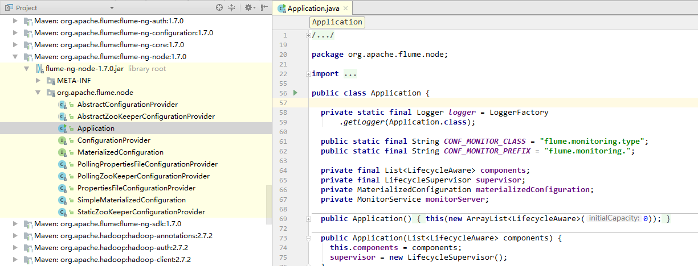
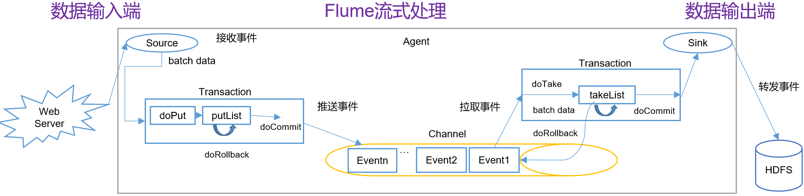

# 内部原理


# 源码解析

- 引入pom

```xml
<dependency>
    <groupId>org.apache.flume</groupId>
    <artifactId>flume-ng-node</artifactId>
    <version>1.7.0</version>
</dependency>
```

- 在idea中按下2次shift键，进行搜索
  - 搜索Application
    - 由于flume-ng命令的入口是该Application，因此从这个入口开始
  - 在org.apache.flume.node下



- main方法

```java
Application
main
	// 命令行解析器
 	CommandLineParser parser = new GnuParser();
	// 解析命令行
	CommandLine commandLine = parser.parse(options, args);
	// 判断reload 默认true，30s定时读取配置，如果配置有更新，则重新加载
	// 加载配置信息
	application.handleConfigurationEvent(configurationProvider.getConfiguration());
	// 启动应用，
    application.start();
```

- `configurationProvider.getConfiguration()`

```java
AbstractConfigurationProvider
getConfiguration
	loadChannels(agentConf, channelComponentMap);
	// 加载source
	loadSources(agentConf, channelComponentMap, sourceRunnerMap);
		// 读取SourceRunner中的source类型，关注forSource
        sourceRunnerMap.put(comp.getComponentName(),
              SourceRunner.forSource(source));
	// 加载sink
	loadSinks(agentConf, channelComponentMap, sinkRunnerMap);
		sink.setChannel(channelComponent.channel);
```

- `SourceRunner.forSource`
  - 说明实现的Source必须是如下两个中的一个
    - PollableSource
    - EventDrivenSource

```java
public static SourceRunner forSource(Source source) {
    SourceRunner runner = null;
    if(source instanceof PollableSource) {
        runner = new PollableSourceRunner();
        ((PollableSourceRunner)runner).setSource((PollableSource)source);
    } else {
        if(!(source instanceof EventDrivenSource)) {
            throw new IllegalArgumentException("No known runner type for source " + source);
        }
        runner = new EventDrivenSourceRunner();
        ((EventDrivenSourceRunner)runner).setSource((EventDrivenSource)source);
    }
    return (SourceRunner)runner;
}
```

- 结构分析
  - LifecycleAware
    - 子类
      - Channel
      - SourceRunner
        - 在`SourceRunner.forSource`方法中将source放入runner中
        - PollableSourceRunner
        - EventDrivenSourceRunner
      - SinkRunner
- `application.start()`
  - 将所有的LifecycleAware子类组件放入LifecycleSupervisor的监视方法中
    - 将组件封装到MonitorRunnable对象中
      - MonitorRunnable的run方法调用LifecycleAware的start和stop方法
    - 该方法有一个定时线程池，每隔3s执行一次MonitorRunnable对象的run方法
  - PollableSourceRunner和EventDrivenSourceRunner实现了LifecycleAware接口的start方法
    - 执行PollableSource source = (PollableSource) getSource()，然后执行source.start()
    - 开启一个线程执行PollableSourceRunner的run方法
      - 不断执行PollableSource::process方法
- 查看ExecSource执行
  - run方法
    - flushEventBatch(eventList)
      - channelProcessor.processEventBatch(eventList)
        - reqChannel.getTransaction()
          - 开始执行event的doPut的事务操作
          - reqChannel.put(event);
          - reqChannel的类别
            - 都继承BasicChannelSemantics
              - 该抽象类下有put方法
                - 调用子类的doPut方法
            - MemoryChannel
              - 含有MemoryTransaction
                - private LinkedBlockingDeque<Event> takeList;
                - private LinkedBlockingDeque<Event> putList;
              - doPut(Event event)
              - doTake() 
            - FileChannel
- Sink与Source类似
- 说明
  - 从MemoryChannel来看，doPut和doTake的事务环节是在Channel中的，而非独立在外的



- 查看PollableSource执行

  - 被PollableSourceRunner的start调用
    - 启动一个线程，while执行
    - 如果PollableSource的process的结果不为BACKOFF，那么再次执行process
      - 如果是BACKOFF，则睡眠一段时间再执行
    - 不断执行process方法

  ```java
  @Override
  public void run() {
      logger.debug("Polling runner starting. Source:{}", source);
  
      while (!shouldStop.get()) {
          counterGroup.incrementAndGet("runner.polls");
          try {
              if (source.process().equals(PollableSource.Status.BACKOFF)) {
                  counterGroup.incrementAndGet("runner.backoffs");
  
                  Thread.sleep(Math.min(
                      counterGroup.incrementAndGet("runner.backoffs.consecutive")
                      * source.getBackOffSleepIncrement(), source.getMaxBackOffSleepInterval()));
              } else {
                  counterGroup.set("runner.backoffs.consecutive", 0L);
              }
  ```