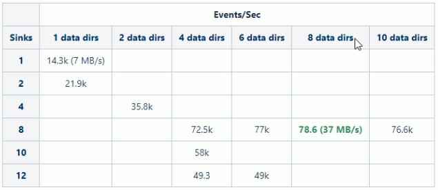
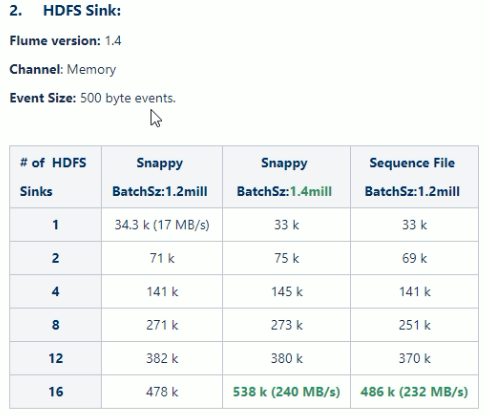

# flume 压测 benchmark

- 吞吐量：一般是60M/s极限，不含压缩

https://cwiki.apache.org/confluence/display/FLUME/Performance+Measurements+-+round+2

- 吞吐量，单台服务器，网卡流量
- 千兆网卡，120MB
- 不同的硬件压测的标准不一样
- eventSize：500byte events
- channel：file
- version：1.4
- source：4 个source，100k batchSize
- HDFS sink batch size：500,000
- 内存164G，志强处理器2640，机械硬盘

 

- 横向添加多个磁盘
- 纵向添加多个sink

 

- 含有压缩

