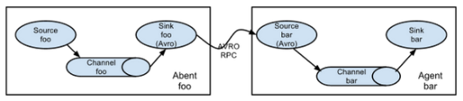
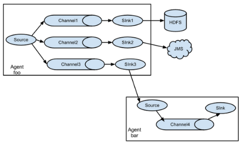
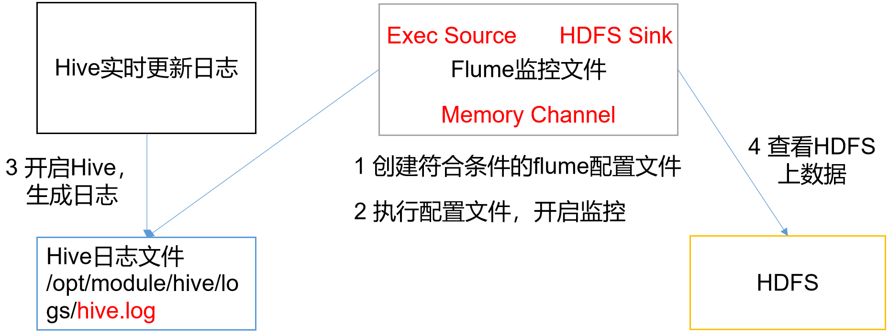
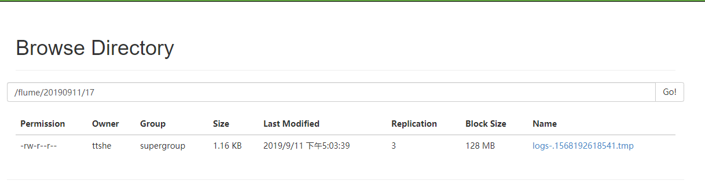
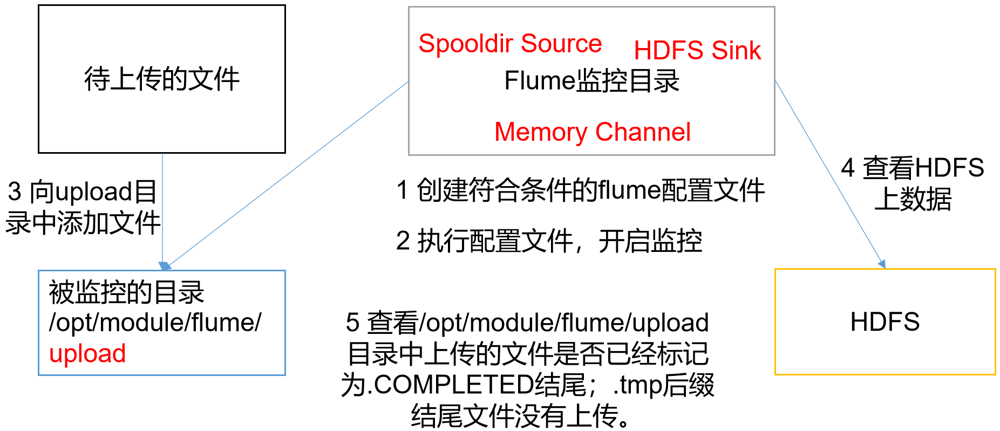
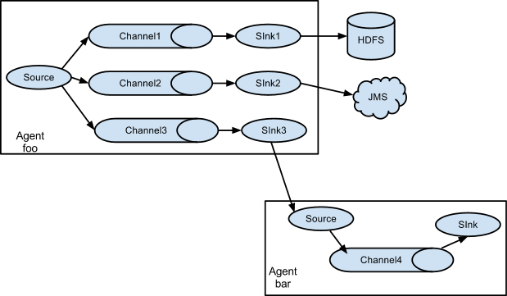
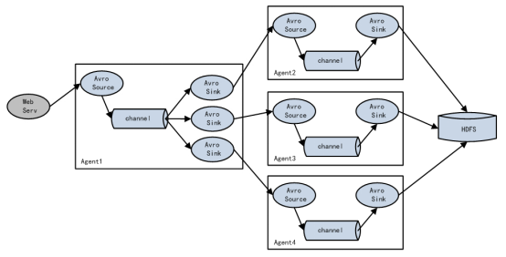
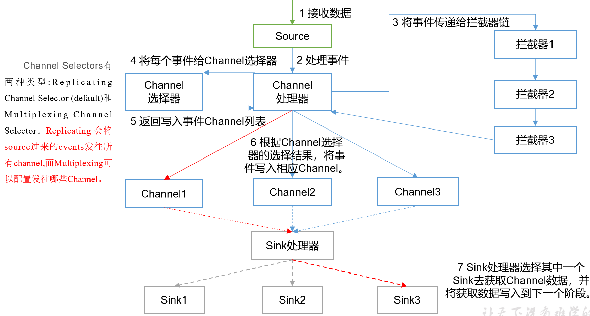
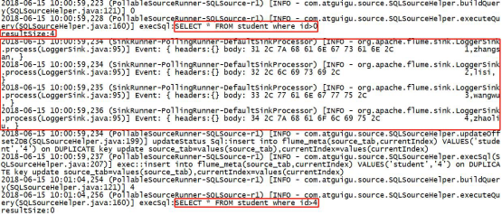

# Web知识

- 多个栈
  - 当有多线程时，会分配多个栈
  - 线程过多，栈内存不够用，容易溢出


- tomcat
  - 80个线程，多了性能低
  - 支持接受1000个请求
    - 如果有5000个请求，性能有瓶颈
  - 解决请求过多的问题
    - 增加服务器
    - 需要增加负载均衡服务器
- 负载均衡服务器
  - 当请求过多，负载均衡器有瓶颈
  - 注册中心的出现
- 注册中心
  - 服务消费方请求注册中心，获取服务提供方的地址，然后消费方自己去访问提供方的服务
  - 负载均衡的功能在服务提供方处理
    - 客户端的负载均衡
  - 当有服务提供方宕机
    - 通知注册中心


# 概述


## 定义

- Flume
  - Cloudera提供
  - 高可用
  - 高可靠
  - ==分布式的海量日志采集、聚合和传输的系统==
  - 基于流式架构，灵活简单
  - 主要作用
    - 实时读取服务本地磁盘数据，写入HDFS


## 优点


- 与任意存储进程集成

- 输入的的数据速率大于写入目的存储的速率，flume会进行缓冲，减小hdfs的压力

- flume中的事务基于channel，使用了两个事务模型（sender + receiver）
  - 确保消息被可靠发送

- Flume使用**两个独立的事务**
  - 从soucrce到channel事件传递
    - 一旦事务中所有的数据全部成功提交到channel，那么source才认为该数据读取完成
  - 从channel到sink的事件传递
    - 只有成功被sink写出去的数据，才会从channel中移除


## 架构


### Agent

- 是一个JVM进程

- 以事件的形式将数据从源头送至目的

- t主要有3个部分组成

  - Source

  - Channel

  - Sink

    

### Source

- 负责接收数据到Flume Agent的组件
- 处理各种类型和格式的日志数据
  - avro
  - thrift
  - ==exec==
  - jms
  - ==spooling directory==
  - netcat
  - sequence generator
  - ==syslog==
  - http
  - legacy


### Put 事务

- doPut
  - 将批数据线写入临时缓冲区putList
- doCommit
  - 检查channel内存队列是否足够合并
- doRollback
  - channel 内存空间不足，回滚数据


### Channel

- ==是位于Source和Sink之间的缓冲区==
- 允许Source和Sink运作在不同的速率上
- 线程安全的
- 可同时处理几个Source的写入操作和几个Sink的读取操作

- 自带两种Channel

  - Memory Channel

    - 是内存中的队列
    - ==在不需要关心数据丢失的情景下适用==

  - File Channel

    - ==将所有事件写到磁盘==

    - 在程序关闭或机器宕机的情况下不会丢失数据

      

### Sink

- ==不断地轮询Channel中的事件且批量地移除它们==
- ==将事件批量写入到存储或索引系统、或者被发送到另一个Flume Agent==

- ==具有完全事务性==
  - 在从Channel批量删除数据之前，每个Sink用Channel启动一个事务
  - 批量事件一旦成功写出到存储系统或下一个Flume Agent，Sink就利用Channel提交事务
  - 事务一旦被提交，该Channel从自己的内部缓冲区删除事件

- 目的地
  - ==hdfs==
  - ==kafka==
  - logger
  - avro
  - thrift
  - ipc
  - file
  - null
  - HBase
  - solr
  - 自定义


### Take 事务

- doTake
  - 先将数据取到临时缓冲区 takeList
- doCommit
  - 如果数据全部发送成功，清除临时缓冲区taskList
- doRollback
  - 数据发送过程中如果出现异常，rollback将临时缓冲区taskList中的数据归还给channel内存队列


### Event

- Flume数据传输的基本单元
- 以事件的形式将数据从源头送至目的地。 
- 由可选的header和载有数据的一个byte array 构成
- Header是容纳了key-value字符串对的HashMap


## 拓扑结构


### Agent连接



- 将多个flume给顺序连接起来

- 从最初的source开始到最终sink传送的目的存储系统

- 此模式不建议桥接过多的flume数量

  -  flume数量过多会影响传输速率

  - 一旦传输过程中某个节点flume宕机，会影响整个传输系统

    

### 单source，多channel、sink



- 支持将事件流向一个或者多个目的地
- 这种模式将数据源复制到多个channel中
- ==每个channel都有相同的数据==
- sink可以选择传送的不同的目的地


### 负载均衡


- 支持使用将多个sink逻辑上分到一个sink组，flume将数据发送到不同的sink
- 主要解决负载均衡和故障转移问题


### Agent聚合


- 该模式最常见，非常实用
- 日常web应用通常分布在上百个服务器，大者甚至上千个、上万个服务器产生的日志，处理起来也非常麻烦
- 用flume的这种组合方式能很好的解决这一问题，每台服务器部署一个flume采集日志
  - 传送到一个集中收集日志的flume，再由此flume上传到hdfs、hive、hbase、jms等，进行日志分析


# 安装


## 地址

- 官网地址  http://flume.apache.org/

- 文档查看地址 http://flume.apache.org/FlumeUserGuide.html

- 下载地址 http://archive.apache.org/dist/flume/


## 部署

- 将apache-flume-1.7.0-bin.tar.gz上传到linux的/opt/software目录下

- 解压apache-flume-1.7.0-bin.tar.gz到/opt/module/目录下

```bash
[ttshe@hadoop102 software]$ tar -zxf apache-flume-1.7.0-bin.tar.gz -C /opt/module/
```

- 修改apache-flume-1.7.0-bin的名称为flume

```sql
[ttshe@hadoop102 module]$ mv apache-flume-1.7.0-bin/ flume/
```

-  将flume/conf下的flume-env.sh.template文件修改为flume-env.sh
- 配置flume-env.sh文件

```bash
[ttshe@hadoop102 conf]$ cp flume-env.sh.template flume-env.sh
[ttshe@hadoop102 conf]$ vi flume-env.sh
export JAVA_HOME=/opt/module/jdk1.8.0_144
```


# 使用示例

- flume封装的比较齐备，大部分场景下只需要写配置文件即可
- flume支持导入文本数据格式
  - log
  - txt


## 官方案例

- 需求
  - 首先启动Flume任务，监控本机44444端口，服务端

  - 然后通过netcat工具向本机44444端口发送消息，客户端
  - 最后Flume将监听的数据实时显示在控制台


### 安装netcat

- 也可以使用telnet
- 安装netcat

```bash
[ttshe@hadoop102 module]$ sudo yum install -y nc
```


### 判断端口占用

- 判断44444端口是否被占用

```bash
[ttshe@hadoop102 module]$ sudo netstat -tunlp | grep 44444
```

- netstat功能描述

  - 是一个监控TCP/IP网络的非常有用的工具，可显示路由表、实际的网络连接以及每一个网络接口设备的状态信息。

  - 基本语法
    - netstat [选项]

  - 选项参数
    - -t或--tcp
      - 显示TCP传输协议的连线状况
    - -u或--udp
      - 显示UDP传输协议的连线状况
    - -n或--numeric
      - 直接使用ip地址，而不通过域名服务器
    - -l或--listening
      - 显示监控中的服务器的Socket
    - -p或--programs
      - 显示正在使用Socket的程序识别码（PID）和程序名称


### 创建配置文件

- 参考http://flume.apache.org/FlumeUserGuide.html

- 在flume目录下创建job文件夹

```bash
[ttshe@hadoop102 flume]$ mkdir job
```

- 在job文件夹下创建Flume Agent配置文件flume-netcat-logger.conf

```bash
[ttshe@hadoop102 flume]$ cd job
[ttshe@hadoop102 job]$ touch flume-netcat-logger.conf
```

- 在flume-netcat-logger.conf文件中添加如下内容
  - 需要用面向对象的思想考虑配置文件的组成

```bash
[ttshe@hadoop102 job]$ vim flume-netcat-logger.conf 
```

```bash
# Name the components on this agent 
# a1 表示agent的对象的名称
# 注意这里的source 与 sink以及channel是复数，使用空格可以配置多个
a1.sources = r1  # r1 表示a1 的输入源
a1.sinks = k1    # k1 表示a1 的输出目的地
a1.channels = c1 # c1 表示a1 的缓冲区

# Describe/configure the source
a1.sources.r1.type = netcat    # 表示a1的输入源类型为netcat 端口类型
a1.sources.r1.bind = localhost # 表示a1的监听的主机
a1.sources.r1.port = 44444     # 表示a1的监听的端口号

# Describe the sink
a1.sinks.k1.type = logger # 表示a1的输出目的地是控制台logger类型，type类型与执行命令的type相对应

# Use a channel which buffers events in memory
a1.channels.c1.type = memory   # 表示a1的channel类型是memory内存类型
a1.channels.c1.capacity = 1000 # a1 的 channel总容量是1000个event
# 传输容量是指take与put中的list的大小，此处是100，而capacity是1000，那么操作10次可以完成数据的传输
a1.channels.c1.transactionCapacity = 100 # a1 的channel传输时收集到了100个event后再去提交事务

# Bind the source and sink to the channel
a1.sources.r1.channels = c1 # 表示将r1和c1 连接起来
a1.sinks.k1.channel = c1 # 表示将k1和c1 连接起来，注意这里的channel是单数
```


### 查看帮助

```bash
[ttshe@hadoop102 flume]$ bin/flume-ng help
Usage: bin/flume-ng <command> [options]...

commands:
  help                      display this help text
  agent                     run a Flume agent
  avro-client               run an avro Flume client
  version                   show Flume version info

global options:
  --conf,-c <conf>          use configs in <conf> directory
  --classpath,-C <cp>       append to the classpath
  --dryrun,-d               do not actually start Flume, just print the command
  --plugins-path <dirs>     colon-separated list of plugins.d directories. See the
                            plugins.d section in the user guide for more details.
                            Default: $FLUME_HOME/plugins.d
  -Dproperty=value          sets a Java system property value
  -Xproperty=value          sets a Java -X option

agent options:
  --name,-n <name>          the name of this agent (required)
  --conf-file,-f <file>     specify a config file (required if -z missing)
  --zkConnString,-z <str>   specify the ZooKeeper connection to use (required if -f missing)
  --zkBasePath,-p <path>    specify the base path in ZooKeeper for agent configs
  --no-reload-conf          do not reload config file if changed
  --help,-h                 display help text

avro-client options:
  --rpcProps,-P <file>   RPC client properties file with server connection params
  --host,-H <host>       hostname to which events will be sent
  --port,-p <port>       port of the avro source
  --dirname <dir>        directory to stream to avro source
  --filename,-F <file>   text file to stream to avro source (default: std input)
  --headerFile,-R <file> File containing event headers as key/value pairs on each new line
  --help,-h              display help text

  Either --rpcProps or both --host and --port must be specified.

Note that if <conf> directory is specified, then it is always included first
in the classpath.
```


### 执行命令

- 写法1
  - --name
    - 指定agent对象的名称为a1
  - --conf
    - 读取全局配置
    - 本次启动读取的配置文件是在job文件夹下的flume-telnet.conf文件
  - --conf-file
    - 读取本地agent的job的配置
  - -Dflume.root.logger=INFO,console
    - -D表示flume运行时动态修改flume.root.logger参数属性值
    - 将控制台日志打印级别设置为INFO级别
      - 日志级别包括:log、info、warn、error

```bash
[ttshe@hadoop102 flume]$ bin/flume-ng agent --conf conf/ --name a1 --conf-file job/flume-netcat-logger.conf -Dflume.root.logger=INFO,console
```

- 写法2

```bash
[ttshe@hadoop102 flume]$ bin/flume-ng agent -c conf/ -n a1 –f job/flume-netcat-logger.conf -Dflume.root.logger=INFO,console
```


### 测试

- 使用netcat工具向本机的44444端口发送内容

```bash
[ttshe@hadoop102 module]$ nc localhost 44444
hello flume
OK
```

- 查看接收的数据

```bash
2019-09-11 16:01:36,617 (SinkRunner-PollingRunner-DefaultSinkProcessor) [INFO - org.apache.flume.sink.LoggerSink.process(LoggerSink.java:95)] Event: { headers:{} body: 68 65 6C 6C 6F 20 66 6C 75 6D 65                hello flume }
```

- telnet hadoop102 44444， flume也可以接收到


## 实时读取本地文件到HDFS

- 需求
  - 实时监控Hive日志，并上传到HDFS中




### 配置Hadoop的jar包

- Flume要想将数据输出到HDFS，必须持有Hadoop相关jar包，拷贝到`/opt/module/flume/lib`文件夹下
  - commons-configuration-1.6.jar
  - hadoop-auth-2.7.2.jar
  - hadoop-common-2.7.2.jar
  - hadoop-hdfs-2.7.2.jar
  - commons-io-2.4.jar
  - htrace-core-3.1.0-incubating.jar


### 创建配置文件

```bash
[ttshe@hadoop102 job]$ touch flume-file-hdfs.conf
[ttshe@hadoop102 job]$ vim flume-file-hdfs.conf
```

```bash
# Name the components on this agent
a2.sources = r2
a2.sinks = k2
a2.channels = c2

# Describe/configure the source
a2.sources.r2.type = exec
a2.sources.r2.command = tail -F /opt/module/hive/logs/hive.log
a2.sources.r2.shell = /bin/bash -c

# Describe the sink
a2.sinks.k2.type = hdfs
# 在hdfs创建相应的文件夹，动态创建，以 年月日/小时 的目录结构
a2.sinks.k2.hdfs.path = hdfs://hadoop102:9000/flume/%Y%m%d/%H
#上传文件的前缀
a2.sinks.k2.hdfs.filePrefix = logs-
#是否按照时间滚动文件夹
a2.sinks.k2.hdfs.round = true
#多少时间单位创建一个新的文件夹
a2.sinks.k2.hdfs.roundValue = 1
#重新定义时间单位
a2.sinks.k2.hdfs.roundUnit = hour
#是否使用本地时间戳 ***
a2.sinks.k2.hdfs.useLocalTimeStamp = true
#积攒多少个Event才flush到HDFS一次
a2.sinks.k2.hdfs.batchSize = 1000
#设置文件类型，可支持压缩
a2.sinks.k2.hdfs.fileType = DataStream
#多久生成一个新的文件 单位s
a2.sinks.k2.hdfs.rollInterval = 600
#设置每个文件的滚动大小
a2.sinks.k2.hdfs.rollSize = 134217700
#文件的滚动与Event数量无关
a2.sinks.k2.hdfs.rollCount = 0

# Use a channel which buffers events in memory
a2.channels.c2.type = memory
a2.channels.c2.capacity = 1000
a2.channels.c2.transactionCapacity = 100

# Bind the source and sink to the channel
a2.sources.r2.channels = c2
a2.sinks.k2.channel = c2
```

- 要想读取Linux系统中的文件，要按照Linux命令的规则执行命令
- 由于Hive日志在Linux系统中所以读取文件的类型选择
  - exec
    - execute执行的意思
    - 表示执行Linux命令来读取文件

- 对于所有与时间相关的转义序列，Event Header中必须存在以 “timestamp”的key
  - 除非hdfs.useLocalTimeStamp设置为true
  - 此方法会使用TimestampInterceptor自动添加timestamp
  - ==a3.sinks.k3.hdfs.useLocalTimeStamp = true==


### 启动flume

```bash
[ttshe@hadoop102 flume]$ bin/flume-ng agent -C conf/ -n a2 -f job/flume-file-hdfs.conf
```

- 开启Hadoop和Hive并操作Hive产生日志

```bash
[ttshe@hadoop102 hadoop-2.7.2]$ sbin/start-dfs.sh
[ttshe@hadoop103 hadoop-2.7.2]$ sbin/start-yarn.sh

[ttshe@hadoop102 hive]$ bin/hive
hive (default)>
```

- 在HDFS上查看文件




## 实时读取目录文件到HDFS

- 需求

  - 使用Flume监听整个目录的文件

  - 前提是该文件是滚动更新的

  - 当监听的文件夹有xxx.log文件生成，则上传到flume，flume将该文件重命名为xxx.log.COMPLETED
  
    - 防止重复上传
    
  - 而正在写入的文件yyy.log.tmp则会被忽略，一旦.tmp文件成为了.log文件，flume就会上传到hdfs
  
    




### 创建配置文件

- type
  - spooldir
    - 滚动文件夹
  - fileSuffix
    - 后缀
    - 表示文件处理完

```bash
[ttshe@hadoop102 job]$ touch flume-dir-hdfs.conf
[ttshe@hadoop102 job]$ vim flume-dir-hdfs.conf
```

```bash
a3.sources = r3
a3.sinks = k3
a3.channels = c3

# Describe/configure the source
a3.sources.r3.type = spooldir
a3.sources.r3.spoolDir = /opt/module/flume/upload
a3.sources.r3.fileSuffix = .COMPLETED
a3.sources.r3.fileHeader = true
#忽略所有以.tmp结尾的文件，不上传
a3.sources.r3.ignorePattern = ([^ ]*\.tmp)

# Describe the sink
a3.sinks.k3.type = hdfs
a3.sinks.k3.hdfs.path = hdfs://hadoop102:9000/flume/upload/%Y%m%d/%H
#上传文件的前缀
a3.sinks.k3.hdfs.filePrefix = upload-
#是否按照时间滚动文件夹
a3.sinks.k3.hdfs.round = true
#多少时间单位创建一个新的文件夹
a3.sinks.k3.hdfs.roundValue = 1
#重新定义时间单位
a3.sinks.k3.hdfs.roundUnit = hour
#是否使用本地时间戳
a3.sinks.k3.hdfs.useLocalTimeStamp = true
#积攒多少个Event才flush到HDFS一次
a3.sinks.k3.hdfs.batchSize = 100
#设置文件类型，可支持压缩
a3.sinks.k3.hdfs.fileType = DataStream
#多久生成一个新的文件
a3.sinks.k3.hdfs.rollInterval = 60
#设置每个文件的滚动大小大概是128M
a3.sinks.k3.hdfs.rollSize = 134217700
#文件的滚动与Event数量无关
a3.sinks.k3.hdfs.rollCount = 0

# Use a channel which buffers events in memory
a3.channels.c3.type = memory
a3.channels.c3.capacity = 1000
a3.channels.c3.transactionCapacity = 100

# Bind the source and sink to the channel
a3.sources.r3.channels = c3
a3.sinks.k3.channel = c3
```


### 启动flume测试

- 创建上传文件夹

```bash
[ttshe@hadoop102 flume]$ mkdir upload
```

- 启动

```bash
bin/flume-ng agent -c conf/ -n a3 -f job/flume-dir-hdfs.conf
```

- 在upload文件夹中放入文件
  - flume扫描到了文件会给该文件重命名

```bash
[ttshe@hadoop102 upload]$ touch abc.log
[ttshe@hadoop102 upload]$ ll
总用量 0
-rw-rw-r--. 1 ttshe ttshe 0 9月  11 18:05 abc.log.COMPLETED
```


### 注意

- 如果存放的文件格式不支持，flume会报错，导致再添加支持的格式的文件也没有办法继续运行
- 解决：删除问题文件，重启flume
- 如果创建了2个一样的文件，一前一后，也会运行失败，需要重启

```bash
java.lang.IllegalStateException: File name has been re-used with different files. Spooling assumptions violated for /opt/module/flume/upload/abc.log.COMPLETED
```


## 单数据源多出口案例(选择器)



- 需求
  - 使用Flume-1监控文件变动
  - Flume-1将变动内容传递给Flume-2，Flume-2负责存储到HDFS
  - Flume-1将变动内容传递给Flume-3，Flume-3负责输出到Local FileSystem


### 关于Avro

- 用于agent之间传递数据
- 数据格式是json

- 由Hadoop创始人Doug Cutting创建的一种语言无关的数据序列化和RPC框架
  - RPC
    - Remote Procedure Call
    - 远程过程调用
    - 一种通过网络从远程计算机程序上请求服务
    - 不需要了解底层网络技术的协议


### 配置文件

- 在flume/job/下创建group文件夹

```bash
[ttshe@hadoop102 job]$ mkdir group
[ttshe@hadoop102 job]$ cd group/
```


#### flume-file-flume.conf

- 配置1个接收日志文件的source和两个channel、两个sink
- 分别输送给flume-flume-hdfs和flume-flume-dir
- 参数
  - a1.sources.r1.selector.type

```bash
[ttshe@hadoop102 group]$ touch flume-file-flume.conf
[ttshe@hadoop102 group]$ vim flume-file-flume.conf
```

```bash
# Name the components on this agent
a1.sources = r1
a1.sinks = k1 k2
a1.channels = c1 c2
# 将数据流复制给所有channel ***
a1.sources.r1.selector.type = replicating

# Describe/configure the source
a1.sources.r1.type = exec
a1.sources.r1.command = tail -F /opt/module/hive/logs/hive.log
a1.sources.r1.shell = /bin/bash -c

# Describe the sink
# sink端的avro是一个数据发送者
a1.sinks.k1.type = avro
a1.sinks.k1.hostname = hadoop102 
a1.sinks.k1.port = 4141

a1.sinks.k2.type = avro
a1.sinks.k2.hostname = hadoop102
a1.sinks.k2.port = 4142

# Describe the channel
a1.channels.c1.type = memory
a1.channels.c1.capacity = 1000
a1.channels.c1.transactionCapacity = 100

a1.channels.c2.type = memory
a1.channels.c2.capacity = 1000
a1.channels.c2.transactionCapacity = 100

# Bind the source and sink to the channel
a1.sources.r1.channels = c1 c2
a1.sinks.k1.channel = c1
a1.sinks.k2.channel = c2
```


#### flume-avro-hdfs.conf

- 配置上级Flume输出的Source，输出是到HDFS的Sink

```bash
[ttshe@hadoop102 group]$ touch flume-avro-hdfs.conf
[ttshe@hadoop102 group]$ vim flume-avro-hdfs.conf
```

```bash
# Name the components on this agent
a2.sources = r1
a2.sinks = k1
a2.channels = c1

# Describe/configure the source
# source端的avro是一个数据接收服务
a2.sources.r1.type = avro
a2.sources.r1.bind = hadoop102
a2.sources.r1.port = 4141

# Describe the sink
a2.sinks.k1.type = hdfs
a2.sinks.k1.hdfs.path = hdfs://hadoop102:9000/flume2/%Y%m%d/%H
#上传文件的前缀
a2.sinks.k1.hdfs.filePrefix = flume2-
#是否按照时间滚动文件夹
a2.sinks.k1.hdfs.round = true
#多少时间单位创建一个新的文件夹
a2.sinks.k1.hdfs.roundValue = 1
#重新定义时间单位
a2.sinks.k1.hdfs.roundUnit = hour
#是否使用本地时间戳
a2.sinks.k1.hdfs.useLocalTimeStamp = true
#积攒多少个Event才flush到HDFS一次
a2.sinks.k1.hdfs.batchSize = 100
#设置文件类型，可支持压缩
a2.sinks.k1.hdfs.fileType = DataStream
#多久生成一个新的文件
a2.sinks.k1.hdfs.rollInterval = 600
#设置每个文件的滚动大小大概是128M
a2.sinks.k1.hdfs.rollSize = 134217700
#文件的滚动与Event数量无关
a2.sinks.k1.hdfs.rollCount = 0

# Describe the channel
a2.channels.c1.type = memory
a2.channels.c1.capacity = 1000
a2.channels.c1.transactionCapacity = 100

# Bind the source and sink to the channel
a2.sources.r1.channels = c1
a2.sinks.k1.channel = c1
```


#### flume-avro-dir.conf

- 配置上级Flume输出的Source，输出是到本地目录的Sink

```bash
[ttshe@hadoop102 group]$ touch flume-avro-dir.conf
[ttshe@hadoop102 group]$ vim flume-avro-dir.conf
```

```bash
# Name the components on this agent
a3.sources = r1
a3.sinks = k1
a3.channels = c2

# Describe/configure the source
a3.sources.r1.type = avro
a3.sources.r1.bind = hadoop102
a3.sources.r1.port = 4142

# Describe the sink
a3.sinks.k1.type = file_roll
a3.sinks.k1.sink.directory = /opt/module/datas/flume3

# Describe the channel
a3.channels.c2.type = memory
a3.channels.c2.capacity = 1000
a3.channels.c2.transactionCapacity = 100

# Bind the source and sink to the channel
a3.sources.r1.channels = c2
a3.sinks.k1.channel = c2
```

- 创建datas/flume3文件夹


### 启动

- 分别开启对应配置文件：flume-avro-dir，flume-avro-hdfs，flume-file-flume
- 注意考虑启动顺序
  - 先下游flume，再上游flume

```bash
[ttshe@hadoop102 flume]$ bin/flume-ng agent --conf conf/ --name a3 --conf-file job/group/flume-avro-dir.conf

[ttshe@hadoop102 flume]$ bin/flume-ng agent --conf conf/ --name a2 --conf-file job/group/flume-avro-hdfs.conf

[ttshe@hadoop102 flume]$ bin/flume-ng agent --conf conf/ --name a1 --conf-file job/group/flume-file-flume.conf
```

- 启动Hadoop和Hive，在hive中进行操作
- 查看hdfs和datas/flume3中查看是否有文件生成


## 单数据源多出口案例(Sink组负载均衡)

- 单Source、Channel多Sink(负载均衡)
  - 凤凰网
    - 一层39个flume
    - 二层5个flume



- 需求
  - 使用Flume-1监控文件变动
  - Flume-1将变动内容传递给Flume-2，Flume-2负责存储到HDFS
  - Flume-1将变动内容传递给Flume-3，Flume-3也负责存储到HDFS


### 配置

- 在/opt/module/flume/job目录下创建group2文件夹

```bash
[ttshe@hadoop102 job]$ mkdir group2
[ttshe@hadoop102 job]$ cd group2
```

- 主要参数
  - sinkgroups
  - processor.type
    - load_balance
  - processor.selector
    - round_robin


#### flume-netcat-flume.conf

- 配置1个接收日志文件的source和1个channel、两个sink
- 分别输送给flume-flume-console1和flume-flume-console2

```bash
[ttshe@hadoop102 group2]$ touch flume-netcat-flume.conf
[ttshe@hadoop102 group2]$ vim flume-netcat-flume.conf
```

```bash
# Name the components on this agent
a1.sources = r1
a1.channels = c1
a1.sinkgroups = g1
a1.sinks = k1 k2

# Describe/configure the source
a1.sources.r1.type = netcat
a1.sources.r1.bind = localhost
a1.sources.r1.port = 44444

# ****
a1.sinkgroups.g1.processor.type = load_balance
a1.sinkgroups.g1.processor.backoff = true
a1.sinkgroups.g1.processor.selector = round_robin
a1.sinkgroups.g1.processor.selector.maxTimeOut=10000

# Describe the sink
a1.sinks.k1.type = avro
a1.sinks.k1.hostname = hadoop102
a1.sinks.k1.port = 4141

a1.sinks.k2.type = avro
a1.sinks.k2.hostname = hadoop102
a1.sinks.k2.port = 4142

# Describe the channel
a1.channels.c1.type = memory
a1.channels.c1.capacity = 1000
a1.channels.c1.transactionCapacity = 100

# Bind the source and sink to the channel
a1.sources.r1.channels = c1
a1.sinkgroups.g1.sinks = k1 k2
a1.sinks.k1.channel = c1
a1.sinks.k2.channel = c1
```


#### flume-flume-console1.conf

- 配置上级Flume输出的Source，输出是到本地控制台

```bash
[ttshe@hadoop102 group2]$ touch flume-flume-console1.conf
[ttshe@hadoop102 group2]$ vim flume-flume-console1.conf
```

```bash
# Name the components on this agent
a2.sources = r1
a2.sinks = k1
a2.channels = c1

# Describe/configure the source
a2.sources.r1.type = avro
a2.sources.r1.bind = hadoop102
a2.sources.r1.port = 4141

# Describe the sink
a2.sinks.k1.type = logger

# Describe the channel
a2.channels.c1.type = memory
a2.channels.c1.capacity = 1000
a2.channels.c1.transactionCapacity = 100

# Bind the source and sink to the channel
a2.sources.r1.channels = c1
a2.sinks.k1.channel = c1
```


#### flume-flume-console2.conf

配置上级Flume输出的Source，输出是到本地控制台

```bash
[ttshe@hadoop102 group2]$ touch flume-flume-console2.conf
[ttshe@hadoop102 group2]$ vim flume-flume-console2.conf
```

```bash
# Name the components on this agent
a3.sources = r1
a3.sinks = k1
a3.channels = c2

# Describe/configure the source
a3.sources.r1.type = avro
a3.sources.r1.bind = hadoop102
a3.sources.r1.port = 4142

# Describe the sink
a3.sinks.k1.type = logger

# Describe the channel
a3.channels.c2.type = memory
a3.channels.c2.capacity = 1000
a3.channels.c2.transactionCapacity = 100

# Bind the source and sink to the channel
a3.sources.r1.channels = c2
a3.sinks.k1.channel = c2
```


### 启动

分别开启对应配置文件：flume-flume-console2，flume-flume-console1，flume-netcat-flume

- 注意顺序

```bash
[ttshe@hadoop102 flume]$ bin/flume-ng agent -c conf/ -n a3 -f job/group2/flume-flume-console2.conf -Dflume.root.logger=INFO,console
[ttshe@hadoop102 flume]$ bin/flume-ng agent -c conf/ -n a2 -f job/group2/flume-flume-console1.conf -Dflume.root.logger=INFO,console
[ttshe@hadoop102 flume]$ bin/flume-ng agent -c conf/ -n a1 -f job/group2/flume-netcat-flume.conf
```


### 测试

使用netcat工具向本机的44444端口发送内容

```bash
nc localhost 44444
```

查看Flume2及Flume3的控制台打印日志

- 当有一个子flume失效，会发送给另一个子flume


## 多数据源汇总(常用)


- 需求
  - hadoop103上的Flume-1监控文件/opt/module/group.log
  - hadoop102上的Flume-2监控某一个端口的数据流
  - Flume-1与Flume-2将数据发送给hadoop104上的Flume-3，Flume-3将最终数据打印到控制台


### 配置

- 在hadoop102/opt/module/flume/job目录下创建一个group3文件夹

```bash
[ttshe@hadoop102 job]$ mkdir group3
[ttshe@hadoop102 job]$ cd group3
```


#### flume1-logger-flume.conf

- 配置Source用于监控hive.log文件，配置Sink输出数据到下一级Flume

```bash
[ttshe@hadoop102 group3]$ touch flume1-logger-flume.conf
[ttshe@hadoop102 group3]$ vim flume1-logger-flume.conf
```

```bash
# Name the components on this agent
a1.sources = r1
a1.sinks = k1
a1.channels = c1

# Describe/configure the source
a1.sources.r1.type = exec
a1.sources.r1.command = tail -F /opt/module/group.log
a1.sources.r1.shell = /bin/bash -c

# Describe the sink
a1.sinks.k1.type = avro
a1.sinks.k1.hostname = hadoop104
a1.sinks.k1.port = 4141

# Describe the channel
a1.channels.c1.type = memory
a1.channels.c1.capacity = 1000
a1.channels.c1.transactionCapacity = 100

# Bind the source and sink to the channel
a1.sources.r1.channels = c1
a1.sinks.k1.channel = c1
```


#### flume2-netcat-flume.conf

- 配置Source监控端口44444数据流，配置Sink数据到下一级Flume

```bash
[ttshe@hadoop102 group3]$ touch flume2-netcat-flume.conf
[ttshe@hadoop102 group3]$ vim flume2-netcat-flume.conf
```

```bash
# Name the components on this agent
a2.sources = r1
a2.sinks = k1
a2.channels = c1

# Describe/configure the source
a2.sources.r1.type = netcat
a2.sources.r1.bind = hadoop102
a2.sources.r1.port = 44444

# Describe the sink
a2.sinks.k1.type = avro
a2.sinks.k1.hostname = hadoop104
a2.sinks.k1.port = 4141

# Use a channel which buffers events in memory
a2.channels.c1.type = memory
a2.channels.c1.capacity = 1000
a2.channels.c1.transactionCapacity = 100

# Bind the source and sink to the channel
a2.sources.r1.channels = c1
a2.sinks.k1.channel = c1
```


#### flume3-flume-logger.conf

- 配置source用于接收flume1与flume2发送过来的数据流，最终合并后sink到控制台

```bash
[ttshe@hadoop102 group3]$ touch flume3-flume-logger.conf
[ttshe@hadoop102 group3]$ vim flume3-flume-logger.conf
```

```bash
# Name the components on this agent
a3.sources = r1
a3.sinks = k1
a3.channels = c1

# Describe/configure the source
a3.sources.r1.type = avro
a3.sources.r1.bind = hadoop104
a3.sources.r1.port = 4141

# Describe the sink
# Describe the sink
a3.sinks.k1.type = logger

# Describe the channel
a3.channels.c1.type = memory
a3.channels.c1.capacity = 1000
a3.channels.c1.transactionCapacity = 100

# Bind the source and sink to the channel
a3.sources.r1.channels = c1
a3.sinks.k1.channel = c1
```


### 启动

- 先分发

```bash
[ttshe@hadoop102 module]$ xsync flume
```

- 依次启动
  - 分别开启对应配置文件
    - flume3-flume-logger.conf，flume2-netcat-flume.conf，flume1-logger-flume.conf

```bash
[ttshe@hadoop104 flume]$ bin/flume-ng agent --conf conf/ --name a3 --conf-file job/group3/flume3-flume-logger.conf -Dflume.root.logger=INFO,console

[ttshe@hadoop102 flume]$ bin/flume-ng agent --conf conf/ --name a2 --conf-file job/group3/flume2-netcat-flume.conf

[ttshe@hadoop103 flume]$ bin/flume-ng agent --conf conf/ --name a1 --conf-file job/group3/flume1-logger-flume.conf
```


### 测试

- 在hadoop103上向/opt/module目录下的group.log追加内容

```bash
[ttshe@hadoop103 module]$ echo 'hello' > group.log
```

- 在hadoop102上向44444端口发送数据

```bash
[ttshe@hadoop102 flume]$ telnet hadoop102 44444
dfdsf
OK
```

- 在检查hadoop104上数据

```bash
2019-09-12 10:49:00,328 (SinkRunner-PollingRunner-DefaultSinkProcessor) [INFO - org.apache.flume.sink.LoggerSink.process(LoggerSink.java:95)] Event: { headers:{} body: 68 65 6C 6C 6F                                  hello }
2019-09-12 10:49:24,957 (SinkRunner-PollingRunner-DefaultSinkProcessor) [INFO - org.apache.flume.sink.LoggerSink.process(LoggerSink.java:95)] Event: { headers:{} body: 64 66 64 73 66                                  dfdsf }
```


# 监控 ganglia


## 部署

- 安装httpd服务与php

```bash
[ttshe@hadoop102 flume]$ sudo yum -y install httpd php
```

- 安装其他依赖

```bash
[ttshe@hadoop102 flume]$ sudo yum -y install rrdtool perl-rrdtool rrdtool-devel
[ttshe@hadoop102 flume]$ sudo yum -y install apr-devel
```

- 安装ganglia

```bash
[ttshe@hadoop102 flume]$ sudo rpm -Uvh http://dl.fedoraproject.org/pub/epel/6/x86_64/epel-release-6-8.noarch.rpm
[ttshe@hadoop102 flume]$ sudo yum -y install ganglia-gmetad 
[ttshe@hadoop102 flume]$ sudo yum -y install ganglia-web
[ttshe@hadoop102 flume]$ sudo yum install -y ganglia-gmond
```


## 说明

- Ganglia
  - gmond
    - Ganglia Monitoring Daemon
    - 是一种轻量级服务，安装在每台需要收集指标数据的节点主机上
    - 可以很容易收集很多系统指标数据
      - 如CPU
      - 内存
      - 磁盘
      - 网络和活跃进程的数据等
  - gmetad
    - Ganglia Meta Daemon
    - 整合所有信息
    - 以RRD格式存储至磁盘的服务
  - gweb
    - Ganglia Web
    - Ganglia可视化工具
    - 利用浏览器显示gmetad所存储数据的PHP前端
    - 在Web界面中以图表方式展现集群的运行状态下收集的多种不同指标数据


## 配置

- 修改`/etc/httpd/conf.d/ganglia.conf`

```bash
[ttshe@hadoop102 flume]$ sudo vim /etc/httpd/conf.d/ganglia.conf
```

```bash
# Ganglia monitoring system php web frontend
Alias /ganglia /usr/share/ganglia
<Location /ganglia>
  Order deny,allow
  #Deny from all
  Allow from all
  # Allow from 127.0.0.1
  # Allow from ::1
  # Allow from .example.com
</Location>
```

- 修改`/etc/ganglia/gmetad.conf`

```bash
[ttshe@hadoop102 flume]$ sudo vim /etc/ganglia/gmetad.conf
data_source "hadoop102" 192.168.1.102
```

- 修改`/etc/ganglia/gmond.conf `

```bash
[ttshe@hadoop102 flume]$ sudo vim /etc/ganglia/gmond.conf
```

```bash
cluster {
  name = "hadoop102" #***
  owner = "unspecified"
  latlong = "unspecified"
  url = "unspecified"
}
udp_send_channel {
  #bind_hostname = yes # Highly recommended, soon to be default.
                       # This option tells gmond to use a source address
                       # that resolves to the machine's hostname.  Without
                       # this, the metrics may appear to come from any
                       # interface and the DNS names associated with
                       # those IPs will be used to create the RRDs.
  # mcast_join = 239.2.11.71
  host = 192.168.1.102 #***
  port = 8649
  ttl = 1
}
udp_recv_channel {
  # mcast_join = 239.2.11.71 #***
  port = 8649
  bind = 192.168.1.102 #***
  retry_bind = true
  # Size of the UDP buffer. If you are handling lots of metrics you really
  # should bump it up to e.g. 10MB or even higher.
  # buffer = 10485760
}
```

- 修改 `/etc/selinux/config`

```bash
[ttshe@hadoop102 flume]$ sudo vim /etc/selinux/config
```

```bash
# This file controls the state of SELinux on the system.
# SELINUX= can take one of these three values:
#     enforcing - SELinux security policy is enforced.
#     permissive - SELinux prints warnings instead of enforcing.
#     disabled - No SELinux policy is loaded.
SELINUX=disabled #***
# SELINUXTYPE= can take one of these two values:
#     targeted - Targeted processes are protected,
#     mls - Multi Level Security protection.
SELINUXTYPE=targeted
```

- 注意
  - selinux本次生效关闭必须重启，如果此时不想重启，可以临时生效之

```bash
[ttshe@hadoop102 flume]$ sudo setenforce 0
```


## 启动

```bash
[ttshe@hadoop102 flume]$ sudo service httpd start
[ttshe@hadoop102 flume]$ sudo service gmetad start
[ttshe@hadoop102 flume]$ sudo service gmond start
```


## 测试

- 访问页面http://192.168.1.102/ganglia
  - 如果完成以上操作依然出现权限不足错误，请修改/var/lib/ganglia目录的权限

  ```bash
  [ttshe@hadoop102 flume]$ sudo chmod -R 777 /var/lib/ganglia
  ```

- 操作Flume测试监控

- 修改`/opt/module/flume/conf`目录下的flume-env.sh配置

```bash
EXPORT JAVA_OPTS="-Dflume.monitoring.type=ganglia
-Dflume.monitoring.hosts=192.168.1.102:8649
-Xms100m
-Xmx200m"
```

- 启动 Flume任务

```bash
[ttshe@hadoop102 flume]$ bin/flume-ng agent \
--conf conf/ \
--name a1 \
--conf-file job/flume-netcat-logger.conf \
-Dflume.root.logger==INFO,console \
-Dflume.monitoring.type=ganglia \
-Dflume.monitoring.hosts=192.168.1.102:8649
```

- 观察发送的数据

```bash
[ttshe@hadoop102 flume]$ nc localhost 44444
```


### 参数说明

| 字段（图表名称）      | 字段含义                                                     |
| --------------------- | ------------------------------------------------------------ |
| EventPutAttemptCount  | source尝试写入channel的事件总数量                            |
| EventPutSuccessCount  | 成功写入channel且提交的事件总数量                            |
| EventTakeAttemptCount | sink尝试从channel拉取事件的总数量。这不意味着每次事件都被返回，因为sink拉取的时候channel可能没有任何数据。 |
| EventTakeSuccessCount | sink成功读取的事件的总数量                                   |
| StartTime             | channel启动的时间（毫秒）                                    |
| StopTime              | channel停止的时间（毫秒）                                    |
| ChannelSize           | 目前channel中事件的总数量                                    |
| ChannelFillPercentage | channel占用百分比                                            |
| ChannelCapacity       | channel的容量                                                |


# 自定义Source


- 自定义的消息有两种类型的Source

  - PollableSource
    - 轮训拉取
    - 通过线程不断去调用process方法，主动拉取消息
  - EventDrivenSource
    - 事件驱动
    - 需要触发一个调用机制，即被动等待

- 实现Configurable接口

  - 可以通过配置的方式读取配置参数
  - 包含配置上下文

  


- 官方提供了自定义source的接口
  - https://flume.apache.org/FlumeDeveloperGuide.html#source
  - 自定义MySource
    - 继承AbstractSource类
    - 实现Configurable接口
    - 实现PollableSource接口

- 实现方法
  - getBackOffSleepIncrement()//暂不用
  - getMaxBackOffSleepInterval()//暂不用
  - configure(Context context)
    - 初始化context
    - 读取配置文件内容
  - process()
    - 获取数据封装成event并写入channel
    - ==这个方法将被循环调用==

- 使用场景
  - 读取MySQL数据或者其他文件系统。


- 需求
  - 使用flume接收数据，并给每条数据添加前缀，输出到控制台
  - 前缀从flume配置文件中配置


## pom

```xml
<dependency>
    <groupId>org.apache.flume</groupId>
    <artifactId>flume-ng-core</artifactId>
    <version>1.7.0</version>
</dependency>
```


## java

```java
package com.stt.demo.flume.Ch01_mySource;

import org.apache.flume.Context;
import org.apache.flume.EventDeliveryException;
import org.apache.flume.PollableSource;
import org.apache.flume.conf.Configurable;
import org.apache.flume.event.SimpleEvent;
import org.apache.flume.source.AbstractSource;

import java.util.HashMap;

// 使用Configurable 表示是可配置的

public class MySource extends AbstractSource implements Configurable, PollableSource {
    //定义配置文件将来要读取的字段
    private Long delay;
    private String field;
    //初始化配置信息
    @Override
    public void configure(Context context) {
        delay = context.getLong("delay");
        field = context.getString("field", "Hello!");
    }

    @Override
    public Status process() throws EventDeliveryException {
        try {
            //创建事件头信息
            HashMap<String, String> hearderMap = new HashMap<>();
            //创建事件
            SimpleEvent event = new SimpleEvent();
            //循环封装事件
            for (int i = 0; i < 5; i++) {
                //给事件设置头信息
                event.setHeaders(hearderMap);
                //给事件设置内容
                event.setBody((field + i).getBytes());
                //将事件写入channel
                getChannelProcessor().processEvent(event);
                Thread.sleep(delay);
            }
        } catch (Exception e) {
            e.printStackTrace();
            return Status.BACKOFF;
        }
        return Status.READY;
    }

    @Override
    public long getBackOffSleepIncrement() {
        return 0;
    }
    @Override
    public long getMaxBackOffSleepInterval() {
        return 0;
    }
}
```


## 打包

- 将写好的代码打包，并放到flume的lib目录（/opt/module/flume）下

  

## 配置

```bash
# Name the components on this agent
a1.sources = r1
a1.sinks = k1
a1.channels = c1

# Describe/configure the source
a1.sources.r1.type = com.stt.demo.flume.Ch01_mySource.MySource
a1.sources.r1.delay = 1000
a1.sources.r1.field = mySource-

# Describe the sink
a1.sinks.k1.type = logger

# Use a channel which buffers events in memory
a1.channels.c1.type = memory
a1.channels.c1.capacity = 1000
a1.channels.c1.transactionCapacity = 100

# Bind the source and sink to the channel
a1.sources.r1.channels = c1
a1.sinks.k1.channel = c1
```


## 启动

```bash
[ttshe@hadoop102 flume]$ bin/flume-ng agent -c conf/ -f job/mysource.conf -n a1 -Dflume.root.logger=INFO,console
```


# 自定义Sink

- 官方提供了自定义source的接口
  - https://flume.apache.org/FlumeDeveloperGuide.html#sink
  - 根据官方说明自定义MySink需要
    - 继承AbstractSink类
    - 实现Configurable接口

- 实现方法
  - configure(Context context)
    - 初始化context
    - 读取配置文件内容
  - process()
    - 从Channel读取获取数据（event）
    - ==这个方法将被循环调用==

- 使用场景

  - 读取Channel数据写入MySQL或者其他文件系统

    

- 需求
  - 使用flume接收数据，并在Sink端给每条数据添加前缀和后缀，输出到控制台
  - 前后缀可在flume任务配置文件中配置


## java

```java
package com.stt.demo.flume.Ch02_mySink;

import org.apache.flume.*;
import org.apache.flume.conf.Configurable;
import org.apache.flume.sink.AbstractSink;
import org.slf4j.Logger;
import org.slf4j.LoggerFactory;

public class MySink extends AbstractSink implements Configurable {

    //创建Logger对象
    private static final Logger LOG = LoggerFactory.getLogger(AbstractSink.class);

    private String prefix;
    private String suffix;

    @Override
    public Status process() throws EventDeliveryException {

        //声明返回值状态信息
        Status status;

        //获取当前Sink绑定的Channel
        Channel ch = getChannel();

        //获取事务
        Transaction txn = ch.getTransaction();

        //声明事件
        Event event;

        //开启事务
        txn.begin();

        //读取Channel中的事件，直到读取到事件结束循环
        while (true) {
            event = ch.take();
            if (event != null) {
                break;
            }
        }
        try {
            //处理事件（打印）
            LOG.info(prefix + new String(event.getBody()) + suffix);

            //事务提交
            txn.commit();
            status = Status.READY;
        } catch (Exception e) {

            //遇到异常，事务回滚
            txn.rollback();
            status = Status.BACKOFF;
        } finally {

            //关闭事务
            txn.close();
        }
        return status;
    }

    @Override
    public void configure(Context context) {

        //读取配置文件内容，有默认值
        prefix = context.getString("prefix", "hello:");

        //读取配置文件内容，无默认值
        suffix = context.getString("suffix");
    }
}
```


## 配置

- 打包
  - 将写好的代码打包，并放到flume的lib目录（/opt/module/flume）下

- 配置文件

```bash
# Name the components on this agent
a1.sources = r1
a1.sinks = k1
a1.channels = c1

# Describe/configure the source
a1.sources.r1.type = netcat
a1.sources.r1.bind = localhost
a1.sources.r1.port = 44444

# Describe the sink
a1.sinks.k1.type = com.stt.demo.flume.Ch02_mySink.MySink
a1.sinks.k1.prefix = mysinkprefix:
a1.sinks.k1.suffix = :myskinsuffix

# Use a channel which buffers events in memory
a1.channels.c1.type = memory
a1.channels.c1.capacity = 1000
a1.channels.c1.transactionCapacity = 100

# Bind the source and sink to the channel
a1.sources.r1.channels = c1
a1.sinks.k1.channel = c1
```


## 启动

```bash
[ttshe@hadoop102 flume]$ pwd
/opt/module/flume
[ttshe@hadoop102 flume]$ bin/flume-ng agent -c conf/ -f job/mysink.conf -n a1 -Dflume.root.logger=INFO,console
[ttshe@hadoop102 ~]$ nc localhost 44444
hello
OK
atguigu
OK
```


# 内部原理





## 源码解析

- 引入pom

```xml
<dependency>
    <groupId>org.apache.flume</groupId>
    <artifactId>flume-ng-node</artifactId>
    <version>1.7.0</version>
</dependency>
```

- 在idea中按下2次shift键，进行搜索

  - 搜索Application
    - 由于flume-ng命令的入口是该Application，因此从这个入口开始
  - 在org.apache.flume.node下


- main方法

```java
Application
main
	// 命令行解析器
 	CommandLineParser parser = new GnuParser();
	// 解析命令行
	CommandLine commandLine = parser.parse(options, args);
	// 判断reload 默认true，30s定时读取配置，如果配置有更新，则重新加载
	// 加载配置信息
	application.handleConfigurationEvent(configurationProvider.getConfiguration());
	// 启动应用，
    application.start();
```

- `configurationProvider.getConfiguration()`

```java
AbstractConfigurationProvider
getConfiguration
	loadChannels(agentConf, channelComponentMap);
	// 加载source
	loadSources(agentConf, channelComponentMap, sourceRunnerMap);
		// 读取SourceRunner中的source类型，关注forSource
        sourceRunnerMap.put(comp.getComponentName(),
              SourceRunner.forSource(source));
	// 加载sink
	loadSinks(agentConf, channelComponentMap, sinkRunnerMap);
		sink.setChannel(channelComponent.channel);
```

- `SourceRunner.forSource`
  - 说明实现的Source必须是如下两个中的一个
    - PollableSource
    - EventDrivenSource

```java
public static SourceRunner forSource(Source source) {
    SourceRunner runner = null;
    if(source instanceof PollableSource) {
        runner = new PollableSourceRunner();
        ((PollableSourceRunner)runner).setSource((PollableSource)source);
    } else {
        if(!(source instanceof EventDrivenSource)) {
            throw new IllegalArgumentException("No known runner type for source " + source);
        }
        runner = new EventDrivenSourceRunner();
        ((EventDrivenSourceRunner)runner).setSource((EventDrivenSource)source);
    }
    return (SourceRunner)runner;
}
```

- 结构分析
  - LifecycleAware
    - 子类
      - Channel
      - SourceRunner
        - 在`SourceRunner.forSource`方法中将source放入runner中
        - PollableSourceRunner
        - EventDrivenSourceRunner
      - SinkRunner

- `application.start()`
  - 将所有的LifecycleAware子类组件放入LifecycleSupervisor的监视方法中
    - 将组件封装到MonitorRunnable对象中
      - MonitorRunnable的run方法调用LifecycleAware的start和stop方法
    - 该方法有一个定时线程池，每隔3s执行一次MonitorRunnable对象的run方法
  - PollableSourceRunner和EventDrivenSourceRunner实现了LifecycleAware接口的start方法
    - 执行PollableSource source = (PollableSource) getSource()，然后执行source.start()
    - 开启一个线程执行PollableSourceRunner的run方法
      - 不断执行PollableSource::process方法
- 查看ExecSource执行
  - run方法
    - flushEventBatch(eventList)
      - channelProcessor.processEventBatch(eventList)
        - reqChannel.getTransaction()
          - 开始执行event的doPut的事务操作
          - reqChannel.put(event);
          - reqChannel的类别
            - 都继承BasicChannelSemantics
              - 该抽象类下有put方法
                - 调用子类的doPut方法
            - MemoryChannel
              - 含有MemoryTransaction
                - private LinkedBlockingDeque<Event> takeList;
                - private LinkedBlockingDeque<Event> putList;
              - doPut(Event event)
              - doTake() 
            - FileChannel
- Sink与Source类似
- 说明
  - 从MemoryChannel来看，doPut和doTake的事务环节是在Channel中的，而非独立在外的


- 查看PollableSource执行

  - 被PollableSourceRunner的start调用
    - 启动一个线程，while执行
    - 如果PollableSource的process的结果不为BACKOFF，那么再次执行process
      - 如果是BACKOFF，则睡眠一段时间再执行
    - 不断执行process方法

  ```java
  @Override
  public void run() {
      logger.debug("Polling runner starting. Source:{}", source);
  
      while (!shouldStop.get()) {
          counterGroup.incrementAndGet("runner.polls");
          try {
              if (source.process().equals(PollableSource.Status.BACKOFF)) {
                  counterGroup.incrementAndGet("runner.backoffs");
  
                  Thread.sleep(Math.min(
                      counterGroup.incrementAndGet("runner.backoffs.consecutive")
                      * source.getBackOffSleepIncrement(), source.getMaxBackOffSleepInterval()));
              } else {
                  counterGroup.set("runner.backoffs.consecutive", 0L);
              }
  ```

  

# 扩展

## 正则

| 元字符 | 描述                                                         |
| ------ | ------------------------------------------------------------ |
| ^      | 匹配输入字符串的开始位置。如果设置了RegExp对象的Multiline属性，^也匹配“\n”或“\r”之后的位置。 |
| $      | 匹配输入字符串的结束位置。如果设置了RegExp对象的Multiline属性，$也匹配“\n”或“\r”之前的位置。 |
| *      | 匹配前面的子表达式任意次。例如，zo*能匹配“z”，“zo”以及“zoo”。*等价于{0,}。 |
| +      | 匹配前面的子表达式一次或多次(大于等于1次）。例如，“zo+”能匹配“zo”以及“zoo”，但不能匹配“z”。+等价于{1,}。 |
| [a-z]  | 字符范围。匹配指定范围内的任意字符。例如，“[a-z]”可以匹配“a”到“z”范围内的任意小写字母字符。注意:只有连字符在字符组内部时,并且出现在两个字符之间时,才能表示字符的范围; 如果出字符组的开头,则只能表示连字符本身. |


## 自定义MySQLSource

- 实时监控MySQL，从MySQL中获取数据传输到HDFS或者其他存储框架
  - 需要自己实现MySQLSource

- 官方提供了自定义source的接口

- 官网说明：[https://flume.apache.org/FlumeDeveloperGuide.html#source](#source)


### 实现步骤

- 根据官方说明自定义mysqlsource
  - 继承AbstractSource类
  - 实现Configurable和PollableSource接口

- 实现相应方法
  - getBackOffSleepIncrement()
    - 暂不用
  - getMaxBackOffSleepInterval()
    - 暂不用
  - configure(Context context)
    - 初始化context
  - process()
    - 从mysql获取数据，业务处理比较复杂
    - 定义一个专门的类——SQLSourceHelper来处理跟mysql的交互
    - 封装成event并写入channel，这个方法被循环调用
  - stop()
    - 关闭相关的资源

- PollableSource
  - 从source中提取数据，将其发送到channel

- Configurable
  - 实现了Configurable的任何类都含有一个context
  - 使用context获取配置信息


### pom

```xml
<dependency>
    <groupId>org.apache.flume</groupId>
    <artifactId>flume-ng-core</artifactId>
    <version>1.7.0</version>
</dependency>
<dependency>
    <groupId>mysql</groupId>
    <artifactId>mysql-connector-java</artifactId>
    <version>5.1.27</version>
</dependency>
```


### 配置

- 在classpath下添加
- jdbc.properties

```properties
dbDriver=com.mysql.jdbc.Driver
dbUrl=jdbc:mysql://hadoop102:3306/mysqlsource?useUnicode=true&characterEncoding=utf-8
dbUser=root
dbPassword=000000
```

- log4j.properties

```properties
#--------console-----------
log4j.rootLogger=info,myconsole,myfile
log4j.appender.myconsole=org.apache.log4j.ConsoleAppender
log4j.appender.myconsole.layout=org.apache.log4j.SimpleLayout
#log4j.appender.myconsole.layout.ConversionPattern =%d [%t] %-5p [%c] - %m%n

#log4j.rootLogger=error,myfile
log4j.appender.myfile=org.apache.log4j.DailyRollingFileAppender
log4j.appender.myfile.File=/tmp/flume.log
log4j.appender.myfile.layout=org.apache.log4j.PatternLayout
log4j.appender.myfile.layout.ConversionPattern =%d [%t] %-5p [%c] - %m%n
```


### java

- SQLSourceHelper

| 属性                    | 说明（括号中为默认值）                     |
| ----------------------- | ------------------------------------------ |
| runQueryDelay           | 查询时间间隔（10000）                      |
| batchSize               | 缓存大小（100）                            |
| startFrom               | 查询语句开始id（0）                        |
| currentIndex            | 查询语句当前id，每次查询之前需要查元数据表 |
| recordSixe              | 查询返回条数                               |
| table                   | 监控的表名                                 |
| columnsToSelect         | 查询字段（*）                              |
| customQuery             | 用户传入的查询语句                         |
| query                   | 查询语句                                   |
| defaultCharsetResultSet | 编码格式（UTF-8）                          |

| 方法                                               | 说明                                            |
| -------------------------------------------------- | ----------------------------------------------- |
| SQLSourceHelper(Context context)                   | 构造方法，初始化属性及获取JDBC连接              |
| InitConnection(String url, String user, String pw) | 获取JDBC连接                                    |
| checkMandatoryProperties()                         | 校验相关属性是否设置（实际开发中可增加内容）    |
| buildQuery()                                       | 根据实际情况构建sql语句，返回值String           |
| executeQuery()                                     | 执行sql语句的查询操作，返回值List<List<Object>> |
| getAllRows(List<List<Object>> queryResult)         | 将查询结果转换为String，方便后续操作            |
| updateOffset2DB(int size)                          | 根据每次查询结果将offset写入元数据表            |
| execSql(String sql)                                | 具体执行sql语句方法                             |
| getStatusDBIndex(int startFrom)                    | 获取元数据表中的offset                          |
| queryOne(String sql)                               | 获取元数据表中的offset实际sql语句执行方法       |
| close()                                            | 关闭资源                                        |

```java
package com.atguigu.source;

import org.apache.flume.Context;
import org.apache.flume.conf.ConfigurationException;
import org.slf4j.Logger;
import org.slf4j.LoggerFactory;

import java.io.IOException;
import java.sql.*;
import java.text.ParseException;
import java.util.ArrayList;
import java.util.List;
import java.util.Properties;

public class SQLSourceHelper {

    private static final Logger LOG = LoggerFactory.getLogger(SQLSourceHelper.class);

    private int runQueryDelay, //两次查询的时间间隔
            startFrom,            //开始id
            currentIndex,	     //当前id
            recordSixe = 0,      //每次查询返回结果的条数
            maxRow;                //每次查询的最大条数


    private String table,       //要操作的表
            columnsToSelect,     //用户传入的查询的列
            customQuery,          //用户传入的查询语句
            query,                 //构建的查询语句
            defaultCharsetResultSet;//编码集

    //上下文，用来获取配置文件
    private Context context;

    //为定义的变量赋值（默认值），可在flume任务的配置文件中修改
    private static final int DEFAULT_QUERY_DELAY = 10000;
    private static final int DEFAULT_START_VALUE = 0;
    private static final int DEFAULT_MAX_ROWS = 2000;
    private static final String DEFAULT_COLUMNS_SELECT = "*";
    private static final String DEFAULT_CHARSET_RESULTSET = "UTF-8";

    private static Connection conn = null;
    private static PreparedStatement ps = null;
    private static String connectionURL, connectionUserName, connectionPassword;

    //加载静态资源
    static {
        Properties p = new Properties();
        try {
            p.load(SQLSourceHelper.class.getClassLoader().getResourceAsStream("jdbc.properties"));
            connectionURL = p.getProperty("dbUrl");
            connectionUserName = p.getProperty("dbUser");
            connectionPassword = p.getProperty("dbPassword");
            Class.forName(p.getProperty("dbDriver"));
        } catch (IOException | ClassNotFoundException e) {
            LOG.error(e.toString());
        }
    }

    //获取JDBC连接
    private static Connection InitConnection(String url, String user, String pw) {
        try {
            Connection conn = DriverManager.getConnection(url, user, pw);
            if (conn == null)
                throw new SQLException();
            return conn;
        } catch (SQLException e) {
            e.printStackTrace();
        }
        return null;
    }

    //构造方法
    SQLSourceHelper(Context context) throws ParseException {
        //初始化上下文
        this.context = context;

        //有默认值参数：获取flume任务配置文件中的参数，读不到的采用默认值
        this.columnsToSelect = context.getString("columns.to.select", DEFAULT_COLUMNS_SELECT);
        this.runQueryDelay = context.getInteger("run.query.delay", DEFAULT_QUERY_DELAY);
        this.startFrom = context.getInteger("start.from", DEFAULT_START_VALUE);
        this.defaultCharsetResultSet = context.getString("default.charset.resultset", DEFAULT_CHARSET_RESULTSET);

        //无默认值参数：获取flume任务配置文件中的参数
        this.table = context.getString("table");
        this.customQuery = context.getString("custom.query");
        connectionURL = context.getString("connection.url");
        connectionUserName = context.getString("connection.user");
        connectionPassword = context.getString("connection.password");
        conn = InitConnection(connectionURL, connectionUserName, connectionPassword);

        //校验相应的配置信息，如果没有默认值的参数也没赋值，抛出异常
        checkMandatoryProperties();
        //获取当前的id
        currentIndex = getStatusDBIndex(startFrom);
        //构建查询语句
        query = buildQuery();
    }

    //校验相应的配置信息（表，查询语句以及数据库连接的参数）
    private void checkMandatoryProperties() {
        if (table == null) {
            throw new ConfigurationException("property table not set");
        }
        if (connectionURL == null) {
            throw new ConfigurationException("connection.url property not set");
        }
        if (connectionUserName == null) {
            throw new ConfigurationException("connection.user property not set");
        }
        if (connectionPassword == null) {
            throw new ConfigurationException("connection.password property not set");
        }
    }

    //构建sql语句
    private String buildQuery() {
        String sql = "";
        //获取当前id
        currentIndex = getStatusDBIndex(startFrom);
        LOG.info(currentIndex + "");
        if (customQuery == null) {
            sql = "SELECT " + columnsToSelect + " FROM " + table;
        } else {
            sql = customQuery;
        }
        StringBuilder execSql = new StringBuilder(sql);
        //以id作为offset
        if (!sql.contains("where")) {
            execSql.append(" where ");
            execSql.append("id").append(">").append(currentIndex);
            return execSql.toString();
        } else {
            int length = execSql.toString().length();
            return execSql.toString().substring(0, length - String.valueOf(currentIndex).length()) + currentIndex;
        }
    }

    //执行查询
    List<List<Object>> executeQuery() {
        try {
            //每次执行查询时都要重新生成sql，因为id不同
            customQuery = buildQuery();
            //存放结果的集合
            List<List<Object>> results = new ArrayList<>();
            if (ps == null) {
                //
                ps = conn.prepareStatement(customQuery);
            }
            ResultSet result = ps.executeQuery(customQuery);
            while (result.next()) {
                //存放一条数据的集合（多个列）
                List<Object> row = new ArrayList<>();
                //将返回结果放入集合
                for (int i = 1; i <= result.getMetaData().getColumnCount(); i++) {
                    row.add(result.getObject(i));
                }
                results.add(row);
            }
            LOG.info("execSql:" + customQuery + "\nresultSize:" + results.size());
            return results;
        } catch (SQLException e) {
            LOG.error(e.toString());
            // 重新连接
            conn = InitConnection(connectionURL, connectionUserName, connectionPassword);
        }
        return null;
    }

    //将结果集转化为字符串，每一条数据是一个list集合，将每一个小的list集合转化为字符串
    List<String> getAllRows(List<List<Object>> queryResult) {
        List<String> allRows = new ArrayList<>();
        if (queryResult == null || queryResult.isEmpty())
            return allRows;
        StringBuilder row = new StringBuilder();
        for (List<Object> rawRow : queryResult) {
            Object value = null;
            for (Object aRawRow : rawRow) {
                value = aRawRow;
                if (value == null) {
                    row.append(",");
                } else {
                    row.append(aRawRow.toString()).append(",");
                }
            }
            allRows.add(row.toString());
            row = new StringBuilder();
        }
        return allRows;
    }

    //更新offset元数据状态，每次返回结果集后调用。必须记录每次查询的offset值，为程序中断续跑数据时使用，以id为offset
    void updateOffset2DB(int size) {
        //以source_tab做为KEY，如果不存在则插入，存在则更新（每个源表对应一条记录）
        String sql = "insert into flume_meta(source_tab,currentIndex) VALUES('"
                + this.table
                + "','" + (recordSixe += size)
                + "') on DUPLICATE key update source_tab=values(source_tab),currentIndex=values(currentIndex)";
        LOG.info("updateStatus Sql:" + sql);
        execSql(sql);
    }

    //执行sql语句
    private void execSql(String sql) {
        try {
            ps = conn.prepareStatement(sql);
            LOG.info("exec::" + sql);
            ps.execute();
        } catch (SQLException e) {
            e.printStackTrace();
        }
    }

    //获取当前id的offset
    private Integer getStatusDBIndex(int startFrom) {
        //从flume_meta表中查询出当前的id是多少
        String dbIndex = queryOne("select currentIndex from flume_meta where source_tab='" + table + "'");
        if (dbIndex != null) {
            return Integer.parseInt(dbIndex);
        }
        //如果没有数据，则说明是第一次查询或者数据表中还没有存入数据，返回最初传入的值
        return startFrom;
    }

    //查询一条数据的执行语句(当前id)
    private String queryOne(String sql) {
        ResultSet result = null;
        try {
            ps = conn.prepareStatement(sql);
            result = ps.executeQuery();
            while (result.next()) {
                return result.getString(1);
            }
        } catch (SQLException e) {
            e.printStackTrace();
        }
        return null;
    }

    //关闭相关资源
    void close() {
        try {
            ps.close();
            conn.close();
        } catch (SQLException e) {
            e.printStackTrace();
        }
    }

    int getCurrentIndex() {
        return currentIndex;
    }

    void setCurrentIndex(int newValue) {
        currentIndex = newValue;
    }

    int getRunQueryDelay() {
        return runQueryDelay;
    }

    String getQuery() {
        return query;
    }

    String getConnectionURL() {
        return connectionURL;
    }

    private boolean isCustomQuerySet() {
        return (customQuery != null);
    }

    Context getContext() {
        return context;
    }

    public String getConnectionUserName() {
        return connectionUserName;
    }

    public String getConnectionPassword() {
        return connectionPassword;
    }

    String getDefaultCharsetResultSet() {
        return defaultCharsetResultSet;
    }
}
```


- MySQLSource

```java
package com.atguigu.source;

import org.apache.flume.Context;
import org.apache.flume.Event;
import org.apache.flume.EventDeliveryException;
import org.apache.flume.PollableSource;
import org.apache.flume.conf.Configurable;
import org.apache.flume.event.SimpleEvent;
import org.apache.flume.source.AbstractSource;
import org.slf4j.Logger;
import org.slf4j.LoggerFactory;

import java.text.ParseException;
import java.util.ArrayList;
import java.util.HashMap;
import java.util.List;

public class SQLSource extends AbstractSource implements Configurable, PollableSource {

    //打印日志
    private static final Logger LOG = LoggerFactory.getLogger(SQLSource.class);
    //定义sqlHelper
    private SQLSourceHelper sqlSourceHelper;


    @Override
    public long getBackOffSleepIncrement() {
        return 0;
    }

    @Override
    public long getMaxBackOffSleepInterval() {
        return 0;
    }

    @Override
    public void configure(Context context) {
        try {
            //初始化
            sqlSourceHelper = new SQLSourceHelper(context);
        } catch (ParseException e) {
            e.printStackTrace();
        }
    }

    @Override
    public Status process() throws EventDeliveryException {
        try {
            //查询数据表
            List<List<Object>> result = sqlSourceHelper.executeQuery();
            //存放event的集合
            List<Event> events = new ArrayList<>();
            //存放event头集合
            HashMap<String, String> header = new HashMap<>();
            //如果有返回数据，则将数据封装为event
            if (!result.isEmpty()) {
                List<String> allRows = sqlSourceHelper.getAllRows(result);
                Event event = null;
                for (String row : allRows) {
                    event = new SimpleEvent();
                    event.setBody(row.getBytes());
                    event.setHeaders(header);
                    events.add(event);
                }
                //将event写入channel
                this.getChannelProcessor().processEventBatch(events);
                //更新数据表中的offset信息
                sqlSourceHelper.updateOffset2DB(result.size());
            }
            //等待时长
            Thread.sleep(sqlSourceHelper.getRunQueryDelay());
            return Status.READY;
        } catch (InterruptedException e) {
            LOG.error("Error procesing row", e);
            return Status.BACKOFF;
        }
    }

    @Override
    public synchronized void stop() {
        LOG.info("Stopping sql source {} ...", getName());
        try {
            //关闭资源
            sqlSourceHelper.close();
        } finally {
            super.stop();
        }
    }
}
```


### 测试

- jar包准备
  - 将mysql驱动包放入flume的lib目录下

```bash
[ttshe@hadoop102 flume]$ cp /opt/sorfware/mysql-libs/mysql-connector-java-5.1.27/mysql-connector-java-5.1.27-bin.jar /opt/module/flume/lib/
```

- 打包项目并将jar包放入flume的lib目录下


### 配置文件

- 创建配置文件

```bash
[ttshe@hadoop102 job]$ touch mysql.conf
[ttshe@hadoop102 job]$ vim mysql.conf
```

```bash
# Name the components on this agent
a1.sources = r1
a1.sinks = k1
a1.channels = c1

# Describe/configure the source
a1.sources.r1.type = com.atguigu.source.SQLSource  
a1.sources.r1.connection.url = jdbc:mysql://192.168.1.102:3306/mysqlsource
a1.sources.r1.connection.user = root  
a1.sources.r1.connection.password = 000000  
a1.sources.r1.table = student  
a1.sources.r1.columns.to.select = *  
#a1.sources.r1.incremental.column.name = id  
#a1.sources.r1.incremental.value = 0 
a1.sources.r1.run.query.delay=5000

# Describe the sink
a1.sinks.k1.type = logger

# Describe the channel
a1.channels.c1.type = memory
a1.channels.c1.capacity = 1000
a1.channels.c1.transactionCapacity = 100

# Bind the source and sink to the channel
a1.sources.r1.channels = c1
a1.sinks.k1.channel = c1
```


### MySql准备

- 创建mysqlsource数据库

```sql
CREATE DATABASE mysqlsource;
```

- 在mysqlsource数据库下创建数据表student和元数据表flume_meta

```sql
CREATE TABLE `student` (
`id` int(11) NOT NULL AUTO_INCREMENT,
`name` varchar(255) NOT NULL,
PRIMARY KEY (`id`)
);
CREATE TABLE `flume_meta` (
`source_tab` varchar(255) NOT NULL,
`currentIndex` varchar(255) NOT NULL,
PRIMARY KEY (`source_tab`)
);
```

- 向数据表中添加数据

```sql
1 zhangsan
2 lisi
3 wangwu
4 zhaoliu
```


### 测试

```bash
[ttshe@hadoop102 flume]$ bin/flume-ng agent -c conf/ -n a1 -f job/mysql.conf -Dflume.root.logger=INFO,console
```

- 结果




# 面试


## wait和sleep的区别

- wait
  - 释放锁
  - 调用者是对象，==调用对象的线程==进行wait操作
- sleep
  - 不释放锁
  - 调用者是类对象Thread，==调用的当前线程==进行sleep操作


## 如何实现Flume数据传输的监控

- 使用第三方框架Ganglia实时监控Flume


## Flume的Source，Sink，Channel的作用

- Source组件是专门用来收集数据的，可以处理各种类型、各种格式的日志数据，包括avro、thrift、exec、jms、spooling directory、netcat、sequence generator、syslog、http、legacy

- Channel组件对采集到的数据进行缓存
  - 可以存放在Memory或File中
- Sink组件是用于把数据发送到目的地的组件
  - 目的地包括Hdfs、Logger、avro、thrift、ipc、file、Hbase、solr、自定义


## Source是什么类型

- 我公司采用的Source类型为
  - 监控后台日志：exec
  - 监控后台产生日志的端口
    - netcat
    - Exec
    - spooldir


## Flume参数调优

- Source
  - 增加Source个数
    - 使用Tair Dir Source时可增加FileGroups个数
    - 可以增大Source的读取数据的能力
  - 例如：当某一个目录产生的文件过多时需要将这个文件目录拆分成多个文件目录，同时配置好多个Source 以保证Source有足够的能力获取到新产生的数据。

- batchSize
  - 决定Source一次批量运输到Channel的event条数
  - 适当调大该参数可以提高Source搬运Event到Channel时的性能
  - 参数决定Sink一次批量从Channel读取的event条数
  - 适当调大这个参数可以提高Sink从Channel搬出event的性能

- Channel 
  - type 选择memory时Channel的性能最好，但是如果Flume进程意外挂掉可能会丢失数据
  - type选择file时Channel的容错性更好，但是性能上会比memory channel差
    - 使用file Channel时dataDirs配置多个不同盘下的目录可以提高性能

- Capacity
  - 决定Channel可容纳最大的event条数
- transactionCapacity 
  - 决定每次Source往channel里面写的最大event条数
  - 每次Sink从channel里面读的最大event条数
  - transactionCapacity需要大于Source和Sink的batchSize参数

- Sink 
  - 增加Sink的个数可以增加Sink消费event的能力
  - Sink也不是越多越好够用就行
  - 过多的Sink会占用系统资源，造成系统资源不必要的浪费


## Flume的事务机制

- 类似数据库的事务机制
- Flume使用两个独立的事务分别负责从Soucrce到Channel，以及从Channel到Sink的事件传递
- 比如spooling directory source 为文件的每一行创建一个事件
- 一旦事务中所有的事件全部传递到Channel且提交成功，那么Soucrce就将该文件标记为完成
- 事务以类似的方式处理从Channel到Sink的传递过程
  - 如果因为某种原因使得事件无法记录，那么事务将会回滚
- 所有的事件都会保持到Channel中，等待重新传递


## Flume采集数据会丢失吗

- 使用memoryChannel会丢失
  - 解决
    - Channel存储可以存储在File中，数据传输自身有事务


# 总结

- 定义
  - 高可靠，高可用，海量日志数据采集聚合系统，可传输数据

- 组件

  - Agent
  - Source
  - Sink
  - Channel

- 流程

  

- 自定义

- 优点

  - 数据采集的多样化
  - 解耦，如下解耦
    - 数据的来源
    - 数据的目标
  - 数据不丢失
    - 使用FileChannel
  - 传输的组合很多

- 缺点

  - 数据无法保存
    - flume是传输工具，不进行保存
    - 无法做延时获取
  - 增加消费者
    - 增加channel，增加sink
      - 增加性能消耗，数据冗余
    - 需要修改配置
      - 需要重启
        - 影响到了之前的消费者
      - 违背了OCP的原则（开放封闭原则）
  - 消费者想要重复消费做不到
  - 解决：和kafka配合使用

