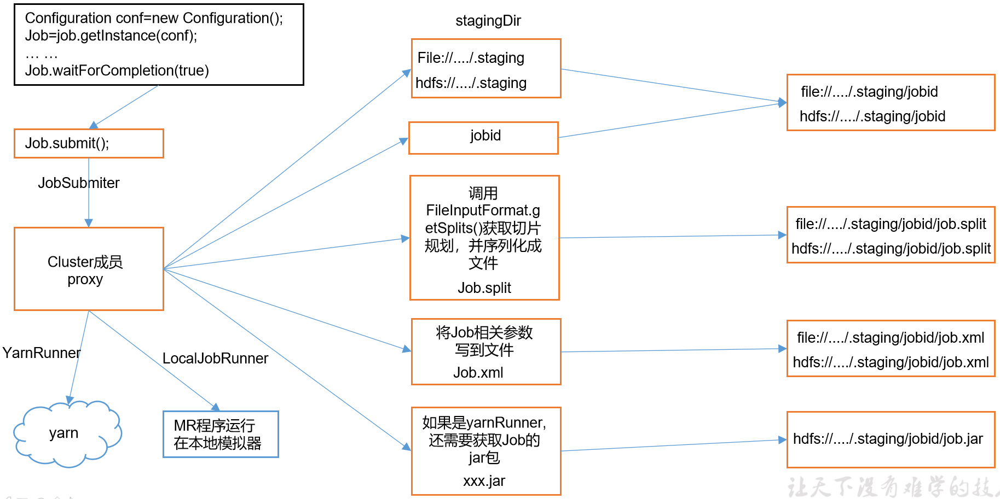

# MapReduce学习


## 简述

### 定义

- MapReduce是==一个分布式运算程序的编程框架==
- 用于基于Hadoop的数据分析引用的核心框架
- 将==用户编写的业务代码==和==自带默认组件==整合成一个完整的分布式运算程序，并发运行在一个Hadoop集群上

### 优点

- 易于编程
  - 简单的实现一些接口，完成一个分布式程序
  - 分布式程序可以部署到大量廉价的机器上
  - 编写的程序形式和一个串行的程序一致
- 良好的扩展性
  - 计算资源不满足，可以通过简单的增加机器来扩展计算能力
- 高容错性
  - 如果其中一台机器宕机，可以将上面的==计算任务转移==到另一个节点上运行，整个过程不需要人工参与，系统自动完成
- 适合PB级以上的海量数据的离线处理
  - 上千台服务器集群并发工作，提供数据处理能力

### 缺点

- 不擅长实时计算
  - MapReduce无法像MySql一样，在ms内返回结果
- 不擅长流式计算
  - 流式计算的输入数据是动态的，而MapReduce的==输入数据集是静态的==，不能动态变化
  - 数据源必须是静态的
- 不擅长DAG（有向图）计算
  - DAG：多个应用程序存在依赖关系，后一个程序的输入是前一个程序的输出
  - MapReduce可以使用DAG计算，但是==每个MapReduce的作业结果都会输出到磁盘，会造成大量的IO，性能非常低下==


### 核心思想


- 分布式的运算程序至少分为2个阶段
  - 第一个阶段：mapTask并发实例，完全并行运行，互不相干
  - 第二个阶段：reduceTask并发实例，互不相干，但是数据依赖于上一个阶段的所有mapTask并发实例的输出
- MapReduce模型只能包含一个map阶段和一个reduce阶段，如果用户的逻辑非常复杂，只能多个MapReduce程序串行运行


### 编写程序

#### MapReduce进程

一个完整的MapReduce程序在分布式运行时有3个进程

- MrAppMaster：负责整个程序的过程调度和状态协调

- MapTask：负责Map阶段的整个数据处理流程

- ReduceTask：负责Reduce阶段的整个数据处理流程

  

#### 官方WordCount源码反编译

- 01_jar包\02_win7下编译过的hadoop jar包\hadoop-2.7.2\share\hadoop\mapreduce\hadoop-mapreduce-examples-2.7.2.jar
- 对官方的Demo进行反编译，发现WordCount案例有Map类，Reduce类和驱动类
- 且数据类型是Hadoop自身封装的序列化类型


#### 常用数据序列化类型

一个包装类，用于Hadoop进行序列化操作

| **Java类型** | **Hadoop Writable类型** |
| ------------ | ----------------------- |
| boolean      | BooleanWritable         |
| byte         | ByteWritable            |
| int          | IntWritable             |
| float        | FloatWritable           |
| long         | LongWritable            |
| double       | DoubleWritable          |
| String       | Text                    |
| map          | MapWritable             |
| array        | ArrayWritable           |


#### 编程规范

##### Mapper阶段

- 用户定义的Mapper需要继承自己的父类
- 输入数据是K1V1对的形式
- K和V类型可以自定义
- 业务逻辑写在map()中
- 输出数据是K2V2对的形式
- map方法（MapTask进程）对每一个<K,V>调用一次


##### Reducer阶段

- 用户自定义Reducer要继承自己的父类
- Reducer的输入数据类型对应Mapper的输出数据类型，也是KV类型
- 业务逻辑写在reduce()中
- ReduceTask进程对每一组相同k的<K,V>组调用一次reduce()方法


##### Dirver阶段

- 相当于YARN集群的客户端，用于提交整个程序到YARN集群，提交的是封装了MapReduce程序相关运行参数的job对象


#### 编写WordCount

- 需求：给定的文本中统计输出每一个单词出现的总次数
- 输入数据：hello.txt

```shell
atguigu atguigu
ss ss
cls cls
jiao
banzhang
xue
hadoop
```

- 期望输出：

```shell
atguigu	2
banzhang	1
cls	2
hadoop	1
jiao	1
ss	2
xue	1
```

- 分析
  - Mapper阶段
    - 将MapTask传给我们的文本内容先转换为String
    - 根据空格将这一行切分成单词
    - 将单词输出<单词，1>
  - Reducer阶段
    - 汇总各个key的个数
    - 输出该key的总次数
  - Driver
    - 获取配置信息，获取job对象实例
    - 指定本程序的jar包所在的本地路径
    - 关联Mapper/Reducer业务类
    - 指定Mapper输出数据的KV类型
    - 指定最终输出的数据的KV类型
    - 指定job的输入原始文件所在的目录
    - 指定job的输出结果所在的目录
    - 提交作业

##### 创建项目

创建一个maven项目，添加如下pom，如果是springboot项目，可以不用添加log4j

```xml
<dependencies>
		<dependency>
			<groupId>junit</groupId>
			<artifactId>junit</artifactId>
			<version>RELEASE</version>
		</dependency>
		<dependency>
			<groupId>org.apache.logging.log4j</groupId>
			<artifactId>log4j-core</artifactId>
			<version>2.8.2</version>
		</dependency>
		<dependency>
			<groupId>org.apache.hadoop</groupId>
			<artifactId>hadoop-common</artifactId>
			<version>2.7.2</version>
		</dependency>
		<dependency>
			<groupId>org.apache.hadoop</groupId>
			<artifactId>hadoop-client</artifactId>
			<version>2.7.2</version>
		</dependency>
		<dependency>
			<groupId>org.apache.hadoop</groupId>
			<artifactId>hadoop-hdfs</artifactId>
			<version>2.7.2</version>
		</dependency>
</dependencies>
```

如果是springBoot项目下，不用添加如下日志配置(在项目的src/main/resources目录下，新建一个文件，命名为log4j.properties)

```properties
log4j.rootLogger=INFO, stdout
log4j.appender.stdout=org.apache.log4j.ConsoleAppender
log4j.appender.stdout.layout=org.apache.log4j.PatternLayout
log4j.appender.stdout.layout.ConversionPattern=%d %p [%c] - %m%n
log4j.appender.logfile=org.apache.log4j.FileAppender
log4j.appender.logfile.File=target/spring.log
log4j.appender.logfile.layout=org.apache.log4j.PatternLayout
log4j.appender.logfile.layout.ConversionPattern=%d %p [%c] - %m%n
```


##### 编写程序

- 编写Mapper类

```java
package com.stt.demo.mr.wordCount;

import org.apache.hadoop.io.IntWritable;
import org.apache.hadoop.io.LongWritable;
import org.apache.hadoop.io.Text;
import org.apache.hadoop.mapreduce.Mapper;

import java.io.IOException;

/**
 * KEYIN:输入数据Key
 * VALUEIN:输入数据value
 * KEYOUT:输出数据key
 * VALUEOUT：输出数据value
 * Created by Administrator on 2019/5/5.
 */
public class WordCountMapper extends Mapper<LongWritable,Text,Text,IntWritable>{

	// 这里使用属性变量的意义在于节省内存
	// 定义输出的key对象
	Text k = new Text();
	// 定义输出的值,值都是1,匹配到一个单词就放入context中
	IntWritable v = new IntWritable(1);

	@Override
	protected void map(LongWritable key, Text value, Context context) throws IOException, InterruptedException {
		// 读取一行数据
		String line = value.toString();
		// 对这一行进行空格分隔
		String[] words = line.split("\\s+");
		// 输出
		for(String word : words){
			k.set(word);
			context.write(k,v);
		}
	}
}
```


- 编写Reducer类

```java
package com.stt.demo.mr.wordCount;

import org.apache.hadoop.io.IntWritable;
import org.apache.hadoop.io.Text;
import org.apache.hadoop.mapreduce.Reducer;

import java.io.IOException;

/**
 * 输入的是单词text和1
 * 输出的是单词text和具体的个数
 * Created by Administrator on 2019/5/5.
 */
public class WordCountReducer extends Reducer<Text,IntWritable,Text,IntWritable> {


	int sum = 0;
	IntWritable v = new IntWritable();

	// 每次会获取一个key，value的list作为输入
	@Override
	protected void reduce(Text key, Iterable<IntWritable> values, Context context) throws IOException, InterruptedException {
		sum = 0;
		for(IntWritable count : values){
			sum += count.get();
		}
		// 输出
		v.set(sum);
		context.write(key,v);
	}
}
```


- 编写Driver类

```java
package com.stt.demo.mr.wordCount;

import org.apache.hadoop.conf.Configuration;
import org.apache.hadoop.fs.Path;
import org.apache.hadoop.io.IntWritable;
import org.apache.hadoop.io.Text;
import org.apache.hadoop.mapreduce.Job;
import org.apache.hadoop.mapreduce.lib.input.FileInputFormat;
import org.apache.hadoop.mapreduce.lib.output.FileOutputFormat;

import java.io.IOException;

/**
 * 驱动类
 * Created by Administrator on 2019/5/5.
 */
public class WordCountDriver {

	public static void main(String[] args) throws Exception {

		// 获取相应的配置服务
		Configuration conf = new Configuration();
		Job job = Job.getInstance(conf);
		// 设置jar加载路径
		job.setJarByClass(WordCountDriver.class);
		// 设置map和reduce类
		job.setMapperClass(WordCountMapper.class);
		job.setReducerClass(WordCountReducer.class);
		// 设置map输出
		job.setMapOutputKeyClass(Text.class);
		job.setMapOutputValueClass(IntWritable.class);
		// 设置最终输出的类型
		job.setOutputKeyClass(Text.class);
		job.setOutputValueClass(IntWritable.class);
		// 设置输入和输出路径
		FileInputFormat.setInputPaths(job,new Path(args[0]));
		FileOutputFormat.setOutputPath(job,new Path(args[1]));
		// 提交:查看源码，true表示监控job的运行情况，并打印
		boolean result = job.waitForCompletion(true);
		System.exit(result ? 0 : 1);
	}
}
```


##### 测试

- 环境准备

  如果电脑系统是win7的就将win7的hadoop jar包解压到非中文路径，并在Windows环境上配置HADOOP_HOME环境变量。如果是电脑win10操作系统，就解压win10的hadoop jar包，并配置HADOOP_HOME环境变量

  注意：win8电脑和win10家庭版操作系统可能有问题，需要重新编译源码或者更改操作系统

- 在idea上测试

  需要配置参数后运行
  

- 在集群上测试

  - 使用maven进行打包，需要配置插件，注意刷新reimport

  ```xml
  <build>
      <plugins>
          <plugin>
              <artifactId>maven-compiler-plugin</artifactId>
              <version>2.3.2</version>
              <configuration>
                  <source>1.8</source>
                  <target>1.8</target>
              </configuration>
          </plugin>
          <plugin>
              <artifactId>maven-assembly-plugin </artifactId>
              <configuration>
                  <descriptorRefs>
                      <descriptorRef>jar-with-dependencies</descriptorRef>
                  </descriptorRefs>
                  <archive>
                      <manifest>
                          <!--这里需要替换为入口类-->
                          <mainClass>
                              com.stt.demo.mr.wordCount.WordCountDriver
                          </mainClass>
                      </manifest>
                  </archive>
              </configuration>
              <executions>
                  <execution>
                      <id>make-assembly</id>
                      <phase>package</phase>
                      <goals>
                          <goal>single</goal>
                      </goals>
                  </execution>
              </executions>
          </plugin>
      </plugins>
  </build>
  ```

  - 将项目打包成jar，run as -> maven install 

    等待编译完成就会在项目的target文件夹中生成jar包。如果看不到。在项目上右键 -> Refresh，即可看到。修改不带依赖的jar包名称（不含jar-with-dependencies）为wc.jar，并拷贝该jar包到Hadoop集群

  - 启动集群，执行wordCount

    - 注意读取的文件不能太多，太大，否则执行会空间不足而失败

  ```shell
  [atguigu@hadoop102 software]$ hadoop jar wc.jar
  com.stt.demo.mr.wordCount.WordCountDriver /user/ttshe/input/wc.input /user/ttshe/output
  ```


## Hadoop序列化


### 序列化概述

#### 什么是序列化

- 序列化：将内存中的对象转换为==字节序列==（或其他数据传输协议，如json），以便存储到磁盘或者传输

- 反序列化：将收到的字节序列（或者其他格式）转换为==内存中的对象==

  

#### 为什么要序列化

- 一般对象存储在内存中，一旦断电就没有了，同时该对象只能本地进程使用，不能通过网络发送给另一个进程使用

- 序列化之后，该对象可以用于传输给另一进程使用

  

#### 为什么不使用Java的序列化

- java序列化是一个重量级序列化框架（Serializable），一个对象序列化之后会附带很多额外的信息，各种校验信息，header，继承体系，不便于在网络中传输，Hadoop自己开发了一套序列化机制（Writable）

- Hadoop序列化的特点
  - 紧凑：高效的使用存储空间
  - 快速：读写数据的额外开销小
  - 可扩展：随着通信协议的升级而升级
  - 互操作：支持多语言的交互


### 自定义bean序列化

#### 如何编写

当基本类型的Writable对象不能满足需求时，需要自定义序列化操作，如在Hadoop内部传输一个bean对象

- 实现Writable接口
- 反序列化时，需要反射调用空参构造函数，必须要有一个空参构造器

```java
public FlowBean(){super();}
```

- 重写序列化方法

```java
@Override
public void write(DataOutput out) throws IOException {
	out.writeLong(upFlow);
	out.writeLong(downFlow);
	out.writeLong(sumFlow);
}
```

- 重写反序列化方法

```java
@Override
public void readFields(DataInput in) throws IOException {
	upFlow = in.readLong();
	downFlow = in.readLong();
	sumFlow = in.readLong();
}
```

- 注意：==反序列化的顺序和序列化的顺序完全一致==
- 可以重写toString方法，用于显示在日志文件中等
- 如果需要将自定义bean放在Key中传输，==需要实现 Comparable 接口==，因为MapReduce框中的==Shuffle过程要求对Key必须能排序==

```java
@Override
public int compareTo(FlowBean o) {
	// 倒序排列，从大到小
	return this.sumFlow > o.getSumFlow() ? -1 : 1;
}
```

#### 示例

- 需求：统计一个手机号耗费的总上行流量，下行流量，总流量
- 输入数据

```xml
1	13736230513	192.196.100.1	www.atguigu.com	2481	24681	200
2	13846544121	192.196.100.2			264	0	200
3 	13956435636	192.196.100.3			132	1512	200
4 	13966251146	192.168.100.1			240	0	404
5 	18271575951	192.168.100.2	www.atguigu.com	1527	2106	200
6 	84188413	192.168.100.3	www.atguigu.com	4116	1432	200
7 	13590439668	192.168.100.4			1116	954	200
8 	15910133277	192.168.100.5	www.hao123.com	3156	2936	200
9 	13729199489	192.168.100.6			240	0	200
10 	13630577991	192.168.100.7	www.shouhu.com	6960	690	200
11 	15043685818	192.168.100.8	www.baidu.com	3659	3538	200
12 	15959002129	192.168.100.9	www.atguigu.com	1938	180	500
13 	13560439638	192.168.100.10			918	4938	200
14 	13470253144	192.168.100.11			180	180	200
15 	13682846555	192.168.100.12	www.qq.com	1938	2910	200
16 	13992314666	192.168.100.13	www.gaga.com	3008	3720	200
17 	13509468723	192.168.100.14	www.qinghua.com	7335	110349	404
18 	18390173782	192.168.100.15	www.sogou.com	9531	2412	200
19 	13975057813	192.168.100.16	www.baidu.com	11058	48243	200
20 	13768778790	192.168.100.17			120	120	200
21 	13568436656	192.168.100.18	www.alibaba.com	2481	24681	200
22 	13568436656	192.168.100.19			1116	954	200
```

- 输入数据格式

```xml
7 	13560436666	120.196.100.99		1116		 954			200
id	手机号码		网络ip			上行流量     下行流量     网络状态码
```

- 期望输出

```xml
13560436666 		1116		  954 			2070
手机号码		    上行流量        下行流量		总流量
```

- 分析

  - 需求：统计每个号码的总上行量，总下行量，总流量
  - 输入数据格式，第二列是号码，从倒数第三列依次倒数是上行量，下行量
  - map阶段：切分字段，读取上行量，下行量
    - 以号码为key，bean对象输出为value，bean要求可以被序列化传输
  - 期望输出的格式，该格式由bean的toString方法决定
  - reduce阶段，累加上行量和下行量，计算得出总行量。

- 编写

  - 序列化bean

  ```java
  package com.stt.demo.mr.serialization;
  import lombok.Data;
  import org.apache.hadoop.io.Writable;
  
  import java.io.DataInput;
  import java.io.DataOutput;
  import java.io.IOException;
  
  /**
   * 用于统计流量的bean
   */
  @Data
  public class FlowBean implements Writable{
  
  	private long upFlow;
  	private long downFlow;
  	private long sumFlow;
  
  	// 反序列化时，需要反射调用空参构造函数
  	public FlowBean(){
  		super();
  	}
  
  	public FlowBean(long upFlow,long downFlow){
  		this.upFlow = upFlow;
  		this.downFlow = downFlow;
  		this.sumFlow = upFlow + downFlow;
  	}
  
  	// 写序列化方法
  	@Override
  	public void write(DataOutput out) throws IOException {
  		out.writeLong(upFlow);
  		out.writeLong(downFlow);
  		out.writeLong(sumFlow);
  	}
  
  	// 反序列化方法
  	@Override
  	public void readFields(DataInput in) throws IOException {
  		// 反序列化方法必须要和序列化方法的执行顺序保持一致
  		this.upFlow = in.readLong();
  		this.downFlow = in.readLong();
  		this.sumFlow = in.readLong();
  	}
  }
  ```

  - mapper

  ```java
  package com.stt.demo.mr.serialization;
  
  import org.apache.hadoop.io.LongWritable;
  import org.apache.hadoop.io.Text;
  import org.apache.hadoop.mapreduce.Mapper;
  
  import java.io.IOException;
  
  public class FlowCountMapper extends Mapper<LongWritable,Text,Text,FlowBean> {
  
  	FlowBean v = new FlowBean();
  	Text k = new Text();
  
  	@Override
  	protected void map(LongWritable key, Text value, Context context) throws IOException, InterruptedException {
  		// 获取一行数据
  		String line = value.toString();
  		// 切割字段
  		String[] fields = line.split("\t");
  		// 封装对象
  		String phoneNum = fields[1];
  		// 取得上流量和下流量
  		int len = fields.length;
  		long upFlow = Long.parseLong(fields[len - 3]);
  		long downFlow = Long.parseLong(fields[len - 2]);
  
  		k.set(phoneNum);
  		v.setDownFlow(downFlow);
  		v.setUpFlow(upFlow);
  
  		// 写出
  		context.write(k,v);
  	}
  }
  ```

  - reducer

  ```java
  package com.stt.demo.mr.serialization;
  
  import org.apache.hadoop.io.Text;
  import org.apache.hadoop.mapreduce.Reducer;
  
  import java.io.IOException;
  
  public class FlowCountReducer extends Reducer<Text,FlowBean,Text,FlowBean> {
  	@Override
  	protected void reduce(Text key, Iterable<FlowBean> values, Context context) throws IOException, InterruptedException {
  
  		long sum_upFlow = 0;
  		long sum_downFlow = 0;
  		for(FlowBean flowBean:values){
  			sum_downFlow += flowBean.getDownFlow();
  			sum_upFlow += flowBean.getUpFlow();
  		}
  
  		FlowBean result = new FlowBean(sum_upFlow,sum_downFlow);
  
  		context.write(key,result);
  	}
  }
  ```

  - driver

  ```java
  package com.stt.demo.mr.serialization;
  
  import org.apache.hadoop.conf.Configuration;
  import org.apache.hadoop.fs.Path;
  import org.apache.hadoop.io.Text;
  import org.apache.hadoop.mapreduce.Job;
  import org.apache.hadoop.mapreduce.lib.input.FileInputFormat;
  import org.apache.hadoop.mapreduce.lib.output.FileOutputFormat;
  import java.io.IOException;
  
  public class FlowCountDriver {
  
  	public static void main(String[] args) throws Exception{
  		// 设置输入输出参数
  		args = new String[]{"d:/input.txt","d:/output.txt"};
  		// 配置信息以及job对象
  		Configuration conf = new Configuration();
  		Job job = Job.getInstance(conf);
  		job.setJarByClass(FlowCountDriver.class);
  
  		job.setMapperClass(FlowCountMapper.class);
  		job.setReducerClass(FlowCountReducer.class);
  
  		job.setMapOutputKeyClass(Text.class);
  		job.setMapOutputValueClass(FlowBean.class);
  
  		job.setOutputKeyClass(Text.class);
  		job.setOutputValueClass(FlowBean.class);
  
  		FileInputFormat.setInputPaths(job,new Path(args[0]));
  		FileOutputFormat.setOutputPath(job,new Path(args[1]));
  
  		boolean re = job.waitForCompletion(true);
  		System.exit(re ? 0 : 1);
  	}
  }
  ```


## MapReduce框架原理

有InputFormat阶段，Shuffle（拖拽？，改组）阶段，OutputFormat阶段


### InputFormat阶段分析

继承结构


在运行MapReduce过程中，输入的数据格式有：

- 基于行的日志文件
- 二进制文件
- 数据库表

针对不同的数据类型，MapReduce通过InputFormat接口的不同的实现类来实现

- TextInputFormat
- KeyValueTextInputFormat
- NLineInputFormat
- CombineTextInputFormat
- 自定义InputFormat


#### 切片与MapTask并行度决定机制

> MapTask的并行度决定Map阶段的任务处理并发度，进而影响到整个Job的处理速度

思考：1G的数据，启动8个MapTask，可以提高集群的并发处理能力，那么1k的数据，也启动8个MapTask，会提高集群性能么？MapTask并行任务是否越多越好呢？那些因素影响了MapTask的并行度？

- MapTask并行度决定机制
  - 数据块：Block是HDFS物理上把数据分成一块一块
  - 数据切片：数据切片只是在逻辑上对输入进行分片，并不会在磁盘上将其切分成片进行存储。

- 假设情况1：


300M的数据，按照100M进行切片，而数据块的大小是128M，那么每个DataNode在收到MapTask的数据调用请求的时候，肯定会有夸DataNode的情况出现，产生的问题：DataNode之间的数据IO交互，降低了Job在Map阶段的性能；对DataNode上数据的访问需要进行计算起始位置，然后访问数据，逻辑复杂，出现问题不利于排查。

- 假设情况2：


300M的数据，按照128M进行切片处理，每个分片分配到一个MapTask进行处理，MapTask读取到一个DataNode，刚好是一个分片，那么就没有多余的判断分片大小是否等于设定的大小，直接读取处理即可，简单安全。
同时如果，再来一个数据，数据大小是100M，那么和300M何在一起存储在4个DataNode，最后一个DataNode存储的是100M，Job的MapTask也只需要读取最后一个DataNode的数据即可，而不是将这100M和之前的剩下存储的44M何在一起存储一个128M的Block中和一个16M的Block，而是一个44M，一个100M的Block。

- 小结
  - 一个Job的Map阶段并行读有客户端在提交Job时的==切片数决定==
  - 每一个Split切片分配一个MapTask并行实例处理
  - 在默认情况下，切片大小=BlockSize
  - 切片时不考虑数据集整体，而是逐个针对每个文件单独切片


#### Job提交流程源码分析

从job.waitForCompletion打上断点，进行分析。

```java
// 0.提交执行 Job.java 1307行
submit();
	// setUseNewApi() 为了旧版本的兼容处理，将旧的Api转换为新的Api
	// 1.建立连接
	connect();
	// (1) 创建提交Job的代理
		return new Cluster(getConfiguration());
		// 判断协议：是使用local,yarn,还是远程
			initialize(jobTrackAddr, conf);
	// 2.提交job
	return submitter.submitJobInternal(Job.this, cluster);
	// 验证输出的job的路径是否已经有文件，有文件表示结果已经生成退出
		checkSpecs(job);
	// (1) 创建给集群提交数据的Stag路径，这里的路径是file:/tmp/hadoop-Administrator/mapred/staging/Administrator186995491/.staging
		Path jobStagingArea = JobSubmissionFiles.getStagingDir(cluster, conf)
	// (2) 获取jobId，创建job路径
    	JobID jobId = submitClient.getNewJobID()
    // (3) 拷贝jar包到集群
    	copyAndConfigureFiles(job, submitJobDir);
			// 上传配置文件和要执行的jar到tmp对应的job文件夹下（本地运行时没有jar包上传）
        	rUploader.uploadFiles(job, jobSubmitDir);
	// (4) 计算切片信息，生成切片规划文件到tmp文件夹
	// 切片文件job.split内部信息：SPL /org.apache.hadoop.mapreduce.lib.input.FileSplitfile:/d:/hello.txt  
		 int maps = writeSplits(job, submitJobDir);
			 	maps = writeNewSplits(job, jobSubmitDir);
					List<InputSplit> splits = input.getSplits(job);
	// (5) 生成job.xml配置信息，包含当前job运行的所有hadoop的配置信息（这里修改的原因是：代码中可能会对hadoop的一些配置进行修改，那么每个不同的job使用的配置是不同的，那么就需要给每个job一个配置，代码的配置优先级最高，其次是自定义配置，最后是系统默认配置，这些配置合在一起就是该job的配置信息）
		writeConf(conf, submitJobFile);
	// (6) 提交job，返回提交状态（执行Map阶段，执行Reduce阶段返回结果）
		status = submitClient.submitJob(jobId, submitJobDir.toString(), job.getCredentials());
	// 提交完成后，会删除tmp的staging内的job的临时文件
```




#### FileInputFormat 切片

##### 切片源码分析

> 在提交过程中首先会生成切片信息，在input.getSplites(job)中获取，该流程如下
>
> 注意：集群模式Block大小是128M，1.x版本的集群模式是64M，本地模式是32M
>
> 切片的大小是逻辑划分
> 数据块的大小是物理划分

- 程序先找到存储数据的目录

- 开始遍历处理，规划切片目录下的每一个文件

- 遍历第一个文件ss.txt

  - 获取文件大小fs.sizeOf(ss.txt)

  - 计算切片大小：computeSplitSize(Math.max(minSize,Math.min(maxSize,blockSize))) = blockSize = 128M

  - ==默认情况下，切片大小=blockSize==

  - 开始切

    - 第一个切片ss.txt--0:128M

    - 第二个切片ss.txt--128M:256M

    - 第三个切片ss.txt--256M:300M

    - ==每次切片，都要判断切完剩下的部分是否大于块的1.1倍，不大于1.1倍就划分为一块切片==

  - 将切片信息写到一个切片规划中

  - 整个切片的核心过程在getSplit()方法中完成

  - InputSplit记录了切片的元数据信息，如起始位置，长度，所在节点的列表等

- 提交切片规划文件到YARN上的MrAppMaster可以依据切片规划文件计算开始MapTask个数


##### 切片机制

> 简单的按照文件的内容长度进行切片
> 切片大小默认等于Block大小
> 切片时不考虑数据集整体，而是逐个针对每个文件单独切片（所以不能有大量的小文件）

- 案例分析
  - 输入数据2个文件：file1.txt--320M，file2.txt--10M
  - 经过FileInputFormat的切片机制运算后，形成如下切片信息
    - file1.txt.split1-- 0:128
    - file1.txt.split2-- 128:256
    - file1.txt.split3-- 256:320
    - file2.txt.split1-- 0:10  


##### 切片参数配置

- 源码中计算切片大小的公式
  - Math.max(minSize,Math.min(maxSize,blockSize));
    - mapreduce.input.fileinputformat.split.minsize 默认值为==1==
    - mapreduce.input.fileinputformat.split.maxsize 默认值Long.MAXValue
    - 默认切片大小 ==blockSize==
- 切片大小设置
  - maxsize：若设置比blockSize小，会让切片变小，等于配置的这个参数的值
  - minsize：若设置比blockSize大，则可以让切片比blockSize大
- 获取切片信息API
  - 获取切片的文件名称 inputSplit.getPath().getName()
  - 根据文件类型获取切片信息 (FileSplit)context.getInputSplit();


#### CombineTextInputFormat 切片

> 框架默认的TextFileInputFormat切片机制是对任务按文件规划切片，==无论文件多小，都是一个单独的切片==，都会生成一个MapTask进行处理，这样如果有大量文件，就会产生大量的MapTask，效率极其低下

源码参考F:\大数据-尚硅谷\归档\01.hadoop\resource\04_扩展资料\合并小文件切片逻辑&测试数据.zip


##### 应用场景

CombineTextInputFormat 用于小文件过多的场景，可以将多个小文件从==逻辑上==规划到一个切片中，交给一个MapTask进行处理


##### 参数设置

设置虚拟存储切片的最大值，一般设置为128M

CombineTextInputFormat.setmaxInputSplitSize(job,4194304);//4M

注意：虚拟存储切片的最大值最好和实际的小文件大小情况来设置


##### 切片机制

生成切片过程包括：虚拟存储过程，切片过程


##### 操作实例


#### TextInputFormat


#### KeyValueTextInputFormat


#### NLineInputFormat


#### 自定义InputFormat


## 数据压缩


## YARN资源调度


## Hadoop企业优化


## MapReduce扩展


## 问题处理


## 案例练习