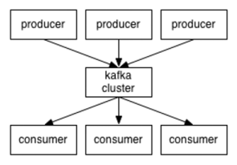
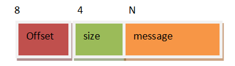

# 讨论

- 由于flume的一些缺点
  - 数据无法保存，客户如果想延迟获取做不到
  - 增加消费者,OCP
    - 要重启flume，导致现有消费者受到影响
  - 无法重复消费
- 设计一个存储系统，如何解决这些缺点？

 

- 该系统需要存储文件
  - store==>file
- 支持负载均衡的考虑
  - 多机部署
  - 需要负载均衡器
    - 如果Producer过多，会造成负载均衡器负载过重
    - 更改为注册中心，producer自己与存储系统Application通信
      - 每次返回Application的IP
      - producer内部做负载均衡和轮训机制
- 支持容灾的考虑
  - 如果有机器宕机，如何保证不丢失数据
  - 对数据进行备份
    - 备份数据不能存储在相同机器
    - 备份数据store-back存储在另一个Application上
    - 备份的数据如何同步？
      - producer发送数据给store和store-back？
        - 不合适，耦合性强，producer需要多关注数据的传输
      - 由Application内部进行同步
        - 由Store发送给Store-bak？
          - 不合适，store本身用于接收数据处理，负担重
          - Store-bak从Store拉取数据，合适，缺点可能会有数据的丢失，看如何做返回处理了
    - 如何保证数据的可见性？
      - 数据的可见性，store更新数据后，store-bak有也进行更新，保持同步
      - store更新了数据，而store-bak未更新数据，那么producer接收不到store发送的接收数据成功的回复，就是发送数据失败
- 关于消费者
  - 消费者获取数据是store推送还是拉取？
    - 拉取，推送会导致store完成的功能过多，负载过重，而拉取可以有效的解耦
- 增加消费者如何避免影响？
  - 增加的消费者从注册中心获取store的ip进行store的数据拉取，对现有的消费者没有影响
    - 没有重启store
- 消费者的消费模式
  - 多个消费者做负载均衡，消费同一批数据，那么消费者需要在一个consumer-group中，一个消费者拉取指定的数据，一个消费者拉取另一个指定的数据
  - 多个消费者如果不在同一个consumer-group，那么拉取的数据会有重复
- 如何重复拉取数据
  - 一个消费者如何可以再次拉取之前的数据？
    - 存储拉取历史记录，如拉取的时间点
    - 历史记录存储在消费者
      - 如存储在store中，造成耦合，负载过重

# 概念

## 消息队列

- 特点
  - 存储数据
  - 异步通信
  - 削峰处理

 

- 点对点模式
  - 一对一，消费者主动拉取数据，消息收到后消息清除
  - 点对点模型通常是一个基于拉取或者轮询的消息传送模型，这种模型从队列中请求信息，而不是将消息推送到客户端
  - 特点是发送到队列的消息被一个且只有一个接收者接收处理，即使有多个消息监听者也是如此
- 发布/订阅模式
  - 一对多
  - 发布订阅模型则是另一个消息传送模型
  - 发布订阅模型可以有多种不同的订阅者
    - 临时订阅者
      - 只在主动监听主题时才接收消息
    - 持久订阅者
      - 监听主题的所有消息，即使当前订阅者不可用，处于离线状态

## 为什么需要消息队列

- 解耦
  - 允许你独立的扩展或修改两边的处理过程，只要确保它们遵守同样的接口约束。
- 冗余
  - 消息队列把数据进行持久化直到它们已经被完全处理，通过这一方式规避了数据丢失风险。许多消息队列所采用的"插入-获取-删除"范式中，在把一个消息从队列中删除之前，需要你的处理系统明确的指出该消息已经被处理完毕，从而确保你的数据被安全的保存直到你使用完毕。
- 扩展性
  - 因为消息队列解耦了你的处理过程，所以增大消息入队和处理的频率是很容易的，只要另外增加处理过程即可
- 灵活性 & 峰值处理能力
  - 在访问量剧增的情况下，应用仍然需要继续发挥作用，但是这样的突发流量并不常见。如果为以能处理这类峰值访问为标准来投入资源随时待命无疑是巨大的浪费。使用消息队列能够使关键组件顶住突发的访问压力，而不会因为突发的超负荷的请求而完全崩溃。
- 可恢复性
  - 系统的一部分组件失效时，不会影响到整个系统。消息队列降低了进程间的耦合度，所以即使一个处理消息的进程挂掉，加入队列中的消息仍然可以在系统恢复后被处理。
- ==顺序保证==
  - 在大多使用场景下，数据处理的顺序都很重要
  - 大部分消息队列本来就是排序的，并且能保证数据会按照特定的顺序来处理
  - ==Kafka保证一个Partition内的消息的有序性==
- 缓冲
  - 有助于控制和优化数据流经过系统的速度，解决生产消息和消费消息的处理速度不一致的情况。
- 异步通信
  - 很多时候，用户不想也不需要立即处理消息。消息队列提供了异步处理机制，允许用户把一个消息放入队列，但并不立即处理它。想向队列中放入多少消息就放多少，然后在需要的时候再去处理它们

## 关于Kafka

- 在流式计算中，一般用来缓存数据，Spark通过消费Kafka的数据进行计算
- 开源**消息**系统，由Scala写成
  - 是由Apache软件基金会开发的一个开源消息系统项目
  - Kafka最初是由LinkedIn公司开发，并于2011年初开源。2012年10月从Apache Incubator毕业
  - 该项目的目标是为处理实时数据提供一个统一、高通量、低等待的平台
- **一个分布式消息队列**
  - Kafka对消息保存是根据==Topic==进行归类
  - 发送消息者称为Producer
    - **不依赖ZK获取kafka的注册信息，直接与kafka通信获取所有kafka集群信息**
      - 减少与ZK建立连接的性能消耗
  - 消息接受者称为Consumer
  - kafka集群有多个kafka实例组成
    - 每个实例(server)称为broker，同agent含义相同
- 无论是kafka集群，还是consumer都依赖于**zookeeper**集群保存一些meta信息，来保证系统可用性

# 架构

 

 

- kafka是以ConsumerGroup进行消费的，没有单独的Consumer

  

## Producer 

- 消息生产者
- 向kafka broker发消息的客户端

## Consumer 

- 消息消费者
- 向kafka broker取消息的客户端
- 其中的offset需要存在在其他位置
  - 低版本0.9之前将offset保存在Zookeeper中
  - 0.9及之后保存在Kafka的`__consumer_offsets`主题中

## Topic 

- 可理解为一个队列

## Consumer Group

- CG
- 实现一个topic消息的广播
  - 发给所有的consumer
- 实现一个topic消息的单播
  - 发给任意一个consumer
- 一个topic可以有多个CG
- topic的消息会复制（不是真的复制，是概念上的）到所有的CG，但每个partition只会把消息发给该CG中的一个consumer
- 要实现广播需要每个consumer有一个独立的CG
- 要实现单播需要所有的consumer在同一个CG
- 用CG可以将consumer进行自由的分组而不需要多次发送消息到不同的topic

## Broker 

- 一台kafka服务器就是一个broker
- 一个集群由多个broker组成
- 一个broker可以容纳多个topic

## Partition

- 为了实现扩展性，一个非常大的topic可以分布到多个broker上
- 一个topic可分为多个partition
- 每个partition是一个有序队列
- partition中的每条消息都会被分配一个有序的id（offset）
- ==kafka只保证按一个partition中的顺序将消息发给consumer==
- ==不保证一个topic的整体（多个partition间）的顺序==

## Offset

- kafka的存储文件都是按照offset.kafka来命名，用offset做名字的好处是方便查找
- 例如你想找位于2049的位置，只要找到2048.kafka的文件即可
- the first offset就是00000000000.kafka

## Message

- 消息的存储格式组成
  - offset
    - 存储偏移量
    - 8个字节
  - size
    - 消息的长度
    - 4个字节
  - message
    - 存储消息的本体
    - N个字节
    - scala中
      - 称为message，组成
        - CRC32 ；4byte
        - 魔术值0,1；1byte
        - 属性；1byte
          - bit0-2；压缩类型
            - 0 不压缩
            - 1 gzip
            - 2 snappy
            - 3 lz4
          - bit 3 ；时间类型
            - 0 创建时间
            - 1 日志添加时间
          - bit 4-7；保留
        - 可选；8byte
          - 魔术值>0，增加timestap
        - key的长度；4byte
        - key的值；kbyte
        - value的长度；4byte
        - value的值；vbyte
    - java中
      - 称为record
      - org.apache.kafka.common.record
      - 等于将scala中的message翻译了一下

 

- ==通过当前的offset+size计算得出下一个offset的值==
  - 可实现顺序读写

