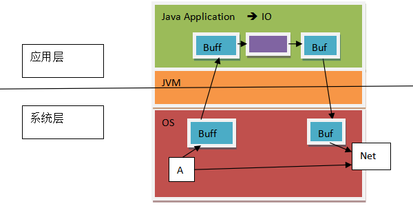
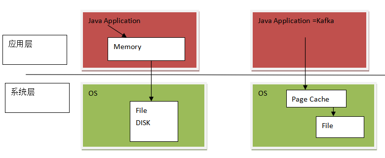
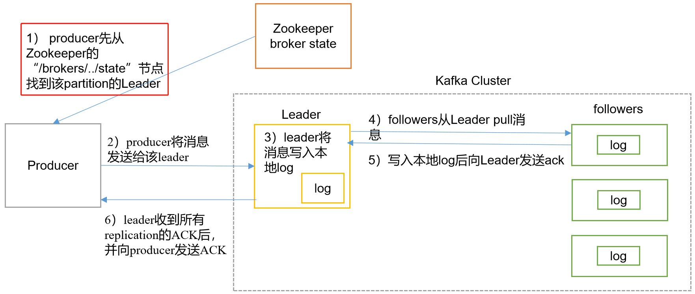
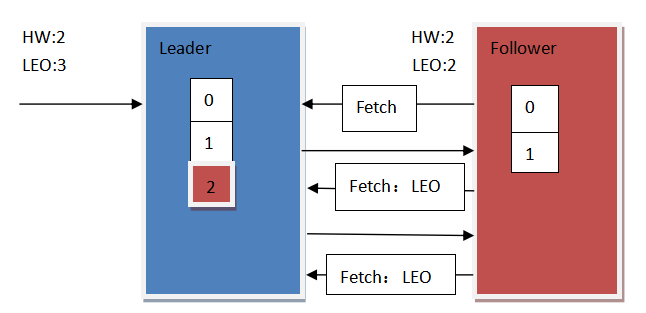
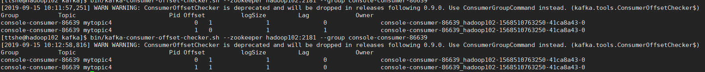

# 工作流程

- push and pull
  - producer 是异步push过程
  - consumer 是异步 pull 过程

 


- producer没有连接zk是因为kafka集群连接了zk，获取到了集群信息给producer

- consumer按道理可不连接zk，从kafka集群获取集群信息，还为什么连接zk信息？

  - 需要在zk中写数据，写当前读取数据的记录
    - 偏移量
  - consumerA读取分区partition0，此时在zk中记录，其他的consumer就不能读取partition0了
    - 锁的概念
  - 新增的consumer从zk中获取信息，可以==再平衡==分区的分配
    - 有些consumer获取是多个分区的Leader
    - 再平衡可以重新进行Leader的规划

- 一个消费者消费一个分区，如果GC中的分区个数小于消费者个数，那么就有消费者等待

  

# 数据生产


## 写入方式

- producer采用推（push）模式将消息发布到broker
- 每条消息都被追加（append）到分区（patition）中
- ==属于顺序写磁盘==
  - 顺序写磁盘效率比随机写内存要高
  - 保障kafka吞吐率
- 磁盘缓存读取写入数据机制
  - RA
    - Read Ahead
    - 预读
      - 预先读取多行
      - block，page
  - WB
    - Write Behind
    - 后写：多个操作一起写入

### 读数据

- 传统方式的读取系统磁盘A中的数据
  - 4个缓存，系统读缓存，应用程序读缓存，应用程序写缓存，系统写缓存

 

- kafka使用==零复制==
  - 在应用层没有复制的操作
  - 使用了磁盘缓存
  - 应用程序通知OS层将数据发送到Net，==而不经过应用层缓存==

 

### 写数据

- kafka在写数据过程中
  - 顺序写磁盘
  - 不经过应用层缓存，再写入到file
  - 通过系统缓存写入到File
  - 系统磁盘缓存写入的速度比应用层缓存写入到file的速度快
  - PageCache
    - JVM分配的内存之后剩余的内存大部分作为磁盘缓存

 


## 分区 partition

- 消息发送时都被发送到一个topic，其本质就是一个目录
- topic是由一些Partition Logs(分区日志)组成

 

 

- 每个Partition中的消息都是==有序==的
- 生产的消息被不断追加到Partition log上
- 每一个消息都被赋予了一个唯一的==offset值==


### 分区的原因

- 方便在集群中扩展，每个Partition可以通过调整以适应它所在的机器
- 一个topic可以有多个Partition组成，整个集群就可以适应任意大小的数据了
- 提高并发，以Partition为单位读写


### 分区的原则

- 指定了partition，则直接使用
- 未指定partition但指定key
  - 通过对key的value进行hash出一个partition
- partition和key都未指定
  - 使用轮询选出一个partition
- 源码

```java
DefaultPartitioner类

public int partition(String topic, Object key, byte[] keyBytes, Object value, byte[] valueBytes, Cluster cluster) {
		//获取所有的分区
        List<PartitionInfo> partitions = cluster.partitionsForTopic(topic);
        int numPartitions = partitions.size();
        if (keyBytes == null) {
            int nextValue = nextValue(topic);
            // 获取可用的分区，没有宕机的分区
            List<PartitionInfo> availablePartitions = cluster.availablePartitionsForTopic(topic);
            if (availablePartitions.size() > 0) {
            	// 进行轮询获取分区
                int part = Utils.toPositive(nextValue) % availablePartitions.size();
                return availablePartitions.get(part).partition();
            } else {
                // no partitions are available, give a non-available partition
                return Utils.toPositive(nextValue) % numPartitions;
            }
        } else {
            // hash the keyBytes to choose a partition
            // 指定分区的key
            return Utils.toPositive(Utils.murmur2(keyBytes)) % numPartitions;
        }
    }
```


## 副本 Replication

- 同一个partition可能会有多个replication
  - 对应 `server.properties` 配置中的 `default.replication.factor=N`
- 没有replication的情况下，一旦broker宕机，其上所有 partition 的数据都不可被消费，同时producer也不能再将数据存于其上的partition
- 引入replication之后，同一个partition可能会有多个replication
  - 需要在这些replication之间选出一个leader
  - ==producer和consumer只与这个leader交互==
  - 其它replication作为follower==从leader中复制==数据


## 写入流程

 

- producer先从zookeeper的 "/brokers/.../state"节点找到该partition的leader
  - producer直接从zk获取分区数据是不准确的，应该是==从kafka集群中获取分区数据==信息
- producer将消息发送给该leader
- leader将消息写入本地log
- followers从==leader pull消息==，写入本地log后向leader发送ACK
  - 猜测：循环拉取数据，每次拉取一批数据，返回返回给Leader 批量的ACK
  - pull的好处
    - 解耦，避免broker和consumer之间强耦合
    - consumer可以按照自己的处理速度去获取消息，如果是push，则可能下游消费者对消息接收与处理速度跟不上，对于不同的consumer的不同的消费速率不好处理
    - consumer可以自主决定是否批量从broker拉取数据，push模式必须在不知道下游的consumer消费能力和策略情况下是立即推送还是缓存之后再推送
  - 不足
    - broker中没有消息，consumer会不断在循环中轮询，直到有新消息到达
    - kafka有参数可以让consumer直到有新消息到达，或者阻塞到一定的消息的量然后再去批量发送
- leader收到所有ISR中的replication的ACK后，==增加HW==（high watermark，最后commit 的offset）并向producer发送ACK


### Producer内部构成

  

- 单独一个sender线程负责向集群写入数据
  - 这里p0和p1分区轮询发送分区数据给sender
  - sender收到数据后发送给集群
- 初始化sender通过kafka获取所有分区的信息
  - kafka通过ZK连接获取所有的分区信息
- 每个分区有一个双端队列dequeue
  - 负责发送数据
  - 如果满了就发送数据到集群
  - 如果没有满则在设置的时间间隔发送数据
  - 什么是双端队列
    - 两端都可以放入和读取数据
  - 为什么使用双端队列
    - sender可能会发送失败，数据要进行回退，放回dequeue
- 数据采集器
  - accumulator
  - 负责将数据放入dequeue中
  - 对数据进行整合，判断放入哪个partition中


### ACK应答机制

- producer如何判断kafka集群获取到了数据
  - 基于ACK应答机制
    - 0,1,-1(all)
    - 0 表示集群无需应答，就可以发送下一条
      - 性能好，但是数据会丢失，不安全
    - 1 集群中只需要leader应答就可以发送下一条
      - 性能稍微差一点，数据可能会丢失
      - leader已经获取到数据，但是follower没有拉取到数据，此时leader宕机，切换leader就会有数据丢失
    - -1 集群中所有的备份数据都要应答才可以发送下一条数据
      - leader和follower都有应答
      - 性能最差，数据不会丢失


### HW 和 LEO

- HW 
  - 高水位
  - 消费者在当前分区中==能够读取==的最大偏移量
  - 可读取的最大偏移量
- LEO
  - Log End Offset
  - 当前broker日志中最后存储的数据偏移量
  - 实际数据存储量

 

- 图示说明

  - 当leader有数据更新，follower拉取数据，第一次没有LEO信息

  - 第二次以后拉取数据含有follower的LEO信息

    - leader收到follower的LEO信息后，和leader的LEO比较，判断是否有更新
      - 如果follower的LEO小于Leader的LEO，返回新增数据
    - follower更新数据成功，leader增加HW

  - 如果HW还没有收到follower更新成功的通知，此时有consumer进行数据的读取，最多只能读取到HW的偏移量的数据

    - 此时有新增数据的不可见，2表示脏数据

  - 每次Fetch更新LEO，返回时更新Follower的HW

    

- 为什么会有HW和LEO不同步的情况？

  - 保证follower更新数据完成，才能最新的数据可见
  - 如果leader宕机，避免follower和leader数据不一致


# 数据保存


## 存储方式

- 物理上把topic分成一个或多个patition
  - 默认应 server.properties 中的num.partitions=3配置
- 每个partition物理上对应一个文件夹
  - 存储该partition的所有消息
    - 顺序存储
  - 存储该partition的索引文件
    - 为什么有索引文件?
      - 用于文件的随机查找

```bash
[ttshe@hadoop102 logs]$ tree mytopic_1-0
mytopic_1-0
├── 00000000000000000000.index
├── 00000000000000000000.log
├── 00000000000000000000.timeindex
└── leader-epoch-checkpoint

0 directories, 4 files
```


## 存储策略

- 无论消息是否被消费，kafka都会保留所有消息
- 有两种策略可删除旧数据，og.cleanup.policy=delete启用删除策略，直接删除，删除后不可恢复
  - 基于时间
    - log.retention.hours=168
  - 基于大小
    - log.retention.bytes=1073741824
  - 为了避免在删除时阻塞读操作，采用了copy-on-write形式的实现，删除操作进行时，读取操作的二分查找功能实际是在一个静态的快照副本上进行的，类似于Java的CopyOnWriteArrayList
- Kafka读取特定消息的时间复杂度为==O(1)==
  - 与文件大小无关
  - 删除过期文件与提高 Kafka 性能无关
- 日志的真正清除时间
  - 当删除的条件满足以后，日志将被“删除”，但是这里的删除其实只是将该日志进行了“delete”标注，文件只是无法被索引到了而已。但文件本身仍然存在，当过了log.segment.delete.delay.ms 这个时间以后，文件才会被真正的从文件系统中删除


## Zookeeper存储结构

- producer不在zk中注册
- 消费者在zk中注册


- 查看ZK中kafka节点信息
  - controller_epoch
    - 表示controller切换的次数

```bash
[zk: localhost:2181(CONNECTED) 2] ls /

[isr_change_notification, admin, zookeeper, consumers, cluster, config, latest_producer_id_block, controller, brokers, controller_epoch]
```


### 集群id信息

```bash
[zk: localhost:2181(CONNECTED) 3] get /cluster/id
{"version":"1","id":"atxlxvCbQUKuvS6osXaEdA"}
cZxid = 0x300000014
ctime = Sat Sep 14 20:20:21 CST 2019
mZxid = 0x300000014
mtime = Sat Sep 14 20:20:21 CST 2019
pZxid = 0x300000014
cversion = 0
dataVersion = 0
aclVersion = 0
ephemeralOwner = 0x0
dataLength = 45
numChildren = 0
```


### brokers信息

```bash
[zk: localhost:2181(CONNECTED) 8] ls /brokers 
[seqid, topics, ids]
```

```bash
[zk: localhost:2181(CONNECTED) 5] ls /brokers/ids
[2, 1, 0]
```

```bash
[zk: localhost:2181(CONNECTED) 6] get /brokers/ids/0
{"listener_security_protocol_map":{"PLAINTEXT":"PLAINTEXT"},"endpoints":["PLAINTEXT://hadoop102:9092"],"jmx_port":-1,"host":"hadoop102","timestamp":"1568474554014","port":9092,"version":4}
cZxid = 0x300000155
ctime = Sat Sep 14 23:22:34 CST 2019
mZxid = 0x300000155
mtime = Sat Sep 14 23:22:34 CST 2019
pZxid = 0x300000155
cversion = 0
dataVersion = 0
aclVersion = 0
ephemeralOwner = 0x26d2fb2d3360021
dataLength = 188
numChildren = 0
```


### topic信息

- 创建topic

```bash
[ttshe@hadoop102 kafka]$ bin/kafka-topics.sh --zookeeper hadoop102:2181 --create --topic mytopic4 --partitions 2 --replication-factor 2
```

- 查看topics

```bash
[zk: localhost:2181(CONNECTED) 10] ls /brokers/topics
[mytopic4]
```


### partition信息

- isr中第一个是leader的编号

```bash
[zk: localhost:2181(CONNECTED) 11] ls /brokers/topics/mytopic4
[partitions]

[zk: localhost:2181(CONNECTED) 12] ls /brokers/topics/mytopic4/partitions
[1, 0]

[zk: localhost:2181(CONNECTED) 13] ls /brokers/topics/mytopic4/partitions/0      
[state]

[zk: localhost:2181(CONNECTED) 15] get /brokers/topics/mytopic4/partitions/0/state
{"controller_epoch":11,"leader":2,"version":1,"leader_epoch":0,"isr":[2,1]}
cZxid = 0x300000253
ctime = Sun Sep 15 09:18:53 CST 2019
mZxid = 0x300000253
mtime = Sun Sep 15 09:18:53 CST 2019
pZxid = 0x300000253
cversion = 0
dataVersion = 0
aclVersion = 0
ephemeralOwner = 0x0
dataLength = 75
numChildren = 0
```


### consumer信息

- 创建consumer和producer
  - consumer要使用zookeeper的方式才能显示owners的信息

```bash
[ttshe@hadoop102 kafka]$ bin/kafka-console-consumer.sh --zookeeper hadoop102:2181 --topic mytopic4 --from-beginning
Using the ConsoleConsumer with old consumer is deprecated and will be removed in a future major release. Consider using the new consumer by passing [bootstrap-server] instead of [zookeeper].
hello

[ttshe@hadoop102 kafka]$ bin/kafka-console-producer.sh --broker-list hadoop102:9092 --topic mytopic4
>hello
```

- 查看zk上的consumers信息
  - 显示的消费组的信息

```bash
[zk: localhost:2181(CONNECTED) 17] ls /consumers
[console-consumer-86639]
[zk: localhost:2181(CONNECTED) 18] ls /consumers/console-consumer-86639
[offsets, owners, ids]
# 获取到消费组信息
[zk: localhost:2181(CONNECTED) 19] ls /consumers/console-consumer-86639/ids
[console-consumer-86639_hadoop102-1568510763250-41ca8a43]
```

```bash
[zk: localhost:2181(CONNECTED) 20] ls /consumers/console-consumer-86639/owners
[mytopic4]

[zk: localhost:2181(CONNECTED) 21] ls /consumers/console-consumer-86639/owners/mytopic4
[1, 0]

[zk: localhost:2181(CONNECTED) 22] ls /consumers/console-consumer-86639/owners/mytopic4/0
[]

#查看消费组成员分区的绑定信息
[zk: localhost:2181(CONNECTED) 23] get /consumers/console-consumer-86639/owners/mytopic4/0
console-consumer-86639_hadoop102-1568510763250-41ca8a43-0
cZxid = 0x30000026c
ctime = Sun Sep 15 09:26:03 CST 2019
mZxid = 0x30000026c
mtime = Sun Sep 15 09:26:03 CST 2019
pZxid = 0x30000026c
cversion = 0
dataVersion = 0
aclVersion = 0
ephemeralOwner = 0x26d2fb2d3360043
dataLength = 57
numChildren = 0
```


#### 显示消费组



- lag延时消费个数，未消费的个数
- offset是消费者的历史消费偏移量
- 产生新的消息，查看消费情况
  - 查看消费情况有延时，已经消费了，但查看情况上开始显示没有消费，过一会查看，显示已消费


### controller信息

- 每一个broker都有一个控制器
- 有一个主控制器
  - 在controller节点中存储
  - brokerid = 0的节点拿到了控制器
- 作用
  - 竞选操作
  - 管理topic
  - 分区发生了变化的信息处理

```bash
[zk: localhost:2181(CONNECTED) 28] get /controller
{"version":1,"brokerid":0,"timestamp":"1568474553897"}
cZxid = 0x30000014f
ctime = Sat Sep 14 23:22:33 CST 2019
mZxid = 0x30000014f
mtime = Sat Sep 14 23:22:33 CST 2019
pZxid = 0x30000014f
cversion = 0
dataVersion = 0
aclVersion = 0
ephemeralOwner = 0x26d2fb2d3360021
dataLength = 54
numChildren = 0
```


# 数据消费

 


## consumer直接访问集群

- consumer访问zk启动
  - 历史offset记录存储在zk中
- consumer访问kafka集群启动
  - 历史offset记录存储在kafka集群中

```bash
[ttshe@hadoop102 kafka]$ bin/kafka-console-consumer.sh --bootstrap-server hadoop102:9092 --topic mytopic4 --from-beginning
```

- 查看kafka/logs内容

```bash
[ttshe@hadoop102 kafka]$ cd logs
[ttshe@hadoop102 logs]$ ll
总用量 1704
-rw-rw-r--. 1 ttshe ttshe      4 9月  15 09:11 cleaner-offset-checkpoint
drwxrwxr-x. 2 ttshe ttshe   4096 9月  15 10:03 __consumer_offsets-11
drwxrwxr-x. 2 ttshe ttshe   4096 9月  15 10:03 __consumer_offsets-14
drwxrwxr-x. 2 ttshe ttshe   4096 9月  15 10:03 __consumer_offsets-17
drwxrwxr-x. 2 ttshe ttshe   4096 9月  15 10:03 __consumer_offsets-2
drwxrwxr-x. 2 ttshe ttshe   4096 9月  15 10:03 __consumer_offsets-20
drwxrwxr-x. 2 ttshe ttshe   4096 9月  15 10:03 __consumer_offsets-23
drwxrwxr-x. 2 ttshe ttshe   4096 9月  15 10:03 __consumer_offsets-26
drwxrwxr-x. 2 ttshe ttshe   4096 9月  15 10:03 __consumer_offsets-29
drwxrwxr-x. 2 ttshe ttshe   4096 9月  15 10:03 __consumer_offsets-32
drwxrwxr-x. 2 ttshe ttshe   4096 9月  15 10:03 __consumer_offsets-35
drwxrwxr-x. 2 ttshe ttshe   4096 9月  15 10:03 __consumer_offsets-38
drwxrwxr-x. 2 ttshe ttshe   4096 9月  15 10:03 __consumer_offsets-41
drwxrwxr-x. 2 ttshe ttshe   4096 9月  15 10:03 __consumer_offsets-44
drwxrwxr-x. 2 ttshe ttshe   4096 9月  15 12:29 __consumer_offsets-47
drwxrwxr-x. 2 ttshe ttshe   4096 9月  15 10:03 __consumer_offsets-5
drwxrwxr-x. 2 ttshe ttshe   4096 9月  15 10:03 __consumer_offsets-8
...

[ttshe@hadoop102 logs]$ cd __consumer_offsets-11/
[ttshe@hadoop102 __consumer_offsets-11]$ ll
总用量 0
-rw-rw-r--. 1 ttshe ttshe 10485760 9月  15 10:03 00000000000000000000.index
-rw-rw-r--. 1 ttshe ttshe        0 9月  15 10:03 00000000000000000000.log
-rw-rw-r--. 1 ttshe ttshe 10485756 9月  15 10:03 00000000000000000000.timeindex
-rw-rw-r--. 1 ttshe ttshe        0 9月  15 10:03 leader-epoch-checkpoint
```

- 默认50个offsets文件夹，交替均分在各个broker中
  - 存储consumer的偏移量


## 高级API

- 优点
  - 书写简单
  - 不需要自行去管理offset
  - 系统通过zookeeper自行管理
  - 不需要管理分区，副本等情况，系统自动管理
  - 消费者断线会自动根据上一次记录在zookeeper中的offset去接着获取数据
  - 默认设置1分钟更新一下zookeeper中存的offset
  - 使用group来区分对同一个topic 的不同程序访问分离开来
    - 不同的group记录不同的offset，这样不同程序读取同一个topic才不会因为offset互相影响
- 缺点
  - 不能自行控制offset
    - 对于某些特殊需求来说
  - 不能细化控制如分区、副本、zk等


## 低级API

- 优点
  - 能够让开发者自己控制offset，想从哪里读取就从哪里读取
  - 自行控制连接分区，对分区自定义进行负载均衡
  - 对zookeeper的依赖性降低
    - offset不一定非要靠zk存储，自行存储offset即可，比如存在文件或者内存中
- 缺点
  - 复杂
  - 需要自行控制offset，连接哪个分区，找到分区leader等


## 消费者组

 


- 一个consumer可以读取多个分区
- 消费者是以consumer group消费者组的方式工作
- 由一个或者多个消费者组成一个组，共同消费一个topic
- 每个分区在同一时间只能由group中的一个消费者读取
- 多个group可以同时消费同一个partition
- 图中
  - 有一个由三个消费者组成的group
  - 有一个消费者读取主题中的两个分区，另外两个分别读取一个分区
  - 某个消费者读取某个分区
    - 某个消费者是某个分区的拥有者
- 消费者可以通过水平扩展的方式同时读取大量的消息
  - 如果一个消费者失败了，那么其他的group成员会自动负载均衡读取之前失败的消费者读取的分区
- 案例
  - 需求
    - 测试同一个消费者组中的消费者
    - 同一时刻只能有一个消费者消费
- 在hadoop102、hadoop103上修改/opt/module/kafka/config/consumer.properties配置文件中的group.id属性为任意组名

```bash
[atguigu@hadoop103 config]$ vi consumer.properties
group.id=ttshe-group
```

- 在hadoop102、hadoop103上分别启动消费者

```bash
[atguigu@hadoop102 kafka]$ bin/kafka-console-consumer.sh --zookeeper hadoop102:2181 --topic mytopic4 --consumer.config config/consumer.properties
[atguigu@hadoop103 kafka]$ bin/kafka-console-consumer.sh --zookeeper hadoop102:2181 --topic mytopic4 --consumer.config config/consumer.properties
```

- 在hadoop104上启动生产者

```bash
[atguigu@hadoop104 kafka]$ bin/kafka-console-producer.sh --broker-list hadoop102:9092 --topic mytopic4
```

- 查看hadoop102和hadoop103的接收者
  - 同一时刻只有一个消费者接收到消息
  - 消息交替接收


## 消费方式

- consumer采用pull（拉）模式从broker中读取数据
  - push（推）模式很难适应消费速率不同的消费者
    - 因为消息发送速率是由broker决定的
    - 目标是尽可能以最快速度传递消息
    - 推很容易造成consumer来不及处理消息，典型的表现就是拒绝服务以及网络拥塞
    - pull模式则可以根据consumer的消费能力以适当的速率消费消息
- 对于Kafka而言，pull模式更合适，它可简化broker的设计，consumer可自主控制消费消息的速率
- consumer可以自己控制消费方式
  - 可批量消费也可逐条消费
  - 还可选择不同的提交方式从而实现不同的传输语义
- pull模式缺点
  - 如果kafka没有数据，消费者可能会陷入循环中，一直等待数据到达
  - 为了避免这种情况
    - 在拉请求中有参数，允许消费者请求在等待数据到达的“长轮询”中进行阻塞
    - 且可选地等待到给定的字节数，以确保大的传输大小，积累一定的返回数据后返回


## Rebalance

Rebalance 本质上是一种协议，规定了一个 Consumer Group 下的所有 consumer 如何达成一致，来分配订阅 Topic 的每个分区。

例如：某 Group 下有 20 个 consumer 实例，它订阅了一个具有 100 个 partition 的 Topic 。正常情况下，kafka 会为每个 Consumer 平均的分配 5 个分区。这个分配的过程就是 Rebalance


### 触发时机

- 组成员个数发生变化
  - 如有新的 consumer 实例加入该消费组或者离开组
- 订阅的 Topic 个数发生变化
- 订阅 Topic 的分区数发生变化


Rebalance 发生时，Group 下所有 consumer 实例都会协调在一起共同参与，kafka 能够保证尽量达到最公平的分配

- Rebalance 过程对 consumer group 会造成比较严重的影响
  - 在过程中 consumer group 下的所有消费者实例都会停止工作，等待 Rebalance 过程完成


### 过程分析

- Join 
  - 加入组
  - 所有成员都向coordinator发送JoinGroup请求，请求加入消费组
  - 一旦所有成员都发送了JoinGroup请求，coordinator会从中选择一个consumer担任leader的角色，并把组成员信息以及订阅信息发给leader
    - 注意leader和coordinator不是一个概念
    - leader负责消费分配方案的制定


- Sync
  - leader开始分配消费方案，即哪个consumer负责消费哪些topic的哪些partition
  - 一旦完成分配，leader会将这个方案封装进SyncGroup请求中发给coordinator，非leader也会发SyncGroup请求，只是内容为空
  - coordinator接收到分配方案之后会把方案塞进SyncGroup的response中发给各个consumer
    - 组内的所有成员就都知道自己应该消费哪些分区了


### 避免不必要的Rebalance

消费者成员正常的添加和停掉导致rebalance，这种情况无法避免，但是时在某些情况下，Consumer 实例会被 Coordinator 错误地认为 “已停止” 从而被“踢出”Group。从而导致rebalance

当 Consumer Group 完成 Rebalance 之后，每个 Consumer 实例都会定期地向 Coordinator 发送心跳请求，表明它还存活着。如果某个 Consumer 实例不能及时地发送这些心跳请求，Coordinator 就会认为该 Consumer 已经 “死” 了，从而将其从 Group 中移除，然后开启新一轮 Rebalance。这个时间可以通过Consumer 端的参数 session.timeout.ms进行配置。默认值是 10 秒

除了这个参数，Consumer 还提供了一个控制发送心跳请求频率的参数，就是 heartbeat.interval.ms。这个值设置得越小，Consumer 实例发送心跳请求的频率就越高。频繁地发送心跳请求会额外消耗带宽资源，但好处是能够更加快速地知晓当前是否开启 Rebalance，因为，目前 Coordinator 通知各个 Consumer 实例开启 Rebalance 的方法，就是将 REBALANCE_NEEDED 标志封装进心跳请求的响应体中。

除了以上两个参数，Consumer 端还有一个参数，用于控制 Consumer 实际消费能力对 Rebalance 的影响，即 max.poll.interval.ms 参数。它限定了 Consumer 端应用程序两次调用 poll 方法的最大时间间隔。它的默认值是 5 分钟，表示你的 Consumer 程序如果在 5 分钟之内无法消费完 poll 方法返回的消息，那么 Consumer 会主动发起 “离开组” 的请求，Coordinator 也会开启新一轮 Rebalance

**第一类非必要 Rebalance 是因为未能及时发送心跳，导致 Consumer 被 “踢出”Group 而引发的**。这种情况下我们可以设置 **session.timeout.ms 和 heartbeat.interval.ms** 的值，来尽量避免rebalance的出现。（**以下的配置是在网上找到的最佳实践，暂时还没测试过**）

- 设置 session.timeout.ms = 6s。
- 设置 heartbeat.interval.ms = 2s。
- 要保证 Consumer 实例在被判定为 “dead” 之前，能够发送至少 3 轮的心跳请求，即 session.timeout.ms >= 3 * heartbeat.interval.ms。

将 session.timeout.ms 设置成 6s 主要是为了让 Coordinator 能够更快地定位已经挂掉的 Consumer，早日把它们踢出 Group。

**第二类非必要 Rebalance 是 Consumer 消费时间过长导致的**。此时，**max.poll.interval.ms** 参数值的设置显得尤为关键。如果要避免非预期的 Rebalance，你最好将该参数值设置得大一点，比你的下游最大处理时间稍长一点。

总之，要为业务处理逻辑留下充足的时间。这样，Consumer 就不会因为处理这些消息的时间太长而引发 Rebalance


### Coordinator

Group Coordinator是一个服务，==每个Broker在启动的时候都会启动一个该服务==。Group Coordinator的作用是用来存储Group的相关Meta信息，并将对应Partition的Offset信息记录到Kafka内置Topic(__consumer_offsets)中。Kafka在0.9之前是基于Zookeeper来存储Partition的Offset信息(consumers/{group}/offsets/{topic}/{partition})，因为ZK并不适用于频繁的写操作，所以在0.9之后通过内置Topic的方式来记录对应Partition的Offset。

每个Group都会选择一个Coordinator来完成自己组内各Partition的Offset信息，选择的规则如下：

- 1，计算Group对应在__consumer_offsets上的Partition
- 2，根据对应的Partition寻找该Partition的leader所对应的Broker，该Broker上的Group Coordinator即就是该Group的Coordinator