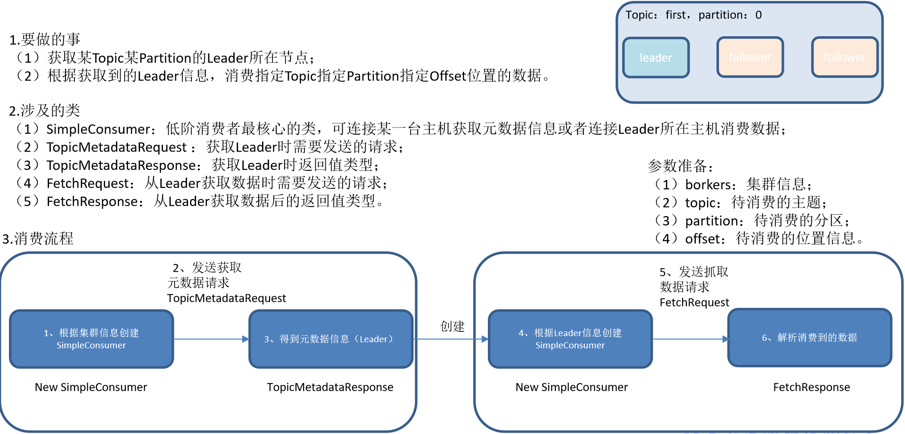

# API使用

- 环境准备
  - 启动ZK和kafka 集群
  - 创建主题api_test
  - 在kafka集群中打开一个消费者

```bash
[ttshe@hadoop102 kafka]$ bin/kafka-topics.sh --zookeeper hadoop102:2181 --create --topic api_test --partitions 4 --replication-factor 2
```

```bash
[ttshe@hadoop102 kafka]$ bin/kafka-console-consumer.sh --zookeeper hadoop102:2181 --topic api_test
```


## pom

```xml
<!-- https://mvnrepository.com/artifact/org.apache.kafka/kafka-clients -->
<dependency>
    <groupId>org.apache.kafka</groupId>
    <artifactId>kafka-clients</artifactId>
    <version>0.11.0.0</version>
</dependency>
<!-- https://mvnrepository.com/artifact/org.apache.kafka/kafka -->
<dependency>
    <groupId>org.apache.kafka</groupId>
    <artifactId>kafka_2.12</artifactId>
    <version>0.11.0.0</version>
</dependency>
```


## 生产者

- 最多只能保证在分区内有序
- 如果分区是1个，那么可以保证topic内有序


### 异步发送数据

- 新API

```java
package com.stt.demo.kafka.Ch01_producer;
import org.apache.kafka.clients.producer.KafkaProducer;
import org.apache.kafka.clients.producer.Producer;
import org.apache.kafka.clients.producer.ProducerRecord;
import java.util.Properties;
import static org.apache.kafka.clients.producer.ProducerConfig.BOOTSTRAP_SERVERS_CONFIG;

public class HelloProducer {

	public static void main(String[] args) {
		// 创建配置对象
		Properties props = new Properties();
		// 所有的配置关键字都是在ProducerConfig中有声明
		// kafka集群配置
		props.put(BOOTSTRAP_SERVERS_CONFIG, "hadoop103:9092");
		// 等待所有副本节点的应答
		// 0 : 不需要应答
		// 1 : 需要leader应答
		// -1(all) : 需要所有副本应答
		props.put("acks", "all");
		// 消息发送最大尝试次数
		// 如果为0，表示失败了不向双端队列中存放
		props.put("retries", 0);
		// 一批消息处理大小
		props.put("batch.size", 16384);
		// 用于延时发送一批消息给kafka，超过该延时，即使batch没有满也要发送消息请求给kafka
		props.put("linger.ms", 1);
		// 发送缓存区内存大小
		props.put("buffer.memory", 33554432);
		// key序列化
		props.put("key.serializer", "org.apache.kafka.common.serialization.StringSerializer");
		// value序列化
		props.put("value.serializer", "org.apache.kafka.common.serialization.StringSerializer");
		// 表示生产者发送的消息的key和value的类型
		// key 用于分区时使用
		Producer<String, String> producer = new KafkaProducer<>(props);
		for (int i = 0; i < 100; i++){
			// 发送100个消息，key是i，value是hello-i
			// 封装数据
			ProducerRecord<String, String> record =
					new ProducerRecord<>("api-test", Integer.toString(i), "hello-" + Integer.toString(i));
			// 发送数据
			producer.send(record);
		}
		// 关闭资源
		producer.close();
	}
}
```

- 旧API

```java
package com.ttshe.kafka;
import java.util.Properties;
import kafka.javaapi.producer.Producer;
import kafka.producer.KeyedMessage;
import kafka.producer.ProducerConfig;

public class OldProducer {

	@SuppressWarnings("deprecation")
	public static void main(String[] args) {
		
		Properties properties = new Properties();
		properties.put("metadata.broker.list", "hadoop102:9092");
		properties.put("request.required.acks", "1");
		properties.put("serializer.class", "kafka.serializer.StringEncoder");
		
		Producer<Integer, String> producer = new Producer<Integer,String>(new ProducerConfig(properties));
		
		KeyedMessage<Integer, String> message = new KeyedMessage<Integer, String>("api_test", "hello world");
		producer.send(message );
	}
}
```


### 同步发送数据

- 同步发送数据在send之后添加get，表示获取发送结果，发送成功后才发送下一个消息

```java
// 发送数据
// 同步发送，发送成功之后继续发送下一个消息
producer.send(record).get();
```


### 含有回调结果

- 修改send函数调用，添加回调方法
- 发送完成之后接收到数据

```java
producer.send(record, new Callback() {
    @Override
    public void onCompletion(RecordMetadata metadata, Exception exception) {
        System.out.println(metadata.topic()+";"+
                           metadata.partition()+";"+metadata.offset());
    }
});
```


### 指定分区号

- 需求：将所有数据存储到topic的第0号分区上
- 自定义分区（新API）

```java
package com.stt.demo.kafka.Ch02_partitioner;

import org.apache.kafka.clients.producer.Partitioner;
import org.apache.kafka.common.Cluster;
import java.util.Map;

public class MyPartitioner implements Partitioner {
	@Override
	public int partition(String topic, Object key, byte[] keyBytes, Object value, byte[] valueBytes, Cluster cluster) {
		// 返回分区号
		return 0;
	}

	@Override
	public void close() {}

	@Override
	public void configure(Map<String, ?> configs) {}
}
```

```java
package com.stt.demo.kafka.Ch02_partitioner;

import org.apache.kafka.clients.producer.KafkaProducer;
import org.apache.kafka.clients.producer.Producer;
import org.apache.kafka.clients.producer.ProducerRecord;
import java.util.Properties;
import static org.apache.kafka.clients.producer.ProducerConfig.BOOTSTRAP_SERVERS_CONFIG;

public class HelloProducer {

	public static void main(String[] args) {
		Properties props = new Properties();
		props.put(BOOTSTRAP_SERVERS_CONFIG, "hadoop102:9092");
		props.put("acks", "all");
		props.put("retries", 0);
		props.put("batch.size", 16384);
		props.put("linger.ms", 1);
		props.put("buffer.memory", 33554432);
		props.put("key.serializer", "org.apache.kafka.common.serialization.StringSerializer");
		props.put("value.serializer", "org.apache.kafka.common.serialization.StringSerializer");
		
        // 自定义分区
		props.put("partitioner.class", "com.stt.demo.kafka.Ch02_partitioner.MyPartitioner");
        
		Producer<String, String> producer = new KafkaProducer<>(props);
		for (int i = 0; i < 10; i++){
			ProducerRecord<String, String> record =
					new ProducerRecord<>("api_test", Integer.toString(i), "hello-" + Integer.toString(i));
			producer.send(record);
		}
		// 关闭资源
		producer.close();
	}
}
```

- 定义一个类实现Partitioner接口，重写里面的方法（过时API）

```java
package com.ttshe.kafka;
import java.util.Map;
import kafka.producer.Partitioner;

public class CustomPartitioner implements Partitioner {

	public CustomPartitioner() {
		super();
	}

	@Override
	public int partition(Object key, int numPartitions) {
		// 控制分区
		return 0;
	}
}
```

- 其他方式
  - 不需要指定`partitioner.class`，直接在创建`ProducerRecord`的时候指定分区号
  - 优先级比`partitioner.class`高

```java
// 指定record的分区
ProducerRecord<String, String> record =
    new ProducerRecord<>("api_test", 0,Integer.toString(i), "hello2-" + Integer.toString(i));
```

- 使用场景
  - 有复杂分区业务逻辑使用`partitioner.class`
  - 简单分区，直接指定的key，在创建`ProducerRecord`时指定分区号


## 消费者


### 高级API

```java
package com.stt.demo.kafka.Ch03_consumer;

import org.apache.kafka.clients.consumer.ConsumerRecord;
import org.apache.kafka.clients.consumer.ConsumerRecords;
import org.apache.kafka.clients.consumer.KafkaConsumer;

import java.util.Arrays;
import java.util.Properties;

public class HighLevelConsumer {

	public static void main(String[] args) {
		Properties props = new Properties();
		// 定义kafka 服务的地址，不需要将所有broker指定上
		props.put("bootstrap.servers", "hadoop102:9092");
		// 制定consumer group
		props.put("group.id", "test2");
		// 是否自动确认offset
		props.put("enable.auto.commit", "true");
		// 自动确认offset的时间间隔
		props.put("auto.commit.interval.ms", "1000");
		// key的序列化类
		props.put("key.deserializer", "org.apache.kafka.common.serialization.StringDeserializer");
		// value的序列化类
		props.put("value.deserializer", "org.apache.kafka.common.serialization.StringDeserializer");
		// 定义consumer
		KafkaConsumer<String, String> consumer = new KafkaConsumer<>(props);

		// 消费者订阅的topic, 可同时订阅多个
		consumer.subscribe(Arrays.asList("api_test"));

		while (true) {
			// 读取数据，读取超时时间为100ms
			ConsumerRecords<String, String> records = consumer.poll(100);

			for (ConsumerRecord<String, String> record : records)
				System.out.printf("offset = %d, key = %s, value = %s%n", record.offset(), record.key(), record.value());
		}
	}
}
```

- 注意，需要先开启消费端，然后再开启客户端


### 低级API

- 实现使用低级API读取指定topic，指定partition,指定offset的数据

- offset可以存储在本地mysql，从而省去读取元数据获取offset操作

- 消费者使用低级API 的主要步骤

  - 根据指定的分区partition从主题topic元数据中找到主副本leader
  - 从主副本拉取分区的消息

- 方法描述

  - getLeader()
    - 客户端向种子节点发送主题元数据，将副本集加入备用节点
  - getData()
    - 消费者低级API拉取消息的主要方法

- 消费流程

  


```java
package com.stt.demo.kafka.Ch03_consumer;

import kafka.api.FetchRequest;
import kafka.api.FetchRequestBuilder;
import kafka.javaapi.*;
import kafka.javaapi.consumer.SimpleConsumer;
import kafka.javaapi.message.ByteBufferMessageSet;
import kafka.message.MessageAndOffset;

import java.io.UnsupportedEncodingException;
import java.nio.ByteBuffer;
import java.util.ArrayList;
import java.util.Arrays;
import java.util.List;

public class LowLevelConsumer {

	/**
	 * 读取指定topic，指定partition,指定offset的数据
	 * 因为一个topic中存在多个partition，而且每一个partition中会有多个副本，所以想要获取指定的数据
	 * 必须从指定分区的主副本中获取数据，那么就必须拿到主副本的元数据信息。
	 * 1）发送主题元数据请求对象
	 * 2）得到主题元数据响应对象，其中包含主题元数据信息
	 * 3）通过主题元数据信息，获取主题的分区元数据信息
	 * 4）获取指定的分区元数据信息
	 * 5）获取分区的主副本信息
	 *
	 * 获取主副本信息后，消费者要连接对应的主副本机器，然后抓取数据
	 * 1）构建抓取数据请求对象
	 * 2）发送抓取数据请求
	 * 3）获取抓取数据响应，其中包含了获取的数据
	 * 4）由于获取的数据为字节码，还需要转换为字符串，用于业务的操作。
	 * 5）将获取的多条数据封装为集合。
 	 * @param args
	 */
	public static void main(String[] args) throws UnsupportedEncodingException {
		List<String> brokersHost = Arrays.asList("hadoop102", "hadoop103", "hadoop104");
		// 连接kafka的集群端口号
		int port = 9092;
		String topic = "api_test";
		int partition = 0;
		long offset = 0;
		// 获取指定topic指定分区的leader的ip
		String leaderHost = getLeaderHost(brokersHost,port,topic,partition);
		// 获取数据
		List<String> data = getData(leaderHost, port, topic, partition, offset);
		for (String datum : data) {
			System.out.println(datum);
		}
	}

	private static String getLeaderHost(List<String> brokersHost, int port, String topic, int partition) {
		for (String broker : brokersHost) {
			// 遍历集群，根据节点信息创建SimpleConsumer
			// 超时时间 ms单位
			// 最后参数：客户端id，用于区分SimpleConsumer
			SimpleConsumer getLeader = new SimpleConsumer(broker, port, 1000, 1024 * 4, "getLeader");
			// 根据传入的主题信息创建元数据请求
			TopicMetadataRequest request = new TopicMetadataRequest(Arrays.asList(topic));
			// 发送元数据请求得到返回值
			TopicMetadataResponse response = getLeader.send(request);

			List<TopicMetadata> topicMetadata = response.topicsMetadata();
			for (TopicMetadata topicMetadatum : topicMetadata) {
				//一个Topic由多个Partition组成
				List<PartitionMetadata> partitionMetadata = topicMetadatum.partitionsMetadata();
				// 遍历多个分区的元数据信息
				for (PartitionMetadata partitionMetadatum : partitionMetadata) {
					// 匹配传入的分区号
					if(partitionMetadatum.partitionId() == partition){
						return partitionMetadatum.leader().host();
					}
				}
			}

		}
		return null;
	}

	private static List<String> getData(String leaderHost, int port, String topic, int partition, long offset) throws UnsupportedEncodingException {
		SimpleConsumer consumer = new SimpleConsumer(leaderHost,port,1000,1024*1024,"getData");
		FetchRequest request = new FetchRequestBuilder().addFetch(topic,partition,offset,1024*1024).build();
		FetchResponse response = consumer.fetch(request);
		ByteBufferMessageSet messageAndOffsets = response.messageSet(topic, partition);
		List<String> result = new ArrayList<>();
		for (MessageAndOffset m : messageAndOffsets) {
			ByteBuffer payload = m.message().payload();
			byte[] bytes = new byte[payload.limit()];
			payload.get(bytes);
			String val = new String(bytes,"utf-8");
			result.add(val);
		}
		return result;
	}
}
```

- 其他写法

```java
package com.atguigu;
import java.nio.ByteBuffer;
import java.util.ArrayList;
import java.util.Collections;
import java.util.HashMap;
import java.util.List;
import java.util.Map;

import kafka.api.FetchRequest;
import kafka.api.FetchRequestBuilder;
import kafka.api.PartitionOffsetRequestInfo;
import kafka.cluster.BrokerEndPoint;
import kafka.common.ErrorMapping;
import kafka.common.TopicAndPartition;
import kafka.javaapi.FetchResponse;
import kafka.javaapi.OffsetResponse;
import kafka.javaapi.PartitionMetadata;
import kafka.javaapi.TopicMetadata;
import kafka.javaapi.TopicMetadataRequest;
import kafka.javaapi.consumer.SimpleConsumer;
import kafka.message.MessageAndOffset;

public class SimpleExample {
    private List<String> m_replicaBrokers = new ArrayList<>();

    public SimpleExample() {
        m_replicaBrokers = new ArrayList<>();
    }

    public static void main(String args[]) {
        SimpleExample example = new SimpleExample();
        // 最大读取消息数量
        long maxReads = Long.parseLong("3");
        // 要订阅的topic
        String topic = "test1";
        // 要查找的分区
        int partition = Integer.parseInt("0");
        // broker节点的ip
        List<String> seeds = new ArrayList<>();
        seeds.add("192.168.9.102");
        seeds.add("192.168.9.103");
        seeds.add("192.168.9.104");
        // 端口
        int port = Integer.parseInt("9092");
        try {
            example.run(maxReads, topic, partition, seeds, port);
        } catch (Exception e) {
            System.out.println("Oops:" + e);
            e.printStackTrace();
        }
    }

    public void run(long a_maxReads, String a_topic, int a_partition, List<String> a_seedBrokers, int a_port) throws Exception {
        // 获取指定Topic partition的元数据
        PartitionMetadata metadata = 
            findLeader(a_seedBrokers, a_port, a_topic, a_partition);
        if (metadata == null) {
            System.out.println("Can't find metadata for Topic and Partition. Exiting");
            return;
        }
        if (metadata.leader() == null) {
            System.out.println("Can't find Leader for Topic and Partition. Exiting");
            return;
        }
        String leadBroker = metadata.leader().host();
        String clientName = "Client_" + a_topic + "_" + a_partition;

        SimpleConsumer consumer = new SimpleConsumer(leadBroker, a_port, 100000, 64 * 1024, clientName);
        long readOffset = getLastOffset(consumer, a_topic, a_partition, kafka.api.OffsetRequest.EarliestTime(), clientName);
        int numErrors = 0;
        while (a_maxReads > 0) {
            if (consumer == null) {
                consumer = new SimpleConsumer(leadBroker, a_port, 100000, 64 * 1024, clientName);
            }
            FetchRequest req = new FetchRequestBuilder().clientId(clientName).addFetch(a_topic, a_partition, readOffset, 100000).build();
            FetchResponse fetchResponse = consumer.fetch(req);

            if (fetchResponse.hasError()) {
                numErrors++;
                // Something went wrong!
                short code = fetchResponse.errorCode(a_topic, a_partition);
                System.out.println("Error fetching data from the Broker:" + leadBroker + " Reason: " + code);
                if (numErrors > 5)
                    break;
                if (code == ErrorMapping.OffsetOutOfRangeCode()) {
                    // We asked for an invalid offset. For simple case ask for
                    // the last element to reset
                    readOffset = getLastOffset(consumer, a_topic, a_partition, kafka.api.OffsetRequest.LatestTime(), clientName);
                    continue;
                }
                consumer.close();
                consumer = null;
                leadBroker = findNewLeader(leadBroker, a_topic, a_partition, a_port);
                continue;
            }
            numErrors = 0;

            long numRead = 0;
            for (MessageAndOffset messageAndOffset : fetchResponse.messageSet(a_topic, a_partition)) {
                long currentOffset = messageAndOffset.offset();
                if (currentOffset < readOffset) {
                    System.out.println("Found an old offset: " + currentOffset + " Expecting: " + readOffset);
                    continue;
                }
                readOffset = messageAndOffset.nextOffset();
                ByteBuffer payload = messageAndOffset.message().payload();

                byte[] bytes = new byte[payload.limit()];
                payload.get(bytes);
                System.out.println(String.valueOf(messageAndOffset.offset()) + ": " + new String(bytes, "UTF-8"));
                numRead++;
                a_maxReads--;
            }

            if (numRead == 0) {
                try {
                    Thread.sleep(1000);
                } catch (InterruptedException ie) {
                }
            }
        }
        if (consumer != null)
            consumer.close();
    }

    public static long getLastOffset(SimpleConsumer consumer, String topic, int partition, long whichTime, String clientName) {
        TopicAndPartition topicAndPartition = new TopicAndPartition(topic, partition);
        Map<TopicAndPartition, PartitionOffsetRequestInfo> requestInfo = new HashMap<TopicAndPartition, PartitionOffsetRequestInfo>();
        requestInfo.put(topicAndPartition, new PartitionOffsetRequestInfo(whichTime, 1));
        kafka.javaapi.OffsetRequest request = new kafka.javaapi.OffsetRequest(requestInfo, kafka.api.OffsetRequest.CurrentVersion(), clientName);
        OffsetResponse response = consumer.getOffsetsBefore(request);

        if (response.hasError()) {
            System.out.println("Error fetching data Offset Data the Broker. Reason: " + response.errorCode(topic, partition));
            return 0;
        }
        long[] offsets = response.offsets(topic, partition);
        return offsets[0];
    }


    private String findNewLeader(String a_oldLeader, String a_topic, int a_partition, int a_port) throws Exception {
        for (int i = 0; i < 3; i++) {
            boolean goToSleep = false;
            PartitionMetadata metadata = findLeader(m_replicaBrokers, a_port, a_topic, a_partition);
            if (metadata == null) {
                goToSleep = true;
            } else if (metadata.leader() == null) {
                goToSleep = true;
            } else if (a_oldLeader.equalsIgnoreCase(metadata.leader().host()) && i == 0) {
                // first time through if the leader hasn't changed give
                // ZooKeeper a second to recover
                // second time, assume the broker did recover before failover,
                // or it was a non-Broker issue
                //
                goToSleep = true;
            } else {
                return metadata.leader().host();
            }
            if (goToSleep) {
                    Thread.sleep(1000);
            }
        }
        System.out.println("Unable to find new leader after Broker failure. Exiting");
        throw new Exception("Unable to find new leader after Broker failure. Exiting");
    }

    private PartitionMetadata findLeader(List<String> a_seedBrokers, int a_port, String a_topic, int a_partition) {
        PartitionMetadata returnMetaData = null;
        loop:
        for (String seed : a_seedBrokers) {
            SimpleConsumer consumer = null;
            try {
                consumer = new SimpleConsumer(seed, a_port, 100000, 64 * 1024, "leaderLookup");
                List<String> topics = Collections.singletonList(a_topic);
                TopicMetadataRequest req = new TopicMetadataRequest(topics);
                kafka.javaapi.TopicMetadataResponse resp = consumer.send(req);

                List<TopicMetadata> metaData = resp.topicsMetadata();
                for (TopicMetadata item : metaData) {
                    for (PartitionMetadata part : item.partitionsMetadata()) {
                        if (part.partitionId() == a_partition) {
                            returnMetaData = part;
                            break loop;
                        }
                    }
                }
            } catch (Exception e) {
                System.out.println("Error communicating with Broker [" + seed + "] to find Leader for [" + a_topic + ", " + a_partition + "] Reason: " + e);
            } finally {
                if (consumer != null)
                    consumer.close();
            }
        }
        if (returnMetaData != null) {
            m_replicaBrokers.clear();
            for (BrokerEndPoint replica : returnMetaData.replicas()) {
                m_replicaBrokers.add(replica.host());
            }
        }
        return returnMetaData;
    }
}
```


# 生产者拦截器


## 说明

- Producer拦截器(interceptor)是在Kafka 0.10版本被引入
- 主要用于实现clients端的定制化控制逻辑
- 对于producer
  - interceptor使得用户在消息发送前
  - producer回调逻辑前有机会对消息做一些定制化需求
    - 如==修改消息==等
- producer允许指定多个interceptor按序作用于同一条消息而形成一个拦截链(interceptor chain)
- intercetpor的实现接口是`org.apache.kafka.clients.producer.ProducerInterceptor`
  - 其定义的方法
    - configure(configs)
      - 获取配置信息和初始化数据时调用
    - onSend(ProducerRecord)
      - 该方法封装进KafkaProducer.send方法中，即它运行在用户主线程中
      - Producer确保在消息被序列化以及计算分区前调用该方法
      - ==用户可以在该方法中对消息做任何操作==
        - 最好保证不要修改消息所属的topic和分区，否则会影响目标分区的计算
    - onAcknowledgement(RecordMetadata, Exception)
      - 该方法会在消息被应答或消息发送失败时调用
      - 通常都是在producer回调逻辑触发之前
      - onAcknowledgement运行在producer的IO线程中，不要在该方法中放入很重的逻辑，否则会拖慢producer的消息发送效率
    - close
      - 关闭interceptor
      - 用于执行一些资源清理工作
- interceptor可能被运行在多个线程中
  - 具体实现时用户需要自行确保线程安全
- 若指定了多个interceptor，则producer将按照指定顺序调用
  - 仅仅是捕获每个interceptor可能抛出的异常记录到错误日志中==而非向上传递==
    - 这在使用过程中要特别留意


## 示例

- 需求：实现一个简单的双interceptor组成的拦截链
  - 第一个interceptor会在消息发送前将时间戳信息加到消息value的最前部
  - 第二个interceptor会在消息发送后更新成功发送消息数或失败发送消息数

```java
package com.stt.demo.kafka.Ch04_interceptor;

import org.apache.kafka.clients.producer.ProducerInterceptor;
import org.apache.kafka.clients.producer.ProducerRecord;
import org.apache.kafka.clients.producer.RecordMetadata;

import java.util.Map;

public class TimeInterceptor implements ProducerInterceptor<String,String> {

	@Override
	public ProducerRecord<String, String> onSend(ProducerRecord<String, String> record) {
		// 创建一个新的record，把时间戳写入消息体的最前部
		return new ProducerRecord(record.topic(),record.partition(),record.timestamp(),record.key()
				,record.value().toString()+":"+System.currentTimeMillis());
	}

	@Override
	public void onAcknowledgement(RecordMetadata metadata, Exception exception) {

	}

	@Override
	public void close() {

	}

	@Override
	public void configure(Map<String, ?> configs) {

	}
}
```

```java
package com.stt.demo.kafka.Ch04_interceptor;

import org.apache.kafka.clients.producer.ProducerInterceptor;
import org.apache.kafka.clients.producer.ProducerRecord;
import org.apache.kafka.clients.producer.RecordMetadata;

import java.util.Map;

public class CounterInterceptor implements ProducerInterceptor<String,String> {

	private int errorCounter = 0;
	private int successCounter = 0;

	@Override
	public ProducerRecord<String, String> onSend(ProducerRecord<String, String> record) {
		return record;
	}

	// 统计发送消息成功和发送失败消息数，并在producer关闭时打印这两个计数器
	@Override
	public void onAcknowledgement(RecordMetadata metadata, Exception exception) {
		if(exception != null){
			errorCounter ++;
		}else{
			successCounter ++;
		}
	}

	@Override
	public void close() {
		// 保存结果
		System.out.println("Successful sent: " + successCounter);
		System.out.println("Failed sent: " + errorCounter);
	}

	@Override
	public void configure(Map<String, ?> configs) {
	}
}
```

```java
package com.stt.demo.kafka.Ch04_interceptor;

import org.apache.kafka.clients.producer.KafkaProducer;
import org.apache.kafka.clients.producer.Producer;
import org.apache.kafka.clients.producer.ProducerConfig;
import org.apache.kafka.clients.producer.ProducerRecord;

import java.util.Arrays;
import java.util.Properties;


public class InterceptorProducer {

	public static void main(String[] args) {
		Properties props = new Properties();
		props.put("bootstrap.servers", "hadoop102:9092");
		props.put("acks", "all");
		props.put("retries", 0);
		props.put("batch.size", 16384);
		props.put("linger.ms", 1);
		props.put("buffer.memory", 33554432);
		props.put("key.serializer", "org.apache.kafka.common.serialization.StringSerializer");
		props.put("value.serializer", "org.apache.kafka.common.serialization.StringSerializer");

		// 构建拦截链
		props.put(ProducerConfig.INTERCEPTOR_CLASSES_CONFIG, Arrays.asList(
				"com.stt.demo.kafka.Ch04_interceptor.TimeInterceptor",
				"com.stt.demo.kafka.Ch04_interceptor.CounterInterceptor"));
		Producer<String, String> producer = new KafkaProducer<>(props);
		// 发送消息
		for (int i = 0; i < 10; i++) {
			producer.send(new ProducerRecord<>("api_test", "message" + i));
		}

		//一定要关闭producer，这样才会调用interceptor的close方法
		producer.close();
	}
}
```

