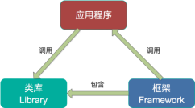

# Kafka Streams（了解）

- Apache Kafka开源项目的一个组成部分
- 一个功能强大，易于使用的库
- 用于在Kafka上构建高可分布式、拓展性，容错的应用程序
- ==用的不多==
  - 2个topic相互转换
  - 一般用一个topic进行转换后，返回到该topic中


## 特点

- 功能强大 
- 高扩展性，弹性，容错 
- 轻量级 
- 无需专门的集群 
- 一个库，而不是框架
- 完全集成 
- 100%的Kafka 0.10.0版本兼容
- 易于集成到现有的应用程序 
- 实时性
- 毫秒级延迟 
- 并非微批处理 
- 窗口允许乱序数据 
- 允许迟到数据


## 好处

- 开源流式处理系统有Spark Streaming和Apache Storm
  - Apache Storm发展多年，应用广泛，提供记录级别的处理能力，当前也支持SQL on Stream
  - Spark Streaming基于Apache Spark，可以非常方便与图计算，SQL处理等集成，功能强大，对于熟悉其它Spark应用开发的用户而言使用门槛低
  - 目前主流的Hadoop发行版，如Cloudera和Hortonworks集成了Apache Storm和Apache Spark，使得部署更容易

既然Apache Spark与Apache Storm拥用如此多的优势，那为何还需要Kafka Stream呢？

- Spark和Storm都是流式处理框架，而Kafka Stream提供的是一个基于Kafka的流式处理类库
- 框架要求开发者按照特定的方式去开发逻辑部分，供框架调用
- 开发者很难了解框架的具体运行方式，从而使得调试成本高，并且使用受限
- Kafka Stream作为流式处理类库，直接提供具体的类给开发者调用，整个应用的运行方式主要由开发者控制，方便使用和调试

 

- 虽然Cloudera与Hortonworks方便了Storm和Spark的部署，但是这些框架的部署仍然相对复杂
  - Kafka Stream作为类库，可以非常方便的嵌入应用程序中，它对应用的打包和部署基本没有任何要求
- 就流式处理系统而言，基本都支持Kafka作为数据源
  - 如Storm具有专门的kafka-spout
  - Spark提供专门的spark-streaming-kafka模块
  - 事实上，Kafka基本上是主流的流式处理系统的标准数据源
  - 大部分流式系统中都已部署了Kafka
  - 使用Kafka Stream的成本非常低
- 使用Storm或Spark Streaming时，需要为框架本身的进程预留资源
  - 如Storm的supervisor和Spark on YARN的node manager
  - 即使对于应用实例而言，框架本身也会占用部分资源
    - 如Spark Streaming需要为shuffle和storage预留内存
  - 是Kafka作为类库不占用系统资源
- 由于Kafka本身提供数据持久化，因此Kafka Stream提供滚动部署和滚动升级以及重新计算的能力
- 由于Kafka Consumer Rebalance机制，Kafka Stream可以在线动态调整并行度


## 案例

需求：实时处理单词带有”>>>”前缀的内容。例如输入”yyy>>>xxx”，最终处理成“yyyxxx”

- 添加pom

```xml
<dependency>
    <groupId>org.apache.kafka</groupId>
    <artifactId>kafka-streams</artifactId>
    <version>0.11.0.2</version>
</dependency>
```

- 实现

```java
package com.stt.demo.kafka.Ch05_streams;

import org.apache.kafka.streams.KafkaStreams;
import org.apache.kafka.streams.StreamsConfig;
import org.apache.kafka.streams.processor.Processor;
import org.apache.kafka.streams.processor.ProcessorContext;
import org.apache.kafka.streams.processor.ProcessorSupplier;
import org.apache.kafka.streams.processor.TopologyBuilder;
import java.io.UnsupportedEncodingException;
import java.util.Properties;

public class MyStreams {

	/**
	 * 需要2个topic，一个是输入，一个是输出
	 * @param args
	 */
	public static void main(String[] args) {

		String fromTopic = "fromTopic";
		String toTopic = "toTopic";
		// 参数
		Properties prop = new Properties();
		// 定义本次应用的id
		prop.put(StreamsConfig.APPLICATION_ID_CONFIG,"myFilter");
		prop.put(StreamsConfig.BOOTSTRAP_SERVERS_CONFIG,"hadoop102:9092");

		StreamsConfig config = new StreamsConfig(prop);

		// 构建拓扑
		TopologyBuilder topologyBuilder = new TopologyBuilder()
						.addSource("mySource",fromTopic)
						.addProcessor("myProcessor", new ProcessorSupplier<byte[],byte[]>() {
							@Override
							public Processor get() {
								return new MyProcessor();
							}
						},"mySource")
						.addSink("mySink",toTopic,"myProcessor");
		// 创建streams
		KafkaStreams kafkaStreams = new KafkaStreams(topologyBuilder,config);
		kafkaStreams.start();
	}


	static class MyProcessor implements Processor<byte[], byte[]>{

		private ProcessorContext context;

		@Override
		public void init(ProcessorContext processorContext) {
			this.context = processorContext;
		}

		@Override
		public void process(byte[] key, byte[] value) {
			try {
				String input = new String(value,"utf-8");
				input = input.replaceAll(">>>","");
				context.forward(key,input.getBytes("utf-8"));
			} catch (UnsupportedEncodingException e) {
				e.printStackTrace();
			}
		}

		@Override
		public void punctuate(long l) {

		}

		@Override
		public void close() {

		}
	}
}
```


测试

- 创建2个topic：fromTopic和toTopic

```bash
[ttshe@hadoop102 kafka]$ bin/kafka-topics.sh --zookeeper hadoop102:2181 --create --topic fromTopic --partitions 1 --replication-factor 1
[ttshe@hadoop102 kafka]$ bin/kafka-topics.sh --zookeeper hadoop102:2181 --create --topic toTopic --partitions 1 --replication-factor 1
```

- 启动main程序
  - 程序进行监听消息
- 启动消费者，从toTopic获取消息

```bash
[ttshe@hadoop102 kafka]$ bin/kafka-console-consumer.sh --zookeeper hadoop102:2181 --from-beginning --topic toTopic
```

- 启动生产者，发送消息给fromTopic，并输入内容，如“xxx>>>yyy”，查看结果显示

```bash
[ttshe@hadoop102 kafka]$ bin/kafka-console-producer.sh --broker-list hadoop102:9092 --topic fromTopic
```

