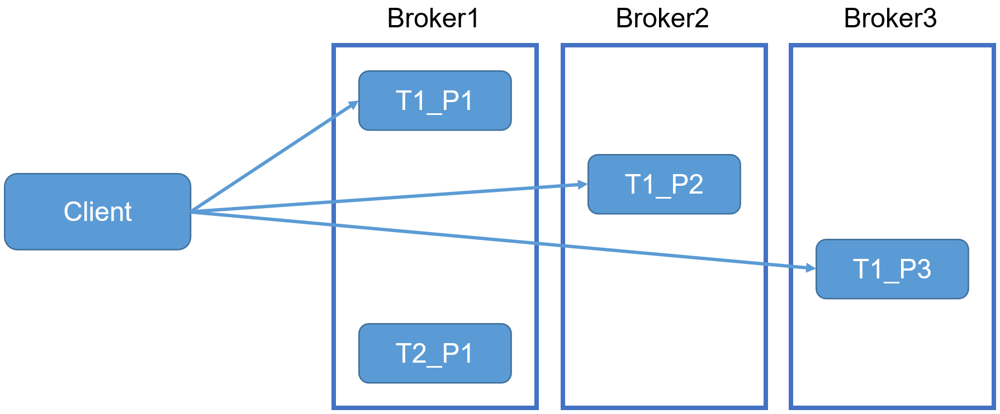
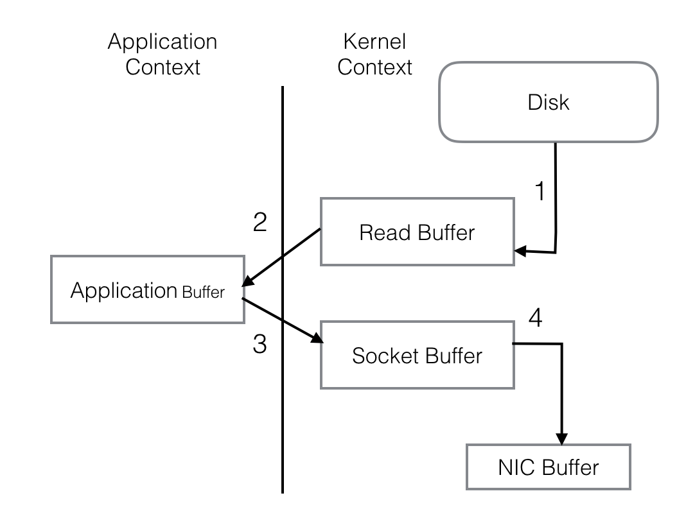
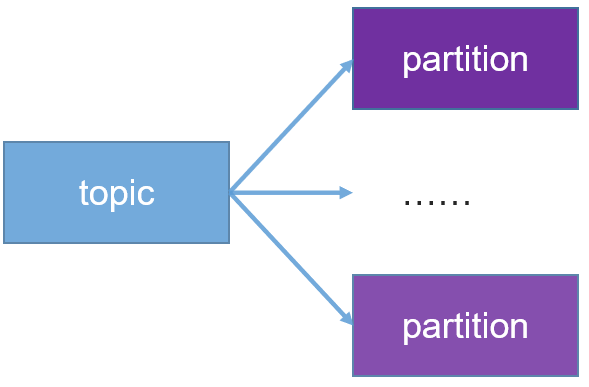
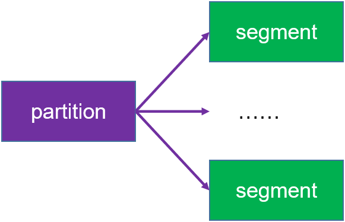

# 扩展


## kafka与flume比较

- flume
  - cloudera公司研发
  - 适合多个生产者
  - 适合下游数据消费者不多的情况
  - 适合数据安全性要求不高的操作
    - 宕机会有数据丢失
  - 适合与Hadoop生态圈对接的操作

- kafka
  - linkedin公司研发
  - 适合数据下游消费众多的情况
  - 适合数据安全性要求较高的操作
  - 支持replication

- 常用模型
  - 线上数据 --> flume --> kafka --> flume(根据情景增删该流程) --> HDFS


## kafka与flume集成


### 配置flume

```bash
[ttshe@hadoop103 job]$ touch flume-log-2-kafka.conf
[ttshe@hadoop103 job]$ vim flume-log-2-kafka.conf 
```

```bash
# define
a1.sources = r1
a1.sinks = k1
a1.channels = c1

# source
# 表示执行命令
a1.sources.r1.type = exec
a1.sources.r1.command = tail -F -c +0 /opt/module/datas/flume.log
a1.sources.r1.shell = /bin/bash -c

# sink
a1.sinks.k1.type = org.apache.flume.sink.kafka.KafkaSink
a1.sinks.k1.kafka.bootstrap.servers = hadoop102:9092,hadoop103:9092,hadoop104:9092
a1.sinks.k1.kafka.topic = my-topic
a1.sinks.k1.kafka.flumeBatchSize = 20
a1.sinks.k1.kafka.producer.acks = 1
a1.sinks.k1.kafka.producer.linger.ms = 1

# channel
a1.channels.c1.type = memory
a1.channels.c1.capacity = 1000
a1.channels.c1.transactionCapacity = 100

# bind
a1.sources.r1.channels = c1
a1.sinks.k1.channel = c1
```


### 测试

- 启动kafka消费者

```bash
[ttshe@hadoop102 kafka]$ bin/kafka-console-consumer.sh --zookeeper hadoop102:2181 --from-beginning --topic my-topic
```

- 启动flume

```bash
[ttshe@hadoop102 flume]$ bin/flume-ng agent -C conf/ -n a1 -f job/flume-log-2-kafka.conf
```

- 向 /opt/module/datas/flume.log里追加数据，查看kafka消费者消费情况

```bash
[ttshe@hadoop102 datas]$ echo hlll2 >> flume.log
```


# 面试


## kafka的Balance如何处理

- Kafka的数据是分区存储的，以集群形式运行的Kafka，这些分区是分布在不同的Kafka服务器中
- 当消费者消费的数据分布在不同的分区时，会访问不同的服务器，这样就完成了负载均衡
- Kafka的负载均衡是通过分区机制实现的

 


## kafka的偏移量Offset存储在哪里

- Kafka0.9版本以前，offset默认保存在Zookeeper中
- 从kafka-0.9版本及以后，kafka的消费者组和offset信息存到broker服务器上
- 变动的原因
  - 之前版本Kafka其实存在一个比较大的隐患
    - 利用 Zookeeper 来存储记录每个消费者/组的消费进度
    - 虽然在使用过程当中，JVM帮助我们完成了一些优化
    - 但是消费者需要频繁的去与 Zookeeper 进行交互
  - 利用ZKClient的API操作Zookeeper频繁的Write其本身就是一个比较低效的Action
    - 对于后期水平扩展也是一个比较头疼的问题
    - 如果期间 Zookeeper 集群发生变化，那 Kafka 集群的吞吐量也跟着受影响

 


## 为什么kafka可实现高吞吐

- 分区存储
  - 提高并发


## 为什么单节点kafka的吞吐量也比其他消息队列大

- 磁盘顺序存储
  - 顺序读写
  - kafka的消息是不断追加到文件中的，这个特性使kafka可以充分利用磁盘的顺序读写性能，顺序读写不需要硬盘磁头的寻道时间，只需很少的扇区旋转时间，所以速度远快于随机读写

 

- 零拷贝
  - 参考https://blog.csdn.net/stark_summer/article/details/50144591
  - 在Linux kernel2.2 之后出现了一种叫做"零拷贝(zero-copy)"系统调用机制，就是跳过“用户缓冲区”的拷贝，建立一个磁盘空间和内存的直接映射，数据不再复制到“用户态缓冲区”，系统上下文切换减少为2次，可以提升一倍的性能

传统的网络I/O操作流程，大体上分为以下4步

1. OS从硬盘把数据读到内核区的PageCache
2. 用户进程把数据从内核区Copy到用户区。
3. 然后用户进程再把数据写入到Socket，数据流入内核区的Socket Buffer上。
4. OS再把数据从Buffer中Copy到网卡的Buffer上，这样完成一次发送

  

整个过程共经历两次Context Switch，四次System Call。同一份数据在内核Buffer与用户Buffer之间重复拷贝，效率低下。其中2、3两步没有必要，完全可以直接在内核区完成数据拷贝

 

Kafka的设计初衷是尽一切努力在内存中完成数据交换，无论是对外作为一整个消息系统，或是内部同底层操作系统的交互。如果Producer和Consumer之间生产和消费进度上配合得当，完全可以实现数据交换零I/O。这也就是为什么说Kafka使用“硬盘”并没有带来过多性能损失的原因

- 文件分段
  - kafka的队列topic被分为了多个区partition，每个partition又分为多个段segment，所以一个队列中的消息实际上是保存在N多个片段文件中，通过分段的方式，每次文件操作都是对一个小文件的操作，非常轻便，同时也增加了并行处理能力

b 

 


## kafka消费过的数据如何再消费

- 修改offset
  - Kafka消息队列中消费过的数据是用offset标记的
  - 通过修改offset到以前消费过的位置，可以实现数据的重复消费
  - 通过使用不同的group来消费
    - Kafka中不同的消费者组的offset是独立的
    - 通过不同的消费者组实现数据的重复消费
    - 需要将`ConsumerConfig.AUTO_OFFSET_RESET_CONFIG`属性修改为`earliest`
      - 对offset进行重置读取
      - 如果找不到原先的offset（存储的是groupId:partition:offset），则从最开始的offset开始
        - 正常情况下每次读取消息会修改offset值
      - 如果原先有offset，然后设置该值，那么会从上次保存的offset进行读取


## 为了避免磁盘被占满，Katka会周期性地删除陈旧的消息，删除策略是什么呢

Kafka中有两种“保留策略”：
一种是根据消息保留的时间，当消息在Kafka中保存的时间超过了指定时间，就可以被删除;
另一种是根据Topic存储的数据大小，当Topic所占的日志文件大小大于一个阈值，则可以开始删除最旧的消息
Kafka会启动一个后台线程，定期检查是否存在可以删除的消息。
“保留策略”的配置是非常灵活的，可以有全局的配置，也可以针对Topic进行配置覆盖全局配置


## kafka的主要特征是什么？总共有五点

（1）Kafka具有近乎实时性的消息处理能力，即使面对海量消息也能够高效地存储消息和查询消息。Kafka将消息保存在磁盘中，在其设计理念中并不惧怕磁盘操作，它以顺序读写的方式访问磁盘，从而避免了随机读写磁盘导致的性能瓶颈。
（2）Kafka支持批量读写消息，并且==-会对消息进行批量压缩==，这样既提高了网络的利用率，也提高了压缩效率。
（3）Kafka支持消息分区，每个分区中的消息保证顺序传输，而==分区之间则可以并发操作==，这样就==提高了Kafka的并发能力==
（4）Kafka也支持在线增加分区，支持在线水平扩展
（5）Kafka支持为每个分区创建多个副本，其中只会有一个Leader副本负责读写，其他副本只负责与Leader副本进行同步，这种方式提高了数据的容灾能力。Kafka会将Leader副本均匀地分布在集群中的服务器上，实现性能最大化


## 请举列说出kafka的应用场景？

（1）在应用系统中可以将Kafka作为传统的消息中间件，实现消息队列和消息的发布订阅，在某些场景下，性能会超越RabbitMQ，ActiveMQ等传统的消息中间件。
（2）Kafka也被用作系统中的数据总线，将其接人多个子系统中，子系统会将产生的数据发送到Kafka中保存，之后流转到目的系统中。
（3）Kafka还可以用作日志收集中心，多个系统产生的日志统收集到Kafka中，然后由数据分析平台进行统一处理。日志会被Kafka持久化到磁盘，所以同时支持离线数据处理和实时数据处理。
（4）现在也有开发人员基于Kafka设计数据库主从同步的工具


## 主题分区的作用？

Kafka的每个Topic (主题)都可以分为多个Partition (分区)，每个分区都有多个Replica(副本)，实现消息冗余备份。
每个分区中的消息是不同的，这类似于数据库中水平切分的思想，提高了并发读写的能力。
而同一分区的不同副本中保存的是相同的消息，副本之间是一主多从的关系，其中Leader副本负责处理读写请求，Follower 副本则只与Leader副本进行消息同步，当Leader副本出现故障时，则从Follower 副本中重新选举Leader副本对外提供服务。这样，通过提高分区的数量，就可以实现水平扩展，通过提高副本的数量，就可以提高容灾能力


## Consumer的水平扩展是如何实现的呢？

Kafka支持Consumer的水平扩展能力。可以让多个Consumer加入一个Consumer Group(消费组)，在一个Consumer Group中，每个分区只能分配给一个Consumer消费者，当Kafka服务端通过增加分区数量进行水平扩展后，可以向Consumer Group中增加新的Consumer来提高整个Consumer Group的消费能力。当Consumer Group中的一个Consumer出现故障下线时，会通过Rebalance操作将下线Consumer，它负责处理的分区将分配给其他Consumer继续处理。当下线Consumer重新上线加人Consumer Group时，会再进行一次Rebalance操作，重新分配分区


## 请简述一下消息的顺序

Kafka保证一个Partition内消息的有序性，但是并不保证多个Partition之间的数据有顺序。 每个Topic可以划分成多个分区( 每个Topic都至少有一个分区)，同一Topic下的不同分区包含的消息是不同的。每个消息在被添加到分区时，都会被分配一个offset，它是消息在此分区中的唯一编号，Kafka 通过offset保证消息在分区内的顺序，offset 的顺序性不跨分区，即Kafka只保证在同一个分区内的消息是有序的，同一Topic的多个分区内的消息，Kafka并不保证其顺序性


## 什么是日志压缩？

在很多场景中，消息的key与value的值之间的对应关系是不断变化的，就像数据库中的数据会不断被修改一样，消费者只关心key对应的最新value值。此时，可以开启Kafka的日志压缩功能，Kafka会在后台启动一个线程，定期将相同key的消息进行合并， 只保留最新的value值


## 什么是broker？它的作用是什么？

一个单独的Kafka Server就是一个Broker。Broker的主要工作就是接收生产者发过来的消息，分配offset，之后保存到磁盘中。
同时，接收消费者、其他Broker的请求，根据请求类型进行相应处理并返回响应。在一般的生产环境中，一个Broker独占一台物理服务器


## 同一分区的多个副本包括的消息是否是一致的？

每个副本中包含的消息是一样的，但是在同一时刻，副本之间其实并不是完全一样的

- HW LEO


## ISR集合是什么？谁在维护着？如何维护呢？

ISR (In-Sync Replica)集合表示的是目前“可用”( alive)且消息量与Leader相差不多的副本集合，这是整个副本集合的一个子集。“可用” 和“相差不多”都是很模糊的描述，其实际含义是ISR集合中的副本必须满足下面两个条件:
(1)副本所在节点必须维持着与ZooKeeper的连接。
(2)副本最后一条消息的offset与Leader副本的最后一条消息的offset之间的差值不能超出指定的阈值。

每个分区中的Leader副本都会维护此分区的ISR集合。写请求首先由Leader副本处理，之后Follower副本会从Leader上拉取写入的消息，这个过程会有一定的延迟，导致Follower副本中保存的消息略少于Leader副本，只要未超出阈值都是可以容忍的。如果一个Follower副本出现异常，比如：宕机，发生长时间GC而导致僵死或是网络断开连接导致长时间没有拉取消息进行同步，就会违反上面的两个条件，从而被Leader副本踢出ISR集合。当Follower副本从异常中恢复之后，会继续与Leader副本进行同步，当Follower副本“追上”(即最后一条消息的offset的差值小于指定阈值)Leader副本的时候，此Follower副本会被Leader副本重新加入到ISR中

- ISR是leader和follower的集合，而且follower的数据与leader的数据相差不多
- 当follower宕机等导致与leader数据相差过多超过阈值，则会剔除ISR
- follower从异常中恢复，则会继续与leader进行同步，当数据差异小于阈值，则重新加入ISR中