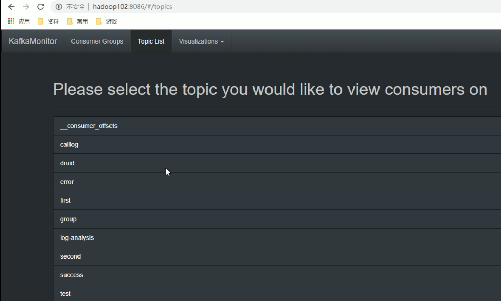

1.上传jar包KafkaOffsetMonitor-assembly-0.2.0.jar到集群

2.在/opt/module/下创建kafka-offset-console文件夹

3.将上传的jar包放入刚创建的目录下

4.在/opt/module/kafka-offset-console目录下创建启动脚本start_en.sh，内容如下：

```bash
#!/bin/bash
java -Xms512M -Xmx512M -Xss1024K -XX:PermSize=256m -XX:MaxPermSize=512m -cp KafkaOffsetMonitor-assembly-0.2.0.jar \
     com.quantifind.kafka.offsetapp.OffsetGetterWeb \
     --zk 192.168.9.102:2181,192.168.9.103:2182,192.168.9.104:2181 \
     --port 8086 \
     --refresh 10.seconds \
     --retain 7.days 1>mobile-logs/stdout.log 2>mobile-logs/stderr.log &
```

5.在/opt/module/kafka-offset-console目录下创建mobile-logs文件夹
mkdir /opt/module/kafka-offset-console/mobile-logs

6.启动KafkaMonitor

```bash
./start_en.sh
```

7.登录页面hadoop102:8086端口查看详情

