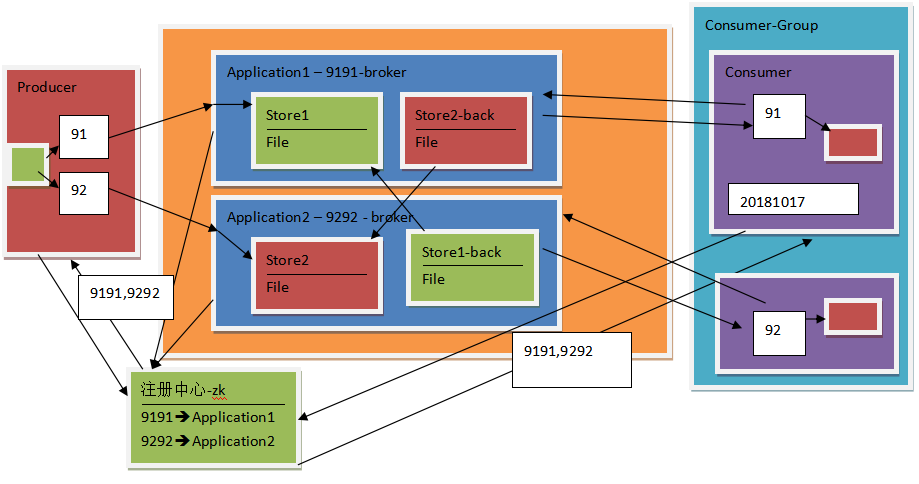
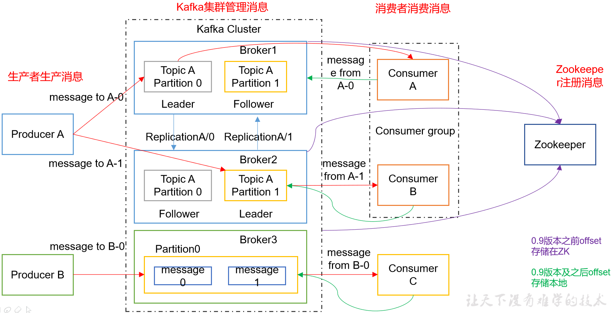
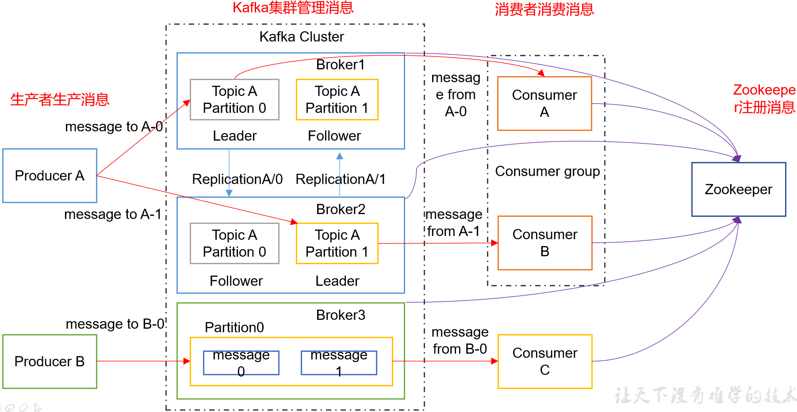
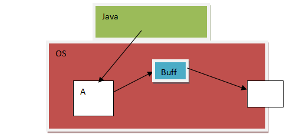
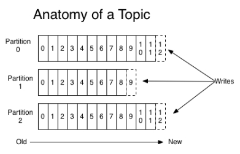
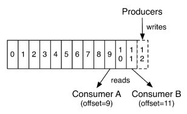
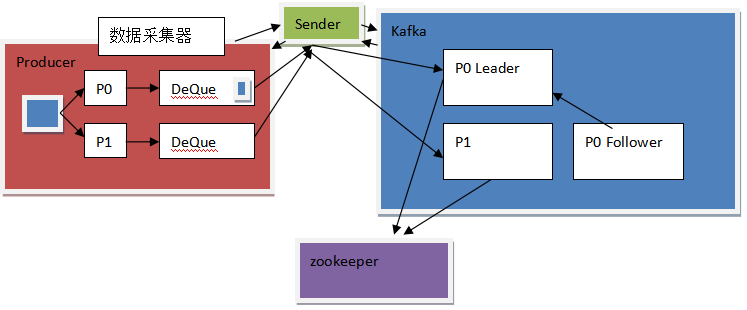
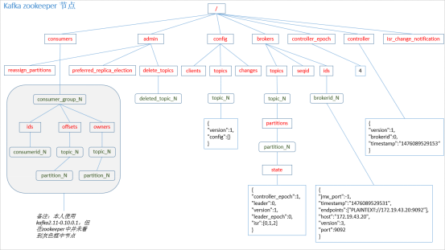
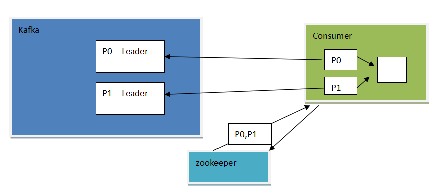
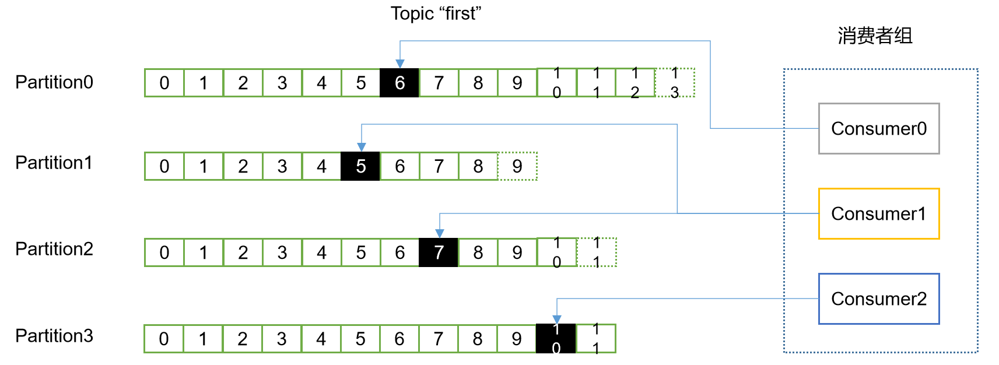

# 讨论

- 由于flume的一些缺点

  - 数据无法保存，客户如果想延迟获取做不到

  - 增加消费者,OCP
    - 要重启flume，导致现有消费者受到影响

  - 重复消费

- 设计一个存储系统，如何解决这些缺点？



- 该系统需要存储文件
  - store==>file
- 支持负载均衡的考虑
  - 多机部署
  - 需要负载均衡器
    - 如果Producer过多，会造成负载均衡器负载过重
    - 更改为注册中心，producer自己与存储系统Application通信
      - 每次返回Application的IP
      - producer内部做负载均衡和轮训机制
- 支持容灾的考虑
  - 如果有机器宕机，如何保证不丢失数据
  - 对数据进行备份
    - 备份数据不能存储在相同机器
    - 备份数据store-back存储在另一个Application上
    - 备份的数据如何同步？
      - producer发送数据给store和store-back？
        - 不合适，耦合性强，producer需要多关注数据的传输
      - 由Application内部进行同步
        - 由Store发送给Store-bak？
          - 不合适，store本身用于接收数据处理，负担重
          - Store-bak从Store拉取数据，合适
    - 如何保证数据的可见性？
      - 数据的可见性，store更新数据后，store-bak有也进行更新，保持同步
      - store更新了数据，而store-bak未更新数据，那么producer接收不到store发送的接收数据成功的回复，就是发送数据失败
- 关于消费者
  - 消费者获取数据是store推送还是拉取？
    - 拉取，推送会导致store完成的功能过多，负载过重，而拉取可以有效的解耦

- 增加消费者如何避免影响？
  - 增加的消费者从注册中心获取store的ip进行store的数据拉取，对现有的消费者没有影响
    - 没有重启store
- 消费者的消费模式
  - 多个消费者做负载均衡，消费同一批数据，那么消费者需要在一个consumer-group中，一个消费者拉取指定的数据，一个消费者拉取另一个指定的数据
  - 多个消费者如果不在同一个consumer-group，那么拉取的数据会有重复
- 如何重复拉取数据
  - 一个消费者如何可以再次拉取之前的数据？
    - 存储拉取历史记录，如拉取的时间点
    - 历史记录存储在消费者
      - 如存储在store中，造成耦合，负载过重


# 概念


## 消息队列

- 特点
  - 存储数据
  - 异步通信
  - 削峰处理


- 点对点模式
  - 一对一，消费者主动拉取数据，消息收到后消息清除
  - 点对点模型通常是一个基于拉取或者轮询的消息传送模型，这种模型从队列中请求信息，而不是将消息推送到客户端。这个模型的特点是发送到队列的消息被一个且只有一个接收者接收处理，即使有多个消息监听者也是如此。
- 发布/订阅模式
  - 一对多
  - 发布订阅模型则是另一个消息传送模型。发布订阅模型可以有多种不同的订阅者，临时订阅者只在主动监听主题时才接收消息，而持久订阅者则监听主题的所有消息，即使当前订阅者不可用，处于离线状态


## 为什么需要消息队列

- 解耦
  - 允许你独立的扩展或修改两边的处理过程，只要确保它们遵守同样的接口约束。

- 冗余
  - 消息队列把数据进行持久化直到它们已经被完全处理，通过这一方式规避了数据丢失风险。许多消息队列所采用的"插入-获取-删除"范式中，在把一个消息从队列中删除之前，需要你的处理系统明确的指出该消息已经被处理完毕，从而确保你的数据被安全的保存直到你使用完毕。

- 扩展性
  - 因为消息队列解耦了你的处理过程，所以增大消息入队和处理的频率是很容易的，只要另外增加处理过程即可

- 灵活性 & 峰值处理能力
  - 在访问量剧增的情况下，应用仍然需要继续发挥作用，但是这样的突发流量并不常见。如果为以能处理这类峰值访问为标准来投入资源随时待命无疑是巨大的浪费。使用消息队列能够使关键组件顶住突发的访问压力，而不会因为突发的超负荷的请求而完全崩溃。

- 可恢复性
  - 系统的一部分组件失效时，不会影响到整个系统。消息队列降低了进程间的耦合度，所以即使一个处理消息的进程挂掉，加入队列中的消息仍然可以在系统恢复后被处理。

- ==顺序保证==
  - 在大多使用场景下，数据处理的顺序都很重要
  - 大部分消息队列本来就是排序的，并且能保证数据会按照特定的顺序来处理
  - Kafka保证一个Partition内的消息的有序性

- 缓冲
  - 有助于控制和优化数据流经过系统的速度，解决生产消息和消费消息的处理速度不一致的情况。

- 异步通信
  - 很多时候，用户不想也不需要立即处理消息。消息队列提供了异步处理机制，允许用户把一个消息放入队列，但并不立即处理它。想向队列中放入多少消息就放多少，然后在需要的时候再去处理它们


## 关于Kafka

- 在流式计算中，一般用来缓存数据，Spark通过消费Kafka的数据进行计算

- 一个开源**消息**系统，由Scala写成
  - 是由Apache软件基金会开发的一个开源消息系统项目
  - Kafka最初是由LinkedIn公司开发，并于2011年初开源。2012年10月从Apache Incubator毕业
  - 该项目的目标是为处理实时数据提供一个统一、高通量、低等待的平台。

- **一个分布式消息队列**
  - Kafka对消息保存是根据==Topic==进行归类
  - 发送消息者称为Producer
    - **不依赖ZK获取kafka的注册信息，直接与kafka通信获取所有kafka集群信息**
      - 减少与ZK建立连接的性能消耗
  - 消息接受者称为Consumer
  - kafka集群有多个kafka实例组成
    - 每个实例(server)称为broker，同agent含义相同

- 无论是kafka集群，还是consumer都依赖于**zookeeper**集群保存一些meta信息，来保证系统可用性


# 架构




- kafka是以ConsumerGroup进行消费的，没有单独的Consumer

  

## Producer 

- 消息生产者
- 向kafka broker发消息的客户端


## Consumer 

- 消息消费者
- 向kafka broker取消息的客户端

- 其中的offset需要存在在其他位置
  - 低版本0.9之前将offset保存在Zookeeper中
  - 0.9及之后保存在Kafka的`__consumer_offsets`主题中。

## Topic 

- 可以理解为一个队列


## Consumer Group

- CG
- 实现一个topic消息的广播
  - 发给所有的consumer
- 实现一个topic消息的单播
  - 发给任意一个consumer

- 一个topic可以有多个CG
- topic的消息会复制（不是真的复制，是概念上的）到所有的CG，但每个partition只会把消息发给该CG中的一个consumer

- 要实现广播需要每个consumer有一个独立的CG
- 要实现单播需要所有的consumer在同一个CG
- 用CG可以将consumer进行自由的分组而不需要多次发送消息到不同的topic


## Broker 

- 一台kafka服务器就是一个broker
- 一个集群由多个broker组成
- 一个broker可以容纳多个topic


## Partition

- 为了实现扩展性，一个非常大的topic可以分布到多个broker（即服务器）上
- 一个topic可分为多个partition
- 每个partition是一个有序队列

- partition中的每条消息都会被分配一个有序的id（offset）
- ==kafka只保证按一个partition中的顺序将消息发给consumer==
- ==不保证一个topic的整体（多个partition间）的顺序==


## Offset

- kafka的存储文件都是按照offset.kafka来命名，用offset做名字的好处是方便查找
- 例如你想找位于2049的位置，只要找到2048.kafka的文件即可
- the first offset就是00000000000.kafka


# 安装

- 计划

| hadoop102 | hadoop103 | hadoop104 |
| --------- | --------- | --------- |
| zk        | zk        | zk        |
| kafka     | kafka     | kafka     |
|           |           |           |

- jar包版本
  - kafka_2.11-0.11.0.2.tgz
    - 2.11是scala的版本
    - 0.11.02是kafka版本

- 解压安装，修改名称

```bash
[ttshe@hadoop102 software]$ tar -zvxf kafka_2.11-0.11.0.2.tgz -C /opt/module/
[ttshe@hadoop102 module]$ mv kafka_2.11-0.11.0.2/ kafka
```

- 在/opt/module/kafka目录下创建logs文件夹（保存数据、日志）

```bash
[ttshe@hadoop102 kafka]$ mkdir logs
```


## 配置server.properties

```bash
[ttshe@hadoop102 kafka]$ cd config/
[ttshe@hadoop102 config]$ vi server.properties
```

```bash
#broker的全局唯一编号，不能重复 ***
broker.id=0
#删除topic功能使能 *** 默认false，表示逻辑删除，true表示物理删除
delete.topic.enable=true
#处理网络请求的线程数量
num.network.threads=3
#用来处理磁盘IO的现成数量
num.io.threads=8
#发送套接字的缓冲区大小
socket.send.buffer.bytes=102400
#接收套接字的缓冲区大小
socket.receive.buffer.bytes=102400
#请求套接字的缓冲区大小
socket.request.max.bytes=104857600
#kafka运行日志存放的路径	 ***
log.dirs=/opt/module/kafka/logs
#topic在当前broker上的分区个数
num.partitions=1
#用来恢复和清理data下数据的线程数量
num.recovery.threads.per.data.dir=1
#segment文件保留的最长时间，超时将被删除 ***
log.retention.hours=168
#配置连接Zookeeper集群地址 ***
zookeeper.connect=hadoop102:2181,hadoop103:2181,hadoop104:2181
```

- 配置环境变量

```bash
[ttshe@hadoop102 module]$ sudo vi /etc/profile
```

```bash
#KAFKA_HOME
export KAFKA_HOME=/opt/module/kafka
export PATH=$PATH:$KAFKA_HOME/bin
```

```bash
[ttshe@hadoop102 module]$ source /etc/profile
```

- 分发安装包

```bash
[ttshe@hadoop102 module]$ xsync kafka/
```

- 依次修改`server.properties`中的`broker.id`
  - 分别在hadoop103和hadoop104上修改配置文件/opt/module/kafka/config/server.properties中的broker.id=1、broker.id=2
  - 注意：broker.id不得重复


# 启动


## ZK群起脚本

- 创建启动脚本
  - 在/home/ttshe/bin下创建zkstart.sh

```bash
#!/bin/bash
for i in ttshe@hadoop102 ttshe@hadoop103 ttshe@hadoop104
do
	echo "================           $i             ================"
	ssh $i '/opt/module/zookeeper-3.4.5/bin/zkServer.sh start'
done
```

- 创建关闭脚本zkstop.sh

```bash
#!/bin/bash
for i in ttshe@hadoop102 ttshe@hadoop103 ttshe@hadoop104
do
	echo "================           $i             ================"
	ssh $i '/opt/module/zookeeper-3.4.5/bin/zkServer.sh stop'
done
```

- 修改权限

```bash
[ttshe@hadoop101 bin]$ chmod 777 zkstart.sh 
[ttshe@hadoop101 bin]$ chmod 777 zkstop.sh 
```


## 启动Kafka集群

- 启动ZK

```bash
[ttshe@hadoop102 zookeeper-3.4.5]$ zkstart.sh
```

- 手动启动kafka集群
  - 依次在hadoop102、hadoop103、hadoop104节点上启动kafka

```bash
[ttshe@hadoop102 kafka]$ bin/kafka-server-start.sh config/server.properties &
[ttshe@hadoop103 kafka]$ bin/kafka-server-start.sh config/server.properties &
[ttshe@hadoop104 kafka]$ bin/kafka-server-start.sh config/server.properties &
```

- 手动关闭kafka集群

```bash
[ttshe@hadoop102 kafka]$ bin/kafka-server-stop.sh stop
[ttshe@hadoop103 kafka]$ bin/kafka-server-stop.sh stop
[ttshe@hadoop104 kafka]$ bin/kafka-server-stop.sh stop
```


## Kafka群起脚本

- 在/home/ttshe/bin下创建kkstart.sh

```bash
#!/bin/bash
for i in ttshe@hadoop102 ttshe@hadoop103 ttshe@hadoop104
do
        echo "================           $i             ================"
        ssh $i '/opt/module/kafka/bin/kafka-server-start.sh -daemon /opt/module/kafka/config/server.properties'
done
```

- 在/home/ttshe/bin下创建kkstop.sh

```bash
#!/bin/bash
for i in ttshe@hadoop102 ttshe@hadoop103 ttshe@hadoop104
do
        echo "================           $i             ================"
        ssh $i '/opt/module/kafka/bin/kafka-server-stop.sh /opt/module/kafka/config/server.properties'
done
```

- 设置权限

```bash
[ttshe@hadoop102 bin]$ chmod 777 kkstart.sh 
[ttshe@hadoop102 bin]$ chmod 777 kkstop.sh
```


# 命令行操作


## 查看帮助

```bash
[ttshe@hadoop102 kafka]$ bin/kafka-topics.sh help
```


## 创建topic

- 参数说明
  - --topic
    - 定义topic名
  - --replication-factor
    - 定义副本数
    - 含leader内的数据以及follower的数据副本总数
  - --partitions
    - 定义分区数
- 创建分区数大于broker数，但是副本数小于broker数
  - 当前broker数是3

```bash
[ttshe@hadoop102 kafka]$ bin/kafka-topics.sh --zookeeper hadoop102:2181 --create --topic mytopic_1 --partitions 4 --replication-factor 2

WARNING: Due to limitations in metric names, topics with a period ('.') or underscore ('_') could collide. To avoid issues it is best to use either, but not both.
Created topic "mytopic_1".
# 表示名称如果是mytopic.1 那么在kafka会转换为mytopic_1,会有重名的风险
```

- 如果副本数大于broker数，会创建失败

```bash
[ttshe@hadoop102 kafka]$ bin/kafka-topics.sh --zookeeper hadoop102:2181 --create --topic mytopic2 --partitions 4 --replication-factor 4

Error while executing topic command : replication factor: 4 larger than available brokers: 3
[2019-09-14 20:42:52,889] ERROR org.apache.kafka.common.errors.InvalidReplicationFactorException: replication factor: 4 larger than available brokers: 3
 (kafka.admin.TopicCommand$)
```


## 查看topic

- 如果没有topic，则显示为空

```bash
[ttshe@hadoop102 kafka]$ bin/kafka-topics.sh --zookeeper hadoop102:2181 --list
mytopic_1
```


## 查看topic详细描述

```bash
[ttshe@hadoop102 kafka]$ bin/kafka-topics.sh --zookeeper hadoop102:2181 --describe --topic mytopic_1
Topic:mytopic_1	PartitionCount:4	ReplicationFactor:2	Configs:
	Topic: mytopic_1	Partition: 0	Leader: 2	Replicas: 2,0	Isr: 2,0
	Topic: mytopic_1	Partition: 1	Leader: 0	Replicas: 0,1	Isr: 0,1
	Topic: mytopic_1	Partition: 2	Leader: 1	Replicas: 1,2	Isr: 1,2
	Topic: mytopic_1	Partition: 3	Leader: 2	Replicas: 2,1	Isr: 2,1
```

- 说明
  - ReplicationFactor
    - 副本集个数
  - Partition
    - 分区编号
  - Leader
    - broker的编号
  - Replicas
    - 副本集所处于的broker的编号
    - ==值是leader编号的值==
  - ISR
    - In Sync Replication
    - 在同步的数据副本
    - 第一个表示Leader的副本所在的broker的编号
    - 第二个表示Follower的副本的broker的编号


## 发送消息

- 使用broker-list
  - 可以获取zk的kafka信息
  - 参数kafka服务的默认ip和端口
    - 默认的端口是9092
    - 在`server.properties`中进行配置
      - listeners=PLAINTEXT://:9092

```bash
[ttshe@hadoop102 kafka]$ bin/kafka-console-producer.sh --broker-list hadoop102:9092 --topic mytopic_1

>hello kafka
>
```


## 消费消息

```bash
[ttshe@hadoop102 kafka]$ bin/kafka-console-consumer.sh --zookeeper hadoop102:2181 --from-beginning --topic mytopic_1
Using the ConsoleConsumer with old consumer is deprecated and will be removed in a future major release. Consider using the new consumer by passing [bootstrap-server] instead of [zookeeper].
hello kafka
```

- --from-beginning

  - 把主题中以往所有的数据都读取出来
  - 根据业务场景选择是否

- 可以连接zookeeper

  - offset信息存储在zookeeper中

- 可以连接bootstrap-server

  - offset信息存储在kafka中

    

- 查看发送的数据
  - strings
    - 查看文件中可见的字符串
    - 二进制字符不显示

```bash
[ttshe@hadoop102 kafka]$ strings logs/mytopic_1-1/00000000000000000000.log 
hello kafka
```


## 删除topic

- 在server.properties中设置delete.topic.enable=true
  - 默认值false
    - 逻辑删除，只是标记删除
  - 设置为true后
    - 先标记删除
    - 然后被kafka的后台线程异步删除
- 设置完成后重启

```bash
[ttshe@hadoop102 kafka]$ bin/kafka-topics.sh --zookeeper hadoop102:2181 --delete --topic mytopic_1

Topic mytopic_1 is marked for deletion.
Note: This will have no impact if delete.topic.enable is not set to true.
```


## 查看数据log存储

- 创建topic

```bash
[ttshe@hadoop102 kafka]$ bin/kafka-topics.sh --zookeeper hadoop102:2181 --create --topic mytopic2 --partitions 2 --replication-factor 2
```

- 查看topic详细信息
  - 注意Replicas是Leader的编号的值

```bash
[ttshe@hadoop102 kafka]$ bin/kafka-topics.sh --zookeeper hadoop102:2181 --describe --topic mytopic2
Topic:mytopic2	PartitionCount:2	ReplicationFactor:2	Configs:
	Topic: mytopic2	Partition: 0	Leader: 2	Replicas: 2,0	Isr: 2,0
	Topic: mytopic2	Partition: 1	Leader: 0	Replicas: 0,1	Isr: 0,1
```

- 查看hadoop102的kafka/logs

```bash
[ttshe@hadoop102 logs]$ tree
...
├── meta.properties
├── mytopic2-0
│   ├── 00000000000000000000.index
│   ├── 00000000000000000000.log
│   ├── 00000000000000000000.timeindex
│   └── leader-epoch-checkpoint
├── mytopic2-1
│   ├── 00000000000000000000.index
│   ├── 00000000000000000000.log
│   ├── 00000000000000000000.timeindex
│   └── leader-epoch-checkpoint
├── recovery-point-offset-checkpoint
...
```


## 当一台宕机情况

- 创建topic

```bash
[ttshe@hadoop102 kafka]$ bin/kafka-topics.sh --zookeeper hadoop102:2181 --create --topic mytopic3 --partitions 3 --replication-factor 2
```

- 查看topic详情

```bash
[ttshe@hadoop102 kafka]$ bin/kafka-topics.sh --zookeeper hadoop102:2181 --describe --topic mytopic3

Topic:mytopic3	PartitionCount:3	ReplicationFactor:2	Configs:
	Topic: mytopic3	Partition: 0	Leader: 2	Replicas: 2,0	Isr: 2,0
	Topic: mytopic3	Partition: 1	Leader: 0	Replicas: 0,1	Isr: 0,1
	Topic: mytopic3	Partition: 2	Leader: 1	Replicas: 1,2	Isr: 1,2
```

- 当hadoop104宕机，kill掉之后查看topic详情

```bash
[ttshe@hadoop102 kafka]$ bin/kafka-topics.sh --zookeeper hadoop102:2181 --describe --topic mytopic3

Topic:mytopic3	PartitionCount:3	ReplicationFactor:2	Configs:
	Topic: mytopic3	Partition: 0	Leader: 0	Replicas: 2,0	Isr: 0
	Topic: mytopic3	Partition: 1	Leader: 0	Replicas: 0,1	Isr: 0,1
	Topic: mytopic3	Partition: 2	Leader: 1	Replicas: 1,2	Isr: 1
```

- 此时再启动hadoop104的kafka

```bash
[ttshe@hadoop104 kafka]$ bin/kafka-server-start.sh config/server.properties &
```

- 再观察topic详情
  - Leader是先到先得，分区0的Leader从kafka-2变为kafka-0，当kafka-2再次恢复，也是Follower了

```bash
[ttshe@hadoop102 kafka]$ bin/kafka-topics.sh --zookeeper hadoop102:2181 --describe --topic mytopic3

Topic:mytopic3	PartitionCount:3	ReplicationFactor:2	Configs:
	Topic: mytopic3	Partition: 0	Leader: 0	Replicas: 2,0	Isr: 0,2
	Topic: mytopic3	Partition: 1	Leader: 0	Replicas: 0,1	Isr: 0,1
	Topic: mytopic3	Partition: 2	Leader: 1	Replicas: 1,2	Isr: 1,2
```


## 再平衡

- 当一台机器宕机后恢复，但是原先作为的leader现在成为了follower，可能会有一个leader负责多个分区的情况产生，那么该leader的负载重，风险比较高
- 使用再平衡命令，平衡分区与leader的关系
- 先关一台kafka

```bash
[ttshe@hadoop102 kafka]$ bin/kafka-topics.sh --zookeeper hadoop102:2181 --describe --topic mytopic3
Topic:mytopic3	PartitionCount:3	ReplicationFactor:2	Configs:
	Topic: mytopic3	Partition: 0	Leader: 0	Replicas: 2,0	Isr: 0
	Topic: mytopic3	Partition: 1	Leader: 0	Replicas: 0,1	Isr: 0,1
	Topic: mytopic3	Partition: 2	Leader: 1	Replicas: 1,2	Isr: 1
```

- 重启该kafka，观察

```bash
[ttshe@hadoop102 kafka]$ bin/kafka-topics.sh --zookeeper hadoop102:2181 --describe --topic mytopic3
Topic:mytopic3	PartitionCount:3	ReplicationFactor:2	Configs:
	Topic: mytopic3	Partition: 0	Leader: 0	Replicas: 2,0	Isr: 0,2
	Topic: mytopic3	Partition: 1	Leader: 0	Replicas: 0,1	Isr: 0,1
	Topic: mytopic3	Partition: 2	Leader: 1	Replicas: 1,2	Isr: 1,2
```

- 再平衡后观察

```bash
[ttshe@hadoop102 kafka]$ bin/kafka-preferred-replica-election.sh --zookeeper hadoop102:2181
Created preferred replica election path with {"version":1,"partitions":[{"topic":"mytopic_1","partition":3},{"topic":"mytopic_1","partition":0},{"topic":"mytopic2","partition":0},{"topic":"mytopic3","partition":2},{"topic":"mytopic2","partition":1},{"topic":"mytopic3","partition":0},{"topic":"mytopic3","partition":1},{"topic":"mytopic_1","partition":2},{"topic":"mytopic_1","partition":1}]}
Successfully started preferred replica election for partitions Set([mytopic_1,3], [mytopic3,1], [mytopic2,0], [mytopic3,2], [mytopic2,1], [mytopic_1,2], [mytopic_1,1], [mytopic3,0], [mytopic_1,0])
```

```bash
[ttshe@hadoop102 kafka]$ bin/kafka-topics.sh --zookeeper hadoop102:2181 --describe --topic mytopic3
Topic:mytopic3	PartitionCount:3	ReplicationFactor:2	Configs:
	Topic: mytopic3	Partition: 0	Leader: 2	Replicas: 2,0	Isr: 0,2
	Topic: mytopic3	Partition: 1	Leader: 0	Replicas: 0,1	Isr: 0,1
	Topic: mytopic3	Partition: 2	Leader: 1	Replicas: 1,2	Isr: 1,2
```


## 查看消费组

- 需要先查询zk得到消费组名称
  - Group
    - 消费组
  - Topic
    - 主题
  - offset
    - 消费者消费的消息偏移量
    - 消费的历史位置
  - logSize
    - 消息个数
  - lag
    - 延时消费个数
    - 未消费个数

```bash
[ttshe@hadoop102 kafka]$ bin/kafka-consumer-offset-checker.sh --zookeeper hadoop102:2181 --group console-consumer-86639

[2019-09-15 10:04:06,874] WARN WARNING: ConsumerOffsetChecker is deprecated and will be dropped in releases following 0.9.0. Use ConsumerGroupCommand instead. (kafka.tools.ConsumerOffsetChecker$)
Group           Topic                          Pid Offset          logSize         Lag             Owner
console-consumer-86639 mytopic4                       0   1               1               0               console-consumer-86639_hadoop102-1568510763250-41ca8a43-0
console-consumer-86639 mytopic4                       1   0               0               0               console-consumer-86639_hadoop102-1568510763250-41ca8a43-0
```


# 工作流程




- producer没有连接zk是因为kafka集群连接了zk，获取到了集群信息给producer

- consumer按道理也可以不连接zk，从kafka集群获取集群信息，还为什么连接zk信息？
  - 需要在zk中写数据，写当前读取数据的记录
    - 偏移量
  - consumerA读取分区partition0，此时在zk中记录，其他的consumer就不能读取partition0了
    - 锁的概念
  - 新增的consumer从zk中获取信息，可以==再平衡==分区的分配
    - 有些consumer获取是多个分区的Leader
    - 再平衡可以重新进行Leader的规划

- 一个消费者消费一个分区，如果GC中的分区个数小于消费者个数，那么就有消费者等待

  

## 生产过程


### 写入方式

- producer采用推（push）模式将消息发布到broker

- 每条消息都被追加（append）到分区（patition）中
- ==属于顺序写磁盘==
  - 顺序写磁盘效率比随机写内存要高
  - 保障kafka吞吐率
- 磁盘缓存读取写入数据机制
  - RA
    - Read Ahead
    - 预读
      - 预先读取多行
      - block，page
  - WB
    - Write Behind
    - 后写：多个操作一起写入

#### 读数据

- 传统方式的读取系统磁盘A中的数据
  - 4个缓存，系统读缓存，应用程序读缓存，应用程序写缓存，系统写缓存


- kafka使用==零复制==
  - 在应用层没有复制的操作
  - 使用了磁盘缓存
  - 应用程序通知OS层将数据发送到Net，而不经过应用层缓存



#### 写数据

- kafka在写数据过程中
  - 顺序写磁盘
  - 不经过应用层缓存，再写入到file，
  - 通过系统缓存写入到File
  - 系统磁盘缓存写入的速度比应用层缓存写入到file的速度快
  - PageCache
    - JVM分配的内存之后剩余的内存大部分作为磁盘缓存


### 分区 partition

- 消息发送时都被发送到一个topic，其本质就是一个目录

- topic是由一些Partition Logs(分区日志)组成






- 每个Partition中的消息都是==有序==的
- 生产的消息被不断追加到Partition log上
- 每一个消息都被赋予了一个唯一的==offset值==


#### 分区的原因

- 方便在集群中扩展，每个Partition可以通过调整以适应它所在的机器
- 一个topic可以有多个Partition组成，整个集群就可以适应任意大小的数据了

- 提高并发，可以以Partition为单位读写


#### 分区的原则

- 指定了patition，则直接使用

- 未指定patition但指定key
  - 通过对key的value进行hash出一个patition

- patition和key都未指定
  - 使用轮询选出一个patition

```java
DefaultPartitioner类
public int partition(String topic, Object key, byte[] keyBytes, Object value, byte[] valueBytes, Cluster cluster) {
		//获取所有的分区
        List<PartitionInfo> partitions = cluster.partitionsForTopic(topic);
        int numPartitions = partitions.size();
        if (keyBytes == null) {
            int nextValue = nextValue(topic);
            // 获取可用的分区，没有宕机的分区
            List<PartitionInfo> availablePartitions = cluster.availablePartitionsForTopic(topic);
            if (availablePartitions.size() > 0) {
            	// 进行轮询获取分区
                int part = Utils.toPositive(nextValue) % availablePartitions.size();
                return availablePartitions.get(part).partition();
            } else {
                // no partitions are available, give a non-available partition
                return Utils.toPositive(nextValue) % numPartitions;
            }
        } else {
            // hash the keyBytes to choose a partition
            // 指定分区的key
            return Utils.toPositive(Utils.murmur2(keyBytes)) % numPartitions;
        }
    }
```


### 副本 Replication

- 同一个partition可能会有多个replication
  - 对应 `server.properties` 配置中的 `default.replication.factor=N`
- 没有replication的情况下，一旦broker 宕机，其上所有 partition 的数据都不可被消费，同时producer也不能再将数据存于其上的partition
- 引入replication之后，同一个partition可能会有多个replication
  - 需要在这些replication之间选出一个leader
  - ==producer和consumer只与这个leader交互==
  - 其它replication作为follower==从leader中复制==数据


### 写入流程


- producer先从zookeeper的 "/brokers/.../state"节点找到该partition的leader
  - producer直接从zk获取分区数据是不准确的，应该是==从kafka集群中获取分区数据==信息
- producer将消息发送给该leader
- leader将消息写入本地log
- followers从==leader pull消息==，写入本地log后向leader发送ACK
- leader收到所有ISR中的replication的ACK后，增加HW（high watermark，最后commit 的offset）并向producer发送ACK


#### Producer内部构成



- 单独一个sender线程负责向集群写入数据
  - 这里p0和p1分区轮询发送分区数据给sender
  - sender收到数据后发送给集群
- 初始化sender通过kafka获取所有分区的信息
  - kafka通过ZK连接获取所有的分区信息
- 每个分区有一个双端队列dequeue
  - 负责发送数据
  - 如果满了就发送数据到集群
  - 如果没有满则在设置的时间间隔发送数据
  - 什么是双端队列
    - 两端都可以放入和读取数据
  - 为什么使用双端队列
    - sender可能会发送失败，数据要进行回退，放回dequeue
- 数据采集器
  - 负责将数据放入dequeue中
  - 对数据进行整合，判断放入哪个partition中


#### ACK应答机制

- producer如何判断kafka集群获取到了数据
  - 基于ACK应答机制
    - 0,1,-1(all)
    - 0 表示集群无需应答，就可以发送下一条
      - 性能好，但是数据会丢失，不安全
    - 1 集群中只需要leader应答就可以发送下一条
      - 性能稍微差一点，数据可能会丢失
      - leader已经获取到数据，但是follower没有拉取到数据，此时leader宕机，切换leader就会有数据丢失
    - -1 集群中所有的备份数据都要应答才可以发送下一条数据
      - leader和follower都有应答
      - 性能最差，数据不会丢失


#### HW 和 LEO

- HW 
  - 高水位
  - 消费者在当前分区中==能够读取==的最大偏移量
  - 可读取的最大偏移量

- LEO
  - Log End Offset
  - 当前broker日志中最后存储的数据偏移量
  - 实际数据存储量


- 图示说明

  - 当leader有数据更新，follower拉取数据，第一次没有LEO信息

  - 第二次以后拉取数据含有follower的LEO信息

    - leader收到follower的LEO信息后，和leader的LEO比较，判断是否有更新
      - 如果follower的LEO小于Leader的LEO，返回新增数据
    - follower更新数据成功，leader增加HW

  - 如果HW还没有收到follower更新成功的通知，此时有consumer进行数据的读取，最多只能读取到HW的偏移量的数据

    - 此时有新增数据的不可见，2表示脏数据

  - 每次Fetch更新LEO，返回时更新Follower的HW

    

- 为什么会有HW和LEO不同步的情况？

  - 保证follower更新数据完成，才能最新的数据可见
  - 如果leader宕机，避免follower和leader数据不一致


## Broker 保存消息


### 存储方式

- 物理上把topic分成一个或多个patition
  - 默认应 server.properties 中的num.partitions=3配置
- 每个partition物理上对应一个文件夹
  - 存储该partition的所有消息
    - 顺序存储
  - 存储该partition的索引文件
    - 为什么有索引文件?
      - 用于文件的随机查找

```bash
[ttshe@hadoop102 logs]$ tree mytopic_1-0
mytopic_1-0
├── 00000000000000000000.index
├── 00000000000000000000.log
├── 00000000000000000000.timeindex
└── leader-epoch-checkpoint

0 directories, 4 files
```


### 存储策略

- 无论消息是否被消费，kafka都会保留所有消息
- 有两种策略可以删除旧数据
  - 基于时间
    - log.retention.hours=168
  - 基于大小
    - log.retention.bytes=1073741824

- Kafka读取特定消息的时间复杂度为O(1)
  - 与文件大小无关
  - 删除过期文件与提高 Kafka 性能无关


### Zookeeper存储结构

- producer不在zk中注册
- 消费者在zk中注册




- 查看ZK中kafka节点信息
  - controller_epoch
    - 表示controller切换的次数

```bash
[zk: localhost:2181(CONNECTED) 2] ls /

[isr_change_notification, admin, zookeeper, consumers, cluster, config, latest_producer_id_block, controller, brokers, controller_epoch]
```


#### 集群id信息

```bash
[zk: localhost:2181(CONNECTED) 3] get /cluster/id
{"version":"1","id":"atxlxvCbQUKuvS6osXaEdA"}
cZxid = 0x300000014
ctime = Sat Sep 14 20:20:21 CST 2019
mZxid = 0x300000014
mtime = Sat Sep 14 20:20:21 CST 2019
pZxid = 0x300000014
cversion = 0
dataVersion = 0
aclVersion = 0
ephemeralOwner = 0x0
dataLength = 45
numChildren = 0
```


#### brokers信息

```bash
[zk: localhost:2181(CONNECTED) 8] ls /brokers 
[seqid, topics, ids]
```

```bash
[zk: localhost:2181(CONNECTED) 5] ls /brokers/ids
[2, 1, 0]
```

```bash
[zk: localhost:2181(CONNECTED) 6] get /brokers/ids/0
{"listener_security_protocol_map":{"PLAINTEXT":"PLAINTEXT"},"endpoints":["PLAINTEXT://hadoop102:9092"],"jmx_port":-1,"host":"hadoop102","timestamp":"1568474554014","port":9092,"version":4}
cZxid = 0x300000155
ctime = Sat Sep 14 23:22:34 CST 2019
mZxid = 0x300000155
mtime = Sat Sep 14 23:22:34 CST 2019
pZxid = 0x300000155
cversion = 0
dataVersion = 0
aclVersion = 0
ephemeralOwner = 0x26d2fb2d3360021
dataLength = 188
numChildren = 0
```


#### topic信息

- 创建topic

```bash
[ttshe@hadoop102 kafka]$ bin/kafka-topics.sh --zookeeper hadoop102:2181 --create --topic mytopic4 --partitions 2 --replication-factor 2
```

- 查看topics

```bash
[zk: localhost:2181(CONNECTED) 10] ls /brokers/topics
[mytopic4]
```


#### partition信息

- isr中第一个是leader的编号

```bash
[zk: localhost:2181(CONNECTED) 11] ls /brokers/topics/mytopic4
[partitions]

[zk: localhost:2181(CONNECTED) 12] ls /brokers/topics/mytopic4/partitions
[1, 0]

[zk: localhost:2181(CONNECTED) 13] ls /brokers/topics/mytopic4/partitions/0      
[state]

[zk: localhost:2181(CONNECTED) 15] get /brokers/topics/mytopic4/partitions/0/state
{"controller_epoch":11,"leader":2,"version":1,"leader_epoch":0,"isr":[2,1]}
cZxid = 0x300000253
ctime = Sun Sep 15 09:18:53 CST 2019
mZxid = 0x300000253
mtime = Sun Sep 15 09:18:53 CST 2019
pZxid = 0x300000253
cversion = 0
dataVersion = 0
aclVersion = 0
ephemeralOwner = 0x0
dataLength = 75
numChildren = 0
```


#### consumer信息

- 创建consumer和producer

```bash
[ttshe@hadoop102 kafka]$ bin/kafka-console-consumer.sh --zookeeper hadoop102:2181 --topic mytopic4 --from-beginning
Using the ConsoleConsumer with old consumer is deprecated and will be removed in a future major release. Consider using the new consumer by passing [bootstrap-server] instead of [zookeeper].
hello

[ttshe@hadoop102 kafka]$ bin/kafka-console-producer.sh --broker-list hadoop102:9092 --topic mytopic4
>hello
```

- 查看zk上的consumers信息
  - 显示的消费组的信息

```bash
[zk: localhost:2181(CONNECTED) 17] ls /consumers
[console-consumer-86639]
[zk: localhost:2181(CONNECTED) 18] ls /consumers/console-consumer-86639
[offsets, owners, ids]
# 获取到消费组信息
[zk: localhost:2181(CONNECTED) 19] ls /consumers/console-consumer-86639/ids
[console-consumer-86639_hadoop102-1568510763250-41ca8a43]
```

```bash
[zk: localhost:2181(CONNECTED) 20] ls /consumers/console-consumer-86639/owners
[mytopic4]

[zk: localhost:2181(CONNECTED) 21] ls /consumers/console-consumer-86639/owners/mytopic4
[1, 0]

[zk: localhost:2181(CONNECTED) 22] ls /consumers/console-consumer-86639/owners/mytopic4/0
[]

#查看消费组成员分区的绑定信息
[zk: localhost:2181(CONNECTED) 23] get /consumers/console-consumer-86639/owners/mytopic4/0
console-consumer-86639_hadoop102-1568510763250-41ca8a43-0
cZxid = 0x30000026c
ctime = Sun Sep 15 09:26:03 CST 2019
mZxid = 0x30000026c
mtime = Sun Sep 15 09:26:03 CST 2019
pZxid = 0x30000026c
cversion = 0
dataVersion = 0
aclVersion = 0
ephemeralOwner = 0x26d2fb2d3360043
dataLength = 57
numChildren = 0
```


##### 显示消费组


- lag延时消费个数，未消费的个数
- offset是消费者的历史消费偏移量
- 产生新的消息，查看消费情况
  - 查看消费情况有延时，已经消费了，但查看情况上开始显示没有消费，过一会查看，显示已消费


#### controller信息

- 每一个broker都有一个控制器
- 有一个主控制器
  - 在controller节点中存储
  - brokerid = 0的节点拿到了控制器
- 作用
  - 竞选操作
  - 管理topic
  - 分区发生了变化的信息处理

```bash
[zk: localhost:2181(CONNECTED) 28] get /controller
{"version":1,"brokerid":0,"timestamp":"1568474553897"}
cZxid = 0x30000014f
ctime = Sat Sep 14 23:22:33 CST 2019
mZxid = 0x30000014f
mtime = Sat Sep 14 23:22:33 CST 2019
pZxid = 0x30000014f
cversion = 0
dataVersion = 0
aclVersion = 0
ephemeralOwner = 0x26d2fb2d3360021
dataLength = 54
numChildren = 0
```


## 消费过程





### consumer直接访问集群

- consumer访问zk启动
  - 历史offset记录存储在zk中
- consumer访问kafka集群启动
  - 历史offset记录存储在kafka集群中

```bash
[ttshe@hadoop102 kafka]$ bin/kafka-console-consumer.sh --bootstrap-server hadoop102:9092 --topic mytopic4 --from-beginning
```

- 查看kafka/logs内容

```bash
[ttshe@hadoop102 kafka]$ cd logs
[ttshe@hadoop102 logs]$ ll
总用量 1704
-rw-rw-r--. 1 ttshe ttshe      4 9月  15 09:11 cleaner-offset-checkpoint
drwxrwxr-x. 2 ttshe ttshe   4096 9月  15 10:03 __consumer_offsets-11
drwxrwxr-x. 2 ttshe ttshe   4096 9月  15 10:03 __consumer_offsets-14
drwxrwxr-x. 2 ttshe ttshe   4096 9月  15 10:03 __consumer_offsets-17
drwxrwxr-x. 2 ttshe ttshe   4096 9月  15 10:03 __consumer_offsets-2
drwxrwxr-x. 2 ttshe ttshe   4096 9月  15 10:03 __consumer_offsets-20
drwxrwxr-x. 2 ttshe ttshe   4096 9月  15 10:03 __consumer_offsets-23
drwxrwxr-x. 2 ttshe ttshe   4096 9月  15 10:03 __consumer_offsets-26
drwxrwxr-x. 2 ttshe ttshe   4096 9月  15 10:03 __consumer_offsets-29
drwxrwxr-x. 2 ttshe ttshe   4096 9月  15 10:03 __consumer_offsets-32
drwxrwxr-x. 2 ttshe ttshe   4096 9月  15 10:03 __consumer_offsets-35
drwxrwxr-x. 2 ttshe ttshe   4096 9月  15 10:03 __consumer_offsets-38
drwxrwxr-x. 2 ttshe ttshe   4096 9月  15 10:03 __consumer_offsets-41
drwxrwxr-x. 2 ttshe ttshe   4096 9月  15 10:03 __consumer_offsets-44
drwxrwxr-x. 2 ttshe ttshe   4096 9月  15 12:29 __consumer_offsets-47
drwxrwxr-x. 2 ttshe ttshe   4096 9月  15 10:03 __consumer_offsets-5
drwxrwxr-x. 2 ttshe ttshe   4096 9月  15 10:03 __consumer_offsets-8
...

[ttshe@hadoop102 logs]$ cd __consumer_offsets-11/
[ttshe@hadoop102 __consumer_offsets-11]$ ll
总用量 0
-rw-rw-r--. 1 ttshe ttshe 10485760 9月  15 10:03 00000000000000000000.index
-rw-rw-r--. 1 ttshe ttshe        0 9月  15 10:03 00000000000000000000.log
-rw-rw-r--. 1 ttshe ttshe 10485756 9月  15 10:03 00000000000000000000.timeindex
-rw-rw-r--. 1 ttshe ttshe        0 9月  15 10:03 leader-epoch-checkpoint
```

- 默认50个offsets文件夹，交替均分在各个broker中
  - 存储consumer的偏移量


### 高级API

- 优点
  - 书写简单
  - 不需要自行去管理offset
  - 系统通过zookeeper自行管理
  - 不需要管理分区，副本等情况，系统自动管理
  - 消费者断线会自动根据上一次记录在zookeeper中的offset去接着获取数据
  - 默认设置1分钟更新一下zookeeper中存的offset
  - 使用group来区分对同一个topic 的不同程序访问分离开来
    - 不同的group记录不同的offset，这样不同程序读取同一个topic才不会因为offset互相影响

- 缺点
  - 不能自行控制offset
    - 对于某些特殊需求来说
  - 不能细化控制如分区、副本、zk等


### 低级API

-  优点
  - 能够让开发者自己控制offset，想从哪里读取就从哪里读取
  - 自行控制连接分区，对分区自定义进行负载均衡
  - 对zookeeper的依赖性降低
    - offset不一定非要靠zk存储，自行存储offset即可，比如存在文件或者内存中

- 缺点
  - 复杂
  - 需要自行控制offset，连接哪个分区，找到分区leader 等


### 消费者组




- 一个consumer可以读取多个分区
- 消费者是以consumer group消费者组的方式工作
- 由一个或者多个消费者组成一个组，共同消费一个topic
- 每个分区在同一时间只能由group中的一个消费者读取
- 多个group可以同时消费同一个partition
- 图中
  - 有一个由三个消费者组成的group
  - 有一个消费者读取主题中的两个分区，另外两个分别读取一个分区
  - 某个消费者读取某个分区
    - 某个消费者是某个分区的拥有者

- 消费者可以通过水平扩展的方式同时读取大量的消息
  - 如果一个消费者失败了，那么其他的group成员会自动负载均衡读取之前失败的消费者读取的分区

- 案例
  - 需求
    - 测试同一个消费者组中的消费者
    - 同一时刻只能有一个消费者消费
- 在hadoop102、hadoop103上修改/opt/module/kafka/config/consumer.properties配置文件中的group.id属性为任意组名

```bash
[atguigu@hadoop103 config]$ vi consumer.properties
group.id=ttshe-group
```

- 在hadoop102、hadoop103上分别启动消费者

```bash
[atguigu@hadoop102 kafka]$ bin/kafka-console-consumer.sh --zookeeper hadoop102:2181 --topic mytopic4 --consumer.config config/consumer.properties
[atguigu@hadoop103 kafka]$ bin/kafka-console-consumer.sh --zookeeper hadoop102:2181 --topic mytopic4 --consumer.config config/consumer.properties
```

- 在hadoop104上启动生产者

```bash
[atguigu@hadoop104 kafka]$ bin/kafka-console-producer.sh --broker-list hadoop102:9092 --topic mytopic4
```

- 查看hadoop102和hadoop103的接收者
  - 同一时刻只有一个消费者接收到消息
  - 消息交替接收


### 消费方式

- consumer采用pull（拉）模式从broker中读取数据
  - push（推）模式很难适应消费速率不同的消费者
    - 因为消息发送速率是由broker决定的
    - 目标是尽可能以最快速度传递消息
    - 推很容易造成consumer来不及处理消息，典型的表现就是拒绝服务以及网络拥塞
    - pull模式则可以根据consumer的消费能力以适当的速率消费消息

- 对于Kafka而言，pull模式更合适，它可简化broker的设计，consumer可自主控制消费消息的速率
- consumer可以自己控制消费方式
  - 可批量消费也可逐条消费
  - 还可选择不同的提交方式从而实现不同的传输语义

- pull模式缺点
  - 如果kafka没有数据，消费者可能会陷入循环中，一直等待数据到达
  - 为了避免这种情况
    - 在拉请求中有参数，允许消费者请求在等待数据到达的“长轮询”中进行阻塞
    - 且可选地等待到给定的字节数，以确保大的传输大小，积累一定的返回数据后返回


# API使用