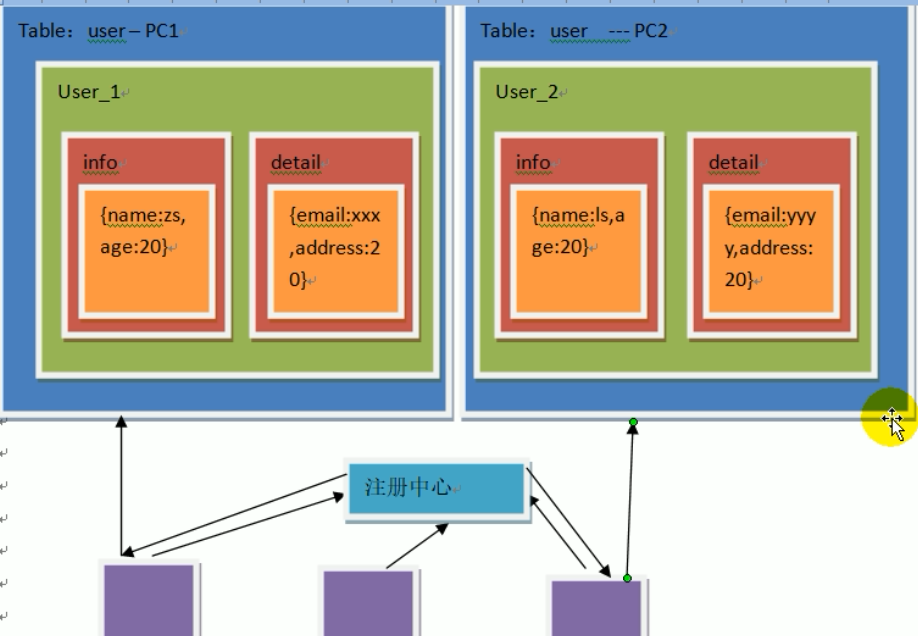
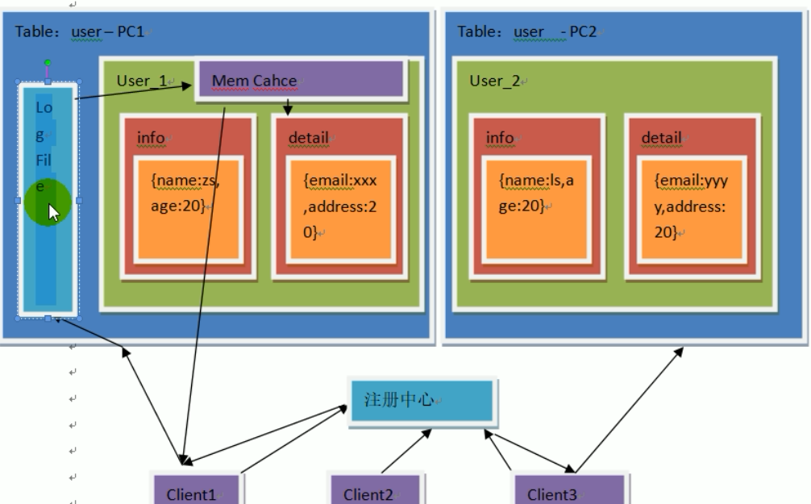
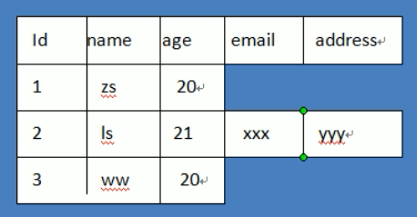

## 表的拆分

- 宽表的列拆分
  - 垂直拆分

 

- 高表
  - 数据量太大：一个表超过1000万，查询效率会低
  - 水平拆分：id不能自增

 

- 增加列
  - 每个表都要加一列？
    - 性能会下降
    - 违反了OCP原则

 

- 缺点：全量修改

合并之后的解决方案

 

- 缺点：修改是全量修改
  - 考虑到修改没有读取频繁，可以接受
- 当user1大量读取时，会影响到user2的读取
  - 需要进行扩展机器，将user1和user2部署在不同的机器上
  - 新问题，用户如何访问
    - 使用注册中心
- 关于引擎
  - InnoDB
    - 对表空间有限制
    - 64TB
  - MyISaM
    - 最大表限制
    - 256TB
- 大数据数量级PB，使用大数据的存储框架，HBase，依托于Hadoop
- 关于数据库的写入操作
  - 先预写到logFile中，顺序写入，速度快
  - 再放入缓存cache中

 

- 稀疏表
  - 列不存在，如{"id":1,"name":"zs","age":20} 存储形式就是稀疏表
  - 传统的mysql表示密集表，即使值不存在也是为空

 

