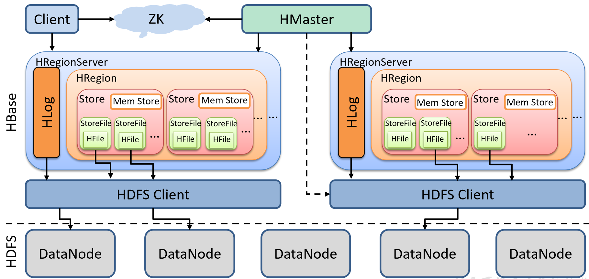

# 是什么

- HBase的原型是Google的BigTable论文，受到了该论文思想的启发

- 作为Hadoop的子项目来开发维护，用于支持结构化的数据存储

- 官方网站：http://hbase.apache.org

- 时间线

  - 2006年Google发表BigTable白皮书
  - 2006年开始开发HBase
  - 2008年HBase成了Hadoop的子项目
  - 2010年HBase成为Apache顶级项目

- 一个==高可靠性、高性能、面向列、可伸缩==的分布式存储系统

  - 高可靠

    - HLog
    - HDFS

  - 高性能

    - MemStore
    - Region

  - 面向列

    - Mysql面向行存储
    - HBase面向列存储
    - 列族
      - info是一个列族
      - 每个列族存储在一个storeFile里
        - 好处，查询一个列族只需要读取一个文件，速度快

     

  - 可伸缩

    - Zookeeper
    - RegionServer

- 利用HBASE技术可在廉价PC Server上搭建起大规模结构化存储集群

- 目标是存储并处理大型的数据

- 仅需使用普通的硬件配置，就能够处理由成千上万的行和列所组成的大型数据

- HBase是Google Bigtable的开源实现，不同之处如下

  - Google Bigtable利用GFS作为其文件存储系统
  - HBase利用Hadoop HDFS作为其文件存储系统
  - Google运行MAPREDUCE来处理Bigtable中的海量数据
  - HBase利用Hadoop MapReduce来处理HBase中的海量数据
  - Google Bigtable利用Chubby作为协同服务
  - HBase利用Zookeeper作为对应

## 特点

- 海量存储
  - HBase适合存储PB级别的海量数据
  - 在PB级别的数据以及采用廉价PC存储的情况下，能在几十到百毫秒内返回数据
  - HBase良好的扩展性，为海量数据的存储提供了便利
- 列式存储
  - 列族存储，HBase是根据==列族==来存储数据的
    - column family
  - 列族下面可以有非常多的列
  - 列族在创建表时必须指定
- 极易扩展
  - 基于上层处理能力（RegionServer）的扩展
  - 基于存储的扩展（HDFS）
  - 通过横向添加RegionSever的机器，进行水平扩展，提升HBase上层的处理能力，提升Hbsae服务更多Region的能力。
- RegionServer的作用是管理region，承接业务的访问
  - 后面会详细的介绍通过横向添加Datanode的机器，进行存储层扩容，提升HBase的数据存储能力和提升后端存储的读写能力
- 高并发
  - 目前大部分使用HBase的架构的都是廉价PC，因此单个IO的延迟其实并不小
    - 一般在几十到上百ms之间
  - 在并发的情况下，HBase的单个IO延迟下降并不，能获得高并发、低延迟的服务
- 稀疏
  - 稀疏主要是针对HBase列的灵活性，在列族中可以指定任意多的列
  - 在列数据为空的情况下，是不会占用存储空间的

## 不足

- 只能通过rowkey进行查询
- 不能像mysql进行某个字段的查询

# 架构

## Client

- 包含了访问HBase的接口
- 维护了对应的cache来加速Hbase的访问
  - 不是一个一个写入，是一批数据的写入
  - 如cache的.META.元数据的信息

## Zookeeper

- HBase通过Zookeeper来做Master的高可用、RegionServer的监控、元数据的入口以及集群配置的维护等工作
  - 通过Zoopkeeper来保证集群中只有1个Master在运行，如果Master异常，会通过竞争机制产生新的Master提供服务
  - 通过Zoopkeeper来监控RegionServer的状态，当RegionSevrer有异常的时候，通过回调的形式通知Master RegionServer上下线的信息
  - 通过Zoopkeeper存储元数据的统一入口地址

## Hmaster

- 为RegionServer分配Region

- 维护整个集群的负载均衡

- 维护集群的元数据信息

- 发现失效的Region，并将失效的Region分配到正常的RegionServer

- 当RegionSever失效的时候，协调对应Hlog的拆分

- 监控RegionServer

- 处理RegionServer故障转移

- 处理元数据的变更

- 处理region的分配或转移

- 在空闲时间进行数据的负载均衡

- 通过Zookeeper发布自己的位置给客户端

  

## HRegionServer

- 直接对接用户的读写请求
  - 管理master为其分配的Region
  - 处理来自客户端的读写请求
  - 负责和底层HDFS的交互，存储数据到HDFS
  - ==负责Region变大以后的拆分==
  - ==负责Storefile的合并工作==
- 负责存储HBase的实际数据
- 处理分配给它的Region
- 刷新缓存到HDFS
- 维护Hlog
- 执行压缩
- 负责处理Region分片

## HDFS

- HDFS为HBase提供最终的底层数据存储服务
- 为HBase提供高可用
  - 提供元数据和表数据的底层分布式存储服务
  - 数据多副本，保证的高可靠和高可用性
- Hlog存储在HDFS

## Write-Ahead logs

- HBase的修改记录，当对HBase读写数据的时候，数据不是直接写进磁盘，它会在内存中保留一段时间
  - 时间以及数据量阈值可以设定
- 把数据保存在内存中可能有更高的概率引起数据丢失，为了解决这个问题，数据会先写在一个叫做 Write-Ahead logfile的文件中，然后再写入内存中
- 在系统出现故障时，数据可通过该日志文件重建

## Region

- Hbase表的分片
- HBase表会根据RowKey值（类似主键）被切分成不同的region存储在RegionServer中
- 在一个RegionServer中可以有多个不同的region

## Store

- HFile存储在Store中
- 一个Store对应HBase表中的一个列族

## MemStore

- 内存存储，位于内存中，用来保存当前的数据操作
- 当数据保存在WAL中之后，RegsionServer会在内存中存储键值对

## StoreFile

- 在磁盘上保存原始数据的实际的物理文件
- 是实际的存储文件
- StoreFile是以Hfile的形式存储在HDFS的
- Hfile是一种文件格式
  - 如txt、orc、parquet等

## 小结

- 等价于MySql中的架构如下
  - 注意HBase的Memstore是在Store中的

 

