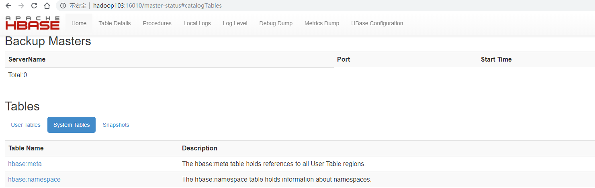

## ZK部署

- 首先保证Zookeeper集群的正常部署，并启动之

```bash
[ttshe@hadoop102 zookeeper-3.4.10]$ bin/zkServer.sh start
[ttshe@hadoop103 zookeeper-3.4.10]$ bin/zkServer.sh start
[ttshe@hadoop104 zookeeper-3.4.10]$ bin/zkServer.sh start
```


## Hadoop部署

- Hadoop集群的正常部署并启动

```bash
[ttshe@hadoop102 hadoop-2.7.2]$ sbin/start-dfs.sh
[ttshe@hadoop103 hadoop-2.7.2]$ sbin/start-yarn.sh
```


## HBase部署

- 上传压缩文件hbase-1.3.1-bin.tar.gz
- 解压缩

```bash
[ttshe@hadoop102 software]$ tar -zxvf hbase-1.3.1-bin.tar.gz -C /opt/module
[ttshe@hadoop102 module]$ mv hbase-1.3.1/ hbase/
```


### 配置


#### hbase-env.sh

- 添加JDK

```bash
export JAVA_HOME=/opt/module/jdk1.8.0_144
# 设置为true，则使用HBase包含的ZK，设置false，使用自己配置的ZK
export HBASE_MANAGES_ZK=false
```


#### hbase-site.xml

```xml
<configuration>
	<!--在hadoop中增加一个hbase的文件夹-->    
    <property>     
        <name>hbase.rootdir</name>     
        <value>hdfs://hadoop102:9000/hbase</value>               
    </property>

    <property>   
        <name>hbase.cluster.distributed</name>
        <value>true</value>
    </property>

    <!-- 0.98后的新变动，之前版本没有.port,默认端口为60000 -->
    <!--下面的是master的端口,网页端口是16010，在master的端口添加10-->
    <property>
        <name>hbase.master.port</name>
        <value>16000</value>
    </property>
    
	<!--ZK的配置-->
    <property>
        <name>hbase.zookeeper.quorum</name>
        <value>hadoop102,hadoop103,hadoop104</value>
    </property>

    <property>   
        <name>hbase.zookeeper.property.dataDir</name>
        <value>/opt/module/zookeeper-3.4.5/zkData</value>
    </property>
</configuration>
```


#### regionservers

- 配置集群地址
- 修改regionservers文件，添加如下hostname

```bash
hadoop102
hadoop103
hadoop104
```


#### 软链接

- HBase基于Hadoop，将Hadoop的配置文件软链接到HBase中

```bash
[ttshe@hadoop102 module]$ ln -s /opt/module/hadoop-2.7.2/etc/hadoop/core-site.xml /opt/module/hbase/conf/core-site.xml
[ttshe@hadoop102 module]$ ln -s /opt/module/hadoop-2.7.2/etc/hadoop/hdfs-site.xml /opt/module/hbase/conf/hdfs-site.xml
```


- 注意需要进行分发

```bash
[ttshe@hadoop102 module]$ xsync hbase
```


### 启动


#### 单节点启动

```bash
[ttshe@hadoop102 hbase]$ bin/hbase-daemon.sh start master
[ttshe@hadoop102 hbase]$ bin/hbase-daemon.sh start regionserver
```

- 提示

- 如果集群之间的节点时间不同步，会导致regionserver无法启动，抛出ClockOutOfSyncException异常

- 修复提示

  - 同步时间服务
  - 属性`hbase.master.maxclockskew`设置更大的值

  ```xml
  <property>
          <name>hbase.master.maxclockskew</name>
          <value>180000</value>
          <description>Time difference of regionserver from master</description>
   </property>
  ```


#### 集群启动

```bash
[ttshe@hadoop103 hbase]$ bin/start-hbase.sh 
starting master, logging to /opt/module/hbase/bin/../logs/hbase-ttshe-master-hadoop103.out
hadoop103: starting regionserver, logging to /opt/module/hbase/bin/../logs/hbase-ttshe-regionserver-hadoop103.out
hadoop102: starting regionserver, logging to /opt/module/hbase/bin/../logs/hbase-ttshe-regionserver-hadoop102.out
hadoop104: starting regionserver, logging to /opt/module/hbase/bin/../logs/hbase-ttshe-regionserver-hadoop104.out

# 注意如果有警告，在hbase-env.sh中说明在JDK1.8下可以注释HBASE_MASTER_OPTS和HBASE_REGIONSERVER_OPTS配置
Java HotSpot(TM) 64-Bit Server VM warning: ignoring option PermSize=128m; support was removed in 8.0
```

- 停止

```bash
[ttshe@hadoop102 hbase]$ bin/stop-hbase.sh
```


#### 查看页面

- 查看jps

```bash
[ttshe@hadoop103 hbase]$ jps
61605 Kafka
125783 NodeManager
78231 Jps
77928 HRegionServer
125482 ResourceManager
125130 DataNode
57949 QuorumPeerMain
77759 HMaster
```

- 启动成功后，可以通过“host:port”的方式来访问HBase管理页面
  - 注意hadoop103是HMaster节点
  - 如http://hadoop103:16010

 