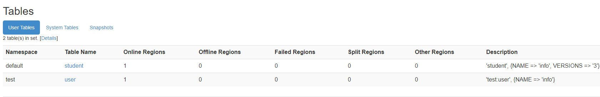

# 基本操作

- 注意删除字符是ctrl+backspace


## shell

- 进入HBase客户端命令行

```bash
[ttshe@hadoop102 hbase]$ bin/hbase shell
```


## help

- 查看帮助命令

```bash
hbase(main):002:0> help
```


## list

- 查看当前数据库中有哪些表

```bash
hbase(main):003:0> list
TABLE                                                                                                                         
0 row(s) in 0.1810 seconds

=> []
```


# 表的操作


## create

- 创建表

```bash
# student是表名，info是列族名称，列是列族的一部分
hbase(main):004:0> create 'student','info'
0 row(s) in 2.4380 seconds

=> Hbase::Table - student
```


- 重复创建表
  - 同一个命名空间不能创建同名的表

```bash
hbase(main):006:0> create 'student','info'

ERROR: Table already exists: student!

Here is some help for this command:
Creates a table. Pass a table name, and a set of column family
specifications (at least one), and, optionally, table configuration.
Column specification can be a simple string (name), or a dictionary
(dictionaries are described below in main help output), necessarily 
including NAME attribute. 
Examples:

Create a table with namespace=ns1 and table qualifier=t1
  hbase> create 'ns1:t1', {NAME => 'f1', VERSIONS => 5}

Create a table with namespace=default and table qualifier=t1
  hbase> create 't1', {NAME => 'f1'}, {NAME => 'f2'}, {NAME => 'f3'}
  hbase> # The above in shorthand would be the following:
  hbase> create 't1', 'f1', 'f2', 'f3'
  hbase> create 't1', {NAME => 'f1', VERSIONS => 1, TTL => 2592000, BLOCKCACHE => true}
  hbase> create 't1', {NAME => 'f1', CONFIGURATION => {'hbase.hstore.blockingStoreFiles' => '10'}}
  
Table configuration options can be put at the end.
Examples:

  hbase> create 'ns1:t1', 'f1', SPLITS => ['10', '20', '30', '40']
  hbase> create 't1', 'f1', SPLITS => ['10', '20', '30', '40']
  hbase> create 't1', 'f1', SPLITS_FILE => 'splits.txt', OWNER => 'johndoe'
  hbase> create 't1', {NAME => 'f1', VERSIONS => 5}, METADATA => { 'mykey' => 'myvalue' }
  hbase> # Optionally pre-split the table into NUMREGIONS, using
  hbase> # SPLITALGO ("HexStringSplit", "UniformSplit" or classname)
  hbase> create 't1', 'f1', {NUMREGIONS => 15, SPLITALGO => 'HexStringSplit'}
  hbase> create 't1', 'f1', {NUMREGIONS => 15, SPLITALGO => 'HexStringSplit', REGION_REPLICATION => 2, CONFIGURATION => {'hbase.hregion.scan.loadColumnFamiliesOnDemand' => 'true'}}
  hbase> create 't1', {NAME => 'f1', DFS_REPLICATION => 1}

You can also keep around a reference to the created table:

  hbase> t1 = create 't1', 'f1'

Which gives you a reference to the table named 't1', on which you can then
call methods.
```

- 在指定命名空间创建表

```bash
hbase(main):008:0> create 'test:user','info'
0 row(s) in 1.3020 seconds
=> Hbase::Table - test:user
```



- 查看hdfs


## put

- 新增数据
- 修改数据
- `put <表名>,<rowkey>,<列族:列名称>,<列的值>`

```bash
hbase(main):008:0> put 'student','1001','info:name','zhangsan'
0 row(s) in 0.1940 seconds
hbase(main):004:0> put 'student','1001','info:age','18'
hbase(main):005:0> put 'student','1002','info:name','Janna'
hbase(main):006:0> put 'student','1002','info:sex','female'
hbase(main):007:0> put 'student','1002','info:age','20'
```


## scan

- 扫描查看表数据

```bash
hbase(main):013:0> scan 'student'
ROW                              COLUMN+CELL                                           
 1001                            column=info:age, timestamp=1569157721256, value=18       
 1001                            column=info:name, timestamp=1569157580652,value=zhangsan
 1002                            column=info:age, timestamp=1569157744257, value=20       
 1002                            column=info:name, timestamp=1569157731053, value=Janna   
 1002                            column=info:sex, timestamp=1569157739532, value=female
```

- 按照rowkey进行查询
  - 注意rowkey过滤是字符串比较

```bash
hbase(main):015:0> scan 'student',{STARTROW => '1001', STOPROW  => '1001'}
ROW                              COLUMN+CELL     
 1001                            column=info:age, timestamp=1569157721256, value=18
 1001                            column=info:name, timestamp=1569157580652,value=zhangsan
```

```bash
hbase(main):017:0> scan 'student',{STARTROW => '1002'}
ROW                              COLUMN+CELL
 1002                            column=info:age, timestamp=1569157744257, value=20       
 1002                            column=info:name, timestamp=1569157731053, value=Janna
 1002                            column=info:sex, timestamp=1569157739532, value=female
```


## describe

- 查看表结构

```bash
hbase(main):018:0> describe 'student'
Table student is ENABLED                              
student  
COLUMN FAMILIES DESCRIPTION                          
{NAME => 'info', BLOOMFILTER => 'ROW', VERSIONS => '1', IN_MEMORY => 'false', KEEP_DELETED_CELLS => 'FALSE', DATA_BLOCK_ENCODING => 'NONE', TTL => 'FOREVER', COMPRESSION => 'NONE', MIN_VERSIONS => '0', BLOCKCACHE => 'true', BLOCKSIZE => '65536', REPLICATION_SCOPE => '0'}
```


## get

- 查看“指定行”或“指定列族:列”的数据
  - 列不存在，不报错
  - 列族不存在，报错

```bash
hbase(main):019:0> get 'student','1001'
COLUMN                           CELL
 info:age                        timestamp=1569157721256, value=18
 info:name                       timestamp=1569157580652, value=zhangsan

hbase(main):020:0> get 'student','1001','info:name'
COLUMN                           CELL
 info:name                       timestamp=1569157580652, value=zhangsan

hbase(main):021:0> get 'student','1001','info:name2'
COLUMN                           CELL

hbase(main):022:0> get 'student','1001','info1:name'
COLUMN                           CELL
ERROR: org.apache.hadoop.hbase.regionserver.NoSuchColumnFamilyException: Column family info1 does not exist in region student,,1569156812959.ef591b787b4e0028f796129b13f4d798. in table 'student', {NAME => 'info', BLOOMFILTER => 'ROW', VERSIONS => '1', IN_MEMORY => 'false', KEEP_DELETED_CELLS => 'FALSE', DATA_BLOCK_ENCODING => 'NONE', TTL => 'FOREVER', COMPRESSION => 'NONE', MIN_VERSIONS => '0', BLOCKCACHE => 'true', BLOCKSIZE => '65536', REPLICATION_SCOPE => '0'}
```

```bash
hbase(main):022:0> get 'student','1001',{COLUMN=>'info:name',VERSIONS=>3}
COLUMN                           CELL
 info:name                       timestamp=1569159970828, value=w04
 info:name                       timestamp=1569159965399, value=w03
 info:name                       timestamp=1569159957071, value=w02
```


## count

- 统计表数据行数

```bash
hbase(main):023:0> count 'student'
2 row(s) in 0.0280 seconds
=> 2
```


## alter

- 变更表信息
  - 将info列族中的数据存放3个版本
    - 等价于历史记录
    - 每个cell可以有多个版本

```bash
hbase(main):022:0> alter 'student',{NAME=>'info',VERSIONS=>3}
hbase(main):022:0> get 'student','1001',{COLUMN=>'info:name',VERSIONS=>3}
COLUMN                           CELL
 info:name                       timestamp=1569159970828, value=w04
 info:name                       timestamp=1569159965399, value=w03
 info:name                       timestamp=1569159957071, value=w02
```

- 注意每次put会将最后的一条替换掉，按照时间timestamp判断


## deleteall

- 删除某rowkey的全部数据

```bash
hbase(main):025:0> deleteall 'student','1001'
```


## delete

- 删除某rowkey的某一列数据

```bash
hbase(main):024:0> delete 'student','1001','info:name'
```


## truncate

- 清空表数据
  - 操作顺序为先disable，然后再truncate

```bash
hbase(main):027:0> truncate 'student'
Truncating 'student' table (it may take a while):
 - Disabling table...
 - Truncating table...
0 row(s) in 3.3980 seconds
```


## disable

- 修改表为disable状态

```bash
hbase(main):028:0> disable 'student'
```

```bash
hbase(main):030:0> describe 'student'
Table student is DISABLED
```


## drop

- 首先需要先让该表为disable状态
- 然后才能drop这个表
  - 如果直接drop表，会报错
    - ERROR: Table student is enabled. Disable it first

```bash
hbase(main):031:0> drop 'student'
```


# 命名空间操作


## list_namespace

```bash
hbase(main):006:0> list_namespace
NAMESPACE
default
# 系统表的命名空间
hbase                                                                               
```


## create_namespace

```bash
hbase(main):007:0> create_namespace 'test'
0 row(s) in 0.9880 seconds
```


## drop_namespace

- 当命名空间中有表，则删除会报错

```bash
hbase(main):009:0> drop_namespace 'test'

ERROR: org.apache.hadoop.hbase.constraint.ConstraintException: Only empty namespaces can be removed. Namespace test has 1 tables
```

