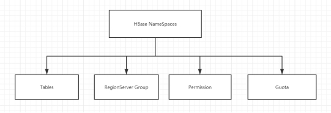

# 数据结构

## RowKey

- ==使用rowKey对关键字进行查询==
  - 要设计好rowKey，最大64K

- 与nosql数据库们一样,RowKey是用来检索记录的主键
- 访问HBASE table中的行
  - 通过单个RowKey访问
  - 通过RowKey的range（正则）
    - 在初始只有一个Region情况下
    - startKey：负无穷
      - endKey：正无穷
    - 如果有多个Region，则startKey和endKey会再次细分
  - 全表扫描
- RowKey行键可以是任意字符串
  - 最大长度是64KB，实际应用中长度一般为 10-100B
- 在HBASE内部RowKey保存为字节数组
  - 存储时，数据按照RowKey的字典序排序存储
    - byte order
    - 升序
  - 设计RowKey时要充分考虑==排序存储==这个特性，将经常一起读取的行存储放到一起
    - 位置相关性

## Column Family

- 列族
  - HBASE表中的每个列，都归属于某个列族
- 列族是表的schema的一部分
  - 列不是
- 必须在使用表之前定义
- 列名都以列族作为前缀
  - 如 courses:history，courses:math都属于courses 这个列族

## Cell

- 由{rowkey, column Family:column,[version]} 唯一确定的单元
- cell中的数据是没有类型的
  - 全部是字节码形式存储
    - 有利于压缩
- 关键字
  - 无类型
  - 字节码

## Time Stamp

- HBASE 中通过rowkey和columns确定的为一个存贮单元称为cell

- 每个 cell都保存着同一份数据的多个版本

  - 版本通过时间戳来索引

- 时间戳的类型是 64位整型

- 时间戳可由HBASE在数据写入时自动赋值

  - 精确到毫秒的当前系统时间

- 时间戳也可由客户显式赋值

  - 如果应用程序要避免数据版本冲突，就必须自己生成具有唯一性的时间戳

- 每个cell中，不同版本的数据按照时间倒序排序

- 为了避免数据存在过多版本的管理负担

  - HBase提供了2种数据版本回收方式
    - 保存数据的最后n个版本
    - 保存最近一段时间内的版本
  - 可以对每个列族进行设置

  

## NameSpace

 

- Table
  - 表
  - 所有的表都是命名空间的成员
  - 表必属于某个命名空间
    - 如果没有指定，则在default默认的命名空间中
- RegionServer group
  - 一个命名空间包含了默认的RegionServer Group
- Permission
  - 权限
  - 命名空间能够让我们来定义访问控制列表ACL（Access Control List）
    - 如，创建表，读取表，删除，更新等等操作
- Quota
  - 限额
  - 可强制一个命名空间包含的region(表)的数量